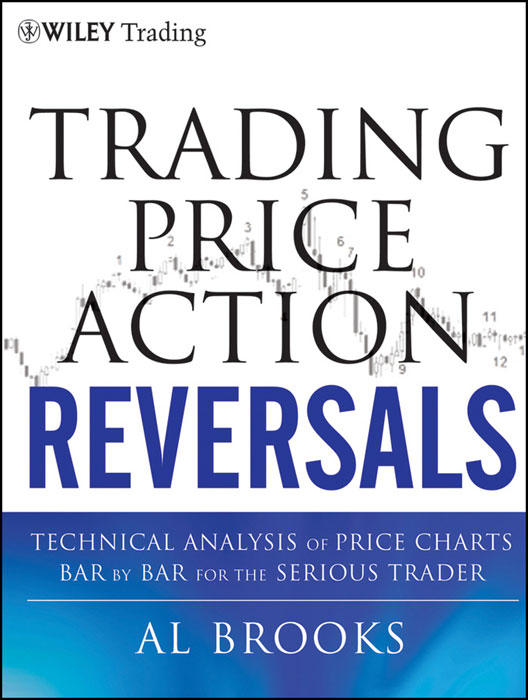
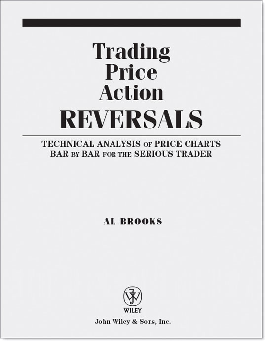

目录

[封面](#9781118172308_epub_cov.htm)

[系列丛书](#9781118172308_epub_fm_01.htm)

[书名页](#9781118172308_epub_fm_02.htm)

[版权页](#9781118172308_epub_fm_03.htm)

[献词](#9781118172308_epub_fm_04.htm)

[致谢](#9781118172308_epub_fm_05.htm)

[本书术语列表](#9781118172308_epub_fm_06.htm)

[引言](#9781118172308_epub_ch_00.htm)

[怎样阅读这套书](#9781118172308_epub_ch_00.htm_intro-sec1-0001)

[强势信号：趋势、突破、反转K线与反转](#9781118172308_epub_ch_00.htm_intro-sec1-0002)

[K线计数基础：高 1、高 2、低 1、低 2](#9781118172308_epub_ch_00.htm_intro-sec1-0003)

[第一部分 趋势反转：从一个趋势转变为相反趋势](#9781118172308_epub_p_01.htm)

[第 1 章 反转交易示例](#9781118172308_epub_ch_01.htm)

[第 2 章 反转中的强势信号](#9781118172308_epub_ch_02.htm)

[第 3 章 主要趋势反转（MTR）](#9781118172308_epub_ch_03.htm)

[第 4 章 高潮反转：一段急速走势之后紧接反方向的急速走势](#9781118172308_epub_ch_04.htm)

[第 5 章 楔形及其他三连推反转形态](#9781118172308_epub_ch_05.htm)

[第 6 章 扩展三角形](#9781118172308_epub_ch_06.htm)

[第 7 章 最终旗形](#9781118172308_epub_ch_07.htm)

[第 8 章 双顶回调与双底回调](#9781118172308_epub_ch_08.htm)

[第 9 章 失败形态](#9781118172308_epub_ch_09.htm)

[第 10 章 日线图上的巨量反转](#9781118172308_epub_ch_10.htm)

[第二部分 日内交易](#9781118172308_epub_p_02.htm)

[第 11 章 一天中的关键时段](#9781118172308_epub_ch_11.htm)

[第 12 章 市场](#9781118172308_epub_ch_12.htm)

[第 13 章 时间周期与图表类型](#9781118172308_epub_ch_13.htm)

[第 14 章 Globex、盘前、盘后与隔夜市场](#9781118172308_epub_ch_14.htm)

[第 15 章 Always In](#9781118172308_epub_ch_15.htm)

[第 16 章 极端剥头皮](#9781118172308_epub_ch_16.htm)

[第三部分 第一个小时（开盘区间）](#9781118172308_epub_p_03.htm)

[第 17 章 与盘前相关的形态](#9781118172308_epub_ch_17.htm)

[第 18 章 与前一日相关的形态：突破、突破回调与失败的突破](#9781118172308_epub_ch_18.htm)

[第 19 章 开盘形态与反转](#9781118172308_epub_ch_19.htm)

[第 20 章 缺口开盘：反转与延续](#9781118172308_epub_ch_20.htm)

[第四部分 融会贯通](#9781118172308_epub_p_04.htm)

[第 21 章 日内交易详细案例](#9781118172308_epub_ch_21.htm)

[第 22 章 日线、周线与月线图](#9781118172308_epub_ch_22.htm)

[第 23 章 期权](#9781118172308_epub_ch_23.htm)

[第 24 章 最佳交易：融会贯通](#9781118172308_epub_ch_24.htm)

[第 25 章 交易指南](#9781118172308_epub_ch_25.htm)

[关于作者](#9781118172308_epub_bm_01.htm)

[关于配套网站](#9781118172308_epub_bm_02.htm)

[索引](#9781118172308_epub_bm_03.htm)

John Wiley & Sons 成立于 1807 年，是美国历史最悠久的独立出版公司。公司在北美、欧洲、澳大利亚和亚洲均设有分支机构，专注于开发和推广纸质及电子产品与服务，帮助客户提升专业知识与个人素养。

Wiley Trading 系列丛书汇集了一批历经市场变迁依然存活并持续盈利的交易员的著作——他们有的重新创造了交易系统，有的回归了交易基本功。无论你是新手、专业交易员，还是介于两者之间，这套丛书都能为你提供实用的建议和策略，帮助你在当下和未来持续获利。

完整书目请访问 [www.WileyFinance.com](http://www.WileyFinance.com)。

版权所有 © 2012 Al Brooks。保留所有权利。

本书第一版书名为 *Reading Price Charts Bar by Bar: The Technical Analysis of Price Action for the Serious Trader*，于 2009 年出版。

由 John Wiley & Sons, Inc. 出版，地址：Hoboken, New Jersey。同步在加拿大发行。

所有图表均使用 TradeStation 制作。TradeStation Technologies, Inc. 保留所有权利。

未经出版商事先书面许可，不得以任何形式——电子、机械、影印、录制、扫描或其他方式——复制、存储或传播本出版物的任何部分，但 1976 年《美国版权法》第 107 条或第 108 条允许的情况除外。如需通过付费获得单次复制授权，请联系 Copyright Clearance Center, Inc.（222 Rosewood Drive, Danvers, MA 01923，电话 (978) 750-8400，传真 (978) 646-8600，网址 [www.copyright.com](http://www.copyright.com)）。如需向出版商申请许可，请联系 John Wiley & Sons, Inc. 权限部门，地址：111 River Street, Hoboken, NJ 07030，电话 (201) 748-6011，传真 (201) 748-6008，或在线申请：[http://www.wiley.com/go/permissions](http://www.wiley.com/go/permissions)。

责任限制/免责声明：出版商和作者在编写本书时已尽最大努力，但不对书中内容的准确性或完整性作任何明示或暗示的保证，尤其不承担关于适销性或特定用途适用性的默示保证。销售代表或书面销售材料均不得创设或延伸任何保证。本书所含建议和策略未必适合你的具体情况，必要时应咨询专业人士。出版商和作者均不对利润损失或其他任何商业损失承担责任，包括但不限于特殊损失、附带损失、后果性损失或其他损失。

如需了解其他产品和服务的信息或获取技术支持，美国境内请致电 (800) 762-2974，美国境外请致电 (317) 572-3993 或传真 (317) 572-4002。

Wiley 的图书也提供多种电子格式。部分纸质版内容可能不包含在电子版中。更多 Wiley 产品信息请访问 [www.wiley.com](http://www.wiley.com)。

***国会图书馆编目数据：***

Brooks, Al, 1952--
Trading price action reversals : technical analysis of price charts for the serious trader / Al Brooks.
p. cm. -- (The Wiley trading series)
"The first edition of this book titled, Reading price charts bar by bar : the technical analysis of price action for the serious trader, was published in 2009"--T.p. verso.
Includes index.
ISBN 978-1-118-06661-4 (cloth); ISBN 978-1-118-17228-5 (ebk);
ISBN 978-1-118-17229-2 (ebk); ISBN 978-1-118-17230-8 (ebk)
1. Stocks--Prices--Charts, diagrams, etc.I. Brooks, Al, 1952-- Reading price charts bar by bar.II. Title.
HG4638.B757 2012
332.63′2042--dc23
2011029299

谨以此书献给我的女儿 Meegan Brooks。她勇于冒险、无所畏惧、专注而睿智，以她的果敢、务实和满腔热情，让我们的社会变得更好。23 年前 Meegan 出生的那一天，是我这辈子最幸福的日子，永远都是。

致谢

写这套书的首要目标，是全面系统地讲清楚价格行为。读者对前作《Reading Price Charts Bar by Bar》最集中的反馈就是太难读了。我非常感激所有提出建设性意见的读者，以及每天参加我实时网络研讨会的朋友们。很多意见极具洞察力，我已经把它们融入到这一版中。同样要感谢所有参加过我实盘交易室的交易员，正是因为他们，我才有机会把同样的内容反复讲述，直到能清晰表达出自己看到的和正在做的事情。他们提出的大量问题也帮我找到了更准确的措辞，这些措辞都写进了这套书里。

我要特别感谢 Victor Brancale，他花了大量时间校对书稿，提出了数百条非常有价值的修改建议；感谢 Robert Gjerde，他搭建并维护我的网站，还对聊天室和网站给出了坦率的反馈。最后，我要感谢《Futures》杂志的集团编辑总监 Ginger Szala，她不断给我发表文章和做网络研讨会的机会，还经常给我提供很实用的建议，帮助我更深入地融入交易社区。

本书术语表

以下所有术语的定义都从实战角度出发，以对交易员有用为准，不一定遵循技术分析教科书里的理论定义。

**Always In** 如果你必须时刻持有仓位——要么做多要么做空——那么你当前的持仓方向就是 Always In 的方向（Always In 做多或 Always In 做空）。如果在任何时刻你被迫在做多和做空之间二选一，并且对自己的判断有信心，那么市场在那个时刻就处于 Always In 模式。这类交易几乎都需要先出现一波顺势急速推进，交易员才会有信心入场。

**铁丝网形态** 由3根或更多K线组成的交易区间，K线之间大面积重叠，其中至少有一根是十字星。这是一种窄幅交易区间，影线突出，K线往往相对较大。

**回调** 在上涨波段中，回调是指某根K线的低点低于前一根K线的低点。在下跌波段中，回调是指某根K线的高点高于前一根K线的高点。

**空头反转** 趋势从上涨转为下跌（进入空头趋势）。

**爆仓** 账户亏损到低于经纪商设定的最低保证金要求，除非追加资金，否则无法继续交易。

**突破** 当前K线的高点或低点超越了之前某个重要价位，比如波段高点或低点、任何前期K线的高低点、趋势线或趋势通道线。

**突破K线** 产生突破的那根K线，通常是一根强趋势K线。

**突破模式** 一种建仓形态，无论向哪个方向突破，都应该会有跟随。

**突破回调** 突破发生后几根K线内出现的一次小幅回调，通常为1到5根K线。既然你把它看作回调，就说明你预期突破会延续，这次回调就是延续行情的建仓形态。如果你认为突破会失败，就不会用"回调"这个词，而会把它看作一次失败的突破。举个例子，如果市场向上突破了一条空头趋势线、走了5根K线，但你判断空头趋势还会延续，你就会把这段上涨看成一个熊旗、考虑做空，而不会在价格向下突破后去找做多回调的机会。

**突破回测** 一种突破回调，价格回到接近最初入场价的位置，测试盈亏平衡点的止损。可能略微超过或不及那个价位几个 Tick。突破回测可以在入场后1到2根K线内发生，也可以在一段延伸行情之后发生，甚至在20根或更多K线之后才出现。

**多头反转** 趋势从下跌转为上涨（进入多头趋势）。

**买压** 强势多头在积极出手，他们的买入制造出多头趋势K线、底部带影线的K线，以及两K线多头反转形态。这种力量具有累积效应，通常最终会推动价格走高。

**K线** 一种图表表示法，实体是开盘价与收盘价之间的区域。如果收盘价高于开盘价，就是阳线，显示为白色；如果低于开盘价，就是阴线，显示为黑色。实体上方和下方的细线叫做影线（有些技术分析师称之为灯芯或阴影）。

**图表类型** 折线图、柱状图、K线图、成交量图、Tick 图或其他类型的图表。

**高潮** 行情在某个方向走得太快太远，随后反转——要么进入交易区间，要么转向相反趋势。大多数高潮以趋势通道过冲后反转的方式结束，但其中大部分反转只是形成交易区间，而非真正的反向趋势。

**逆势** 与当前趋势（即当前 Always In 的方向）相反的交易或建仓形态。对大多数交易员来说这是一种亏钱的策略，因为风险通常至少和回报一样大，而概率又很少高到能让交易者方程有利。

**逆势刮头皮** 判断趋势还没走完、但预计会有一波小回调时，逆势入场去抓那一小段利润。这通常是个错误，应该避免。

**日内交易** 计划在入场当天就平仓的交易。

**方向概率** 在市场向反方向运动一定 Tick 数之前，先向某个方向运动任意 Tick 数的概率。如果观察的是上下等距的运动幅度，这个概率大多数时候在50%左右徘徊。也就是说，市场先涨 X 个 Tick 再跌 X 个 Tick 的概率大约是50%，先跌 X 个 Tick 再涨 X 个 Tick 的概率也大约是50%。

**十字星** 实体很小或几乎没有实体的K线。在5分钟图上，实体可能只有1到2个 Tick；但在日线图上，实体可能有10个甚至更多 Tick，看起来仍然几乎不存在。多头和空头都没有控制住这根K线。所有K线要么是趋势K线，要么是非趋势K线，这些非趋势K线就叫十字星。

**双底** 一种图表形态，当前K线的低点与之前某个波段低点大致相同。之前那个低点可能仅在1根K线之前，也可能在20根甚至更多K线之前。双底不一定出现在当日最低点，它经常出现在牛旗中（双底牛旗）。

**双底牛旗** 多头趋势中的一种暂停或牛旗形态，价格两次下探到差不多相同的价位，然后反转，重新回到多头趋势。

**双底回调** 一种做多建仓形态，由一个双底加上随后的深度回调构成，回调形成一个更高低点（HL）。

**双顶** 一种图表形态，当前K线的高点与之前某个波段高点大致相同。之前那个高点可能仅在1根K线之前，也可能在20根甚至更多K线之前。双顶不一定出现在当日最高点，它经常出现在熊旗中（双顶熊旗）。

**双顶熊旗** 空头趋势中的一种暂停或熊旗形态，价格两次上冲到差不多相同的价位，然后反转，重新回到空头趋势。

**双顶回调** 一种做空建仓形态，由一个双顶加上随后的深度回调构成，回调形成一个更低高点（LH）。

**提前做多者** 在多头信号K线还在形成过程中就买入的交易员，而不是等信号K线收盘后在其高点上方1个 Tick 处挂买入突破单入场。

**提前做空者** 在空头信号K线还在形成过程中就卖出的交易员，而不是等信号K线收盘后在其低点下方1个 Tick 处挂卖出突破单入场。

**优势** 交易者方程为正的建仓形态。交易这种形态时，交易员在概率上拥有数学意义的有利条件。优势总是很小且转瞬即逝，因为对手盘也是聪明的交易者，他们不会让任何优势变得大且持久。

**EMA** 见*指数移动均线（EMA）*。

**入场K线** 交易被执行的那根K线。

**指数移动均线（EMA）** 本书图表使用20周期的指数移动均线，但任何均线都可能有用。

**押注失败** 做与当前趋势方向相反的交易（比如，在你预期会失败并向下反转的多头突破中做空）。

**失败的失败** 一个失败本身又失败了，价格恢复原来突破的方向，因此变成了突破回调。由于这是第二次信号，可靠性更高。举例来说，如果价格向上突破一个交易区间，突破后的那根K线是空头反转K线，市场跌破该K线低点，那么突破就失败了。如果随后几根K线内市场又涨过之前某根K线的高点，那么这个失败的突破本身又失败了，突破重新恢复。这意味着失败的突破变成了一个小牛旗，只是突破后的一次回调。

**失败（失败的运动）** 在剥头皮者的利润被锁定或交易目标达成之前，保护性止损就被触发的走势，通常导致价格反向运动，因为被套的交易者被迫亏损出场。目前在 Emini 中，剥头皮者的目标是4个 Tick，通常需要6个 Tick 的运动幅度；在 QQQ 中，目标是10美分，通常需要12美分的运动幅度。

**假（false）** 失败。

**5 Tick 的失败** Emini 中一笔交易在信号K线之后运动了5个 Tick 然后反转。例如，牛旗突破后涨了5个 Tick，当该K线收盘后，下一根K线的低点更低。大多数以1个点为利润目标的限价单都不会被成交，因为价格通常需要比挂单价位多走1个 Tick 才能成交。这往往构成一个反向交易的建仓形态。

**空仓** 指交易员当前没有持有任何仓位。

**跟随** 在初始运动（如突破）之后，出现一根或多根K线延续该运动方向。交易员希望看到下一根K线以及随后数根K线都有跟随，期望形成趋势以赚取更多利润。

**跟随K线** 在入场K线之后产生跟随的K线；通常是紧接着的下一根K线，有时会在几根K线之后才出现。

**分形** 每一种形态都是更高时间周期图表上某个形态的分形。也就是说，每一种形态在更高时间周期上都是微型形态，而每一种微型形态在更低时间周期上都是标准形态。

**缺口** 图表上任意两根K线之间的空白区域。开盘缺口很常见——当日第一根K线的开盘价高于或低于前一根K线（即前一日最后一根K线）的高点或低点，或者超出前一整日的高低范围，就构成开盘缺口。均线缺口是指某根K线的低点位于一条走平或下降的均线上方，或者某根K线的高点位于一条走平或上升的均线下方。传统缺口（突破型、测量型、衰竭型）出现在日线图上，在日内图表上则以各种趋势K线的形式体现。

**缺口K线** 参见*均线缺口K线*。

**缺口反转** 当前K线回到缺口内部、超出前一根K线一个 Tick 的形态。比如，开盘跳空高开后，当日第二根K线跌破第一根K线低点一个 Tick，就是一个缺口反转。

**高频交易** 参见*高频交易（HFT）*。

**HH** 高于前一个波段高点的波段高点。

**HL** 高于前一个波段低点的波段低点。

**高时间周期（HTF）** 覆盖与当前图表相同时间跨度、但K线数量更少的图表。举例来说，相比日盘 5 分钟 Emini 图表（普通交易日约 81 根K线），高时间周期图表包括 15 分钟图、每根K线包含 25,000 个 Tick 的 Tick 图、每根K线包含 10 万张合约的成交量图（这些图表在普通交易日通常不到 30 根K线）。

**高频交易（HFT）** 也叫算法交易或黑盒交易，是程序化交易的一种。高频交易公司每天在上千只股票上下数百万笔订单，目标是赚到哪怕一美分的利润，交易决策基于统计分析而非基本面。

**高/低 1 或 2** 指高 1 或高 2，或者低 1 或低 2。

**高 1、2、3、4** 高 1 是牛旗中或交易区间底部附近，高点高于前一根K线高点的那根K线。如果之后出现一根高点更低的K线（中间可以间隔一根或多根K线），接下来这段回调中第一根高点高于前一根K线高点的K线就是高 2。第三次和第四次出现分别是高 3 和高 4。高 3 是楔形牛旗的一种变体。

**HTF** 参见*高时间周期（HTF）*。

**ii** 连续两根内包K线，第二根被第一根包含。出现在一段走势末端时，它是一个突破模式建仓形态，可能演变为旗形或反转建仓形态。可靠性较低的版本是"仅看实体的 ii"——忽略影线，只要第二根实体被第一根实体包含、第一根实体又被前面那根实体包含即可。

**iii** 连续三根内包K线，可靠性比 ii 稍高。

**内包K线** 高点等于或低于前一根K线高点，同时低点等于或高于前一根K线低点的K线。

**机构** 也叫聪明钱，可以是养老基金、对冲基金、保险公司、银行、券商、大户，或者任何交易量大到足以影响市场的主体。市场走势是众多机构交易行为的累积效果，单个机构通常很难长时间撼动一个主要市场。传统机构根据基本面下单，过去它们是决定市场方向的唯一力量。但现在高频交易公司对日内走势有显著影响，因为它们的交易量占了当日成交量的大部分。高频交易公司是一类特殊的机构，交易决策基于统计而非基本面。传统机构决定方向和目标价位，数学家则决定市场到达目标的路径。

**ioi** 内包-外包-内包——连续三根K线，第二根是外包K线，第三根是内包K线。它通常是一个突破模式建仓形态，交易员会在内包K线上方买入或在其下方卖出。

**Ledge** 多头 Ledge 是底部由两根或更多低点相同的K线构成的小型交易区间；空头 Ledge 是顶部由两根或更多高点相同的K线构成的小型交易区间。

**腿** 突破任意级别趋势线的一小段趋势；只有图表上至少存在两段这样的走势时才用这个术语。它是大趋势中任何较小的趋势，可以是回调（逆势运动）、趋势或横盘中的一个波段，也可以是趋势中两次回调之间的顺势运动。

**可能（60%+）** 至少 60% 的把握。

**多头** 买入头寸的人，或该头寸本身。

**手** 某个市场中可交易的最小头寸单位。在股票中是一股，在 Emini 或其他期货中是一张合约。

**LH** 低于前一个波段高点的波段高点。

**LL** 低于前一个波段低点的波段低点。

**低 1, 2, 3, 4** 低 1 是指在熊旗中或交易区间顶部附近，低点低于前一根K线低点的那根K线。之后若出现一根低点抬高的K线（中间可以间隔一根或几根K线），接下来这轮回调中再次出现低点跌破前一根K线低点的K线，就是低 2。第三次和第四次出现的分别是低 3 和低 4。低 3 是楔形熊旗的一种变体。

**主要趋势线** 能涵盖屏幕上大部分价格行为的趋势线，画线时通常选取相距至少 10 根K线的两个点。

**主要趋势反转（MTR）** 从多头趋势转为空头趋势，或从空头趋势转为多头趋势。建仓形态必须包含趋势线被突破后对旧趋势极值点的测试。

**崩跌** 空头急速阶段或窄空头通道中出现的抛售，没有明显的回调，跌幅超出基本面所能合理解释的范围。

**逼空式上涨** 多头急速阶段或窄多头通道中出现的拉升，没有明显的回调，涨幅超出基本面所能合理解释的范围。

**微形** 任何传统形态都可以在大约 1 到 5 根K线内形成，仍然有效，只是容易被忽略。这类形态就是传统形态的微形版本。每个微形形态在更低时间周期图表上都是一个传统形态，每个传统形态在高时间周期图表上也都是一个微形形态。

**微型通道** 非常紧凑的通道，大多数K线的高点和低点都触及趋势线，通常也触及趋势通道线。这是窄通道的最极端形式，没有回调或只有一两次小幅回调。

**微型双底** 连续或几乎连续的K线，低点处于接近相同的价格。

**微型双顶** 连续或几乎连续的K线，高点处于接近相同的价格。

**微型测量缺口** 一根强趋势K线前后的K线没有价格重叠时，就是强势信号，通常会带来测量移动。例如，一根强多头趋势K线出现后，如果后一根K线的低点等于或高于前一根K线的高点，那么这个低点与高点的中点就是微型测量缺口。

**微型趋势通道线** 沿 3 到 5 根连续K线的高点或低点画出的趋势通道线。

**微型趋势线突破** 任何时间周期上，用大约 2 到 10 根K线画出的趋势线，其中大部分K线触及或接近该趋势线，然后有一根K线假突破穿越趋势线。这个假突破构成一个顺势入场机会。如果在一两根K线内失败，通常就会出现逆势交易机会。

**资金止损** 基于固定金额或固定点数设置的止损，比如 Emini 上 2 个点或股票上 1 美元。

**均线** 本书图表使用 20 周期指数均线，但任何均线都可以有用。

**均线缺口K线（缺口K线）** 没有触及均线的K线，K线与均线之间的空间就是缺口。强趋势中首次回调形成的均线缺口K线，通常会随后测试趋势极值点。例如，在强多头趋势中，某次回调终于出现一根高点低于均线的K线，这通常是一个做多的建仓形态，目标是测试趋势高点。

**嵌套** 有时一个形态内部包含一个更小的同类形态。例如，头肩顶的右肩本身常常就是一个小型头肩顶或双顶。

**新闻** 媒体为了卖广告、给媒体公司赚钱而制造的无用信息。跟交易毫无关系，根本无法评估，应该一律忽略。

**oio** 外包K线—内包K线—外包K线，即一根外包K线后面跟一根内包K线，再跟一根外包K线。

**oo** 外包K线—外包K线，即一根外包K线后面跟一根更大的外包K线。

**开盘反转** 开盘后大约一小时内出现的反转。

**外包K线** 高点高于或等于前一根K线的高点，同时低点低于前一根K线低点的K线；或者低点低于或等于前一根K线的低点，同时高点高于前一根K线高点的K线。

**外包阴线** 收盘价低于开盘价的外包K线。

**外包阳线** 收盘价高于开盘价的外包K线。

**过冲** 市场价格超越了先前的重要价位，比如波段点或趋势线。

**暂停K线** 没有延续趋势的K线。在多头趋势中，暂停K线的高点等于或低于前一根K线的高点，或者是一根小K线、高点仅比前一根K线高出约 1 个 tick，而前一根K线是强多头趋势K线。暂停K线属于回调的一种。

**pip** 外汇市场中的 tick。不过有些数据供应商会多提供一位小数，这个额外的小数位应该忽略。

**追涨（多头加仓）** 多头趋势中，多头在急速上涨阶段以及市场突破新高时加仓做多，因为他们预期还会有一段上涨腿，大约达到测量移动的目标。

**杀跌（空头加仓）** 在空头趋势中，空方会在急速下跌阶段以及价格突破新低时加仓做空，因为他们预期还会出现下一腿下跌，目标大约在测量移动的位置。

**价格行为** 任何图表类型或时间周期上的价格变化。

**概率** 成功的可能性。举例来说，如果一个交易员回顾某种建仓形态最近 100 次触发的交易，发现其中 60 次盈利，那么这个建仓形态的成功概率大约是 60%。由于影响因素众多，永远无法全部测试到，所以概率只是近似值，有时甚至会产生很大的误导。

**可能 (60%+)** 至少 60% 的把握。

**回调** 趋势、波段或腿中一段暂时的停顿或逆势运动，不会回撤超过该趋势、波段或腿的起点。本质上是一个小型交易区间，交易员预期趋势很快会恢复。比如，空头回调是空头趋势、波段或腿中一段横盘至上行的运动，之后至少会测试前低。它可以小到仅比前一根K线高点高出 1 个 Tick，甚至只是一根内包K线这样的暂停。

**回调K线** 至少反转前一根K线 1 个 Tick 的K线。在多头趋势中，指低点低于前一根K线低点的K线。

**合理的** 交易者方程有利的建仓形态。

**反转** 行情转向相反方向。大多数技术分析师用这个词指从多头趋势转为空头趋势，或从空头趋势转为多头趋势。不过，交易区间的行为与趋势行为也是相反的，因此趋势转变为交易区间同样算反转。交易区间转变为趋势也是反转，但通常称为突破。

**反转K线** 与当前趋势方向相反的趋势K线。当空头腿向上反转时，多头反转K线就是一根多头趋势K线，经典描述包括底部有影线、收盘高于开盘且接近顶部。空头反转K线则是多头腿中的一根空头趋势K线，传统描述包括顶部有影线、收盘低于开盘且接近底部。

**回报** 交易员预期从一笔交易中赚到的 Tick 数。比如，如果交易员用限价单在利润目标位出场，回报就是入场价到利润目标之间的 Tick 数。

**风险** 从入场价到保护性止损之间的 Tick 数。这是交易反向运动时交易员最少会亏损的金额（滑点等因素可能导致实际风险大于理论风险）。

**风险规避** 当交易员认为股市会下跌时，他们会变得厌恶风险，卖出波动大的股票和货币，转入避险资产，比如强生（JNJ）、奥驰亚（MO）、宝洁（PG）、美元和瑞士法郎。

**风险偏好** 当交易员认为股市走势强劲时，他们愿意承担更多风险，买入涨速快于大盘的股票，投资波动更大的货币，比如澳元或瑞典克朗。

**高风险** 交易者方程不明确或仅勉强有利的交易。也可以指成功概率在 50% 或以下的交易，无论风险和潜在回报如何。

**剥头皮** 以小利润出场的交易，通常在出现任何回调之前就平仓。在 Emini 中，当日均波幅大约 10 到 15 点时，剥头皮交易通常指目标不到 4 点的交易。对于 SPY 或一般股票，可能是 10 到 30 美分。对于价格更高的股票，可能是 1 到 2 美元。由于利润往往小于风险，交易员至少需要 70% 的胜率，这对大多数交易员来说并不现实。交易员应该只做潜在回报至少等于风险的交易，除非他们的技术极为精湛。

**剥头皮者** 主要以小利润剥头皮为主的交易员，通常使用较紧的止损。

**剥头皮者的利润** 剥头皮者通常追求的典型利润额度。

**打平** 接近盈亏平衡点的交易，只有很小的盈利或亏损。

**二次入场点** 在第一次入场后几根K线内，基于相同逻辑出现的第二个入场K线。比如，楔形牛旗突破失败后回落形成双底牛旗，这个回调就构成了楔形牛旗的第二次买入信号。

**第二次均线缺口K线建仓形态** 如果已经出现了第一根均线缺口K线，随后向均线方向的反转未能触及均线，反而继续远离均线运动，那么下一次朝均线方向的反转就是第二次均线缺口K线建仓形态。

**第二次信号** 在第一次信号后几根K线内，基于相同逻辑出现的第二个建仓形态。

**抛压** 强势空头在积极卖出，他们的抛售制造出空头趋势K线、顶部带影线的K线以及两K线空头反转。这种效果是累积的，通常最终会导致价格走低。

**建仓形态** 由一根或多根K线构成的形态，交易员据此挂入场单。如果入场单成交，建仓形态的最后一根K线即为信号K线。大多数建仓形态只有一根K线。

**光头K线** 一端或两端没有影线的K线。光头顶部指顶部没有影线，光头底部指底部没有影线。

**做空** 作为动词，指卖出股票或期货合约以建立新仓位（而非平掉之前的买入仓位）。作为名词，指做空的人或做空仓位本身。

**缩梯形态** 一种楼梯形态，最近一次突破的幅度小于前一次。具体来说，多头趋势中出现3个或更多趋势性高点，或空头趋势中出现3个或更多趋势性低点，每次突破到新极端价位的幅度逐次递减，表明动能正在减弱。它可以是三连推形态，但不必呈楔形，也可以是趋势中任何一系列宽幅波段。

**信号K线** 入场K线（入场单成交的那根K线）的前一根K线，即建仓形态的最后一根K线。

**低时间级别（STF）** 覆盖与当前图表相同时间段、但包含更多K线的图表。例如，与日内 Emini 5分钟图（一般交易日约81根K线）相比，低时间级别图表包括1分钟图、每根K线500 tick 的 tick 图、每根K线1000手的成交量图（这些图表在一般交易日通常超过200根K线）。

**聪明的交易者** 能持续盈利的交易员，通常交易大仓位，一般站在市场的正确一边。

**急速与通道** 趋势以突破方式启动，随后的跟随走势以通道形式展开；通道阶段动能减弱，多空双方都在交易。

**楼梯形态** 在趋势性交易区间或宽通道趋势中，价格推向新极端价位的一段走势。这种形态由3个或更多趋势性波段组成，看起来像一个倾斜的交易区间，大致包含在一个通道内。每次突破后都会出现一个回调，至少略微回到前一个交易区间内部——这一点是其他趋势性交易区间所不要求的。多空双方都在交易，但一方稍占优势，形成了通道的斜率。

**STF** 见"低时间级别（STF）"。

**强势多头与强势空头** 机构交易员，他们的累积买卖决定了市场的方向。

**成功** 指交易员达成目标——止盈目标在保护性止损触发之前先被打到。

**波段** 打破任意级别趋势线的一段较小趋势；只有在图表上至少出现两段时才使用这个术语。波段既可以出现在更大的趋势中，也可以出现在横盘市场中。

**波段高点** 图表上看起来像一个向上的尖峰、高于相邻K线的那根K线。它的最高价等于或高于前一根和后一根K线的最高价。

**波段高点/低点** 波段高点或波段低点。

**波段低点** 图表上看起来像一个向下的尖峰、低于相邻K线的那根K线。它的最低价等于或低于前一根和后一根K线的最低价。

**波段点** 波段高点或波段低点。

**波段交易** 对于使用短周期日内图表（如5分钟图）的日内交易者来说，波段交易是指持续时间超过剥头皮、并且会持仓穿越一个或多个回调的交易。对于使用高时间周期图表的交易者来说，波段交易是指持续数小时到几天的交易。通常至少有一部分仓位不设止盈目标，因为交易员希望捕捉到一段延伸走势。潜在回报通常至少与风险相当。较小的波段交易被很多交易员称为剥头皮。在 Emini 中，当平均波幅约为10到15点时，目标在4点以上的交易通常算波段交易。

**测试** 市场接近之前某个重要价位，可能过冲或不及该目标。"失败的测试"这一说法在不同交易员那里含义相反。大多数交易员认为，如果市场随后反转，说明测试成功；如果没有反转、继续向测试区域之外运行，说明测试失败，即突破已经发生。

**三连推** 3个波段高点（通常逐个抬高）或3个波段低点（通常逐个降低）。交易方式与楔形相同，应视为楔形的变体。当它作为旗形的一部分时，走势可以大致水平，每一次推进不一定要超过前一次。例如，在楔形牛旗或任何其他类型的三角形中，第二次向下推进可以等于、高于或低于第一次，第三次向下推进可以等于、高于或低于第二次或第一次，或两者皆是。

**Tick** 价格变动的最小单位。对大多数股票来说是1美分；对10年期美国国债期货来说是1个点的1/64；对 Emini 来说是0.25点。在 tick 图和逐笔成交表上，无论成交量大小、即使价格没有变化，每笔成交都算一个 tick。如果你查看逐笔成交表，在 TradeStation 图表软件生成 tick 图时，每笔成交都计为一个 tick。

**窄通道** 趋势线与趋势通道线距离很近的通道，回调幅度小，只持续1到3根K线。

**窄交易区间** 由两根或更多K线组成的交易区间，K线之间大量重叠，大多数反转幅度太小，用突破单入场很难赚到剥头皮者的利润。多空双方处于均衡状态。

**时间周期** 图表上每根K线所包含的时间长度（5分钟时间周期意味着每5分钟收一根K线）。也可以指非时间维度的K线，比如基于成交量或成交笔数的K线。

**可交易的** 你认为有合理概率至少赚到剥头皮者利润的建仓形态。

**交易者方程** 要做一笔交易，你必须相信：成功概率乘以潜在回报，大于失败概率乘以风险。回报和风险由你自己设定，因为潜在回报是到止盈目标的距离，风险是到止损位的距离。这个方程最难的部分是给概率赋值——概率永远无法被精确知道。一般来说，如果拿不准，就假设赢和输各50%；如果比较有把握，就假设赢的概率60%，输的概率40%。

**交易区间** 最低要求是一根K线的波幅被前一根K线大幅重叠。它是横盘运动，多空双方都没有掌控局面，虽然其中一方往往更强一些。交易区间常常是趋势中的回调，只是回调持续时间够长，方向确定性大幅下降。换句话说，交易员对短期突破方向变得不确定，市场会反复出现向上和向下的假突破。最终，交易区间通常会顺着原来趋势的方向突破，放到更高时间周期的图表上看，它就是一段回调。

**跟踪止损** 随着交易越来越有利可图，交易员往往会移动（也就是跟踪）保护性止损，以锁住更多浮盈。比如在多头趋势中做多，每当市场创出新高，就可能把保护性止损上移到最近一个HL的下方。

**陷阱** 入场后价格立刻反向运动，在达到剥头皮者的利润目标之前就反转，把交易员套在新仓位里，最终迫使他们亏损离场。陷阱也可能把交易员从一笔好交易里吓出去。

**被套的交易** 交易员持有浮亏仓位，该仓位没有达到剥头皮者的利润，如果价格回撤超过入场K线或信号K线，交易员很可能亏损出场。

**被套在场外（还没进场）** 一次回调把交易员从仓位中吓出来，但随后回调失败，价格迅速恢复原来的运动方向，交易员在情绪上很难以更差的价格重新入场，不得不追着市场跑。

**趋势** 一连串价格变动，总体上要么向上（多头趋势），要么向下（空头趋势）。趋势内部还有三个粒度更小的概念：波段、腿和回调。一张图表通常只呈现一到两个主要趋势，如果更多，用其他术语更合适。

**趋势K线** 带有实体的K线，也就是收盘价高于或低于开盘价，表明至少存在一个小幅的价格移动。

**趋势通道线** 与趋势方向一致、但画在趋势线对侧的线。多头趋势通道线在K线高点上方，向右上方倾斜；空头趋势通道线在K线低点下方，向右下方倾斜。

**趋势通道线过冲** 一根或多根K线穿越了趋势通道线。

**趋势通道线不及** K线接近趋势通道线，但市场在触及或穿越该线之前就反转了。

**始于开盘的趋势** 从当天第一根或最初几根K线就开始的趋势，延续很多根K线而没有明显回调，趋势起点在全天大部分甚至全部时间里都是当天的极值之一。

**趋势性收盘** 三根或更多K线的收盘价呈趋势排列。多头趋势中，每根K线的收盘价都高于前一根；空头趋势中，每根K线的收盘价都低于前一根。如果这个形态延续很多根K线，可以允许有一两根K线的收盘价不符合趋势排列。

**趋势性高点或低点** 跟趋势性收盘相同，只不过看的是K线的最高价或最低价。

**趋势性波段** 三个或更多波段，其中每个波段的波段高点和波段低点都高于前一个（多头趋势性波段），或者都低于前一个（空头趋势性波段）。

**趋势性交易区间** 两个或更多交易区间之间被一段突破所分隔。

**趋势线** 沿趋势方向画的线。多头趋势中向上倾斜，位于K线下方；空头趋势中向下倾斜，位于K线上方。最常见的画法是连接波段高点或波段低点，也可以用线性回归或目测最佳拟合来画。

**趋势反转** 趋势方向的改变：从上涨转为下跌、从下跌转为上涨，或者从趋势转为交易区间。

**EMA 20 缺口K线** 连续20根或更多K线没有触碰均线。当市场最终触碰均线时，通常会形成一个测试趋势极值的建仓形态。

**不及** 市场接近但未到达之前某个有意义的价位，比如波段点或趋势线。

**不太可能 (≤40%)** 确定性不超过40%。

**不合理的** 交易者方程不利的建仓形态。

**通常 (60%+)** 至少60%的确定性。

**真空效应** 买入真空发生在强势空头认为价格很快会更高，于是等价格涨到市场上方某个磁吸位置再做空。这就形成了一个真空，把市场迅速吸到磁吸位附近，表现为一根或多根多头趋势K线。到了那里，强势空头大举做空，市场转跌。卖出真空发生在强势多头认为价格很快会更低，于是等价格跌到市场下方某个磁吸位置再做多。这就形成了一个真空，把市场迅速吸到磁吸位附近，表现为一根或多根空头趋势K线。到了那里，强势多头大举买入，市场反弹。

**楔形** 传统定义是三连推形态，每一推都比前一推走得更远，趋势线和趋势通道线至少有微弱的收敛，形成一个上升或下降的三角形，呈楔形。对交易员来说，楔形的形状增加了交易成功的概率，但任何三连推形态的交易方式都和楔形一样，都可以视为楔形。楔形既可以是反转形态，也可以是趋势中的回调（牛旗形或熊旗形）。

**楔形旗形** 趋势中呈楔形或三连推的回调。比如多头趋势中的高 3（一种牛旗形）或空头趋势中的低 3（一种熊旗形）。因为是顺势建仓形态，第一个信号就可以入场。

**楔形反转** 将多头趋势反转为空头趋势、或将空头趋势反转为多头趋势的楔形。因为是逆势交易，除非信号非常强，否则最好等第二次信号再入场。比如空头趋势中出现下降楔形，先等价格向上突破这个潜在的楔形底部，再在回调到HL时尝试做多。

**顺势** 指与当前主要趋势方向一致的交易或建仓形态。一般来说，应该以最近的5分钟图信号方向作为趋势方向。另外，如果过去10到20根K线的大部分都在均线上方，那么顺势建仓形态和交易很可能在做多方向。
