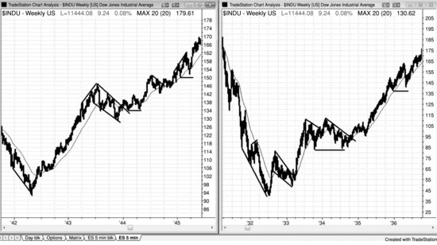
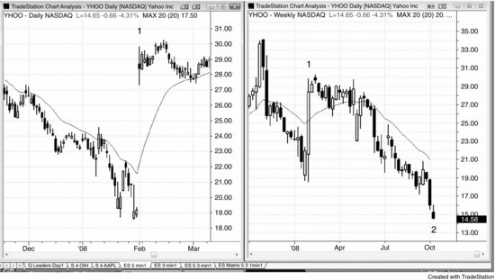

市面上几乎找不到一本交易员写的、全面系统的价格行为著作。写这样一本书得花几千个小时，而稿费跟做交易的收入比起来太少了。如今，我的三个女儿均已离家读研，写书不仅充实了我的生活，更给我带来了极大的成就感。我最初只是想修订《Reading Price Charts Bar by Bar》的第一版（John Wiley & Sons, 2009），但写着写着，就决定把自己观察市场和做交易的方法完整展开来讲。打个比方，我是在教你拉小提琴。靠交易谋生所需的一切知识都在这套书里，但你得自己花无数小时去练。花了一年时间在 [www.brookspriceaction.com](http://www.brookspriceaction.com) 上回答了上千个交易员的问题后，我觉得自己已经找到了更清晰地表达想法的方式，这套书读起来应该比前一本书容易得多。前一本书聚焦于怎么解读价格行为，而这套书的核心则是怎么利用价格行为来做交易。由于篇幅增至第一版的 4 倍多，John Wiley & Sons 决定将其分成三册。第一册讲价格行为基础和趋势。第二册讲交易区间、订单管理以及交易中的数学原理。第三册讲趋势反转、日内交易、日线图、期权，以及适用于所有时间周期的最佳建仓形态。其中很多图表在《Reading Price Charts Bar by Bar》中也出现过，但大多已更新，相关讨论也基本重写了。第一版 12 万字的内容中，只有约 5% 保留在了这套新书的 57 万字里，所以读者几乎找不到重复的内容。

我写这三册书的目标是：解释自己为什么认为精挑细选的交易能提供极好的盈亏比，并给出从这些建仓形态中获利的具体方法。我希望这些内容对专业交易员和商学院学生都有用，同时也希望刚入门的交易员能从中找到有用的思路。每个人都会看价格图表，但多数时候只是扫一眼，带着某个具体的、有限的目的。实际上每张图表里都藏着大量可以用来盈利的信息。问题是，交易员必须花时间去搞懂每一根K线背后的含义：机构资金到底在干什么。

大型市场中 90% 甚至更多的交易量都由机构完成，也就是说，市场本身就是一群机构的集合。几乎所有机构长期都是盈利的，那些不赚钱的很快就会被淘汰。既然机构是盈利的，而它们又构成了市场，那你每做一笔交易，对手盘里就有盈利的交易者（也就是机构群体的一部分）站在你的对面。任何一笔交易的成立，都需要一家机构愿意站在一方，另一家机构愿意站在对立面。个人交易者的小额订单也一样——只有机构愿意接同样的交易，你的单子才能成交。如果你想在某个价格买入，市场根本到不了那个价格，除非有一家或多家机构也想在那里买入。你也没法在某个价格卖出，除非有机构愿意在那里卖——因为市场只会运行到有机构愿意买、也有机构愿意卖的价格。比方说，Emini 当前在 1,264，你做多并在 1,262 设了保护性止损卖出单，你的止损不可能被触发，除非有机构也愿意在 1,262 卖出。几乎所有交易都是这个道理。

如果你一次交易 200 手 Emini 合约，那你的交易量已经达到了机构级别，实际上你就相当于一家机构，偶尔能把价格推动一两个 Tick。但大多数个人交易者根本无力撼动市场，不管他们下单有多愚蠢。市场不会专门来打你的止损。市场可能会测试你保护性止损所在的价格，但那跟你的止损本身没有关系——市场去测试那个价格，是因为有一家或多家机构认为在那里卖出是合理的，同时也有其他机构认为在那里买入是划算的。每个 Tick 上，都有机构在买、也有机构在卖，它们都有经过验证的系统，靠这些交易赚钱。你应该始终顺着大多数机构资金的方向交易，因为它们决定了市场的走向。

收盘后打印出当天的图表，怎么看出机构这一天做了什么？答案很简单：市场涨的时候，大部分机构资金在买；市场跌的时候，更多的钱在卖。随便挑一段上涨或下跌的走势，逐根K线研究，很快就会发现大量重复出现的形态。时间一长，你能在实盘中识别出这些形态正在形成，这会给你下单的信心。有些价格行为很微妙，所以要对每一种可能性保持开放。比如，有时候市场整体在走高，某根K线却跌破了前一根K线的低点，但趋势接着继续上涨。你得假设大资金正在前一根K线的低点及更低位置买入——很多经验丰富的交易员也是这么做的。他们精准地买在那些弱手交易员止损出场的位置，或者那些弱手交易员以为市场要开始下跌而做空的位置。一旦你接受了"强趋势中经常出现回调，大资金是在回调中买入而不是卖出"这个概念，你就能抓住一些绝佳的交易机会——那些你以前觉得完全做反了的交易。不要想太多。市场在涨的时候，机构一直在买，哪怕你觉得自己应该把多单止损掉。你要做的就是跟随它们的行为，不要用过多的逻辑去否认眼前正在发生的事。看起来反直觉没关系，唯一重要的是：市场在涨，机构就是在以买入为主，你也应该买入。

机构一般被视为聪明钱，意思是它们足够聪明，能靠交易为生，而且每天的交易量很大。电视上仍然用"机构"指代传统机构，比如共同基金、银行、券商、保险公司、养老基金和对冲基金；这些公司过去占据了大部分成交量，它们主要基于基本面交易。它们的交易决定了日线和周线图上市场的方向，也影响着日内很多大级别的波段。直到大约十年前，大部分交易决策还是由非常聪明的交易员做出的，交易本身也主要由人完成，但现在越来越多地由计算机承担。计算机程序能在瞬间分析经济数据，并立刻根据分析结果下单，整个过程不需要任何人参与。还有一些公司用计算机程序基于价格行为的统计分析来大规模交易。计算机生成的交易目前占到全天成交量的约70%。

计算机非常擅长做决策，而下棋和在《Jeopardy!》中获胜比股票交易更难。加里·卡斯帕罗夫多年来是全世界棋下得最好的人，但1997年计算机的决策就已经超过了他，并击败了他。肯·詹宁斯被誉为史上最强的《Jeopardy!》选手，但2011年计算机彻底碾压了他。计算机被广泛认可为机构交易中最优秀的决策者，只是时间问题。

既然程序使用的是客观的数学分析，支撑和阻力区域应该会趋于更加清晰。比如，随着越来越多的成交量基于精确的数学逻辑来交易，测量移动的目标位应该会变得更精准。同时，由于程序会在日线图上的小回调中买入，可能（60%+）会出现更多持续时间较长的窄通道。不过，如果足够多的程序在相同的关键位置平多或做空，抛售可能（60%+）会变得更猛更快。这些变化会很剧烈吗？可能（60%+）不会，因为在一切都靠人工操作的时代，同样的基本力量就已经在起作用了。但随着更多情绪因素被移除，市场应该会朝着数学上的完美状态有所靠拢。随着这些公司对市场走势的贡献越来越大，传统机构也越来越多地使用计算机来分析和下单，"机构"这个词变得越来越模糊。对个人交易员来说，更好的理解方式是：凡是交易量大到足以显著影响价格行为的实体，都可以算作机构。

这些买卖程序贡献了市场上的大部分成交量，是所有图表形态最主要的塑造者，也为个人交易员创造了大量的交易机会。没错，知道思科（CSCO）财报强劲、股价正在上涨当然不坏——如果你打算持股几个月，那就跟传统机构一样去买 CSCO。但如果你是日内交易员，就该忽略新闻，只看图表，因为程序交易产生的形态完全基于统计，跟基本面没有关系，却能提供绝佳的交易机会。基于基本面下单的传统机构决定了一只股票在未来几个月里的方向和大致目标价位；但越来越多依靠统计分析做日内交易和短线交易的公司，决定了价格通往目标的路径，以及这波行情最终的高点或低点。即便放到宏观层面，基本面充其量也只是个大致参考。看看1987年和2009年的崩盘就知道了：两次都出现了剧烈的抛售和反弹，但基本面在同样短的时间内根本没有发生剧烈变化。两次市场都是略微跌破月线趋势线后，从那里猛烈反弹。市场下跌是因为人们对基本面的预期变了，但跌到什么程度，是图表决定的。

有一些大的形态在所有时间周期和所有市场中反复出现，比如趋势、交易区间、高潮和通道。同时也有大量较小的可交易形态，只依据最近几根K线就能辨认。这套书是一份全面的指南，帮助交易员看懂图表上的一切，从而找到更多盈利机会，同时避开亏损交易。

我能传达的最重要的信息是：

- 把精力集中在最好的交易上
- 回避最差的建仓形态
- 利润目标（回报）至少要跟保护性止损（风险）一样大
- 持续努力增加你的交易手数

我坦然承认，我对每个建仓形态背后原因的解读都只是个人观点，我对一笔交易为什么有效的推理可能完全是错的。但这无关紧要。真正重要的是，通过价格行为来交易是一种非常有效的方法，而我确实花了大量时间去思考某些形态为什么会以特定方式出现。我对自己的解释感到满意，它们让我下单时更有信心；不过这些解释跟我是否下单没有关系，所以对不对其实并不那么要紧。正如我可以在一瞬间改变对市场方向的判断，我也可以随时推翻自己对某个形态之所以有效的解释——只要遇到更合逻辑的理由，或者发现了原有逻辑的漏洞。我之所以分享这些看法，是因为它们看起来说得通，也许能帮读者在交易某些建仓形态时更有底气，也许还能激发一些思考上的乐趣，但做价格行为交易并不需要这些理论。

这套书内容非常详尽，读起来有难度，面向的是那些想尽可能深入学习图表阅读的认真交易员。不过，其中的概念对所有水平的交易员都有用。书中涵盖了 Robert D. Edwards 和 John Magee（*Technical Analysis of Stock Trends*，AMACOM，第9版，2007）等人所述的许多经典技术，但更侧重于逐根K线分析，展示这些K线提供的信息怎样显著提升交易的盈亏比。大多数书籍在一张图表上只标出三四笔交易，言下之意就是图表上其他所有东西要么看不懂，要么没意义，要么风险太大。我的看法正好相反：一天中每一个 Tick 都值得学习，每张图表上的好交易远不止那几个显眼的——但要看到它们，你必须理解价格行为，不能把任何K线当作无关紧要。我在显微镜下做了几千台手术后学到的一点是：有些最重要的东西可能非常小。

我逐根K线阅读图表，从每根K线中寻找它在告诉我的信息，每一根都很重要。每根K线收盘后，大多数交易员都会问自己："刚才发生了什么？"面对大部分K线，他们的结论是"眼下没什么值得交易的"，于是觉得不值得花力气去搞懂，选择等待更清晰、通常也更大的形态出现。好像他们觉得那根K线根本不存在，或者把它归结为机构程序的活动、个人交易员没法参与。这些时候他们觉得自己跟市场无关——但这些时候占了一天中的绝大部分。可是如果看一看成交量就会发现，他们忽略的那些K线，成交量跟他们用来做交易依据的K线一样大。显然有大量交易正在发生，只是他们不理解这些交易怎么可能存在，就干脆假装它们不存在。但这是在逃避现实。市场上时时刻刻都有交易在进行，作为交易员，你有责任去理解它为什么在发生，并想办法从中赚到钱。搞懂市场在告诉你什么，既耗时又困难，但它能给你打下成为成功交易员所需要的基础。

多数K线图书籍给人的感觉就是要死记硬背各种形态，我这三本书不一样——每一种形态之所以能成为可靠的建仓形态，我都会讲清楚背后的逻辑。书中有些术语，技术分析师和交易员的理解是不同的，我完全是从交易员的角度来写的。我相信很多交易员已经理解了书中所有内容，只不过描述价格行为的方式可能跟我不一样。成功的交易员之间没有什么秘密可言，大家都知道那些常见的建仓形态，只是各自叫法不同罢了。他们差不多在同一时间买卖，抓的是同样的波段，入场理由各有各的说法。很多人凭直觉做价格行为交易，从来没觉得需要解释某个建仓形态为什么有效。我希望他们读到我对价格行为的理解和看法时能有所收获，也希望这些内容能给他们本已成功的交易带来一些新的启发。

多数交易员的目标是找到一种跟自己性格匹配的风格，尽可能多地赚钱。风格和性格不匹配，长期稳定盈利几乎不可能。很多人想知道要花多久才能成功，也愿意承受一段时间的亏损，哪怕是好几年。但就我自己来说，花了10年以上才真正做到稳定盈利。每个人面对的状况和干扰各不相同，所需的时间自然也不一样，但交易员必须逐一克服大部分障碍，才能走到持续盈利那一步。我有几个大问题需要解决，其中之一是养育三个很棒的女儿——她们随时占据着我的心思，让我总想着该怎么当好父亲。随着她们长大、越来越独立，这个问题才慢慢解决。再就是我花了很长时间才接受自己性格中的许多特质是真实存在且无法改变的（至少我觉得自己不愿意去改）。最后是信心问题。在很多事情上，我一直自信到近乎自大，认识我的人恐怕都想不到我会在这方面犯难。但内心深处，我一直觉得自己可能永远找不到一套既能持续盈利、又能让自己乐在其中的方法。正因为缺乏这种信心，我买了很多系统，编写和测试了无数指标和策略，读了大量书籍和杂志，参加研讨会，请教私人导师，加入聊天室。我跟那些自称交易做得很成功的人交流过，但从没看到过他们的账户报表，我怀疑其中大部分人能教别人，但真正能做交易的寥寥无几。交易圈里通常是这样的：懂的人不说，说的人不懂。

这些经历其实非常有用，因为它们告诉了我在走向成功之前需要避开哪些弯路。任何不做交易的人看一眼图表，几乎都会觉得交易一定非常简单——这也正是交易吸引人的地方之一。收盘后回头看任何一张图表，入场点和出场点都清清楚楚。但在实时行情中操作要难得多。人的本能就是想正好买在最低点，而且不想看到价格回撤。一旦价格回撤了，新手往往赶紧砍仓以避免更大的亏损，结果就是一连串的亏损交易，最终把账户亏光。用宽止损可以在一定程度上解决这个问题，但用不了多久，交易员就会连续碰到几笔大亏，把账户拖入亏损，从此不敢再用这种方法了。

你可能会担心：把这些书中的信息公开出去，会不会培养出大批优秀的价格行为交易员，大家同时做同样的事，导致没有足够的迟到者把价格推到你的目标位？不会。因为市场是由机构主导的，他们已经拥有全世界最聪明的交易员，这些人至少凭直觉就已经掌握了书中的所有内容。在任何时刻，都有一个极其聪明的机构多头，跟一个极其聪明的机构空头互为对手盘。既然最重要的玩家已经懂得价格行为，让更多人了解它也不会打破这个平衡。所以我完全不担心我写的这些内容会让价格行为失效。正因为这种平衡的存在，任何人的优势都极其微小，哪怕图表读得再好，任何小失误都会导致亏损。不理解价格行为就想靠交易赚钱非常困难，但光懂价格行为还不够。学会读图之后，还需要花很长时间去学怎么交易，交易本身跟读图一样难。我写这几本书是为了帮人更好地读图、更好地做交易——如果两者你都能做好，那你就配得上从别人账户里把钱赚到自己口袋。

我们看到的那些形态之所以反复出现、长那个样子，是因为在高效市场里，无数交易员出于各种各样的理由下单，而主导成交量的资金始终按理性逻辑运作，最终呈现出来的就是这种模样——一直都是这样。同样的形态在全球所有市场、所有时间周期上都会出现，要同时在这么多层面上操纵价格，根本不可能。价格行为是人类行为的外在表现，本质上有基因层面的基础。只要人类没有进化，价格行为就大概率不会有根本改变——我回顾了80年的图表，确实如此。程序化交易或许稍微改变了图表的外观，但我找不到任何证据支持这种说法。就算真有影响，反而应该让图表更平滑，因为程序化交易没有情绪，而且极大地增加了成交量。如今大部分成交量都由计算机自动完成，体量巨大，非理性和情绪化的行为在市场中已经微乎其微，图表反而更纯粹地反映了人类行为的内在倾向。

既然价格行为源于我们的基因，在人类进化之前就不会改变。看[图 I.1](#9781118172308_epub_ch_00.htm_intro-fig-0001)里的两张图表，第一反应可能觉得不过是两张普通的图表，但注意看底部的日期。这两张道琼斯工业平均指数周线图分别来自大萧条时期和二战时期，里面的形态跟我们今天在所有图表上看到的一模一样——尽管现在大部分成交量都是计算机在交易。

**图 I.1** 价格行为不会随时间改变

如果所有人突然都变成价格行为剥头皮者，短期内一些小形态可能会略有变化，但长期来看，高效市场终究会胜出——无数人按逻辑行事，最终的投票结果必然凝结为标准的价格行为形态，这是不可避免的。再说，现实中想做好交易本身就很难，虽然基于价格行为做交易是一条靠谱的路，但要在实盘中做到持续盈利仍然非常困难。不会有那么多交易员同时把价格行为交易做得足够好，从而对形态产生持久的影响。看看 Edwards 和 Magee 的著作就知道了。全世界最优秀的交易员几十年来一直在用他们的理念，这些理念至今仍然有效，原因还是一样的——图表之所以长这个样子，是因为它是高效市场不可改变的"指纹"：海量聪明人使用海量方法和时间周期，都在拼命赚最多的钱。打个比方，Tiger Woods 打高尔夫没有藏着掖着，谁都可以学他，但能靠打高尔夫谋生的人寥寥无几。做交易也是一样。一个交易员可以几乎什么都懂，但还是会亏钱，因为把所有知识整合起来、持续稳定地赚到钱，这件事本身太难了。

为什么那么多商学院至今还在推荐 Edwards 和 Magee 的书？那本书本质上并不复杂，主要就是用趋势线、突破和回调作为交易基础。原因很简单：管用。过去管用，现在管用，将来也管用。如今几乎所有交易员的电脑都能看到日内数据，很多经典技术可以直接用于日内交易。而且K线图能额外揭示谁在主导市场，入场因此更及时，风险也更小。Edwards 和 Magee 关注的是整体趋势。我用的也是同样的基本方法，但会更仔细地观察图表上的每一根K线来提高盈亏比，并且在日内图表上投入了大量精力。

有一个道理我当时觉得很明显：如果能把图表读得足够好，在行情即将启动且不会回头的那个精确时点入场，那这个交易员就拥有了巨大的优势。胜率会很高，而少数亏损也会很小。我就以此为起点开始钻研，结果发现根本不需要加任何东西。事实上，任何附加的东西都是干扰，只会降低盈利能力。这听起来太简单、太明显了，以至于大多数人反而不信。

我是一名日内交易员，完全依赖 Emini 标普500期货日内图表上的价格行为来做交易。我相信读懂价格行为是所有交易员都应该掌握的核心技能。初学者往往内心深处觉得光靠这个不够，总想着是不是有什么复杂的数学公式、只有极少数人在用的秘密武器，能给自己带来所需的那点优势。高盛那么有钱、那么精明，他们的交易员肯定有超级计算机和顶级软件，能确保所有散户注定亏钱。于是初学者开始研究各种指标，反复调参数，试图把指标调到"刚刚好"。每个指标在某些时候都有用，但对我来说，指标只会把事情搞得更模糊，而不是更清晰。说到底，就算不看图表，随便下一张买单，也有50%的概率是对的！

我否定指标和系统，并不是因为不了解它们的精妙之处。这些年来，我在编写和测试指标与系统上花了超过1万个小时，大概比大多数人的经验都多得多。正是这些大量实践，帮助我最终成为了一个成功的交易员。指标对很多交易员确实管用，但最大的成功来自于找到一种跟自己性格相匹配的方法。我在指标和系统上最大的问题是：我从来没有完全信任过它们。每一个建仓形态出现时，我都能看到需要再测试的例外情况。我总想从市场里榨出最后一分钱，只要能加入一个新的调整让系统更好，就不会满足于当前的回报。你可以不停地优化，但市场总是在强趋势和窄交易区间之间来回切换，而你的优化依据是近期已经发生的走势，所以一旦市场进入新阶段，这些优化很快就会失效。我这个人太爱控制、太强迫、太不安分、太敏感、太多疑，长期靠指标或自动化系统赚钱根本不适合我。不过我在很多方面都比较极端，大多数人不会有同样的问题。

很多交易员，尤其是新手，会被指标所吸引（或者迷信任何更高权威——大师、电视评论员、投资通讯——期望这些人保护自己，用大把的钱来证明对自己的认可和关爱），指望某个指标能告诉他们什么时候该入场。他们没有意识到的是，绝大多数指标都基于简单的价格行为，而我在下单的时候根本来不及同时处理好几个指标给出的信息。假设市场处于多头趋势，出现了一段回调，然后再次上涨创出新高，但这段上涨中有大量重叠K线、多根空头实体K线、几个小回调，而且K线顶部带着明显的影线——任何有经验的交易员都能看出来，这是一次对趋势高点的弱测试，如果多头趋势仍然强劲，不应该出现这种走势。市场几乎可以肯定正在转入交易区间，甚至可能转为空头趋势。交易员不需要振荡指标来告诉他们这些。而且，振荡指标容易让交易员总想着找反转，对价格图表本身反而关注不够。在大多数交易日里，市场会出现两三次持续一个小时以上的反转，这时振荡指标确实是有效的工具。问题出在市场强势趋势运行的时候。如果你太关注指标，就会看到它们一整天都在形成背离，你可能会一次又一次地逆势入场，不断亏钱。等你终于接受市场在走趋势，当天已经没有足够时间把亏损补回来了。反过来，如果你只是看K线图，你会清楚地看到市场在走趋势，不会被指标诱惑去找趋势反转。最常见的成功反转，首先要有一段强动能突破趋势线，然后回调去测试极端点。如果交易员太关注背离，往往就会忽略这个根本事实。仅仅因为背离就入场，而之前并没有出现逆势的强动能突破趋势线，这是一种亏钱的策略。应该等趋势线被突破之后，再看对前高或前低的测试是否形成反转，还是原来的趋势恢复。你不需要指标来告诉你这里出现的强反转是一笔高概率交易，至少够做一笔剥头皮，而且几乎肯定会有背离出现——那为什么还要加上指标让思考变得更复杂呢？

有些评论员推荐结合多个时间周期、多种指标、波浪计数和斐波那契回撤与扩展，但真到下单的时候，他们只有在看到好的价格行为建仓形态时才会动手。同样，当他们看到一个好的价格行为建仓形态，又会开始去找指标上的背离、不同时间周期的均线测试、波浪计数或者斐波那契建仓形态来"确认"眼前的东西。实际上，他们就是价格行为交易员，只看一张图、完全靠价格行为来交易，只是不愿意承认罢了。他们把交易搞得过于复杂，肯定因此错过了很多很多机会——因为过度分析耗费了太多时间，来不及下单，只能等下一个建仓形态。把简单的事情搞得这么复杂，逻辑上说不通。当然，多加任何信息都有可能改善决策，很多人在决定是否下单时确实能处理大量输入。仅仅因为一种简单化的信念就忽视数据，那是愚蠢的。目标是赚钱，交易员应该尽一切可能让利润最大化。但我个人没办法在下单需要的短暂时间内同时处理好多个指标和时间周期，我发现仔细读一张图对我来说收益最高。而且，一旦依赖指标，我发现自己在价格行为的解读上会变懒，经常错过明摆着的东西。价格行为远比任何其他信息都重要，如果你为了从别的东西上获取信息而牺牲了价格行为告诉你的一部分内容，你很可能在做一个错误的决定。

刚开始做交易时，最让人崩溃的一件事就是——一切都太主观了。交易员总想找到一套明确的规则来保证赚钱，讨厌某个形态今天好使、明天就失灵。市场效率非常高，无数聪明人在里面玩一场零和博弈。想赚钱，交易员必须持续优于大约一半的对手。而大多数对手都是盈利的机构，所以你必须真的很强。任何优势一旦出现，很快就会被发现，然后消失。别忘了，你每笔交易的对面一定有人在做相反的方向。他们不会花太久就能搞清楚你的"神奇系统"，一旦搞清楚，就不会再送钱给你了。交易的魅力之一恰恰在于，它是一场优势极其微小的零和博弈，能发现并抓住这些稍纵即逝的小机会，既是智力上的满足，也是经济上的回报。做到这一点是可能的，但非常辛苦，需要始终如一的纪律。所谓纪律，就是去做你不想做的事。人天生有好奇心，总想尝试新东西，但最好的交易员能抵挡住这种诱惑。你必须坚守自己的规则，排除情绪干扰，耐心等待，只做最好的交易。收盘后看着打印出的图表，这些话似乎很容易做到，但在实时盯盘中，一根K线一根K线地等、有时一个小时一个小时地等，真的非常难。一个好的建仓形态一旦出现，如果你走神了或者被漫长的等待磨得麻痹了，就会错过它，然后不得不等更久。但如果你能培养出耐心和纪律，严格执行一套靠谱的交易系统，盈利潜力是巨大的。

做股票和 Emini 交易有无数种赚钱方法，但所有方法都需要价格有波动（做空期权除外）。如果你学会读图，每天都能抓住大量盈利机会，根本不需要知道哪家机构发起了这波趋势，也不需要知道任何指标显示了什么。你不需要那些机构的软件或分析师，因为他们的行为已经反映在图表上了。你要做的只是跟着他们的交易搭便车，就能赚到钱。价格行为会告诉你他们在做什么，让你在早期入场并设一个紧凑的保护性止损。

我发现，交易时考虑的东西越少，赚的钱反而越多，而且这种优势是稳定的。我只需要笔记本电脑上的一张图表，不加任何指标，只挂一条20周期 EMA。不需要太多分析，每天就能帮我看清很多好的建仓形态。有些交易员可能还会看成交量，因为异常大的成交量脉冲有时出现在空头趋势末尾，随后的一两个新波段低点往往能提供盈利的多头剥头皮机会。日线图上，当抛售过度时也会偶尔出现成交量脉冲。不过，这个信号还不够可靠，不值得我花精力去关注。

很多交易员只在做背离交易和趋势回调交易时才考虑价格行为。事实上，大多数用指标的交易员，如果信号K线不够强，根本不会入场；而很多人只要背景合适，即使没有背离，看到一根强信号K线也会入场。他们喜欢看到一根大反转K线有强劲的收盘，但实际上这种情况相当少见。理解价格行为最实用的工具包括：

- 趋势线和趋势通道线
- 前高和前低
- 突破和失败的突破
- K线实体和影线的大小
- 当前K线与前面几根K线之间的关系

尤其是，当前K线的开盘、最高、最低和收盘与前面几根K线的走势对比，能透露很多关于后市走向的信息。图表提供的关于"谁在控制市场"的信息远比大多数交易员意识到的要多。几乎每一根K线都提供了重要线索，指向市场下一步的方向。把任何波动都当成噪音而忽略的交易员，每天都在错过大量盈利机会。这几本书中的大部分观察都直接关系到实际下单，但也有少量内容只是关于价格行为的一些有趣规律，可靠性还不足以作为交易依据。

我做 Emini、期货和股票交易时主要依赖K线图，但大多数信号在任何类型的图表上都能看到，很多甚至在简单的折线图上也很明显。我主要用5分钟K线图来讲解基本原理，但也会讨论日线图和周线图。因为我也交易股票、外汇、国债期货和期权，所以也会讨论价格行为怎么作为这些交易的基础。

作为交易员，我眼中的一切都是灰色的，脑子里时刻转着概率。一个形态正在形成，不完美，但跟某个可靠的**建仓形态**差不多，那它的走势大概率也会类似。差不多就够了。如果某个形态看起来像教科书里的**建仓形态**，交易结果通常也会跟教科书描述的差不多。这就是交易的艺术，要在灰色地带里做好交易，得花好多年。每个人都想要明确的规则、清晰的指标，还有聊天室、资讯、热线、导师来告诉他们什么时候该进场，怎样把风险降到最低、利润拉到最大——但这些东西长期来看都没用。你必须对自己的决定负责，但首先得学会怎么做决定，这意味着你必须习惯在灰色迷雾中操作。没有什么是黑白分明的，做了这么多年，我深刻体会到：任何事情，不管看起来多么不太可能（≤40%），都可能发生，也一定会发生。这就像量子物理，每一个可以想到的事件都有一定概率，连你还没想到的事件也是如此。这里面没有情绪，事情为什么会发生并不重要。盯着看美联储今天会不会降息纯属浪费时间，因为不管美联储做了什么，都同时存在多头和空头两种解读。关键是看市场在做什么，而不是美联储在做什么。

仔细想想，交易是零和博弈，零和博弈中不可能存在持续有效的规则。如果某套规则真的管用，所有人都会去用，那就没人站在交易的另一边了，这笔交易也就不可能成立。指导原则很有帮助，但可靠的规则不可能存在。这对刚入门的交易员来说通常很难接受，因为他们总觉得交易就是一场游戏，只要找到那套恰到好处的规则就能大赚特赚。所有规则都会在某些时候管用，而且通常刚好够频繁，让你误以为只要稍微调整一下就能让它们一直管用。你其实是在试图造一个交易之神来保护你，但你在自欺欺人，用简单方案去应对一个只有困难方案才行得通的游戏。你面对的是全世界最聪明的人，如果你聪明到能想出一套万无一失的规则，他们也能，然后所有人又回到零和博弈的困局。做交易想赚钱就不能死板，因为你得跟着市场走，而市场极其灵活。它可以朝任何方向弯曲，持续时间之长超出大多数人的想象。它也可以每隔几根K线就反复反转，持续很长很长时间。最后，介于两者之间的一切走法它都会走出来。永远别因此沮丧，接受它是现实，把它当作这场游戏之美的一部分来欣赏。

市场天然趋向不确定性。一天中大部分时间，任何市场向上或向下走出等距幅度的概率都是50比50。也就是说，即使你不看图表，随便买一只股票，然后设置一个"二择一"（OCO）订单——在入场价上方X美分挂限价**止盈**单，在入场价下方X美分挂**保护性止损**——你赢的概率大约是50%。同样，在一天中的任意时点随便卖空一只股票，不看图表，然后在下方X美分挂限价**止盈**单，在上方X美分挂**保护性止损**，赢和输的概率也各约50%。有一个明显的例外：X相对于股价太大就不行了。一只50美元的股票，你不可能让X等于60美元，因为你亏60美元的概率是0%。X也不能设成49美元，因为亏49美元的概率同样微乎其微。但只要你选的X值在你所操作的时间周期内是合理的可达范围，上面说的基本成立。当市场处于50比50状态时，它就是不确定的，你不可能理性地对方向做出判断。这正是**交易区间**的标志——所以每当你觉得看不清方向，就假设市场处于**交易区间**。图表上偶尔会出现方向概率更高的短暂时段。在**强趋势**中，概率可能达到60%甚至70%，但这种状态持续不了多久，因为市场会被拉回不确定性，回到多头和空头都觉得有价值的50比50状态。当趋势存在且方向有一定确定性时，市场也会趋向**支撑**和**阻力**区域——通常是某种**测量移动**的距离——而那些区域几乎必然会重新回到不确定状态，至少短暂地形成一段**交易区间**。

交易时段内千万别看新闻。你想知道某条新闻意味着什么，面前的图表会告诉你。记者觉得新闻是天底下最重要的事，任何事情都得跟当天的头条扯上关系。他们吃的就是新闻这碗饭，所以新闻在他们眼里就是宇宙的中心，是金融市场一切变动的原因。2011 年 3 月中旬股市下跌时，他们把原因归结为日本地震，完全不在乎市场早在三周前就已经开始下跌了——那时候刚走完一轮买入高潮。2 月底，我在聊天室里告诉会员：日线图上，一段漫长的多头行情之后出现了 15 根连续多头趋势K线，市场大概率要出现一次大幅回调。这是一次异常强烈的买入高潮，是市场发出的重要信号。几周后会发生地震，我事先根本不知道，也完全不需要知道。图表已经告诉我交易员们在干什么了——他们正准备平掉多头仓位，开始做空。

电视专家同样没用。每当市场出现大幅波动，记者总会找到某个曾经预测对了的、自信又能说会道的专家来采访，让观众觉得这位评论员有过人的预测能力——但没人告诉你，这同一位评论员之前 10 次预测全错了。接着他会抛出一个新预测，天真的观众就会信以为真，让它影响自己的交易。观众可能没意识到：有些评论员 100% 的时间都在看多，有些 100% 的时间都在看空，还有些纯粹在赌大的，专门做极端预测。记者只是急着找一个跟当天新闻方向一致的人来说几句，这对交易员毫无价值，反而有害——它会动摇你的判断，让你怀疑并偏离自己的方法。在这类重大预测上，没有人能持续做到正确率超过 60%，说得有说服力不等于判断准确。持相反观点的人同样聪明、同样有说服力，只是你听不到他们的声音。这就好比看一场庭审只听辩方陈词——只听一面之词总是很有说服力，但也总是有误导性的，可靠性很少超过 50%。

机构多头和机构空头随时都在下单，市场方向的不确定性就是这么来的。哪怕没有突发新闻，财经频道也整天在播采访，每个记者挑一位评论员来出镜。你必须认清一点：在判断接下来一小时左右的市场方向上，她挑对人的概率就是五五开。假如你决定听某位评论员的建议来做交易决策，他说中午后市场会下跌，结果市场一路涨上去，你会去做空吗？你该相信这位华尔街顶级机构的首席交易员吗？他的年薪显然超过百万美元，公司不会白花这笔钱，除非他确实能稳定地预判市场方向。实际上他可能确实能做到，选股能力也可能不错，但他几乎可以肯定不是日内交易员。他靠资金管理一年赚 15%，不代表他能准确预判未来一两个小时的市场方向，这种想法太天真了。算一笔账就明白了：如果他真有这个能力，每天就能赚两三次 1%，一年收益率可以达到 1000%。他做不到，说明他根本不具备这种能力。他的时间周期是几个月，你的是几分钟。他靠日内交易赚不到钱，你为什么要根据一个在日内交易上已被证明失败的人来做决策？他没有成为成功的日内交易员，这个事实本身就说明了一切——如果他做日内交易能赚钱，他早就选这条路了，收入也会远超现在。就算你打算持仓几个月来复制他基金的业绩，听他的建议同样不靠谱，因为他下周可能就改主意了，而你根本不会知道。入场后的仓位管理跟入场本身同样重要。如果你跟着评论员操作，希望像他一样年赚 15%，你就得跟着他的仓位管理走，但你根本没有条件做到，长期下来只会亏钱。没错，你偶尔会做出一笔漂亮的交易，但随便买一只股票也可能碰上好运。关键是这个方法在 100 笔交易之后还能不能赚钱，而不是看头一两笔的结果。把你教育孩子的那句话用在自己身上：别被电视上的东西蒙了，不管看起来多光鲜、多有说服力，都别当真。

我说过，总会有专家看多，也有人看空，而记者只需要挑一个放进她的报道里。你真要让一个记者替你做交易决策？这太荒唐了！如果那个记者会做交易，她早就去做了，赚的钱比当记者多几百倍。你凭什么让她影响你的判断？你这么做，要么是对自己的能力没信心，要么是在找一个像父亲一样爱你、保护你的依靠。如果你容易被记者选的那个专家左右，就不该做那笔交易。那个专家不是你爸，不会保护你，也不会保护你的钱。就算记者碰巧选了一个方向判断正确的专家，他也不会留下来帮你管理这笔交易，你很可能在一次回调中被止损出场，亏着钱离开。

财经新闻台不是做公益的，它们是企业，靠赚钱生存，所以需要尽可能多的观众来拉高广告收入。没错，它们希望报道准确，但第一目标是赚钱。它们很清楚，节目做得好看，观众才会多。所以必须有各种有趣的嘉宾：有的做惊人预测，有的像教授一样让人安心，有的纯粹长得好看；大多数嘉宾多少都得有点娱乐价值。虽然有些嘉宾确实是出色的交易员，但他们帮不了你。比如，节目采访全球顶尖的债券交易员，他通常只会泛泛地聊未来几个月的趋势，而且说的时候离他建仓已经过了好几周。如果你是日内交易者，这对你没用，因为不管月线图上是多头趋势还是空头趋势，日内图上涨和下跌的波段数量差不多，每天都有做多和做空的机会。他的时间周期跟你完全不同，他的交易和你做的事毫无关系。节目也经常采访华尔街大公司的图表分析师，他的资历虽然不错，但判断是基于周线图，而观众想的是几天内就止盈。在那个分析师眼里，就算市场在未来几个月跌了10%，他推荐买入的多头趋势依然完好。但观众早就割肉走人了，根本等不到三个月后的新高。除非那个分析师讨论的目标和时间周期跟你一致，否则他说的话毫无用处。电视上偶尔也会采访日内交易者，但他谈的是已经做完的交易，信息来得太晚，你根本用不上。等他上电视的时候，市场可能已经朝反方向走了。如果他上节目时还在持仓，那两分钟采访结束后他还会继续管理仓位，但在镜头前他不会去管。就算你跟着他进了同一笔交易，当市场转向不利于你、或者顺着你走而你在考虑止盈的时候，他不会在你身边帮你做那个关键决定。在任何情况下看电视来找交易建议——哪怕是在一份非常重要的报告发布之后——都是稳赔不赚的做法，永远不要这么做。

只看图表就够了，图表会告诉你需要知道的一切。给你钱或拿走你钱的是图表，所以交易的时候它是你唯一应该关注的东西。哪怕你在交易大厅里，连你最好的朋友的行为都不能信。他可能大量卖出橙汁看涨期权，暗地里却让另一个经纪人在低于市价的位置买入10倍的量。你的朋友只是在制造恐慌、压低市场，好让他通过代理人在更好的价位大举建仓。

朋友和同事总爱主动给你交易建议，听听就好，别当真。偶尔有交易员跑来跟我说，发现了一个很棒的建仓形态，想聊聊。每次我说不感兴趣，对方都会不高兴。他们立刻觉得我自私、固执、思想封闭——说实话，在交易这件事上，我确实如此，甚至有过之而无不及。那些能让你赚到钱的特质，在外行眼里往往被当成缺点。为什么我不再看交易类的书和文章，也不跟其他交易员讨论他们的想法？之前说过，图表已经告诉了我一切，其他信息只会分散注意力。有些人被我这种态度冒犯了，但我觉得部分原因在于：他们表面上说要帮我，实际上是想送个人情，期望我回报一些指导。当我说不想听别人的交易方法时，他们就变得沮丧和恼怒。我跟他们讲，我连自己的方法都没完全精通，可能永远也精通不了，但我坚信，把已有的东西打磨到极致，远比去学那些非价格行为的方法赚得多。我问他们：假如 James Galway 送了一把漂亮的长笛给马友友，非要让他学吹长笛，理由是 Galway 靠吹笛赚了大把钱，马友友该接受吗？当然不该。马友友应该继续拉大提琴，这样赚的钱远比同时去学长笛多得多。我不是 Galway，也不是马友友，但道理是一样的。价格行为是我唯一想演奏的乐器，我坚信精通它比从其他成功交易员那里东拼西凑要赚得多得多。

图表，而不是电视上的专家，会准确告诉你机构是怎么解读新闻的。

昨天 Costco 公布了季度财报，盈利同比增长 32%，超出分析师预期（见[图 I.2](#9781118172308_epub_ch_00.htm_intro-fig-0002)）。COST 开盘跳空高开，第一根K线测试了缺口，随后 20 分钟内上涨超过 1 美元。接着价格缓慢回落，测试了前一天的收盘价。期间出现了两次反弹，都突破了空头趋势线，但两次都失败了。这形成了一个双顶（K线 2 和 3）熊旗，也可以看作三顶（K线 1、2 和 3），之后市场暴跌 3 美元，跌破了前一天的低点。如果你完全不知道这份财报，你会在K线 2 和 3 处空头趋势线突破失败时做空，还会在K线 4 下方加仓做空——K线 4 是跌破前一天低点后的回调。然后你会在K线 5 那根大反转K线处反手做多，因为它是第二次尝试反转跌破前一天低点的走势，也是价格突破陡峭空头趋势通道线底部后的高潮反转。

**图 I.2** 忽略新闻

另一种做法是，你看到利好财报就在开盘买入，然后眼睁睁看着股价暴跌，而不是像电视分析师预测的那样飙升，心里满是焦虑。你很可能会在第二波下跌到K线 5 时平掉多头，亏了 2 美元。

任何在极少的K线内覆盖大量点数的趋势——也就是说K线较大、K线之间重叠很少——最终都会出现回调。这类趋势动能极强，回调之后趋势大概率会恢复，并回测趋势的极端点。通常极端点会被突破，前提是回调没有演变成反方向的新趋势、并延伸超过原始趋势的起点。一般来说，回调幅度一旦达到 75% 以上，回到前一个趋势极端点的概率就会大幅下降。对于空头趋势中的回调，到了那个程度，交易员不如把它当作一个新的多头趋势，而不是旧空头趋势中的回调。K线 6 大约回调了 70%，之后市场在次日开盘测试了高潮空头低点。

市场因某条新闻跳空高开，并不意味着它就会继续上涨，不管这条新闻看起来多么利好。

[图 I.3](#9781118172308_epub_ch_00.htm_intro-fig-0003)中有两张 Yahoo!（YHOO）的图表，左边是日线，右边是周线。K线 1 开盘之前，新闻报道微软打算以每股 $31 收购 Yahoo!，市场跳空高开，几乎直接涨到了这个价位。很多交易员觉得这笔交易板上钉钉——微软是全球顶级公司之一，想买 Yahoo! 肯定能办成。而且微软现金充裕，必要时很可能会加价。结果呢，Yahoo! 的 CEO 说公司值 $40 一股，但微软从未还价。这笔交易慢慢泡汤了，Yahoo! 的股价也跟着一路往下掉。到了 10 月，Yahoo! 的价格比收购消息公布前低了 20%，比消息当天低了 50%，而且还在继续跌。强劲的基本面和正经买家的收购报价，又能怎样？对价格行为交易员来说，空头趋势中的大幅上涨很可能只是一个熊旗，除非之后出现一系列 HL 和 HH。上涨之后也许会出现牛旗、然后继续反弹，但在多头趋势得到确认之前，必须始终意识到：更大级别的周线趋势才是更重要的。

**图 I.3** 利好消息之下市场照样可以下跌

图表是唯一不会骗你的东西。如果你看不懂图表在说什么，就不要交易，等到看清楚再说。清晰的信号总会出现的。一旦出现，你就必须果断下单，承担风险，严格执行计划。不要切换到 1 分钟图去收紧止损，那样只会亏钱。1 分钟图的问题在于，它用更小的K线、更小的风险提供了大量入场机会，很有诱惑力。但你不可能每一个都做，最终一定会挑着做，而挑着做就是账户灭亡的开始——因为你总会挑到太多烂机会。你在 5 分钟图上入场，依据的是你对 5 分钟图的分析，根本不知道 1 分钟图长什么样。所以必须依靠 5 分钟图的止损和目标，接受一个现实：1 分钟图会频繁反向运动，触及 1 分钟级别的止损。如果你盯着 1 分钟图看，就没法全神贯注在 5 分钟图上，水平更高的交易员会把你账户里的钱转到他的账户里。想要有竞争力，就必须排除一切干扰，不看图表以外的任何东西，相信只要做到这一点就能赚到很多钱。这听起来不太真实，但确实如此，永远不要怀疑这一点。保持简单，遵守简单的规则就好。持续做到简单这件事极其困难，但在我看来，这就是最好的交易方式。最终，随着交易员对价格行为的理解越来越深，交易的压力会小很多，甚至变得相当无聊，但盈利能力会大幅提升。

虽然我从不赌博（因为概率、风险和回报的组合对我不利，我绝不跟数学作对），但交易和赌博确实有一些相似之处，尤其在不做交易的人看来更是如此。赌博是一种碰运气的游戏，但我更倾向于把"赌博"限定在这样一种情况：概率略微偏向对手，长期下来一定会输。为什么要这样限定？因为如果不限定，那每一笔投资都算赌博——买投资性房产、买房、创业、买蓝筹股、甚至买国债都有运气的成分和全部亏损的风险（政府可能选择让美元贬值来缩小实际债务规模，这样你拿回来的美元购买力就远不如当初买债券时的水平）。

有些交易员使用简单的博弈论，在一笔或多笔亏损交易之后加大仓位（这就是所谓的马丁格尔交易法）。21 点算牌客跟交易区间交易员非常像。算牌客试图判断概率是否已经偏离太远，具体来说，他们想知道牌堆里剩余的大牌是否偏多。当计数表明这种情况可能出现时，他们就根据大牌即将大量出现的概率下注，从而提高胜率。交易区间交易员也是一样：当他们认为市场在某个方向走得太远时，就反向下单（即押注失败）。

我试过几次用虚拟筹码在网上打扑克，想看看跟做交易有什么异同。很快就发现一个根本性的问题：运气的成分太大了，这种内在的不公平让我一直很焦虑。我绝不想让运气在我的胜算里占太大比重。这是赌博和交易之间一个巨大的区别，也让我把两者看作本质不同的事情——尽管大众常把它们混为一谈。做交易时，每个人拿到的"牌"是一样的，所以游戏始终是公平的；长期来看，你的盈亏完全取决于你的交易水平。当然，有时候交易做得对也会亏钱，而且由于所有可能结果的概率分布，这种情况可能连续出现好几次。理论上确实存在一个极小的概率，让你即使做得很好也会连亏10次甚至100次以上；但我不记得上一次看到连续4个好的信号都失败是什么时候了，所以这个风险我愿意承担。如果你交易做得好，长期来看就应该赚钱，因为这是一个零和游戏（除去手续费，而如果你选对了券商，手续费应该很低）。如果你比大多数交易员都强，你就能赢走他们的钱。

有两种赌博跟纯粹的碰运气不同，而且跟交易很像。体育博彩和扑克都属于这类——赌客赢的是其他赌客的钱，而不是跟庄家对赌，所以只要比对手强出一截，就能让赔率对自己有利。不过，他们付出的"手续费"可能远高于交易员的手续费，体育博彩尤其如此——抽水通常是10%。这就是为什么像 Billy Walters 这样极其成功的体育博彩玩家凤毛麟角：他们必须比对手至少强出10%才能打平。成功的扑克玩家要多一些，电视上各种扑克节目就是证明。但即使是最顶尖的扑克玩家，收入也远比不上最顶尖的交易员，因为扑克在实际操作中能下注的规模要小得多。

我个人觉得做交易压力不大，因为运气的成分小到不值得考虑。不过交易和打扑克有一点是相通的，就是耐心的价值。打扑克时，如果你耐心等到最好的牌才下注，赚到的钱会多得多；做交易也一样，有耐心等到最好的**建仓形态**，收益就会更高。对我来说，这种漫长的等待在交易中更容易忍受，因为行情清淡的时候，我能看到所有其他的"牌"——观察那些细微的**价格行为**现象本身就很有意思。

赌博界有一句重要的格言，适用于所有事情：手里没好牌就别下注。做交易也一样——等到好的**建仓形态**出现再下单。如果你缺乏纪律、也没有靠谱的方法，就只能靠运气和侥幸来赚钱，那你的交易毫无疑问就是一种赌博。

一个令人遗憾的误解来自那些不做交易的人，他们认为所有日内交易者——乃至所有市场交易者——都是赌博成瘾的人，因此有心理疾病。我觉得确实有不少人是"上瘾"了，只不过他们做交易更多是为了刺激而非盈利。他们愿意押注低概率的交易，亏掉大笔钱，就因为偶尔赢一把时那种强烈的快感。但大多数成功的交易员本质上是投资者，就像买商业地产或收购小公司的投资者一样。跟其他投资方式真正的区别，只是时间周期更短、杠杆更高。

遗憾的是，新手难免偶尔会赌一把，而这必定让他们亏钱。每个成功的交易员都是按规则交易的。不管出于什么原因，只要交易员偏离了自己的规则，就是在靠希望而不是逻辑做交易，本质上就变成了赌博。新手最常在连续亏了几笔之后开始赌。他们急着想回本，愿意冒险搏一把。他们会去做平时根本不会做的交易，因为太想赶紧把刚亏的钱赚回来。既然他们自己都觉得这笔交易概率不高，而且是出于焦虑和沮丧才去做的，那这就不是交易，而是赌博了。赌输之后感觉更糟——不仅当天亏得更多，还会格外沮丧，因为他们不得不面对一个事实：自己明知纪律是成功的关键要素之一，却没能坚持住自己的系统。

有意思的是，神经金融学的研究者发现，交易员准备下单时的脑部扫描图像，跟瘾君子准备吸一口时的几乎一模一样。他们发现了一种滚雪球效应——不管结果如何，继续下去的冲动会越来越强。更糟的是，面对亏损时，交易员倾向于加大风险而不是减小风险，这往往导致爆仓。Warren Buffett 虽然不懂神经科学，但显然深谙此理，他说过："一旦你有了正常水平的智商，你需要的就是控制冲动的性格——正是这些冲动让别人在投资中栽跟头。"顶尖的交易员能控制自己的情绪，始终遵守自己的规则。

关于赌博还有最后一点：人天然倾向于认为没有什么能永远持续下去，任何行为最终都会回归均值。如果市场连亏了三四笔，那下一笔肯定该赢了吧？就像抛硬币一样嘛。可惜，市场根本不是这样运作的。市场处于趋势中时，大多数反转尝试都会失败；处于交易区间中时，大多数突破尝试也会失败。这跟抛硬币恰恰相反——抛硬币每次都是50对50，但在交易中，刚发生过的事情再次重复的概率大约是70%甚至更高。正是因为这种抛硬币式的思维，大多数交易员在某个阶段会开始研究博弈论。

马丁格尔策略在理论上很好用，实际操作中却行不通，因为数学和情绪之间存在根本矛盾。这就是马丁格尔悖论。如果你每亏一笔就把仓位翻倍（甚至翻3倍）并反向操作，理论上确实能赚钱。在5分钟 Emini 图表上，只要认真选择交易，连亏4笔的情况并不常见，但它一定会发生——连亏十几笔甚至更多也有可能，尽管我自己从没见过。不管怎样，假设你能承受的上限是10手，但一开始只做1手，计划每亏一笔就翻倍并反手——连亏4笔之后，下一笔就要做16手；连亏8笔之后，就要做256手！连亏4笔或更多之后，你不太可能 (≤40%)还敢下一笔超出自己承受范围的单子。一个愿意从1手起步的人，绝不可能接受做16手或256手；而一个能接受256手的人，也绝不会只用1手来启动这个策略。这就是马丁格尔方法内在的、无法克服的数学难题。

交易本身充满乐趣和竞争性，人们自然会拿它跟游戏类比，又因为涉及下注，最先想到的通常 (60%+)是赌博。但更贴切的类比其实是国际象棋。下国际象棋时，你能看到对手的每一步棋，不像纸牌游戏那样看不到对手的底牌。扑克中你拿到什么牌纯靠运气，但国际象棋里棋子的位置完全取决于你自己的决策。国际象棋没有任何隐藏信息，胜负纯粹由你跟对手的实力对比决定。能够解读眼前的局面并判断接下来可能 (60%+)发生什么——这种能力对棋手和交易员来说都是巨大的优势。

非交易者还担心崩盘的可能性，正因为这种风险，他们又把交易跟赌博画上等号。崩盘在日线图上其实极其罕见。这些人害怕的是自己在极端情绪化的行情中无法正常应对。虽然"**崩盘**"这个词通常 (60%+)只用于日线图，指的是像1927年和1987年那样在很短时间内跌幅达到约20%或以上的空头市场，但更实用的做法是把它看成又一种图表形态——这样能排除情绪干扰，帮助交易员遵守自己的规则。如果你把时间轴和价格轴去掉，只看价格行为本身，日内图表上经常会出现跟经典崩盘形态完全一样的走势。一旦你能克服情绪影响，就能从崩盘中赚到钱，因为所有图表展现的都是可交易的价格行为。

[图 I.4](#9781118172308_epub_ch_00.htm_intro-fig-0004)（来自 TradeStation）展示了市场在任何时间周期都可能出现崩盘式走势。左边是GE在1987年崩盘期间的日线图，中间是COST在一份非常强劲的财报发布后的5分钟图，右边是1分钟 Emini 图表。虽然"**崩盘**"这个词几乎只用来指日线图上短时间内20%或以上的暴跌，过去一百年里也只被广泛使用过两次，但价格行为交易员关注的是形态本身，而同样的崩盘形态在日内图表上很常见。既然日内崩盘这么普遍，就没必要专门用"崩盘"这个词了——从交易角度来看，它们不过是一段空头波段，里面包含着可交易的价格行为。

**图 I.4** 崩盘很常见

顺带一提，同样的形态会出现在所有时间周期上，这意味着分形数学的原理可能对设计交易系统有用。换句话说，每一种形态在更小时间周期的图表上都能细分为标准的价格行为形态，基于价格行为分析做出的交易决策因此适用于所有时间周期。

## 怎么读这三本书

我尽量把三本书的内容按一个对交易员有帮助的顺序来编排。

第一册：*Trading Price Action Trends: Technical Analysis of Price Charts Bar by Bar for the Serious Trader*

- *价格行为与K线基础。* 市场要么处于趋势中，要么处于交易区间中。这个规律适用于每一个时间周期，甚至适用于单根K线——一根K线要么是趋势K线，要么是非趋势K线（十字星）。
- *趋势线与趋势通道线。* 这些是用来识别趋势和交易区间的基本工具。
- *趋势。* 趋势是每张图表上最显眼也最赚钱的部分。

第二册：*Trading Price Action Trading Ranges: Technical Analysis of Price Charts Bar by Bar for the Serious Trader*

- **突破。** 从交易区间过渡到趋势的过程。
- **缺口。** 突破常常在日内产生好几种缺口，对交易员很有用，但只有用宽泛的定义才能识别出来。
- **磁力位、支撑与阻力。** 市场突破后开始运动，往往会被某些价位吸引，这些磁力位经常构成反转的建仓形态。
- **回调。** 从趋势暂时过渡到交易区间的过程。
- **交易区间。** 价格大体横盘运动的区域，但其中每一段都是一个小趋势，而整个交易区间在更高时间周期的图表上通常只是趋势中的一次回调。
- **下单与交易管理。** 交易员需要尽可能多的工具，要理解剥头皮、波段交易以及分批建仓和分批出场的方法，还要掌握怎么用突破单和限价单入场与出场。
- **交易的数学基础。** 所有交易都有数学根基，一旦你看明白价格为什么这样走，交易的压力就会小很多。

第三册：*Trading Price Action Reversals: Technical Analysis of Price Charts Bar by Bar for the Serious Trader*

- **趋势反转。** 在所有交易类型中，趋势反转的盈亏比最好，但大多数反转最终会失败，所以交易员必须严格筛选。
- **日内交易。** 读者理解了价格行为之后，就可以拿来实战了。关于日内交易、第一小时交易以及详细案例的章节会演示具体做法。
- **日线、周线和月线图表。** 这些图表上的价格行为建仓形态非常可靠。
- **期权。** 价格行为可以有效地用在期权交易中。
- **最佳交易。** 有些价格行为建仓形态特别好，初学者应该集中精力练这些。
- **交易指南。** 很多重要的概念能帮交易员保持专注。

遇到不熟悉的术语，可以在书前面的术语表中找到定义。

有些书用的是交易所所在地的时区来显示图表，但交易已经电子化、全球化了，这已经不重要了。因为我在加州做交易，图表用的是太平洋标准时间（PST）。所有图表都是用 TradeStation 生成的。每张图表上都有很多值得关注但还没讲到的价格行为现象，我会在主要讨论之后的"本图深入分析"部分描述其中不少内容。第一次读的时候你可能觉得看不懂，但读第二遍就能理解了。你见过的标准形态变体越多，在实盘中就越能及时识别它们正在形成。我通常还会指出图表上最主要的一两笔交易。如果你愿意，第一遍可以跳过这些补充讨论，等读完全套书后再回头看图表，那时深入讨论的内容就能看懂了。很多建仓形态是重要概念的绝佳案例，虽然还没正式讲到，但如果你打算再读一遍这套书，这些讨论会很有价值。

本书出版时，我会在 [www.brookspriceaction.com](http://www.brookspriceaction.com.) 上每天发布 Emini 的盘后分析，并在交易时段提供实时图表解读。

三册书中所有图表的大幅版本都放在 John Wiley & Sons 的网站 [www.wiley.com/go/tradingreversals](http://www.wiley.com/go/tradingreversals) 上。（详见书末的"关于网站"页面。）你可以放大查看细节、下载或打印图表。当某段讲解长达好几页时，手边有一份图表的打印件会更方便对照阅读。

## 强势信号：趋势、突破、反转K线与反转

以下是强趋势中常见的一些特征：

- 当天出现大幅跳空开盘。
- 出现趋势性高点和低点（波段）。
- 大部分K线都是顺势方向的趋势K线。
- 相邻K线的实体之间很少有重叠。比如在多头急速段中，很多K线的低点恰好在前一根K线收盘价处，或只低一个 tick。有些K线的低点刚好在前一根收盘价处、没有跌破，这意味着那些想用限价单在前一根收盘价买入的交易员根本没有成交，只能追高买入。
- 出现上下两端无影线或短影线的K线，表明交易的紧迫性。比如在多头趋势中，一根多头趋势K线以最低价开盘、一路上涨，说明前一根K线刚一收盘，交易员就急着买入。如果这根K线收在最高价或接近最高价的位置，说明买方持续大力买入，预期新的买单会在这根K线收盘后立刻涌入。他们愿意在收盘前就买入，因为担心等到K线收盘后再买，可能要多付一两个 tick。
- 偶尔出现实体之间的缺口（比如在多头趋势中，某根K线的开盘价高于前一根K线的收盘价）。
- 趋势起点出现一根强趋势K线形成的突破缺口。
- 出现测量型缺口，即突破回测没有与突破点重叠。比如多头突破后的回调没有跌破突破发生处那根K线的高点。
- 出现微型测量缺口，即一根强趋势K线前后的K线之间存在缺口。比如在多头趋势中，一根强多头趋势K线后面那根K线的低点，等于或高于前面那根K线的高点，这就是一个缺口，同时也是一次突破回测和强势信号。
- 没有出现大型高潮。
- 没有出现太多大K线（即使是大的趋势K线也不多）。反而最大的趋势K线常常是逆势K线，把交易员引诱去做逆势交易，错过了顺势机会。逆势的建仓形态看起来几乎总是比顺势的建仓形态更漂亮。
- 没有出现明显的趋势通道线过冲，小幅过冲也只带来横盘修正。
- 趋势线被突破后，走势进入横盘修正。
- 出现失败的楔形和其他失败的反转形态。
- 出现连续 20 根或更多K线不触及均线的 EMA 20 缺口K线序列（详见第二册）。
- 几乎找不到能盈利的逆势交易机会。
- 回调幅度小、频率低，而且大多是横盘性质的。比如 Emini 日均波幅 12 点时，回调幅度通常都不超过 3 到 4 点，而且市场经常连续 5 根或更多K线不出现回调。
- 有一种紧迫感。你发现自己等了无数根K线，就想等一个像样的顺势回调入场机会，但它始终不来，而市场就这样一点一点地继续推进。
- 回调处的建仓形态很强。比如在多头趋势中，高 1 和高 2 回调的信号K线是强多头反转K线。
- 在最强的趋势里，回调的信号K线通常反而偏弱，导致很多交易员不敢下手，只能追着市场跑。比如在空头趋势中，低 2 做空的信号K线往往是两三根K线组成的小型多头急速段中的小阳线，而有些入场K线则是外包阴线。趋势性体现在方方面面：收盘价、高点、低点、实体都在趋势方向上推进。
- 反复出现两段式回调，不断形成顺势入场机会。
- 均线对侧不会连续出现两根趋势K线的收盘。
- 趋势走出很远的距离，接连突破多个阻力位——均线、前期波段高点、趋势线——每次都甩开好几个 tick。
- 逆势急速段形式的反转尝试没有跟随，失败后变成顺势方向的旗形。

多头突破具备以下特征越多，突破走强的可能性就越大：

- **突破K线**是一根实体大、影线短甚至没有影线的**多头趋势K线**。K线越大，突破成功的概率越高。
- 如果这根大**突破K线**的成交量是近期K线平均成交量的10到20倍，后续出现**跟随**买盘甚至**测量移动**的机会就更大。
- **急速**阶段走得非常远，持续好几根K线，一口气冲破多个**阻力**位——**均线**、前期**波段高点**、**趋势线**——而且每个都被突破了好多个 Tick。
- 在**突破K线**形成的过程中，价格大部分时间都贴着K线高点运行，回落幅度很小（不到当时K线高度的四分之一）。
- 有一种紧迫感。你觉得必须马上买，想等**回调**，但**回调**始终不来。
- 接下来两三根K线同样带有多头实体，实体大小至少达到近期多头和空头K线实体的平均水平。即使实体相对较小、影线比较明显，只要**跟随K线**（**突破K线**之后的那根K线）本身很大，趋势延续的概率就更高。
- **急速**阶段延伸到5至10根K线，期间几乎没有超过一根K线的回撤。
- **急速**阶段中有一根或多根K线的低点刚好在前一根K线收盘价处，或者只低了1个 Tick。
- **急速**阶段中有一根或多根K线的开盘价高于前一根K线的收盘价。
- **急速**阶段中有一根或多根K线收在最高点，或者只差1个 Tick。
- **多头趋势K线**之后那根K线的低点，处于该**多头趋势K线**前一根K线高点的位置或之上，形成一个**微型缺口**，这是强势信号。这种缺口有时会变成**测量型缺口**。虽然对交易本身意义不大，但按照艾略特波浪理论，它们大概代表的是低**时间级别**上第1浪高点和第4浪**回调**之间的空间——第4浪可以触及但不能重叠第1浪。
- 整体**背景**有利于**突破**发生，比如趋势在**回调**后恢复，或者在强势突破**空头趋势线**之后，出现了**HL**或**LL**对空头低点的**测试**。
- 市场近期已经出现了好几个强势多头交易日。
- **交易区间**内**买压**在不断积聚，体现为大量大实体的**多头趋势K线**，而且**多头趋势K线**明显比区间内的**空头趋势K线**更显眼。
- 第一次**回调**要等到突破走出3根以上K线之后才出现。
- 第一次**回调**只持续一两根K线，而且它前面那根K线不是强**空头反转K线**。
- 第一次**回调**没有回到**突破**起点，也没有触及**盈亏平衡点**止损（即入场价格）。
- 这根**突破K线**反转了大量近期K线的收盘价和高点。举例来说，当市场处于空头**通道**中，一根大**多头趋势K线**出现，这根**突破K线**的高点和收盘价高于之前5根甚至20根以上K线的高点和收盘价。被收盘价反转的K线数量越多，信号越强——比同样数量但仅被高点反转的情况更强。

具备以下特征越多的**空头突破**，越有可能形成强势突破：

- 突破K线是一根实体大、影线短或没有影线的空头趋势K线。K线越大，突破成功的可能性越高。
- 如果这根大突破K线的成交量达到近期K线平均成交量的 10 到 20 倍，后续跟随卖出以及出现测量移动下跌的概率就更大。
- 急速段走得很远，持续好几根K线，同时击穿多个支撑位——均线、前期波段低点、趋势线——而且每个支撑位都被穿透了很多个 Tick。
- 突破K线形成过程中，价格大部分时间停留在K线低位附近，中间的回调幅度很小（不到这根不断增长的K线高度的四分之一）。
- 有一种紧迫感。你觉得必须马上卖出，想等回调再进场，但回调始终不来。
- 随后的两三根K线也带有空头实体，实体大小至少达到近期多头和空头K线实体的平均水平。即使实体相对较小、影线明显，只要跟随K线（突破K线之后那根K线）足够大，趋势延续的概率就更高。
- 急速段扩展到 5 至 10 根K线，其间最多只回调一根K线左右。
- 空头突破跌破前方重要波段低点时，跌幅足以让在该波段低点下方一个 Tick 用突破单入场的剥头皮者获利。
- 急速段中有一根或多根K线的高点恰好等于、或仅高出前一根K线收盘价一个 Tick。
- 急速段中有一根或多根K线的开盘价低于前一根K线的收盘价。
- 急速段中有一根或多根K线的收盘价位于该K线最低点，或仅高出最低点一个 Tick。
- 一根空头趋势K线之后那根K线的高点，等于或低于该空头趋势K线之前那根K线的低点，就形成了微型缺口——这是强势信号。这种缺口有时会演变为测量型缺口。虽然对实际交易意义不大，但它们很可能代表的是更低时间周期上艾略特波浪第 1 浪低点与第 4 浪回调之间的空间——第 4 浪可以触及但不能重叠第 1 浪。
- 整体背景本身就有利于突破，比如趋势回调之后的恢复，或者在多头趋势线被强势跌破后，市场形成 LH 或 HH 对多头高点的测试。
- 近期已经出现了好几个强空头趋势日。
- 交易区间内抛压持续增大，表现为出现了很多大空头趋势K线，而且空头趋势K线明显比多头趋势K线更突出。
- 突破后至少走了三根K线才出现第一次回调。
- 第一次回调只持续一到两根K线，而且出现在一根不是强多头反转K线的K线之后。
- 第一次回调没有回到突破点，也没有触及盈亏平衡止损位（即入场价格）。
- 突破一举逆转了近期大量K线的收盘价和低点。比如，在一段多头通道中出现了一根大空头K线，这根突破K线的低点和收盘价低于之前 5 根、甚至 20 根以上K线的低点和收盘价。被这根空头K线收盘价逆转的K线数量越多，信号越强——比被其低点逆转同样数量K线的信号更强。

最广为人知的信号K线是反转K线。**多头反转K线**的最低要求是：收盘价高于开盘价（即带有多头实体），或者收盘价高于K线中点。最好的多头反转K线具备以下特征中的不止一项：

- 开盘价接近或低于前一根K线的收盘价，收盘价高于自身开盘价，同时也高于前一根K线的收盘价。
- 下影线大约是整根K线高度的三分之一到二分之一，上影线很短或没有。
- 与前面一根或几根K线重叠不多。
- 信号K线之后那根K线不是十字星内包K线，而是一根强入场K线（多头趋势K线，实体较大，影线较短）。
- 收盘价逆转（收于其上方）了不止一根K线的收盘价和高点。

**空头反转K线**的最低要求是：收盘价低于开盘价（即带有空头实体），或者收盘价低于K线中点。最好的空头反转K线具备以下特征：

- 开盘价接近或高于前一根K线的收盘价，收盘价明显低于前一根K线的收盘价。
- 上影线大约是整根K线高度的三分之一到二分之一，下影线很短或没有。
- 与前面一根或几根K线重叠不多。
- 信号K线之后那根K线不是十字星内包K线，而是一根强入场K线（空头趋势K线，实体较大，影线较短）。
- 收盘价逆转（收于其下方）了不止一根K线的收盘价和极值。

以下是强多头反转中常见的一系列特征：

- 出现一根强**多头反转K线**，多头趋势实体大，影线很短或没有影线。
- 紧接着的两三根K线也带有多头实体，大小至少达到近期多空K线实体的平均水平。
- 急速阶段持续5至10根K线，期间回调不超过一根左右，同时反转了此前**空头趋势**中的多根K线、**波段高点**和熊旗。
- 急速阶段中有一根或多根K线的最低价恰好在前一根K线收盘价处，或只低1个Tick。
- 急速阶段中有一根或多根K线的开盘价高于前一根K线的收盘价。
- 急速阶段中有一根或多根K线的收盘价落在该K线最高价处，或只低1个Tick。
- 整体**背景**有利于反转——比如在强势**突破**空头趋势线之后，出现了**HL**或**LL**对空头低点的测试。
- 第一次**回调**至少在3根K线之后才出现。
- 第一次回调只持续一两根K线，并且出现在一根并非强**空头反转K线**的K线之后。
- 第一次回调没有触及**盈亏平衡点**止损（即入场价）。
- 急速阶段走了很远，大幅突破多个**阻力**位——包括**均线**、前期**波段高点**、**趋势线**，每个都超过好几个Tick。
- 反转第一根K线在形成过程中，价格大部分时间停留在K线高位附近，回撤幅度不到这根正在增长的K线高度的四分之一。
- 有一种紧迫感：你觉得必须买入，想等回调再进，但回调迟迟不来。
- 该信号是过去几根K线内的第二次反转尝试（**第二次信号**）。
- 反转起始于旧趋势**趋势通道线**的**过冲**反转。
- 正在反转一个重要的**波段高点**或**波段低点**（例如跌破一个强力的前期波段低点后反转向上）。
- **高1**和**高2**回调都有强**多头反转K线**作为**信号K线**。
- 出现了趋势性特征：**趋势性收盘**、趋势性高点、趋势性低点或趋势性实体。
- 回调幅度小，走势**横盘**。
- 之前已经突破过更早的空头趋势线（这不是多方力量的第一次显现）。
- 测试空头低点的回调缺乏动能，表现为大量**重叠**K线，其中很多是**多头趋势K线**。
- 测试空头低点的回调在**均线**或旧的空头趋势线处失败。
- **突破**反转了大量近期K线的收盘价和最高价。例如，在一个空头**通道**中出现了一根大阳线，这根**突破K线**的最高价和收盘价高于之前5根甚至20根以上K线的最高价和收盘价。被收盘价反转的K线数量越多，信号越强；仅被最高价反转同样数量的K线，力度稍弱。

以下是强**空头反转**常见的一些特征：

- 出现一根强空头反转K线，实体大，影线短或没有影线。
- 紧接着的两三根K线同样带有空头实体，且实体大小至少达到近期多头和空头K线实体的平均水平。
- 急速阶段延续到5至10根K线，期间几乎没有超过一根K线的回调，并且反转了前一段多头趋势中的许多K线、波段低点和牛旗。
- 急速阶段中有一根或多根K线的最高价恰好等于或仅高出前一根K线收盘价1个 Tick。
- 急速阶段中有一根或多根K线的开盘价低于前一根K线的收盘价。
- 急速阶段中有一根或多根K线的收盘价位于最低价，或仅高出最低价1个 Tick。
- 整体背景有利于反转——比如在强力跌破多头趋势线之后，出现 LH 或 HH 对多头高点的测试。
- 第一次回调至少在3根K线之后才出现。
- 第一次回调只持续1至2根K线，而且出现在一根并非强多头反转K线的K线之后。
- 第一次回调没有触及盈亏平衡点（即入场价）。
- 急速阶段走势很远，接连突破多个支撑位——均线、前期波段低点、趋势线——每一个都被大幅度击穿。
- 反转第一根K线形成过程中，价格大部分时间停留在低位附近，期间的回弹幅度不超过这根正在形成的K线高度的四分之一。
- 有一种紧迫感：你觉得必须卖出，想等回调再进，但回调始终不来。
- 信号是近几根K线内的第二次反转尝试（第二次信号）。
- 反转起始于对旧趋势通道线的过冲反转。
- 反转发生在一个重要的波段高点或低点区域（比如价格突破前期强波段高点后掉头向下）。
- 低1和低2回调的信号K线都是强空头反转K线。
- 具有趋势性特征：趋势性收盘、趋势性高点、趋势性低点或趋势性实体。
- 回调幅度小，走势横盘。
- 此前已经出现过对更早期多头趋势线的突破（这并非空头力量的第一次显现）。
- 回测多头高点的那段回调缺乏动能，表现为大量重叠K线，其中很多是空头趋势K线。
- 回测多头高点的回调在均线或旧多头趋势线处失败。
- 突破反转了近期大量K线的收盘价和最低价。比如在一个多头通道中出现一根大空头K线，这根突破K线的最低价和收盘价低于此前5根甚至20根以上K线的最低价和收盘价。被空头K线收盘价所反转的K线数量越多，信号越强——比单纯被最低价反转更有力。

## K线计数基础：高1、高2、低1、低2

在多头趋势或交易区间中，判断回调结束有一个可靠的标志：当前K线的最高价至少高出前一根K线最高价1个 Tick。由此衍生出一个实用的概念——K线计数，即记录这种情况出现的次数。在多头趋势或交易区间中的横盘或下跌走势里，第一根最高价高于前一根K线最高价的K线就是高1，它标志着横盘或下跌走势第一段腿的结束——当然这一段腿也可能只是更大回调中的一小段。如果市场没有转入多头波段，而是继续横盘或下跌，那么下一次出现最高价高于前一根K线最高价的K线就是高2，标志着第二段腿的结束。

在多头趋势中的高2和空头趋势中的低2，常被称为 ABC 回调：第一段腿是 A，形成高1或低1入场点的方向转换是 B，回调的最后一段腿是 C。从 C 突破出来的那根K线，在多头 ABC 回调中是高2入场K线，在空头 ABC 回调中是低2入场K线。

如果多头回调在第三段腿之后才结束，这个买入建仓形态就是高3，通常属于楔形牛旗。空头反弹在第三段腿结束时，则是低3卖出建仓形态，通常属于楔形熊旗。

有些多头回调会进一步发展成高4。高4形成时，有时先出现一个高2，但这个高2没能走多远，之后又出现两段下跌腿和第二个高2，整个走势其实就是高时间周期上的一个高2。还有些时候，高4是一段小型的急速与通道空头趋势，第一段或第二段下跌是空头急速阶段，后面几段下跌则在空头通道中进行。如果高4未能恢复趋势、价格跌破其最低价，那么市场很可能（60%+）已经不再是多头趋势中的回调，而是转入了空头波段。这时应等待更多价格行为展开后再考虑交易。

在空头趋势或横盘市场中，当价格横盘或向上修正时，第一根最低价低于前一根K线最低价的K线就是低1，标志着修正走势第一段腿的结束——这一段可以短到只有那一根K线。后续依次出现的就是低2、低3和低4入场点。如果低4失败了（低4做空触发后，又有一根K线的最高价高于低4信号K线的最高价），说明空头已经失去控制，市场要么进入多空双方轮流主导的状态，要么多头将取得主导权。不论哪种情况，空头要重新证明自己的控制力，最好的方式就是以强劲的动能突破多头趋势线。
