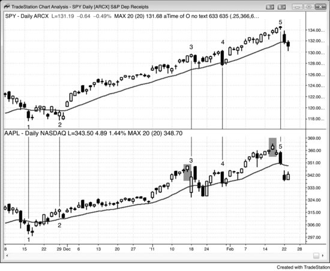
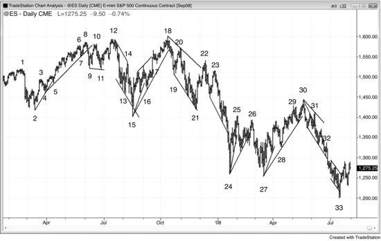
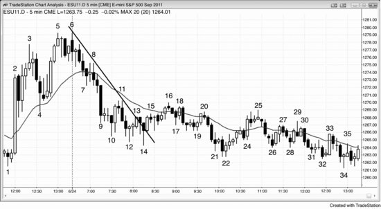

可靠地判断一次突破最终会成功还是会反转，是交易员能掌握的最重要技能之一。要记住，每一根趋势K线本身就是一次突破，而且无论这根K线看起来多强，在每一根多头趋势K线和空头趋势K线的顶部和底部，买方和卖方都同时存在。任何形式的突破道理都一样：有交易员判断突破会成功而顺势下单，也有交易员朝相反方向下单，押注突破失败、市场反转。15分钟图上一根K线完成的反转，放到1分钟图上可能（60%+）要经过好多根K线才走完；而一个跨越10到20根K线的反转过程，放到120分钟图上可能就浓缩成一根K线的反转。不管在哪个时间周期，不管反转发生在一根K线之后还是多根K线之后，背后的逻辑都是一样的。如果交易员能练就这个本领——在突破尝试出现后判断出市场更可能（60%+）朝哪个方向走——他们就拥有了优势，就会顺着那个方向下单。

反转建仓形态非常常见，因为每一根趋势K线都是一次突破，而突破之后很快就会出现试图让突破失败并反转的尝试（这一点在第二册第5章中有讨论）。如果突破看起来比反转尝试更强，那么反转尝试通常（60%+）不会成功，反而会成为新趋势中一个旗形的起点。举个例子：假设出现了一个向上突破交易区间的多头突破，急速阶段由两根大阳线（实体大、影线小的多头趋势K线）组成，紧接着下一根是一根空头十字星，那么这根空头K线就是一次试图让突破失败、把市场拉回空头趋势的尝试。由于突破力度远强于反转尝试，更可能（60%+）出现的情况是：这根空头K线下方买方多于卖方，做空的入场K线反而成为一根突破回调的买入信号K线。换句话说，反转不太可能（≤40%）成功，更可能（60%+）的结果是它成为牛旗的起点，之后市场再涨一腿。反过来，如果反转建仓形态看起来比突破强得多，那突破更可能（60%+）失败，市场更可能（60%+）反转。第二册第2章讨论了如何判断突破的强度。简单来说，强势特征越多，突破就越可能（60%+）成功，反转尝试就越可能（60%+）失败，并演变为突破回调建仓形态。

机构交易由自主交易员和计算机完成，其中程序化交易的地位日益重要。机构的交易依据是基本面信息、技术面信息，或者两者兼有，这两类交易中人工操作和计算机操作并存。总体而言，大多数自主交易员主要依据基本面信息做决策，大多数计算机交易则基于技术面数据。由于目前大部分成交量来自高频交易公司，并且大多数交易基于价格行为和其他技术面数据，因此程序化交易在整体上以技术面为主导。20世纪末，单一机构运行一个大型程序就能推动市场，这种程序会形成一段微型通道，交易员看到微型通道就知道有程序在运行。如今情况已经不同——Emini 大多数交易日都会出现十几段微型通道，其中很多成交量超过10万手。按 Emini 目前1200点左右的价位换算，这对应着60亿美元的规模，已经超过单一机构在一笔小额交易中会动用的资金量。这意味着单一机构没办法把市场推得太远或推得太久，图表上的所有运动都是多家机构在同一时间朝同一方向交易的共同结果。此外，高频交易计算机会逐笔分析每一个 Tick，全天不停地下单。当它们侦测到有程序在运行时，很多高频交易程序会顺着该程序的方向做剥头皮交易，并且在微型通道（程序）推进的过程中，往往贡献了大部分成交量。

以技术面为主要交易依据的机构不可能把价格永远往一个方向推，因为到了某个价位，以基本面为依据的机构就会觉得市场开始具有"性价比"。如果技术派机构把价格推得太高，基本面机构和其他技术派机构就会认为这是绝佳的卖出多头、建立空头的价位，它们的合力会压过做多的技术派交易，把市场打下来。当技术性交易制造出一轮空头趋势后，到了某个价位，基本面机构和其他技术派机构会明显感觉到市场已经便宜了。买方力量随即涌入，压过制造这轮抛售的技术派机构，推动市场向上反转。所有时间周期上的趋势反转都发生在支撑和阻力位附近，因为技术派交易员和程序会把这些区域当作停止追加下注、开始止盈的位置，很多人还会在这些位置反向交易。这些位置本质上都基于数学计算，而占全市场交易量 70%、占机构交易量 80% 的计算机算法清楚地知道它们在哪里。同样，做基本面的机构交易员也会关注明显的技术因素。他们把图表上的主要支撑和阻力视为价值区域，当市场运行到那里时就会反向入场。基于价值交易的程序通常（概率 60% 以上）也会在同样的区域发现价值，因为在几乎任何衡量标准下，主要支撑和阻力附近都存在显著的价值。大多数程序的决策依据是价格，这并不是什么秘密。当某个价位很重要时，不管各自的逻辑是什么，所有程序都能看到。基本面交易者——无论是人还是机器——会等待价值出现，一旦发现就大举入场。他们想在觉得市场便宜时买入，觉得市场贵了时卖出。比如，市场正在下跌，但跌到了一个机构认为开始变便宜的价位，它们就会突然冒出来大力买入。这种情况在开盘反转中出现得最为频繁和剧烈（反转可以向上也可以向下，本书后面关于开盘交易的部分会详细讨论）。空头会回补止盈，多头会买入建立新的多头仓位。没有人能精准判断市场究竟跑多远才算过头，但大多数有经验的交易员和程序通常（概率 60% 以上）对"什么时候走过头了"还是比较有把握的。

机构要等到市场明显超卖后才出手买入，因此在可能的底部上方就出现了买方真空，市场得以加速下跌到它们确信已经便宜的区域。有些机构靠程序来决定何时买入，有些则凭主观判断。一旦买入的机构足够多，市场通常（概率 60% 以上）至少会在相应时间周期的图表上走出两段上涨、持续大约十根或更多 K 线。在下跌过程中，机构一路做空，直到它们判断市场到了一个概率较高（60% 以上）的目标位、继续下跌的可能性较低（40% 以下），这时才止盈。市场越超卖，卖出量中技术性交易的占比就越大，因为当基本面交易者和程序认为市场便宜、应该很快被买入时，就不会继续做空。当市场接近主要支撑位时，买方的相对缺席往往导致抛售加速冲入支撑位，通常（概率 60% 以上）形成一种真空效应，把市场吸到支撑位下方，出现高潮式抛售，然后市场急剧向上反转。大多数支撑位挡不住空头趋势（大多数阻力位也挡不住多头趋势），但当市场最终向上反转时，一定是在某个明显的主要支撑位，比如长期趋势线。抛售的底部和向上反转通常（概率 60% 以上）伴随着非常大的成交量。在下跌过程中，市场会经历多次反弹到阻力位再回落到支撑位的往复运动，每次反转都发生在足够多的机构判断市场已经走过头、对方向提供了反向交易价值的时候。当足够多的机构在同一个价位附近采取行动时，主要趋势反转（MTR）就发生了。

判断支撑位既有基本面方法，也有技术面方法。比如，可以通过计算来估算标普 500 的市盈率倍数理论上应该是多少，但这些计算永远达不到让足够多的机构达成一致所需要的精度。不过，传统的支撑和阻力区域更容易被观察到，因此更有可能（概率 60% 以上）被很多机构注意到，也能更清楚地界定市场应该在哪里反转。在 1987 年和 2008—2009 年的两次崩盘中，市场都暴跌到月线趋势线略下方，然后向上反转，形成主要底部。之后市场继续上涨，期间多次回测，直到涨过头——而这永远发生在一个重要的阻力位。只有到那时，机构才有信心认为卖出多头、建立空头确实具有明确的价值。接着，同样的过程反向展开，市场掉头向下。

基本面（买入或卖出的价值依据）决定了整体方向，但技术面决定了实际的转折点。市场始终在探寻价值——也就是在寻找过度偏离，而且总是围绕支撑位和阻力位运行。报告和新闻随时可能改变基本面（对价值的认知），足以让市场在几分钟到数天的时间里向上或向下运行。持续数月的主要趋势反转由基本面驱动，起止都在支撑位和阻力位。每个市场、每个时间周期都是如此。

有一点很关键：当市场已经从一个主要顶部开始下跌时，新闻还在报道基本面看多；当市场已经从一个主要底部开始上涨时，新闻还在说基本面看空。新闻还在看多或看空，并不代表机构也持相同看法。应该跟着图表交易，而不是跟着新闻。价格就是真相，市场永远领先于新闻。事实上，市场顶部时新闻最看多，市场底部时新闻最看空。记者们被狂热或绝望的情绪裹挟，到处找专家来解释为什么趋势这么强、还会持续很久。他们会忽略最聪明的交易者，甚至可能根本不知道那些人是谁。那些交易者只想赚钱，不想出名，不会主动去找记者。某天一个记者打车上班，司机告诉他刚把所有股票都卖了，还把房子抵押去买黄金，这记者一下兴奋起来，迫不及待地找一个看多的专家上电视，来印证自己对黄金多头趋势的"深刻洞察"。"你想想，市场强到连出租车司机都在买黄金！这样一来大家都会抛掉其他资产来买更多黄金，市场还会再涨好几个月！"但在我看来，当最弱的那批交易者终于入场时，也就没有更多的买家了。你要获利了结，就需要一个更傻的人愿意在更高价位接盘。当再也没有人接盘时，市场只能往一个方向走——跟新闻告诉你的恰好相反。电视上那些口若悬河的教授级专家一个接一个地用高深论据告诉你黄金不可能跌、明年还会再翻倍，确实很难不被说服。但你得明白，这些人上电视是为了自我推销和制造娱乐效果。电视网需要娱乐内容来吸引观众和广告收入。如果你想知道机构到底在做什么，看图表就行了。机构体量太大，无法隐藏行踪。只要你会读图表，就能看到它们在干什么、市场要往哪里走，而这跟你在电视上看到的内容通常没什么关系。

成功的趋势反转，就是从多头趋势转为空头趋势，或从空头趋势转为多头趋势。最重要的一点是：大多数趋势反转尝试都会失败。市场具有惯性，换句话说，市场有极强的倾向去延续当前的运动状态，同时极其抗拒改变。结果就是，严格来说根本不存在所谓的"反转形态"。当趋势存在时，所有形态都是延续形态，只不过偶尔有个别会失败。大多数技术分析师会把这种失败标注为反转形态，但既然大部分时候作为反转它都会失败、趋势继续延伸，那更准确的理解方式是：它本质上只是一个延续形态。趋势就像一艘巨轮，需要长时间施加很大的力量才能改变航向。通常得先出现一段双方拉锯的走势，反方向的交易者才能夺取控制权，而这种双方拉锯就是交易区间。正因如此，大多数反转形态其实就是交易区间，但你应该预期突破方向是顺着原趋势的，因为大约 80% 的情况都是如此。有时候突破会朝反方向走，或者顺势突破很快失败然后反转。一旦出现这些情况，大多数交易员就会把这个交易区间标注为反转形态，比如双顶、头肩顶或最终旗形。第一部分列出的所有反转形态都有可能引发一段反方向的趋势，但同样也可能只是引出一段交易区间，而交易区间之后更可能（60% 以上）是趋势恢复。在这种情况下，反转形态不过是多头趋势中的牛旗，或空头趋势中的熊旗。

那些主要依据技术信息交易的机构，不可能无限期地把市场推向一个方向，因为到了某个点位，在基本面机构看来，市场就会呈现出价值机会。如果技术型机构把价格推得太高，基本面机构和其他技术型机构就会觉得这是绝佳的卖出多头和建立空头的价位，它们会压倒看多的技术型交易力量，把市场打下来。当技术型交易制造出一段空头趋势时，到了某个点位，市场在基本面和其他技术型机构眼中会明显变得便宜。买家会进场，压倒制造这轮下跌的技术型机构，推动市场向上反转。所有时间周期上的趋势反转都发生在支撑位和阻力位，因为技术型交易员和程序会在这些区域停止追涨（多头加仓）或杀跌（空头加仓），开始止盈，很多还会开始朝反方向交易。这些水平全部基于数学运算，而计算机算法贡献了全部交易量的 70% 和机构交易量的 80%，它们当然清楚这些位置在哪。与此同时，以基本面为导向的机构交易员也会关注明显的技术因素。他们把图表上的主要支撑位和阻力位视为价值区域，当市场到达这些位置时就入场做反方向交易。基于价值的程序通常也会在同一区域附近发现价值，因为不管用什么标准衡量，主要支撑位和阻力位附近几乎总是存在显著价值。大多数程序的决策都基于价格，没有什么秘密可言。当一个重要价位出现时，不管用什么逻辑，它们都看得见。基本面交易者（无论是人还是机器）会等待价值出现，一旦发现就大手笔投入。他们想在认为市场便宜时买入，认为市场贵时卖出。举个例子，如果市场正在下跌，但价格接近机构认为开始变便宜的水平，它们会突然大举买入。这种现象在开盘反转时表现得最为剧烈、也最常见（开盘反转可以向上也可以向下，本书后面讲开盘交易的部分会讨论）。空头会买回空仓止盈，多头会买入建立新的多头仓位。没有人能精确判断市场何时已经走得"够远"了，但大多数有经验的交易员和程序对于判断"走得太远了"通常还是有相当把握的。

正因为机构要等到市场明显超卖才买入，在可能的底部上方就缺少买家，市场得以加速下跌到它们确信已经便宜的区域。有些机构依靠程序来判断买入时机，有些靠主观判断。一旦足够多的机构买入，市场通常至少会向上走两段，在对应时间周期的图表上走出大约 10 根或更多 K 线。在市场下跌过程中，机构一路做空，直到判断市场到达了可能的目标位、继续下跌的概率已不大（40% 以下），此时便止盈出场。市场越超卖，卖出量中技术型交易的占比就越大，因为基本面交易者和程序在认为市场已经便宜、很快该买入的时候，不会继续做空。当市场接近一个主要支撑位时，买家的相对缺席往往导致抛售加速冲向支撑位，通常形成一种真空效应，把市场吸到支撑位下方，出现一波高潮式的抛售，然后市场急剧向上反转。大多数支撑位都挡不住一段空头趋势（大多数阻力位也挡不住一段多头趋势），但当市场最终向上反转时，一定是在某个明显的主要支撑位，比如长期趋势线。抛售底部和向上反转通常伴随着极大的成交量。市场下跌过程中会出现多次反弹到阻力位再回落到支撑位的往复运动，每一次反转都发生在足够多的机构判断市场走得太远、反方向交易已具备价值的时候。当足够多的机构在同一水平附近采取行动时，主要反转就发生了。

确定支撑位有基本面和技术面两种方法。比如，可以通过计算来估算标普 500 的市盈率理论上应该是多少，但这些计算永远不够精确，无法让足够多的机构达成一致。不过，传统的支撑和阻力区域更容易被观察到，因此更可能被众多机构注意到，它们也更清晰地界定了市场应该在哪里反转。在 1987 年和 2008—2009 年的两次崩盘中，市场都暴跌到月线趋势线略下方然后反转向上，形成了一个主要底部。市场会一路上涨，中间经历多次向下的回测，直到走得太远——而这总是发生在一个重要的阻力位。只有到那时，机构才能确信卖出多头和建立空头具有明确的价值。然后整个过程反转，市场开始下跌。

趋势反转有两种方式：一种快速果断，早期就能确认方向；另一种缓慢展开，跨越十几根甚至更多K线才逐步成形。缓慢反转时，市场起初看上去只是在形成又一个旗形，但回调幅度不断扩大，直到顺势交易者放弃抵抗，市场向逆势方向突破。举个例子：假设空头趋势开始回调，形成了一个低 1 建仓形态，但信号触发后市场马上反弹上去。接着低 2 入场被触发，结果也在一两根K线内失败。到这一步，市场要么直接向上突破熊旗顶部，要么再推一腿形成楔形熊旗，入场再次失败后向上突破。反转推进到某个节点，大多数交易者就会确信 Always-in 的方向已经翻转——这几乎都需要某种形式的突破来确认。第 15 章会详细讨论这一点，简单来说：如果你必须始终持仓，要么做多要么做空，那 Always-in 的方向就是你当前应该持有的方向。这里突破的特征跟任何突破一样，在第二册第一部分关于突破的章节中已经讨论过。到了这个阶段，新趋势已经确立，交易者的思路也要跟着转过来。多头趋势反转为空头趋势时，不再用突破单在K线上方买入，也不再用限价单在K线下方买入，而是开始用限价单在K线上方卖出、用突破单在K线下方卖出。空头趋势反转为多头趋势时，不再用突破单在K线下方卖出，也不再用限价单在K线上方卖出，而是开始用突破单在K线上方买入、用限价单在K线下方买入。关于趋势行为的更多内容，参见第一册第三部分。

每段趋势都运行在一个通道内，由趋势线和趋势通道线围成边界——哪怕快速扫一眼图表时通道不一定看得出来。这几本书里最重要的一条规则是：在价格突破一条有意义的趋势线之前，根本不应该考虑逆势交易。就算出现了趋势线突破，也只有在信号K线足够强的时候才应该做反转交易——你需要看到对手方展现出足够的力量，有机会夺取控制权。即便如此，仍然应该继续寻找顺势交易机会，因为第一波逆势冲击之后，市场几乎总会回到趋势方向去测试前一个趋势极值。只有极少数情况下，趋势线突破的动能强到连这次回测都做不了哪怕一笔剥头皮交易。如果市场在前一个极值附近再次失败，说明它两次尝试突破该水平都没成功。而市场两次尝试做同一件事都失败时，通常 (60%+) 就会转向反方向。正是在这次对前一个极值的测试之后，才应该去找逆势波段交易的机会——前提是离开前一个极值时必须出现一个好的建仓形态。

区分反转交易和逆势刮头皮非常重要。反转交易是指 Always-in 方向可能 (60%+)发生翻转的那种交易。逆势刮头皮不是反转交易，它的交易者方程通常 (60%+)不好，而且大多出现在通道中。通道总是看起来像马上要反转，把交易员骗进去用突破单做逆势交易。这些交易员很快就会被套，不得不亏损出场。举个例子，在多头通道里，每次突破到新高之后，通常 (60%+)都会出现一根看起来还不错的空头反转K线或内包K线。新手一看到均线附近还有足够的空间可以做个空头刮头皮，就在K线低点下方用突破单做空。这种逆势刮头皮，70%甚至更多都是亏钱的，而且平均亏损比平均盈利还大。他们之所以做空，是因为急于交易，同时大多数买入信号看着都偏弱，往往迫使交易员在接近通道顶部几个 Tick 的位置买入。逆势建仓形态常常配着好看的信号K线，让交易员觉得可以巧妙地做个空头刮头皮，同时等一个好看的买入建仓形态出现。他们把之前那些空头反转K线和回调看作抛压在积累的信号——这判断没错。但大多数空头刮头皮最终不过是微形的卖出真空效应：市场被吸向某个支撑位，比如通道底部附近，或者某个较小的 HL 下方。一旦到了那里，强势多头就开始积极买入。许多人在新高处止盈，制造出下一个卖出信号，而这个信号又会像之前所有卖出信号一样失败。高频交易公司的手续费极低，靠 1 到 2 个 Tick 就能赚钱，但你做不到。虽然反转K线看起来不错，但这些并不是可交易的反转，交易员不应该去做。只要信号还不足以把 Always-in 的方向翻转成空头，就只做顺势交易。机构在那些卖出信号K线的低点下方买入。如果你想在通道形成期间交易，要么像机构那样在前一根K线下方用限价单买入，要么在高 2 信号K线上方买入——那里正是空头通常 (60%+)回补亏损空单的位置。不过这对很多交易员来说很难，因为他们看得出通道里有大量双向交易，也知道在通道顶部、双向交易密集的地方买入，交易者方程往往只是勉强为正。

**趋势反转**，简称反转，不一定是真正意义上的趋势反转，因为这个词实际上是指市场从一种行为转变为任何一种相反的行为。最好的理解方式是：多头趋势转为空头趋势，或者反过来，这就是第一部分的主题。交易区间的行为可以说是趋势行为的对立面，所以当交易区间突破形成趋势时，市场的行为确实反转了，但更常见的说法是突破。回调是一个小型交易区间，也是一段与大趋势方向相反的小型趋势；当回调结束时，这段小趋势反转回到大趋势的方向。大多数趋势反转最终会变成高时间周期上的回调——也就是说，大多数最终演变为大型交易区间；不过有些确实会发展成方向相反的强劲、持久趋势。即使反转只带来了一个交易区间，反转入场通常 (60%+)也能走出足够远的距离来做一笔波段交易。

大多数趋势反转尝试不会产生一个方向相反的强趋势，而是走入交易区间。严格来说，市场行为确实反转了——从单边交易变成了双向交易——但趋势本身并没有反转成方向相反的趋势。交易员事先永远不知道到底会不会反转出一段新趋势，而且反转进入交易区间和反转进入新趋势，在好几十根K线的范围内看起来往往一模一样。正因如此，交易员要过很久才能判断出究竟是反转成了方向相反的趋势，还是只是过渡到了一个交易区间。这也是为什么大多数回报远大于风险的交易，初始概率都很低。随着走势逐渐明朗，回报会变小——因为剩余空间里没剩多少 Tick 了；风险则会变大——因为波段交易的理论最佳止损位要放到最近一波急速的起点之外（多头放在最近的 HL 下方，空头放在最近的 LH 上方，距离可能很远）。从交易员的角度看，这并不要紧，因为无论反转最终演变成一段强劲的新趋势还是只变成几段较大的逆势腿，交易方式都是一样的。当然，如果出现一波巨大的波段且价格不会回到盈亏平衡点止损位，利润会更多；但即便市场停滞不前、只是变成了一个大型交易区间，他们仍然可以赚到很多钱。不过在交易区间里，做剥头皮通常 (60%+)比做波段交易赚得多。交易区间和回调在第二本书中已经讨论过。在真正的趋势反转中，新趋势可以走很远，交易员应该把大部分仓位做成波段持仓。

趋势反转可以是剧烈且即刻发生的，一开始就带有很强的确定性；也可以在十几根甚至更多K线的过程中缓慢完成。缓慢反转时，市场通常 (60%+)看起来像是在形成又一个旗形，但回调不断扩大，直到某个时刻顺势交易员放弃，市场向逆势方向突破。举个例子，假设空头趋势开始回调，形成了一个低 1 建仓形态，但信号触发后市场立即向上翻转。然后低 2 入场被触发，同样在一两根K线内就失败了。到了这一步，市场要么直接突破空头旗形的顶部，要么再推一波上去触发楔形熊旗的入场、随即失败，然后市场向上突破。反转在某个节点上会让大多数交易员相信 Always-in 的持仓方向已经翻转，而这几乎总是需要某种形式的突破。这一点在第 15 章有详细讨论，简单来说就是：如果你必须一直在场——要么做多要么做空——那么 Always-in 的持仓方向就是你当前的持仓方向。突破的特征与任何突破都一样，在第二本书第一部分关于突破的章节中已经讨论过。到了这个阶段，新趋势已经形成，交易员要转换思路。当多头趋势反转为空头趋势时，不再在K线上方用突破单买入、在K线下方用限价单买入，转而在K线上方用限价单卖出、在K线下方用突破单卖出。当空头趋势反转为多头趋势时，不再在K线下方用突破单卖出、在K线上方用限价单卖出，转而在K线上方用突破单买入、在K线下方用限价单买入。更多关于趋势行为的内容，参见第一本书的第三部分。

每一段趋势都包含在一个通道内，由趋势线和趋势通道线围成，即使快速扫一眼图表时通道可能并不明显。这几本书中最重要的一条规则是：在通道被突破之前——也就是价格突破一条重要趋势线之前——永远不要考虑做逆势交易。而且，只有在信号K线足够强的时候才应该做反转交易。你需要看到对手方有足够力量、有机会夺取控制权的证据。即便如此，你仍然应该继续寻找顺势交易的机会，因为第一波逆势冲击之后，市场几乎总是会回到趋势方向去测试之前的极端价位。只有极少数情况下，趋势线突破的动能强到连测试都不够做一笔刮头皮。如果市场在原来极端价位附近再次失败，就意味着市场两次尝试突破这个价位都没有成功——每当市场两次尝试做某件事都失败时，通常 (60%+)就会尝试做相反的事。在这次对旧极端价位的测试之后，你才应该去寻找逆势波段交易的机会，而且只有在从旧极端价位反转离开时出现了好的建仓形态才行。

如果市场确实反转进入一段反向趋势，这段新趋势可能延续很长，也可能只持续一根K线。市场也可能在走了一两根K线后就开始横盘，之后才继续向上或向下运动。很多技术分析人士只在事后——当一系列趋势性高点和低点已经形成之后——才会使用"**反转**"这个词。但这在实战中没什么用，因为等这些条件都满足了再动手，交易者方程会变差：新趋势持续的时间越长，出现较大幅度回调（更大的浮亏）的概率就越高。一旦交易员开始在趋势反方向上入场，说明他已经相信趋势反转了，尽管严格的标准尚未满足。比如，如果交易员在空头趋势中做多，说明他们相信市场大概率不会再跌哪怕一个 Tick——否则他们会继续等。既然他们是基于"市场要涨"的判断买入的，就说明他们认为趋势已经转向上行，反转已经发生了，至少在足以支撑这笔交易盈利的尺度上是这样。

很多技术分析人士不接受这个定义，因为它并不要求趋势的一些基本构成要素存在。多数人对趋势反转会提出两个条件。第一个是硬性条件：反转走势必须突破前一段趋势的趋势线，也就是说旧的趋势通道已经被打破。第二个条件大多数时候会出现，但不是必须的：趋势线被突破之后，市场回来对旧趋势的极端点做一次成功的测试。极少数情况下会出现高潮式反转——初始走势非常有力且持续很久，根本不会回到旧极端点附近做测试。

这个过程对任何反转都是一样的。每段趋势都运行在一个通道里，走势突破趋势线时，就突破了这个通道。突破趋势线之后，市场会出现一波顺着原趋势方向的回撤。顺势交易者希望这次反转尝试失败，旧趋势继续延续。如果他们判断正确，新的趋势通道通常（60%+）会更宽、更平缓，说明动能有所减弱。趋势成熟后出现这种情况很正常。他们把这次趋势线突破仅仅看作又一个旗形，之后趋势还会继续延伸。

逆势交易者的期望则相反：他们希望突破之后市场顺着旧趋势方向回撤的这一波是突破回测，随后至少再走出一段逆旧趋势方向的腿。如果突破成功，市场在测试时不会恢复原趋势，而是再次反转，这次测试就变成了新趋势中的一个突破回调，或者至少是一段更大幅度回调的组成部分。以空头趋势中向上突破空头趋势线为例：某个时刻这波上涨会尝试回落，然后跌到更低的低点、双底或更高的低点——这就是对空头低点的测试。如果测试成功，这次测试就成了向上突破空头趋势线之后的突破回调，新的多头趋势至少再走一段腿。当向上的反转演变为一段新趋势时，突破空头趋势线的那波上涨就是多头开始掌控市场的时刻，即使这波多头突破之后的回调跌到了更低的低点。多数交易员会把那个更低的低点视为多头趋势的起点，但实际上多头往往在突破空头趋势线的那波急速走势中就已经掌控了局面。至于多头趋势是起始于急速走势的底部，还是起始于那个更低低点的反转位置，这并不重要，因为交易方式是一样的：在市场从更低的低点（或双底、或更高的低点）反转向上时寻找买入机会。随后的上涨可能演变为大型两段式回调、交易区间的起点，或者一段新的多头趋势。不管最终结果如何，多头都有不错的概率做出一笔盈利的交易。如果测试失败，市场会继续下跌走出新的空头腿，交易员必须等新的空头通道被向上突破、并对新的空头低点完成测试后，才能再寻找做多机会。反过来看多头趋势也是一样的道理：多头趋势中出现一波向下突破多头趋势线的空头急速走势，然后出现更高的高点、双顶或更低的高点形式的回调。空头在那波急速走势中就已经开始掌控市场了。对多头高点的测试——即使超过了旧高点——本质上仍然只是初始空头突破（向下突破多头趋势线）之后的一个回调。

一旦出现一波强劲的逆势走势，随后的回调对多头和空头来说都是一次考验。举个例子：假设多头趋势中出现了一波强烈的下跌，这波下跌击穿了一条已经维持了20到40根K线的趋势线，之后又继续下行了20根K线，价格远低于20周期均线，甚至跌破了多头趋势中上一个HL的低点——这说明空头已经展现出相当大的力量。当第一段下跌走势耗尽之后，空头会开始部分止盈，多头则会重新建立多头仓位。双方的动作都会推动市场上涨，多头和空头都会非常仔细地观察这波反弹。由于前面那段下跌非常强劲，多空双方都相信，在市场突破到新高之前，那个低点有很大概率（60%以上）会被再次测试。因此随着市场反弹，如果上涨势头不强，新进场的多头就会开始止盈，空头则会更加积极地加仓做空。与此同时，那些在之前下跌过程中一直扛着多头仓位的交易员，也会趁这波反弹出场。他们原本打算一直持有多头仓位，直到看到强势空头出现——既然空头已经展示了令人印象深刻的力量，他们就会抓住任何反弹机会离场。这相当于市场上方悬着一批卖压，既会压制反弹幅度，也会增加再下一段腿的概率。这波反弹中很可能（60%以上）会出现许多空头趋势K线和影线，两者都说明多头力量偏弱。反弹结束后的回落，就会形成潜在新空头趋势中的第一个LH。无论如何，出现第二段下跌腿的概率很高，因为多空双方都预期如此，也会据此交易。

仍然会有一些多头在更低的位置买入，希望给多头趋势每一个恢复的机会。交易员都知道大多数反转尝试会失败，很多一路持有上来的多头，在空头展示出将市场大幅压低的能力之前，不会选择平仓。不少多头买了看跌期权来保护自己，以防出现严重反转。有了看跌期权的保护，他们就可以继续持仓，给多头趋势每一个恢复的机会。他们知道无论市场跌多深，看跌期权都能限制亏损。然而，一旦看到这种令人印象深刻的抛压，他们就会找反弹机会最终平掉多头仓位，并在市场重新上涨时对看跌期权止盈。此外，他们的大多数看跌期权会在几个月内到期，一旦到期就失去了下行保护。这意味着除非不断买入新的看跌期权，否则无法继续持有仓位。如果他们判断市场有很大概率（60%以上）还会继续下跌，而且短期内不会再反弹，那持续为看跌期权付费就不划算了，于是他们会选择卖出仓位。这部分卖出形成的供应会压制反弹幅度，再加上激进空头的做空，以及那些把之前下跌视为买入机会的多头的止盈——这些力量汇聚在一起，就会推动形成第二段下跌腿。

这些坚持持仓的多头，每个人心中都有一个下方的价格关口，一旦市场跌到那个位置，他们就会想在下一次反弹时出场。随着市场不断走低，越来越多的多头会认定多头趋势短期内不会恢复，趋势可能已经反转为空头趋势。这些最后的死硬多头会耐心等待空头波段中的回调来平掉多头仓位，他们的仓位就像悬在市场上方的供应。他们会在最近一个波段高点下方卖出，因为他们怀疑市场不太可能涨过前一个波段高点，只要能在最近一个低点上方出场就已经满意了。空头同样会在每个新低之后等回调来加仓或建立新的空头仓位。最终的结果就是一系列LH和LL，这正是空头趋势的定义。

通常，初始的那波走势会突破趋势线，然后形成一个回调来测试旧趋势的末端，交易员会在这次测试之后寻找顺着新趋势方向的入场机会。大多数交易员希望突破趋势线的那一段和测试旧趋势极值的那一段都不止两三根K线。5根够不够？10根呢？这完全取决于背景。如果趋势线突破中只有一两根特别大的K线，也足以让交易员预期至少会出现第二段腿。两根K线的回调够不够作为对旧极值的测试？大多数交易员希望至少看到5根左右的K线，但有时候趋势线突破或回调只有两三根K线，也足以让交易员确信趋势已经反转。如果两段腿中有一段只有几根K线，大多数交易员不会积极交易新趋势，除非另一段腿有更多K线。正因如此，新趋势很少会在仅仅两根K线的趋势线突破加两根K线的旧趋势测试之后就启动。即便真的出现了这种情况，大概率在随后10根K线左右也会出现一次更大的回调。

趋势线被突破后的测试，可能不及前一个极值点，也可能略微超过，但不会超出太远。做任何逆势交易时，交易员都应该坚持等待一根强信号K线出现，因为缺少强信号K线，成功概率会大打折扣。举个例子，如果市场处于空头趋势，然后出现一波猛烈的上涨，远远突破空头趋势线，交易员就会在第一次回调时寻找做多机会，期望这是一系列HL中的第一个。他们希望看到一根强多头反转K线或两K线反转形态，才会入场。但有时候，回调会跌破空头趋势的低点，把新建多单的止损全部扫掉。如果这个LL在几根K线内重新反转向上，仍然可以带来一波强劲的上涨。反过来，如果LL离前低太远，最好认为空头趋势已经开启了新一腿下跌，然后等待又一次趋势线突破、一波向上的动能爆发，以及一个HL或LL的回调，再考虑做多。

虽然交易员都喜欢在新多头趋势中买入第一个HL，或者在新空头趋势中卖出第一个LH，但如果新趋势发展顺利，后面还会有一连串回调，形成趋势性波段（多头趋势中的HH和HL，空头趋势中的LH和LL），每一次回调都能提供很好的入场机会。回调可能是一根强空头急速K线，但只要交易员认为趋势方向已经转为向上，他们就会在这根强空头趋势K线收盘附近买入，预期不会有跟随卖盘，并期待这次空头突破会失败。多头把这根强空头急速K线视为一次短暂的折价买入机会。新手则不幸地把它当作新空头趋势的起点，忽略了之前所有K线释放的多头信号，只盯着这一两根空头急速K线，恰恰在强势多头买入的位置做空。多头预期空头的每一次尝试都会失败，所以他们会在每一次下跌中寻找买入机会——在每根空头趋势K线的收盘附近买入，即使那根K线很大、且收在最低点；在市场跌破前一根K线低点、任何前期波段低点、以及任何支撑位（比如趋势线）的时候买入。他们也会在市场试图上涨时买入，比如在多头趋势K线高点附近，或者市场突破前一根K线高点、突破阻力位的时候买入。这跟交易员在强空头趋势中的做法正好相反——在强空头趋势中，交易员在K线上方和下方卖出，在阻力和支撑的上方和下方卖出。他们在K线上方（以及各种阻力位附近）卖出，包括在强多头趋势K线上方卖出，因为他们把每一次上涨都视为趋势反转尝试，而大多数趋势反转尝试都会失败。他们在K线下方（以及各种支撑位附近）卖出，因为他们把每一次下跌都视为空头趋势恢复的信号，预期大多数都会成功。

反转向上进入新多头趋势后，第一次回调通常（60%以上的概率）是对空头低点的测试，但也可能根本到不了空头低点附近。这次回调，跟新多头趋势中后续的所有回调一样，也可以是对某个关键点位突破后的回踩测试，比如最近的信号K线高点、入场K线低点、趋势线、前期波段点、交易区间或均线。市场突破第一腿上涨的高点之后，多头会把保护性止损上移到这个HL下方。之后每出现一个新的HH，他们就继续把止损跟踪到最近的HL下方，直到他们认为市场已经变得足够双向、可能开始出现两段式的向下回调为止。一旦他们认定市场会出现第二腿下跌，而且这一腿有60%以上的概率跌破第一腿下跌的低点（也就是最近的HL），他们就会在强势时了结多单——比如在一根多头趋势K线的收盘附近，该K线处于趋势高点、略高于高点或略低于高点的位置——或者在跌破前一根K线低点时出场。等到价格已经跌到那个HL附近再出场就没意义了。相反，他们会在更高的价位出场，然后等价格回落到那个HL附近再寻找重新买入的机会。如果这个多头旗形是横盘走势，它可以是一个简单的高2、一个三角形或一个双底；也可以走出一个LL，形成传统的ABC回调。

还有一些在更低价位买入的多头，他们想给多头趋势充分的恢复机会。交易员知道大多数反转尝试都会失败，很多从趋势底部一路持有的多头，在空头展现出强力下推能力之前不会了结多单。许多多头买了看跌期权来对冲剧烈反转的风险。看跌期权让他们能够继续持有多单，给多头趋势充分的恢复机会。他们知道，不管市场跌多深，看跌期权都能限制亏损。但一旦看到凶猛的抛压，他们就会等一波反弹来最终了结多单，同时在市场回升时对看跌期权获利了结。而且，他们大部分看跌期权会在几个月内到期，到期后下行保护就消失了。这意味着，除非不断买入新的看跌期权，否则他们无法继续持仓。如果他们认为市场有60%以上的概率继续下跌，而且很多个月内都不会再涨回来，那持续为看跌期权付费就不划算了，他们会选择卖出持仓。这些卖盘会压制反弹——他们的卖出，加上激进空头的做空，以及那些把下跌视为买入机会的多头的止盈，会共同推动第二腿下跌。

这些顽固的多头，每个人心里都有一个下方的价位——一旦价格到了那里，他们就会想在下一次反弹时出场。随着市场不断走低，越来越多这样的多头会认定多头趋势短期内不会恢复，趋势可能已经反转为空头趋势。这些最后的死多头会耐心等待空头波段中的反弹来了结多单，他们的仓位就像悬在市场上方的供给。他们会在最近的波段高点下方卖出，因为他们怀疑市场不可能涨过前一个波段高点，能在最近低点上方的任何价格出场就已经满足了。空头同样会在每一次新低之后的反弹中加仓做空或新建空仓。结果就是一系列LH和LL——这正是空头趋势的定义。

典型的情况是，初始的一波运动突破趋势线，然后形成一次回调来测试旧趋势的极值点，交易员会在这次测试之后寻机建立逆势仓位（实际上是顺着新趋势方向的顺势交易）。大多数交易员希望突破趋势线的那一腿和测试趋势极值点的那一腿都不止两三根K线。5根够不够？10根呢？这完全取决于背景。如果趋势线突破只有一两根特别大的K线，那也足以让交易员预期至少还有第二腿。两根K线的回调算不算对旧极值点的充分测试？大多数交易员希望至少看到5根左右的K线，但有时候趋势线突破或回调只有两三根K线，也足以让交易员确信趋势已经反转。如果两腿中有一腿只有两三根K线，大多数交易员不会激进地交易这个新趋势，除非另一腿有更多K线。正因如此，新趋势很少在仅仅两根K线的趋势线突破加两根K线的旧趋势测试之后就开始。即使偶尔出现这种情况，大概率在接下来10根左右的K线内还会出现一次更大的回调。

所有趋势都运行在通道内，大多数趋势以突破趋势通道线的方式终结——尽管在你当前看的时间周期上未必看得出来。拿多头趋势来说，通常有两种结束方式。第一种，市场向上突破通道，试图形成一段更陡的多头趋势。这种突破很少成功，通常在1到5根K线内就失败了。市场随后回落到趋势通道线下方、重新进入通道，最小目标是跌破通道底部的趋势线。之后通常（60%+）至少会出现两段式的横盘到下跌走势，可能（60%+）演变为趋势反转或交易区间。第一腿下跌后的回调通常形成一个LH，第二腿下跌通常会延伸到某个测量移动目标——比如腿1 = 腿2的等距移动，或者以空头急速的高度、多头通道内某段交易区间的高度做投影。

另一种情况是，市场没有先过冲趋势通道线，而是直接跌破多头趋势线。跌破的方式可以是一根急速下跌K线，也可以是横盘漂移、逐步滑入交易区间。不管哪种方式，回测多头高点时既可能形成HH，也可能形成LH，两者出现的概率大致相当。大约三分之二的情况下至少会出现两腿下跌，所以如果形成了HH，之后应该跟着两腿下跌；如果形成了LH，则可能（60%+）只需要再跌一腿，因为LH形成之前已经走完了第一腿下跌。剩下大约三分之一的情况里，反转尝试失败，多头趋势恢复或者演变为交易区间。

如果回测前高时形成了HH，最好的交易之一是在第一个LH处寻找做空建仓形态——这个LH本身就是对HH的测试。在空头趋势中，如果出现一波猛烈的上涨、突破了主要空头趋势线，交易员会在第一个HL处买入。他们的买入推动市场继续上涨，强化了所有人对新多头趋势可能（60%+）正在启动的预期。

有一个要点很重要：趋势的持续时间远远超过大多数交易员的想象。正因为如此，大多数反转形态最终会失败、演变为顺势建仓形态，而大多数顺势形态会成功。交易员在依据反转形态做逆势交易时必须非常谨慎，但确实有一些价格行为建仓形态能显著提高盈利概率。

既然大多数反转尝试都会失败，很多交易员会选择反方向入场。比如，多头趋势中出现了一根大阴线（空头趋势K线），而且收在最低价，大多数交易员会预期这次反转尝试失败，很多人会在这根空头K线收盘时买入。如果下一根K线是阳线（多头实体），他们会在该K线收盘时和高点上方再次买入。第一目标是那根空头趋势K线的高点，下一个目标是向上的测量移动，幅度等于那根空头趋势K线的高度。有些交易员会设一个初始保护性止损，距离大致等于那根空头趋势K线高度对应的 Tick 数；另一些则用自己常规的止损，比如 Emini 上2个点。

如果你发现自己在趋势中画了很多趋势通道线，还看到了大量楔形反转建仓形态，说明你太急于找反转了，很可能（60%+）错过了许多优质的顺势交易机会。而且在强趋势中，大多数趋势通道线过冲和反转都是次级别的，最终会失败，你会连续亏损，还纳闷为什么这些形态明明看着不错却一直不灵。正确的做法是：等趋势线被强力突破之后，再去找逆势交易机会；把那些次级别的趋势通道线过冲看作顺势建仓形态的起点，在亏损者触发保护性止损出场的位置入场。这样做会让你更从容、更轻松，也更赚钱。你会惊讶于这些交易的效果——从直觉上看它们似乎不该这么好用，但实际上就是好用。

新手之所以忍不住在强多头趋势中做空回调，一个重要原因是：市场在每一段上涨的顶部附近停留太久，让人等回调等得不耐烦，回调却迟迟不来。再加上屏幕上方看起来已经没什么空间了，很容易产生"涨不动了，该跌了"的错觉。行情明显过度延伸，均值回归肯定马上就来，反转一旦启动，至少够赚一笔剥头皮的利润。交易者开始觉得，与其干等回调，不如先做点什么——身为交易者，就该交易嘛。但他们真正该想的是：自己的目标是赚大钱，而不是做更多交易。因为不敢在高位买入，又觉得回调早该来了，便选择做空，指望市场一回调就能赚到钱。大多数时候，市场确实会稍微回调一点，但随即又掉头向上。跌幅根本不够让逆势剥头皮获利，最终只能止损出场。紧接着多头趋势又以一波快速突破恢复，而他们只能站在场外看着行情走远，心里难受，账户也又缩水了一些。经验丰富的交易者则恰恰相反。很多人在那根弱空头信号K线的低点挂限价买单，还有人在小幅回调中、前一根K线高点上方一个 tick 的位置挂买入突破单做多。当回调形成了一个做多的入场形态时，新手还盯着之前引发回调的那个顶部不放，担心市场还会跌；或者他们仍被套在空头仓位里，盼着再跌一点好让空单获利。心想"做了这么多次空，总该有一次能赚吧。刚才连续四次做空都亏了，市场这么不公平，总该补偿我一下。"他们不愿接受一个事实：这完全是概率问题，跟公平或情绪没有任何关系。经过几个月甚至几年的亏损之后，他们终于想通了：看到多头趋势时，全天不做一笔空单。这一天就是他们不再亏钱的起点。又过了很多个月，他们做出决定：在多头趋势中只在回调时买入，不做其他任何交易。这一天就是他们开始赚钱的起点。

在多头趋势中，买方持续买入，直到他们觉得交易者方程不再那么有利，这时开始分批止盈。随着市场继续上涨，他们不断减仓获利了结，在出现回调之前不会急着再次买入。与此同时，持续上涨也在逼迫空头回补——他们被迫买回空头仓位。到了某个时点，该回补的都回补完了，这部分买盘也就消失了。还有一类动量交易者，只要动量还在就继续买入，但一旦动量放缓就会迅速止盈。市场会一直涨，直到价格超过等距移动方向上的概率均衡点。多头和空头都无法确切知道这个概率何时是 50%，趋势会一直持续到数学上明确有利于下跌为止。中性状态永远不好判断，过度延伸的状态却容易识别得多。反转总会发生在某个磁力位附近，但可选的磁力位太多，很难提前判断哪一个会起作用。通常需要多个磁力位重叠（概率在 60% 以上），回调才会真正展开。有些机构根据一个或几个磁力位下单，另一些机构依据的是不同的磁力位；但一旦预期回调的机构达到临界数量，市场就会掉头。这个临界点出现在抛压超过买压的时刻——预期回调的交易者投入的资金规模压过了买方。市场不再缺少卖单，不必再靠拉高价格去寻找对手方。相反，交易者会迅速在卖出价做空；实际上，他们还会在买入价做空，市场因此不得不继续下探，才能找到足够的买方来消化大量卖单。这些卖方由两部分组成：平掉多头仓位的多头，以及新开空头仓位的空头。

那么，到底是谁在多头趋势的最高点买入，又是谁在空头趋势的最低点卖出？是不是无数散户在恐慌中被裹挟——要么方向做反了，亏损急剧扩大时被迫砍仓；要么踏空之后，在快速行情中冲动追入？要真是散户有这么大影响力就好了！很久以前或许如此，但在今天的市场里并非这样。既然高低点附近成交量那么大，而且大部分来自机构，那这些聪明的机构为什么还要在最高点买入呢？答案是：当天绝大部分成交量由基于统计学的数学算法驱动，其中一些模型会持续买入，直到出现明确的趋势反转信号，届时才会翻空。这些动量程序会一路买到多头趋势的最后一个 Tick，也会一路做空到空头趋势的最低点，因为系统设计者经过验证后发现，这种做法能实现利润最大化。记住，趋势具有惯性，很难轻易结束，因此押注趋势延续是一笔好交易。由于机构的成交量极大，在高点处有充足的买盘来承接顶部涌入的大量卖单，底部则反过来。

机构虽然聪明、成交量大，但这并不意味着它们每天能赚 5% 的利润。事实上，即使是最顶尖的机构，每天的净利润也不过是一个很小的百分比。之所以有些机构在最高点仍在买入，是因为经过测算后发现，继续买入能让利润最大化——它们相信市场至少还能再涨一两个 Tick。很多高频交易算法的目标就是每笔只赚很少的利润，如果量化团队的回测结果显示在高点处买入还能多赚几个 Tick，它们就会继续买。此外，还有很多机构采用涉及期权和其他产品的复杂策略，我们根本无从知道在极端价位上有哪些因素在起作用。举个例子，某家机构可能预期市场即将下跌反转，于是建立一个 delta 中性的价差组合：买入 200 手 Emini 合约，同时买入 2000 手 SPY 平值看跌期权。只有当市场连续几天在非常窄的区间里横盘时，这个组合才会亏钱。如果市场上涨，看跌期权亏损的速度比 Emini 盈利的速度慢；如果市场下跌，看跌期权升值的速度比 Emini 多头头寸贬值的速度快，于是中性价差会越来越偏向空头。这样一来，即使它们在当天最高点买入了 Emini，最终也能盈利。你只需要知道一点：极端价位上的成交量巨大，这些成交量来自机构，其中有些在高点买入，有些在高点卖出。

顺便说一句，还有一个常见迹象可以说明数学化、计算机化的交易有多活跃。观察那些相关联的市场——比如 Emini 和所有相关的交易所交易基金（ETF），像 SPY——你会发现它们基本上逐 Tick 同步运动。其他关联市场也是如此。如果靠人工操作，全天不可能做到这么精准的同步。另外，如果不是绝大部分成交量由计算机生成，图表形态也不可能在所有时间周期上——甚至在 Tick 图上——都如此完美。人类根本无法在这么多市场上同时以这么快的速度完成分析和下单，因此这种精确性只能是计算机交易的结果，而且计算机交易必然占了总成交量的大头。

当趋势很强、没有明显回调时，交易员往往开始寻找小型反转机会，因为凭直觉也知道：总会有人开始部分止盈，逆势交易者也会陆续进场，市场迟早要回调。均值回归的逻辑在生活中随处可见，交易中也一样。问题是，回调通常要等到市场走到大多数人想象不到的极端位置之后才会出现。交易员必须权衡：是做一笔逆势剥头皮，还是等回调结束后再顺势入场。如果趋势很强，通常只有在出现明确的趋势反转信号时才值得逆势操作，比如先出现一次有力的趋势线突破，再经过一次回测，最后以一根强反转K线收尾。但人总是手痒想做点什么，很多交易员就会切到更低时间周期的图表上去找机会，比如1分钟图或100 Tick图。低时间周期的图表在趋势推进过程中会不断出现反转形态，但绝大部分都会失败。交易员可能会这样自我安慰：1分钟图的K线很小，风险只有大约4个Tick，万一这里恰好是市场的最高点，潜在收益就很大，所以亏几笔小的也值得。结果呢，"几笔小亏"变成了六七笔，累积的亏损当天根本补不回来。偶尔运气好，真抓到了趋势的尽头，交易员又往往只赚几个Tick就平仓，而不是按原先计划那样持仓做一大段。这就是"数学上的慢性死亡"。能在空头趋势的最低点买入、或在多头趋势的最高点做空，当然很有成就感，但如果10次里亏9次，账户就会被慢慢掏空。对大多数交易员来说，在多头趋势中买回调、在空头趋势中卖反弹，才是好得多的做法——机会更多，胜率也更高。

如果你在一段持续的趋势中因为空仓而变得焦躁，觉得必须做点什么，于是跑去看1分钟图，那些1分钟图上的反转形态确实能带来可观的利润——但做法恰恰与表面看到的相反。等1分钟图上触发了一个逆势入场信号后，你不去做那笔交易，而是想一想：如果自己真的进了这笔逆势单，保护性止损会放在哪里。然后在那个价位挂一张顺势的突破单。这样一来，逆势交易者被止损扫出的同时，你就顺势进场了。在那个位置不会有人再想逆势入场，而且在下一个逆势建仓形态开始形成之前，趋势很可能（概率60%以上）已经走出足够的空间让你获利。这是一笔胜率非常高的顺势剥头皮交易。

最可靠的"逆势交易"，实际上是在更大时间周期上的顺势交易。回调本身就是大趋势中的一小段反向运动，当你逆着回调方向入场时，其实是在顺着大趋势方向交易。一旦回调方的力量耗尽，趋势方重新展现出力量、突破了包含回调的那条趋势线，任何对这次突破的小幅回测都是很好的突破回调入场机会。这笔交易虽然逆着回调方向，但与大趋势方向一致，通常至少能走到测试大趋势极值的位置。趋势线突破时的动能越强，这笔交易盈利的可能性（概率60%以上）就越大。举个例子，如果出现了一个牛旗，你可以在牛旗底部买入，也可以在牛旗突破时买入，或者在突破后的小幅回调处买入，目标都是测试多头趋势的高点。

反转中的动能可以表现为几根大型趋势K线，也可以表现为一连串普通大小但方向一致的趋势性K线。强势特征越多，反转就越可靠。这些内容在第2册第2章关于突破强度的讨论中，以及第1册第19章关于趋势强度的讨论中有更详细的说明。理想情况下，反转的第一腿应该持续很多根K线，明确突破均线，其中大部分是新趋势方向的趋势K线，并且延伸超过前一个趋势中的波段点（如果前一个趋势是多头趋势，那么新空头趋势的第一腿跌破并收在前一个多头趋势的一个或多个更高低点下方，就是一个强势信号）。

大资金在趋势的急速阶段会毫不犹豫地入场，因为他们预期后续还会有明显的跟随走势，即便入场后马上出现回调也不担心。如果真的回调了，他们反而会加仓。举个例子，假如出现了一波持续好几根K线的强劲多头突破，每创一个新高，就会有越来越多的机构确信市场已经进入 Always-in 做多状态。他们相信价格还会继续走高，于是纷纷买入，推动急速阶段迅速延伸。他们的入场方式多种多样：市价买入、在一两个 Tick 的回调处买入、在前一根K线高点上方挂突破买入单、或者在前一个波段高点被突破时买入。具体用什么方式入场并不重要，关键是先建立一个哪怕很小的仓位，然后在价格继续上涨或出现回调时再加仓。正因为他们会一路向上加仓，急速阶段才得以延伸很多根K线。新手看到不断延伸的急速走势，想不通为什么还有人愿意在如此大的涨幅顶部买入。他们不理解的是，机构对价格即将进一步走高有着极强的信心，所以宁愿一路追着买上去，也不愿为了等一个回调而错过行情。新手还担心止损要放在整个急速阶段的底部，或者至少放在中点以下，觉得距离太远了。机构对此心知肚明，做法也很简单——缩小仓位，使每笔交易承担的风险金额与其他任何一笔交易保持一致。到了某个时点，早期买入的交易者开始止盈，市场出现小幅回调。回调一出现，那些想加仓的交易者就迅速买入，从而把第一次回调的幅度压得很小。

虽然最好的反转都具有很强的动量、走出很大的幅度，但它们的起步往往非常缓慢，在急速走势展开之前可能会先出现好几根小K线。因此，大多数趋势反转建仓形态的成功率不到 50%。比如，一个新多头趋势中的向上反转，往往以低动量、K线重叠、伴有回调的弱势上涨来开场，让很多交易员误以为又在形成一个熊旗。第一次回调就构成了一个低 1 做空建仓形态。但交易员不应该在低 1 做空，除非市场正处于明确空头趋势中的强劲空头急速阶段——因此这个低 1 很可能（概率 60% 以上）会失败。激进的交易员反而会在低 1 信号K线的底部及下方用限价单买入，预期它会失败。紧接着通常（概率 60% 以上）还会出现一个低 2 做空建仓形态。但如果你认为趋势已经向上反转，那么这个低 2 也很可能（概率 60% 以上）失败，激进的多头同样会在低 2 信号K线低点处及下方挂限价买单。一旦低 2 真的失败了，交易者就会把这个失败的低 2 视为一个失败的熊旗，而失败的熊旗往往会引发一波强劲的向上突破。这个熊旗就成了空头趋势中的最终旗形，尽管它向下突破的幅度从未超过一两个 Tick。有时市场还会再推一波，形成一个楔形熊旗，然后才出现向上突破。

你可以这样理解这个熊旗：市场试图把你从几根K线前第一次向上反转时建立的多头仓位中震出去，迫使你不得不追着上涨行情买入，从而为新的多头趋势增添燃料。那些失败的做空入场中，往往有一个会迅速演变成一根强劲的外包阳线。这个过程非常快，很多原本打算在低 1 或低 2 失败时买入的多头反而愣住了。他们本来期待出现一根温和的买入信号K线，收盘价落在低 2 信号K线底部附近，结果却被迫仓促决定：要不要在一根外包阳线上买入——而这根K线看起来可能正好处于熊旗的顶部？大多数交易员会犹豫不决，想等回调再买。但到了这个节点，所有人都已经相信空头输了，市场还会继续走高。他们不确定接下来几根K线会不会出现回调，但他们清楚，即使回调了，之后也必定会创出新的多头波段高点。当这种清晰的 Always-in 共识出现时，通常（概率 60% 以上）不会有回调，要等到市场涨了很长一段之后才会出现回调。这就是为什么至少建一个小仓位非常重要。多头急速阶段的数学逻辑在第 2 册第一部分讨论突破时有所涉及，在第 2 册第 25 章讨论交易数学时有更详细的阐述。但你要记住的关键一点是：如果你被困在场外，就用市价单或者在一两个 Tick 的回调处入场，并设置一个较宽的止损。这笔交易的数学逻辑对你非常有利。

低 1、低 2 或楔形熊旗会把弱势新多头套在场外，迫使他们以更差的价格重新进入新的多头趋势。一些最强的趋势就源于这类陷阱，因为它们向交易员传递了一个信号：老空头趋势中最后一批交易员刚刚被烫伤，旧趋势那一边已经没有人了。同时，这也说明弱势多头刚刚离场，接下来会追着新的多头趋势跑，在新的方向上不断加仓。这给了交易员信心。如果这种剧烈的反转发生在趋势线突破之后、并且处于对趋势极值的回测位置，新趋势通常（60%+）会至少持续 10 根K线，并回撤旧趋势最近一段走势的相当大比例。

即使 5 分钟图上没有回调K线，趋势刚启动时在 1 分钟和 3 分钟图上出现回调也很常见，这些回调同样会把交易员套在场外。有时交易员根据 5 分钟信号入场，却自作聪明地用更低时间级别的图来设止损。当 5 分钟信号很强时，这样做通常（60%+）是个错误。忍受几根K线的焦虑，好过在低时间级别图上出场——因为那样做会让你被太多优质趋势甩在场外。

如果交易员提前入场，但头几根K线走势犹犹豫豫（比如K线重叠），只要这些K线大多是正确方向的趋势K线，就不必担心。这其实是强势的表现——所有人都在观望，等动能启动后再入场。优秀的价格行为交易员往往能在动能启动之前就进场，等动能一起来就迅速把止损移到盈亏平衡点，从而在极小的风险下赚到很多钱。如果你对自己的判断有信心，就果断交易，不必在意暂时还没有人看到你看到的东西。他们迟早会看到。一定要把仓位的一部分甚至全部做成波段交易，尽管你有时会在盈亏平衡点被止损出场一两次之后趋势才真正启动。

那么，最好的反转建仓形态是什么？就是回调结束、短期逆势走势即将翻转回主趋势方向的那个位置。换句话说，最好的反转就是多头趋势中牛旗刚要向上突破的时刻，或者空头趋势中熊旗刚要向下翻转的时刻。主要趋势反转（MTR）并不常见，因为大多数反转尝试最终都失败了，变成了旗形。反转交易可以建立在传统反转的基础上——先有趋势线突破，再回测极值，然后出现一个非常强的逆势急速推动，触发 Always-in 方向翻转到对面趋势。如果发生在趋势线突破之后，通常（60%+）会有二次入场点。如果之前的趋势很强，一般最好等二次入场点；但如果二次入场没有出现，市场可能（60%+）会制造一个足够强的逆势急速推动，让大多数交易员确信 Always-in 的方向已经翻转。比如，如果市场处于多头趋势，交易员在等反转但建仓形态不是特别强，他们应该观察市场在接下来大约 5 根K线内是否会给出二次入场机会——以更低高点或更高高点的形式。如果没有出现，市场反而连跌四五根K线、突破了某个形态并且下一根K线出现了跟随，这就足以让大多数交易员确信 Always-in 的方向已经翻转为做空。他们会选择市价卖出或者在回调时卖出。

这部分内容在第二本书关于交易区间的部分也讲过，但放在这里同样重要，因为有一个普遍的误解：反转形态是可靠的。趋势在运行过程中不断制造反转形态，除了最后一个之外全部失败，因此把这些常见形态称为"反转形态"其实很容易误导人。更准确的理解是：它们是很少失败的延续形态，但一旦失败，失败本身就可以引发反转。如果你把每一个顶部或底部都当成绝佳的反转建仓形态去做逆势交易，大部分交易都会亏损，偶尔的盈利也不足以弥补亏损。但如果你有选择性地去做，同时寻找其他证据来判断趋势是否可能（60%+）反转，这些就可以成为有效的建仓形态。

所有头肩顶和头肩底本质上都是头肩延续形态（旗形），因为它们本身就是交易区间，而所有交易区间都更倾向于（概率 60% 以上）沿趋势方向突破，只有少数情况会反转趋势。双顶和双底也是同理。举个例子，如果多头趋势中出现一个头肩顶，跌破颈线的突破通常（60% 以上的概率）会失败，市场随后很可能（60% 以上的概率）向上反转，在右肩上方形成顺势向上的突破。这个形态实际上是一个三角形、三重底或楔形牛旗，三次下推分别对应左肩、头部和右肩之后的下跌腿。还有一部分多头则把从头部跌到颈线的走势看作牛旗，把形成右肩的反弹看作牛旗的向上突破。这样一来，右肩到颈线的下跌就变成了该突破之后的更低低点或更高低点回调，如果市场向上反转，多头会将其视为一个买入建仓形态。

右肩是一个更低高点，空头把它看作新空头趋势的第一次回调，因此反弹到右肩的这段走势就是一个熊旗。如果市场涨过右肩上方，熊旗就宣告失败，市场通常（60% 以上的概率）会以右肩的高度或整个头肩顶的高度为基准，形成一段向上的测量运动。同样，如果空头市场中形成了一个交易区间，而这个交易区间恰好呈现头肩顶的形状，那么跌破颈线就是一次顺势突破熊旗，很可能（60% 以上的概率）带来更低的价格。

头肩底也是顺势建仓形态，道理相同。空头趋势中的头肩底通常（60% 以上的概率）是三角形或楔形熊旗，应该向下突破并跌破右肩。多头趋势中的头肩底则是牛旗，应该向上突破并涨过颈线。右肩本身是一个较小的牛旗，如果市场跌破它，说明牛旗失败，通常（60% 以上的概率）会引发一波下跌。

绝大多数反转都与交易区间有关。交易区间就是旗形，通常（60% 以上的概率）沿趋势方向突破，因此大部分反转形态并不会真正带来反转。换句话说，不存在高概率的可靠反转形态。比如在多头趋势中，大部分双顶、三重顶、头肩顶和三角形顶最终都是向上突破而非向下，它们实质上是牛旗，不会导致反转。偶尔有一个会向下突破并引发反转，这时交易员会给这个交易区间贴上反转形态的名称，选最能描述其形状的那个。很多牛旗向上突破后很快就反转下跌，随后市场向下突破，形成真正的反转。在这种情况下，那个牛旗就变成了多头趋势中的最终旗形（第 7 章会讨论）。大部分高潮反转通常（60% 以上的概率）都是最终旗形反转的变体。空头趋势中的情况正好相反：大部分反转形态实际上是熊旗，最终向下突破。当某个形态反而向上突破时——不管是否先向下突破再反转上来从而成为空头趋势的最终旗形——交易员就会选择最能描述该交易区间形状的反转形态名称来称呼它。

当反转是渐进式的，例如从交易区间演变而来，传统上把多头趋势末端的交易区间称为"派发区"，把空头趋势末端的交易区间称为"吸筹区"。交易区间形成顶部时，据说多头在派发手中的多头仓位，意思是他们在卖出止盈。交易区间形成底部时，据说多头在吸筹，意思是他们在逐步买入、建立多头仓位。由于做空已经非常普遍，把多头趋势顶部的交易区间同时看作多头的派发区和空头的吸筹区（空头在建立空头仓位）也合乎逻辑。同理，空头趋势底部的交易区间，既是多头的吸筹区，也是空头的派发区——空头在对空头仓位止盈。

很多在日线图上表现为反转日的交易日，在 5 分钟图上其实是趋势性交易区间日。比如，如果当天是空头趋势性交易区间日，后来市场回到上方的交易区间（这很常见），并涨到该上方交易区间的顶部、收在当日高点附近，那么在日线图上这一天就是一个多头反转日（第一本书第 22 章有更多讨论）。

一般来说，顺势回调中的入场看起来不好，但往往能赚到钱；反转入场看起来还不错，结果却常常亏损。如果你想在空头趋势中做多头反转，或者在多头趋势顶部做空，一定要确保形态完美。趋势中不断出现各种反转形态，但总有些地方不太对劲——也许跟前面几根K线重叠太多，也许十字星太多，也许反转K线太小，也许收盘前几秒价格又被拉回好几个 tick，也许之前没有突破过重要趋势线，也许没有出现过趋势通道线的突破失败。这些"差一点就完美"的反转形态会引诱你入场，然后把你套住。所以除非反转形态清晰且强势，否则不要做反转交易。大多数时候，应该等新的多头趋势中出现 HL 再买入，等新的空头趋势中出现 LH 再卖出。

很多交易员喜欢做逆势剥头皮。在等待至少有两段式回调的强反转形态时，他们往往等不住，就接了一个弱信号。比如，他们可能在空头趋势的波段低点处看到一根多头反转K线就买入了。但如果他们自己也认为趋势仍然向下、只是想做个剥头皮，就必须提前想好：万一做错了怎么出场。很多交易员的做法是：如果市场触发了低 1 做空信号，但他们判断应该还有第二段上涨，就会继续持有多单，期望低 1 做空失败后形成一个 HL。如果市场随后并没有涨多少，反而形成了低 2 做空建仓形态，大多数交易员会在低 2 触发时出场。如果低 2 没有触发、价格又小幅推高了一下，这就构成了低 3 建仓形态，也就是楔形熊旗。多头在低 3 触发时必须出场，因为这是空头趋势中的强卖出信号。他们不愿看到趋势恢复的尝试连续失败两次，很多人会在低 2 或低 3 触发时正确地反手做空。他们之所以持有多单，前提是 HL 能守住；一旦市场已经形成低 2 或低 3 做空信号，就不值得冒着跌破那个 HL 的风险继续持有了。与其等保护性止损在 HL 下方被触发，不如在低 2 或低 3 做空入场时就平掉多单，因为他们知道空头会在那里开始大举做空，还有更多空头会在 HL 下方涌入。他们清楚，在强空头趋势中大约 80% 的情况下，低 2 或低 3 做空都会打到 HL 下方的止损位，所以要尽量减少亏损。这也是低 2 和低 3 做空在强空头趋势中如此可靠、高 2 和高 3 做多在强多头趋势中如此可靠的原因之一。被套住的逆势剥头皮者会在那里认赔出场，并且至少在接下来几根K线内不再寻找逆势交易机会，于是市场变成了单边倾向顺势交易者的格局。

市场在交替出现的趋势之间有一种节奏。一段趋势往往以过冲趋势通道线后反转告终，随后走出两段式运动突破趋势线。这两段走势可以画出新趋势的通道。有些趋势只是以趋势线被突破、然后回测、再接第二段走势的方式结束。同样，这两段走势形成了新趋势的通道，它可能是新趋势的起点，也可能只是老趋势中的一个旗形。如果新趋势比较弱，通常只会形成一次回调，然后老趋势就会恢复。交易员应该始终画出——或至少在脑中勾勒出——趋势线和趋势通道线，并关注市场在测试这些线时的反应。

熊市的主要反转往往伴随剧烈波动，出现大K线以及多次上下推拉，形成一到多个卖出高潮。人们以为最坏的时候已经过去，结果却发现进场太早了，于是赶紧卖出。这种情况可能反复发生好几次，直到最终底部才真正确立——这就是为什么很多主要反转以大幅震荡K线、旗形失败或三连推形态收尾。伴随大K线和巨量成交的高潮式反转，在底部比在顶部更常见。顶部通常从交易区间演变而来，比如双顶或头肩顶，随后以强劲的空头急速向下突破。不过，顶部也可以是高潮式的，底部也可以是交易区间式的。

高时间周期图表处于多头趋势时，5分钟图经常会在收盘前走出一波上涨，日线K线也更容易收成多头趋势K线。如果最近几天市场在临近收盘时开始下跌，说明市场可能正在向空头趋势过渡，或者至少在酝酿一波更大的回调。要特别留意最后30到60分钟的走势，因为它往往反映了高时间周期的趋势方向。尾盘的抛压可能来自共同基金赎回、日内交易员的多头平仓，当然也来自程序化交易——程序化交易占了当天大部分成交量。这些程序基于数学模型运作，如果模型显示市场应该在尾盘下跌，那市场可能正在从趋势转入交易区间，甚至转入空头趋势。这些弱势收盘会在高时间周期图表上形成弱K线，交易员会将其视为抛压积聚的信号，于是推迟买入、等回调更深再出手，空头也会更积极地做空。这对多头来说不是好事。60分钟或日线图上的空头趋势情况正好相反。如果5分钟图在尾盘频繁出现强劲上涨，往往意味着下一波反弹幅度可能很大，甚至可能是多头反转的起点。

标普500指数的重要顶部，通常会提前出现一个信号——某只龙头股（比如苹果 AAPL）突然大跌一两天。龙头股开始被抛售，说明市场可能正在筑顶。交易员如果预期大盘将出现更深的回调，通常会先对涨幅最大的个股止盈。在强势股市中，有些个股涨得比其他快得多。这时交易员会寻找风险偏好类交易，大量买入这些个股（以及相关货币，比如澳元、新西兰元、加元、瑞典克朗）。一旦他们判断股市即将下跌，就会卖掉风险偏好类资产，转而买入风险规避类股票和货币，比如强生（JNJ）、奥驰亚集团（MO）、宝洁（PG），以及美元、瑞郎和日元。当他们担心某些国际事件、想确保资金安全且随时可用时，也会买入风险规避类货币、黄金和国债。一轮强劲的多头趋势开始筑顶时，机构会从超配股票转为正常配置，这往往导致龙头股比大盘提前几天开始下跌。比如，苹果过去一年涨了40%，而标普已经超买，这时苹果某天突然跌了3%，这可能意味着大资金认为大盘未来几天要回落。人天生就倾向于在有利润的地方先止盈。如果你在苹果这样的大型科技股上赚了很多，同时又预期大盘可能回调5%到10%，你很可能先卖掉盈利最丰厚的那些个股。如果很多基金在同一天这样操作，苹果在顶部就可能一天跌3%。这可能预示着这些基金准备对手中其他股票也开始止盈。一旦它们动手，大盘就可能出现回调。随着大盘下跌，交易员会收到追加保证金通知，他们倾向于先卖出盈利最多的股票，也就是那些龙头股。这就导致在多头趋势中涨得最快的个股，在回调中往往跌得也最快。

反转的数学逻辑跟突破类似。一般来说，如果建仓形态够强，你有理由相信至少有60%的概率走出至少两段式、持续至少10根K线的行情。大多数情况下，利润目标会是风险的2倍甚至更多，这种高盈亏比再加上较高的成功概率，使得反转交易对交易员极具吸引力。关键在于识别出好的建仓形态，而难点在于趋势运行中会不断产生"差一点就够格"的反转建仓形态。这些弱形态会反复套住那些急于逆势交易的人，他们被迫亏损出场后，反而为趋势延续提供了燃料。不过，有很多迹象可以帮助交易员识别出可靠的建仓形态，下一章会详细介绍这些强势信号。

大多数初始入场的成功概率都比较低，大约只有40%到50%。有些交易员更偏好高概率交易，会等到出现明确的跟随和清晰的 Always-in 方向翻转后再入场。代价是潜在回报变小，但成功概率更高。两种方式在数学上都说得通，交易员应该选择适合自己性格的那种。举个例子，当 Emini 的日均波幅大约在10到15个点时，一个看起来还不错的反转建仓形态（背景良好、信号K线像样），拿到4个点波段利润的概率往往只有40%左右（建仓形态非常强时可以达到50%到60%）。而2个点的保护性止损在触及利润目标之前被打掉、或者出现反转信号后交易员能以更小的亏损甚至小幅盈利出场的概率，往往只有30%左右。这就让交易者方程对这类交易非常有利。假设10笔交易中有4笔赢了4个点，波段交易就赚了16个点。剩下的交易里，大概3笔亏2个点或更少，另外3笔赚1到3个点，加起来基本打平。只要选对建仓形态，这种结果很典型。这样10笔交易下来大约净赚16个点，平均每笔赚1.6个点，对日内交易者来说已经相当不错了。需要记住的是，大多数交易员不会去做任何反转交易——不管反转规模多小——除非至少出现了双顶或双底、微型双顶或微型双底、或者最终旗形。

**图 PI.1** 道琼斯工业指数月线图

大多数反转形态至少有80%的概率会失败。道琼斯工业指数月线图（见[图 PI.1](#9781118172308_epub_p_01.htm_c01-fig-0001)）上那个大型头肩顶形态也很可能（60%以上）会失败，最终演变成一个大型楔形牛旗或其他类型的牛旗。K线13的急跌力度很强，很可能（60%以上）会被一个更低的低点测试，届时该形态可能（60%以上）构成楔形牛旗，随后在一二十年后创出新高。就目前而言，从K线13开始的反弹是一轮基于K线9双底的上涨。

K线8是左肩顶部，K线11是头部，右肩正在K线16附近形成中，但市场可能在反转下跌之前先涨得更高——前提是它确实会反转下跌。市场也可能创出新高形成扩张三角形顶部，或者向上突破后进入新的多头腿，然后基于交易区间的高度走出一段测量移动。这个测量移动可以从K线9的低点到K线8或K线11的高点来计算，也可以从K线13的低点到K线11的高点来计算。

靠贩卖恐慌谋生的时事通讯作者会大赚一笔，吓唬人们相信道琼斯会走出一段测量移动跌到1000点以下。他们没有意识到的是，这是多头趋势中的一个交易区间，因此至少有80%的概率会先向上突破，而不会大幅跌破K线13。对交易员来说，押注那80%的概率显然更明智。然而，靠贩卖恐慌赚钱的时事通讯作者，即使正确率只有20%甚至更低也能赚到钱。他们需要灾难性事件足够罕见，这样人们才会担忧自己的财务安危。如果崩盘是家常便饭，人们就会学着去交易它，恐惧就不够用了，这些作者也就赚不到钱了。

市场很可能（60%以上）会在两条线附近形成双线底部：一条是连接K线1、2、4低点画出的多头趋势线（市场很可能会过冲该线），另一条是连接K线9和K线13低点画出的趋势通道线，也就是头肩顶的颈线。顺便注意，2008–2009年的崩盘是在跌破从K线4和K线5低点画出的多头趋势线、并跌破K线7和K线9的双底之后，才反转上涨的。这种情况很常见。市场大约从K线7开始就处于交易区间中，而大多数突破交易区间的尝试都会失败。市场具有惯性，倾向于延续它一直在做的事情，这也是大多数趋势反转尝试都会失败的原因。

空头把右肩看作一个更低的高点（LH），是新空头趋势的第一次回调，因此也是一个熊旗。如果市场明确跌穿熊旗下方——不管是否同时跌破头肩顶的颈线——然后反转上涨并涨过右肩顶部，那这个形态就宣告失败。反弹通常（60%以上）会达到一个测量移动目标，依据右肩的高度或整个头肩顶的高度来计算。有些交易员把颈线看作头部与右肩之间底部的水平线（在这里是K线13的低点），也有交易员把颈线看作连接头部两侧低点（K线9和K线13）画出的趋势通道线。

下跌到K线 13 的这波走势动能极强，市场很可能（60%+）会回来测试这个低点，而且由于下跌力度如此之大，测试时大概率（60%+）会跌出更低的低点。那会套住空头、把多头挡在场外，之后市场更可能（60%+）以楔形牛旗的形式向上反转。如果真是这样，最可能（60%+）的走法就是向上突破K线 11 并走出一个测量移动，但这个过程可能需要一二十年。

在K线 13 暴跌低点形成前的那几天，熟悉对峙线形态的交易员会注意到向上反转的潜力，尤其是在看到几根K线之前的小型最终旗形、连续的卖出高潮，以及由K线 7、8、9、11 和 13 构成的大型扩展三角形牛旗之后。

如果市场确实从K线 9 附近的 LH 位置开始下跌，可能会在K线 1 和K线 4 低点连成的趋势线处获得支撑。这条线格外重要，因为它关联着 1987 年的暴跌低点——那是自大萧条以来最剧烈的股市事件。如此量级的事件，会让交易员对与之相关的任何技术形态都格外敬畏。

**图 PI.2** 龙头股通常（60%+）领先标普

龙头股之所以叫龙头，是因为它们不仅在价格上领先大盘，在时间上也常常走在前面。在[图 PI.2](#9781118172308_epub_p_01.htm_c01-fig-0002) 中可以看到，下方 AAPL 日线图在K线 3 和K线 4 处比上方的 SPY 更早见顶。当一只龙头股开始转跌而大盘还没有跟上时，往往意味着大盘即将进入回调。交易员正在从风险偏好型股票——那些在强势市场中涨幅最大的股票——转向风险规避型股票——在弱势市场中更抗跌、跌幅更小甚至不跌的股票。当交易员预感更深的回调即将到来时，他们会先在获利最丰厚的地方止盈，而那通常（60%+）就是龙头股。即便 AAPL 的小幅回落只是因为他们把超配仓位调回正常权重，这也可能是他们预期大盘前方有麻烦的信号。

顺便说一下，因为大多数反转尝试都会失败，很多交易员会选择押注失败。当他们看到一段多头趋势中出现一根大阴线，收在最低点附近——比如K线 4——尤其是在均线附近时，激进的多头会在这根空头K线收盘时买入，还会尝试在其低点下方挂单买入。初始止损大约设在这根空头K线的高度左右，第一止盈目标通常（60%+）是空头K线的高点，然后是一个测量移动。如果下一根K线有多头实体，就像这里一样，交易员会在它收盘时买入，并在其高点上方买入。他们专门等这种大阴线出现，因为在他们看来这是短暂的低价买入机会。空头剥头皮者也喜欢这种大阴线，用它来止盈——正好在多头买入回调的同一位置平掉空单。

**图 PI.3** Emini 日线图上的反转

如果某张图表的讨论跨了好几页，别忘了可以去 Wiley 网站（[www.wiley.com/go/tradingreversals](http://www.wiley.com/go/tradingreversals)）查看或打印图表，这样读书中的描述时就不用反复翻页去看图了。

如[图 PI.3](#9781118172308_epub_p_01.htm_c01-fig-0003) 所示，Emini 日线图上出现了多次趋势转换，全都遵循标准的价格行为原则。

K线 2 是一个最终熊旗反转（第 7 章讨论），带动了一波强劲上涨至K线 3，超过了空头趋势中最后一个 LH。只要市场涨破一个波段高点，就表明多头力量在增强，即便那个高点属于之前的下跌段，并非上升趋势中一系列 HH 的一部分。

K线 4 形成了一个 HL 买入建仓形态，据此可以画出一条多头趋势线。它同时也是突破空头段最后一个 LH 之后的回调。

K线 5 回落到趋势线下方后立刻反弹，构成了一个失败的楔形熊旗买入建仓形态（K线 2 之前的那个波段高点是三连推中的第一推）。不过这也产生了一条更平缓的趋势线。

K线 6 是一个小型楔形顶，回调到K线 7 后产生了一条新的趋势线。

K线 8 是K线 6 楔形顶之后的向下反转，楔形反转通常（60%+）带来两腿下跌。它是在楔形顶部K线 6 信号K线下方突破后形成的一个 HH 回调。

K线 9 这一腿急跌，跌破了多头趋势中最后一个 HL（K线 7），显示出空头力量。

K线 10 是一波强劲的两段式反弹，同时是对多头高点的 LH 测试，与K线 8 形成了一个可能的双顶。它是K线 9 空头急速下跌之后的回调，很可能（60%+）接下来会有第二腿下跌去测试K线 9 的急速低点。之后可能进入空头通道或者交易区间。

K线11略微跌破K线9后反弹上涨，这很可能（60%+）意味着前一轮多头趋势中的两段式回调已经结束。它和K线9构成了双底。不过，这次回调跌破了从K线2低点起画的主要趋势线，说明市场在测试K线8高点之后，有可能（60%+）反转下跌。有些交易员会把多头趋势线画在K线4低点到K线7低点之间，也有人用K线2低点到K线7低点来画。

K线12是跌破多头趋势线之后形成的两段式HH。如果这里会引发趋势反转，新的空头趋势至少应该有两腿下跌。它同时也是K线8和K线10双顶上方突破失败的表现。双顶上方的突破一旦失败，就形成了三连推顶部。前两次推动分别是双顶中K线8和K线10的高点。另外，它还构成了一个小的扩展三角形顶部（K线6、7、8、11和12）。

第一腿下跌到K线13非常强劲，远远跌破了K线8到K线11组成的牛旗。强劲的急速走势通常（60%+）会带来测量移动。这里腿1 = 腿2的下跌目标在K线15附近，其中腿2（K线14到K线15）只比腿1（下跌到K线13的那段）稍大一点。

K线14这个LH形成之后，就可以据此画趋势线和趋势通道线。

K线15从趋势通道线的过冲位置反弹上涨，因此应该出现两腿上涨并突破空头趋势线——实际走势也确实如此。

K线16跌破第一条多头趋势线后反弹上涨，和6根K线之前的那个HL构成了双底牛旗。

K线17是多头趋势通道线上方突破后的回调，同时也是K线16之前两个波段高点所组成的双顶上方突破后的回调。有些交易员把这个双顶看作楔形顶部，由K线15低点之后的三次小推动构成。

这波反弹在K线18处以一个小楔形结束。K线18创出一个名义上的新高，同时构成了一个扩展三角形顶部（K线8、11、12、15和18），也是急速上涨（K线17回调之前的那段急速走势）之后多头通道的顶部。

K线19跌破了多头趋势线，构成了对该趋势线的突破。随后K线19反弹上涨，试图让这次突破失败。但这次失败的突破并没有恢复多头趋势，上涨到K线20的反弹变成了突破回调，也是跌破多头趋势线后的一个LH。记住，任何试图恢复原有趋势却未能成功的失败突破，都会变成新趋势中的突破回调。

K线20这个LH出现后，就可以画出空头趋势线和趋势通道线。

K线21跌破了趋势通道线，形成了一个楔形底部，其中K线19是第一次下推。它也是K线20之后小的两段式急速下跌所形成的小楔形空头通道的底部，和K线15构成了双底，同时测试了由K线2和K线15低点所构成的交易区间底部。

上涨到K线22的反弹突破了空头趋势中最后一个小高点，也突破了一个小双顶和空头趋势线。K线22高点的测试在K线23处失败（没能超过K线22），因此很可能（60%+）还会再来一腿下跌。

K线24在跌破趋势通道线、突破大交易区间之后反弹上涨。这可能（60%+）会形成一个较低的交易区间，图表走势可能（60%+）类似于5分钟图上的趋势性交易区间日。从K线20高点到K线21低点，几乎是一个精确的测量移动下跌。由于这波空头急速走势以大幅空头趋势K线强劲下跌，属于卖出高潮，可能（60%+）需要经历两腿横盘到上涨的修正。这个两段式回调在K线26结束。卖出高潮不一定会导致反转，它只是说明市场短期走得太远太快，需要暂停，让交易员判断下一步怎么走。

上涨到K线25的反弹突破了一条陡峭的空头趋势线，并测试了上方交易区间的底部。

K线26未能涨过K线25这第一腿上涨的高点，这个LH或双顶熊旗很可能（60%+）带来一腿下跌，形成新低（实际走势也确实如此）或两段式回调牛旗。

K线27是K线25突破空头趋势线之后的两段式LL，第二腿下跌从K线26开始。这可能（60%+）是趋势反转的建仓形态，或者至少是一段较长时间修正的建仓形态。下跌到K线24的突破可能（60%+）正在构建一个较低的交易区间，其高度大致与K线15低点到K线18高点之间的上方交易区间相当。

K线28是两段上涨之后的回调，但它形成了第二个更高低点，因此至少还有60%以上的概率再出现两段上涨。从K线27到K线28这段走势无论在K线数量还是点数上都太少，不足以让足够多的交易员相信回调已经结束。它还与K线27低点之后那个稍低的波段低点共同构成了一个双底牛旗。

K线29是一个小楔形中的第三推，但从K线28开始的急速上涨力度足够强，交易员不会急于激进做空。

K线30是那个小楔形之后向更高高点的突破回调，同时也是一个更大楔形的顶部——该楔形的第一推高点出现在K线28低点之前。它还是第二次试图回到过去几个月上方交易区间未果的尝试。每当市场两次尝试做同一件事都失败时，通常有60%以上的概率转而尝试相反的方向。在这里，抛售推动价格跌破了K线27处下方交易区间的低点。

K线31在多头趋势线被跌破之后形成了一个双顶熊旗。由于这是空头趋势可能恢复过程中的一个更低高点，因此是一个很强的做空建仓形态。

K线32测试了楔形空头趋势通道线，同时试图与K线28或它之前那个更高的低点共同形成双底牛旗。接下来市场有60%以上的概率要么向上反转，要么加速崩跌。交易员将K线32视为跌破K线28的突破回调，在K线32下方一个tick处挂卖出止损单做空，同时也在前一根K线的波段低点——即楔形低点——下方挂单。

K线33是空头趋势通道线过冲后的向上反转，带动了一波小幅突破趋势线的上涨。它同时也是一个大型扩散三角形的底部（K线24、25、27、30和33）。

**图 PI.4** 连续买入高潮与深度回调

多头趋势中的回调本质上就是一段较小的空头趋势，下跌到K线16的那段回调便是如此。上涨到K线19的反弹突破了空头趋势线，提醒交易员注意：测试K线16低点之后，可能出现主要趋势反转向上。K线20是信号K线。"主要"这个词容易让人产生错觉，以为一定发生了什么重大变化，但实际上通常并非如此——它只是一个相对概念，表示趋势正在尝试反转。当每一段走势有20根或更多K线时（这里就属于这种情况），交易员一般不会使用"主要趋势反转"这个说法，而是换用其他描述。交易员习惯用术语来描述眼前图表上正在发生的事情。如果他们看的是15分钟图，K线28就会被视为一个双顶主要趋势反转向下——因为它测试了K线7的多头高点，而K线20已经跌破了多头趋势线。

连续的买入高潮之后，通常有60%以上的概率跟随一段持续较久的回调，至少包含两段下跌。如图 PI.4 所示，高盛（GS）的K线7比前一天的低点高出大约10%，为一波巨大的两日多头趋势画上了句号。从K线3到K线7的急速上涨非常强劲，因此任何回调之后都有60%以上的概率被再次测试。K线3这根多头急速K线本身就是一个买入高潮，从K线4开始的三根K线急速上涨也是买入高潮。急速阶段中阳线实体逐根缩小，这是动能衰减的信号。

然而市场并没有进入回调，而是在K线6处突破进入了加速趋势，最终以四根K线的急速上涨到达K线7。在连续出现三个买入高潮之后，出现至少持续10根K线、包含至少两段下跌的回调概率就在60%以上。此外，从K线2低点开始的9根K线全部拥有更高的低点和更高的高点，其中8根还有更高的收盘价，相邻K线之间几乎没有重叠。这种走势不可持续，属于高潮行为，因此有60%以上的概率出现回调。K线3是一根多头急速K线，从K线4到K线7的走势则构成了这个急速与通道型多头趋势中具有高潮性质的通道部分。

K线6将趋势突破为加速趋势，因此它本身就是一个突破，交易员会据此寻找测量型缺口及其他类型的测量移动目标位来止盈，同时可能伺机做空。K线6突破了K线5的高点——K线5是实体连续缩小的第三根K线，因此这些实体呈楔形排列，有60%以上的概率表现出一定的楔形行为。一旦K线6的收盘价远高于K线5的最高价，它就更像是一个突破起点，会在随后几根K线中引发跟随买盘。当下一根K线收盘且其最低价高于K线5的最高价时，K线6便形成一个缺口，而且可能是测量型缺口。K线5的顶部是这个失败楔形顶的突破点，在没有立即出现回调的情况下，突破后第一根K线的最低价就是突破回测点。这个缺口可以作为测量型缺口来使用：从K线4处上涨段的起点到测量型缺口中点的距离，向上投射后恰好落在K线7高点稍下方。这个区域可能还存在其他价格磁力位——不同机构依赖不同的磁力位作为止盈或做空信号——这些磁力位的叠加效应触发了这轮回调的开始。

市场跌至K线 8 时跌破了陡峭趋势线。既然回调至少要持续 10 根K线，那么在K线 8 做高 1 买入或在K线 10 做高 2 买入都是错误的。两次买入都失败了，市场在K线 11 形成了更低的高点，构成双顶熊旗。一旦市场向下跌破K线 10，双顶的目标大约投射到K线 13 低点的位置。跌向K线 13 的这段走势非常陡峭，后续更低的价格是可能的（60%+）。

K线 16 可以被看作两段式回调的终点，其中第一段下跌在K线 10 结束。价格也跌到了均线目标下方，而且持续了超过 10 根K线。这些条件足以让许多交易员开始买入，期待测试K线 7 的多头趋势高点。这里也是一个楔形牛旗的终点，K线 13 或K线 14 是三次下推中的第一次。有些交易员把K线 13 当作第一腿，也有些交易员认为K线 14 才是第一腿。

K线 17 对楔形牛旗的突破很弱，可能（60%+）意味着回调尚未结束。K线 18 是一个还算可以的突破回调做多建仓形态，但楔形的突破再次回落，在K线 20 形成了更低的低点。这是趋势线被突破后出现的更低低点（K线 19 的上涨突破了空头趋势线），也可能（60%+）是更大级别多头趋势中一段回调的终点。信号K线带有多头实体，收盘价在最高点。做多的盈亏比非常好，因为这根K线只有 64 美分高，而交易员的买入目标是测试当天高点，那个位置高出将近 4.00 美元。由于他们是在交易区间的底部买入，成功概率至少有 60%，也就是说有 60% 的机会赚 4.00 美元，而只需承担 66 美分的风险。这比信号K线的高度多出 2 美分，因为他们会在信号K线高点上方一个 tick 处用突破单买入，保护性止损设在其低点下方一个 tick 处。当K线 21 形成强多头急速走势后，多头会把止损移到K线 21 低点下方一个 tick 处，差不多就是盈亏平衡点。虽然不必去看其他时间周期，但强趋势中的第一次大回调通常（60%+）会测试 15 分钟均线。这次几乎精确地测到了，但做这笔交易并不需要这个信息。尽管这是一个很好的价格行为做多建仓形态，但请注意入场K线只是一根小的多头趋势K线。市场还没意识到这个机会有多好。当你在一只主要股票上做了一笔你认为很好的交易，但还没有其他人看出它的价值时，感到紧张是正常的。有时候就是这样，市场可能会走出几根小K线，通常（60%+）带多头实体，然后多头反转才会被市场认知。那个认知的时刻发生在大多头趋势K线——K线 21 出现的时候。它动能极强，上下都是光头K线，说明多头极其强势，后续应该还会有更高的价格。K线 21 的多头急速走势之后，是一段强劲、紧凑的多头通道一路涨到K线 28，交易员在价格突破K线 7 高点时获利了结了一部分。

多头趋势中的回调就是一段较小的空头趋势，跌向K线 16 的那段回调正是如此。涨至K线 19 的那段反弹突破了空头趋势线，提醒交易员注意：测试K线 16 低点之后，可能（60%+）出现一个向上的主要趋势反转（MTR）。K线 20 就是信号K线。不管你把它叫做更低的低点还是双底（跟K线 16 相比），都无所谓。关键在于你要把它看成空头趋势线被突破后对空头低点的一次测试，这就构成了一个主要趋势反转（MTR）。"主要"这个词容易让人误以为必须出现什么了不得的走势，但通常（60%+）并非如此。它只是一个相对的说法，表示趋势正在试图反转。如果趋势本身不算大，反转也不一定很壮观。在这里，趋势指的是空头趋势，而这段空头趋势本身只是多头趋势中的一段回调，随后的多头趋势只不过是对K线 7 多头趋势高点的一次测试。因为跌向K线 16 的回调远远跌破了多头趋势线，所以涨至K线 28 的反弹是对多头趋势高点的测试，同时也是一个向下的主要趋势反转（MTR）建仓形态。当每段腿都有 20 根或更多K线时——这里正是这种情况——交易员通常（60%+）不会用"主要趋势反转"这个说法，而是换用其他描述。涨至K线 28 的那段反弹有足够多的K线，让交易员把它视为一段新趋势，而K线 30 的更低高点就是一个向下的主要趋势反转（MTR），因为跌至K线 29 的走势跌破了多头趋势线。交易员用术语来描述眼前图表上发生的事情。如果他们看的是 15 分钟图，K线 28 就是一个双顶主要趋势反转（MTR）向下，因为它是在K线 20 跌破多头趋势线之后对K线 7 多头高点的测试，而每段腿在 15 分钟图上大约只有 10 根或更少的K线，还不足以让交易员把这些腿看作新趋势。

**图 PI.5** 主要趋势反转（MTR）建仓形态出现时的不确定性

市场具有惯性，倾向于延续既有走势，所以大多数反转趋势的尝试都会失败。大多数合理的主要趋势反转（MTR）建仓形态成功概率只有 40% 到 50%，除非形态特别强，概率才可能达到 60% 或更高。今天买压不大（见[图 PI.5](#9781118172308_epub_p_01.htm_c01-fig-0005)），在一路下跌到 bar 22 两K线反转之前，抛压一直很强，而且反弹到 bar 16 甚至不足以把 Always-in 的方向翻转为多头，所以 bar 22 这个 LL 引发成功反转的概率大约只有 40%。仅仅突破一条多头趋势线后形成一个 LL，并不足以带来高成功概率。多头试图在 bar 28 形成一个双底 HL，但这个建仓形态很弱。Bar 28 收阴，虽然下一根K线形成了两K线反转，但多头因此不得不在交易区间顶部买入，这属于低概率交易（这里的交易区间既包括从 bar 26 开始的小区间，也包括从 bar 10 开始的大区间）。

多头面临的另一个问题是，空头这边的论据很充分。Bar 2 是一根巨大的多头趋势K线，成交量也极大（9.8 万手 Emini 合约），但市场连 bar 6 第三次上推的高点都未能超过 bar 5 第二次上推的高点。开盘后试图恢复多头趋势的尝试在前一日高点处失败，市场随即反转下跌。一旦市场在 bar 9 处向下突破，交易员就开始关注当天走的是趋势性交易区间还是急速与通道空头趋势。不管哪种情况，bar 9 都可能（60%+）成为一个测量型缺口，带来一个向下的测量移动。下跌到 bar 10 的过程中出现了许多强空头趋势K线，只有 3 根K线带有多头实体，而且这 3 根的实体都只有 1 个 tick 高。虽然抛售过程中有不少影线和重叠K线，但整个下跌到 bar 10 或 bar 14 的走势已经强到让很多交易员将其视为一个空头急速阶段。这让他们认为三连推下跌和急速与通道空头趋势日是有可能的。他们在 bar 16 缺口K线下方做空，作为第二次下推。随着市场跌破 bar 14，有交易员开始买入，说明空头并没有急切地寻找做空机会。空头不但没有在新低处继续卖出，反而买入止盈。多头也在买入，认为 bar 22 可能是一个 LL 主要趋势反转（MTR）的起点，因为到 bar 16 的反弹已经突破了空头趋势线。多头实体以及价格涨回均线上方，也是强势信号。

反弹到 bar 25 的过程中，多头对主要趋势反转（MTR）有充分的理由，并且期待在 bar 22 的 LL 之后出现一个 HL。空头关于急速与通道空头趋势日和第三次下推的论据也依然成立。多空双方的理由都说得通，这通常意味着市场会进入交易区间——事实确实如此。多头希望这个交易区间成为底部平台，随后出现向上突破；空头则把这个交易区间视为开盘下跌到 bar 14 的急速阶段之后的宽幅空头通道。空头再次在 bar 25 下方做空，因为这次反弹仍然低于第一次下推的 bar 16 回调高点，而且与 bar 20 形成了双顶。Bar 25 比 bar 20 高了 1 个 tick，触发了一些止损单，但大多数根据急速与通道理论做波段空头的交易员，止损会设在第一次下推的 bar 16 回调高点上方。他们又在 bar 29 的低 2 下方做空。Bar 29 同时也是三角形空头突破的信号K线，其中 bar 24 前一根K线是第一次下推，bar 26 和 bar 28 是接下来的两次下推。

多头把 bar 28 视为与 bar 26 形成的双底 HL，但对其空头实体感到担忧。虽然下一根K线是多头趋势K线并构成两K线反转买入建仓形态，但在交易区间顶部买入很少是好选择（bar 27 是这个小交易区间的顶部）。大多数多头会在 bar 29 这根强空头反转K线下方离场。这是一个低 2 卖出信号，也是三角形的失败突破。Bar 31 之后那根K线是一根多头十字星，前面跟着三根空头K线，不足以让多头再次买入。Bar 32 之后的多头内包K线是一个最终旗形反转建仓形态，源自 bar 31 之后的两K线最终旗形，但从 bar 29 开始的微型通道下跌非常紧凑，成功概率并不高。虽然 bar 33 是一根强多头突破K线，突破了那个微型通道，但没有出现跟随，多头要么在 bar 33 的空头内包K线下方平掉多头仓位，要么在之后那根十字星K线下方 1 个 tick 处平仓。多头有时可以容忍 1 根K线走反方向，但当原始买入信号本身较弱、bar 33 的多头突破又没有跟随时，大多数人不会容忍连续 2 根反向K线。

多空双方都有交易者方程为正的波段建仓形态。在 bar 22 的 LL 上方买入的多头，成功概率大约 40%，风险约 2 个点，回报 6 到 10 个点（从突破交易区间上沿向上的测量移动）。在空头急速下跌到 bar 14 时做空、或在 bar 16、bar 20、bar 25 下方做空的空头，第三次下推的成功概率大约 50% 到 60%，风险大约几个点，回报 4 到 6 个点——如果出现空头突破和测量移动，回报可能更多，而不仅仅是又一个空头楼梯形态。

因为下跌到 bar 14 的急速阶段偏弱，很多交易员预期会出现交易区间或弱空头通道。他们没有选择多空波段交易，而是全天剥头皮赚 2 到 4 个点，这也是交易员在预期双向交易为主的行情中常见的做法。

大多数交易员不会做任何反转交易，不管多小的反转，除非至少出现双顶或双底、微型双顶或微型双底、或者最终旗形。例如，bar 6、bar 8、bar 18、bar 20、bar 25 和 bar 29 是双顶或微型双顶，bar 4、bar 10、bar 12、bar 14、bar 17、bar 19、bar 22、bar 28 和 bar 32 是双底或微型双底，bar 3、bar 6、bar 10、bar 12、bar 14、bar 16、bar 18、bar 19、bar 22、bar 25 和 bar 32 是最终旗形反转（有些来自单K线最终旗形）。
