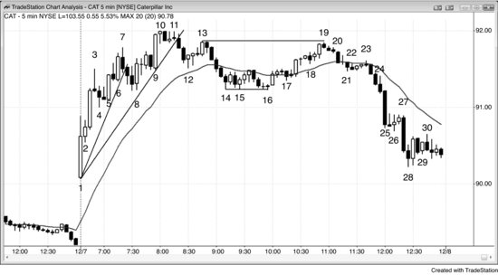

做反转交易时，交易员期望趋势回调幅度足够大，能做波段交易，甚至演变成一段反向趋势。入场方式、保护性止损和止盈跟其他波段交易或趋势交易一样，前两本书已经讨论过。因为期望的是大幅度走势，成功概率往往只有50%甚至更低。一般来说，潜在回报越大，风险不变的情况下，成功概率就越低。原因在于交易中的优势本来就很小——如果成功概率很高，交易员会迅速把优势吃掉，几根K线之内它就消失了，最终只剩下微薄的利润。不过，趋势反转交易的回报可以是风险的好几倍，所以交易者方程仍然是盈利的。

反转交易的难度远比盘后看图时感受到的要大。趋势线被强力突破，又在趋势极值位置测试后出现反转，这时候交易员需要一根强信号K线。但这根K线通常出现在市场情绪最激烈的时候，新手还在想着原来的趋势没走完。他们很可能当天已经在几笔逆势交易上亏了钱，不想再亏了。这种心理上的抵触让他们错过了早期入场机会。接着他们就想等一等，先看看跟随走势的力度。跟随走势通常是几根强趋势K线组成的又大又快的急速拉升，逼着交易员赶紧决定要不要冒比平时大得多的风险。他们往往选择等回调再进场。哪怕缩小仓位让亏损金额跟平时差不多，一想到要承受两三倍的tick风险就怕了。等回调入场也不容易，因为每次回调刚开始都像一个小反转，让人担心原来的趋势是不是在恢复。结果一直等到收盘前，终于确认新趋势成立了，但已经没时间下单了。趋势会想尽办法把交易员挡在门外，只有这样才能让他们整天追着市场跑。建仓形态一旦简单明了，走势通常就只是一小段快速的剥头皮行情。走势要想走很远，就必须让人看不清、不敢做，把交易员挡在场外，逼他们去追趋势。

**图 1.1** 主要趋势反转（MTR）交易

如图 1.1 所示，今天 Caterpillar Inc.（CAT）的反转有好几种做法，其中一种是我一位朋友用的方法，值得讲一下。几年前我跟这位交易员详细交流过，他专做主要趋势反转交易，通常一天只做一两笔，而且一定要先看到趋势线被明确突破，才去找反转入场机会。比如在这种多头趋势中，他不会在K线3下方做空，因为之前没有出现过突破多头趋势线的走势。他也不会在K线7这根反转K线下方做空，因为之前没有显著跌破多头趋势线。K线3之后的下跌只持续了一根K线，连均线都没碰到。

从K线7开始的三根空头趋势K线跌破了多头趋势线，说明有抛压，但下跌力度不够强，没有触及均线。接下来他会观察市场反弹去测试K线7趋势高点的过程。这轮反弹是两段式回调，说明存在一些双向交易，空头展示了一定力量，而且这已经是当天的第三连推上涨。主要趋势反转往往发生在开盘后一个小时左右，所以他可能会在K线11下方做空——这是一个二次入场点做空机会——但他可能并不指望这会发展成主要趋势反转。因为那时候当天的走势还是急速与通道的多头格局，这波下跌可能只是测试K线4这个多头通道起点，市场也许会在那里形成双底然后反弹。不过，由于这个多头通道是一个楔形（有三连推），很可能会出现两段横盘到下跌的走势。作为波段交易者，只要他认为最初的交易逻辑仍然成立，就会允许回调。所以他会把止损放在信号K线上方，或者放在K线11之后那根强空头趋势K线的上方，容忍回调到K线13，等待第二段下跌。如果他还没有做空，就会在K线13的两K线反转和LH主要趋势反转形态下方做空，这实际上是对K线11下方做空位置的一次突破回测。

K线11之后连出两根空头K线，大多数交易员开始怀疑 Always-in 的方向是不是已经翻空。等K线14之后那波五根空头K线的急速下跌走完，大部分人基本确认方向已经翻空了。这时候如果他决定继续持有空单，就会把保护性止损收紧到K线13之后那波空头急速起点的上方。更大的可能是，他会在价格向上突破K线16时回补大部分甚至全部空头仓位，理由有几个：

- 两段式下跌已经完成（到K线12的下跌是第一段）；
- K线16与K线14或15形成了双底；
- 这也是均线缺口K线做多的第三次入场点（K线16的高点低于均线，而且是K线10强势上涨之后的第一次回调）。

回补空单之后，他会观察从K线16开始的反弹力度，拿它跟之前跌到K线16的那段抛压做比较。如果反弹偏弱，他就等价格回测K线10多头趋势高点时再次做空。这个回测可能表现为一个LH、一个双顶，或者一个HH。

从K线16到K线19的反弹有三段腿，构成了一个楔形熊旗。这段反弹发生在价格强势跌破多头趋势线之后，有60%以上的概率成为更大回调的一部分，至少还会再跌一段。从概率上看，市场要么进入交易区间，要么形成趋势反转。整段反弹里没有出现连续两根强多头趋势K线，说明多头并未重新掌控市场。K线19与K线13形成了双顶，而此时市场可能已经是空头趋势，所以这就构成了一个双顶熊旗——同时也是相对K线10多头趋势顶部的一个双顶或LH主要趋势反转（MTR）。K线19还是一根空头反转K线，在寻找市场顶部时这一点很重要。这是当天最强的趋势反转建仓形态，因为K线14之前那波空头急速下跌让大多数交易员相信 Always-in 的方向是做空，空头掌控着市场——前提是反弹没有突破K线13之后那波空头急速的顶部。很多交易员认为，只要价格上不去K线13上方，空头就仍然占据主动，市场可能正在一轮新的空头趋势中构筑LH。空头把保护性止损放在K线13上方，因为他们要的是双顶或LH，两个都拿不到的话就出场，等下一次做空信号。很多在K线10到K线13之间买入的多头，在价格跌到K线16的过程中一直扛着多单，想看看空头到底有多强。最终他们判断：抛压确实很强——突破了趋势线和均线，而且持续了很多根K线——而到K线19的反弹力度不够，不足以让他们相信多头趋势能在不经历更深回调的情况下再创新高。

这些多头是最坚定的买方，因为他们愿意扛过那波一直跌到K线16的漫长抛售。一旦连他们都放弃了，这个价位上就再也没人愿意买了。市场只能继续往下探，去找一个让多头重新愿意进场、让空头愿意回补的价位。从K线16上来的这波反弹里，既没有出现连续的强多头趋势K线，也没有其他强劲买入的迹象，空头因此更加积极，多头也更加不愿意买。多头觉得市场很快还会跌得更低，于是趁反弹到K线19这段走势，在盈亏平衡点附近或小幅亏损的位置退出多单。这些失望的多头在卖出的同时，激进的空头也在大力做空，试图把市场压在K线13下方，两股抛压合力推动市场在K线19处转跌。多头愿意在更低的位置重新买入，但需要先看到市场即将向上反转的信号。K线23之前连跌了7根K线，之后的横盘整理算不上一个强力的底部，所以大多数多头不愿意买，除非价格进一步下探。空头随时愿意止盈，但只有在出现合理的底部信号时才会回补空单。既然没有底部信号，多头和空头都不愿意买入。与此同时，剩余的多头还在持续平仓退出，进一步加大了抛压。空头看到从K线23下来的这波走势中抛压不断加重，继续卖出。最终形成了一个强烈的趋势反转——K线16跌破多头趋势线之后，K线19出现了LH。跟所有强趋势一样，交易员不断杀跌（空头加仓），市场急速下跌到K线25低点和K线28低点的过程中持续加仓，然后开始止盈。所有的趋势K线都是急速、高潮、突破和缺口。K线25是一根大的空头突破K线，很可能 (60%+)会跟随一个向下的测量移动，幅度取决于交易区间的高度。K线25本身有可能成为一个测量型缺口，缺口的中点就是K线16低点（缺口顶部）与K线27高点（缺口底部）之间的中间位置，这可能引发当天或次日的一个向下的测量移动。

反弹到K线19形成了一个双顶熊旗、一个楔形牛旗，以及空头趋势中的两段上涨（K线15到K线16之间的两段式波段高点是第一段），交易者方程非常好。风险在K线19高点之上，大约10美分；回报至少是向下50美分，测试K线16的低点——市场有可能在那里形成双底，甚至可能形成一个大的三角形或牛旗。因为市场处于空头趋势中，或者至少在交易区间的顶部，成功概率至少是60%。60%的成功概率、10美分的风险、50美分的回报，构成了一笔非常好的交易。一个做了10次这种交易的交易员，会赚3美元、亏40美分，平均每笔赚26美分。

交易员认为，如果市场跌破K线16，可能 (60%+)会从双顶开始走出一段向下的测量移动，事实也确实如此。K线16附近是K线1到K线3多头急速段所形成的突破缺口的突破回测。市场从这次测试反弹后，多头不希望它再跌破这个位置，因为那意味着弱势信号。空头不希望反弹到K线19时突破K线13的LH（那样可能引发向上的测量移动），同样，多头也不希望从K线19开始的抛售跌破K线16的HL（那样可能引发向下的测量移动）。我朋友会把从K线19开始的这波下跌当作一笔趋势交易来做（第1本书讨论了趋势交易的做法）。初始风险只有10美分，而且市场测试K线16低点的概率很高，所以如果出现暂停K线，他会在测试时先平掉一半左右的仓位。但因为没有出现暂停K线，也就没有明显的止盈动作，他可能一直持有到K线28附近才止盈。K线28附近出现了一根卖出高潮K线后的暂停，而且之前有一个可能的最终旗形（以K线27结尾的3根K线）。他可能在那里平掉一半，获利1.20美元，剩下的持有到收盘前一两分钟再平仓，再赚1.30美元。

顺便说一下，记住：强势多头和强势空头都喜欢在过度延伸的多头趋势中看到一根大的多头趋势K线，因为它往往会引发一个两段式回调，跌破均线——K线9就是这种情况。这个预期中的回调为双方都提供了一个短期交易机会，但不是趋势反转交易。K线9是第三个连续的买入高潮，之前几乎没什么回调（K线1到K线3是第一个，K线5到K线6是第二个）。它更可能变成衰竭型缺口而不是测量型缺口——也就是说，更可能是回调的起点，而不是新一段上涨的开始。在这种情况下，强势多头和强势空头都会在该K线收盘价、该K线高点之上、后面一两根K线的收盘价处卖出（特别是K线10后面那根带有空头实体的K线），以及在前一根K线低点之下卖出。多头是卖出平仓止盈，空头是卖出开空。大多数空头会把保护性止损设在K线9那根买入高潮多头趋势K线的几个tick以内。两段式回调完成之前，多头不会再考虑买入，空头也不会止盈回补——回调完成的位置大概在K线14到K线16区域（下跌到K线12是第一段）。这波抛售的力度足以让双方都认为，市场在K线10多头高点经过一个LH或HH测试后，有可能发生趋势反转，转入空头趋势。
