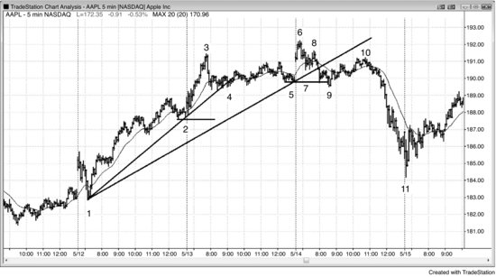
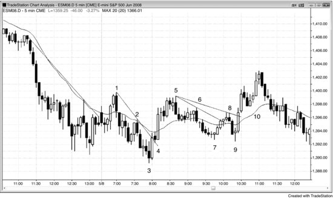
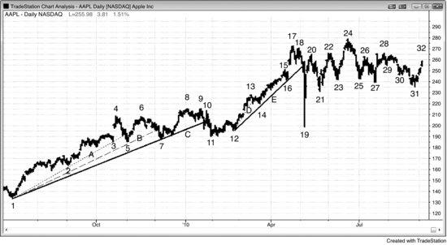
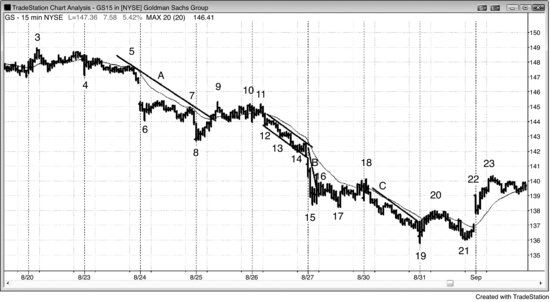
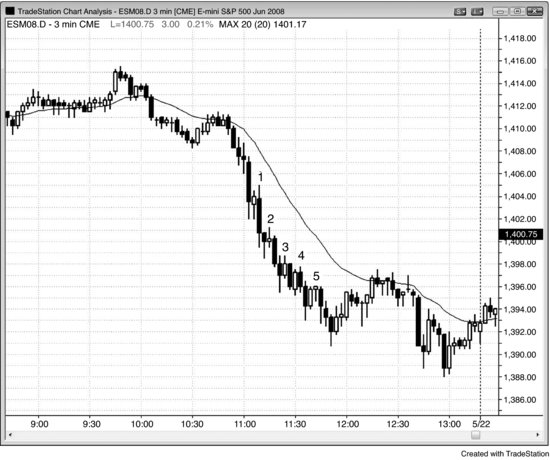
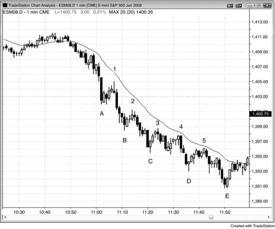
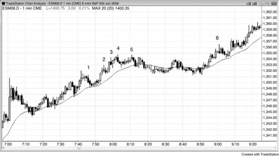

很多机构是做长线投资的，在它们看来，每一次跌破多头趋势线的强力下跌都是买入机会，因为它们清楚，空头会不断尝试反转趋势，但80%的情况都会失败。哪怕空头急速下跌的幅度很大、力度很强，价格远远跌破趋势线和均线，它们照样会买。它们希望自己的买入能起到带头作用，让其他交易员看到有人接盘后也跟着买。最起码，它们预期反弹能回测市场顶部下方的突破点位。到了那个位置，它们会判断趋势是否已经反转。如果确认反转，就不再买入，反而会平掉刚建的多头仓位，以及之前一路涨上来时买入的所有多头仓位。这些仓位大部分是赚钱的，因为很早就在远低于最后一次入场价的位置建了仓。不过，由于它们在趋势延续过程中一直加仓，有一部分仓位是在多头顶部附近买的，平仓时会亏损。一旦这些长线机构认定市场要跌，趋势就会反转——因为之前每次急跌都是它们在接盘，现在没人再愿意在空头急速下跌时买入了。它们会等到空头趋势跌到一个长期价值区域才重新出手，而这个区域必定位于长期支撑位附近，比如月线级别的趋势线。到了那里，它们会大举买入，并且在空头每一次试图进一步压低价格时继续加仓。到了某个时点，其他机构也会看到支撑正在形成，然后跟着买入。很快就会出现一根强劲的多头急速K线，接着回调测试空头低点，随后反转进入新的多头趋势。

每一种反转形态本质上都是某种交易区间，在逆势一方明确夺取控制权之前，多空双方一直在拉锯。**主要趋势反转（MTR）**对不同交易员来说含义不同，走势至少要延续足够多的K线、让大多数交易员眼中的 Always-in 方向发生改变，才能说趋势已经反转。但光是 Always-in 方向改变还不够——对很多交易员来说，5分钟图上每一个可交易的波段都会改变 Always-in 方向，也就是说一天之内可能变好几次，但主导趋势通常并没有变。主要趋势反转的意思是：眼前的图表上存在两段趋势，中间有一个反转，要么多头趋势反转成了空头趋势，要么空头趋势反转成了多头趋势。这种反转不同于图表上频繁出现的上下波动——那些波动的幅度通常够做一笔交易，但不足以改变主趋势的方向。而且不管屏幕上有没有明显的趋势，那些小级别反转都会发生。

大多数主要趋势反转的最早期信号成功率较低，但潜在回报最大，往往是风险的好几倍。行情在初期经常以横盘为主，回调频繁，但如果趋势确实在反转，新趋势很快就会变得明显。很多交易员更愿意等到趋势明朗后再入场。这类交易员要求胜率至少达到60%，愿意为更高的胜率在收益上做些让步（毕竟入场时行情已经走了一段）。只要操作得当，两种方式的交易者方程都是正值，所以都是合理的。

主要趋势反转（MTR）需要四个条件：

**1.** 眼前的图表上存在一段趋势。

**2.** 一波足以突破趋势线的逆势运动（反转），通常也会突破均线。

**3.** 对趋势极值的测试，然后出现第二次反转（在多头趋势顶部表现为 HH、双顶或 LH；在空头趋势底部表现为 LL、双底或 HL）。

**4.** 第二次反转走出足够的幅度，让市场形成趋势已经反转的共识。

首先，屏幕上必须已经存在一段趋势，然后出现一波足够强劲的逆势运动，突破主要趋势的趋势线，最好还能明确越过均线。随后趋势恢复，回来测试原趋势的极端价位，市场再次反转。举个例子：在多头趋势中，价格大幅跌破多头趋势线后，交易员会关注随后的反弹。如果市场在前高附近再次回落——形成 LH、双顶或 HH——就说明测试成功，交易员开始怀疑趋势正在反转。最终，下跌的力度必须强到足以让交易员确信市场已经进入空头趋势。如果下跌以强劲的空头急速运动形式出现——由多根连续的大阴线构成——所有人都会认定市场已经转为空头趋势。但实际情况中，市场更常见的走法是在一个宽幅空头通道内运行 50 根K线甚至更久，走势方向不够明确，不足以让交易员确信趋势已经真正反转向下。他们会怀疑市场是否演变成了一个大型交易区间，而事实往往也的确如此。如果没有出现非常强劲的空头急速运动，通常要经过几十根K线，形成一系列 LH 和 LL 之后，市场才会就趋势已经反转达成共识。到那时，价格可能已经远低于之前多头趋势的高点，空头趋势的剩余空间也所剩无几了。

关于反转的共识往往在市场实际反转很久之后才形成，但这并不重要，因为整个下跌过程中始终存在交易机会。如果下跌走势不明朗、多空交替，交易员就会像对待其他双向市场一样，在两个方向上都做交易。如果是非常强劲的空头趋势，交易员则几乎只做空。既然一路下来都有交易可做，那交易员为什么还要关注主要趋势反转（MTR）呢？因为如果在市场刚从测试旧高点处转头下跌时就入场，交易者方程会非常理想——回报往往是风险的好几倍，即使概率只有 40% 到 50%，交易者方程依然十分有利。大多数主要趋势反转（MTR）最终演变为交易区间，但仍然是能够获利的交易。

几乎所有主要趋势反转（MTR）的起点，要么是趋势线突破，要么是趋势通道线过冲后的反转，而且在反转发生时，所有这些最终都会突破趋势线。举例来说，如果一段多头趋势以头肩顶结束，从头部下跌的那一波通常会跌破整段多头趋势的趋势线，并且一定会跌破沿头部反弹低点画出的较小多头趋势线。多头在价格从头部回落到左肩回调区域时买入，试图构建双底牛旗。许多空头此前在价格反弹至头部并越过左肩时做空，他们也在同一区域获利了结，以防市场进入交易区间或形成双底牛旗。空头将形成右肩的反弹视为 LH 突破回调做空建仓形态，并在此做空。趋势线突破是空头在逆势建仓——即在多头趋势中做空——之前需要看到的关键信号，因为它意味着趋势已被打破，可能开启一轮主要趋势反转（MTR）。与此同时，之前在高点（头部）买入、预期再涨一段的多头，如果仍持有仓位，会观察头部抛售的力度。一旦发现跌势强到突破了趋势线，就会趁反弹以小幅亏损平掉多单。多头和空头的共同卖出推动市场下跌，形成 LH（即右肩）。当市场跌至颈线附近——颈线是一条大致水平的线，沿左肩、头部以及最终右肩的抛售低点画出——多头和空头都会评估这波下跌的力度。如果力度足够强，空头就不再仅仅把空单当作剥头皮来做，不再认为市场仍处于交易区间之中，而是继续持有空单甚至加仓做空，预期出现主要趋势反转（MTR），尤其是在跌破颈线时及之后。多头则注意到了抛压的强度，在市场企稳之前不愿买入——他们预计至少还需要几根K线才会稳定下来，甚至可能要等到完成一段测量移动下跌之后。

相反，如果从头部到颈线的卖出力度很弱，那么当市场测试颈线时，多头和空头都会买入。多头之所以买入，是因为他们把整个形态视为多头趋势中的交易区间，也就是一个大型牛旗。他们在牛旗底部买入，那里大致形成了一个三重底（三次从颈线处向上反转）。一些多头会在市场反弹到交易区间中部或顶部时剥头皮出场，另一些则继续持有，期待多头突破后做一笔波段交易。空头则会在此处回补，暂时不再做空，等待更高的价格再说。他们希望反弹止步于右肩下方，如果确实如此，或者与右肩形成双顶，他们就会再次做空，寄望于这个形态演变成带两个右肩的头肩顶——这种情况很常见。如果市场突破右肩上方，空头就会回补，并且在很多根K线内都不会再寻找做空机会，因为他们已经判断整个形态演变成了一个大型牛旗，突破后大概率（60%以上）至少走出一段向上的测量移动。多头也会在突破右肩上方时买入，因为他们知道空头会回补，而且在很多根K线内不会再卖出。多头和空头一样，预期会出现大致的向上测量移动，并且会随着新的多头腿推进而不断加仓。

双顶或更高的高点也是同样的道理。每当市场在前一个高点附近经历一波急跌之后再次回到那个区域，那些在前高买入的多头会因为之前的下跌而感到失望，趁反弹平掉多头仓位。换句话说，他们变成了卖方（卖出手中的多头仓位），而且在价格大幅回落之前不会再买入。当前价位已经没有人愿意买，多头和空头都在卖，市场自然下跌。

市场底部也是同样的逻辑。一旦出现一波足够强劲的上涨，突破了空头趋势线——不管是整段空头趋势的趋势线，还是仅仅是头部下跌那段上方的趋势线——那些在市场跌破左肩时做空、期待再跌一腿的空头，就会因为这波上涨而感到失望，并预期在一次向下测试之后至少还会出现一段上涨腿。交易者会把随后的下跌腿视为对空头趋势力度的测试。如果空头趋势很强，市场最终会在很多根K线的推动下跌破前低（头部），再走出一段下跌腿。如果趋势正在反转，激进的多头会在前低附近买入；而那些在前低做空的空头，则会因为从头部开始的强劲上涨和随后较弱的下跌测试而感到失望，趁这波回落在接近盈亏平衡点的位置回补。多头和空头都在买入，空头又不愿意在这个位置再做空，市场就会上涨。这次测试可以形成与前低完全相同的双底，也可以是更高低点，或者更低低点。具体是哪种并不重要，因为它们都是同一个过程的不同表现形式。如果形成了更高低点，一些交易者会把它看作头肩底的右肩，并去寻找对应的左肩。如果找到了，他们就会更有信心判断这是趋势反转，因为他们相信很多交易者会识别出这个形态并开始买入。不过，有没有明显的左肩对大多数交易者来说并不重要。真正关键的是：先有一次对空头趋势线的强力突破，接着是对空头低点的测试，然后市场向上反转，走出多头波段或多头趋势。

顶部究竟是由更高的高点、完美的双顶还是更低高点形成的，并不重要，因为它们代表的是同一种行为。市场在测试前高，观察最终是买方占优导致多头突破，还是卖方占优导致空头反转。顶部有两次向上的推动：第一次是最初的多头高点，第二次是市场跌破多头趋势线之后对那个高点的测试。市场不在乎双顶有多完美；不管外表如何，所有这些测试都应该被视为双顶的变体。市场底部也一样。先有一个低点，然后出现一波通常（60%以上）足以突破空头趋势线的上涨。那个低点就是双底的第一个底。市场突破空头趋势线（即突破空头通道）之后再次下跌测试第一个底，当市场向上反转时，这个低点就是双底的第二个底——不管它在第一个底的上方、正好齐平，还是在其下方。

传统双顶双底和微型双顶双底在高时间周期图表上的关系，跟所有微形态与其对应标准形态的关系一样。比如，交易员在5分钟图上看到一个双底，切到更高时间周期图表，两个底部只隔两三根K线，就变成了微型双底。反过来也成立：5分钟图上的一个微型双底，两个低点只隔两三根K线，放到足够小的时间周期图表上，就是一个标准的趋势反转——第一个底部之后的反弹突破了空头趋势线，第二个底部是对那个低点的测试。实际上，任何图表上大多数可交易的反转，哪怕只是小幅剥头皮，起点都是微型双底或微型双顶，多数交易员不看到微型双底或微型双顶就不会做反转交易。微型双顶本质上是多头趋势中的一次失败突破，也就是失败的高1、高2或三角形买入信号；微型双底则是失败的低1、低2或三角形卖出信号。这意味着这类反转属于小型的最终旗形反转（第7章会讨论）。实际上，最终旗形本身就是双顶或双底的变体。举个例子：在一个交易区间日中出现了两段式上涨，随后市场形成了一个 ii 形态，交易员就会警觉——这可能是最终旗形突破后的向下反转。ii 形态之前那段急速上涨是第一推，随后的小幅多头突破是第二推。虽然两次高点不在同一水平，但两推上涨的结构本身就是双顶的变体。

预期向下反转的交易员会在信号K线高点及其上方挂限价单做空，押注的是他们认为即将成为最终牛旗的突破。如果是微形态，限价单会挂在信号K线高点及略上方。如果是更大的形态，它在高时间周期图表上就是一个微形态，有些交易员会把限价单挂在高时间周期信号K线的高点及其上方。还有些交易员——可能 (60%+)包括很多机构——会在市场走出他们认为的最终牛旗时逐步加码做空。市场底部的操作正好相反：出现双底或微型双底，交易员预期它会成为空头腿的最终旗形，从而引发向上反转。

要记住，所有趋势都运行在通道里。只要通道没有被**强势**突破，最好的做法就是押注任何试图突破趋势线的行为会失败。在趋势线被强势突破之前，大多数交易员只会把逆势交易当作剥头皮来做。如果趋势线还没被突破，说明强趋势依然有效，交易员应该确保抓住每一个顺势入场机会，不要因为偶尔错过一次逆势剥头皮而纠结。胜率最高、赚钱最多的机会都在顺势交易里。没有趋势通道线过冲和反转配合的纯V形底和V形顶极其罕见，根本不值得考虑。交易员应该把注意力放在常见形态上，万一错过某个稀有事件，总会等到回调时再跟着新趋势做。

趋势线被突破并不意味着趋势反转了。它只是第一个重要信号，说明逆势方的力量正在增强，你应该准备不久后开始朝他们的方向交易。但首先应该继续顺着原来的趋势做，因为趋势线被突破之后，市场还会回去测试原来的趋势极值点。这次测试可能略微超过或不及原来的极值。只有在测试过程中出现反转建仓形态时，才应该做逆势交易。如果形态确实出现了，逆势方向的走势至少会走出两段腿，甚至可能演变成一段方向相反的新趋势。

在多头趋势中，市场涨过前一个高点之后，通常 (60%+)会出现三种结果之一：继续买入、止盈了结或做空。如果趋势很强，强势多头会在突破前高时追涨加仓，市场会出现某种形式的测量移动上涨。如果突破后市场涨得足够远，让交易员在回调之前至少能赚到一次剥头皮的利润，就可以认为新高处主要是新的买盘在推动。如果市场横盘，说明买方在止盈，打算等价格稍低一些再买回来。如果市场大幅向下反转，说明强势空头在新高处占了上风，市场可能 (60%+)至少要走出几段腿的下跌，并且持续至少10根K线。

有些交易员喜欢在趋势反转的最早迹象出现时就入场，比如价格刚突破通道的时候。但这种做法胜率很低。大盈亏比确实能弥补低胜率，但大多数交易员到头来会挑挑拣拣，偏偏把最好的机会说服自己放弃了。跟所有突破一样，通常（60%+）更好的做法是先观察突破的力度。如果突破很强，就等回调再入场。这个原则适用于所有趋势的反转，包括小趋势——比如大趋势中的回调、微型通道、急速之后的通道，以及处于宽通道中的趋势。如果逆势突破很弱，就等反转尝试失败后顺势入场。如果突破非常强、连续多根K线都不回调，那就按强突破来处理——直接市价入场或在小幅回调时入场，这在第二本书的第一部分已经讨论过。

交易员不会在没有罕见重大新闻的情况下突然从极度看涨切换到极度看跌。这个转变是渐进的：先是不那么看涨，然后变中性，再变看跌。一旦足够多的交易员完成了这个转变，市场就会反转，进入更深的回调或空头趋势。每家机构都有自己衡量过度的标准，到了某个时刻，足够多的机构判断趋势走得太远了。它们觉得不在前高上方继续买入也不会错过什么大行情，只在回调时买入就好。如果市场在前高上方犹豫不前，说明市场正变成双向的，强势多头在利用新高止盈。

止盈说明交易员仍然看涨，打算等回调再买入。大多数新高之后都会出现止盈。每一个新高都是潜在的顶部，但大多数反转尝试都会失败，变成牛旗的起点，然后市场再创新高。如果测试高点的上涨过程中有好几次小幅回调、大量K线重叠、出现好几根空头实体、K线顶部有大影线，而且大多数多头趋势K线都很弱，那市场就在变得越来越双向。多头在K线顶部止盈、只在K线底部买入，空头开始在K线顶部做空。同样，当市场接近多头趋势的顶部时，多头在止盈，空头也加大做空力度。如果市场突破了多头高点，止盈和做空力度可能（60%+）会更强，交易区间或反转就会随之形成。

大多数交易员不喜欢反手操作，所以如果他们预期会出现反转信号，更倾向于先平掉多头仓位再等信号。这些多头在趋势最后一段上涨中的离场，加剧了涨到最终高点那一段的弱势。如果市场突破前高后出现强烈的反转下跌，说明强势空头正在控制市场，至少短期内是这样。一旦出现这种情况，那些原本打算在小幅回调时买入的多头就会转而认为市场还要再跌。他们选择等到出现大得多的回调才买入，而买盘的缺席本身就让空头能把市场推入更深的回调——持续10根或更多K线，通常（60%+）有两段或更多腿。

有一种情况，多头趋势中的突破通常（60%+）会遭到激进空头的打压，而这些空头通常（60%+）能控制住市场。回调本质上是反方向的一段小趋势，交易员预期它很快就会结束、大趋势恢复。强空头趋势出现回调时，市场经常走出两段上涨。当市场突破第一段上涨的高点时，它突破的是一段小多头趋势中的前波段高点。但因为大多数交易员把这段上涨视为即将结束的回调，所以在突破时占主导的通常（60%+）是激进的卖方，而不是激进的新买方或止盈的多头。这段小多头趋势通常（60%+）会在突破回调中的第一个或第二个波段高点后反转下跌，回到主要空头趋势的方向。

空头趋势中新低的情况也一样。空头趋势很强时，强势空头会在突破新低时追加做空，市场继续下跌直到达到某个测量移动目标。随着趋势减弱，新低附近的价格行为会变得不太明确——说明强势空头在利用新低对空头仓位止盈，而不是加仓做空。随着空头趋势进一步丧失力量，最终强势多头会认为新低是很好的做多价位，能够制造出反转形态，随后推动一波有分量的上涨。

趋势成熟后，通常会过渡为交易区间，但最先形成的那些交易区间，往往只是趋势延续前的中继。那么在趋势走向成熟的过程中，强势多头与强势空头分别是怎么操作的？

以多头趋势为例。趋势强劲时，回调幅度很小，因为强势多头想在回调时加仓。他们担心市场可能涨到很高才会出现回调，于是开始分批、持续地买入。他们会找任何理由买，而市场里有那么多大资金参与，几乎每种理由都能触发一部分买盘。他们会在低几个 Tick 的位置挂限价买单，也会分别在前一根K线低点处、低点上方几个 Tick、低点下方挂限价买单。他们还会在前一根K线高点上方挂买入突破单，在突破任何前期波段高点时也挂买入突破单。不管当前收出的是多头趋势K线还是空头趋势K线，他们都会在收盘价买入。在他们看来，空头趋势K线是短暂的低价买入机会，多头趋势K线则意味着市场即将快速上涨。

强势空头同样精明，看得懂当前局面。既然他们跟强势多头一样都认为市场短期还会更高，那做空就不划算，所以先退场观望，等到更高的价位再卖。高到什么程度呢？每家机构都有自己衡量"涨过头"的标准，一旦市场涨到足够多的空头机构认为可能涨不动的价位，他们就会开始做空。如果有足够多的机构在差不多的价位做空，图表上就会出现更多、更大的空头趋势K线，K线顶部也开始出现上影线。这些都是抛压信号，告诉所有交易者——多头在变弱，空头在变强。强势多头最终不再在前一个波段高点上方买入，转而在市场创新高时开始止盈。他们依然看多，但变得更加挑剔，只在回调时才买。随着双边交易增多，下跌段中空头趋势K线增多、持续时间变长，强势多头就只愿意在正在形成的交易区间底部买入，到顶部止盈。强势空头则开始在新高处做空，并且愿意在更高价位加仓。如果他们判断市场可能反弹并突破创新高，就会在交易区间底部附近先了结部分空头利润，但仍会继续寻找在新高做空的机会。到了某个阶段，市场变成五五开，多空双方谁也控制不了局面；最终空头占据主导，空头趋势开始，上述过程反向重演。

一段持续已久的趋势末端，常常会出现一根异常强劲的突破K线，但它可能是衰竭型高潮。比如在一段持续较久的多头趋势中，强势多头和强势空头都乐于看到一两根大阳线，尤其是特别大的那种，因为他们预期这将是一个短暂但极好的机会。一旦市场接近强势多头和强势空头想要卖出的位置——比如测量移动目标位或趋势通道线附近，特别是当这已经是第二次或第三次连续的买入高潮时——他们就会退场观望。最强的交易者停止买入，市场上方形成真空效应，于是就出现了一两根相对较大的多头趋势K线。这根多头急速K线正是强势交易者等待的信号，一旦出现，他们就像凭空冒出来一样开始集体卖出。多头对持仓止盈，空头建立新的空头仓位，双方都在押注这次突破会失败。他们在K线收盘价卖出、在K线高点上方卖出、在下一根K线收盘价卖出（特别是下一根K线较弱时）、在再下一根K线收盘价卖出（特别是K线开始出现空头实体时）。他们还在前一根K线低点下方做空。看到强空头趋势K线时，就在它的收盘价和低点下方做空。多头和空头都预期会出现一波较大的回调，多头至少要等到十根K线以上的两段式回调之后才会考虑再买，而且前提是下跌走势看起来较弱。空头也预期同样的跌幅，不会急于过早止盈。

弱势交易者对那根大阳线的看法完全相反。一直在场外观望、盼着回调好入场的弱势多头，眼看市场在快速远离自己，急着要抓住下一段上涨——毕竟这根K线这么强，而且快收盘了。而早期做空、甚至可能已经加过仓的弱势空头，被这根K线迅速突破新高的速度吓到了，害怕接下来出现持续不断的跟随买盘，于是赶紧平掉空头仓位。这些弱势交易者靠情绪做交易，对手却是不带任何情绪变量的计算机算法。市场由计算机主导，弱势交易者的情绪化操作注定让他们在过度延伸的多头趋势末端那根大阳线上承受巨大亏损。市场正在反转，而不是真正突破成功。

大多数交易者不愿意直接反手，所以如果他们预感到反转信号即将出现，更倾向于先平掉多头仓位，然后等信号出来再操作。趋势最后一段上涨中，这些多头的退出本身就削弱了冲向最终高点的力度。如果市场突破前高之后出现强烈的向下反转，说明强势空头至少在短期内已经控制了市场。一旦出现这种情况，原本希望在小幅回调时买入的多头就会改变判断，认为市场还会进一步下跌。他们会推迟买入，等待更大幅度的回调，而他们的缺席让空头得以将市场推向更深的回调——通常持续十根K线以上，并且往往包含两段或更多下跌腿。

有一种情形中，多头趋势的突破几乎一定会遭到激进空头的打压，空头通常会接管市场。回调本质上是反方向的次级趋势，交易者预期它很快结束、大趋势恢复。在强空头趋势的回调中，市场经常会形成两段上涨。当市场突破第一段上涨的高点时，相当于突破了这个次级多头趋势中的一个前期波段高点。但由于大多数交易者将这段上涨视为即将结束的回调，在突破点上主导交易的通常是激进的卖方，而不是激进的新买方或止盈多头，所以这段次级多头趋势通常会在突破回调中第一个或第二个波段高点之后反转回落，重新沿主要空头趋势方向运行。

空头趋势中创新低的情形也是一样。空头趋势强劲时，强势空头会在突破新低时加仓做空，市场持续下跌直到触及某个测量移动目标位。随着趋势减弱，新低附近的价格行为变得不那么清晰，这意味着强势空头正在利用新低来了结空头利润，而不是继续加仓。当空头趋势进一步失去动力时，强势多头最终会将新低视为极好的做多价位，他们能够构建出反转形态，进而推动一波可观的反弹。

强多头趋势一旦开始出现较大的回调，这些回调（本质上都是小型交易区间）就越来越像交易区间，而不像多头旗形。突破方向变得不那么确定，交易员开始觉得向下突破和向上突破的概率差不多。这时候新高就变成了一次向上突破交易区间的尝试，而这种尝试大概率会失败。同理，强空头趋势一旦开始出现较大的回调，这些回调也更像交易区间而非空头旗形；因此新低就是一次向下突破交易区间的尝试，大概率也会失败，交易区间会继续延续。

每个交易区间都处在多头趋势或空头趋势之中。双向交易一旦强到足以形成交易区间，就说明趋势已经不强了——至少在交易区间持续期间如此。最终市场一定会突破区间：如果向上突破且非常强，市场就进入强多头趋势；如果向下突破且很强，市场就进入强空头趋势。

空头一旦强到能把回调推至远低于多头趋势线和均线的位置，他们就有信心认为市场大概率不会再涨太多，于是会在前期高点上方积极做空。与此同时，多头也已经决定只在深度回调时才买入。在新高这个位置，市场心态已经发生了转变——新高不再是好的买入位置，因为它已经不再代表太多力量。诚然，多头会在新高处止盈，但大多数大型交易者现在把新高视为绝佳的做空机会。市场到了转折点，大部分交易员不再寻找小幅回调买入，转而寻找反弹做空。空头占据了主导地位，强烈的抛压大概率会导致大幅回调甚至趋势反转。等到下一轮强力下跌之后，空头会寻找一个更低高点再次做空或加仓；而在回调时买入的多头则开始担心趋势可能已经反转，或者至少会出现更大的回调。他们不再指望出现新的多头高点来止盈，而是在更低高点处止盈，并且在一轮更大的回调完成之前不再考虑买入。多头知道大多数反转尝试都会失败，很多一路持有多头仓位上来的交易员，在空头展现出强力打压市场的能力之前不会退出多仓。这些多头一旦看到令人印象深刻的抛压，就会找一个反弹来最终平掉多仓。他们的卖盘会限制反弹的高度，而他们的卖盘叠加上激进空头的做空，再加上那些把下跌当作买入机会的多头的止盈卖出，就会形成第二段下跌。

如果市场进入空头趋势，整个过程就会反过来。空头趋势强劲时，交易员会在前期低点下方做空。随着趋势减弱，空头会在新低处止盈，市场大概率进入交易区间。经过一轮强劲反弹突破多头趋势线和均线之后，空头会在新低处止盈，强势多头会积极买入并试图掌控市场。结果就是出现更大幅度的空头反弹，甚至可能反转为多头趋势。

回调大到让交易员怀疑趋势是否已经反转时，也会出现类似的情况。比如，多头趋势中出现了一轮又深又急的回调，交易员就会开始怀疑市场是不是已经反转了。他们在观察价格跌破前期波段低点的走势，但这是在多头趋势回调的背景下，而不是空头趋势的一部分。他们会观察市场跌破前期波段低点后的表现：跌幅是否足以让空头（那些在波段低点下方通过卖出突破单入场的空头）赚到钱？新低是否吸引了更多的卖方而非买方？如果确实如此，说明空头很强，回调大概率还会继续走低，趋势甚至可能已经反转为下跌。

新低突破还有另一种可能：市场进入交易区间。这说明空头在新低处止盈了，而多头的买入力度不够。最后一种情况是，突破到新低后市场反转上涨。这意味着在那个波段低点下方，有强势多头一直在等着市场来测试那里。这表明下跌大概率只是持续多头趋势中的一轮大回调。高位入场的空头在突破到新低时止盈了，因为他们相信趋势仍然向上。强势多头积极买入，因为他们相信市场不会再跌，会反弹去测试多头高点。

每当价格跌破某个波段低点，交易员都会密切关注两件事：多头是否重新回来了，还是空头已经掌控了局面。他们需要在新低位置判断哪种力量占主导，而判断依据就是市场本身的表现。如果突破力度很强，说明新卖盘占主导；如果走势犹豫不决，说明空头在获利了结、多头在试探性买入，市场有可能（概率60%以上）进入交易区间；如果出现强劲的向上反转，说明多头的激进买入才是最重要的驱动因素。

强趋势通道线反转源于严重过度延伸的趋势，反转之后往往走出很大幅度——穿过通道到达另一侧，然后突破趋势线。反转后的第一次回调通常很浅，因为市场情绪高涨，所有人都很快达成共识：趋势已经反转了。正是这种信心让交易员变得更加激进——他们会在最小的停顿中加仓，而且不急于止盈，回调幅度因此始终很小。

趋势线被强力突破后，回调之后通常（概率60%以上）会出现第二段走势。回调经常回撤到旧趋势线附近并测试它，但在那个位置几乎总能找到更可靠的价格行为入场信号，帮你抓住回调或新趋势的第二段。突破趋势线的力度越强，回调之后出现第二段的可能性就越大。如果突破趋势线的力度连均线都够不到，那通常（概率60%以上）不足以反转趋势，暂时不要急着寻找趋势反转机会。此时趋势仍然很强，即便趋势线已被突破，你也只应该做顺势入场形态。

趋势以反转结束——反转是一段逆势运动，先突破趋势线，然后测试趋势的最终极值。测试可能过冲旧极值（比如新多头趋势中出现更低的低点，或新空头趋势中出现更高的高点），也可能不及旧极值（比如新多头趋势中出现更高低点，或新空头趋势中出现更低高点）。极少数情况下，测试会精确到一个最小报价单位，形成完美的双顶或双底。严格来说，过冲属于旧趋势的最后一段，因为它形成了趋势中最极端的价格。不及则是新趋势第一段之后的回调。测试本身常常由两段构成（例如空头突破之后出现一个两段式反弹）。

如果过冲走得太远，而且处于非常窄的通道中，就不应该寻找反转机会了。趋势很可能（概率60%以上）已经恢复，而不是正在反转。这时应该重新开始整个流程——等待另一次趋势线突破，然后等待另一次对趋势极值的测试，再考虑反转交易。

对趋势极值的测试通常以某种通道的形式出现，当市场可能正在反转时，通道的强度尤其重要。举个例子，假设出现了一段强多头趋势，接着出现强劲的抛售，大幅跌破多头趋势线。交易员会仔细观察随后的反弹：这次反弹只是测试一下多头高点，还是会强势突破高点、引发多头趋势的又一段强劲上涨？其中最关键的考量之一就是测试多头高点时的动能。如果反弹处于非常窄且陡峭的通道中，几乎没有回调，相邻K线之间重叠很少，而且在出现任何暂停或回调之前就已大幅超过多头高点，那么动能很强，多头趋势恢复的概率就会增大——即便此前出现过那次强劲的抛售和对多头趋势线的突破。反过来，如果反弹中有大量重叠K线、好几根大阴线、两三次明显的回调，也许还呈楔形，而且斜率明显比原始多头趋势和那次抛售都平缓，那么测试多头高点后更可能出现更低高点或略微更高的高点，然后市场再次尝试下跌。市场可能正在反转为空头趋势，但至少进入交易区间的概率是很大的。

市场具有惯性，倾向于延续当前的运动方向，这导致大多数趋势反转尝试会失败。而且即便反转成功了，形成交易区间的概率也比直接变成反向趋势更大，因为交易区间代表的变化更小。在交易区间中，顺着旧趋势方向的交易员仍然很强，只不过被反向交易员所制衡。这比市场迅速从一方趋势交易员手中转交给另一方更容易发生。不过即便形成了交易区间，通常（概率60%以上）也会出现幅度可观的、可交易的逆势波段，而且可能要经过几十根K线之后，交易员才能判断出市场到底是反转成了反向趋势，还是只是在持续趋势中形成了一个大型旗形。

趋势线被突破后，逆势运动通常至少包含两段。如果多头反转在测试空头低点时形成了HL，那么这个反转点同时也是第二段的起点。但如果测试时形成了LL，那么这个低点就是第一段的起点；第一段走完后，大概率（60%以上）会出现一次回调，然后再走出第二段。空头反转的逻辑同理：LH是第二段的起点，HH测试则是第一段的起点。

一切都取决于你眼前的那张图表，同样的走势在不同时间周期上看起来完全不同。如果突破趋势线和测试趋势极值的两段在5分钟图上各只有两根K线，交易员不会把它当作主要趋势反转（MTR），尽管同样的结构放到1分钟图上可能有大约10根K线，足以构成一个很好的主要趋势反转（MTR）建仓形态。同理，如果一段持续60根K线的多头趋势出现回调和测试，且每一段都超过20根K线，这在15分钟图上可能构成主要趋势反转（MTR）建仓形态，但在5分钟图上，面对如此多的K线，交易员不会使用"主要趋势反转（MTR）"这个概念，而是会去寻找其他形态。例如，如果突破多头趋势线的那段回调有30根K线，交易员会将其视为一段空头趋势（所有多头趋势中的回调本质上都是较小级别的空头趋势），然后关注价格能否突破这段空头趋势的趋势线，接着再寻找主要趋势线向上的突破。如果随后的反弹也有大约30根K线，交易员会将其视为一段新的多头趋势，然后关注其趋势线是否被跌破、是否出现向下的主要趋势反转（MTR）。交易员心里清楚，这些段放到15分钟图上只有大约10根K线，在那个周期上构成主要趋势反转（MTR），但那不是他们正在交易的图表，所以他们会使用与眼前图表相匹配的术语。

一个普通的建仓形态大约有40%的概率带来一笔盈利的波段交易，30%的概率小亏，30%的概率小赚。多数情况下，市场会进入交易区间而非反转成相反趋势，但仍有70%的概率至少赚到一小笔。最好的建仓形态有60%的概率带来盈利的波段交易。

**图 3.1** HH后接LH

图 3.1展示了一个主要趋势反转（MTR），书中其他图表里还有很多例子。

如果多头趋势线被突破后，市场在HH处反转下跌（向下的主要趋势反转（MTR）），通常还会在LH处出现一个主要趋势反转（MTR），给交易员第二次做空的机会。AAPL同时出现了HH和LH两种趋势反转。主要反转通常跟在趋势线的强力突破之后，说明反方向的交易员正在变强。然而到K线4的弱空头段仅勉强突破了趋势线，远未跌破多头趋势中最后一个HL（K线2），甚至连均线都守不住。不过，价格随后横盘了很多根K线，说明空头至少有足够的力量让多头趋势暂时停下来。

K线6是趋势线突破后的一个HH做空建仓形态，但由于下跌到K线4的那段走势并不特别强，下跌到K线9的卖压也因此受阻。

K线9成为楔形牛旗（也是多头通道）的底部，同时也是一个高4买入建仓形态，并与K线5形成了双底牛旗。这带动了一波上涨到K线10。上涨到K线10的走势是一个低动能的低4做空建仓形态，也是一个楔形熊旗，其第一推高是K线9低点之前的那个LH。它同时也是头肩顶的右肩，但大多数头肩顶最终会失败，演变成三角形或楔形牛旗。不过这次，它确实成为了趋势线突破后的第一个LH，构成对多头高点的LH测试。

到K线9的空头段明显跌破了一条更长的趋势线、均线，以及多头趋势中最后一个HL（K线5），而且在此之前已经有过一次猛烈的趋势反转尝试（到K线4的抛售）。与此同时，这段下跌远未回测到多头趋势线的下方或K线8（第一段下跌中的第一次回调）。这些迹象都表明趋势线突破力度很强，提高了至少再走一段下跌或真正趋势反转的概率。在K线6多头趋势顶部附近买入的多头，看到了空头在下跌到K线9过程中的强势，以及多头在反弹到K线10过程中的弱势，对价格走势感到失望。他们趁着到K线10的弱反弹以小幅亏损退出多头仓位，并且在市场进一步下跌之前不愿再次买入。多头希望看到强势信号后再买入，但始终没有等到，于是在市场抛售到K线11的过程中一直观望。

有些交易员喜欢观察反弹到较低高点时，是否恰好回撤了斐波那契 61.8%。不过，61.8% 的回撤从来没有这个数字听起来那么精确，它出现的概率与 60%、63% 或 67% 的回撤相比，可能（60%+）也差不多，而且随着交易越来越电脑化，这个数字的参考价值可能（60%+）已经下降。举个例子，假设交易员判断当前处于一段空头波段中，在 50% 回撤处做空，止损设在新高上方（K线 6 上方），目标是回测K线 9 处空头急速的底部。这样他的回报等于风险，而且因为他把这段反弹视为回调，做空的成功概率至少有 60%。如果市场继续向上回撤，有理由认为 67% 的回撤比 61.8% 的回撤更重要。一旦回调幅度超过 50%，空头延续的概率就会下降，比如降到 50%。当概率降到 50% 或更低时，交易员若要做空，就需要更大的回报。由于止损在K线 6 高点上方，他们可能（60%+）希望回报达到风险的 2 倍。这意味着他们可能（60%+）会在 67% 回撤处做空，因为一旦市场回测到K线 9 的低点，回报恰好是风险的 2 倍。

**图 3.2** 更低的低点之后出现更高的低点

如图 3.2 所示，Emini 走出了一个先创更低低点、再形成更高低点的主要趋势反转（MTR）。反弹到K线 1 突破了空头趋势线，K线 3 对空头低点的测试形成了一个更低的低点。更低的低点测试通常（60%+）至少带来两段逆势上涨，这里也是如此——分别是从K线 3 和K线 9 起步的两段上涨。K线 9 是在昨天主要空头趋势线被K线 1 的反弹突破之后形成的更高低点，作为更高低点，它标志着第二段上涨的起点，第二段上涨完成后，可以成为整个上涨运动的终点。相比反转成反向趋势，走入交易区间是更常见的结果。

从K线 5 和K线 6 到K线 7 的下行通道很强。很多交易员倾向于先观察突破力度，再决定是否买入。K线 7 之后的两根多头趋势K线实体较大、影线较短，在很多交易员看来构成了一次强突破。到这个时候，很多交易员认为市场已经转为 Always-in 做多，于是开始等回调买入。K线 8 之后的空头趋势K线，是空方试图让这次高 2 牛旗突破失败（到K线 7 的下跌形成了牛旗，第一段下跌在K线 5 之后三根K线处结束）。空方希望K线 6 和K线 8 形成的双顶能引发一波波段下跌。多方则预期空方会失败，交易员会在K线 7 低点附近买入，形成一个更高低点——因为之前到K线 5 的多头急速很强，K线 4 和K线 3 之后那根K线的力度足以让交易员认为至少还会有第二段上涨。K线 9 是一个更低的低点突破回调买入建仓形态，同时也是与K线 7 构成的双底牛旗，多方在这里积极买入。

K线 9 之后的多头趋势K线反转了之前很多根K线的高点和收盘价，这是强多头反转的标志。它的收盘价高于K线 6 以来每根K线的收盘价，高点高于K线 6 之后那根K线以来每根K线的高点。一根强多头K线反转的高点和收盘价越多，多头反转就越强，出现跟随买盘、价格继续上涨的可能性就越大。

主要趋势反转（MTR）中最早的入场点往往看起来不太强，比如K线 3 和K线 9。这意味着成功概率往往不到 50%，但潜在回报最大，交易者方程通常（60%+）仍然为正。交易员也可以等到出现明确的 Always-in 做多反转信号后再买入，这通常（60%+）能把成功概率提高到 60% 或更高。到那时候，剩余利润空间更小，风险通常（60%+）也更大（保护性止损距离更远），但交易者方程通常（60%+）仍然为正。比如，多方可以选择在K线 3 之后的多头趋势K线上方买入做波段，或者在K线 4 收盘时买入做剥头皮；也可以在K线 9 之后的多头趋势K线收盘时买入，或者在再下一根多头趋势K线收盘时买入。

这是一个典型的中等质量主要趋势反转（MTR）尝试的例子：建仓形态和背景尚可但算不上强，反转上涨最终演变成了交易区间而非多头趋势——大约 70% 的情况都是如此。K线 3 的更低低点引发了对 K线 1 高点的测试，而该高点可能（60%+）正是正在形成的交易区间的顶部。有些交易员在那里全部或部分止盈，也有人继续持有、期待第二段上涨，并在 K线 10 突破交易区间失败后出场（在空头趋势K线向下反转时出场，或在跌破其低点时出场）。K线 3 的更低低点为那些在 K线 5 转头向下时就出场的交易员带来了剥头皮利润，而对那些在 K线 10 之后的下跌反转中出场的交易员来说，则是一笔波段利润（回报至少是风险的 2 倍）。在 K线 7 两段式更高低点处做多的交易员，如果一直持有到保护性止损被触发，会出现小幅亏损；如果在均线上方出现四根K线反弹后将止损移到盈亏平衡点，则大致打平出场。在 K线 9 双底更高低点（高于 K线 3）处做多的交易员——该位置同时也是从 K线 5 到 K线 7 那段小型空头趋势（牛旗）反转上涨的更低低点——能够对部分或全部仓位以至少 2 倍盈亏比（波段利润）出场。

对于这种中等质量的建仓形态，获得波段利润的概率大约 40%，小幅盈利的概率约 30%，保护性止损被触发（小幅亏损）的概率也约 30%。综合下来仍然是一个盈利策略。最强的建仓形态中，波段盈利的概率可达 60% 甚至更高，保护性止损被触发导致小幅亏损的概率只有 30% 到 40%。因为交易者方程非常有利，所以对所有交易员来说这都是极好的建仓形态，新手也不例外。

**图 3.3** 仅突破趋势线并不构成反转

仅仅因为市场跌破了多头趋势线然后又创了新高，并不意味着就该寻找做空机会。如果趋势线被突破后，随后向新高的上涨在前高上方持续了 5 根K线或更多，交易员通常（60%+）应该从头开始整个流程——等待再次跌破多头趋势线，再等一次对多头趋势高点的测试，然后才考虑做空。图 3.3 中 AAPL 的日线图在下跌至 K线 11 的过程中突破了多头趋势线（实线 C）。之后市场反弹，在 K线 13 创出新高。但 K线 13 的上涨处于一条非常陡峭的多头通道中（虚线 D 多头趋势线是该通道的底部），所以交易员应该先等一等再做空。面对陡峭的多头通道，最好不要在第一次突破时就做空，而是等待回调后观察是否形成更高高点或更低高点。市场随后横向整理，形成了一个双底牛旗（高 2）K线 14，但始终没有出现突破回调来提供做空的建仓形态。K线 13 的上涨是一次成功突破，引发了多头趋势的延续，而不是一次失败突破引发的反转流程。

从 K线 3 到 K线 11，市场一直处于多头交易区间中，K线 12 到 K线 13 的走势是一段强劲的急速上涨，突破了这个大型牛旗。当向新高的推进如此陡峭、K线之间重叠如此之少时，概率偏向成功突破并大致走出一个测量移动的涨幅，而非反转。一旦出现这种情况，寻找反转的流程就要重新开始。先等趋势线被突破——比如下跌至 K线 19——然后等更高高点、双顶或更低高点对多头高点的测试。虽然 K线 19 之后出现了几次可交易的波段，但 K线 19 本身是一个高潮反转上涨（先急速下跌再急速上涨），这种形态之后通常（60%+）会进入交易区间。交易区间期间，制造 K线 19 低点那轮急速下跌的空头持续做空，试图推动形成一个空头通道；而在 K线 19 低点买入的多头则持续做多，试图推动形成一个多头通道实现向上的跟随。顺便说一句，多头把 K线 19 看作是对 K线 8 和 K线 9 上方突破的一次大型突破回测。虽然 K线 19 跌破了 K线 9 的突破点，使得突破缺口为负值，但因为市场随后快速拉升回来，仍然可以视为一种突破缺口。

下跌至 K线 5 的走势突破了虚线趋势线 A，K线 6 是一个合理的双顶做空建仓形态。

下跌至 K线 7 的走势突破了虚线趋势线 B。上涨至 K线 8 的走势处于陡峭通道中，所以最好等通道被向下突破后，再观察是否出现突破回调来做空。

K线 9 是两段式上涨至双顶的走势，属于可接受的做空机会。

K线 10 是双顶熊旗，也是另一个做空建仓形态。

K线19显然是由某个新闻事件引发的（那就是2010年的闪崩），但新闻本身并不重要。真正重要的始终是：在这根K线形成期间以及之后，谁在控制市场。K线19在一定程度上是对K线4到K线12之间交易区间中间位置的突破回测（也就是对K线11到K线17通道底部的测试）。很多交易员预期突破会被回测，而一旦市场开始朝那个方向快速运动——就像K线19形成时那样——最强势的多头就开始相信价格可能一路跌回那个交易区间的底部。一旦他们认定市场还要继续跌，该怎么办？既然很快就能以更低的价格买入，继续在当前价位买入就毫无意义。这种买盘的缺失导致市场在抛售真空效应中被迅速吸下去，一直跌到多头认为会找到支撑的价位。尽管下跌过程中他们认为市场有价值（之所以看得出来，是因为市场很快就反弹到了这根K线大部分区域的上方），但他们判断还会继续跌，所以等到价格到达支撑位才出手。由于他们认为市场提供了巨大的价值，而且机会窗口非常短暂，于是突然间大量涌入，激进买入。空头看到了同样的情况，迅速止盈，买回空头仓位。市场上已经没人愿意卖了，价格因此强劲反弹。动量程序加速了下跌和随后的反弹，因为这些程序一旦检测到强劲的动量，就会持续顺着动量方向交易，直到动量减弱后才平仓获利。这种急速走势在趋势中很常见。不过，对通道底部的测试通常会导致交易区间的形成，这里也不例外。大涨加大跌等于极度混乱，等于交易区间。

**图 3.4** 如果测试力度太强，先等一等

如果对低点的测试动量太强，那么再跌一腿的可能性就大于向上反转。在图3.4中，GS突破了空头趋势线A上方，但从K线11下跌去测试K线8空头低点的那段走势处于一个陡峭的多头通道中。与其在K线13或K线14上方做多、期待突破失败和趋势反转，交易员不如考虑GS可能正在成功地向下突破。从K线13到K线14的下跌处于一个陡峭的空头通道中，而不是一段带有回调的低动量抛售。遇到这种情况时，更好的做法是等待该空头通道被向上突破，然后观察是否形成突破回调。如果形成了，那就是一个做多的建仓形态，对应更高低点或更低低点处的趋势反转向上。

一旦市场跌破K线14楔形的底部（K线12和K线13是这个空头通道中的前两次下推，该通道跟在急速下跌到K线12之后），价格就急速下跌到K线15，幅度大致等于一个测量移动（用K线12到K线14楔形的高度来衡量）。

到K线18的交易区间突破了陡峭趋势线B，但市场再次以陡峭空头通道的方式向下突破，而不是以低动量的方式去测试K线17的空头低点。

上涨到K线20突破了空头趋势线C，K线21处出现了一个更高低点做多的建仓形态。下跌到K线21的走势有三个小腿，而且很多K线相互重叠，说明多空双方都在积极交易。这是一段动量较低的走势，更像是一次更高低点的主要趋势反转尝试，而不是向下突破进入另一段空头腿。

**图 3.5** 不要在更小时间周期的图表上找反转

在强趋势中，3分钟图上会出现很多反转尝试（见图3.5），1分钟图上更多。除非5分钟图上出现明确的反转，否则即便你选择看1分钟或3分钟图，也应该把每次反转尝试当作顺势的建仓形态来对待——在这里就是熊旗。这张3分钟图上的5次反转尝试，每一次都吸引了急切的多头入场，他们觉得自己风险很小，而一旦抓住了高潮性V形底部反转的底部就能赚很多——但这种情况极其罕见。与其跟着他们做，不如想一想他们会在哪里被迫平掉多头仓位，然后就在那个位置挂一张卖出限价突破单入场做空。这样做能持续地把钱从他们的账户转到你的账户里——这才是交易的首要目标。例如，一旦多头在K线1之前的多头反转K线处做多（这轮陡峭的下跌此前并没有突破趋势线，所以本来就不应该考虑做多），聪明的交易者就会在信号K线低点下方一个tick的位置挂卖出止损单做空。跟所有空头通道一样，你也可以在前一根K线的高点挂限价单做空。如果限价单没有成交，一定要在每根回调K线的低点下方挂止损突破单做空。

K线4处的做空入场在多头入场K线的下方，因为多头在入场K线收盘后会收紧止损。多头的入场K线就是空头的信号K线。由于这是趋势行情，他们会把仓位的大部分做成波段。

K线5形成了一个 ii 形态，这通常是反转形态（但前提是先有趋势线突破），也经常成为两段式逆势运动之前的最终旗形，这里正是如此。ii 形态代表多空双方的平衡，突破意味着价格脱离这个平衡区。价格往往有很强的力量将其拉回形态内部，而且通常会穿越到另一侧。由于之前没有出现趋势线突破，唯一有效的入场方向是向下突破做空。不过，ii 形态的宽度刚好足以突破一条小趋势线，所以之后几根K线内出现的任何向上反转都是有效的做多入场。

一些激进的交易员会切换到更低时间周期的图表，寻找顺势入场的建仓形态。比如，一个交易 Emini 的交易员如果在5分钟图上看到了急剧的抛售，想找机会做空，就可以去看上面那张3分钟图。一旦他看到连续5根或更多的空头趋势K线，就可以在前一根K线的高点处挂限价单做空，因为强空头急速之后的第一次反转尝试通常会失败。他会在K线1向上突破前一根K线高点时做空成交。

**图 3.6** 低时间周期只适合顺势交易

图 3.6 是图 3.5 中同一段空头走势的1分钟图，编号K线与前一张图一致。K线C、D和E是有效的逆势建仓形态，它们出现在两段下跌和小趋势线突破之后，每个都是可交易的做多剥头皮机会。虽然这些交易在理论上可行，但实际操作中通常很难同时盯两张图并快速下单，只交易5分钟图上的趋势反而可能赚得更多。事后看打印出来的图表觉得很简单，实盘操作的难度要大得多。如果你根据1分钟图做空，那5根编号K线都提供了顺势做空入场（在1分钟和5分钟趋势上都是顺势），可以用一部分仓位做波段。

K线1是一个小的急速顶部，但因为它出现在空头趋势中，不需要被回测。这跟K线C和D处的急速底部不同。空头趋势中的急速底部通常会被回测，这里也确实如此。

到K线4的两段式横盘走势突破了从K线1和K线2高点画出的空头趋势线。为什么交易员不应该在此时寻找做多来测试K线C的低点？因为趋势线突破必须发生在一波强劲的上涨过程中。到K线4的走势太弱了，甚至没有触及均线。如果触及了均线，就会形成一个均线缺口K线做空建仓形态。空头趋势太强，交易员不应该寻找做多机会，只应该做空。

**图 3.7** 低时间周期的反转交易是亏钱的

1分钟图可以用更小的止损，但风险更小并不意味着一笔交易值得做。回忆一下交易员方程：成功概率也在下降，而且下降的幅度超过了风险的减少，最终结果是一个负期望值的策略。

图 3.7 是一段5分钟图上强多头趋势（未展示）的1分钟图。在这种情况下做空很难盈利（6笔做空中没有一笔赚到4个 tick 的利润）。直接在5分钟图上找顺势入场，完全不看1分钟图，既赚得更多也更轻松。看1分钟图上做空信号的唯一合理理由，是用它来寻找做多（顺势）入场。一旦做空单触发，找到那些空头的保护性止损设在哪里，在那个位置挂买单——因为被套空头止损买回亏损仓位时，会把价格推到你的做多止盈目标。

**图 3.8** 微型双底和微型双顶

大多数可交易的反转至少以微型双底或微型双顶、传统双底或双顶、或最终旗形反转开始，最终旗形可以看作双底或双顶的一种变体。如图 3.8 所示，预期向下反转的交易员会在他们认为将成为最终牛旗的信号K线处及其上方挂限价单做空，不管这个建仓形态是高1、高2还是三角形。当他们预期一段下跌后向上反转时，就在他们认为可能是最终熊旗（低1、低2或三角形）的信号K线处及其下方挂限价单做多。微型双底的例子有K线1和2、K线5和6、K线16和17（K线15和16也是，但入场单没有被触发），以及K线19和20。微型双顶出现在K线3和4、K线10和11，以及K线13和14。K线8是从K线7单K线最终旗形的反转，也是与K线4形成的双顶，同时是空头通道中的LH，还是交易区间中的低2（K线6是低1）。

K线17的低点在上方交易区间的测量移动下方附近形成了一个小楔形，当时的走势很可能是趋势性交易区间日。它同时也是K线15之后 ii 最终旗形向下突破后的两段式LL，以及与K线23的双顶。

日内反转往往源自更大的形态，不只是微型双底和微型双顶。K线22是一波两段式反弹，测试了三角形的顶端（这是一个趋势性交易区间日，上方的交易区间就是K线14之后四根K线突破的那个三角形）。K线25是一波卖出高潮，同时也是K线22两段式向上突破之后的LL突破回调——突破的是到K线17为止的牛旗（从开盘跌到K线17的整段下跌，其实是前一天大幅跳空高开和大幅上涨之后的回调，所以本质上只是一个大型牛旗）。

到K线9的下跌与K线6构成了双底牛旗。K线27与K线24形成双顶，也是从K线25低点算起的第二段上涨。K线27是微型双顶的第一根K线，因为紧随其后的那根K线底部有一根大影线，说明市场先下后上。那根十字星内包K线的高点与K线27的高点形成了微型双顶，激进的空头在它的低点下方做空，这就是微型双顶向下突破的入场点。

K线25的卖出高潮看起来虽然剧烈，但在高时间周期图表上只不过是一个微型双底（在60分钟图上是一个持续三根K线的微型双底）。机构预判到底部会出现，在K线25形成过程中逐步建仓做多，尤其是价格跌破K线17低点的时候。他们预期这次突破会失败，从而提供一个短暂的、非常好的买入机会。既然机构控制着市场方向，只要有足够多的机构预期底部成立，他们的买盘就会让底部真正出现。两段式反弹至K线22突破了空头趋势线，随后卖出高潮跌至K线25形成了一个LL，这个LL成为向上的主要趋势反转（MTR）的底部。之后的反弹持续了两天多。

不能仅仅因为市场形成了双底或双顶，就去做反转交易。决策必须基于背景。比如K线27的双顶出现在六根上涨K线之后，而且之前有一波强烈的卖出高潮，市场完全可能转为横盘。

这里有好几个小型最终旗形反转的例子，它们跟随低1和高1建仓形态出现，形成了微型双顶和微型双底。多头把K线1之后的十字星看作一个弱的低1突破回调做空信号，在这根十字星的低点及下方买入，预期出现多头开盘反转，并且这里就是当天的最低点。这根十字星成了这段下跌腿的最终熊旗，K线2与K线1的低点形成了双底。

K线3之后的空头内包K线是一个高1做多信号，但很多交易员认为，如果市场能守在开盘时那根强劲的两K线空头急速的顶部下方，就可能形成双顶，然后向下突破。空头在这根空头内包K线的高点做空，预期它会成为失败的高1，同时也构成一根K线的最终旗形和双顶。

K线5之后的空头内包K线是突破回调的做空信号K线。多头认为对均线的测试会守住，这根内包K线会成为一根K线的最终熊旗，并引发从均线处向上的双底反转。他们在这根空头信号K线的低点买入。
