市场始终在尝试突破，同时也在不断尝试让每一次突破失败。这是所有交易最根本的特征，也是我们一切操作的核心。每一根趋势K线都是一次突破——它可能获得跟随而成功，也可能失败而引发反转。即便是像V形底这样的高潮反转，本质上也不过是一次突破加上一次失败的突破。交易员越擅长判断突破会成功还是失败，就越有能力靠交易谋生。突破会成功吗？如果会，就顺着突破方向找机会；如果不会——也就是突破失败、发生反转——就往反方向找机会。所有交易归根到底就是这一个决策。

很多人把高潮的定义局限于：趋势末端出现一波急速行情，随后反方向同样出现一波急速行情，导致趋势反转。但对交易员来说，一个更宽泛的定义更实用：不管之后有没有反转，任何不可持续的行为都应视为某种高潮。那高潮最小可以小到什么程度？正如第一本书第二章提到的，每一根趋势K线都是一次高潮，尽管大多数不会导致高潮反转。任何一根或连续多根幅度相对较大的趋势K线都属于高潮，虽然多数交易员不会这样看待它们。一旦强趋势行为出现任何中断——比如形成一根暂停K线或反转K线——高潮就结束了。哪怕只是单独一根大幅趋势K线，也可以构成高潮。大多数高潮之后通常跟的是持续一根或多根K线的交易区间（概率60%以上），而非反方向的急速行情，并且趋势往往恢复而非反转。所谓高潮反转，是指高潮之后很快出现反方向急速行情的情况，所有高潮反转本质上都是对某种结构的突破失败。举例来说，假设多头趋势中有一段交易区间，区间顶部向下走了一段空头腿——这段下跌是一个空头通道，因此也是一个牛旗。如果市场以一根或多根多头趋势K线向上突破了这个通道，就构成了对牛旗的突破。如果随后市场向下反转，即使反转起点是一个更低高点（买入高潮未能突破交易区间上沿），这仍然算高潮反转。当市场以高潮方式运动时，基本面交易员常说这是一笔"拥挤交易"，意思是他们认为持仓的人已经太多，可能没剩多少交易员能继续把市场往趋势方向推了。比如市场正在抛物线式上涨，基本面分析师往往会说这是拥挤交易；他们只会在回调时买入，即使认为一波大幅回调迫在眉睫，大多数人也不会主张做空。买入高潮的其他例子包括2006年的房地产泡沫、2000年的科技股崩盘，以及1637年的郁金香狂热。它们都是"博傻理论"的典型案例——在高位买入，指望有人以更高的价格接盘，让你获利离场。一旦没有接盘者了，市场就只剩一个方向可走，而且往往走得很快。中国和巴西的市场可能正在形成泡沫（概率60%以上），因为它们的增长速度看起来不可持续。动量交易员可能是当前增长的主要推手（概率60%以上），意味着增长速度缺乏足够的基本面支撑。一旦获利了结者开始入场，反转可能又快又深（概率60%以上）。投资者可能会恐慌性地急于至少保住一部分利润离场（概率60%以上），希望避免更大的亏损——任何高潮都是如此。

有时候市场处于强趋势中，会出现一根幅度和实体都异常大的K线，开盘价靠近一端、收盘价靠近另一端。这种K线可能是高潮，也可能是突破。举个例子，假设市场正在下跌，然后出现一根空头趋势K线，开盘价靠近高点、收盘价靠近低点，实体和幅度在整段下跌行情中都是最大的，可能是其他空头趋势K线的两倍（概率60%以上）。这根K线可能代表最后一批绝望的多头——他们急切地想出场，宁可按市价卖出也不愿等回调。他们终于放弃了，不管什么价格都要走。一旦最后一个多头离场，就没有人剩下来继续做空了。机构不会在这里做空，因为他们早在高得多的位置就已经建好空仓了。实际上，他们正在K线底部对空仓止盈，而且很多机构很可能已经在那里开始做多了（概率60%以上）。一旦交易员察觉到没有明显的跟随性卖盘，市场就可能在接下来一两根K线内急速向上反转（概率60%以上）。不过，如果那根大幅空头趋势K线同时突破了一个或多个支撑区域，那么在再次尝试反转之前，它可能会先产生一个向下的测量移动（概率60%以上）。

真空效应是高潮的一个重要组成部分，它源于反方向交易者的缺席。举个例子，假设市场正在加速上涨，逼近多头通道的顶部，机构空头虽然认为市场即将反转，但也知道价格可能（60%以上）会先冲破趋势通道线。既然他们觉得价格很快就会突破通道线，那在价格还在朝通道线冲的过程中做空就毫无道理——再等一等，就能在更好的价位做空。所以他们选择等。强势多头的想法也一样。他们想止盈一部分或全部头寸，但如果觉得价格很快还能再高一点，就不会急着卖，而是等到价格触及一个他们认为短期内不太可能（40%以下）再被超越的阻力区域。这就意味着：一些很强的空头暂时不做空，一些很强的多头暂时不卖出手中的多单，卖盘的缺失形成了真空效应，把市场往上"吸"到一个让空头觉得有做空价值、让多头觉得值得止盈的位置。那些在K线形成早期就能捕捉到动量的程序化交易会迅速反复买入，直到动量减弱。因为这些买入程序会一直买到最后一个 Tick，而且几乎没有遇到对手盘，市场就会以强劲的多头急速快速拉升，可能持续好几根K线。但当价格到达一个让空头觉得有价值、让多头觉得在回调之前不太可能（40%以下）再涨多少的位置——比如趋势通道线上方几个 Tick——会发生什么？这些大型机构空头会开始大量、持续地做空，强势多头则卖出手中的多单，因为他们觉得这个价位非常有价值。买入程序发现动量消失后，也会卖出多单。由于做空和止盈的价值都太好了，这个窗口不会持续太久，多头和空头都会非常积极地利用这个短暂的机会卖出。既然强势多头和空头都预期价格走低，价格自然就会走低。所有主要交易者都在卖、不再买，市场就会向下反转，至少持续大约 10 根K线和两段回调。到那时，他们会重新评估：回调是否已经结束，多头该买回多单、空头该从空单中剥头皮出场？还是这波下跌还会继续？

弱势交易者在市场急速拉升的过程中做的恰恰相反：一直在场外观望的弱势多头终于买入，弱势空头回补空单，两者都是因为不切实际地害怕再来一段大幅上涨。有经验的交易员可以跟机构做完全一样的操作。比如，他们可以在那根强多头趋势K线的收盘价做空，或者在其高点上方做空，也可以在随后一两根K线的收盘价做空。如果这么做，止损幅度应该大约等于那根多头趋势K线的高度（以 Tick 计）。如果他们等空头反转K线出现后用突破单在信号K线低点下方做空，止损可以设在信号K线高点上方。另一种选择是用更宽的保护性止损来容许再出现一个更小的新高，但如果这样做，就需要缩小仓位。

强势多头在多头急速阶段会持续买入，因为他们同样相信市场会继续走高。但到了某个点，他们知道市场涨得太远、太快，只有一个很短暂的窗口可以卖出多单、锁定一笔意外之财。如果等太久，回调可能变成反转，他们就会错过在非常高的价位出场的机会。于是他们抓住这个短暂时刻卖出多单。他们积极的止盈加上机构空头的积极做空，让市场在一两根K线甚至更长时间内快速下跌，形成一个高潮反转。多头会试着在更低的位置买回来，希望反转会失败，但如果推不动价格回升，就会再次卖出多单。之前在高位做空的空头继续在这里卖出，双方在一个交易区间里争夺接下来通道的方向。如果空头赢了，通常（60%以上）会形成一个急速与通道的空头趋势，急速部分就是从高潮顶部的那波急跌。如果多头赢了，通常（60%以上）会形成一个急速与通道的多头趋势，急速部分就是冲向买入高潮顶部的那波急涨。

市场始终在尝试突破，同时也在不断尝试让每一次突破失败。这是所有交易最根本的特征，也是我们一切操作的核心。每一根趋势K线都是一次突破——它可能获得跟随而成功，也可能失败而引发反转。即便是像 V 型底这样的高潮反转，本质上也不过是一次突破加上一次失败的突破。交易员越擅长判断突破会成功还是失败，就越有能力靠交易谋生。突破会成功吗？如果会，就顺着突破方向找机会；如果不会——也就是突破失败、发生反转——就往反方向找机会。所有交易归根到底就是这一个决策。

很多人把高潮的定义局限于：趋势末端出现一波急速行情，随后反方向同样出现一波急速行情，导致趋势反转。但对交易员来说，一个更宽泛的定义更实用：不管之后有没有反转，任何不可持续的行为都应视为某种高潮。那高潮最小可以小到什么程度？正如第一册第二章提到的，每一根趋势K线都是一次高潮，尽管大多数不会导致高潮反转。任何一根或连续多根幅度相对较大的趋势K线都属于高潮，虽然多数交易员不会这样看待它们。一旦强趋势行为出现任何中断——比如形成一根暂停K线或反转K线——高潮就结束了。哪怕只是单独一根大幅趋势K线，也可以构成高潮。大多数高潮之后通常（60%以上）跟的是持续一根或多根K线的交易区间，而非反方向的急速行情，并且趋势往往恢复而非反转。所谓高潮反转，是指高潮之后很快出现反方向急速行情的情况，所有高潮反转本质上都是对某种结构的突破失败。举例来说，假设多头趋势中有一段交易区间，区间顶部向下走了一段空头腿——这段下跌是一个空头通道，因此也是一个牛旗。如果市场以一根或多根多头趋势K线向上突破了这个通道，就构成了对牛旗的突破。如果随后市场向下反转，即使反转起点是一个更低高点（买入高潮未能突破交易区间上沿），这仍然算高潮反转。当市场以高潮方式运动时，基本面交易员常说这是一笔"拥挤交易"，意思是他们认为持仓的人已经太多，剩下的人可能（60%以上）不足以继续把市场往趋势方向推。比如市场正在抛物线式上涨，基本面分析师往往会说这是拥挤交易，他们只会在回调时买入。即使认为一波大幅回调迫在眉睫，大多数人也不会主张做空。买入高潮的其他例子包括 2006 年的房地产泡沫、2000 年的科技股崩盘，以及 1637 年的郁金香狂热。它们都是"博傻理论"的典型案例——在高位买入，指望有人以更高的价格接盘，让你获利离场。一旦没有接盘者了，市场就只剩一个方向可走，而且往往走得很快。中国和巴西的市场可能（60%以上）正在形成泡沫，因为它们的增长速度看起来不可持续。动量交易员可能（60%以上）是当前增长的主要推手，意味着增长速度缺乏足够的基本面支撑。一旦获利了结者开始入场，反转可能（60%以上）又快又深。投资者可能（60%以上）会恐慌性地急于至少保住一部分利润离场，希望避免更大的亏损——任何高潮都是如此。

有时候市场处于强趋势中，会出现一根幅度和实体都异常大的K线，开盘价靠近一端、收盘价靠近另一端。这种K线可能是高潮，也可能是突破。举个例子，假设市场正在下跌，然后出现一根空头趋势K线，开盘价靠近高点、收盘价靠近低点，实体和幅度在整段下跌行情中都是最大的，可能是其他空头趋势K线的 2 倍。这根K线可能代表最后一批绝望的多头——他们急切地想出场，宁可按市价卖出也不愿等回调。他们终于放弃了，不管什么价格都要走。一旦最后一个多头离场，就没人剩下来继续做空了。机构不会在这里做空，因为他们早在高得多的位置就已经建好空仓了。实际上，他们正在K线底部对空仓止盈，而且很多机构可能（60%以上）已经在那里开始做多。一旦交易员察觉到没有明显的跟随性卖盘，市场就可能在接下来几根K线内急速反弹。不过，如果那根大幅空头趋势K线同时突破了一个或多个支撑区域，那么在再次尝试反转之前，它可能会先产生一个向下的测量移动目标。

急速走势是对趋势双方力量的测试。多头趋势由一系列更高的高点和低点构成，两者都可以通过急速走势来形成。如果多头趋势中先出现一波向上的急速走势，随后又出现一波向下的急速抛售，那么市场大概率会回来测试并突破多头急速走势的顶部，但不会回头测试空头急速走势的底部。多头急速走势只不过是多头趋势中的又一段上涨腿，而向下的急速走势通常只会演变为一个牛旗和一个HL，一旦多头趋势恢复，这个低点很可能（60%+）不会再被测试到。空头趋势的道理一样，由一系列更低的高点和低点构成。最近形成的新低，不管是不是以急速走势的形式出现，在任何回调之后都很可能（60%+）被测试并被跌破。任何反弹，不管是强劲的多头急速走势还是温和的上涨，都很可能（60%+）演变为一个熊旗——只是又一个LH，通常不会再被测试到。有一种流传很广但错误的观点认为，最强的反弹出现在空头趋势中，最强的抛售出现在多头趋势中。这并非事实，但需要认识到：逆势的急速走势可以极其强劲，让很多交易员误以为趋势已经反转。所有的急速走势——无论上涨还是下跌，无论处于多头趋势、空头趋势还是交易区间——都只是在测试逆势交易员的决心和顺势交易员的意志。回调常常接近于将 Always-in 方向翻转到对面，但缺少足够的跟随。强势交易员喜欢这些反转尝试，因为他们知道大多数都会失败。每当逆势交易员制造出一次反转尝试，顺势交易员就会进场大力抵抗，而且通常会赢。他们把这些剧烈的逆势走势视为绝佳的机会——可以在趋势方向上以一个很好的价位入场，这个价位很可能（60%+）只会短暂存在，随后很快变成趋势中的一个急速回调。

每一次回调都是一段小趋势，每一段趋势在更高时间周期的图表上也只是一次回调。1987年和2008至2009年的股市崩盘也不例外，它们只是月线多头趋势中的回调。每一次逆势急速走势都应被视为真空效应引发的回调，很多回调是在出现非常强的趋势K线之后才结束的——这些K线是试图反转趋势的尝试。举例来说，如果5分钟图的多头趋势中出现了一波剧烈的空头急速走势，然后市场突然反转进入一段多头腿，那么在那个低点处就存在支撑，不管你事先有没有看到。多头暂时离场观望，等市场跌到他们认为价值极佳的水平，而且相信这个好价位只会短暂存在。他们知道大多数反转尝试都会失败，也知道很多反转尝试中会出现强空头趋势K线。他们押注的是：跟随卖盘不会出现——而那种卖盘正是交易员判断 Always-in 方向已经反转所需要看到的——于是他们在那根K线收盘时和下一根K线形成过程中积极买入。既然已经没有人继续做空，市场就连续上涨了很多根K线，回调结束，趋势恢复。聪明的空头也知道那个吸引价格的磁力位，他们利用它来平掉空头仓位、获利了结。

市场一直在尝试反转（尽管大多数尝试都会失败），而一次成功的反转需要跟随来让交易员确信 Always-in 方向已经翻转。这些急速走势几乎形成了令人信服的翻转，但跟随不够充分。结果，它们让交易员怀疑 Always-in 方向是否会翻转，但当跟随不足时，他们就判定这次反转尝试将会失败。这时多头便会把那次向下的急速走势视为短暂的低价买入机会。在空头趋势K线底部附近及更高位置做空的空头也意识到反转尝试正在失败，于是迅速回补空单，退出观望，等待下一次夺回市场控制权的机会。结果就是在5分钟图上形成了一个市场底部。这个底部，和所有底部一样，出现在某个更高时间周期的支撑位上，比如多头趋势线、均线，或者大型牛旗底部的空头趋势通道线。要记住：如果5分钟图上的反转足够强，交易员会直接基于这个反转买入，不管他们有没有在日线或60分钟图上看到支撑。同样，即便交易员在更高时间周期上看到了支撑，如果5分钟图上没有正在形成底部的迹象，他们也不会在那个低点买入。这意味着他们不需要翻看很多不同的图表去寻找支撑位，因为5分钟图上的反转本身就告诉他们支撑就在那里。如果他们能同时跟踪多个时间周期，就能在市场到达那些支撑和阻力位之前提前看到它们，从而提醒自己在市场到达磁力位时于5分钟图上寻找建仓形态；但如果他们只是仔细跟踪5分钟图，这张图同样能告诉他们所有需要知道的信息。

股票交易员经常在多头趋势中遇到强空头急速下跌时买入，因为他们把这种下跌视为价值回归的机会。虽然他们通常会等到出现强势价格行为后再买入，但如果自己看好的股票在急速抛售中跌到多头趋势线附近或其他支撑区域（比如交易区间底部），即便尚未出现向上反转，他们也会直接买入。他们认为市场因为某个新闻事件暂时错误地低估了这只股票，而这种折价不会持续太久。就算价格再跌一点也没关系，因为他们知道自己不太可能 (≤40%)精确抄到回调的最低点；但他们就是想趁着抛售期间进场，因为他们相信市场会很快纠正这个错误，股价很快就会反弹。

所谓高潮，说白了就是在交易员看来市场涨得或跌得太猛、太快了。它的表现形式是一根或一系列重叠很少的趋势K线，可以出现在任何时候——突破时、趋势启动时、或者趋势已经持续了很多根K线之后。急速推进之后市场会暂停，随后趋势要么延续，要么反转。当一波大幅急速推进之后，紧接着或很快出现反方向的急速推进时，市场就在尝试反转。这种情况会形成**高潮反转**，本质上是一个**两K线反转**，可能 (60%+)只有在更高或更低时间周期的图表上才看得清楚。比如说，一个多头趋势持续了20根K线，现在出现了整段趋势中最大的一根多头趋势K线，交易员就会琢磨这是不是趋势的高潮尾声（吹顶）。如果之后出现一两根强空头趋势K线构成向下反转，那这段空头急速就和高潮中最后的多头趋势K线形成了一个两K线反转——不管最后一根多头趋势K线和第一根空头趋势K线之间是否隔了几根K线。在更高时间周期的图表上，交易员能看到一个简单的两K线反转；在更高的时间周期图表上，这就是一根简单的反转K线。只要你理解市场正在做什么，就没必要翻来覆去看好几个时间周期去找完美的两K线反转建仓形态。从眼前的图表上你就能知道它的存在，这就足够下单了。

当连续出现两次或三次买入高潮、中间没什么像样的回调时，多空双方都会卖出，这种抛售可以引发高潮反转。空头卖出是为了建立空仓，他们认为至少能做一笔向下的剥头皮。多头看到最后的一两根大阳线，觉得这是个绝佳的止盈价位，因为他们认为趋势至少暂时到头了，接下来可能 (60%+)是更深的回调、横盘的交易区间、或者反向趋势。他们预期市场会向下运行大约10根K线、走出两段式回调，而且担心多头趋势可能 (60%+)已经结束，原来的高点可能 (60%+)不会再被突破。当第二次买入高潮之后形成反转建仓形态时，多空双方都会想：市场是不是在构建一个最终旗形反转（第一次买入高潮之后的回调就是那面最终旗形）。当反转信号K线出现在第三推之后时，交易员会考虑市场是不是在构建一个楔形顶。反过来也一样——连续卖出高潮之后，交易员会寻找可能 (60%+)的最终旗形和楔形底。

当高潮非常猛烈、背景条件也合适的时候，多头会全部清仓。如果他们觉得市场只会跌几个 Tick，就不会先卖掉多单再想着低几个 Tick 买回来。他们之所以出场，是因为预期能在远低于出场价的位置重新买入，额外的利润足以覆盖交易成本。他们也担心市场可能 (60%+)反转成空头趋势，或者至少回调幅度足够深，导致很长时间内不会再创新高，超出他们愿意等待的期限。由于他们短期内不打算买入，要等市场跌到足够低才会出手，买方力量就此缺席。与此同时，强势空头会在市场下跌时做空。因为卖方多于买方，回调可以很猛烈，甚至演变成趋势反转。如果市场在他们出场后继续上涨，他们会寻找在更高价位或回调时再次买入的机会。如果市场开始下跌，他们会在出现建仓形态时考虑在更低位置买入，但通常 (60%+)要等大约10根K线之后。如果10到20根K线之后仍然没有出现买入建仓形态，趋势就很可能 (60%+)已经反转为下跌，交易员便不会再寻找买入机会了。如果大约10根K线、两段式回调之后出现了买入建仓形态，多头就会重新建立多仓，空头则会在空仓上止盈。

连续的高潮会提高回调的概率。举个例子，如果出现一次买入高潮（一根或几根大阳线），之后只是短暂停顿或小幅回调，紧接着又出现第二次买入高潮，那么发生显著回调甚至反转的概率就更高了。如果之后同样只是一个小回调就出现了第三次买入高潮，市场通常（概率超过 60%）会启动至少两段式回调，持续至少 10 根K线。所谓停顿，可以是任何不再是大阳线的K线——带空头实体或多头实体的十字星，或者一根可能较小的空头趋势K线，都是最常见的停顿形式。停顿K线有时会稍微超过第二次买入高潮K线的高点，但它仍然充当一根K线的最终旗形，并在第三次高潮之后引发反转。第三次高潮通常只有一到两根大阳线。连续的高潮说明市场可能涨得太快、太猛，多头可能要等到价格低得多时才愿意再买入。两次连续买入高潮形成两个向上的推动，实际上等同于一个双顶，哪怕第二个高点远高于第一个。三次连续买入高潮则构成一个楔形顶。第二个顶可以远高于第一个，第三个也可以远高于第二个，整个形态看起来更像多头急速而非楔形，但含义相同，交易方式也一样。只有经验非常丰富的交易员才应该在买入高潮处做空，因为很容易误读价格行为，结果在一个根本没有明显高潮或反转形态的强多头趋势中做空。

如果买入高潮之后的回调持续了 10 根K线以上，并且跌破了多头通道的底部，通常就已经充分消化了过度上涨的能量。这样一来，即使再出现一次买入高潮，过度上涨的程度也会减轻，大幅回调的必要性也就没那么强了。有些趋势表现为一系列强突破加上交易区间：每次突破都是一段急速，因此也是买入高潮，但随后出现的交易区间说明强势多头仍然在高位附近买入。这意味着突破更多是由强势多头驱动的，而不是弱势空头恐慌性回补所造成的。市场随后进入横盘，原因在于：强势多头认为价格还会更高，不愿等更低的价位再买；强势空头也没有大举做空，因为他们同样认为市场还会涨——既然相信后面能在更高的价位建立空头仓位，现在就急着做空就没有意义了。

反转急速可以小于或大于趋势急速。如果反转急速更大，反转的概率就更高。反转急速的初始运动完成后，市场要么暂停，要么形成一个交易区间，这个区间可能很短，也可能持续几十根K线。在暂停阶段，多头和空头都在加仓，试图以通道形式推动市场朝自己的方向延续。例如，如果出现一波强急速上涨后紧接着一波强下跌，说明多空双方都很积极。下跌的急速可以出现在上涨急速的同一根K线上，表现为K线顶部一根很长的上影线。在更低时间周期的图表上，会看到一根或多根多头趋势K线后面紧跟一根或多根空头趋势K线。另一种情况是，下跌急速出现在下一根K线甚至更后面几根K线上。在更高时间周期的图表上，这个反转表现为一根多头趋势K线紧接一根空头趋势K线，形成两K线反转；在更高的时间周期上，它就只是一根反转K线。下跌急速可能在后续一根或几根K线上得到延续跟随。不管有没有跟随，市场都会很快暂停或反弹回调一些。市场经常会形成一个交易区间，可能很短，也可能持续几十根K线。多头继续买入，试图把市场推入多头通道；空头在交易区间里卖出，期待形成空头通道。最终一方会胜出，另一方被迫平仓。如果多头赢了，空头就会回补空仓，进一步增加买压，放大上涨的力度；如果空头赢了，多头只好卖出多仓，加大空头通道的下跌力度。

当趋势中出现高潮反转时，反转通常发生在价格突破趋势通道线之后。价格突破趋势通道线后又折返回通道内，往往会测试通道的另一侧，这提供了一个不错的交易机会。正因如此，时刻留意通道非常重要。一旦看到价格突破趋势通道线后立即出现强力反转，就要做好准备去抓这个反转入场。有时趋势会在一两根K线内恢复，再次突破通道线，而第二次突破同样失败。遇到这种情况，反转交易就更加可靠了。

有时候，买入高潮之后的交易区间里会形成双顶熊旗，这就多了一个做空进入趋势反转交易的理由。如果形成的是双底牛旗，那就是一个做多的建仓形态。卖出高潮之后的情况正好相反：如果从低点急速反弹后出现双底牛旗，那就是一个做多的建仓形态；如果反弹后的交易区间形成双顶，那就是一个做空的建仓形态。

反转那一段通常比之前的趋势短，但一般会突破趋势线，也有可能成为反向趋势的第一段。尽管如此，这段反转还是很容易被忽略。所以，每次出现高潮走势时，你都应该主动去寻找这段反转。市场可能会以较弱的动量缓慢回到前期极端价位附近，最终形成一次失败的测试（多头顶部出现更低高点，底部出现更高低点），也可能直接创出新极端而根本不反转。如果确实反转了，新的反向趋势有时会很快变得非常强劲，并经常形成急速走势加通道的趋势形态。

突破K线之后出现内包K线，往往很快就会跟着一根反方向的趋势K线，构成一个高潮反转建仓形态。跟所有高潮反转建仓形态一样，随后的通道可能朝任何方向发展，关键是要意识到两种可能性都存在。一旦趋势确立，就开始寻找顺势建仓形态。

有时候会出现一段令人印象深刻的急速走势，接着出现一个回调，然后通道开始形成，结果通道失败并反向运行。回头来看，那个回调其实就是反方向的急速走势，随后引出了反方向的通道。一旦你识别出这一点，就知道一个新的反向趋势已经形成，应该尝试抓住每一个顺势入场机会。

没有明显测试极端价位就直接完成的强高潮反转，在5分钟图上每月只出现几次。这类形态有时被称为V形底和倒V形顶，本质上就是两K线反转。急速上涨和急速下跌可能包含很多根K线，但总能在某个更高时间周期上找到一个简单的两K线反转形态。不过，跟任何反转形态一样，大多数高潮反转的尝试都会失败，或者市场至少会在反转之前先测试一下急速走势的极端价位。多头趋势中，大多数急速顶部都会被回测；空头趋势中，大多数V形底都会被回测——不管反转看起来多么猛烈、多么强势。原因在于，这些高潮本身就是反转尝试，交易者知道大多数反转都会失败，所以在反转被回测确认之前，他们不会轻易信任它。

不过，如果处于多头趋势中，一段回调以一根强烈的急速下跌K线结束，那个低点不一定会被回测。一旦所有人都感觉到回调已经结束、趋势正在恢复，交易者就会急切地买入。这时没有犹豫、没有不确定性，也不需要回测。因为这里是牛旗的底部，而不是一段试图反转为多头趋势的空头急速走势的底部。同理，空头趋势中回调出现急速顶部时，那个高点也不一定会被回测。它只是熊旗的顶部，而不是一段正在反转的多头趋势的顶部。

高潮、抛物线走势、V形顶和V形底，它们有一个共同特征：斜率。这个斜率不是线性的（直线），而是弯曲并不断加速的。到了某个临界点，市场会快速反转方向，通常至少会出现一段持续时间较长的横盘，也可能演变成趋势反转。所有这些形态本质上都是趋势通道线的过冲与反转，交易时也应该按这个逻辑来操作；给它们起特殊的名字对你的交易没有任何帮助。反转发生的那一刻，趋势通道线可能并不明显，但一旦抛物线走势展开，价格行为交易者会不断地画趋势通道线、反复调整，然后观察是否出现过冲和反转。最好的反转会伴随大的反转K线，最好还有二次入场机会。反转的第一段几乎都会突破趋势线，如果没有突破，反转就值得怀疑，更可能演变成交易区间或延续形态，概率在60%以上。逆势交易时，最好等到市场回测了前期趋势的极端价位之后，再朝反方向交易。比如，卖出高潮之后等更高低点出现再做多，比直接买最初的反弹更赚钱，因为太多反转尝试会失败。如果二次入场也失败了，那旧趋势很可能至少还会再走两段，概率在60%以上。

抛物线走势通常包含三次推动，因此形成楔形顶，后面的章节会详细讨论。第三次推动是一波强劲的突破，连续好几根K线延伸到某个支撑位或阻力位——这个位置可能不太明显——然后市场停滞，甚至可能急速反转。这次突破超越了两次推动形态原本预期出现反转的位置，比如交易区间顶部的更高高点（或底部的更低低点）。记住，更高高点不过是一个两段式上涨，所以向下反转就是一个低2做空入场形态。只有经验丰富的交易员才应该尝试在强趋势中逆势交易，即便看起来有可能（概率60%以上）正在形成高潮反转。大多数交易员应该等到始终持仓方向反转之后，再考虑做反方向的交易（比如，抛物线多头趋势出现向下的强力反转、确认已经进入空头趋势之后再做空）。如果市场在第二次或第三次买入高潮之后触发了高潮反转做空信号，随后价格又涨过高点，有时会出现一波猛烈的突破——交易员从交易区间模式切换回多头趋势模式，预期出现一段测量移动幅度的上涨。如果市场在买入高潮后向下反转，这个下跌通常（概率60%以上）源自某种形式的双顶，而这个双顶可能（概率60%以上）只有在更低时间级别的图表上才看得清楚，但从5分钟图也能推断出来。反转可以很剧烈，也可能先回调好几根K线形成一个旗形，然后旗形朝错误方向突破（向下而不是向上），之后市场以和之前上涨同样快的速度下跌。趋势线和趋势通道线理应能够阻挡价格，使价格触线后反转回来，表明这些线确实有效地约束了趋势。但有时候趋势线或趋势通道线挡不住价格行为，市场在测试这条线时不会停下来反转。突破趋势线和突破趋势通道线的含义恰好相反：突破趋势线意味着趋势反转的可能性较大（概率60%以上），而突破趋势通道线则意味着趋势正在加强、变得更陡。不过，大多数趋势通道线突破会在大约5根K线内失败，市场重新回到通道内，并且通常（概率60%以上）会从通道的另一侧穿出——也就是突破趋势线。

趋势线突破是趋势反转的第一步；如果突破伴随着力度，成功测试趋势极端点的概率就会上升。例如，空头趋势线被突破后，对低点的测试可能（概率60%以上）形成一个更高低点，然后至少走出第二段上涨；也可能形成一个更低低点，然后至少走出两段式上涨。

陡峭趋势线上出现的一两根K线假突破是可靠的顺势形态，因此会吸引大量交易员入场。然而，一旦可靠的形态失败，就会有异常多的交易员被套牢。反向运动很可能（概率60%以上）是一笔有利可图的交易，而且走势可能很急促，直接导致趋势反转。这种反转尝试在1分钟图上很常见，但最好不要在1分钟图上做逆势交易，因为大多数反转都会失败。你几乎总是应该按照5分钟图的方向交易。

每当趋势通道线失守——市场穿过它而不是在它上面弹开——你就应该假设趋势比你预想的要强得多，并寻找顺势入场机会。不过要注意，趋势通道线突破可能很快失败并导致反转，所以一旦突破后的回调开始失败，要准备好迅速离场。

趋势通道线的过冲本质上就是抛物线走势，因为市场要越过趋势通道线就必须加速运行，也就是呈抛物线状。如果市场随后反转，通常（概率60%以上）至少会出现一段持续10根K线以上的两段式回调。如果市场重新回到通道内，通常（概率60%以上）会从通道另一侧穿出、越过趋势线，并且有可能演变为趋势反转。

传统技术分析认为，大级别反转伴随着异常大的成交量，尤其是在市场底部。这在股票市场——特别是成交量较小的个股——确实比较常见，但在大型市场中并不是一个可靠的信号。在SPY或Emini这样的市场里，大多数大级别的向上或向下反转并没有明显可辨的成交量形态。不过，在高潮式市场底部，有时确实会出现巨量——当价格在真空效应下快速跌到支撑位，空头终于止盈、多头终于积极买入的时候。如果在底部反转上涨时，有一根或几根K线的成交量是近几天大部分K线的10到20倍，那么后续出现更多跟随买盘的概率就更大。同样，如果有一根多头急速K线的成交量达到平均水平的10到20倍、波动幅度超过近几天大部分K线的5倍，那么接下来很多根K线内走出更高价格的可能性就很大（概率60%以上）。市场通常（概率60%以上）至少会上涨一段测量移动的幅度。少数情况下，市场反而跌破这根多头急速K线，然后走出一段测量移动幅度的下跌。

高潮顶部很少有那么戏剧性的表现，也很少出现有用的成交量形态。关注成交量的活跃交易员可能（60%+）会错过很多好的交易机会，赚到的钱反而不如只看价格行为的交易员多。确实，大多数可交易的顶和底如果伴随异常放量，在1分钟图上通常（60%+）会出现成交量背离，但大多数交易员如果不去管成交量，而是仔细观察5分钟图或其他高时间周期图上的价格行为，反而能赚得更多。1分钟图上的成交量背离意味着最终低点的成交量比之前某次反转上涨尝试时的成交量更低。通常（60%+）还会同时出现 tick 指标和振荡指标的背离，但有经验的交易员看到可交易的底部时心里已经清楚这一点，无需再去验证他们已知的东西。

理解高潮反转的关键在于：它们本质上就是失败的突破。比如，一个多头趋势走了40根K线都没怎么回调，然后出现了整段趋势中最大的多头趋势K线——影线很短，收盘价远高于前一根K线的高点，看起来像是一次极其强劲的突破——但此时出现跟随买入的概率，反而低于趋势早期的那些突破。原因在于，有经验的交易员预期趋势在连续几十根K线都没有明显回调之后会转入交易区间，概率已经开始向这个方向倾斜。如果市场在这个节点上出现了整段趋势中最强的突破，那就是在试图把一个已经过度延伸的多头趋势变成更陡的多头趋势，成功的概率可能（60%+）不到30%。多头和空头都会押注这个突破失败，预期它会成为衰竭型缺口而非测量型缺口，随后至少出现一轮两段式、10根K线的回调至均线附近。多头卖出持仓锁定超额利润，空头进场做空。新手则做相反的事：那些一直空仓、错过了整段上涨的人，害怕自己正在错过多头趋势最强的一段，于是买入；那些一直扛着空单等待反转的弱势空头被吓坏了，买回空单平仓。两者的操作与机构完全相反，所以注定亏钱。新手在市场中占比太小，影响不大——虽然几十年前，新手和有经验的交易员之间这种相反的行为模式可能（60%+）是高潮反转的重要推动因素。现在聪明的交易者不会恐慌性买入，而是押注失败概率较高（60%+）的高潮。大多数突破都会失败，有时候看起来最强的突破尝试反而最容易失败。

**图 4.1** 尾部加速可能是衰竭

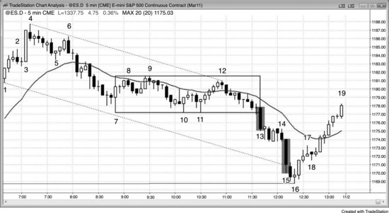

趋势突然加速时，可能是一次成功的突破，带来新的一腿下跌，也可能是趋势的衰竭性终结。在图 4.1 中，这张5分钟 Emini 图上的K线13和K线15都有非常大的波幅和实体，前面还跟着好几根空头K线，但它们代表的意义截然相反。K线13是在一个可能的趋势恢复型空头趋势日中跌破交易区间的突破，它成为了测量型缺口。强突破通常（60%+）至少会有两腿，这里正是如此。第二轮卖出高潮之后的回调可以是一根K线也可以是好几根K线，其中一根或多根的低点可以低于卖出高潮的低点，就像这里到K线14的空头旗形一样。K线15是一根更大的空头趋势K线，代表更猛烈的抛压，市场几乎变成了垂直下跌。最后一批多头已经卖出平仓，再没有人可以卖了。它成为了一个衰竭型缺口，市场随后反转回到了它的高点上方。连续的卖出高潮之后，通常（60%+）至少会出现一轮10根K线、两段式的反转。（我经常说"10根K线、两段式"，意思是这种回调会比小幅回调持续更久、结构更复杂，通常（60%+）至少需要10根K线和两腿来完成。）强多头反转将市场拉回了交易区间，而交易区间跟所有交易区间一样，是一个磁吸区域。

强势多头和强势空头都喜欢看到像K线15这样异常巨大的趋势K线出现在一段持续已久的趋势之后，因为他们预期这是一次短暂但极为难得的机会。趋势K线本身就是一次突破，而大多数突破尝试都会失败。况且这一次发生在前面一段卖出高潮之后——那段高潮几乎没有经历像样的回调，而且多头趋势已经持续了几十根K线都没有出现修正，所以市场真正崩盘的概率极低。聪明的交易者将其视为一次罕见的买入机会，因为至少在接下来相当多根K线内，价格继续下跌的概率非常小。空头回补平仓，多头建立新仓，双方都在积极买入——在该K线收盘价位买入、在其低点下方买入、在下一根K线收盘价位买入（尤其是当下一根K线的趋势力度减弱或实体方向相反时），以及在再下一根K线收盘价位买入。那一根就是K线16，收了阳线。他们也会在前一根K线高点上方买入。当看到一根强多头趋势K线（比如K线16之后那根），他们就在其收盘价位和高点上方买入。多空双方都预期会出现一波更大幅度的修正，空头在至少出现10根K线的两段式回调之前不会考虑再次做空，即便到了那时，也只有当反弹看起来很弱时才会出手。多头同样预期这波反弹，不会急于过早止盈。那些在K线15收盘时就积极买入的激进而有经验的多头，保护性止损大约设在K线高度的距离处，也就是4个点。市场在触及止损之前，至少有60%的概率会先测试该K线的高点，所以这笔交易在数学上是合理的。一旦市场开始快速反转上行，他们会把至少一部分仓位做成波段交易，持有到收盘。

弱势交易者对K线15的看法恰恰相反。那些一直在场外观望、等待回调做空的弱势空头，眼看市场快速远离自己的入场位，急着想抓住下一段下跌，更何况K线15力度如此之强。他们把这根大阴线视为可能的崩盘信号。他们知道概率很低，但不想错过巨大回报的机会——觉得潜在回报足以弥补那微乎其微的概率。而早先买入甚至加过仓的弱势多头，被K线15的急速下跌吓坏了，担心抛压会无休止地延续，于是赶紧平掉多头仓位。这些弱势交易者完全凭情绪操作，而他们的对手却是算法中根本没有情绪变量的计算机。既然市场由计算机主导，弱势交易者的情绪注定让他们在K线15这类行情中遭受重大亏损。

K线11是一个更低低点（LL）主要趋势反转的二次入场买入信号。从K线7到K线9的两段式反弹突破了K线6到K线7那段下跌所形成的空头趋势线。但只有一根K线收盘在均线上方，买盘力度并不令人信服。到K线12为止的五根阳线急速上涨，可能是一波主要趋势反转（MTR）的起步阶段，但其中没有出现大的多头趋势K线，仅仅测试了K线9处交易区间的顶部，并在那里与K线9形成了双顶。此时市场要么正在经历一轮疲弱的主要趋势反转向上，要么是在空头市场中测试交易区间顶部（即熊旗）。K线13那根大阴线是熊旗的突破，也是空头趋势的恢复。主要趋势反转的尝试失败了。趋势线突破以及从K线11低点展开的反弹都缺少连续的、大的多头趋势K线，交易者始终没有认为市场已翻转为始终持仓做多。

**图 4.2** 急速上涨后通道下跌

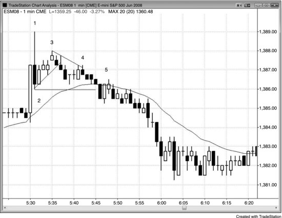

有时市场会先出现一段急速上涨，紧接着又出现一段急速下跌。之后通常会进入交易区间，多空双方争夺通道的方向——多头试图形成上升通道，空头则想要一个下降通道。

如图 4.2 所示，Emini Globex 1分钟图在太平洋时间上午5:30的报告发布后出现急速上涨，但在K线1处形成了一根强烈的向下反转K线。K线1是一根3个点高的K线，在1分钟图上属于大K线，因此有资格被视为一段可能的急速下跌。K线3是一个两段式上行，在可能的新空头趋势中构成低点2做空信号。另外，如果只看实体的话，K线2是一个 ii 变体（K线2的实体包含在K线1之内，K线1的实体又包含在前面那根多头突破K线之内，ii 形态代表市场犹豫不决），到K线3的上行则是 ii 形态顶部的假突破。随后市场横盘了大约10根K线，构成了急速下跌之后的交易区间。K线4仅略微突破了一条次要趋势线，之后市场恢复了下跌趋势。K线5是一个二次入场做空机会——它是K线2下方突破后的回调，也是一次失败的微型通道突破。

一般规律是：大涨加大跌等于市场困惑，等于交易区间——至少会持续一段时间，就像K线1这根空头反转K线和买入高潮之后的走势一样。

**图 4.3** 单根K线内的急速上涨与急速下跌

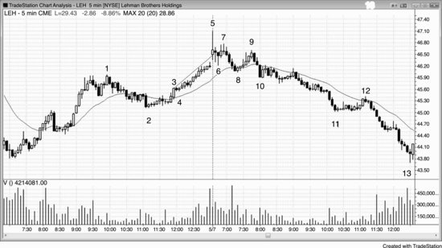

一根带有长上影线的大K线，就是在一根K线内同时完成了向上急速和向下急速。

有时通道可以非常紧，比如图 4.3 中 K线 3 急速之后的那段走势。那段窄通道持续了超过 10 根K线，几乎每根K线的高点、低点和收盘价都在抬升。这种走势不可持续。但不可持续本身不构成做空的理由，因为市场维持异常行为的时间，可能比你的账户撑得住的时间更长。每当市场出现极端行为，很快就会出现相反方向的行为。极端的趋势之后会进入交易区间，有时还会反转；极端的交易区间之后则会进入趋势。

这段窄通道本质上是一个向上倾斜的窄交易区间，迟早会被突破。它在 K线 5 处向上突破，但突破失败后，向下突破的概率就很大，最终也确实如此。市场横盘了 5 根K线，然后在 K线 7 形成一个 LH，在 K线 5 向下急速之后完成了一个小型交易区间（K线 5 先向上急速再反转下跌，在 1 分钟图上必定表现为向下急速）。在高时间周期图表上，跌至 K线 2 的走势跌破了多头趋势线，而反弹至 K线 5 的走势构成了一个 HH 主要趋势反转（MTR）。

K线 9 可以被看作交易区间的扩展、K线 8 跌破多头趋势线后的 LH 主要趋势反转（MTR），或者双顶熊旗（它与 K线 7 大致处于同一水平，至少是第二次尝试反弹到 K线 5 高点附近）。名称不重要，关键是这是一个不错的做空建仓形态。之后市场在当天剩余时间持续走低，下跌过程中还在加速。

K线 10 是一个三根K线的空头急速，跌至 K线 11 的走势是通道。前一天，K线 3 是急速，从 K线 4 开始进入通道。通道的起点通常会在一两天内被回测（K线 4 的低点在高潮顶部之后的空头趋势中被跌破——高潮始于 K线 5 的长上影线，但 K线 10 高点作为下跌通道的起点，在随后两周内都没有被回测）。

跌至 K线 12 的走势勉强突破了空头趋势线，但力度很弱。所以交易员应该继续只寻找做空机会，而不是期待趋势反转。仅仅突破趋势线本身不足以成为寻找反转的理由。突破必须足够强劲，交易员才会相信多头有能力维持一波有力的上涨。

**图 4.4** 高潮之后，通道方向可能会有一段时间不明朗

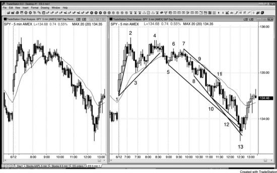

买入高潮（先向上急速再向下急速，有时在一根K线内完成）之后，通常会先出现一段多头通道，失败后市场再形成空头通道。图 4.4 的两张图都是 5 分钟 SPY。上涨至 K线 2 是一段强劲的多头急速。经过急跌至 K线 3 的均线回调——同时突破了一根趋势线——多头通道开始形成。但在 K线 4 出现两段式回调的 LH 后，多头通道失败了。当 K线 5 的回调跌破多头通道、同时也跌破主要多头趋势线之后，很明显这不是一个多头急速与通道日，市场正在形成交易区间。这个交易区间变成了三角形顶部，然后演变为向下的急速与通道。有些交易员认为跌至 K线 3 的走势是关键的空头急速，也有人认为跌至 K线 5 的走势更重要。两段急速都是抛压的组成部分，最终让空头控制了市场。

K线 8 与 K线 3 形成了双底牛旗，同时也是均线缺口K线的二次入场点。一旦这次买入失败，就说明空头已经掌控局面，空头通道正在形成——跌至 K线 5 的走势就是空头急速。此时，你应该尝试把握每一个做空入场机会，在空头趋势通道线出现高潮性过冲并向上反转之前，任何多头交易都只当剥头皮来做。通常来说，在这种强空头趋势中，最好忽略多头建仓形态，只做顺势交易。K线 13 在跌破三条趋势通道线后向上反转。

连续的高潮通常会引发一轮明显的回调，但如果每次高潮之后都出现了明显的回调，后续再发生大幅修正的概率就会降低。K线 3 处出现了一轮卖出高潮，K线 5 处又出现了一轮卖出高潮，但 K线 4 和 K线 7 处的反弹释放了抛压，减少了市场急剧向上反转的需要。不过，从 K线 7 到 K线 13 的空头通道中，K线 9 到 K线 10 以及 K线 11 到 K线 12 期间密集的卖盘没有得到任何缓解。四根空头趋势K线直线下跌到 K线 13，构成了一轮衰竭性的卖出高潮，标志着弱势交易者彻底投降。第三轮卖出高潮往往最为剧烈，通常伴随一根大幅空头急速K线，过冲趋势通道线并使通道弯成抛物线形。抛物线斜率说明下跌动能越来越强，而抛物线形态的趋势往往已经进入最后阶段。最后一批弱势多头不计代价地抛售，最后一批弱势空头则在急速下跌中以市价单加入做空行列。这是第三轮连续卖出高潮且中间没有出现明显的歇脚，而通道往往在第三次推动之后终结。窄通道意味着卖方的紧迫感很强，下跌动能不断加速。K线 13 处的下跌击穿了趋势通道线，这是很多通道结束时常见的方式。

那**强势多头与强势空头**在做什么呢？他们看到了高潮，也理解了过度延伸的状态。强势空头早就在更高的位置做空了，对在这里继续做空没有兴趣。他们会等到出现一轮明显的回调——也许价格回到通道顶部附近，也就是他们最初做空的位置——才会考虑再次做空。既然没有更多强势或弱势空头继续做空，也没有更多弱势多头在止损出场，抛压就消失了。强势多头看到了这轮崩溃，选择观望。他们知道市场还会继续下跌，所以在确认价格已经跌到底部之前，没有理由入场做多。他们想在最好的价格买入，而最好的价格就在底部。不同的机构各有不同的估值方法和对过度延伸的判断标准，当足够多的机构认同市场已经具备价值时，就会有足够的强势买盘推动一波反弹。同时，强势空头也理解了过度延伸的状态，选择止盈，他们的买入也为反弹提供了动力。如果市场能够回到通道起点附近——也就是他们之前做空并获利的位置——他们会考虑再次做空。

底部总是出现在多个磁力位汇聚之处。这里的底部刚好超过了一段测量移动的目标位：从 K线 1 处多头急速的开盘价到五根K线后多头急速最后一根K线的收盘价，往下等距投影。同时，它也过冲了一条趋势通道线——那条线是沿着前一天的两个波段低点画出来的（图中未标出）。K线 13 处的两K线反转向上，同时也是一个大型、跨两天的扩展三角形底部的信号。K线 13 还过冲了从 K线 7 开始的下跌通道所形成的三条较小的趋势通道线。

**图 4.5** 方向相反的趋势K线构成高潮反转

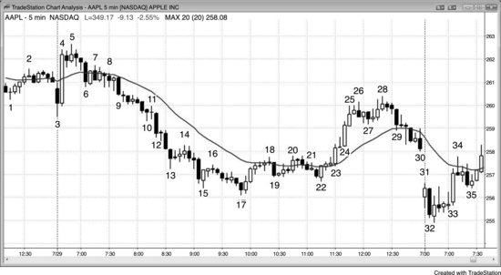

一根方向的趋势K线紧跟一根相反方向的趋势K线，就构成高潮反转，随后的通道可以朝任一方向发展，因为两个方向都有急速走势。图 4.5 中，AAPL 在这张 5 分钟图上出现了多次高潮和反转。

K线 3 是一根大幅空头趋势K线，因此既是一根急速K线，也是一次突破和一次高潮。紧接着出现了一根更大的反方向趋势K线，构成了买入高潮。很容易以为这代表了更强的信念，但你需要耐心等待，让市场自己告诉你方向。你的任务是跟随机构，而不是去猜测他们会做什么。

上涨到 K线 5 处形成了一个 HH 突破回调——是对 K线 3 空头突破的回调，同时也是 K线 4 多头突破之后的暂停。K线 6 又是一根空头急速K线，因此又是一轮卖出高潮。K线 6 之后的窄交易区间既是对 K线 4 多头突破的回调，也可能是 K线 3 突破和 K线 6 空头急速之后空头通道的起点。在 K线 6 之后的窄交易区间中，多头在买入，试图构建多头通道；空头在做空，试图构建空头通道。最终空头赢了。尽管 K线 4 的买入高潮是一根比 K线 3 和 K线 6 的空头急速K线更大、更强的趋势K线，空头仍然压倒了多头。

K线 15 是一根多头反转K线，因为它的振幅相当大、实体也很大，所以构成了一次买入高潮。它紧跟在一根大幅空头K线之后，而那根空头K线本身就是一次卖出高潮。由于之前的下跌通道非常陡峭，第一次突破尝试失败的可能性更大。每当强趋势中出现反转而入场K线又很小的时候，它更可能只是一个顺势旗形。这里，K线 15 反转之后的两根K线都很小，显示出多头的疲软，它们构成了一个熊旗。

所有两K线反转本质上都是方向相反的高潮，只不过通常幅度不大。K线 17 是一个小型卖出高潮，紧接着出现了一根多头趋势K线，构成了一个两K线反转。向下的急速是卖出高潮，向上的急速则是多头突破。向上的急速持续了三根K线。K线 19 是一根空头急速，既是卖出高潮，也是对熊旗的突破——这面熊旗同时也是对均线的回调。这根K线随后被 K线 10 的买入高潮反转。

从 K线 23 到 K线 25 的多头急速——或者说仅由 K线 24 和 K线 25 构成的那段——被较小的 K线 29 空头趋势K线反转。那个卖出高潮之后出现了几根十字星，然后市场向收盘方向抛售。空头通道在第二天才结束。

K线 31 是一个买入高潮，随后 K线 32 是卖出高潮，而卖出高潮在下一根K线上被反转。K线 33 是另一根大的多头趋势K线，因此也是一个买入高潮，它突破了开盘区间的上沿。之后出现了四根K线的回调，其中包含一根空头突破K线，然后反弹以多头通道的形式恢复。

K线 18 处的反弹突破了从 K线 5 到 K线 17 的空头通道，但在均线附近停滞了。市场从 K线 20 的双顶处开始下跌，但在 K线 22 的低点处找到了买盘，形成了双底牛旗。那个双底形成的 HL，是不是一个好的主要趋势反转（MTR）建仓形态？其实并不理想——虽然从 K线 22 向上突破空头趋势线到 K线 20 的两段式上涨包含了很多多头K线，但未能站稳均线上方，说明力度不够。从 K线 22 双底到 K线 28 的两段式上涨出人意料地强劲，但很多交易员把它视为空头趋势中的第一波反弹，所以可能只是一个空头反弹，而不是新的多头趋势。不过，这波上涨的强度足以让交易员考虑在回测空头低点时买入。交易员在 K线 32 抛售之后的那根多头K线上方买入——这发生在第二天开盘；还有人在两根K线之后形成的第二根多头信号K线上方再次买入。它构成了一个第二次信号（与 K线 32 之后那根多头K线形成微型双底），因此更可靠。最终结果是一个主要趋势反转（MTR），它源于强力突破空头趋势线（即涨到 K线 28 的那波）之后出现的 LL。由于整个形态跨越了很多根K线，在高时间周期图表上可能更容易识别。

**图 4.6** V形顶和V形底很罕见

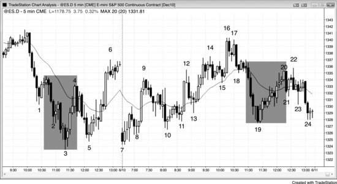

V形底和倒V形顶——也就是市场在没有出现明显回调的情况下直接反转——是很罕见的。大多数急速走势不会立刻反转市场，通常急速的末端会被回测。在图 4.6 中，K线 3 的楔形底引发了一波涨到均线的反弹。这本来有可能形成V形底，但随后向 K线 5 的 HL 的下跌回测了急速的底部。大多数被称为倒V形顶或V形底的反转，实际上是别的类型的底部，比如最终旗形反转，或者微型双顶、微型双底。举个例子，从 K线 3 低点向上的反转是一个楔形底，同时也是一个最终旗形反转——基于 K线 2 之后的两K线熊旗。K线 19 处的底部是一个微型双底，因为 K线 19 前一根K线先下跌再上涨收于高位，K线 19 又向下探了一次，它后面那根K线再次上涨，形成了微型双底。这个双底在 1 分钟图（未展示）上很容易看到，从这张 5 分钟图上也能推断出来。

K线 20 是 K线 19 空头急速之后一波持续反弹的顶部，也是尝试形成V形底的结果，但 K线 19 急速的低点在当天收盘时被回测。

K线 4 处的上涨是对空头趋势线的一次强力突破，这让多头开始寻找机会，要么在 LL 处买入，要么在回测 K线 3 低点的 HL 处买入。多头希望看到的是对趋势线的强力突破，而不是横盘漂移后勉强突破趋势线。

交易员预期，连续三次卖出高潮跌到 K线 3 之后，市场会出现一波大幅回调——至少两段、横盘到上涨、持续至少 10 根K线。最终的高潮通常包含整个下跌过程中最大的空头趋势K线，这里也是如此——K线 3 前两根K线就是那根最大的空头趋势K线。强势空头只会在出现明显回调后才考虑做空，而强势多头则在积极买入，如果市场继续下跌他们还会加仓。在从当天高点向下的窄通道中连续出现三次卖出高潮之后，K线 3 的低点处已经没有强势交易者愿意做空了。强势空头在回补空头仓位，强势多头在积极建立新的多头仓位。

从 K线 7 到 K线 6 的两段式上涨大幅突破了多头趋势线，提醒交易员下一波下跌可能会回测 K线 3 的空头低点然后反转向上。K线 7 是一个双底主要趋势反转（MTR）。有些交易员把第一个底看作 K线 3 的低点，另一些人则把这个形态视为以 K线 5 低点为基准的双底牛旗。

大多数反转尝试都会失败，高潮反转也不例外，因此很多交易员会押注反转失败，预期趋势至少还能延续一段、足够做一笔交易。比如，虽然上涨到 K线 4 的那波力度很强，但许多空头只是把它看作一次均线回调加上与 K线 1 回调形成的双顶。他们认为这是一个很好的机会，可以在短暂的高位做空，然后在 K线 5 止盈——K线 5 底部的影线和小阳线实体就是这些空头获利了结的证据。

**图 4.7** V形底很少见，但一旦出现就很强

V形底或倒V形顶（急速拉升或急速下跌后没有出现有意义的回测）在 5 分钟图上一个月只出现几次。图 4.7 就是一个 5 分钟图上的V形底，属于卖出高潮，也是一种高潮反转。开盘后下跌到 K线 9 的那段走势是抛物线式下跌，这是卖出高潮的一种类型。可以看到三条趋势通道线的斜率越来越陡（从 K线 2 到 K线 3、K线 5 到 K线 8、K线 8 到 K线 9），说明市场出现了恐慌。交易员不计代价地卖出。空头杀跌（空头加仓），在强空头急速下跌过程中迅速加大仓位。但当卖出高潮连续出现时，市场很快就耗尽了那些急于做空、甚至愿意在没有像样回调的情况下做空的交易员。卖盘的缺失形成买方失衡，通常（60%+）随后会出现至少持续 10 根K线、至少包含两段的上涨。

只要出现一次卖出高潮或像这里一样出现连续两次卖出高潮（分别在 K线 8 和 K线 9 结束的空头急速下跌），而且加剧的抛售发生在市场已经下跌了 10 根或更多K线之后，就有很大可能出现强力反转。强势多头之前选择观望，因为他们预期市场会下跌到几个磁力位的交汇处；一旦价格到达那里，他们突然出手大举买入。强势空头也看懂了局面，当他们看到 K线 9 那根异常大的卖出高潮K线后，迅速回补空头获利了结，而且在市场涨到更高位置之前不愿意再考虑做空。强势多头和强势空头在 K线 9 收盘时以及随后的两K线微型双底处都在买入，市场只能往上走。

当一个看起来跌得太快太深的市场中出现强空头急速下跌时，这段下跌有可能只是真空效应式地下探到某个支撑位做测试，很多交易员会关注有没有高潮反转的迹象。市场强力下跌到 K线 8 后出现了一个单K线低 1 卖出信号。有经验的多头和空头都清楚，如果接下来一两根K线内出现一根特别大的空头趋势K线，那可能就是抛售的衰竭性尾声。那个低 1 信号K线可能是一根单K线最终旗形（第 7 章会讨论）。当 K线 9 收盘后，它是一根格外大的空头趋势K线，构成连续卖出高潮，可能（60%+）触发最终旗形反转，带来至少 10 根K线、至少两段的上涨。很多空头在这种情况下会回补空头，因为他们意识到市场可能急速拉升。如果大约 10 根K线后出现一个合理的卖出信号，他们会再考虑做空。这一次，市场强力上涨，空头没有看到任何回落的迹象，所以始终没有找到合理的做空建仓形态。

激进的多头同样认为市场可能（60%+）上涨，也纷纷买入。一部分多头和空头在 K线 9 收盘时买入，风险大约是 K线 9 的高度；也有人选择更小的风险，比如几个点。另一些多头和空头在下一根K线形成过程中和收盘时买入，因为那是一根小K线，说明抛压正在减弱。还有些人等到 K线 10 收出强阳线后，在收盘价或其高点上方买入。最后，剩下的空头回补了空头，而那些谨慎的多头——想要确认市场已经翻转为 Always-in 做多——在从 K线 10 低点起的五根K线多头急速上涨以及随后的反弹过程中买入。很多多头在从 K线 10 低点起的那波快速强劲的多头急速上涨中追涨（多头加仓），不断加大仓位。

当市场快速运动、有经验的交易员持仓立刻产生且快速增长的利润时，他们往往会加仓买入，试图在这段短暂而难得的机会中尽量扩大利润。这跟市场处于窄交易区间时的做法正好相反——就像图表左侧前 20 根K线那段走势。当市场波动很小时，大多数交易员选择观望，安心等到趋势启动再说。但机构和高频交易公司全天都在大量交易，包括在窄交易区间里也不例外。

完美的V形底——市场一路直跌再一路直拉——极其罕见。大多数V形底在下跌过程中都会有微妙的价格行为暗示卖方在犹豫，这里也是如此，提醒交易者注意可能出现反转。K线 8 之后的那根K线是一根单K线最终旗形，提示交易者在接下来一到两根K线的卖出高潮之后可能向上反转。K线 10 与前一根K线构成了微型双底，再加上 K线 9 的低点又构成了微型三重底。这是一个微型三连推下跌形态，在低时间级别图表上可能（60%+）是一个三角形，在连续卖出高潮和单K线最终旗形之后，它给了多头一个低风险、高概率的入场机会。

昨天市场平静时，大多数K线的成交量大约在 5000 到 10000 手之间。K线 9 的成交量达到了 114000 手。这么大的量几乎全部来自机构。那么更可能的原因是什么？是机构在市场已经连跌了很多根K线之后终于决定做空，还是多头和空头都看到这个连续卖出高潮可能意味着抛售暂时结束，所以激进买入？机构是聪明钱，所以当它们在一段持续的空头趋势中突然达成一致、交易量暴增的时候，大概率是多空双方都在激进买入——空头在止盈，多头在进场。如果机构那么聪明、那么赚钱，而且每一个 tick 的变动都跟它们有关，那它们为什么还会在空头趋势的最低点卖出？因为它们的算法一路下跌过程中一直这么做并且是赚钱的，有些算法的设计就是在空头趋势明确结束之前持续卖出。最后那笔卖出会亏钱，但之前所有交易的盈利足以弥补这个亏损。别忘了，它们所有的系统都有 30% 到 70% 的时间在亏钱，而这只是其中一次。还有一些高频交易公司会在空头趋势中一直剥到最低点的位置只赚一个 tick。最低点总是在支撑位上，很多高频交易公司会在支撑位上方一两个 tick 处卖出，试图抓住最后那个 tick——前提是它们的系统显示这是一种有盈利的策略。另外一些机构是在其他市场（股票、期权、债券、外汇等）进行对冲交易时卖出的，因为它们判断通过对冲可以获得更好的盈亏比。这些成交量不是来自个人散户，因为在主要转折点上散户只占不到 5% 的成交量。

**图 4.8** 急速回调比急速反转更常见

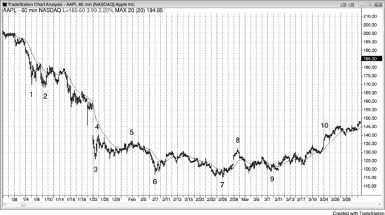

急速走势是对趋势方和逆势方双方力量的测试。多头趋势中的向上急速和空头趋势中的向下急速通常（60%+）会被回测，因为急速反转远比单纯的临时趋势极值少见得多，而后者通常（60%+）会被回测并被超越。多头趋势中的向下急速和空头趋势中的向上急速属于回调，可能被回测也可能不被回测。它们本身就是一种测试——测试逆势方的决心和顺势方的意志。这些回调经常接近于将 Always-in 仓位翻转到相反方向，但跟随力度不够。强势交易者喜欢这些反转尝试，因为他们知道大多数都会失败。每当逆势方发起一次反转尝试，顺势方就会入场强力对抗，通常（60%+）会赢。他们把这些猛烈的逆势运动看作绝佳的顺势入场机会——在一个可能（60%+）只会短暂存在的好价格上入场，价格很快就会回归，成为趋势中的一段急速回调。在图 4.8 中，这张 60 分钟的 AAPL 图表上，K线 1、K线 3 和 K线 6 的空头急速（发生在空头趋势中），以及 K线 4 和 K线 8 的多头急速，全部被回测了。

K线 4 是空头趋势中的多头急速，并不一定要被回测，但大约 10 根K线之后确实被回测了。

K线 8 是交易区间中的多头急速，同时突破了一条主要趋势线，所以可能（60%+）会被回测。

K线 7 是一个新的波段低点，但不是急速走势，所以不需要被回测。

**图 4.9** 急速回调通常（60%+）不会被回测

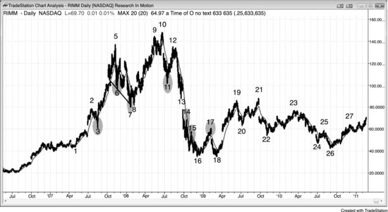

急速*回调*不一定会被回测，因为交易者一致认为趋势在恢复，都急着上车；但急速*反转*通常（60%+）会被回测，因为它是逆势的，交易者不太愿意相信反转能成功。

多头趋势中的大多数空头急速下跌，是由两类人造成的：一类是获利了结的多头，他们打算在更低的位置重新买入；另一类是激进的空头，他们只是想做一笔空头剥头皮。当市场像 K线 3 那样急速下跌时，多头会积极买入来建立新的多头仓位或加仓，而空头则会买回获利的剥头皮仓位。一旦空头能够获得跟随卖出——就像下跌到 K线 7 那段走势一样——他们就会认为市场正在变得足够双向，可能（60%+）正在转入交易区间甚至主要趋势反转（MTR）。接下来的反弹中，他们不再只是剥头皮做空，而是会持有部分或全部仓位做波段下跌。多头同样预期会有更深的下跌，只会在更低的位置买入，而且必须有明确的买入信号才会出手。既然多空双方都不愿在市场下跌幅度超过以往回调之前买入，那么更深回调、交易区间甚至主要趋势反转（MTR）出现的概率就增大了。

图 4.9 中的 K线 3 是强多头趋势中的一根空头急速K线，不太可能（≤40%）被回测。它只是第一根均线缺口K线，套住了空头。虽然抛压很猛，但跟随卖出不够充分，不足以让交易者认为市场已经反转为 Always-in 做空方向。在急速下跌中做空的空头意识到了这一点，迅速买回空单、退到一旁，等待下一个可能（60%+）的反转机会。多头则积极买入，因为他们看到空头已经失败，这波急跌只是一次以好价格买入的短暂机会。他们乐于见到空头急速下跌，因为他们知道大多数反转尝试都会失败，从而形成绝佳的买入建仓形态。既然没有人愿意继续卖出，市场便连续多根K线大幅上涨。

K线 6 是楔形顶之后出现的空头急速K线，因此可能（60%+）会被回测，因为至少预期会有两段下跌。

K线 7 是空头腿中的一根空头急速K线，被一个 HL 回测，随后高时间周期的多头趋势恢复延续，依据的是 K线 4、6、7 构成的楔形牛旗。

K线 11 是一根强急速下跌K线，可能（60%+）是新空头趋势的第一段下跌腿，因为它出现在 K线 10 的 HH 之后。在这个位置，它不太可能（≤40%）是多头趋势中的回调，因此可能（60%+）会被回测。在强多头趋势线被突破（即下跌到 K线 7 那段走势）之后又出现 HH，市场可能（60%+）至少会有两段下跌。

K线 13 是大级别多头趋势中两段式回调的底部。由于它高于 K线 7 的低点，市场仍在形成 HL 和 HH，可能（60%+）仍处于多头趋势中，所以这里有可能（60%+）催生一个新的多头高点。但考虑到下跌动能如此强劲，更好的做法是等待从这里出现一波反弹，然后形成一个 HL 之后再做多。最终市场带着一个大缺口向下突破。

K线 14 和 K线 15 是强空头趋势中的多头急速K线，不必被回测。

K线 17 是空头趋势中的一根多头急速K线，因此不必被回测，它完全可以只是空头趋势中又一个 LH——空头趋势就是一系列 LH 和 LL。不过，它跟在一个小型楔形底之后（K线 15 是第一段下跌的回调），楔形底可能（60%+）至少有两段上涨，所以到 K线 17 的这波上涨只是两段潜在上涨腿中的第一段。同时，K线 16 的低点处于 K线 1 窄交易区间的区域内，那里是支撑区域，因此有合理的理由预期在那里形成交易区间。这意味着从 K线 18 双底再发起一次反弹的概率相当大。到 K线 17 的反弹突破了空头趋势线（从 K线 12 下跌到 K线 16 这段趋势的趋势线），交易者由此开始关注：之后是否会回测空头低点，然后演变为交易区间或主要趋势反转（MTR）。最终证明，这是一个延续到图表末尾的大型交易区间的起点。

**图 4.10** 多头急速的回测

如图 4.10 所示，Research in Motion（RIMM）昨天收出一根强多头急速K线，因此今天非常可能（60%+）会尝试突破昨天的高点。虽然今天的反弹走势凌乱，看起来不像特别看多，但空头始终无法让收盘价连续两次低于均线。这张图表在上涨，只是它的强度有一定迷惑性。

**图 4.11** 倒V顶

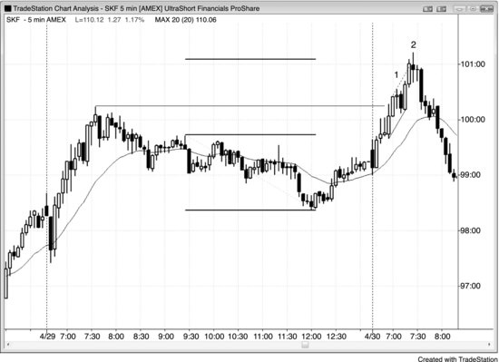

如图 4.11 所示，ProShares UltraShort Financials ETF（SKF）在 K线 2 处形成了一个高潮型开盘反转（倒V顶），本质上就是价格突破一条小型空头趋势通道线（虚线）顶部后发生的反转。同时这也是突破前一日高点后的二次入场点，以及从前一日开盘起步的"腿 1 = 腿 2"趋势恢复的终点。从开盘算起，市场连续出现了三次买入高潮，中间没有出现有力度的回调，还可能构成一根K线的最终旗形反转（K线 1 之后那根空头K线就是一根K线的高 1 牛旗）。从高时间周期图表看，前一日的下跌跌破了多头趋势线，而 K线 2 是在形成 HH 后向下反转。价格向上完成了从前一日交易区间算起的测量移动，但仅凭这一点不足以构成做空多头趋势的理由。当强趋势运行到测量移动目标位时，多头会止盈，但空头只有在存在其他因素时才会做空——这里正好具备这些因素。

K线 2 与其前面那根多头趋势K线构成了微型双顶。价格先随那根多头趋势K线上涨，接着在 K线 2 顶部的影线处再次上冲。随后价格跌至 K线 2 底部，又第三次上推到紧跟其后那根小十字星的高点，形成了一个微型头肩顶或三角形态——在更低时间级别的图表上可能（60%+）看得更清楚。这个顶部也是从 K线 1 之后那根一根K线最终旗形发展出来的一根K线最终旗形反转。K线 2 和其后那根十字星的实体与 K线 2 之前那根多头K线的实体构成了 ii 形态。

**图 4.12** 具备更多反转理由的高潮反转

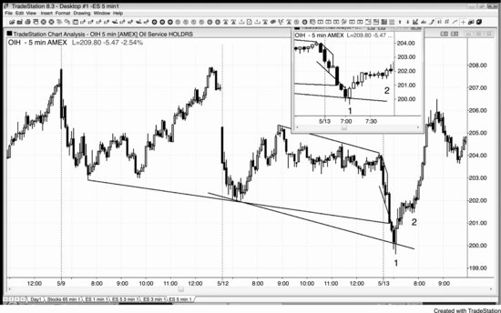

高潮反转在叠加其他因素时更加可靠。如图 4.12 所示，5 分钟 Oil Service HOLDRS（OIH）在前一日低点下方出现了高潮型开盘反转，同时也是三次趋势通道线过冲后的反转。交易员应该在 K线 1 处那个大型两K线反转的上方买入，并在 K线 2 处的高 2 首次回调再次买入，至少预期两腿上涨。当两腿行情的概率较大时，一定要把一部分仓位做成波段交易，因为有时候会演变成新趋势，而不只是两段式回调。

K线 1 是一个两K线反转底部。K线 1 之前那根是一根大型空头趋势K线，比它前面的空头K线更大，收盘价也远低于前一根。这意味着它构成了对前一根K线的突破，而那根较小的空头趋势K线就是一根K线最终旗形的变体。在更低时间级别的图表上，它可能（60%+）是一个小型最终旗形。

**图 4.13** 不要在空头趋势通道线测试处买入

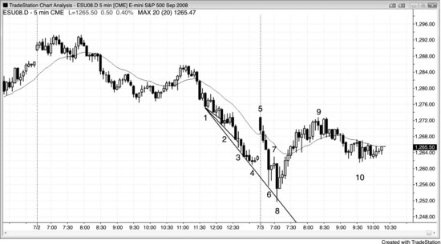

逆势交易员总是在画趋势通道线，期待出现过冲和反转，至少能刮一把头皮，最好能走出两腿逆势行情。当通道很陡时，每次在趋势通道线过冲处买入反转是一种亏钱的策略。正确做法是等到通道出现强力突破——比如图 4.13 中 K线 5 的大幅跳空高开——然后寻找突破回调的买入机会，比如 K线 8 处第二次尝试反转前一日低点。

K线 2 突破了一条小型趋势通道线，但之前没有出现逆势力量，而且建仓K线只有一个小小的多头实体。聪明的交易者会等待二次入场点，尤其是 HL，如果 HL 没有出现，他们就会把这当成一个顺势建仓形态——结果确实如此。注意 K线 2 下方的突破是以一根强空头趋势K线的形式出现的。原因在于：很多多头提前在这个小楔形处入场了，而在价格跌破 K线 2 这个楔形低点之前，大多数人不会承认反转已经失败——他们的保护性止损就放在那里。同样，很多空头也在那里放了买入突破单，因为楔形失败后的下跌幅度通常至少等于楔形的高度，为这段测量移动提供了很好的做空入场机会。当空头通道像这样陡峭时，聪明的空头会用限价单在前一根K线高点处或上方做空——而那正是过于急切的多头正在买入的位置。

K线 3 过冲了另一条趋势通道线，但没有出现入场信号，所以几乎没有多头被套住。

K线 5 的开盘远在空头通道上方，但它是一个 EMA 20 缺口K线做空建仓形态，本质上也是第一次均线缺口K线（差不多够格了——它的实体较大且完全在均线上方），形成了始于开盘的趋势向下运行。

K线 6 没有触及趋势通道线，所以尽管它试图反转前一日的低点，这次反转尝试是值得怀疑的。多数交易员会等待过冲出现，如果没有过冲，至少也要等二次入场点。而且，信号K线是一根只有很小实体的十字星，说明多头并不强势。

K线 8 过冲了空头趋势通道线，信号K线是一根实体较大的多头内包K线。这个建仓形态也是对前一天低点的二次反转尝试，构成了一个可靠的开盘反转建仓形态，有可能（60%+）成为当天最低点。它从 K线 7 的最终旗形向上反转，同时也是 K线 5 突破空头通道后的一个 LL 突破回调。记住，空头通道就是牛旗。有些交易员合理地将其视为一次主要趋势反转（MTR），因为涨到 K线 5 的那波上涨明显突破了空头趋势线和均线上方。最后，这是一组连续卖出高潮，而且它的实体是整段下跌中最大的空头实体——这在连续卖出高潮末尾很常见。

**图 4.14** 斜率增大通常（60%+）意味着情绪走向极端

一旦斜率变陡，趋势就在加速，可能（60%+）即将回调。原因在于：斜率增大说明情绪升温，一旦那些被情绪驱动的交易员退出，既没有人还想退出，也没有人愿意在回调出现之前入场。图 4.15 中 K线 8 之后的上涨比之前的多头趋势更陡，而整个多头趋势最终以 K线 10 的跳空空头反转收场。

K线 13 之后的下跌比之前的空头通道更陡，这一波卖出高潮在 K线 15 处被一根强多头趋势K线反转向上，K线 15 和 K线 4（K线 4 是上涨到 K线 10 那波多头急速的起点）构成了双底。这两天先出现了一波大幅急速上涨，接着又出现了一波大幅急速下跌，合在一起形成了一个大型买入高潮。高潮之后通常（60%+）会进入交易区间，这里也不例外——随后出现了一波两段式上涨到 K线 20。

K线 14 之前那根大空头趋势K线，在当时可以被看成两种情况：要么是一次突破，可能（60%+）引发测量移动下跌；要么是一波衰竭型卖出高潮，可能（60%+）触发约 10 根K线、两段的向上反转。由于之前连续多根陡峭的空头K线一路下行、毫无回调，这种走势不可持续，因此更可能（60%+）是高潮行为的尾声。很多交易员就是等着看到这种大空头趋势K线才开始买入。一些人在该K线收盘时就买了，但由于前一天低点就在附近，不少交易员选择再观望一下，看市场是否还会再跌一点。这些交易员在 K线 15 形成过程中、在 K线 15 收盘时以及在 K线 15 高点上方买入。这是一次成功的卖出真空效应测试前一天低点（双底主要趋势反转（MTR）），买方由此掌控了市场。他们预期这次空头突破会失败，K线 15 就是这次失败突破的买入信号K线。那些一路持有空单到 K线 15 的空头在此回补止盈，如果他们打算在几个 tick、几根K线之后马上再做空，就不会止盈离场。如果他们认为这次回调会很短暂，就会继续持有空单。强多头反转K线和入场K线都表明这次反转力度很强，卖方会退到一旁观望大约 10 根K线。这使得市场变成单边格局，引发了一波大幅上涨。空头在等一个合理的建仓形态来重新建立空头仓位，直到 K线 20 才等到。多头清楚空头可能（60%+）会回来，所以卖出多头仓位止盈，打算等大约 10 根K线再考虑重新买入。他们在 7 根K线后买在了 K线 22 的低点，那里从 K线 17 的低点向上反转，形成了双底。这是一次 HL 主要趋势反转（MTR）（因为涨到 K线 20 的那波上涨突破了下跌至 K线 15 的空头趋势线上方），同时也是一个三角形（K线 4 和 K线 15 是前两次下推）。

**图 4.15** 反转需要动能

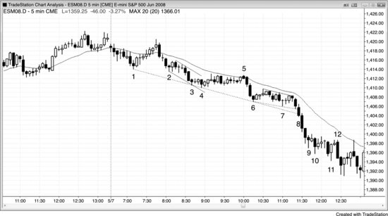

当一个高潮形态未能产生任何逆势动能时，应该假设自己对市场的判断有误，正在朝着错误的方向找交易机会。楔形反转和楔形回调虽然外形可能相似，但本质不同，必须关注背景。如果多头趋势中出现了楔形回调，可以在第一个信号就买入，因为你是顺着多头趋势做的。可惜在空头趋势中，过于急切的多头往往把所有楔形底部都当成回调来对待，但大多数其实是反转。当楔形属于反转时，它是逆势交易——应该等到出现 HL 之后再买入，而且要在趋势线被强力突破之后才行动。在强空头趋势中试图剥头皮做多，是一个必输的策略。

如图 4.15 所示，K线 4 完成了从 K线 2 和 K线 3 开始的三连推下跌，同时也在 K线 1 和 K线 3 连线形成的空头趋势通道线处获得支撑反弹。但市场随后只是横盘，并没有上涨。多头并不强，所以表面上看起来的过度看空其实根本不算过度。只要空头趋势强劲，最好只找做空机会，直到出现 HL 之后再考虑。即便那时买入，也要随时准备好：一旦空头趋势形成低 2 建仓形态，就转手做空。

K线 8 在收盘前最后几秒还是一根多头反转K线，结果迅速抛售变成了一根空头趋势K线。那些心急的多头本以为这是楔形底部加上两条空头趋势通道线的多头反转K线，结果却变成了对空头趋势通道线的空头突破——这意味着所有人都认为下跌远没有结束。随后一连串空头趋势K线确认了这次楔形反转的失败。如果你在盯盘，就会看到那根多头反转K线塌成空头趋势K线，这时你应该做空，因为你知道有一批被套的提前入场多头——他们以为自己买在了一根强多头反转K线上，而且还在空头趋势通道线附近（不要抢跑K线；一定要等K线收盘，并等下一根K线确认反转）。就算你没有看到这个过程，在那根空头趋势通道线突破K线的最低点下方一个 tick 做空，仍然是一笔聪明的交易。

K线 11 又构成了一个三连推下跌形态，但由于全是十字星和大幅重叠的K线，做多必须等第二次信号，交易员应该在铁丝网形态的高点附近找小K线做空（比如 K线 12，它明显在前一根多头反转K线入场突破后套住了多头）。K线 11 是一根很差的多头反转K线，因为之前并没有显著的多头力量——没有突破空头趋势线，而且它与前面几根K线高度重叠，等于是在空头交易区间的高位买入（记住：低买高卖！）。当天是一个非常强的空头趋势日，最好的交易员根本不会去找楔形，而是会盯着均线附近做空。由于回到均线的机会很少，说明空头非常强势，聪明的做空者会把每一个失败的买入信号以及低 1、低 2 入场都拿来做空。

从 K线 2、3、6、9 到 K线 12 之后，出现了连续的抛售高潮。下跌走势并不在窄通道中，每一段过度的下跌都通过大约 10 根K线的横盘来消化。这形成了一系列趋势性交易区间，在强趋势中很常见，也阻止了衰竭型高潮反转的出现。

**图 4.16** 太多趋势通道线

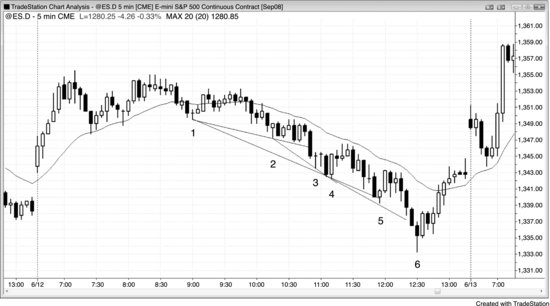

每当你发现自己在画好几条趋势通道线的时候，你几乎一定是被焦虑蒙蔽了双眼——你不敢相信眼前正在发生的事情（见图 4.16）。虽然趋势处于空头通道中，通道内确实有大量双向交易，但通道持续的时间往往远超你的想象。永远假设通道会一直延续下去，等到它真的结束了再改变看法。双向交易给人一种即将反转的错觉，但大多数反转尝试最终都会失败。趋势很强，你却因为满眼都是趋势通道线和潜在反转而错过了所有顺势做空的机会——你以为这是交易区间日里一段过度的抛售（急速与通道形态中的通道看起来总是那样）。要有耐心，只顺势交易，直到出现一个足够清晰、足够强的反转，强到不用画线就能看出过度——比如 K线 6 那根大K线，反转了昨天的低点，同时也是三连推下跌形态（K线 4、5、6）。不要交易你觉得"应该发生"的行情，只交易正在发生的行情，哪怕它看起来不可能。正如第一本书第 15 章关于通道的讨论，当市场处于空头通道时，聪明的交易者只在K线下方买入，而不在上方买入；他们对做空更感兴趣，会在前一根K线上方做空，而不是在下方。

**图 4.17** 反转处的成交量并不特别有用

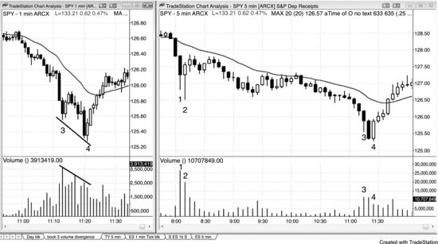

如图 4.17 右图所示，5 分钟 SPY 在 K线 3 处出现了衰竭型抛售高潮，K线 4 处出现了两K线反转，随后强势上涨突破了均线。

左图是 1 分钟图，显示低点处出现了成交量背离，这很常见。K线 4 低点的成交量比之前 K线 3 低点的成交量少，尽管 K线 4 的价格更低。大概率在 tick 图上也有背离，许多振荡指标上也有，但有经验的交易员只看 5 分钟图就能判断出来，不需要额外的工具。

传统技术分析认为，多头反转的成交量应该大于最后一根空头K线的成交量。在这里，5 分钟图上 K线 4 那根多头反转K线的成交量比前面两根空头趋势K线都要小。这是否说明反转不可靠？完全不是。不过，这可能足以让一些交易员不敢在底部买入。我不想被这些东西干扰，交易时既不看成交量也不看任何指标，因为图表已经告诉了我一切。顺带一提，K线 2 的成交量远大于 K线 4 低点的成交量，但 K线 2 最终却是一个失败的反转，以双顶熊旗收场。

K线 3 底部的长影线说明买方正在进场；通常市场只会再跌一两根K线，然后就会尝试修正。K线 4 是一个强劲的两K线反转，也是与 K线 3 低点构成的微型双底。K线 3 属于一种最终旗形，在更低时间周期的图表上大概率也是最终旗形。
