市场朝一个方向连续推动三次后，形成反转建仓形态并触发反转交易，第一目标位是整个形态的起点，下一目标位是以形态高度为基础的测量移动目标。举例来说，假设出现一个楔形顶，第三次上推以一根强空头反转K线收尾，下一根K线跌破了这根反转K线，那么第一目标位就是楔形底部（第一次上推后的回调低点），下一目标位则是根据楔形从底到顶的高度计算出的向下测量移动目标。不论形态外观如何变化，所有三推形态反映的都是同一种市场行为。无论它是楔形、微型楔形、抛物线楔形、带第四推的楔形、趋势或交易区间中的楔形回调、楔形趋势反转形态、其他三角形（包括扩散三角形）、三重顶或三重底、双顶或双底回调、头肩顶或头肩底，还是跌破双顶或涨破双底后的失败突破——本质都一样。到了某个临界点，趋势交易者放弃了对强力突破的期待，反转交易者接管了市场。连续三次反转尝试通常足以促成这种转换（概率60%以上）。

三推形态中经常包含大趋势K线，形成连续高潮。如果每次推动都是由一到三根K线组成的强急速段，交易者会将其视为高潮。例如，先出现一波强空头急速段，接着一个回调，然后又来一波强空头急速段，交易者就会思考：这个回调会不会是空头趋势的最终旗形？连续的卖出高潮之后，是否会出现更大幅度的回调？如果第二次下推之后只出现一个小回调，而非10根K线的反弹，紧接着又来了第三波强空头急速段，交易者会将其视为连续三次卖出高潮。他们知道，市场有60%或更高的概率会尝试走出更复杂的修正——比如两段式上涨，持续约10根或更多K线。因此，如果形态有一根好的信号K线、形状合理、有足够的买压、且不处于窄幅空头通道中，他们就会考虑在第三次下推后买入做多。

楔形既可以是回调形态，也可以是反转形态。楔形回调在第二本书的第18章和第19章有所讨论。当楔形作为趋势中的回调出现时，属于顺势建仓形态，在第一个信号出现时入场是合理的。楔形反转则是试图扭转趋势方向，因此属于逆势建仓形态。一般而言，逆势交易最好等第二个信号再入场。例如，空头趋势中出现一个楔形底，只有在形态特别强势的情况下，才适合在信号K线上方直接买入。通常更好的做法（概率60%以上）是等市场出现一波强多头突破后找回调买入，这个回调可以是更高低点（HL），也可以是更低低点（LL）。如果多头突破连续上涨好几根K线都没有回调，则按照第二本书中讨论的一般突破方式来交易。楔形回调和楔形反转还有一个区别在于方向：楔形牛旗向下倾斜，而多头趋势顶部的楔形反转向上倾斜；空头趋势中的楔形回调向上倾斜，而空头趋势底部的楔形反转则向下倾斜。此外，楔形旗形通常是较小的形态（概率60%以上），多数持续约10到20根K线。因为它们是顺势建仓形态，不需要形态完美，很多看起来一点也不像楔形，但都具备三次推动的特征。反转形态则通常需要至少20根K线的长度（概率60%以上），并且有一条清晰的趋势通道线，才有足够的力量扭转趋势。

趋势经常以对极端价位的测试来结束，而这个测试往往分为两段，每段都到达一个更极端的价位（多头趋势中是两段式更高高点，空头趋势中是两段式更低低点）。第一个极端加上随后的两段，合计构成三次推动，这是一个被广泛认可的反转建仓形态，有多种名称。有时它呈现楔形形状（多头趋势中为上升三角形，空头趋势中为下降三角形），但通常不是（概率60%以上）。交易者无需在各种变体之间做精细区分，因为它们的相似性足以采用相同的交易方式。为了简化，可以把所有三推形态都当作楔形来思考，因为大多数都以一个高潮式的楔形尖端结束。记住，楔形就是一个有三次推动的趋势通道，趋势线和趋势通道线往往趋于收敛。三推形态中的趋势线和趋势通道线可以像楼梯形态那样平行，可以像楔形那样收敛，也可以像扩散三角形那样发散。具体形状并不重要，因为它们的行为方式类似，交易方法也相同。它们都是高潮形态，并且经常带有抛物线特征，有时不太明显。例如，假设有一个多头楔形，连接第二段和第三段顶部的趋势通道线斜率比连接第一段和第二段顶部的线更陡，那么这个楔形就是抛物线形的。这属于高潮行为（上一章已讨论），如果市场向下反转，通常会以大约两段、持续10根K线左右的方式展开（概率60%以上）。

当通道呈楔形时，说明交易具有紧迫感（如果呈抛物线型楔形，则是极度紧迫），往往会引发高潮反转。以楔形顶部为例，趋势线的斜率大于趋势通道线的斜率。趋势线是顺势交易者入场、逆势交易者出场的位置，趋势通道线则相反。趋势线斜率更大，意味着多头在更浅的回调处就开始买入，空头在更小的下跌处就急着平仓。楔形区别于平行通道的关键在于第二次回调。第二次上推开始回落后，交易者可以画出一条趋势通道线，再用它生成一条平行线，将这条平行线拖到第一次回调的底部，就构成了趋势线和趋势通道。这告诉多头和空头支撑在哪里——多头会在那里买入，空头会在那里止盈。但如果多头在价格还没跌到这条趋势线时就抢先买入，空头也提前平仓，市场就会在触及趋势线之前掉头向上。双方之所以这么做，是因为都有紧迫感，担心市场不会跌到那个支撑位。这意味着双方都认为趋势线应该更陡，上涨趋势更强。

市场掉头向上后，交易者会重新画趋势线。他们不再用趋势通道线的平行线，而是用前两次回调的底部画出一条新的趋势线。他们发现这条线比上方的趋势通道线更陡，于是开始认为市场正在形成楔形——一种常见的反转形态。交易者会画出这条更陡趋势线的平行线，将其拖到第二次上推的顶部，以防市场走的是更陡的平行通道而非楔形。多头和空头都会观察：是最初的趋势通道线压住这波上涨，还是价格会涨到更陡的那条线。如果最初那条线就压住了，市场随即下跌，交易者会认为：虽然第二次回调时买方更急切，但这种急切并没有延续到第三次上推中。多头在那条较平的趋势通道线处就止盈了，也就是说他们提前离场了。多头本来期望市场涨到更陡的趋势通道线，现在却感到失望。空头则因为担心市场涨不到更高更陡的趋势通道线，在原来那条线处就开始做空。此时轮到空头有紧迫感，多头开始恐惧。交易者看到楔形顶部下跌后会卖出，大多数人会等至少两段下跌走完，然后再寻找下一个重要的做多或做空信号。

市场完成第一段下跌后，会跌破楔形。到某个时候，空头会止盈，多头会再次买入，多头想让楔形顶部失败。当市场反弹测试楔形顶部时，空头会再度卖出。如果多头也开始止盈，说明他们认为自己无法把价格推到前高上方。当多头的止盈加上空头的新卖单达到临界量，就会压倒剩余的买方，市场启动第二段下跌。到某个时候，多头会再次入场，空头会止盈，双方都看到了这个两段式回调，开始观望多头趋势是否会恢复。到这一步，楔形已经走完，市场会寻找下一个形态。

市场经常在测试趋势极值后反转。比如，当多头趋势最强时，多头会在前高上方买入，因为他们相信突破会成功，后面还会有下一段上涨。但随着多头趋势走弱、双向交易增多，强势多头会把新高视为止盈的位置，而不是加仓的好地方，他们只在回调时买入。随着抛压增大，强势空头会在下一个新高处主导市场，试图把这个更高高点变成上涨的终点。如果他们能用一波强烈的空头急速把市场打下来，交易者就会密切关注随后的反弹——看它在回到前高附近时是否再次向下反转。这个反转可能出现在更低高点、双顶或更高高点的位置。大多数空头如果市场反弹到略高于做空入场价或超过那个更高高点的位置，就会回补空头。但他们知道存在楔形顶部的可能，如果突破第二个高点后看起来不太强，他们会再次寻找做空机会。

三连推形态常常包含大的趋势K线，形成连续的高潮。如果每次上推都是一到三根K线的强烈急速，交易者会把它们视为高潮。比如出现一波强烈的空头急速，然后回调，接着又是一波强烈的空头急速，交易者就会思考：这次回调是不是空头趋势中的最终旗形？连续的卖出高潮之后会不会出现更大的回调？如果第二次下推之后只出现一个小回调而非十根K线的反弹，接着又出现第三波强烈的空头急速，交易者会将其视为三次连续的卖出高潮。他们知道有百分之六十以上的概率市场会尝试走出更复杂的修正——比如两段上涨、持续大约十根或更多K线。因此，如果形态有良好的信号K线、合理的形状、足够的买压，而且不是窄幅空头通道，他们会考虑在第三次下推后买入做多。

楔形既可以是回调，也可以是反转。楔形回调在第二本书的第十八和第十九章讨论。作为趋势中的回调时，楔形是顺势建仓形态，在第一个信号入场是合理的。楔形反转则是试图反转趋势，属于逆势建仓形态，一般来说，逆势交易最好等第二次信号。比如，如果空头趋势中出现楔形底部，只有在形态特别强的时候才在信号K线上方买入。通常更好的做法是等市场走出强烈的多头突破，然后在回调时买入，这个回调可以是更高低点甚至更低低点。如果多头突破连续好几根K线直接上涨不回调，就按第二本书讨论的普通突破方法来交易。楔形回调和楔形反转还有一个区别是方向。楔形牛旗向下倾斜，而多头趋势顶部的楔形反转向上倾斜。空头趋势中的楔形回调向上倾斜，而空头趋势中的楔形底部向下倾斜。另外，楔形旗形通常是较小的形态，大多持续约十到二十根K线。因为是顺势建仓形态，不需要完美，很多看起来根本不像楔形，但包含三次回调。反转形态通常需要至少二十根K线，并且有清晰的趋势通道线，才有足够的力量去反转趋势。

趋势经常在测试极值后结束，测试通常有两段，每段都达到更极端的位置（多头趋势中的两段式更高高点，或空头趋势中的两段式更低低点）。第一个极值加上那两段构成三连推，这是一种广为人知的反转建仓形态，有很多名称。它有时呈楔形（多头趋势中的上升三角形，或空头趋势中的下降三角形），但通常不是。交易者没必要去细分这些变体，因为相似性足够多，交易方式相同。为简便起见，可以把这些三连推形态都当作楔形来看，因为大多数都以高潮式的楔形尖端结束。记住，楔形就是一个有三次推动的趋势通道，趋势线和趋势通道线往往收敛。三连推形态中的趋势线和趋势通道线可以像楼梯形态一样平行，可以像楔形一样收敛，也可以像扩展三角形一样发散。具体是哪种并不重要，因为它们表现类似，交易方式相同。它们都是高潮，经常呈抛物线形，有时则比较微妙。比如，如果有一个多头楔形，沿第二和第三段顶部画出的趋势通道线斜率比沿前两段高点画出的线更陡，这个楔形就是抛物线型的。这是高潮行为（上一章讨论过），如果市场向下反转，通常会走出大约两段、十根K线的回调。

如果上下波段特别剧烈，而且第一次或第二次下推既没有明确跌破主要多头趋势线，也没有站稳在均线下方，空头就会认为这次向下的反转力度不够。不过，这两次下推本身代表着抛压，向所有人表明：空头有可能（60%以上）夺取市场的主导权。空头知道，市场可能（60%以上）还需要第三次上推才能耗尽动能。但他们已经看到自己有能力在第二次上推的新高处把市场打下来，并且相信自己有可能（60%以上）再做到一次。多头在第一个高点上方止盈了，当市场涨过第二个高点时，他们可能（60%以上）会更快地止盈。如果多头趋势非常强，多头本应在突破第一个高点时加仓买入。然而当交易者看到的却是市场大幅卖出时，他们就明白强势多头正在止盈而不是买入突破——这说明强势多头并不认为市场能在不经过更深回调的情况下继续上涨。

多头和空头都知道，市场经常在第三次上推之后反转，他们需要看到价格在第二个高点上方形成大幅突破，才会相信市场没有在筑顶。他们把第二个高点视为一个大级别的低2做空建仓形态。如果这个低2失败，而且突破低2顶部的力度很强，市场可能（60%以上）至少还会再走两段上涨。如果力度不强，市场大概率（60%以上）会形成一个楔形顶。突破第二个高点的动作通常很猛烈，但如果多头和空头都觉得这是在筑顶而不是形成新的突破，价格会很快反转下跌。快速刺穿第二个顶部的动作，可能更多是空头回补所致，而非强势多头在积极买入。如果没有立刻出现跟随买盘，交易者就会判定强势多头只会在深幅回调时才买入。强势多头一旦退场观望，空头就有信心积极做空。如果空头能把市场压得够低够快，多头可能会等到出现更持久的下跌才考虑买入。这就会造成一种真空效应——市场快速下跌，直到跌到交易者愿意重新买入的价位（多头建立新的多头仓位，空头回补止盈）。如果多头在反弹受阻于楔形顶部下方时就对新多头仓位止盈，市场就会形成一个更低高点，然后可能（60%以上）至少还要再走第二段下跌。强势空头会在这个更低高点处加大做空力度，而这正是强势多头平掉多头仓位的位置。这个位置一定处于阻力区域，有多重做空理由汇聚于此。

这种快速反转在短时间内覆盖了大量点数，反映出所有人的紧迫感，往往让交易者来不及做出最佳决策。但如果交易者理解市场正在做什么，他们往往能在反转下跌的早期就做空。下跌通常很迅速，在第一段强势下跌腿和随后的更低高点之后，他们就能把止损移到盈亏平衡点。

大多数三连推形态在过冲趋势通道线之后反转，单凭这一点就足以作为入场依据，即使实际形状并不是楔形。不过，三次推动通常比趋势通道线过冲更容易识别，因此将它们与其他趋势通道线失败的情况区分开来很有价值。这些形态很少有完美的形状，通常需要调整趋势线和趋势通道线的画法来突出形态特征。比如，楔形可能只在K线实体上才能看出来，要画出突出楔形的趋势线和趋势通道线，就必须忽略影线。还有些时候，楔形的终点到不了趋势通道线。对此要灵活处理——如果在一波大行情的末端出现了三连推形态，即使形状不完美，也应按楔形来交易。不过，如果存在过冲趋势通道线的情况，逆势交易的成功概率会更高。另外，大多数趋势通道线过冲都带有楔形特征，但它们经常被拉伸得太长，不值得刻意去辨认。如果形态本身足够强，仅凭过冲带来的反转就足以入场。

一定要记住，楔形反转是逆势建仓形态，所以通常最好等第二次入场信号——楔形顶之后的更低高点（较少见的情况是更高高点突破回调做空建仓形态），或者楔形底之后的更高低点（较少见的情况是更低低点）。这与交易楔形回调不同，后者是顺着更大趋势方向入场，第一次信号就入场是可靠的做法。一般来说，如果你在交易楔形反转但觉得形态不够强，最好等第二次信号再入场。如果初始突破很强，在回调处入场的成功概率更高。如果在交易区间内出现楔形反转，它可能看起来更像楔形回调，因为没有趋势可供反转。这种情况下，第一次信号入场通常（60%以上）就能盈利。

如果楔形触发了入场，但随后失败——市场超过楔形极值一个或多个 tick——价格往往会快速运动到以楔形高度为基准的测量移动目标位。有时候楔形刚失败不久，市场又反转回来，形成第二次趋势反转尝试；一旦出现这种情况，新趋势通常（60%+）会持续较长时间（至少 10 根K线），而且通常（60%+）至少有两段。这个新的极值可以看作突破回调。比如，一个楔形顶部开始向下反转，下行突破失败后多头趋势恢复，在一个新高处再次向下反转，那么这个新高就是从最初楔形下方突破起算的 HH 回调。

当楔形反转失败、市场创出新极值时，要观察市场是否在第四推处反转。有时候看起来像第四推，但在大多数交易员眼中其实只是第三推。如果第一推之后的回调过后，第二推走得特别强，很多交易员会重新计数，把第二推当作新的第一推。这样一来，他们不会在第三推就找反转，而是要等到第四推才开始找反转交易。事后看，大多数交易员有没有重新计数是很清楚的，但实盘中不一定能确定。第二推的动能越强，市场重新计数的可能性就越大，出现第四推的可能性也越大。

任何新趋势的第一腿走完之后，对旧极值的测试有时会呈现楔形形态。这个从新趋势第一腿回调形成的楔形回调，可能超过也可能不超过旧趋势的极值。不管哪种情况，交易员都应该在楔形回调朝新趋势方向反转时寻找入场机会（比如在新的多头趋势中，楔形回调可以形成 HL，也可以形成 LL）。

当第一个小时出现趋势时，市场往往会进入一个持续几个小时的交易区间，之后在收盘前趋势恢复。这个交易区间经常有三推，但通常（60%+）不是楔形形态。比如在一个趋势恢复型空头趋势日中，交易区间可能是一个略微向上倾斜的空头通道，有三推但不是楔形形态。你叫它低 3 做空建仓形态还是楔形都无所谓，重要的是你要意识到这一天可能在收盘前出现空头趋势恢复，而这个三推、低动能的反弹可能就是做空建仓形态。把它看作一种楔形，因为它有三推，经常出现趋势通道线过冲，有时确实呈楔形形态，而且行为特征跟楔形一样。记住，如果你能用灰度思维看待一切，你会成为一个好得多的交易员。

当出现三推或更多推、而且每次突破幅度都在缩小时，这就是缩梯形态，同时也是楔形。比如多头趋势中出现三推上涨，第二推比第一推高出 10 个 tick，第三推只比第二推高出 7 个 tick，这就是缩梯形态。它说明动能在减弱，两段式反转出现的概率更高了。多头在更早止盈，空头在比上次更小的突破幅度处就开始做空，因为他们认为这次突破幅度可能没上次大。强趋势中有时会出现第四或第五个台阶，但由于动能在衰减，通常（60%+）可以做逆势交易。相反，如果第三个台阶明显超过第二个然后反转，这很可能（60%+）形成趋势通道线过冲与反转的建仓形态。

楔形顶部失败，是指做空入场触发后下跌力度不足，趋势重新启动并突破楔形顶部。例如，楔形顶部形成后，市场跌破信号K线触发做空入场，但随后迅速反弹并涨过楔形顶部，这就是楔形失败。当交易员不确定第二次上推的力度是否足以重新计数时，他们会观察这次突破是否实际上构成了从第二次上推算起的楔形第三推。如果楔形非常清晰、交易员普遍预期顶部会成立，那么很多交易员会在价格突破楔形顶部时用突破单反手做多。楔形顶部成功时，第一目标是回测楔形底部，第二目标是从楔形底部起向下做一段测量移动。楔形顶部失败时，第一目标则是向上的测量移动，同样以楔形高度为基准。要记住，楔形是一个可以双向交易的区域，本质上类似于交易区间，因此会形成突破形态。无论向上还是向下突破，目标都大约等于楔形高度的测量移动。和所有突破一样，突破也可能失败。例如，楔形顶部触发做空后，市场迅速反转向上突破楔形顶部，楔形就失败了。但这个多头突破应该和其他任何突破一样来看待：如果突破力度强，后续大概率（60%以上）跟随一段向上的测量移动；如果力度弱，突破大概率（60%以上）失败，市场重新回落。在这种情况下，向上突破楔形顶部的走势不过是原始向下突破的一个更高高点回调。

在Emini中，楔形顶部之后如果出现一波短暂下跌，回调通常会精确回测到楔形顶部，一个tick都不差，形成完美的双顶。如果市场在此处再次掉头向下，就是一个二次入场做空的机会。在SPY和很多股票中，回调有时会超过楔形顶部几个tick，交易员不会将此视为失败。但如果价格大幅冲过楔形顶部很多个tick，说明交易员在积极买入，他们预期的是一波强劲的上涨腿，而非继续寻找顶部。遇到这种情况，要赶紧找机会买入，抓住这波快速突破。大多数失败的楔形顶部都非常陡峭、紧凑，出现在强多头趋势中。当多头趋势很强时，市场总是不断形成趋势通道线过冲和三连推形态，但各次上推之间的回调很小，上推力度很强。在强趋势中寻找反转是一个错误，因为大多数反转尝试都会失败。与其把每一个形态都当作可能的楔形顶部，不如在每次新高后的回调中寻找做多机会。此外，强多头趋势中的楔形顶部经常以两段横盘的方式回调到均线，形成高2做多建仓形态。这是一种可靠的入场方式。楔形以横盘方式回调，说明趋势非常强。楔形底部的情况正好相反。和所有突破一样，突破也可能失败。例如，楔形顶部触发做空后，市场迅速反转向上突破楔形顶部，楔形就失败了。但这个多头突破应该和其他任何突破一样来看待：如果突破力度强，后续大概率（60%以上）跟随一段向上的测量移动；如果力度弱，突破大概率（60%以上）失败，市场重新回落。在这种情况下，向上突破楔形顶部的走势不过是原始向下突破的一个更高高点回调。

楔形最常见的失败情形是：交易员急于逆势入场，没有等到明确的趋势线突破和逆势力量出现，就在第一个小型三连推形态上押注反转。仅凭三次上推——特别是幅度很小的三连推——在没有前期趋势线突破或重大趋势通道过冲反转的情况下，几乎不可能反转趋势。如果通道很窄，即使呈楔形形状，也几乎不该在反转处入场。应该等反转走出来之后，再看突破的力度。如果力度强，就当作普通突破来交易。通常最好在突破回调时入场，但如果急速阶段非常强，交易员会在K线收盘时以市价单入场。如果突破力度弱，交易员就会假设突破将失败，预期通道延续。他们会顺着楔形通道的方向入场，而不是逆势入场。例如，空头趋势中出现楔形底部，但向上突破力度很弱，交易员就会寻找低1或低2做空机会——而这个低1或低2正是由失败的向上突破所形成的。这些精明的交易员会在逆势交易员止损出场的位置入场。

楔形经常充当开盘反转形态。开盘反转可能出现在开盘后第一个小时左右的一段非常强劲走势之后。有时市场会形成非常陡峭的楔形，前两次上推之后只有很小的停顿，但随后市场突然反转，接下来整天都沿反转方向走趋势。第一次停顿可能是一个小型最终旗形，第二次上推之后还有一个更小的最终旗形。虽然在开盘后一两个小时之外，你绝不应该在这种陡峭、紧凑的楔形中寻找反转，但作为开盘反转的建仓形态，它们是可靠的。

微型楔形由连续3根K线构成，或者由连续4到5根K线中的3根构成。由于形态很小，通常只会引发一波小幅回调。这些K线一般都带影线，可以沿影线画出一条微型趋势通道线，而且在更低时间周期（比如1分钟图）上通常能看到一个清晰的楔形。举个例子：市场正在下跌，出现一根空头趋势K线，底部带有中等长度的影线；紧接着又是一根空头趋势K线，低点稍低，底部同样有明显影线；再来一根低点更低、底部也有影线的K线——这就构成了一个微型楔形反转形态。如果空头趋势很强，不应该在第三根K线高点上方做多，因为很可能会亏损。但如果微型楔形出现在交易区间日靠近区间底部的位置，而且第三根K线是多头反转K线，那它可能是一个合理的做多剥头皮建仓形态。

有一种特殊的楔形本质上只是三连推形态，通常不具备楔形的外观，但它很重要，因为它是一种可靠的突破建仓形态。假设市场处于交易区间中，先出现了1个tick幅度的假突破——价格短暂穿过某个次要波段高点或低点后反转回来，持续大约3到20根K线；然后市场再次出现1个tick（有时是2个tick）的假突破，又一次回落。这三次推动就构成了该形态。如果市场接着再次突破第二次那个次要假突破的点位，通常就会引发一波有效突破，并产生一个大致等于该形态高度的测量移动目标。可以把这三次推动理解为一个楔形，只不过它没有导致反转，而是楔形失败了。跟所有失败的楔形一样，市场通常会在突破后运行出大约与楔形上下沿之间点数相当的幅度。有时候市场只经历一次1 tick的失败突破后就直接爆发。

一个相关的形态是失败的双顶或双底突破。比如说，出现了一个双顶，市场向上突破双顶，但在几根K线内反转回落——这就可以当作楔形顶部来看待（楔形是三角形的一种，有些交易员会直接称之为三角形）。双顶的两个高点是前两次推动，向上突破双顶的那一次是第三次推动。如果市场接着向下反转，通常至少能走出一段剥头皮的利润。双顶是一个交易区间，失败的突破就是交易区间的失败突破，之后通常只是继续横盘。下跌幅度通常至少够做一笔剥头皮，但有时候会紧接着从交易区间的另一侧快速突破，并产生一个基于交易区间高度的向下测量移动目标。在这种情况下，那些在突破时买入、又在反转中止损出场的多头，要经历一波相当大的回调之后才会考虑再次买入。

**图 5.1** 楔形顶部

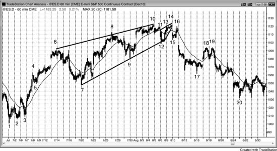

如图 5.1 所示，Emini 60分钟图出现了一个楔形反转顶部，随后形成一个较小的楔形回调至更低高点或双顶，之后走出两段式下跌到K线20。

楔形不需要形状完美也能发挥作用。比如这里的趋势通道线是从K线6高点到K线10高点的最佳拟合线，而K线8的第二次上推高于这条线。市场从K线10反转下跌到K线12后，又形成了一个形状同样不完美的楔形熊旗。三次上推分别是：当天开盘时K线11的高点，然后是K线13和K线14。这个高点略低于K线10的高点，叫它双顶也好、更低高点也好，都无所谓。关键是你能看到这三次明显的上推，以及随后的向下反转。

这也是一个急速与通道多头趋势：先是一波急速上涨到K线4，然后是一段陡峭的通道到K线6。从K线3低点到K线6的走势处于非常窄的通道中，以至于它本身也变成了一个大型急速段。K线7的回调引发了后续的通道，而K线20的抛售回测了这个位置。多头通道有三次推动且呈楔形，这在急速与通道形态中很常见。

**图 5.2** 第一小时楔形

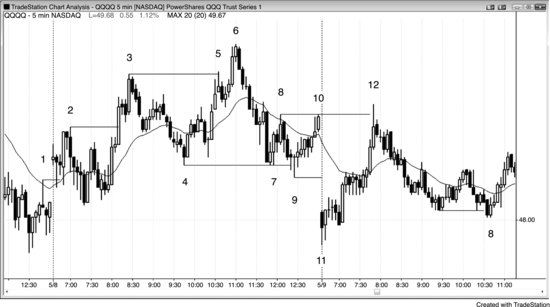

如果三连推走势太陡，通常不是好的反转形态——但在第一个小时内例外，因为有时它能形成开盘反转。如图 5.2 所示，市场从K线11到K线12强劲上涨，走出三次推动。虽然这是一段陡峭的通道，但作为抛物线型楔形开盘反转是可以接受的。K线12向上突破了K线8和K线10构成的双顶，随后出现了一根空头内包K线。K线12既是双顶的失败突破，同时也与K线8或K线10中的任一根形成了双顶。这波上涨到达的价位，是昨天卖方多次介入的区域，认为他们今天可能会在昨日交易区间顶部附近再次出手，这是合理的。

交易区间市场中，押注突破失败是一种不错的策略。做空时，在区间顶部附近的失败K线下方一个 tick 处挂卖出突破单入场；做多时，在区间底部附近的失败突破K线上方一个 tick 处挂买入突破单入场。价格突破任何波段高点或低点——即使它属于更早之前反方向的趋势——都是强势信号，也是潜在的建仓形态。这两天里有大量突破失败和反转的例子，包括趋势线突破失败和趋势通道线突破失败。

K线 2、3 和 6 还构成了一个缩梯形态，这种形态常常带来不错的反转。也可以把它叫做楔形，因为有三次上推（K线 2 和 3 是前两推，从K线 4 算起K线 6 也是第三推）。缩梯形态的特征是第二次突破比第一次小，说明动能正在衰减。这里，K线 3 比K线 2 高出 19 美分，而K线 6 只比K线 3 高出 12 美分。只要出现缩梯形态，交易成功的概率就会提高，通常 (60%+)预示着强趋势中即将展开一段两段式回调。

K线 4 和 7 形成了双底，K线 9 是对这个双底的一次失败突破。K线 4 和 7 是两次下推，K线 9 是第三次下推，因此构成了向上反转，属于楔形底部的一种变体。

**图 5.3** 缩梯形态

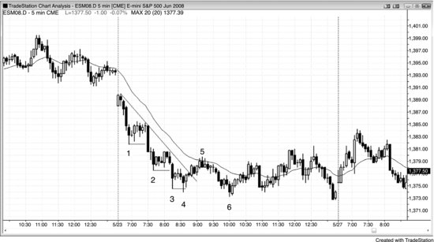

如图 5.3 所示，缩梯形态中每次突破的幅度都比前一次小，表明动能在消退，逆势交易获利的可能性也随之提高。K线 4 这一台阶完成后，价格向K线 5 的运动突破了趋势线，为测试低点和可能 (60%+)的两段式反弹奠定了基础（这个反弹确实在K线 6 创出更低低点并出现两K线反转之后发生了）。动能衰减说明趋势正在走弱，市场的双向博弈成分增加，转入交易区间的可能性更大——这里的走势正是如此。

K线 3 至 5 形成了一个小的楔形熊旗。第一次上推之后，K线 4 创出了更低低点，这是楔形的一种常见变体。随后向K线 5 的上涨包含了另外两次小的上推。K线 4 是一次成功的最终旗形剥头皮，后来这个形态扩展成以K线 5（楔形）结束的更大最终旗形，这种演变很常见。

第一次下推后的回调如果出现强势突破，就会带来一个不确定因素：接下来只会再有两次下推，还是动能强到需要重新开始计数。比如，K线 3 到底是第三次下推，还是应该从向K线 2 的强势下跌处重新开始计数？事后看答案很清楚，但实时交易中没法确定。下跌动能越强，大多数交易员就越可能 (60%+)重新计数，也就越可能 (60%+)出现第四次下推。那次向K线 4 的第四次下推，实际上只是从K线 2 急速下跌开始的楔形底部中的第三次下推。

K线 6 一旦跌破K线 4（楔形底部）的低点，楔形底部就失败了。K线 6 应该像任何其他突破一样来对待。它后面紧跟一根多头反转K线，构成了两K线反转和一次失败突破。有些交易员把这个买入建仓形态看作更低低点的主要趋势反转（MTR），另一些人则把它看作K线 4 楔形底部突破之后的更低低点回调。它同时也是一个缩梯形态买入建仓形态，以及交易区间下方的失败突破。最后，它还是一个小的最终旗形反转（K线 6 之前有一个两K线熊旗）。所有这些理由都足以让交易员考虑在K线 6 之后那根多头K线上方做多。

**图 5.4** 楔形 LH

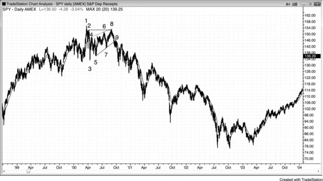

如图 5.4 所示，SPY 日线在 2000 年 3 月见顶，之后三次上推形成了K线 8 的 LH。K线 8 还与K线 2 构成了双顶熊旗（略微超过了K线 2 的高点）。K线 8 没有完全触及虚线画出的空头趋势通道线。这个楔形熊旗之后跟随了一波巨大的多头趋势。形成时并不确定是否正在发生趋势反转，但在K线 1 的三次上推之后，市场至少可能 (60%+)出现两次下推。向K线 3 的下跌是第一次下推，向K线 8 的反弹就是回调，为至少再跌一腿做好了铺垫。虽然多头趋势之后的大多数交易区间在更高时间周期图上只是牛旗，但大多数趋势反转确实来自交易区间。市场通常 (60%+)需要先过渡到双向博弈状态，才会改变方向。价格从K线 8 开始下跌后，更可能 (60%+)在K线 3 低点附近正在发展的交易区间底部找到支撑。但跌破K线 3 的那一腿非常陡峭，显然买家很少，市场必须跌得更深才能找到愿意买入的交易员。强势多头直到 2003 年初双底回调和 HL 的主要趋势反转（MTR）出现后才现身。

**图 5.5** 道指中的楔形 LH

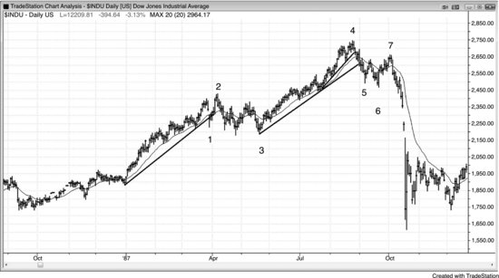

如图5.5所示，道琼斯工业平均指数日线图上，跌破多头趋势线之后出现了一个楔形熊旗的更低高点（LH），最终引发了1987年的大崩盘。下跌到K线6的走势非常强劲，大幅跌破了趋势线和均线。有些交易者把K线5之后的反弹看作楔形熊旗的第一推，然后从K线7之前的三次上推中任取两次作为第二推和第三推。也有人把K线7看作两段式回调形成的更低高点（LH）主要趋势反转（MTR），即一个低2做空入场形态，其中第一段上涨是K线5之后的反弹。还有人把K线7之前的三次小幅上推看作K线6急速上涨之后的一段小通道。大多数交易者会同时看到所有这些因素，只是对每个因素赋予的权重不同。

K线1是楔形牛旗的第一次下推，之后又出现了两次下推，接着是一次小型突破，随后市场回调到K线3形成更高低点（HL）突破回调。有些交易者把K线3与楔形牛旗底部一起看作双底牛旗。很多楔形牛旗其实就是失败的头肩顶，这里正是如此。

K线1抛售之前的那段上涨有四次上推，说明仅凭三次上推本身并不构成反转入场形态。当三次上推处于窄幅多头通道中时，出现第四次甚至第五次上推的概率反而大于反转。到K线4的通道在最后一段中同样有三次上推，也处于窄幅多头通道中。当通道很窄时，空头不应该在第三次上推的反转处做空，而应该先观察空头突破的力度。

K线1是一根强空头急速K线，很多交易者随后在K线2的更高高点（HH）处做空，因为他们把它看作K线1空头突破之后的更高高点（HH）回调。K线1跌破了多头趋势线，因此交易者都在寻找更高高点（HH）或更低高点（LH）来测试多头高点的做空机会。

K线5对多头通道的突破力度足够强，明确跌破了多头趋势线，因此交易者在等待做空突破回调的机会。K线7形成了更低高点（LH），与K线5之后的小幅反弹构成了双顶。多头趋势中的大多数交易区间最终会演变为牛旗，在高时间周期图表上只是回调。虽然市场不一定从K线3处向上反转，但那是最可能的结果，因为K线3位于多头趋势中交易区间的底部。市场也可能从K线2之后形成的更低高点（LH）主要趋势反转（MTR）处继续下跌（那里有双顶熊旗和更低高点），但大多数主要趋势反转之后跟随的是交易区间，而非真正反转为相反方向的趋势。这整个入场形态与K线7处的情况类似，而K线7之后跟随的是一段大幅空头趋势。

**图5.6** 反转恰好未触及趋势通道线

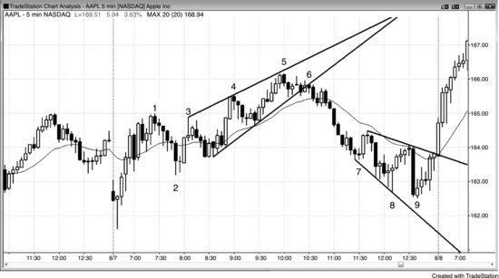

当空头有紧迫感时，他们会在趋势通道线下方就积极做空，因为他们担心市场涨不到趋势通道线上方，不想错过这波下跌。图5.6中，K线3、4、5构成了一个楔形顶，但K线5没有过冲趋势通道线。由于这是一个楔形反转入场形态，更好的做法是等待第二次信号，比如一个更低高点（LH）。K线5和它后面那根K线构成了一个小型空头急速。K线6是高2失败后的二次入场点，也是一段更大的三K线空头急速的起点。经过一根K线的回调之后，又出现了一段五根K线的空头急速，市场急剧下跌进入强空头趋势。由于K线2以来的上涨通道波动幅度很大，存在大量双向交易，所以这个急速与通道的多头走势并不是强趋势。急速阶段是当日低点上涨到K线1的那一段。当存在明显的交易区间特征时，激进的交易者可以在第一次信号就入场，即在K线5处的两K线反转。顺便说一下，楔形顶部的K线1高点本身是一个微型楔形顶，而下跌到K线2的走势与楔形底部构成了双底牛旗，这也是楔形通道的起点。K线2同时也是对当天第一根K线上方突破的回测。

K线7、8、9构成了一个三连推做多入场形态，入场点在K线9多头反转K线上方，尽管收盘价在K线中间位置。这一天明显不是趋势日，因此较弱的反转K线也是合理的。这个形态的两条边界线是发散的，但并非扩张三角形，因为K线8之后的高点低于K线7之后的高点。K线9没有过冲趋势通道线，但在交易区间日里这仍然是一个好的做多入场形态。如果你担心在K线7强烈下跌之后做多风险太大，可以等出现更高低点（HL）后再入场做多。三根K线之后的外包阳线就是一个更高低点（HL），但在外包K线上入场需要反应迅速，因为它们经常快速反转上涨。

K线9前面那根是大阴线，属于一次突破尝试。但下一根K线并没有出现跟随卖盘，反而收成了一根小阳线，构成了一个针对失败突破的做多入场形态。虽然价格跌破了K线8的低点，但此前的上涨包含了五六根连续阳线实体，说明那是一次相当有力的多头突破尝试。这波下跌只是那次多头突破之后一次短暂而猛烈的回调。突破回调有时会形成更低的低点，这里就是如此。永远不要被单独一根大阴线吓到。要把每一根趋势K线都当作一次突破来看待，而且要记住，大多数突破尝试都会失败。

**图 5.7** 抛物线型楔形

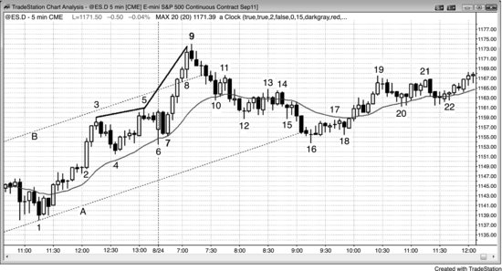

如图 5.7 所示，Emini 在K线5的更高高点处反转下跌，形成了一个交易区间，但随后市场从该区间中强势突破，涨过了多头通道顶部的B线。记住，每一次反转本质上都是对某个形态的失败突破。随后价格在K线9处再次反转下跌，这是第三次上推。楔形的斜率不断加大，因此呈抛物线形态（从K线5到K线9的趋势通道线斜率比从K线3到K线5的斜率更陡）。跟所有楔形顶部一样，出现两段式下跌是大概率事件。

K线9处的强势上涨突破了多头通道上沿（虚线），但在跌至K线10的过程中又回到了通道内部。每当价格突破多头通道上沿后又强势反转回通道内部时，空头波段继续向下突破通道底部的概率大约是 50%，这里正是如此。如果突破要失败，通常会在突破通道后大约 5 根K线内发生（概率 60% 以上），这里也是如此。空头在K线16附近回补了空单，激进的多头也在此处做多。K线16与当日低点K线6形成了双底，而且是价格到达目标位（向下戳穿通道）之后的第一次反转。

K线8前面那根K线的实体比再前面一根更小，说明动能在减弱。K线8本身实体很大。这意味着什么？K线8是在暂停之后重新加速趋势的尝试。很多交易者把K线8的大实体解读为高潮行为，认为之前的暂停很可能（概率 60% 以上）就是上涨中的最终旗形，之后会出现两段式回调。交易者在K线8收盘时卖出，在其高点上方卖出，尤其在K线9收盘时和其低点下方卖出，因为阴线收盘表明卖方正在变强。多头卖出平仓止盈，一些空头做空进行剥头皮，预期在这个小型买入高潮（即小型最终旗形）之后会出现一段较大的回调（大约 5 到 10 根K线）。另一些空头则基于抛物线型楔形做空，打算持仓做波段下跌。

K线16是第二段下跌的底部，K线8是第一段下跌的底部。在更高时间周期的图表上，这就是一个明显的高 2 回调。它同时也是对当日低点的双底测试，当日低点出现在K线6。空头期望这天变成反转日，但多头介入并压倒了空头。收盘前的反弹测试了以K线9结束的那段非常强劲的多头急涨的顶部。虽然反弹力度不强，而且跌至K线8的回调幅度很深，但从日线图来看，这天仍然是一个多头趋势日。

**图 5.8** 多头与空头的抛物线型楔形

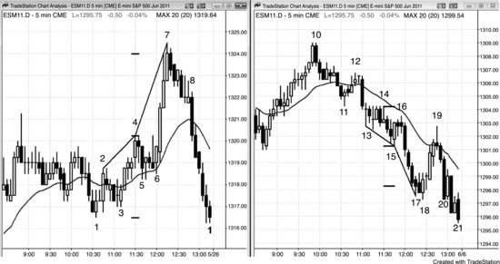

如图 5.8 所示，左图处于交易区间中，在K线4下方触发了一个低 2 做空信号。大多数交易者不会做空这个偏弱的入场形态，因为K线4是一根十字星，而且它前面连续 6 根K线都没有出现阴线实体。K线6形成了一个高 2 做多入场形态（同时也是K线5之后由高 1 和失败的低 2 所构成的突破回调做多入场形态），由此引发了一波强势多头突破。每一段上涨最终都会碰到某个阻力区域——比如测量移动目标位或趋势线——交易者会在那里部分或全部止盈，激进的空头也会在那里做空进行剥头皮。这段上涨超过了测量移动目标位几个 tick，但那个区域很可能（概率 60% 以上）还有其他目标位。多头和空头都只预期会出现回调，双方都计划在回调结束时买入（回调总是在某个支撑位结束，虽然那个支撑位不一定显而易见）。价格之所以在目标位附近停止运动，是因为大部分交易由计算机完成，它们的算法基于数学和逻辑，只在支撑位买入、在阻力位卖出。这些潜在的关键价位，有经验的交易者通常（概率 60% 以上）能看得出来。

从K线4到K线7画出的趋势通道线比从K线2到K线4的趋势通道线更陡，说明上涨走势正以抛物线形态加速。K线7前一根K线有很长的影线，通常意味着在那根K线收盘价买入的交易员只打算做一个向上的剥头皮交易，然后等待回调。K线7的高点是第二次向上推进。下一根K线是空头内包K线，同时也是做空的信号K线。由于K线4的低点2失败之后出现了如此强劲的上涨力道，大多数交易员正确地判断出还会有第二次向上推进——这种情况发生的概率超过60%。随后市场在一个牛旗中回调了六根K线（这里表现为一个空头微型通道），但旗形并没有向上突破，反而在K线8之后的那根K线向下突破。于是这个牛旗就成了上涨行情的最终旗形，它的向下突破构成了一个最终旗形反转，尽管旗形从未出现过向上突破。精明的交易员意识到了这种可能性，在K线7之后那根空头K线的下方做空，也在K线8下方突破时做空。选择第一个入场点的交易员知道成功概率只有大约40%，但他们瞄准的是向下的反转，而且目标回报至少是风险的2倍，因此交易者方程为正。在向下突破时做空的交易员——无论是在那根K线形成过程中、收盘时，还是在随后几根K线收盘时入场——都已经得到了市场正在下跌的确认，因此他们的空头仓位至少有60%的成功概率（对他们来说，只需要回报至少等于风险就够了）。他们用较小的利润空间换取了更高的概率，交易者方程同样为正。

右边的图表是一个抛物线式的楔形底部。K线15是一根强多头反转K线，出现在双底位置，是从低点2最终旗形向上反转的买入建仓形态——该旗形向下突破了K线14。K线14可以看作二次入场的低点2做空，也可以看作前一根K线触发的低点2做空的突破回调，还可以看作三角形做空（三次向上推进分别是：K线13之后第二根十字星的高点、紧随其后的多头内包K线、以及K线14顶部的影线）。空头将K线16视为空头三角形突破后的回调。多头和空头都在K线16下方卖出——K线16是K线15之后的多头入场K线，而K线15是买入信号K线。多头是在平掉多头仓位，空头是在开新的空头仓位。当多头因双底的多头反转做多而被止损出场后，他们往往预期会出现突破和测量移动，至少要等几根K线才会再考虑买入。这就让市场得以快速下跌。

K线17底部有影线，提醒交易员市场可能只剩一次向下推进就会形成回调。它的收盘价也在K线中间位置，使其成为一根反转K线，虽然力度不强。这是急速下跌（一种微型通道）之后的第一次向上反转尝试，而第一次反转尝试通常会失败。果然如预期，K线17上方的卖方多于买方。剥头皮者在K线17收盘时做空，期望在回调开始之前再出现一次小幅向下推进。因为向下可能只有一个剥头皮的空间，所以在下一根K线下方做低点1做空风险较大。市场在K线18形成了一个小双底后转而上涨（K线17是第一次向下推进）。K线18的低点比K线17的收盘价低了4个Tick，所以大多数在K线17收盘价做空的交易员被套住了，他们在K线18上方买回了空头仓位。K线18有一根强多头实体，大多数交易员预期会向上反转到均线附近，甚至可能到K线15的高点。K线15是一个合理的买入信号，因此一些多头在更低的价位加仓，计划在第一次入场价位（即K线15的高点）平掉全部仓位。多头认为反弹可能到达K线16或K线14的高点。K线18的低点处于一个或多个支撑位，尽管图上没有标注出来。

下跌到K线18的走势超过了合理的测量移动目标位，这意味着电脑算法在参考其他因素。大多数测量移动目标位不会直接引发反转，但画出这些目标位仍然有用，因为所有反转都发生在支撑位和阻力位上。当反转恰好出现在这些价位，而且该价位又特别明显时，它就是顺势交易者止盈的好位置，往往也是逆势交易者做反转交易的合理位置。当天的最终低点同样落在某个支撑位上，无论这个支撑位是否明显。K线21的低点比当天早些时候的日内低点低了1个Tick，K线21的收盘价恰好等于当天的开盘价。

因为这段上涨是一个高潮式反转，它大约有60%的概率至少走出两段式上涨并持续10根K线。这也意味着它有40%的概率达不到这些目标。

K线18是一根还算强的买入信号K线，大多数交易者会在它的高点上方入场做多。这样一来，随着市场上涨，愿意继续追买的交易者就变少了。K线18顶部的影线以及随后的十字星都说明多头缺乏紧迫感，意味着这个买入建仓形态并不算特别强。多头一旦未能制造出强势迹象，交易者就会更快选择止盈。K线19上冲到K线18高点上方14个tick，却收成了一根空头K线。这意味着很多多头恰好在3个点的位置止盈了。市场上涨过程中并没有吸引到新的买家，反而在均线附近遭遇了止盈盘，而且距离K线13之后两根K线触发的低点2做空入场的盈亏平衡点仅差两个tick。空头将此视为一次突破回测，差一个tick就打到盈亏平衡止损位，因此认为空头正在积极捍卫自己的止损位。虽然从概率上看，市场回调形成一个HL之后仍有可能（60%+）出现第二段上涨，但大多数多头在K线19期间和下方就已经平掉了多头仓位，只打算等回调时在某根K线的高点上方用突破单重新入场。然而HL始终没有形成，市场跌破了K线17空头急速段的低点，收在了当天的最低价。多头的盈利没有达到入场时的预期，但这种情况经常发生，不足为奇。交易者入场时总有计划，但如果前提条件变了，他们就会调整计划。很多交易最终只赚到比预期少的利润，甚至出现亏损。好的交易者会坦然接受市场给予的一切，然后转向下一笔交易。

交易者对尾盘抛售的可能性格外警惕，因为两天前日线图上刚刚出现了空头突破——而此前市场已经连涨了两年。当日线图上可能（60%+）出现向下反转时，很多交易者会关注尾盘是否出现抛售（就像在多头趋势中关注尾盘是否出现上涨一样）。这使得交易者不愿意在K线19之后市场下跌时用限价单做多。他们非常谨慎，只想等出现反转K线之后再买入。在一个空头日的尾盘抛售中，愿意用限价单接多的交易者太少，HL信号K线始终没有出现。

**图 5.9** 失败的楔形

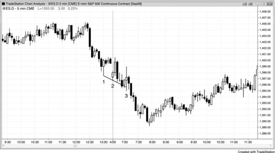

当底部建仓形态出现后市场不涨反而横盘时，说明市场正在接受较低的价格而非拒绝它们，因此市场可能（60%+）处于这段下跌的中间位置而非底部。失败的楔形往往会继续下跌一个测量移动的幅度。

如图5.9所示，市场试图形成一个楔形反转，但K线3是连续第四根与前一根K线大面积重叠的K线。这说明市场是在接受较低的价格而非拒绝它们，因此向上反转不太可能（≤40%）。另外，下降通道很陡，遇到这种情况，通常（60%+）更稳妥的做法是等出现一个HL之后再做多。K线3的入场K线是一根外包阳线，它套住了那些只看到三连推、却忽略了空头趋势通道线陡峭程度的多头。有耐心的交易者不会在这个楔形上买入，因为没有形成HL。

楔形失败时，后续走势通常（60%+）会形成一个大致等于楔形高度的测量移动。这里，K线3下方的跌幅大约等于从K线1之后楔形顶部到K线3低点之间的距离。

**图 5.10** 过于紧凑的楔形

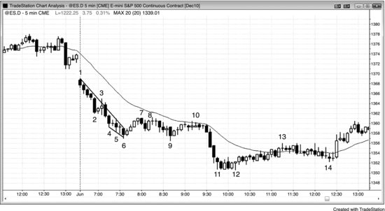

如果楔形底出现在空头趋势的窄通道中，且之前没有多头强势迹象，那就不构成买入建仓形态。如图5.10所示，市场在一个跳空低开日从开盘起就处于空头趋势。过于心急的多头会给自己找理由买入K线6的楔形反转，说服自己这是两段式下跌的终点，而且K线3处出现了趋势线突破。但K线3的趋势线突破是失败的，并不代表多头带着任何动能夺取了市场控制权。K线6楔形的多头入场——在内包K线上方做多——刮一次头皮是可以成功的，但这个建仓形态不太可能（≤40%）演变成更大的行情。下跌到K线6的过程中既没有出现有意义的趋势线突破，也没有向上的动能，因此看起来更像是窄空头通道中由两段较小的下跌组成的一段式下跌。在空头趋势线被突破之后，可能（60%+）还会出现第二段下跌。有些交易者把K线6看作一个楔形的终点：第一次下推是K线2，第二次下推是K线4，最后一次下推是K线6。它同时也是由K线4、5、6组成的、长度为5根K线的微型楔形。由于可以沿这些K线底部画出一条趋势通道线，这个小形态可以被视为一个小楔形，因此它应该表现出楔形的特征——回调应该达到楔形起点附近，也就是制造第一次下推的那根K线的顶部。

随后在K线8处出现了低点2做空机会。这波小反弹确实突破了趋势线，因此多头可以在新低失败时寻找一次向上的刮头皮机会，K线9处正是这种情况。不过，由于缺少强多头反转K线，这笔做多很可能（60%以上）会失败——事实也确实如此。K线10处形成了低点2做空，市场随后向下突破，进入第二段空头腿，最终在K线12处的最终旗形一个tick假突破处结束。K线10处的做空同时也是与K线8构成的双顶，还是EMA 20缺口K线做空入场形态，最终推动了一波趋势恢复的空头走势，一路跌至当日最低点。

**图5.11** 楔形但处于窄通道

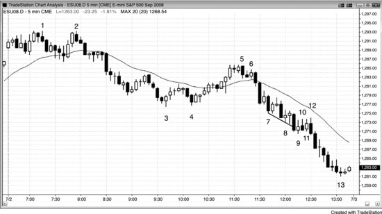

当楔形底出现在窄空头通道中时，它并不是买入信号。如图5.11所示，K线9是趋势通道线过冲反转，也是第三次下推（楔形）。但它并不是一根强信号K线，原因在于：它处于窄空头通道中，与前一根K线重叠过多，收盘也偏弱（多头实体很小）。市场没有明确拒绝过度抛售的迹象，而窄空头通道的第一次突破尝试绝不应该买入，因为大多数在走出足够的刮头皮利润之前就会失败。最好等到二次入场点再考虑买入。强势交易者会在空头通道中前一根K线高点处及其上方做空，根本不会考虑做多。

对于那些在楔形处做多的交易者来说，K线10是一个tick的失败。它是第三根横盘K线，此时聪明的交易者已经意识到这是空头趋势中的交易区间，而交易区间通常（60%以上）是延续形态。K线相互重叠说明市场在接受这些更低的价格，而不是拒绝它们。在空头趋势中做多之前，你需要看到拒绝的信号。仅仅因为觉得"市场该回调了"就去交易，是一种亏钱的思维方式。趋势可以走得比大多数交易者想象的远得多。

交易者可以在K线11处做空低点1，但这里是交易区间，聪明的交易者不会在交易区间低点做空，除非出现更强的多头陷阱。这已经是第二个一个tick的假突破了。而且楔形通常（60%以上）会做出两次反弹尝试（两段式上涨），所以他们只会在楔形失败（即跌破K线9低点）或者第二次反弹尝试失败时才做空。

K线12是连续第三个一个tick的假突破，但这次出现在两段上涨（K线9和K线11）之后，同时也是低点2做空。这是聪明的交易者会选择的第一笔交易，因为它是空头旗形中的低点2做空。这笔交易之所以特别好，是因为两次试图让楔形向上反转的尝试（K线10和K线12）全都失败了。这两次代表了楔形之后的两段上涨，而且明显很弱。另外，连续出现三个一个tick的失败非常罕见，所以接下来的这波走势很可能（60%以上）会有不错的行情。

交易者也可以等到跌破K线9低点时再做空，因为只有到那时楔形才算真正确认失败。突破时的巨大成交量（1分钟图上14,000手合约）证实了许多聪明的交易者确实等到那个时刻才做空。楔形底失败后，通常（60%以上）会走出大约一个测量移动的幅度，这里也是如此。

要做多的话，首先需要一次趋势线突破，最好还伴有反转K线。由于K线9是一根弱反转K线，而你更倾向于在趋势通道线过冲反转之后做多，那么可以等一个二次入场点。K线12确实是二次入场点，但它是在一个四根K线构成的交易区间顶部买入——在空头趋势中绝不应该在空头旗形上方做多。一旦这个弱的二次入场失败，空头就完全掌控了局面。那才是你应该抓住的交易，而不是花太多精力去说服自己那些做多入场形态已经足够好了。

交易者应该在K线2双顶突破后不久就识别出这天是一个趋势性交易区间日。在这类空头趋势日中，通常（60%以上）双向交易都是安全的，但做多属于逆势，所以入场形态必须足够强，比如K线3处和K线4后两根K线处（二次入场点做多）。下跌到K线7的走势是一次突破，但市场并没有形成一个明显的第三个交易区间，而是形成了窄空头通道，然后再次向下突破。这演变为从急速下跌到K线7之后的空头通道。也有交易者把K线2到K线3视为急速阶段，K线5之后的下跌视为通道阶段。具体怎么划分不重要，关键是你能识别出这天是空头趋势日，并且努力保持做空。

顺便说一下，K线2之前波段低点处的三根十字星构成了一个微型楔形。

**图5.12** 连续的一个Tick突破

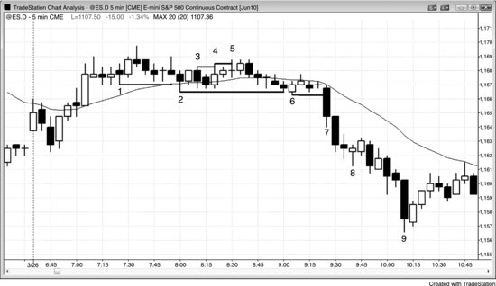

一个tick的突破可能很重要，尤其是连续出现两次时，因为这就构成了一个三连推形态。如图5.12所示，K线4比K线3高一个tick，K线5又比K线4高一个tick。如果之后出现回调或一段横盘，然后市场突破K线5高点，那么很可能（60%以上）会出现向上突破，而这个微型楔形就未能让市场反转。

K线2比K线1低了几个tick，K线6比K线2低了一个tick。再过几根K线后，K线7跌破了K线6的低点，引发了一次向下突破。当市场突破这类微型三连推形态时，通常（60%以上）至少会走出一个测量移动的幅度，以交易区间的顶部到底部作为测量基准。这里的突破走得更远。

K线8是一个微型楔形底，形成了单K线空头旗形。这是市场在暂停的信号，在强空头趋势中它不是反转形态。
