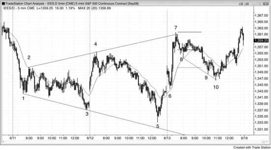
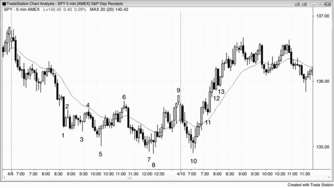
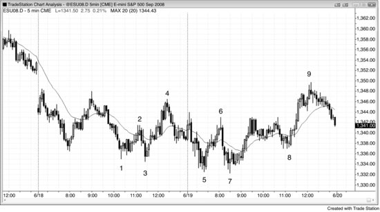

扩散三角形既可以是反转形态，也可以是延续形态，至少由五个波段构成（有时七个，极少数情况下九个），每个波段的幅度都比前一个大。它的力量部分来源于在每一次新的突破中不断套住交易员。因为它本质上是三角形，属于交易区间，而交易区间内大多数突破尝试都会失败——扩散三角形正是这样形成的。以多头反转（扩散三角形底部）为例：市场有足够的力量涨过前一个波段高点，把做多的人套进去；随后崩溃到第三个低点，在LL处把多头套在场外、把空头套进去；接着再次反转上涨，迫使双方都追涨。这个新低点是第三次下推，可以看作三连推形态的一个变体，也可以看作突破回调——市场向上突破了前一个波段高点，然后回调到一个更低的低点。空头反转（扩散三角形顶部）的逻辑正好相反：空头先被LL套进去，然后被迫出场；多头被HH套进去，接着双方不得不追着市场做最后一轮下跌。初始目标是突破到三角形的另一侧，市场到了那里往往会再次尝试反转。如果反转成功，原来的反转就失败了，整个形态就变成了原有趋势方向上的延续形态。

举个例子，如果多头趋势中出现了一个扩散三角形顶部（反转形态），第一个目标是向下突破该形态；大多数情况下，行情也就走到那里。如果突破成功，接下来的下跌目标是一个测量移动，幅度大约等于三角形内最后一段上涨腿的高度。如果突破失败、市场重新向上反转，那么这个三角形就变成了延续形态——在这里就是扩散三角形牛旗，因为它是多头趋势中的三角形。初始目标是创新高，通常行情也就走到那里。如果突破成功，下一个目标是一个向上的测量移动，幅度大约等于三角形内最后一段下跌腿的大小。如果突破失败、市场转而下行，那它就变成了一个更大的扩散三角形顶部，由七个腿构成，而不是最初的五个。到某个时点，要么突破成功、市场走出大约一个测量移动的幅度，要么三角形演变成一个更大的交易区间。

*三角形*这个叫法其实容易让人误解，因为这种形态往往看起来根本不像三角形。关键在于：它是一系列幅度越来越大的HH和LL，不断套住突破交易员，直到他们最终认输——这时所有交易员都站到了同一边，趋势由此产生。它有三次推动，可以看作三连推反转形态的一个变体，只不过回调幅度很深。比如在空头趋势底部的多头反转中，两次回调都形成了HH；但在传统的三连推形态中，比如楔形底（一种向下收缩的三角形），两次回调形成的是LH（也就是说，不是一种扩散形态）。

所有扩散三角形都是主要趋势反转（MTR）的变体，因为最终的反转总是跟在一段强势腿之后。以扩散三角形底部为例：从最终低点展开的反弹，接续的是此前一波强到足以涨过前一个波段高点的反弹，而那波反弹必然突破了某条重要的空头趋势线。至少，从第二次下推低点起步的反弹会突破包含第二段下跌腿的空头趋势线，因此第三次下推就是一个LL处的主要趋势反转（MTR）做多建仓形态。第一段或第二段上涨腿通常也会突破其他某条主要空头趋势线。

**图 6.1** Emini 中的扩散三角形底部

空头趋势中的扩散三角形底部，后来往往会试图演变成扩散三角形熊旗。在图 6.1 中，Emini 从K线 6 的缺口回调——对均线及前一日收盘价的测试——处展开开盘反转上涨。前一日低点位于K线 5，它与K线 1、2、3、4 一起构成了一个扩散三角形底部。这是一个反转形态，因为三角形出现之前趋势是下行的。第一个目标是创出新的波段高点，市场在K线 7 处达到了这一目标。随后市场通常会试图形成扩散三角形熊旗——这是一种延续形态，因为它是空头趋势中的交易区间。K线 7 过冲了多头趋势通道线，三角形由K线 2、3、4、5 和 7 构成，市场在此完成了这一尝试。趋势通道线的失败突破之后，尤其当存在扩散三角形时，通常会出现两段式下跌。顺便说一下，扩散三角形不一定形状完美，也不一定要触及趋势通道线（K线 5 就没有触及）。

上涨到K线7的那段走势非常强劲，但当时的背景下，交易区间顶部出现的低2做空入场形态值得尝试。K线8是连续第二根十字星，十字星代表多空平衡。既然双方势均力敌，这个平衡点往往就是下跌段的中点，由此可以大致估算市场还需要再跌多少，才能积聚足够的买压把价格推回去。K线9处目标达成，但市场并没有马上反弹，而是在价格过冲空头趋势通道线之后，直到K线10的楔形牛旗信号K线处才开始反转上行。K线10同时也是对K线6信号K线上方原始多头入场点的精确回测，精准到一个tick（完美的突破回测）。

**图 6.2** 扩展三角形底部反转

扩展三角形反转形态的特征是低点不断下移、高点不断上移。反转前通常有5个转折，但有时会有7个，如图6.2所示的SPY 5分钟图。每一段腿通常都有合理的剥头皮理由（比如每一段都是交易区间内新的波段高点或低点），但第5段腿完成之后，可能发展出较大的趋势，此时明智的做法是对部分仓位做波段交易。另外，一旦该形态完成，通常会在反方向构建出另一个扩展三角形。如果第一个是反转形态，那么随后反方向的那个（如果出现的话）就是延续形态，反之亦然。

K线5是第5段腿（K线1是第1段），因此构成至少两段上涨的做多入场形态。但K线6是一个突破失败的做空入场形态，也是一个小楔形（它是K线5急速上涨之后通道中三次小推动的第三次）。这就形成了一个扩展三角形熊旗，其中5个波段的第一个是K线2。

第7段腿在K线8处出现了二次入场点。K线7是新低处的第一个入场形态，但它失败了——这在预料之中，因为入场发生在铁丝网形态中，大多数交易员会等待第二次信号。K线8同时也是K线6急速下跌之后小型空头通道中的高3做多入场形态，第三次下推往往意味着急速与通道的空头趋势形态即将结束。

K线10测试了K线8的低点，但低了一个tick。它类似于扩展三角形的第9段腿（在交易中，"类似"通常就够了）。作为对前一天低点的双底测试，再加上交易区间底部的高2做多入场形态，这是一个不错的开盘反转做多入场。

K线11是突破回调——价格向上突破了开盘高点，尽管没有突破K线9即三角形的高点。它是强劲的5根K线多头急速走势之后的高1做多信号，处于可能形成新多头趋势的背景中，因此是可靠的做多入场形态。

K线12是交易区间顶部（扩展三角形本质上是交易区间）的低2，在SPY图上也是仅差一个tick的空头突破失败。但在Emini图上（未显示），价格守住了反转K线的低点，并未触发该形态。Emini给出的假信号更少，因为它的每个tick相当于SPY的2.5个tick。由于多头动能足够强，可能正在形成多头趋势，交易员应该等到出现更低高点之后再考虑做空。

K线13是K线9上方突破失败做空的二次入场点，但在此前的上涨中同样没有出现趋势线被跌破的情况，所以在缺乏早期空头力量的前提下贸然做空并不明智。空头应该等到出现更低高点之后再做空。

K线12和K线13并不是突破失败，而是新多头趋势中的突破回调。

**图 6.3** 扩展三角形反转中的二次入场

如图6.3所示，K线1到K线5构成了扩展三角形底部的5段腿。入场点在K线5更低低点上方一个tick处。K线6未能突破K线4的高点，随即跌至新低。K线7是扩展三角形的二次入场机会，但由于K线5和K线7之间间隔了太多K线，三角形的影响力已经减弱，此时它实际上只是当日新低处的双底反转。

K线8形成了一个更高低点，同时也是基于K线5和K线7双底的双底回调做多入场。

价格到达新波段高点的目标后，K线9构成了一个扩展三角形熊旗（由K线2、3、4、7和9组成），做空目标是K线7低点下方。不过，这些越来越大的三角形最终会有一个失败，然后趋势开始。顺带一提，第二天开盘市场向下跳空，跌破了K线7，达到了目标。但比例关系不太好——K线4和K线9之间的间距远大于K线2和K线4之间的间距。形态越不规则，信任它的交易员就越少，形态的力量也随之减弱。尽管如此，交易员仍然会把K线9视为空头交易区间的顶部、与前一天高点形成的双顶熊旗、以及对前一天高点上方缺口的测试——这些理由足以支持做空。
