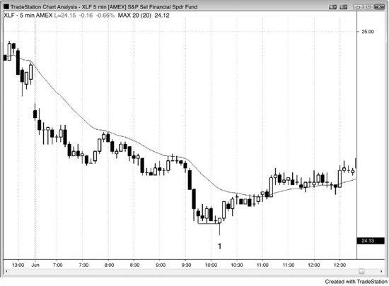
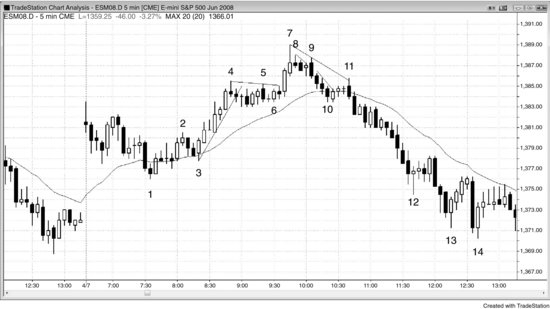
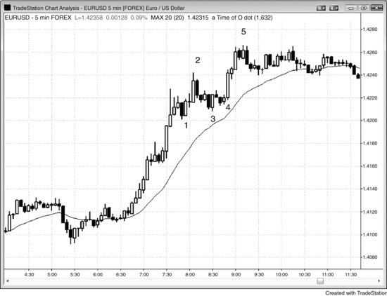
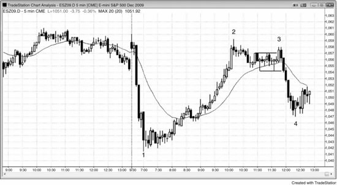
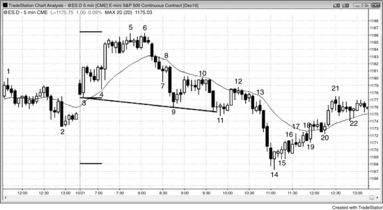
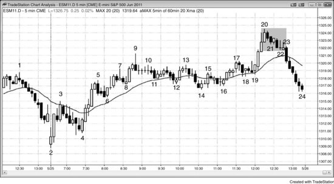
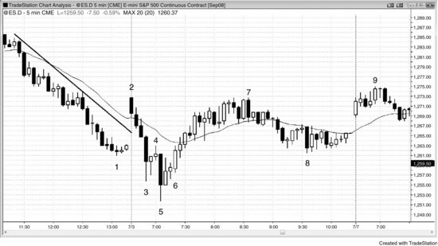
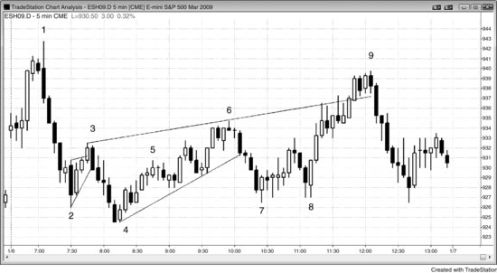
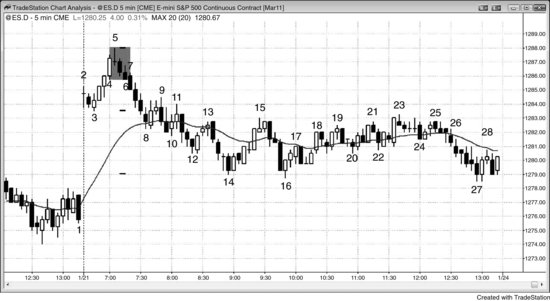
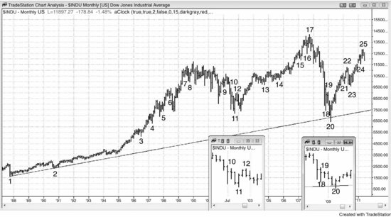

趋势结束后回头看图表，交易员总能找到那个趋势中的最终旗形。最终旗形反转非常常见，因为每一次反转都发生在某种旗形之后，本质上都属于最终旗形反转。如果交易员能判断出哪些旗形大概率（60%+）是趋势反转前的最后一面旗形，就能提前预判并交易趋势反转。

以下是最终旗形常见的几个特征：

- 旗形出现在已经持续了几十根K线的趋势中，此时顺势交易员大概率（60%+）开始止盈，逆势交易员也变得更加激进。双方都认为趋势已经走过头了，因此容易出现一次较大的两段式回调，进而演变成更大的交易区间甚至反转。
- 旗形基本呈横盘状态，并且表现出强烈的双边交易特征，比如出现多根反方向的趋势K线、带有明显影线的K线、多次反转，以及与前一根K线重叠50%以上的K线。关于双边交易的更多信号，参见第二册第四部分交易区间的相关内容。
- 微型趋势线的突破回调属于单根K线或微型最终旗形的情况。举例来说，价格向上突破空头微型趋势线后又掉头向下，那一两根K线的突破往往成为这段微型空头趋势中的最终熊旗。如果这波下跌在一两根K线内就失败了，随后市场从一个更低低点、双底或更高低点处反转向上，那么最后这波下跌就是突破回调，而最初那次小突破就成了微型空头趋势中的最终旗形。如果最终旗形突破后虽然出现了反转，但只回调了几根K线就恢复了原趋势，那这次回调就只是持续趋势中的突破回调而非反转，说明最终旗形未能让市场反转。
- 最终旗形有时只带来短暂反转，随后形成一个更大的旗形，而这个更大的旗形大概率（60%+）向任一方向突破。通常（60%+）交易员能在最终旗形反转入场后先赚到剥头皮利润，之后形态才继续演变，而演变后的形态一般（60%+）会在某个方向再给出一个信号。
- 有时会出现两个连续的横盘旗形，第二个比第一个更小，第二个旗形突破后大概率（60%+）引发一次楔形反转。
- 如果最终旗形出现在高潮之后，失败的突破大概率（60%+）不会超过前一个趋势极值。比如出现一次空头高潮，随后在低点上方形成一个横盘交易区间，这个区间就大概率（60%+）成为最终旗形，突破后从一个更高低点或更低低点处反转向上。
- 有时最终旗形只有一两根K线，出现在一波由数根异常大的趋势K线组成的强劲急速走势之后（大概率（60%+）属于衰竭性高潮）。这个小旗形被突破后往往在一两根K线内就反转，通常（60%+）引发一波持续十根K线以上的两段式回调。这是一个可交易的逆势建仓形态，但不会可靠地带来趋势反转。那些大趋势K线所展示的强劲动能，往往在十到二十根K线内还会再测试一次趋势极值。这种单根K线的最终旗形可以是任何类型的暂停K线。例如，市场刚刚经历了两波连续的卖出高潮，下一根K线是一根多头十字星，即使它的低点低于卖出高潮的低点，这根十字星也可以成为空头趋势中的最终旗形。如果紧接着的一两根K线形成一波大幅空头急速走势，然后市场反转向上，那根暂停K线就是单根K线的最终旗形。
- 窄交易区间经常成为最终旗形。任何横盘走势都具有磁力效应，由于突破通常（60%+）会失败，市场往往被拉回到多空双方都认为有价值的区间内。
- 有时根本没有突破，最终旗形直接发展成一段新趋势。这种情况经常发生在连续高潮之后的反转中。
- 交易员看到市场走过头了，预期很快会回调，但又觉得突破还能走出足够的空间来做一笔剥头皮交易。于是他们在潜在最终旗形突破时入场，但打算入场后尽快离场，而不愿持仓做波段。由于所有人都只想赚一小段利润，突破很快就反转了。

回看任何一张出现趋势反转的图表，你会发现趋势由一系列急速走势和回调组成，这些回调就是旗形。仔细研究趋势中的最终旗形，你会发现它早已给出趋势即将结束的线索——要么变成交易区间，要么变成反向趋势。交易区间内大概率（60%+）出现幅度很大的腿，看起来像是趋势反转，但在更高时间周期的图表上通常（60%+）只是一次较大的回调。不过，这些腿一般足够大，可以做一笔有利可图的波段交易。交易员无法确定反转会演变成新趋势还是大幅回调，但两种情况的交易方式是一样的：在第一腿或第二腿之后部分或全部止盈，然后在回调时寻找加仓机会。如果原趋势方向出现了一波强劲走势，他们大概率（60%+）会继续持仓，等待市场重新测试原趋势的极值。

每一次回调都包含多空双方的交易，但如果回调基本上是横向的，多数K线大幅重叠，区间内出现多次反转，而且有好几根K线的实体方向与趋势相反，那么多空双方的交锋就格外明显。最终旗形可以是任何规模的交易区间，小到只有一根K线，但通常至少包含五到十根K线。多空双方的交易意味着多头和空头都认为当前价位有价值，值得入场。空头在积极做空，因为他们相信交易区间会向下突破；多头在积极买入，因为他们相信突破方向会向上。每当价格漂移到交易区间顶部，或者向上突破后连续走了几根K线，空头就觉得价格更划算，做空力度加大；多头则觉得区间顶部有点贵，买入量随之减少。结果就是空头把价格推了回去。当价格跌到区间底部或向下突破时，情况恰好相反——多头认为价值更好，而空头觉得价格太低，不值得大举做空。于是市场重新回到区间中部。所有交易区间都在重复这个过程，牛旗和熊旗也不例外，结果就是交易区间中部存在一种磁吸效应，大多数突破尝试走不远就被拉回区间之内。

当一个横盘旗形出现在趋势已经持续了几十根K线之后，它往往会成为这段趋势的最终旗形。突破之后，顺势交易者更愿意止盈，等待深度回调再重新入场；逆势交易者则会押注这次趋势恢复的尝试会失败，因为他们预期至少会出现一个两段式回调。举例来说，如果一段多头趋势已经持续了几十根K线，很可能（概率60%以上）已经准备好迎接更大的回调甚至反转，交易者会关注它是否形成一个基本水平的牛旗。由于多头趋势仍然有效，交易者愿意买入突破，但只打算做剥头皮，而不是波段交易。在旗形阶段做空的空头会平掉空仓，他们的买入推动了上涨。但一旦市场触及某个阻力位——可能是他们认为多头会剥头皮出场的某个固定tick数，也可能是某个测量移动目标——他们就急于再次做空。多头在入场后很快就以小利平掉了多仓。激进的空头看到了同样的信号，在多头卖出的同一位置开始做空。此时多头和空头都预期价格走低，没人再买入，市场至少会出现一次剥头皮级别的反转下跌。如果下跌力度很强，多头不愿买入，空头也不急着止盈，直到出现回调即将结束的迹象。这次反转可能只是一个回调，也可能是更大的修正（比如交易区间），或者是趋势反转。

正如第3章关于双底和双顶的讨论中提到的，最终旗形背后的驱动力本质上是一样的。举例来说，假如多头趋势中出现了一个潜在的最终旗形，那么在旗形形成之前有一波上推。旗形的向上突破是对那个多头高点的测试。如果在市场向上测试时卖方多于买方，市场就会从这第二次上推处反转下跌。虽然底层动力相同，但最终旗形在外观上有明显差异，而且具备几个独特的特征，值得将它归为一个独立的形态。空头趋势中的最终旗形也是如此，本质上就是两波下跌之后的一次向上反转。最终旗形的空头突破就是第二波下跌，也是对导致最终旗形形成的那段空头趋势强度的测试。

很多多头和空头会在牛旗的多头突破后不久就卖出，如果卖出的人足够多，市场就会开始反转。一旦出现空头反转建仓形态，交易者会更加确信将有更大的回调；更多多头会平掉多仓，更多空头会开始做空。如果反转在空头反转K线下方一个tick处向下触发，市场就会被拉回那个最终旗形之内。市场可能就此停住，但通常至少会形成一个两段式横盘到下跌的回调，经常还会演变为趋势反转。如果旗形内（或更早）出现过一段强烈的空头腿——这是抛压的信号——而且这段下跌远远跌破了多头趋势线，那么趋势反转的概率就更大。如果原始趋势持续了五十到一百根K线，那么这次反转更可能演变成一个大型交易区间，而不是方向相反的趋势。记住，趋势具有巨大的惯性，倾向于抵抗所有反转尝试。不过，每一次反转尝试往往比前一次更大，最终会有一次成功地将趋势反转为相反方向的趋势。

持续很长的高潮走势，往往在短暂的最终旗形突破之后结束。举个例子，假如出现了一个由4根K线组成的强多头急速段，每根实体都很大，而且第4根异常大，这通常会引发短暂的抛压，因为交易者会把这段急速走势视为一个潜在的买入高潮。多头和空头都在等这样的大K线出现。多头会趁着强势高价先止盈一部分，激进的空头则会做空，做一波逆势剥头皮。结果往往是出现一段回调。不过，由于多头急速段非常强，通常在前一根K线低点附近或下方就会有强劲的买盘入场，概率在60%以上。多头在买回之前减掉的仓位，空头则在回补他们的剥头皮空单。结果就是回调只持续一到几根K线，形成一个高1或高2的买入建仓形态。多头会在前一根K线高点上方买入，也有很多人会在市场突破原来那段多头急速段顶部时跟进买入。

由于旗形跟在一段很可能涨得太远太快的强多头急速段之后（概率60%以上），很多交易者只会把这次牛旗突破当作一次剥头皮来做。他们会很快止盈，拿到剥头皮利润就走。他们的止盈加上激进空头的做空，可能会在牛旗突破仅仅一到两根K线之后就把市场压回去。这段短暂的突破通常由一根或多根强多头趋势K线构成，因此本身又构成了一个潜在的买入高潮。如果足够多的交易者把这看成连续的买入高潮——原来那段多头急速段是第一个——那么很多人只会等至少出现两段式、大约持续10根K线的回调之后才考虑再次买入。很多人会做空，因为他们预期会出现更大的回调。如果下跌反转发生在一个重要的阻力位，很多交易者会把整个上涨看作一次买入真空效应对阻力位的测试，并开始考虑趋势反转的可能性。他们会观察下跌走势的力度。如果下跌缓慢而疲弱，交易者会预期它只是一段回调，多头趋势不久就会恢复。如果下跌中出现了很多空头实体K线，交易者就不太愿意买入，市场就必须继续下探，才能找到愿意接手的买家。有时候市场会直接进入空头趋势，即使原来的多头急速段非常强、最终旗形只有一根K线，也可能发生这种情况。很多反转发生在第二次上推之后，本质上形成了一个双顶。两个顶部的价格往往不同，要么形成更高高点，要么形成更低高点，但合在一起就像双顶一样运作。应该始终把它们视为同一种价格行为的不同表现形式。

当市场处于强急速走势中，然后出现一根带影线或反向实体的K线时，交易者通常预期还会有最后一小段顺势推进，之后才出现回调。举个例子，假如出现了一个强空头急速段，由4根连续的大空头趋势K线组成，基本都收在低点附近，很多交易者会在每根K线收盘附近做空。如果下一根K线底部出现一根大影线，或者出现了一根多头实体，空头趋势仍然完好，但交易者会认为回调即将到来。很多人还是会在这根K线收盘时做空，但只准备做一次剥头皮，因为他们预期这会是急速段里最后一笔剥头皮交易。正因为他们觉得这是最后一笔，之后他们不会再考虑做空，除非至少出现一段小回调。当没有人愿意继续在急速段底部卖出时，市场就会上涨，去寻找一个足够高、让空头愿意再次做空的价格。激进的多头深知这一点，会在急速段底部精准买入——也就是他们判断空头即将回补最后一笔剥头皮空单的位置。多头和空头同时买入，市场就会上涨。这段上涨通常至少够多头剥头皮出场（概率60%以上），但也可能持续5到10根K线。因为这是强空头急速段之后的第一次回调，上方会有卖家等着。多头和空头都会在市场涨过前一根K线高点时卖出，也会因为任何其他小理由卖出，因为双方都有信心：回调很快结束的概率很高。多头和空头同时卖出的结果是，至少还会再有一段下推，而且这段下跌可能演变成一个通道，达到以急速段高度为基准的测量移动目标。另一个极端的可能是，它只是一次最终旗形突破，随后引发向上的反转。那么这个5根K线的空头急速段跟最终旗形有什么关系呢？底部那根带影线或多头实体的K线告诉交易者，还会有最后一段下推才出现回调，而且下推幅度够做一次剥头皮，但市场很可能很快就会反转上涨（概率60%以上）。这意味着交易者把那根影线或多头实体看作一个微型最终旗形，在更低时间周期的图表上它肯定就是一个最终旗形。交易者不需要去看更低时间周期的图表来验证这一点，因为他们知道必然如此——否则那根影线或多头实体根本不会形成。

最终牛旗有三种突破方式。第一种，突破力度足够强，价格冲破前一段多头趋势的高点，然后市场以 HH 反转的形式掉头向下。第二种，突破力度较弱，市场在前高下方就开始向下反转，形成 LH 反转。第三种，几乎没有像样的向上突破，甚至根本没有突破。比如，牛旗可能形成了一个高 2 或高 3 买入信号，但入场K线在信号K线高点上方仅走了一两个 Tick 就反转向下；也可能直接向下突破，始终未能突破前一根K线的高点。如果牛旗向下突破，通常（60%以上的概率）会先出现一段急速下跌，随后跟着一段空头通道，延伸出某种测量移动的幅度。如果没有明确的突破，牛旗只是不断扩展为更大的空头通道，到一定程度后交易者就会放弃牛旗的假设，转而把这个通道视为空头趋势。出现这种情况时，通常（60%以上的概率）起点至少会有一根空头急速K线。当那根空头趋势K线形成时，有经验的交易者会判断它是否强到足以引发一段空头通道；如果判断成立，很多人会在前几根K线高点上方做空，以防空头趋势真的展开。这个牛旗虽然从未向上突破，但它就是多头趋势中的最终旗形。

对于任何牛旗，回调买入的交易者都会寻求在趋势极端点——也就是最近的高点——附近出场。他们更愿意在前高上方止盈，但会密切关注市场是否在前高下方停滞。一旦发现停滞，就会迅速止盈，只有等到再次回调时才会重新买入。他们的卖出行为，加上至少要等几根K线出现回调才肯再次买入的态度，导致形成的是 LH 而非 HH。由于剥头皮交易者通常（60%以上的概率）会在前高附近及上方止盈，多头趋势中大多数新高都会遇到获利了结的卖盘，而非新买盘。这导致大部分新高之后跟随的是回调，而非持续突破并形成新的上涨腿。不过，由于大多数反转尝试都会失败，多数新高并不会导致趋势反转进入空头。反转走势看起来往往很强，但通常（60%以上的概率）只是又一个牛旗。多头会在回调时买入，空头会在剥头皮做空获利后平仓，市场会再次测试高点。最终，其中某一个回调会成为最终牛旗，之后跟随更大幅度的回调或反转；如果有迹象表明这即将发生，有经验的交易者就会做空。

同理，空头趋势中的最终旗形也可以在向下突破后从 LL 或 HL 处反转向上，也可以直接向上突破而从未向下突破。可能出现低 2 或低 3 做空失败的情况，然后市场以一根大的多头趋势K线的形式反转向上。这根多头急速K线成为新一轮多头波段的起点，于是那个熊旗就被认定为空头趋势的最终旗形，尽管它从未向下突破。多头突破说明交易者认为 Always-in 方向已经从做空翻转为做多。

如果有理由认为一段空头波段可能即将结束，而市场开始形成熊旗，交易者可能会认为从这个熊旗发出的低 1 或低 2 做空入场会失败。如果他们预期这个熊旗不会有显著的向下突破，反而会套住空头然后向上突破，就可以反向做多来对抗低 1 和低 2 做空形态。比如，在一个交易区间日中出现了楔形底并开始反转向上，交易者会预期楔形低点能够守住。既然他们认为趋势可能已经转为上涨，就会想在回调时买入。回调可以小到只有一根K线。因为大概率（60%以上）会有两段上涨，第一段回调不会走太远。那个低 1 做空应该会失败，成为新多头腿中的一个小 HL 回调。这些多头会预期至少出现一轮持续十根K线以上的两段式上涨。低 1 做空只有在强空头趋势的急速阶段才是可靠的，在反转形态之后绝不可靠。那个低 1 做空入场很可能不会跌破楔形低点，反而会在两段式向上回调中形成一个小 HL。正因如此，交易者会挂限价单，在那根做空信号K线的低点或低一到三个 Tick 处买入，预期形成一个小 HL，而不是一笔获利的低 1 做空。在 Emini 中，他们通常（60%以上的概率）只需冒四个 Tick 的风险。

随着向上反转的延续，交易者可能会想到低 2 做空建仓形态有可能形成。但既然他们认为趋势已经反转为多头趋势，就会预期这个低 2 同样会失败，之后价格继续走高。他们仍然处于逢回调买入的模式，低 2 这样的小幅回调也包括在内。这时他们同样会挂限价单，在低 2 信号K线的低点或更低位置买入，在 Emini 上大约承担 4 个 tick 的风险。他们预期这个熊旗向下突破不会超过几个 tick，反而期待市场继续上行，逐渐走出一个多头通道。这就是一种最终熊旗——因为它是空头趋势中最后一个旗形。空头原本把它当作熊旗，但只能把价格打到空头信号K线下方一两个 tick，随后这个旗形持续向右上方延伸，直到交易者意识到它已经变成了多头通道。当足够多的交易者看清这一点后，空头开始回补，通常会出现一轮向上突破（概率 60% 以上），接着是一段测量移动上涨。

一旦空头认为市场已经到达交易区间的顶部，或者多头趋势正在向下反转，他们就会寻找高 1 和高 2 信号K线，并在这些K线的高点或略高位置挂限价单做空。他们要做的是逢涨卖出，哪怕只是高 1 或高 2 这样非常小幅的反弹也不放过。与之相反，多头会在交易区间底部以及空头趋势底部寻找低 1 和低 2 的入场机会，前提是他们判断市场正在向上反转为一波多头波段。

如果高 2 很可能失败（概率 60% 以上），那它为什么还会被触发呢？原因在于空头更倾向于在K线高点上方做空，而不太愿意在紧贴高点下方的位置做空。他们在前一根K线高点及其上方挂了限价空单。由于高点下方缺少愿意做空的空头，多头在这一带几乎没有阻力，能够把价格推到前一根K线高点之上，期望大量多头以买入突破单跟进。前一根K线的高点就像一块磁铁，价格突破高点的过程是一种微型买入真空效应。然而多头随即发现，那里有大量空头等着做空，同时还有不少更早在低位买入的多头正在止盈。结果就是：高 2 虽然触发了，市场却马上掉头向下。那些在最近几个 tick 里买入的多头很快发现，价格并没有在前一根K线高点上方继续上涨。因为市场没有按预期走，他们立刻平仓退出，并且至少在接下来几根K线内不会再考虑买入。他们平仓卖出多头头寸的行为进一步加剧了这波下跌。

如果最终旗形反转被触发，但在随后一两根K线内失败了，这就变成了一个*失败的*最终旗形。失败的最终旗形是原有趋势恢复的建仓形态，本质上就是突破回调。市场突破了潜在的最终旗形之后试图反转，但只是小幅回撤，随后趋势恢复而非真正反转。举个例子：市场处于多头趋势中，出现了一个潜在的最终牛旗，价格向上突破后开始向下反转，但做空的入场K线很快变成了一根强多头反转K线——这就是一个做多的突破回调建仓形态。那根多头反转K线是对潜在最终旗形突破之后的回调，如果多头趋势走得足够远，价格就会脱离最终旗形的磁力吸引，交易者会转而关注其他形态。如果上涨只持续了一两根K线就再次掉头向下，那就构成了基于原来那个潜在最终旗形的二次入场做空机会。如果这次反转成功，那它就是最终旗形反转；如果又失败、市场再度上涨，那么市场很可能处于多头通道之中（概率 60% 以上），而通道可以持续很多根K线。

**图 7.1** 最终旗形反转

空头趋势持续很长时间之后出现的卖出高潮，后面往往跟着最终旗形反转和至少两段式的上涨。在图 7.1 中，K线 1 结束了自开盘以来的两段下跌，因此可能是当天的低点。它突破了一个经过长时间运行后形成的横盘熊旗，所以这里可能是最终旗形，有望引发向上反转。K线 1 是一根不错的反转K线，触发了最终旗形的做多入场，让交易者预期至少出现两段上涨。一些最好的反转出现在反转后的第一段上涨延伸到最终旗形上方的时候——这里正是如此。之后通常会在旧熊旗上方形成一个横盘旗形（概率 60% 以上），然后新的多头趋势继续。有时只是短暂回调到旧熊旗区域，有时新的多头腿根本没有停顿，直接以一系列多头趋势K线构成强劲的急速拉升。看到这种反转时，把部分或全部仓位留作波段交易很重要，因为获得超额利润的概率相当大。

大约在太平洋时间早上 7:30 到 9:30 之间，市场经历了两个小时的双向横盘交易，形成了一个较大的交易区间，构成了一个较大的最终旗形。双向交易会产生磁力效应，突破之后往往会把价格拉回这个区域。

K线 1 之后的入场K线收盘价突破了前 6 根K线的高点，同时也高于之前 7 根K线的收盘价，因此反转了多个高点和收盘价。在那几根K线上做空的交易员，要么已经回补空头，要么正持有亏损仓位，很快也会止损离场。而且，他们至少在接下来几根K线内不会再考虑做空，大部分人会等到出现至少两段式上涨后才会重新考虑做空。这使得市场变成单边格局，通常会带来至少 10 根K线、两段式的上涨。

**图 7.2** 窄交易区间作为最终旗形

上涨之后出现窄交易区间，往往会演变成最终牛旗。在图 7.2 中，K线 4 向上突破开盘价时势头很强，随后形成了一个窄交易区间。这里，旗形的强势突破在K线 7 结束，构成了一个两段式上涨（K线 5 是第一段），同时也是一个楔形顶（当天第一根K线是第一推，K线 4 是第二推）。从旗形中走出的两段式移动经常会构建出主要趋势反转（MTR），这种反转通常至少包含两段下跌。下跌到K线 10 的走势分为两段，但只有一根逆势K线（K线 9），说明这很可能只是两段更大下跌中的第一段。当两段式移动处于窄通道中时，整个通道通常会成为第一段。无论如何，如果做空的交易员没有把握，可以在价格跌到均线附近的K线 10 时，把止损移到盈亏平衡点。

K线 9 上穿了前面那根小多头十字星的高点，触发了一个高 1 买入信号，但有经验的交易员预计，在买入高潮和最终旗形顶之后，这个信号会失败。K线 8 和它后面的两根K线构成了一个更小的最终旗形，K线 9 是这个三K线最终旗形向上的失败突破。出现了一个微型买入真空效应，把价格吸到那根高 1 信号K线高点上方 1 到 2 个 Tick 的位置。强势空头预期高 1 会失败，等着在信号K线高点或上方做空。因此，很多空头在价格还差信号K线高点 1 到 2 个 Tick 时暂停做空，这种没人愿意卖出的状态把价格进一步吸高，去寻找空头。一旦价格到达他们的目标位——信号K线高点及略上方——空头就开始积极做空，压倒多头，把价格打下去。在高 1 信号K线高点及上方买入的多头，立刻看到市场停滞并开始反转，于是卖出多头仓位，加速了下跌。他们确信短期顶部已经形成，至少在接下来几根K线内不会再考虑买入。买家消失后，价格快速跌到均线支撑位和最终旗形（从K线 4 开始的那个交易区间）的中部，空头会在这里回补部分仓位，多头也会重新开始买入。但由于抛售力度很强，买家寥寥无几，市场无法反弹。这些买家很快变成了卖家——多头卖出刚建的多头仓位，空头再次做空——价格继续下跌，去寻找足够低、能吸引买家的价位。

K线 10 和它后面一根K线在均线处形成了两K线反转高 2 买入信号。有经验的交易员不会买入这个高 2，因为它前面有 4 根强空头趋势K线（一个微型通道）。K线 11 是高 2 牛旗失败突破的信号K线，这是一种常见情况。有些多头把从K线 7 高点到均线的回调看作牛旗。但一旦市场跌破K线 10，多头就放弃了这个想法，认为市场可能还要再下跌大约一个测量移动的幅度，走出两段下跌后才会形成新的买入建仓形态。K线 11 和下一根K线构成两K线空头急速之后，紧跟着一段空头通道。事后来看，K线 4 的交易区间成了K线 1 上涨过程中的最终旗形，但聪明的交易者会提前预判到这种可能性，并将部分空头仓位做波段持有。K线 9 前面那根K线也是一个最终牛旗，K线 10 之后两根K线触发的高 2 同样如此。

K线 2 的低 2 也是类似的情况。空头把它看作开盘下跌中的熊旗，可能是一个更低高点和空头趋势的起点，至少也是潜在交易区间的顶部。一旦做空被触发、随后市场又涨过了K线 2 的高点，空头就知道自己判断错了。熊旗失败了，空头预期会出现至少两段、大约一个测量移动幅度的上涨。

K线 7 也是当天的第三推——当天第一根K线是缺口急速上涨，K线 4 是楔形通道中的第二推，楔形在K线 7 处结束。

K线9上破前面那根多头K线时，市场正试图构成一个失败的最终旗形——也就是一个突破回调做多建仓形态。但问题在于，这根潜在的做多信号K线以及之前三根K线中的两根都带有明显的影线，空头会把保护性止损一直挂在K线8信号K线高点上方，等市场跌下去再说。一旦K线9收出一根强空头趋势K线，空头就会把止损移到K线9高点上方。这是一个弱的高1做多建仓形态，大概率（60%+）会失败，所以它根本算不上一个做多建仓形态。大多数交易员会在它的高点处或上方做空，这里的走势显然就是这种情况。他们既不会做多，也不会平掉手里的空单。

K线12是一个微型最终旗形的例子。在急速下跌阶段，交易员不断在空头K线收盘处做空，但K线12前面那根K线带有很长的影线，提醒交易员一轮小幅回调可能（60%+）即将出现。激进的空头在那根K线收盘处做空，但只预期做一笔剥头皮交易，之后就会出现回调。他们在入场后的下一根K线就平掉了盈利的剥头皮单，这些买盘形成了K线12这根反转K线。激进的多头看懂了这个逻辑，于是在他们预判空头会回补剥头皮空单的位置买入。多头也只是想做一笔向上的剥头皮。持有波段空单的空头同样预期会出现回调，所以也平掉了一部分仓位止盈。所有持有大额浮盈的交易员都会沿途分批止盈，而他们通常（60%+）会选择在预期即将形成小幅回调的位置止盈，他们的买盘对回调的形成起到了推动作用。当多头卖出剥头皮多单、空头在回调顶部重新做空之后，市场如预期般再次下跌。V形底很少见，所以所有人都急于做空，因为大家都知道至少再跌一波的概率很高。交易员用限价单在前一根K线高点上方卖出，也用突破单在前一根K线低点下方卖出。在每个其他时间周期和每种其他类型的图表上，同样存在做空的理由。还有些交易员做空了K线12之后第四根K线触发的低2（有些在多头K线下方做空，有些则在两K线反转下方做空）。那些不切实际地寄望于更大涨幅的早期多头，在低2时平掉了多单，而且至少在接下来再跌几根K线之前不打算重新买入。没人想买，市场就快速连跌了好几根K线。

**图 7.3** 三角形作为最终旗形

当多头动能极其强劲时，最好只关注做多建仓形态，不要做空，除非空头已经展现出某种显著的力量信号。

如图7.3所示，欧元/美元外汇在K线2处出现了一个最终旗形做空建仓形态，但向上的动能很强，而且旗形只有四根K线长，并没有跌破任何重要的多头趋势线。仅凭一根空头趋势K线不足以抵消那么强的上行动能，市场大概率（60%+）会先横盘修正，然后再涨到新高。这次反转大概率（60%+）会失败，最终只是K线1两K线反转上方突破后的一次回调。当一个最终旗形建仓形态未能反转市场时，它就变成了一个失败的最终旗形，也就是一个突破回调建仓形态。这里正是如此。K线1处的潜在最终旗形在K线2的两K线反转处发出了反转信号。反转入场被触发了，但市场并没有跌太远，而是横盘整理，又形成了一个做多建仓形态，使得在K线3上方买入成为一笔失败的最终旗形建仓形态的入场。市场突破了K线1旗形的高点，回调之后再次向上突破。

K线3的两K线反转构成了一个高2做多入场，同时与K线1形成了双底，在强多头趋势中这些理由已经足够买入了。保守的交易员把K线3视为从K线2开始的一小段下跌通道的一部分，他们会在K线3两K线多头反转前后那几根K线形成的小型双顶熊旗上方买入。K线3上方的突破力度偏弱，市场回调到一个更高低点处。这是一个突破回调建仓形态，整个形态演变成了一个楔形牛旗——K线1和K线3是前两次下推，同时也构成了一个三角形（当第三次下推出现后，这个交易区间就成了三角形）。这个三角形是水平的，形成于一轮持续较久的上涨之后。三角形内部可能（60%+）有足够的双向交易来产生磁力，把任何突破拉回交易区间内。有些交易员把K线4视为K线3多头趋势K线的突破回调，以及下一根K线的高2入场。这个牛旗是一个潜在的最终旗形，K线5是反转建仓形态。它是第三次上推，也是一根K线回调的突破——即一个单K线最终旗形。但向上的动能仍然非常强，横盘修正的可能性比反转更大。市场进入了一个窄幅交易区间，之后既可能（60%+）再次向上突破，也可能（60%+）向下反转。如果向上突破，这个窄幅交易区间就可能（60%+）成为最终旗形。

**图 7.4** 最终旗形之后形成LH

最终旗形突破有时会在一个较低高点（LH）而非更高高点（HH）处反转。如图 7.4 所示，上涨到 bar 2 的那段走势又强又陡，呈抛物线形态，之后大概率至少出现一段两段式回调（多头趋势中的回调可以是横盘或下跌），持续至少 10 根K线。随后市场在均线上方形成了一段水平交易区间，并在 bar 3 处向上突破，但突破失败，市场以两K线反转的方式掉头下跌。Bar 3 的突破形成的是 LH 而非 HH，但它仍然是这段多头趋势中的最终旗形。交易员会在两K线反转下方做空。Bar 3 同时也构成了一个双顶熊旗，与 bar 2 之后那个较小的 LH 配合形成双顶。Bar 2 未能突破开盘价高点，bar 3 是第二次尝试突破当日新高但再次失败。当市场两次尝试做同一件事却都失败时，通常会朝反方向走出趋势。

开盘时出现了一个巨大的两K线卖出急速，随后跟着一根多头趋势K线。任何趋势K线或连续趋势K线都构成突破、急速、缺口和高潮。这个初始卖出高潮之后，bar 1 又形成了第二个卖出高潮。连续卖出高潮往往引发较长时间的修正，有时甚至引发反转，这里就是如此。在跌到 bar 1 的这波抛售中，最终旗形是 bar 1 之前的那根暂停K线。这根K线变成了一根单K线最终旗形——尽管它是一根多头反转K线，且低点低于前面那个巨大的两K线空头急速的低点，但它构成了空头趋势中的一次暂停，因此属于熊旗。在这种自由下跌的市场中，连续卖出高潮之后往往只跟着一到两根K线的最终旗形，随后就出现大幅修正甚至反转。明白连续卖出高潮通常会带来大幅回调的交易员，在看到那根单K线暂停之后，愿意在当日最低点附近买入做多。低点处已经没有人愿意继续卖出了。剩余的空头只会在反弹回调时卖出，而且至少要等涨 10 根K线之后才会考虑。Bar 1 打断了连续抛售，把它变成两个独立的卖出高潮，而不是一个。如果没有 bar 1 的打断，抛售很可能还会在 bar 1 之后继续至少一两根K线。很多空头会在 bar 1 收盘时回补空单，等待反弹到他们愿意再次做空的位置。激进的多头会在 bar 1 收盘时做多，止损幅度大约等于 bar 1 的高度，目标是回测 bar 1 的高点，之后还可能以 bar 1 的高度为基础做一波测量移动上涨。Bar 1 的成交量为 9.3 万手，大约是过去几天平静时段平均成交量的 10 倍，因此支持急速加高潮类型的反转上涨。急速加高潮这种急速与通道趋势的变体在第一册中有讨论。这里的结构是：一波急速下跌、一次暂停、然后又一个卖出高潮（bar 1），其中 bar 1 相当于急速与通道形态中的单K线通道。

Bar 1 之后的水平交易区间也是一个最终旗形，尽管它从未向下突破。卖出高潮之后，市场往往形成一个熊旗，可以是水平的，也可以是多头通道形态，有时会出现低 1 或低 2 的做空入场形态（这里就出现了），但没有后续跟进，因此没有形成空头突破。相反，这个熊旗向上突破了——这是趋势反转的常见方式。在连续卖出高潮之后，那些十字星信号K线作为做空信号很弱，激进的交易员会在它们的低点或更低处买入。由于这是最后一个熊旗，所以它也是一种最终旗形。同时它也是从单K线最终旗形（即 bar 1 那个大卖出高潮之前的多头反转K线）处向上反转。太平洋时间早上 8:05 那根多头趋势K线向上突破了熊旗，完成了反转。

**图 7.5** 最终旗形有时不经突破就直接反转

最终旗形有时不会向下突破，而是持续回调，最终演变成反方向的趋势。如图 7.5 所示，市场急速下跌到 bar 14 形成高潮，bar 14 是一根强多头反转K线。有些交易员认为急速始于 bar 6、终于 bar 9，另一些人认为 bar 9 及其前面那根空头K线构成了关键急速，还有人认为 bar 10 之后两根K线形成的两K线急速更重要。所有这些空头急速都是重要的抛压信号，至于哪一段对这波高潮式下跌贡献最大（这是急速加高潮类型的急速与通道空头趋势），并不重要。在抛物线式下跌到 bar 14 的过程中出现了三连推（bar 9 和 bar 11 是前两腿）。这种形态之后往往出现较长时间的反弹，但反弹通常以多头通道的形式展开，这里就是如此。而多头通道本质上就是一个熊旗。

K线15是一个低点1，聪明的交易者预期这笔做空会失败。事实上，他们预期低点2也会失败，楔形熊旗也会失败，而且跟所有通道一样，他们会在前一根K线低点处或下方买入。机构不会在通道中各根K线低点下方卖出，因为那不是他们的做法。怎么确定？如果机构真的在卖，市场就会下跌，但市场实际上是上涨的，说明他们一定在买入。到了某个时刻，所有人都意识到这个熊旗永远不会向下突破，空头最终回补了空单——有的在低点2失败后回补，有的在楔形熊旗失败后回补。结果就是市场向上突破，发生在K线19的多头趋势K线处，以及K线20上方的再次突破。

多头把K线3、9、11视为楔形牛旗，当市场跌破K线11时，楔形失败，市场随即崩塌。空头突破只持续了一段腿，因为形态演变成了急速与高潮底部。

从K线14开始的四根连续多头趋势K线显示出买压。第四根是突破K线，突破了失败的低点1的高点。K线17是低点2或低点3建仓形态，但并没有触发做空，两根K线之后市场便向上突破。K线18是楔形熊旗建仓形态，仅被1个tick触发后市场就反转向上，在K线19向上突破。K线20是均线缺口K线做空的向上反转，开启了一段由三根多头趋势K线组成的急速阶段。跟早先不断生长的熊旗中那些多头突破不同，这一次有连续多头趋势K线的跟随。这让大多数交易者确信市场已经是Always-in做多，不再期待熊旗向下突破。

K线12是K线11低点强势上涨之后的牛旗起点。K线12前面的空头K线是第一段下推，K线12后面的两根空头K线构成第二段下推，形成了一个可能的高点2牛旗建仓形态，有望带来第二段上涨。下一根是阳线，因此构成了双K线反转买入信号，但市场并没有向上突破走出第二段上涨，反而以一根强空头趋势K线向下突破。那根K线让多头放弃了自己的前提假设，他们至少要再观望几根K线才会重新考虑买入。K线13是牛旗空头突破之后的回调，也是市场急跌至K线14抛物线楔形反转的起点（K线9、11、14构成三推向下）。

当熊旗向上突破时，比如K线19那样，多头需要看到一根多头趋势K线的收盘价至少比旗形顶部高出几个tick，才能让空头放弃"这波上涨只是空头趋势中的回调"这个前提。同样，当牛旗向下突破时，交易者希望看到一根强空头趋势K线的收盘价比旗形底部低出几个tick，就像K线13前面两根K线中那根空头趋势K线一样。交易者看到了高点2牛旗正在形成，但一旦那根空头趋势K线的收盘价远低于旗形底部，交易者就认为多头的前提不再成立，市场可能（60%以上的概率）至少会走出几段小幅下跌。

**图 7.6** 牛旗最终旗形的空头突破

有时候交易者想买入牛旗，但买入建仓形态始终没有触发，市场反而向下突破。如图7.6所示，市场强势上推至K线20，当市场开始回调时，交易者在寻找买入建仓形态，因为在这样一轮强劲的多头急速之后，概率上至少应该回测一次高点。但市场始终没有突破K线22形成的下降微型通道上沿，反而在K线23向下突破。这使得K线20到K线22的走势成为多头趋势的最终旗形，尽管它从未出现多头突破。一旦K线23那根大的空头趋势K线形成，多头就放弃了"至少还应该有一波上推"的信念，转而预期至少出现一个基于旗形高度的测量移动下跌。空头也看到了这个空头突破，预期同样的走势。既然向下几个点的范围内没有人愿意买入，市场便快速跌至收盘。随着市场下跌，没有回调这一点触发了动量卖出程序化交易，进一步加剧了抛售的力度。

强多头急速走势中一旦出现顶部带大影线或空头实体的K线，交易员通常可以在收盘价附近买入，做最后一笔剥头皮交易，之后市场就会开始回调。K线 20 前面那根K线顶部有很长的影线，敏锐的交易员会怀疑这是市场即将回调的信号。由于K线 20 同时也是从K线 14 低点起算的第三次上推，交易员怀疑这里可能是一个高潮顶部。不过，如果回调过程中出现了合理的做多建仓形态，他们会在信号K线上方挂买入突破单以确保入场。但市场始终没有突破任何前一根K线的高点，所以那些想在前一根K线高点上方用买入突破单入场的多头，始终没有被触发成交。

K线 15、17 和 20 构成了一个抛物线楔形顶，这是一种买入高潮形态。

**图 7.7** 小型最终旗形与大幅反转

小型最终旗形可以触发开盘反转。在图 7.7 中，K线 3 是一根巨大的空头趋势K线，前面还有三根强空头趋势K线，这些K线出现在市场跳空突破空头趋势线上方之后。K线 2 对空头通道上方的突破失败了。

K线 4 是小型熊旗的做空建仓形态。考虑到此前市场的高潮行为以及前一天的趋势线突破，交易员预期这里会形成最终旗形，在测试K线 1 的空头低点之后引发一波向上的反转。

K线 5 又是一根巨大的空头趋势K线，K线 6 是一个 ii 做多入场点，预期会出现一波至少持续 10 根K线、包含至少两段上涨的反弹。K线 5 的成交量约为 10.5 万手，大约是近期平静K线平均成交量的 10 倍，这为连续抛售高潮底部的可能性提供了支持。第二段上涨在次日的K线 9 处结束。大阴线所展现的强劲下跌动能，通常意味着交易员会在一两天内将市场推回去测试低点。虽然图上没有显示，但K线 9 高点之后当天出现了一波抛售，远远跌破了K线 5 的低点。交易员把连续抛售高潮视为买入机会。许多空头在K线 5 收盘附近回补了空头仓位，激进的多头则直接做多。还有一些交易员在K线 6 突破多头 ii 形态时买入，预期从前一天低点第二次尝试反转向上可能就是当天的低点。他们的止损可能设在与K线 5 高度对应的 tick 数处，也可能设在两三个点处。止盈目标包括K线 5 的高点、均线测试、基于K线 5 高度的测量移动上涨目标，以及当日新高。

**图 7.8** 两K线最终旗形

即便是在强多头急速走势之后，一到两根K线的最终旗形也可以引发大幅反转。这种情况在开盘阶段更为常见，因为开盘时急剧反转很常见。在图 7.8 中，K线 3 是一根巨大的、可能带有高潮性质的多头趋势K线之后的两K线回调，因此它是一个潜在的最终旗形。

K线 4 是一个 ii 建仓形态，用于做空最终旗形，这种形态很可能引发一波两段式的持续回调——事实也确实如此。K线 3 的牛旗最终被证明就是最终旗形，它的突破在K线 4 之后失败并反转下跌。注意 ii 形态的第二根K线是阴线收盘，当交易员想要做空时，这种收盘方式总是更为理想。

K线 4 高点之前的强劲上涨动能，促使交易员在当天晚些时候将市场推高去测试趋势极值。

K线 3 到 5 演变为一个更大的楔形牛旗，其中K线 3 是第一次下推，K线 5 是第三次下推，第二次下推位于K线 5 前面三根K线处。当市场在K线 6 的 LH 处反转下跌时，这个形态就变成了最终旗形。

K线 6 处的反弹是一个楔形熊旗兼 LH 主要趋势反转（MTR），其中K线 5 前面那根K线是第一次上推。

K线 7 从一根内包K线处反转上涨，那根内包K线就是这波抛售的最终旗形。

**图 7.9** 小型最终旗形常常演变为更大的最终旗形

如图 7.9 所示，K线 2 是从它前面那根单K线最终旗形突破做空所获得的一笔成功剥头皮。随后这个形态扩展为一个更大的楔形熊旗（又一个最终旗形），在K线 3 处结束。第一段上涨是第一个小型最终旗形的顶部，即K线 2 前面那根多头内包K线。第二段上涨是K线 2 之后的大内包K线。那根多头K线顶部有一小段影线，紧接着下一根K线实体更小。那段影线和较小的K线构成了从K线 2 低点到K线 2 之后那根多头K线顶部这段初始上涨的暂停。最后一次上推到达K线 3。在更小的时间周期图表上，这个楔形可能更清晰，但可以从现有走势中推断出来。也有交易员把这里简单看作一个低 2 做空，其中K线 2 是低 1 的入场K线。

市场在K线4处向上反转，形成一个更大的楔形熊旗，终止于K线6。第一推上涨至K线3，随后两段上涨分别到达K线5（或其后的波段高点）和K线6。也有交易员把K线5视为第一推，K线6视为第三推。截至K线5的小型急速与通道上涨包含两段小腿，K线5之后到K线6的反弹则有两段更清晰的腿。

这个楔形熊旗的突破带来了一次成功的剥头皮交易，但未能形成新的波段低点。K线7形成了一个HL主要趋势反转（MTR），随后被K线8测试，K线8构成了一个双底牛旗，同时也是HL主要趋势反转（MTR）的二次入场点。之后的反弹形成了一个更大的楔形熊旗，终止于K线9。前两段上涨的高点分别是K线3和K线6。虽然K线3这第一推之后，K线4出现了一个LL，但这并不影响判断，因为这属于楔形的一种常见变体。

为什么要坚持把所有形态都看成越来越大的熊旗？因为它们确实存在，市场通过这些形态在告诉交易员：它尚未反转为强多头趋势。多头试图向上突破K线8的双底牛旗和头肩底，但失败了。市场在K线9处——即这段急速上涨之后通道的顶部——向下反转，这次失败同时发生在从K线3到K线6的趋势通道线上方不远处。这个头肩底最终走出了大多数头肩底的结局：它演变成一个熊旗（由于略微上倾，形态更接近楔形而非三角形），成为持续形态而非反转形态。第二天，市场跌破了K线4的低点。

**图 7.10** 最终旗形不一定要向顺势方向突破

如图 7.10 所示，市场向上跳空并强势急速上涨至K线5之后，交易员无法确定接下来是开盘反转下跌形成当日高点，还是形成高 1 牛旗后进入多头通道。他们密切观察市场从K线5高点回落的过程。从K线5到K线6期间，交易员认为市场可能正在构筑牛旗。但K线7是一根大阴线，收盘于最低点，且跌破了K线4那根大阳线的底部。K线7的收盘价比前一根K线低了很多 tick，因此构成了形成突破缺口的一次尝试。很多交易员在K线7收盘时立即做空，止损设在其高点上方，预期市场正在翻转为 Always-in 做空状态，有较大概率(60%+)出现良好的跟随卖出。K线5可能就是当日高点，一旦市场跌破K线3的当日低点，就可能出现一段测量移动下跌。此时大多数交易员认为K线5很可能是当日高点。随后几根K线的跟随走势使交易员确认市场已处于 Always-in 做空状态。他们寻找向下突破K线3所在开盘区间底部的机会，然后期待大约一段测量移动的下跌。K线14恰好处于从开盘区间突破后的精确测量移动目标位，很多空头在那里止盈。

由于交易员把K线5到K线6视为牛旗，因此它就是这段上涨的最终旗形——尽管从未出现向上突破。

K线16形成了一个双底或略低的LL主要趋势反转（MTR），但之后走出的是交易区间而非多头趋势。主要趋势反转（MTR）之后更常出现的是交易区间，而非反向趋势。

**图 7.11** 高潮之后的小型最终旗形

图 7.11 所示的道琼斯工业平均指数月线图中，有很多高潮之后出现的一到两根K线最终旗形。其中一些导致了反转，如K线8、12、16和19（缩略图展示了K线12和19的放大细节），另一些则仅导致了回调，如K线5、10（左侧缩略图为放大细节）、13和21。还有一些最终只是普通旗形，并非该段走势的最终旗形，如K线4、15和23。另外一些虽然触发了，但未能使市场反转，最终变成了趋势中的回调（K线13和21就是失败的最终旗形的例子——旗形之后市场确实向下反转了，但反转失败，多头趋势分别在K线14和23处恢复）。一旦出现高潮，随后是短暂的旗形，然后旗形被突破，这个突破通常足够强劲，本身又构成一次高潮。连续的高潮往往会引发持续大约 10 根K线、包含大约两段腿的反转。当连续高潮出现在关键支撑或阻力位附近时，可以带来强烈的反转，K线20处的情况就是如此。当市场跌破K线19时，我告诉很多朋友这可能引发强烈的多头反转，因为K线18空头低点下方不远处就是一条长达 20 年的多头趋势线，同时还有K线11低点的支撑，两者构成了双底牛旗。交易员现在注意到K线25可能形成一个LH，很多人将其视为潜在头肩顶的右肩。过去几个月我一直告诉朋友，K线24可能是这段上涨的最终旗形。如果确实如此，反转应该持续大约 10 根K线（10 个月），至少包含两段腿，并且应该会在K线22的高点、K线23的低点、均线（图中未显示）或K线20的低点附近找到支撑。
