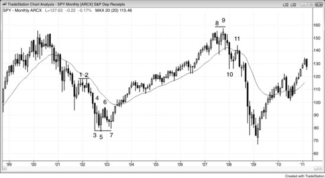
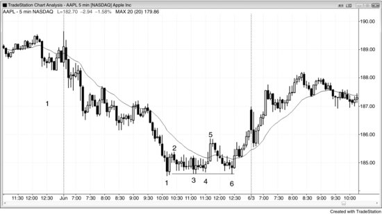
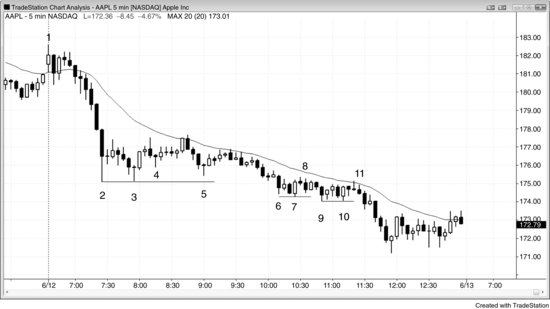
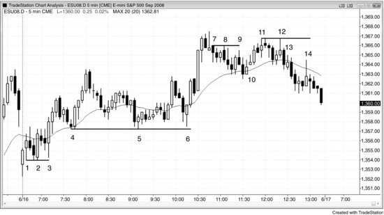

市场经历一波下跌后形成双底，在多头趋势尚未启动之前，价格先向上回调，然后再次下探至双底低点附近（但略高于双底低点），形成一个更高低点（HL），这就是**双底回调**做多建仓形态。双底不一定要完全精确等高，第二个底往往比第一个底稍低，因此整个形态有时也构成头肩底。如果第二个底没有触及第一个底的低点，那它可能只是一段两段式横盘或向上的回调，这种情况下更适合做剥头皮多单，而非波段交易。双底（或双顶）回调形态可以理解为三推底部（也可看作三重底或三角形），只不过第三次下推时空方力量不足，未能创出新低。这个形态必然出现在支撑位附近——空头趋势中每一次上涨都是如此。如果从三个底中第一个底反弹的力度足够强，交易员就会开始考虑趋势是否正在演变为交易区间，甚至反转为多头趋势。在交易区间里，每一次下跌都是牛旗，每一次上涨都是熊旗。如果市场处于多头趋势的早期阶段，每一次下跌同样也是牛旗。无论市场是在进入交易区间还是开启新的多头趋势，第一次反弹之后的回落都是牛旗，即便它跌回到了第一个底附近。从双底反弹的那一波上涨就是对该牛旗的突破，随后的回调（即第三次下推）同样也是牛旗，不管它：

- 停在双底上方，形成双底回调（或三角形），
- 跌到双底同一水平，形成三重底，
- 还是跌破双底后反转上涨，形成双底下方的失败突破（本质上是一种最终旗形反转）。

这次回调也是对第二个牛旗的回调，因此第三次下推后的反弹就是第二个牛旗突破后的突破回调。第三次下推具体在哪里结束并不重要，整体形态看起来像三重底、三角形、头肩底、最终旗形还是双底回调也不重要，因为它们的含义是一样的。第三次反转上涨构成了一个三推下跌反转形态，交易员应该开始寻找做多机会。当市场形成双底回调时，如果形态清晰、三个底处的多头反转K线都很强——尤其是最后一个底的反转K线很强，那这就是最可靠的做多建仓形态之一。

从第二个底反弹的那一波上涨通常（60%以上的概率）构成一次突破，哪怕只持续了两三根K线。随后的回调因此就是突破回调——这是最可靠的建仓形态之一。也可以这样理解：两次试图突破前方极值（通常是低2）都失败了，而两次失败的尝试通常（60%以上的概率）会引发反转。有些技术分析师声称三重底和三重顶总是会失败、总是会变成延续形态，但他们要求三个极值点必须精确到每一个Tick都相同。按照这么严格的定义，这种形态极其罕见，根本不值一提。况且，告诉市场"我不允许你怎样怎样"本身就是一种傲慢，而傲慢必然让你亏钱——因为决定市场走向的是市场本身，不是你。采用宽松的定义反而能赚更多钱。一个形态只要看上去像某种可靠形态，它大概率就会按照那个可靠形态的方式运行。

双底回调是反转形态，不是延续形态（双底牛旗才是延续形态）。两者都是做多的入场建仓形态，但一个出现在趋势的起点（反转形态），另一个出现在已经确立的趋势中（延续形态），或者至少出现在一段强势腿之后。

同理，如果多头趋势中出现双顶，随后价格回调后再次上探至接近高点的位置，这个双顶回调就是一个不错的做空建仓形态。同样，这个三推顶部具体是什么形状并不重要，因为含义是一样的。只要信号K线强、抛压明显，就是做空建仓形态——不管它看起来像三重顶、三角形、头肩顶、最终旗形，还是双顶回调。

有时候同一个交易区间内会同时出现双顶和双底，结果通常（60%以上的概率）形成三角形，意味着市场处于突破模式。市场倾向于回到区间中部，然后去测试顶部或底部，而这第三次推动就确立了三角形。如果区间足够大，交易员可以在价格向下反转时做剥头皮空单，在价格向上反转时做剥头皮多单。如果建仓形态良好，成功概率大约在60%，回报至少与风险相当。如果交易区间太窄，交易员可以选择波段做多或做空，或者等待突破。如果突破力度强，就顺着突破方向交易，因为获得至少等于风险的回报的概率往往达到70%甚至更高。如果突破失败，就反向交易。

**图 8.1** 月线 SPY 上的双底回调

如图 8.1 所示，月线 SPY 在 K线 7 处出现了一根外包阳线，价格高出前一根K线高点 1 个 tick，构成了双底回调做多入场。如果外包阳线之前有一根不错的信号K线，那么外包阳线本身就可以作为可靠的入场K线，这里正是如此。还有一些交易员会选择在外包阳线高点上方买入、在 K线 7 之后那根多头趋势K线收盘时买入、在那根多头趋势K线高点上方买入，或者在随后又一根多头趋势K线收盘时买入——对很多交易员来说，这根K线确认了新趋势的成立。在一波上涨的起点，突破一根强多头趋势K线的高点做多是一笔可靠的交易，紧随其后的那根强多头趋势K线就是证明。

K线 5 略低于 K线 3，但这在双底回调做多形态中很常见，实际上反而更理想。K线 6 是双底的突破，K线 7 则是对突破的回调测试，验证突破交易员的做多意愿是否坚定。很多交易员会把这种形态看作三角形。突破回调是最可靠的建仓形态之一，而且往往也是头肩形态。

K线 11 是 K线 8 和 K线 9 双顶之后的回调。有些交易员把它看作一个更低高点（LH）主要趋势反转（MTR），有些看作均线处的低 2 做空形态，也有些看作双顶突破后的回调。

K线 1 和 K线 2 构成了一个双顶熊旗（这是一种延续形态，不是出现在多头趋势末端的双顶反转形态）。空头趋势中的双顶始终是一个低 2 做空建仓形态，因为它本身就是两次上推。多头两次尝试反转趋势均告失败，之后至少会暂时退出观望几根K线。买方的缺席加速了下跌并加大了下跌幅度，市场会迅速跌到一个可能 (60%+)吸引买方入场的支撑位。

**图 8.2** 熊旗作为双底回调

有时候熊旗可以成为双底回调做多建仓形态。如图 8.2，K线 1 处的两K线反转出现在当天第二段大幅下跌的末端，因此可能 (60%+)是一个反转建仓形态。不过，仅凭两K线反转还不足以在窄幅空头通道底部做多。虽然到 K线 2 的反弹幅度不大，说明力度偏弱，但 K线 3 和 K线 4 都未能跌破前低，从而构成了一个双底牛旗。有些交易员把 K线 3 看作楔形熊旗的终点，前两次下推分别在 4 根和 6 根K线之前。这样一来，K线 4 就是一个小型突破回调做多建仓形态——突破来自 K线 4 前两根K线处牛旗的小幅向上突破。另一些交易员把 K线 3 看作熊旗的突破，但该突破没有后续跟进，这让交易员开始怀疑这个旗形是否是最终旗形、市场是否即将向上反转。

K线 6 精确测试了 K线 3 的低点但未能跌破（也没有跌破 K线 1 的低点），所以这是一个更宽幅的双底牛旗，K线 3（或 K线 3 和 K线 4）构成了第一个底。这也可以称为吸筹。机构在防守 K线 1 的低点而不是试图扫止损，说明它们认为市场会上涨。

K线 5 是一根均线缺口K线，这种K线经常能提供足够的逆势动能来推动趋势反转。它突破了一条主要趋势线。K线 6 是对 K线 1 趋势极端点的更高低点（HL）测试，也是 K线 5 多头急速走势的突破回调。K线 6 同时还是一个更高低点（HL）主要趋势反转（MTR）、从 K线 5 起算的三次下推，以及从 2 根K线之前算起的单K线最终旗形反转。

**图 8.3** 弱势双底回调

有些双底回调看起来就是不够强，通常 (60%+)意味着它们只是熊旗的一部分，而非真正的反转形态。如图 8.3，K线 4 看似是一个双底回调做多建仓形态，但 K线 3 比 K线 2 的低点高出 5 美分，而且整体处于非常强的空头趋势中。这种略高的低点通常 (60%+)会否定该形态，使两段式空头反弹的概率远大于新多头趋势出现的概率。而且在强趋势中，第一次回调（即 K线 2 之后的任何小幅反弹）几乎总是会形成一个顺势入场机会，所以此时不宜寻找底部。不过，如果有交易员确实入场做多，市场从入场点反弹了超过 1.00 美元。考虑到 K线 2、3、4 都有长影线，加上市场仍在开盘后 90 分钟内（容易出现开盘反转），这笔交易还算合理。最聪明的交易员本应在均线测试时做空，那次测试以三角形的形式出现（三次上推，第一次在 K线 2 之后两根K线处，第二次在 K线 4 前一根K线处形成）。如果你选择了做多剥头皮，可能 (60%+)很难迅速切换到做空思维。

K线 8 是一个双底回调做多建仓形态，K线 7 的低点比K线 6 低了 13 美分，但入场始终未被触发（K线 8 之后的那根K线未能突破K线 8 的高点）。再强调一次，在强空头趋势中，如果尚未出现有力的趋势线突破，就去抄底，不是好策略。当时市场处于窄幅空头通道中，而通道持续的时间通常远比人们觉得合理的要长得多。交易员应该等到先出现一轮强劲的多头突破、再回调之后，或者出现其他类型的反转形态时，才考虑做多，比如K线 11 处窄幅交易区间结束后急速下跌所带来的最终旗形反转尝试。即便如此，在之前没有一波上涨的情况下，任何反转演变成交易区间的概率都大于演变成多头趋势的概率（60% 以上），所以任何多头仓位都只能当作剥头皮来做。

K线 11 是底部形态的第三次下推。K线 10 的低点比K线 9 的低点高了 2 美分。买入双底的交易员此时要么已经出场，要么在均线附近的K线 11 低 2 处反手做空。最有经验的交易员根本不会买这个弱双底，而是会等它失败，然后在K线 11 的低 2 处做空。

尾盘出现了一个小型双底牛旗，后面跟了一根内包K线。内包K线本身就是一种暂停，也就是一种回调，因此这根内包K线完成了一个小型双底回调做多建仓形态。

K线 2 和K线 3 构成了一个双底，但同一个交易区间里也存在一个双顶。只要交易区间内同时出现双底和双顶，市场通常会回到中间位置（概率 60% 以上），形成一个三角形——K线 4 正是这种情况。交易区间继续横盘整理，最终如预期那样朝之前趋势的方向突破。

**图 8.4** 双底和双顶回调

如图 8.4 所示，Emini 当天既出现了双底回调反转，也出现了双顶回调反转。K线 1 和K线 2 形成了一个双底，虽然乍一看K线 1 很容易被忽略。保护性止损挂在入场K线的底部下方，这个位置经常会被测试——K线 2 正是如此。价格两次下探到同一水平就构成双底，即使第一次并不是波段低点。K线 1 底部有很长的下影线，几乎可以肯定在 1 分钟图上存在一个更高低点（事实确实如此）。K线 3 是一次深度回调，测试了这个双底，相当于第二次试图打掉止损。这一次甚至没能跌到K线 2 的低点，空头便撤退了，多头接管了局面。有些交易员把K线 2 和K线 3 看作双底牛旗，也有人认为它们是三底牛旗或双底回调。无论你觉得哪个特征更重要都没关系，因为它们全都是做多建仓形态。

K线 4 和K线 5 在这个趋势性交易区间日中形成了一个双底牛旗。K线 6 的回调测试了这个双底，构成了一个大型双底回调。你也可以称之为三底，但这个叫法不会带来额外的交易价值，所以没必要用。交易员也可以将其视为从K线 6 结束的小型空头趋势发生的双底主要趋势反转（MTR）——所有牛旗本质上都是小型空头趋势。

K线 7 和K线 1 类似，也是一根入场K线。它和K线 8 形成了一个不太明显的双顶。此外，K线 7 前面的两K线反转是一次上推，K线 7 前面的十字星是第二次上推，两者共同构成了一个双顶。无论你觉得哪个形态更重要都无所谓，因为它们都是顶部形态。你只需要知道市场正在尝试向下反转。

K线 8 试图打掉K线 7 做空入场K线上方的保护性止损，但失败了。K线 9 是第二次尝试，而且在更低的价格便告失败，形成了一个双顶回调做空建仓形态，入场方式是在K线 9 低点下方一个 tick 处挂卖出止损单。这笔做空形成了 5 个 tick 的失败突破，并提供了一个很好的反转做多机会——在均线处的两K线反转上方挂买入止损单入场。K线 10 就是入场K线。这个楔形回调牛旗测试了K线 4 到K线 6 交易区间的顶部，同时也是一个突破回测。

K线 11 和K线 12 形成了一个双顶熊旗做空建仓形态，提醒交易员关注后续可能出现的双顶回调做空建仓形态。K线 13 是一根多头趋势K线，试图反弹测试双顶，同时也在尝试形成一个高 2。

K线 14 是一个在均线处失败的更低高点回调，同时也是一个双顶回调做空建仓形态。
