失败是指任何未能达到预期目标的交易，结果要么是赚得比预期少，要么——更常见的情况——直接亏损。对剥头皮者来说，目标就是剥头皮者的利润；但如果交易员原本期望更多，市场却未能满足其预期，那么即使拿到了剥头皮者的利润，这笔交易仍然算是失败。每一次多头建仓形态的失败，都说明多头力量不足、空头力量增强；每一次空头建仓形态的失败，都说明空头力量不足、多头力量增强。好的建仓形态成功率大约为 60%，这也意味着大约 40% 会失败。建仓形态一旦失败，往往会在反方向形成一个很好的建仓形态。刚被迫出场的交易员不愿意马上在同一方向重新入场，市场因此变成了单边行情。而且，他们止损出场的过程本身也会把价格进一步推向反方向。

本章讨论一些较为常见的形态失败与反转情形——至少够做一笔剥头皮交易。当形态规模足够大且背景合适时，有时甚至可以演变为一次主要趋势反转（MTR）。有一点至关重要：每种形态都有失败的时候，交易员应当把这视为常态。要把失败当作潜在的机会，因为前面提到过，失败之后往往会在反方向形成一笔盈利的交易。还有些时候，失败会在原来建仓形态的方向上产生第二次入场信号。

以下是一些常见的、往往会带来反方向交易机会的失败类型：

- 失败的高 1、高 2、低 1 或低 2。
- 对任何技术位的突破失败，比如波段高点或低点、趋势线、趋势通道线。
- 未能突破磁力位——比如测量移动目标、前一个波段高点或低点、趋势线、趋势通道线。
- 失败的最终旗形（反转尝试失败，演变为突破回调建仓形态）。
- 失败的楔形。
- 失败的信号K线或入场K线。
- 失败的一个 Tick 突破。
- 失败的反转，比如失败的双底或双顶，或失败的头肩形态。
- 未能达到利润目标，比如 Emini 中 5 tick、9 tick、17 tick 目标的失败，或股票中 11 美分、51 美分、99 美分、101 美分目标的失败。

有些失败是强趋势的信号，可形成顺势交易的建仓形态：

- 在强多头趋势中，价格未能跌破前一根K线的低点；在强空头趋势中，价格未能涨过前一根K线的高点。这说明市场存在紧迫感，趋势非常强劲。
- 回调未能触及均线。这同样说明市场存在紧迫感，趋势非常强劲。
- 未能到达磁力位——比如测量移动目标、前一个波段高点或低点、趋势线、趋势通道线。这往往会先引发一次回调，之后再次尝试到达磁力位。

如果一笔交易已经获得了剥头皮者的利润（交易员因此部分或全部平仓），之后价格反转并击穿了原始信号K线或入场K线的止损位，那么推动市场朝反方向运动的燃料就少了很多——因为被套在交易中的人远没有那么多（他们已经带着利润离场了）。此外，很多剥头皮者在部分获利之后会把剩余仓位的止损移到盈亏平衡点，因此他们的止损位比原先设在入场K线或信号K线外侧的位置要紧得多。

小级别反转可能只是交易区间内的反转，仅够做一笔剥头皮交易，但有时候也可能演变为一次主要趋势反转，或成为其中的一部分。最可靠的失败形态是趋势中的旗形。旗形形成时，逆势交易员期待趋势反转，但这是一个低概率的押注，因为市场具有惯性，趋势会抵抗反转尝试。举例来说，强多头趋势中出现了一个反转建仓形态，部分交易员据此做空。但如果价格并未反转，而是横盘或小幅下跌至均线附近，并在那里形成了一个高 2 加上多头信号K线，那么这次空头反转尝试就很可能（60% 以上）会失败。这是一个很好的买入信号，因为你是在顺着更大趋势的方向入场，有理由预期价格至少会回测趋势的前一个极端点。任何反转形态——包括主要反转形态——都可能失败并导致趋势恢复。

交易员入场后，很多人会把保护性止损设在信号K线外侧一个 Tick 的位置。入场K线收盘后，如果走势强劲，很多人会把止损移到入场K线外侧一个 Tick 的位置。你怎么知道这些？看图表就行了。随便找一张图表，找到可能的信号K线和入场K线，观察价格反转突破它们时发生了什么。绝大多数时候，这种反转会以一根强趋势K线的形式出现，而且幅度通常至少够获得剥头皮者的利润。原因在于，交易员刚建好的仓位就被止损打掉，亏损出场后他们会更加谨慎，想看到更多的价格行为之后才愿意在同一方向重新入场。这样一来，市场就只剩下一方在主导，价格运动通常又快又猛，幅度足以做一笔剥头皮交易。

为什么 1 tick 的突破失败如此常见，尤其在 Emini 市场？股票市场中，突破失败经常发生在 1 到 10 美分的突破幅度内，具体取决于股价和个股的交易特性。每只股票都有自己独特的交易特征，这大概是因为每天交易它的人群相对固定，少数交易量足够大的交易者就能推动价格，从而形成反复出现的形态。假设市场处于弱多头趋势中，整体走势偏横盘到下跌，很多交易者会这样想：当前这根K线只要再往上走 1 tick，突破前一根K线的高点，就会有人在那个位置挂买入突破单。大多数聪明的交易者都预料到了这一点。但如果有足够多、交易量足够大的交易者认为这波回调在深度或时间上还不够充分（比如他们判断可能会出现两段式回调，概率 60% 以上），他们反而会在高点或前一根K线高点上方 1 tick 的位置做空。一旦空单量压过了新进的多头，又没有更多新买家及时入场接力，市场就有 60% 以上的概率往下走 1 到 2 tick。

这时候新进的多头就开始紧张了。如果自己的入场价位真的那么好，为什么没有更多买家跟进？况且市场又便宜了 1、2 tick，对想做多的人来说应该是更划算的价格，按理会迅速把价格推上去。然而市场哪怕只多停留几 tick 不涨，就会有越来越多新多头开始怀疑自己是不是做错了。一部分人市价卖出平仓，增加了卖盘压力；另一部分人在低 1、2 tick 的位置挂卖出止损单——也许是根据 1 分钟或 3 分钟图表来设的，挂在最近那根K线低点下方 1 tick。这些止损一旦被触发，原本的买家就变成了卖家，进一步把价格往下推。与此同时，最初做空的人也嗅到新多头被套住了，很多人会加仓做空。当价格跌了 3、4、5 tick 之后，那些已经止损出场的买家不再急着买入，而是等着观望后续的价格行为。没有买家接盘，价格就会继续下跌，去寻找足够的买盘来消化卖单。跌到某个位置，空头开始止盈平仓，下跌放缓，买家重新入场。等买压超过卖压，价格就会再次上涨。

5 分钟图上出现的 1 tick 突破失败，如果发生在交易区间里，通常在更高时间周期（比如 15 分钟或 60 分钟图）上也是 1 tick 的突破失败，概率在 60% 以上。既然如此，为什么 60 分钟图上看不到很多 1 tick 的突破失败呢？原因在于，很多 1 tick 的突破失败在 5 分钟图上会回调好几根K线，然后再次突破。结果就是：虽然在 60 分钟K线形成过程中确实出现过 1 tick 的突破失败，但等到这根 60 分钟K线收盘时，突破幅度已经超过了 1 tick。

1 tick 的突破失败是新手亏钱的常见原因。他们看到一个自认为不错的做多建仓形态，就自信满满地把买入突破单挂在前一根K线高点上方 1 tick 处。也许确实出现了一个两K线反转，位置在均线附近或上方，但这个反转跟前面两根K线完全重叠，多头入场点正好处于这个小交易区间的顶部。新手看到强多头趋势K线就买了进去，但有经验的交易者知道这种两K线反转有 60% 以上的概率是多头陷阱，他们很可能恰好在新手买入的位置做空。果然，市场往上走了 1 tick，触发了新手的买入突破单，让他们成交做多。但紧接着下一个 tick 就开始回落，跌 1 tick、2 tick、3 tick，30 秒内保护性止损就被打掉，亏了 2 个点。他们想不通：怎么会有人恰好在自己买入的地方卖出？建仓形态明明那么完美！

这种陷阱很常见。再举几个例子：

- 新手在空头趋势中，还没出现任何多头力量的信号（比如尚未放量突破空头趋势线），就急着抢做多。
- 交易者在铁丝网形态或熊旗顶部的一根大十字星上方买入——这根十字星实体很小，却被他们误读成反转信号，急于在自认为超跌的空头趋势里提前入场。

另一种常见情况是出现了一根实体很大、影线很短或没有影线的趋势K线。如果是多头趋势K线，很多交易者会把保护性止损挂在这根K线低点下方 1 tick。市场经常在接下来 5 到 10 根K线内慢慢走低，打掉这些止损，把交易者洗出局，然后再沿着那根趋势K线的方向反转回升。

新手没有意识到的是，很多大交易者把这些位置视为绝佳的做空建仓机会。他们乐意做空，因为他们知道只有弱手才会在那里买入，而这些弱手一旦被洗出来，反而会帮着把价格进一步推低。1 tick 的突破失败是一个可靠的信号，说明市场要朝反方向运行，所以要留意顺着这个方向入场的建仓形态。以上所有分析对下跌行情同样适用。所有 1 tick 的突破失败有时也可能是 2 tick，在 200 美元的股票上甚至可能是 5 到 10 tick。

突破回测经常精确到 tick 地测试入场价，把手弱的交易者甩出去，迫使他们不得不追着市场以更差的价格重新入场。突破回测有时候差一个 tick 没碰到盈亏平衡点的止损，有时候又会穿过去一两个 tick，但不管哪种情况，只要市场随后朝趋势方向反转回去，这种未能突破原始入场价的反转尝试就是一个可靠的顺势建仓形态。举个例子：Emini 中，一根多头反转K线上方出现了一个强买入建仓形态，市场随后向上走了 10 根K线，之后开始回落。当回落接近最初那根多头信号K线的高点时，要留意市场的表现。如果某根K线在信号K线高点上方两个 tick 处止跌回升，说明刚好差一个 tick 没打到盈亏平衡点的止损。市场没能把多头清洗出去。交易者就会在这根突破回测K线上方买入，因为保护性止损没被触发，说明多头在原始入场价附近积极买入、守住了自己的止损位，这表明多头力量很强。

大多数交易日都有大量的交易区间走势，提供很多在波段高点和波段低点突破失败后入场的机会。当价格突破前一个波段高点、且动能不太强时，可以挂一张卖出突破单，入场位设在前一根K线低点下方一个 tick。如果该K线收盘前没有成交，就把卖出突破单上移到刚收盘那根K线低点下方一个 tick。如此反复，直到当前这一段涨幅太大、动能太强，需要等更多价格行为信号才适合做空。这时候就等下一次回调突破至少一条次要趋势线，然后再寻找在新的波段高点做空的机会。趋势日中，次要趋势线被突破之后，如果出现一根强反转K线，也可以在新的波段高点或低点押注失败。

同理，第一次跌破前一个波段低点后的突破失败，就是一个 LL 买入建仓形态。挂一张买入突破单，入场位在前一根K线高点上方一个 tick。如果没成交，就不断把单子下移到最新一根K线高点上方一个 tick。但如果市场跌得太远或太快，就要重新开始这个过程：等一波小幅反弹突破一条次要趋势线，再考虑在新低处买入突破失败。

在 Emini 中，当日均波动幅度大约 10 点时，一个常见的交易方式是做 4 tick 的剥头皮。趋势中可能连续出现好几笔成功的剥头皮，但如果某一笔挂了限价单却没成交，这种 5 tick 的失败就是动能衰减的信号。这种情况在 1 分钟和 3 分钟图上也很常见。要完成一笔 4 tick 的剥头皮，需要 6 tick 的突破幅度（1 tick 用于突破单入场，4 tick 利润，通常还要再多 1 tick 才能确保限价止盈单成交），所以如果行情只走了 5 tick 就反转，往往说明趋势方的交易者已经失去了控制权，回调或反转即将到来。很多交易者也会挂限价单去捕捉 2 点、3 点或 4 点的利润目标，如果市场在差一个 tick 就到达这些目标时反转，同样是弱势信号。比如，市场在日内做出一个明显的低点，然后从信号K线高点上方反弹了 17 tick，那些想以限价单获取 4 点利润出场的交易者，除非市场走到信号K线高点上方 18 tick，否则不会成交。

如果市场只到了 17 tick，下一根K线就跌破了那根K线的低点，那些没有提前一个 tick 出场的多头就会开始考虑平仓，这通常至少会带来一波向下的剥头皮行情。交易者会推断，多头是在提前一个 tick 获利了结的，说明他们并不确信市场能给出完整的 4 点利润。这种信心不足会引发多头止盈离场，空头则会乘势积极做空。多头可以继续依赖跟踪止损，指望市场最终填满他们 4 点的限价单，但大多数交易者不愿意冒着 15 tick 的浮盈缩水到只剩 2 到 3 tick 的风险，就为了多赚那一个 tick。这本质上跟冒 10 个 tick 以上的风险去赚 1 tick 的剥头皮没区别，是一种必亏的策略。一旦市场走到 17 tick 后回落了几个 tick，如果止盈限价单还没成交，交易者大概率会把止盈目标降低几个 tick，同时把跟踪止损上移到前一根K线低点下方一个 tick。如果两张单子都没成交，且那根K线收盘偏弱或收阴，他们很可能直接市价平仓。顺便说一下，如果市场涨到信号K线高点上方 16 tick，大约有 80% 的概率会继续涨到 17 或 18 tick。也就是说，在 16 tick 时出场通常不划算，除非市场跌破了前一根K线的低点，尤其是当那根K线本身就是一根做空信号K线的时候。

大多数交易员处理潜在 9 tick 失败的方式都差不多。如果交易员在 Emini 买入后想赚 2 个点出场，限价单就会挂在信号K线高点上方 9 tick 的位置。通常市场还得再多走 1 tick 才能成交，也就是信号K线高点上方 10 tick。如果市场触及了这个价位但没有成交，随后开始下跌，交易员就得决定：是继续守住最初的止损，还是改用跟踪止损——比如放在最近一根有像样多头实体的K线低点下方 1 tick。如果限价单正好挂在阻力位上（比如前一个波段高点），而市场迟迟没能突破，那也可以赶紧把限价单往下调几个 tick。一旦市场已经走了 9 tick，绝对不能让这笔交易变成亏损，因为那等于冒着 8 tick 以上的风险去赚 1 tick，交易者方程非常糟糕。

在其他剥头皮者密集的市场中，也存在类似的失败现象，比如 SPY 和 QQQ。这两个品种常见的利润目标是 10 tick，通常需要市场在信号K线之外走 12 tick 才能成交。如果实际只走了 10 或 11 tick（甚至只有 8 或 9 tick）就反转了，往往会在相反方向产生至少一笔能赚钱的剥头皮机会，因为那些剥头皮者被套住了，会在信号K线或入场K线反转时出场。这类失败在个股中也很常见。比如，某只股票剥头皮通常能赚到 1 美元以上，但如果两次冲击 1 美元目标都差了一点，那往往就是一个不错的反向剥头皮机会。

最常见也最可靠的失败之一，是第一次急速穿越趋势线。股票交易员在日线图上一直在找这种机会，但它在所有时间周期都会出现。比如，如果 AAPL 处于强劲的多头趋势中，某天因为财报不佳大跌 8%，触及了日线图上的均线。这时候有经验的交易员不会去找做空机会，反而经常在急跌当天收盘时买入，或者在第二天开盘时买入。对他们来说，这就像是商场打折——股票刚打了八折，而且特价不会持续太久，所以赶紧买。他们清楚，大多数反转尝试都会失败，第一次尝试之后几乎总会迎来新高，所以即使是在一根强空头急速K线的底部买入，也照买不误。

所有形态都有可能失败，不管看起来多好。一旦失败，就会有交易员被套住，不得不在入场K线或信号K线外侧 1 tick 的位置亏损出场。这正是聪明的交易者入场做低风险剥头皮的机会。把你的突破单挂在那些被套交易员放保护性止损的同一位置，他们出场时你就入场了。他们短时间内不会再急着沿原来的方向入场，这样市场就变成了有利于你的单边行情，至少能带来一笔剥头皮利润，通常还会走出两段式回调。

**图 9.1** 小型假突破

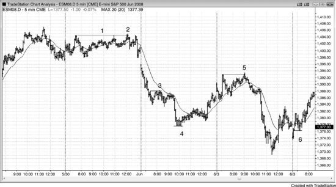

在 5 分钟 Emini 图表中，1 tick 和 2 tick 的假突破引发反转非常常见。图 9.1 展示了 6 个例子（K线 1 的标签在K线上方较远处）。一旦突破交易员通过突破单入场后，发现市场没有立刻朝他们的方向继续走，反而回撤了 1 到 2 tick，就会开始挂保护性止损。逆势交易员闻到了血腥味，会在那些被套交易员止损出场的位置入场。大多数突破尝试都会失败，尤其是当市场处于交易区间时，而失败的形式往往是 1 tick 的假突破。有经验的交易员会利用这些突破来止盈，或者反向交易，因为他们预期交易区间里大多数突破都会失败。比如，如果一个交易员在交易区间底部附近买入，大概率是在剥头皮，目标是测试区间高点，通常会在区间顶部挂一张限价单来平掉多头并止盈。在强趋势中则恰恰相反：比如市场处于多头趋势，交易员反而会在区间顶部上方挂买入突破单，因为他们预期还会再走一腿。

**图 9.2** Emini 中的 1 Tick 陷阱

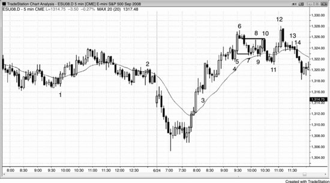

如图 9.2 所示，在 Emini 这两天的走势中有很多 1 tick 陷阱的例子。

K线 1 是一个 1 tick 的低 2 失败，成为楔形牛旗的突破回调入场点，该楔形牛旗起始于太平洋时间上午 8:55。

K线 2 是一个 1 tick 的高 2 失败，出现在铁丝网形态中。那些自以为保守、等着在大外包K线上方买入的交易员反而被套了——买在了横盘均线下方的交易区间顶部。这个形态后来演变成了双顶熊旗。

K线 3 是一个 1 tick 的反转失败，发生在一轮急速多头趋势中。聪明的交易者正急切地等待任何回调来买入。他们在该K线低点下方买入，而那恰好就是弱势空头在开盘高点突破后回落时做空的位置。

K线 4 向下突破了 4 根K线之前的小波段低点 1 tick，形成了一个高 2 做多的建仓形态。

K线5是一根大阳线（多头趋势K线），它的低点下方一个tick处自然会有止损单。K线7刚好穿过那个位置一个tick，把这些止损扫掉了。但多头守住了K线4上方——也就是这轮多头急速阶段底部上方的位置。

K线9又多跌了一个tick，把那些以为自己在LH处做空的交易者套住了，实际上那里只是一个横盘的牛旗。

K线10向上穿过了K线6空头的盈亏平衡点保护性止损两个tick，同时与K线8构成了一个双顶熊旗。

K线14是最可靠的一种单tick失败形态——一个失败的高2，新手交易者错误地以为这是一个多头回调。这是一个完美的陷阱，随后引发了一波强烈的下跌（图中未显示）。他们没有注意到：回调到K线11时已经突破了趋势线，然后K线12形成了一个HH测试。而且从高点下来有5根空头趋势K线和1根十字星，K线13的高1之后也没有出现趋势线突破。这是一个HH之后的两K线反转所引发的空头通道，所以在高2信号K线上方，做空的人可能（60%+）比做多的人更多。要记住，高2本身并不是买入信号。在多头趋势顶部它才是买入信号，但这里多头趋势已经结束了。市场接下来要么进入交易区间，要么进入空头趋势。在交易区间里高2也可以作为买入信号，但那只有在区间底部才成立，而不是像这里这样靠近区间顶部的位置。

**图 9.3** 突破信号K线和入场K线保护性止损位

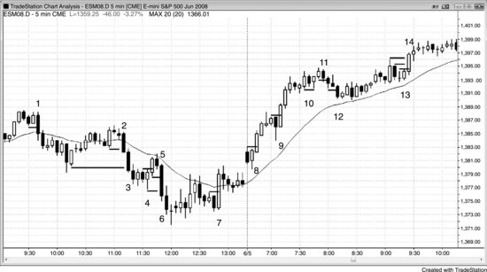

看一下图9.3中，市场突破那些水平线时发生了什么。这些水平线标记的是信号K线和入场K线外侧一个tick的位置，也就是交易者通常（60%+）会放保护性止损的地方。大多数时候，突破那里时出现的是一根趋势K线，而且幅度足够让剥头皮者赚到钱。图上很多失败来自较弱的建仓形态，聪明的价格行为交易者不会去做这些交易。但确实有足够多的交易者进场了，当他们被迫亏损出场时，就推动市场朝反方向走。比如，在K线4反转K线处做多的交易者，止损会放在入场K线或信号K线下方。这两个位置都被K线5那根大阴线（空头趋势K线）扫掉了，而聪明的空头刚好把突破单挂在那些位置入场，至少赚到了剥头皮者的利润。

推论是：如果K线的极端价位被测试但没有被超过，那么止损被测试了但没被触发，这笔交易往往能盈利。如果多头入场的保护性止损差一个tick没被打到，这个测试实际上形成了一个双底牛旗——第一个底是信号K线或入场K线的底部，第二个底是那根回到同一水平但没能触及保护性止损的K线。

**图 9.4** 失败的止盈目标

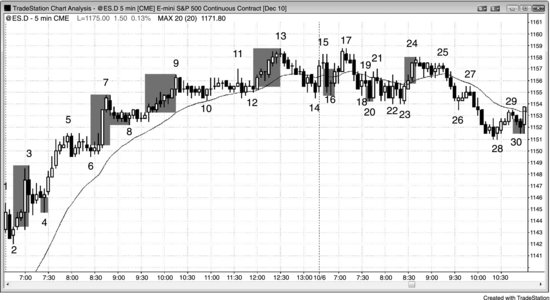

当市场触及限价单止盈价格后又回落时，大多数交易者的限价单其实不会成交。市场随后停滞或回落几个tick，很多交易者就会选择市价出场，因为他们不想冒险把更多浮盈还给市场。这些出场为回调提供了额外的动力，往往也是市场尝试反转的信号。

如图9.4所示，市场在K线2上方上涨了21个tick后反转下跌。一些在K线2信号K线上方一个tick做多的交易者，挂了限价单准备在信号K线高点上方21个tick处获利5个点出场，但大多数人的单子不会成交，除非市场再多走一个tick。结果市场反转了，许多交易者赶紧市价出场，在价格回到入场价之前尽量抢救利润。

K线7是一个17 tick的失败，针对的是在K线6买入信号K线上方一个tick做多的交易者。很多想赚4个点利润的交易者看到市场到达了信号K线高点上方17个tick处的限价单位置，当市场跌破那根K线的低点时就出场了。那些正确判断趋势仍然强劲的交易者则选择波段持仓，不急着在4个点处出场，而是靠盈亏平衡点止损来保护仓位。一旦市场突破了K线7的高点，他们就会把止损跟踪到K线8——最近的HL——下方一个tick。

K线4、8、20和30都是做空交易中5 tick失败的例子。大多数空头需要市场跌破信号K线底部6个tick，他们4个tick剥头皮的限价止盈单才能成交。有些交易者的单子会成交，但大多数不会。

K线9是一个13 tick的失败，针对的是在K线8上方做多、希望赚3个点利润的交易者。

K线16和K线24是9 tick的失败，针对的是试图赚2个点的交易者。他们不会让这些交易变成亏损，而是会跟踪止损。比如，在K线16信号K线做多的交易者会在K线17低点下方一个tick出场，或者在K线17收出阴线时出场。在K线23买入信号上方做多的交易者，可能会在K线24之后第二根阴线的低点下方一个tick出场。

**图 9.5** 交易区间突破通常会失败

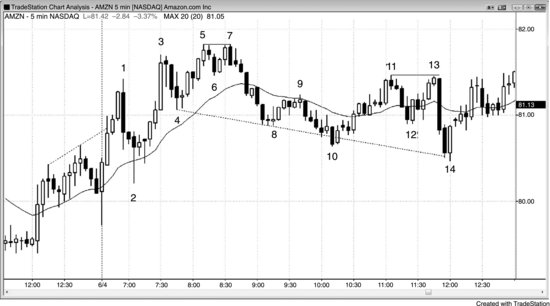

当多空双方都在激烈交投时，向上突破波段高点或向下突破波段低点的走势通常会失败。

如图 9.5 所示，涨到 bar 1 的那波走势很强，但开盘反转往往来势凶猛，而且 bar 1 是一个 HH（高于昨日收盘附近的波段高点），又突破了多头趋势通道线，因此做空是合理的。

bar 1 波段高点之后，bar 2 的回调幅度很深，而且从开盘以来的K线都很大、影线也长。这说明多空双方都在激烈交投，在多头趋势明确形成之前，应该假定双方势均力敌。既然当天还没有证明自己是多头趋势日，就应该按交易区间日来操作。

bar 3 是一个 HH，因为它是高于前一个波段高点的波段高点。涨到 bar 3 的动能很强，没有二次入场点或强反转K线就不应该考虑做空，但如果有交易员做空了，下跌幅度有 26 美分，勉强也能获利。

bar 5 是一个 HH，做空是合理的，尤其是它有两段小的上涨腿（中间有一根空头趋势K线，代表从 bar 4 开始的第一段上涨结束）。但市场只跌了 18 美分就又涨了上去。手快的交易员可能已经部分平仓，但大多数人只能以 4 美分的亏损止损离场。

bar 7 属于同一波上涨的一部分，因此是一个二次入场（低 2）的做空机会。bar 7 与 bar 5 的价格分毫不差地形成了双顶，本质上是一个截断的三推上涨形态（bar 3、5、7），所以可能至少会出现两段下跌。

bar 10 是一个 LL，也是可能存在的更大级别多头趋势中的第二段下跌。它的低点高于 bar 2 的低点，所以市场可能仍在形成大级别的趋势性波段。在多头趋势或横盘市场中出现两段下跌，尤其是两次下穿平坦均线时，始终是好的做多机会。

bar 11 是一个 HH，因为它高于 bar 9 的波段高点，尽管 bar 9 属于此前下跌腿的一部分。仍然会有交易员在这里交易（有空头的止损单，有突破买入的做多单，也有新开的空头仓位），因为价格突破任何前期波段高点都是强势信号，在交易区间日中也是一个潜在的押注失败机会（留意突破失败以及强势信号缺乏后续跟进的迹象）。

bar 13 只比 bar 11 低一个 tick，构成了双顶熊旗，因此是一个做空建仓形态。它是从 bar 10 算起的两段上涨，也是第二次涨到平坦均线上方（bar 11 是第一次）。

bar 14 相对于 bar 10 和 bar 12 两个波段低点来说，都是一个 LL。

顺便一提，bar 10 和 bar 14 的做多机会都是空头趋势通道线（从 bar 4 和 bar 8 连线画出）的过冲失败，这提高了做多成功的概率。两处都有两K线反转的建仓形态。bar 10 是楔形牛旗的底部，bar 14 是扩展三角形牛旗的底部。

**图 9.6** AMZN 的失败突破

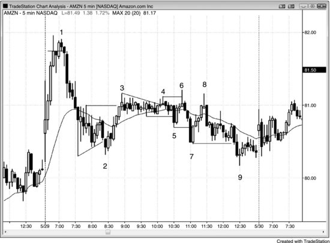

如图 9.6 的 5 分钟图所示，Amazon（AMZN）出现了很多大幅的单K线失败突破，突破波段高点和低点后迅速回落。开盘后经历了一波高潮式的快速拉升，紧接着是一波大幅反转下跌，多空双方都展现出了实力，这增加了任何一方的推动都会被另一方反转的可能性，当天形成交易区间的概率因此很高。图中标注的所有K线都是失败突破。bar 3 之后形成了窄交易区间，随后演变为一个小型扩展三角形顶部（结束于 bar 6），然后又形成了一个扩展三角形底部（结束于 bar 7）。从底部的反弹未能突破顶部，反而与 bar 6 形成了双顶，之后市场一路下跌到收盘。

**图 9.7** 交易区间突破通常会失败

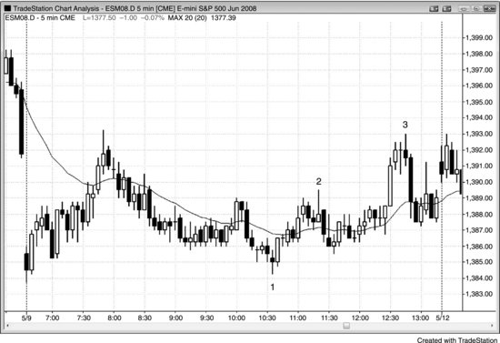

当一天看起来像是在发展为交易区间日时，交易员预期突破会失败，并寻找押注失败的机会。如图 9.7 所示，到午盘时已经很清楚当天是一个小幅横盘日，突破失败的概率因此大大增加。bar 1、2 和 3 都是突破押注失败的二次入场点。bar 3 顶部之前的那根趋势K线很大、成交量也很大，吸引了许多满怀希望的多头入场，他们押注市场终于要走出趋势了。在小幅波动日里，这种押注的胜率始终很低，更好的做法是押注失败或者等待强的突破回调。跌到 bar 1 低点的突破和涨到 bar 2 高点的突破都很弱（影线明显、K线重叠），所以两次突破都很可能失败。在 bar 3 结束的那次突破从未出现突破回调来给多头一个低风险的做多机会，所以唯一的交易就是在二次入场点做空。

**图 9.8** 把交易员套在好交易的外面

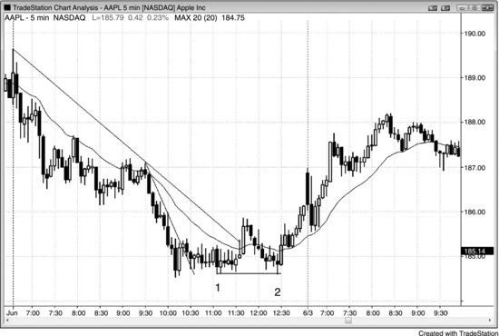

Apple（AAPL）一直是日内交易中走势最规矩的股票之一，但跟很多其他股票一样，它有时候会在反转启动时先打掉止损，把交易员套在场外，如图 9.8 所示。

交易员在K线1处买入双底牛旗，入场方式是在之后3根或6根K线处、当市场突破前一根K线高点时做多。随后出现一波涨过均线的反弹，并突破了趋势线，接着均线缺口K线的做空信号引导市场向下测试K线2处的空头低点。许多多头把保护性止损设在K线1双底牛旗下方。K线2比K线1低了1个tick，把这些多头扫出场外，但K线2与K线1又构成了一个双底牛旗，随后引发了一轮延续到次日的反转行情。K线1下方1个tick的失败突破，把多头套在了场外，把空头套在了场内。下跌到K线2的走势处于一个窄空头通道中，而且是第三次下推，所以这是一个高3做多建仓形态。在窄通道中，高3比高2更可靠，因为通道往往在第三次下推之后向上反转。这笔多单特别好的原因在于：它先把新进场的多头扫出场外，然后立刻反转上涨，这些被扫出去的多头在心理上很难马上追回来买入。他们只能追高入场，入场偏晚，反而给上涨提供了额外的推动力。

**图 9.9** 第一个小时内的双顶与双底

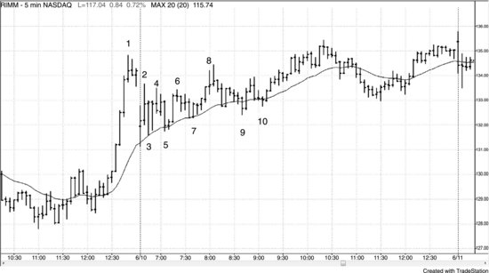

股票在开盘第一个小时内经常形成双顶或双底旗形（见图 9.9）。大多数都是可交易的，但一定要先对部分仓位剥头皮止盈，并把止损移到盈亏平衡点，以防形态失败。

K线2和K线4构成了一个双顶熊旗，但失败了。随后市场在K线3和K线5处形成了一个双底牛旗。

接下来你不得不在K线4和K线6构成的双顶熊旗处再次反手做空，但此时你从多单上已经净赚了70美分。到这一步，你已经知道市场正在形成一个交易区间，很可能 (60%+)是三角形。

K线7又是一次失败，但做多仍然合理，因为强势拉升（涨到K线1的那波）之后出现的交易区间通常 (60%+)是延续形态，而且K线3、5、7都在均线处获得了支撑。

下跌到K线9的过程持续了7根K线，没有任何多头强势的迹象，所以尽管K线9相对K线7是一个HL，最好还是等二次入场点。这个位置的多单很可能 (60%+)走不远。

K线10处的突破回调是一个完美的二次入场点。

**图 9.10** 失败的双底牛旗

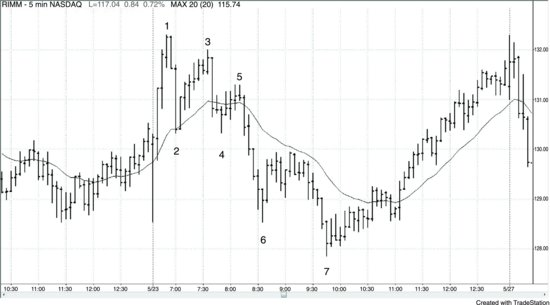

如图 9.10 所示，K线4是一个双底牛旗的做多建仓形态，但被K线5的低2信号打败了——K线5是从下跌到K线4那根强空头急速之后的回调。这导致市场向下突破了双底，接着走出两段式下跌到K线7。做空有好几种入场选择：

- 在K线5下方入场
- 在K线4低点下方1到2个tick处入场
- 在跌破K线4那根K线的收盘价入场
- 在下一根K线的收盘价入场，那是一根强跟随K线

**图 9.11** 大多数头肩底形态会失败

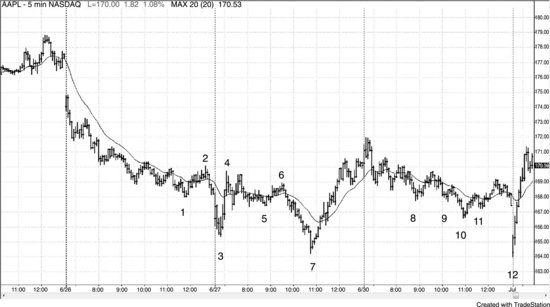

如图 9.11 所示，K线5和K线11分别是头肩底的右肩（K线1和K线9是左肩），大多数头肩底都会失败，这里也不例外。单凭形态的外观不足以支撑一笔逆势交易。在反转形态出现之前，你始终需要先看到一些逆势方向的强势信号，即便如此，也无法保证交易一定成功。K线2突破了趋势线，涨到K线4的反弹力度很强，不过K线4未能超过K线2的高点，这是弱势信号。虽然大多数聪明的交易者不会在K线6失败时（K线5双底牛旗做多入场之后）立刻反手做空，但他们会把止损移到盈亏平衡点，心里想的是：如果止损被触发但这笔交易的逻辑还在，那么这次扫损反而会形成一个突破回调的做多建仓形态。结果这里止损确实被触发了，但市场继续下跌。K线5下方突破后紧跟着出现的单K线突破回调，是一个很好的做空机会。K线5同时也是K线4急速之后三角形内的第三次下推，这个三角形本身也是一个楔形牛旗。

K线11右肩处可以做多，但盈亏平衡点的止损同样会被触发。

**图 9.12** 对趋势极值的两段式测试

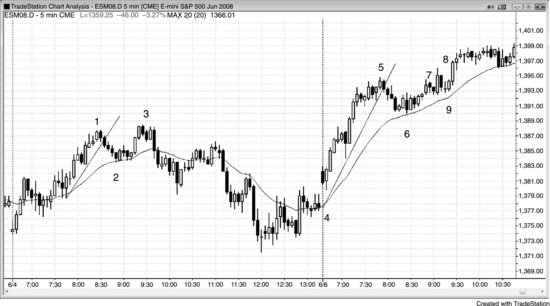

如图 9.12 所示，下跌到K线2和下跌到K线6都突破了主要趋势线，所以每次突破之后，都应该预期市场会出现对前高的两段式测试，从而形成好的做空建仓形态。K线3处的低2做空是成功的，可以在K线3下方入场，也可以在两根K线之后的二次入场点入场。

K线8处的做空不那么确定，因为测试高点的那根K线是一根大的多头趋势K线（几乎算外包K线，因为它的低点和前一根K线一样）。外包K线的传统入场方式是：在两端各设一个突破单，哪边先被触发就做哪个方向。但外包K线本质上就是一个单K线的交易区间，而大多数交易区间的突破入场都会失败。你应该很少在外包K线突破时入场，因为风险太大——止损要放在K线的另一端，而那根K线很长。既然这里是一个两K线反转形态，最安全的入场点是在两根K线中较低那根（即那根大的多头趋势K线）的下方，因为市场经常只跌破空头K线、却不跌破两根K线整体的低点——这里的走势正是如此。

如果你在K线8突破内包K线时做空，那么等到该K线收盘时你会感到不安——K线8收出十字星，说明多空双方都没什么把握。不过，大多数交易员不会做这笔空单，因为三根或三根以上的横盘K线中如果至少有一根是十字星，通常意味着不确定性太大（铁丝网形态）。外包K线之前的两根小K线足够小，效果接近十字星，所以最好等更多价格行为出现之后再做决定。但如果你没有在K线8做空，你应该意识到确实有不少人做了空，而入场K线收出十字星让这些做空者对自己的仓位感到不安。他们会急着平仓离场，从而变成被套在场外的交易者。他们很可能（概率60%以上）在K线8入场K线高点上方一个tick处买回空单，之后在看到更好的价格行为之前不愿再次做空。空头离场并买回仓位，意味着市场在他们出场的位置出现了买盘。在同一位置做多——也就是K线9，即空头入场K线上方一个tick处——至少应该够做一笔剥头皮交易，而且可能（概率60%以上）走出两段上涨。交易员可以在K线9上方一个tick处买入，也可以在K线9之后那根K线上方买入，因为K线9是一根多头趋势K线，构成一根不错的做多信号K线。

**图 9.13** 5个Tick的失败

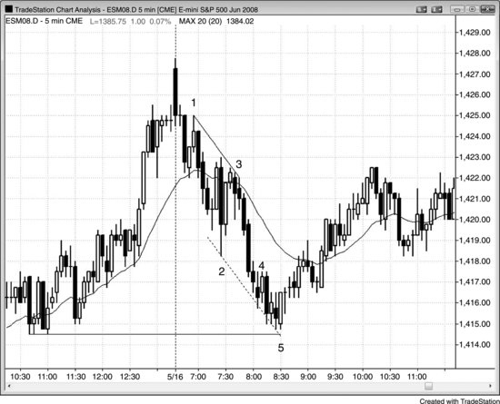

如图9.13所示，在将近两个小时里，做空剥头皮赚4个tick一直是个有效策略。但K线4的内包K线做空只跌了5个tick就反转上行了。这意味着很多空头的限价止盈单没有成交，他们会赶紧在盈亏平衡点平仓，更不用说在K线5上方了。市场当时正在测试前一天的低点，同时也是第二次探入趋势通道线下方（该趋势通道线基于K线1到K线3的趋势线）。多头一直在寻找做多的理由，而这笔做空剥头皮的失败，正是他们等待的最后一个信号。

**图 9.14** QQQ中的失败信号

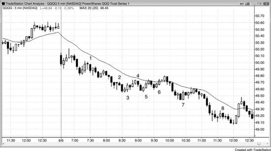

如图9.14所示，在这些5分钟QQQ交易中，每一笔都走了8到11个tick后才失败。保护性止损大致能让剥头皮者在盈亏平衡点附近出场，但忙活半天几乎没赚到什么。当然，其间也有不少盈利的剥头皮机会，但如果失败的交易太多，剥头皮就令人疲惫。这种疲惫常常导致交易员注意力下降，进而错过本该盈利的交易。在一个明显的空头趋势日里，最好的做法是只做顺势交易，专门找低2建仓形态做空，尤其是在均线附近。这样胜率会很高，有助于保持良好的交易心态，持续入场，最好至少用一部分仓位做波段。

**图 9.15** 切换到更小的目标

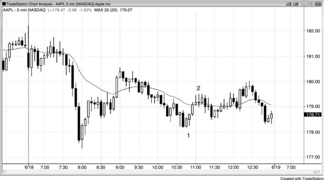

AAPL通常能提供$1.00的剥头皮空间（走势幅度通常超过$1.00，允许剥头皮者用$1.00的限价单获取部分利润）。但如图9.15所示，K线2只在K线1上方的入场点之上走了93美分就停住了，随后形成了一个低2做空建仓形态。这个低2意味着市场两次都未能达到目标。在市场基本横盘、且差一点就够$1.00剥头皮目标的情况下，交易员很可能（概率60%以上）会把止盈目标缩小到50美分左右。后来这笔交易跌了61美分，他们可以在此获取部分利润。

**图 9.16** 空头急速下跌可能是买入机会

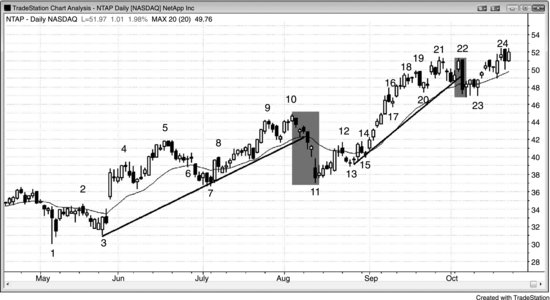

如图9.16所示，NetApp Inc.（NTAP）在日线图上的多头趋势中两次大幅打折，交易员都果断买入了这种急跌。仅仅因为出现了一波强力的急速下跌跌破趋势线，并不意味着趋势就此结束。大多数反转尝试看上去都很有气势，但大多数都会失败。正因如此，有经验的交易员会在急跌中积极买入，即便是在空头急速下跌的底部也是如此。K线11处于一波16%抛售的底部，但它仍然是一个更高低点，并与K线7构成双底牛旗。由于下跌通道持续了很多根K线，更稳妥的做法是等K线13的更高低点出现后再买入，或者在K线14的低2建仓形态突破时入场——那个低2本身是一个失败的双顶熊旗。

K线22是一根非常强的空头趋势K线，一路跌到均线，但从K线15涨到K线19的那波上涨也非常强劲。这根空头趋势K线可能（概率60%以上）是某条吓人的新闻导致的，但单独一根强空头趋势K线不足以构成反转。大多数时候，它会失败并带来新的趋势高点。多头认为先出现交易区间然后创新高的概率大于反转成功的概率，于是在这根K线底部买入。它的低点同时与K线20形成双底，很可能（概率60%以上）成为交易区间的底部或双底牛旗的底部。这根空头K线之后的跟随很弱——接下来四根K线重叠横盘，而且影线明显。这不是空头反转该有的样子，空头因此买回了他们的空单。空头的回补加上多头在这里的买入，共同推动市场创出了新的趋势高点。

**图 9.17** 大多数趋势反转尝试都会失败

当多头趋势像图9.17中SPY 60分钟图那样强劲时，趋势本身具有惯性，会抵抗各种试图终结它的力量。过于急切的空头看到一根强空头急速跌破均线和趋势线，就以为市场即将反转进入空头趋势。多头则把每一次空头急速都视为买入建仓的机会。他们清楚，仅凭一根强空头急速不可能完成一次成功的反转。他们相信每一次反转尝试都会失败——因为大多数确实如此——市场还会继续走高，所以他们渴望在回调时买入。SPY每次只不过下跌1%到2%，多头就迅速买入，因为他们知道这种打折不会持续太久。很多急速下跌其实是真空效应造成的：多头想在回调时买入，但当他们觉得市场还会再跌一点时，就暂时按兵不动。这让空头得以快速把价格打下去。一旦跌到足够低、多头认为不会再跌了，他们就像凭空出现一样大举买入，压倒了空头。空头不得不回补空单，进一步推升了反弹，结果那根巨大的空头急速K线完全没有后续跟随。

这些急速下跌在形成过程中看起来很吓人，但如果交易员理解了背后的逻辑，反而会在底部积极买入。如果不想承担巨大的隔夜风险，可以在每次空头急速的底部买入看涨期权，然后在几天后价格创新高时止盈。

**图9.18** 失败有时反而是强势的信号

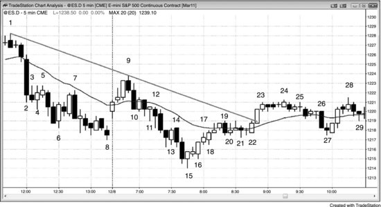

如图9.18所示，从K线15启动的更低低点（LL）主要趋势反转（MTR）向上突破力度很强，可能（概率60%以上）至少有两段上涨。不过，涨到K线19时未能触及空头趋势线。价格推到均线上方，离趋势线已经足够近，进入了它的磁力范围。这让交易员有信心在K线22的高2建仓形态处买入，因为他们预期市场会测试并突破趋势线。

K线4是一根出现在强空头急速之后的多头反转K线。这波急速足够强，让交易员确信市场处于始终持仓做空状态，因此他们寻找机会在反弹时做空。由于他们不认为K线4会引发一波有力的反转，很多空头在K线4的高点及上方挂了限价卖单。有些交易员急于做空，甚至在K线4高点下方1个最小变动价位的位置就开始卖出。市场始终没有突破这根多头信号K线的高点，说明空头很强。随后市场跌破了K线5低2做空信号K线的低点。类似的情况也出现在K线10后面那根K线的高点处，以及K线11、13和26处。K线18则是多头方面的对等案例：交易员太急于做多，在K线18前面那根K线的低点及下方挂了限价买单，而最激进的多头把限价买单挂在K线18低点上方1个最小变动价位的位置，可能（概率60%以上）只有他们成功入场了，其他人只能追高买入。

K线27在K线21低点上方1个最小变动价位处就拐头向上，没有形成完美的双底牛旗。这说明积极的多头在市场从K线24高点下跌的过程中，已经在K线21低点上方1到2个最小变动价位的位置挂好了限价买单。他们太急于做多，不想冒限价买单在K线21低点及上方1个最小变动价位处无法成交的风险。相反的情况出现在K线7处——它在K线5高点下方1个最小变动价位就拐头向下。K线7没有触及K线5的高点，是因为空头急于做空，把限价卖单挂在了均线下方2个最小变动价位的位置，而不是下方1个最小变动价位。这导致该K线的高点未能触及均线，是强空头趋势的信号。

K线15底部之后的低1未能带来新的空头低点，说明向上反转的力度很强。

**图9.19** 差一点没触及目标随后才触及

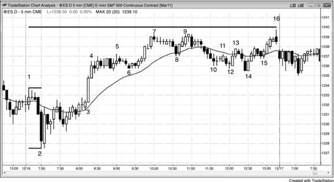

当存在一个相当明显的测量移动目标，市场已经接近到足以感受到它的磁力吸引、但又不够近到让交易员认为已经充分测试时，市场往往会先回调，然后再做一次更有说服力的测试。如图9.19所示，当天Emini呈现趋势性交易区间走势，明显的测量移动目标是基于开盘区间向上的测量移动。K线7和K线9距离目标仅差3个最小变动价位，但大多数交易员不会认为测试已经完成，除非市场距目标在1个最小变动价位以内。测试未能触及目标，但已经足够接近，让交易员相信这个磁力正在影响价格行为。交易员想观察市场是在测试后回落，还是会突破目标继续上涨。市场回调到K线14的小型扩张三角牛旗后，在当天最后一根K线测试到了距目标1个最小变动价位以内的位置。顺带一提，如果测试超过测量移动目标4个最小变动价位以上，通常（概率60%以上）意味着市场已经不在意这个目标，正朝着更高的目标前进。

K线14同时也是一个更大的楔形牛旗的信号K线，其中K线8是第一次下推，K线10或K线12构成第二次下推。有些交易员认为旗形在K线12处就结束了，但K线10和K线12之间的距离跟K线8和K线10之间的距离相比太小，很多交易员不确定回调是否真的结束，这导致了最后一次向下推至K线14形成更低低点。

从K线14起的三根K线多头急速突破了前一根60分钟K线（图中未显示）的高点1个最小变动价位。当市场在两根K线后以5分钟楔形熊旗的形式反转下跌时，60分钟交易员在犹豫这是不是一个60分钟级别的1个最小变动价位多头陷阱。有些60分钟交易员在前一根60分钟K线高点上方1个最小变动价位处用突破单买入，现在市场正在掉头向下。不过，绝大多数时候，当60分钟图上出现一个正在发展中的1个最小变动价位失败突破时，市场会在60分钟K线收盘前反弹回到该失败突破上方。结果就是，虽然这个1个最小变动价位的失败突破在5分钟图上持续了好几根K线，但等60分钟K线收盘时它就从60分钟图上消失了——这里正是这种情况。60分钟K线在K线15后面那根K线收盘，该60分钟K线的最终高点比前一根60分钟K线的高点高出3个最小变动价位。
