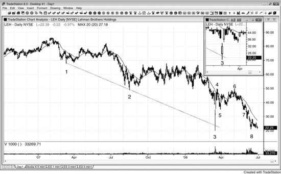
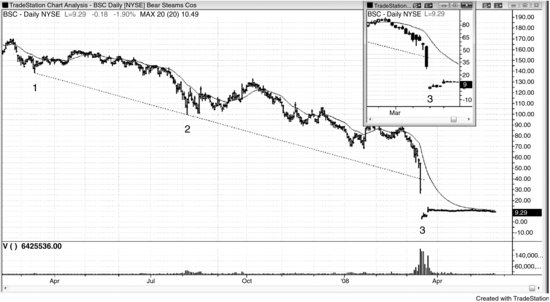

当一只股票在日线图上处于陡峭的空头趋势中，某一天突然出现5到10倍于近期均量的成交量时，多头很可能（60%+）已经彻底投降，一个可交易的底部很可能（60%+）已经形成。这根巨量K线往往伴随跳空低开，如果收盘形成一根强多头K线，做多盈利的概率还会进一步提高。交易员未必在刻意寻找多头反转机会，但在一轮高潮式抛售之后，市场大概率（60%+）至少会走出两段式反弹、至少触及均线，足以让他们做一笔持续数天到数周的盈利交易。

顺带一提，当1分钟Emini图表处于强空头趋势时，如果出现一根巨量K线（大约25000张合约），这不太可能（≤40%）是空头趋势的终结，但往往预示着回调即将到来——通常（60%+）是在出现一到两个成交量递减的更低低点之后（量价背离）。你基本上不应该在日内图表上看成交量，因为在5分钟图上成交量的预测价值并不可靠，而5分钟图才是你主要用来交易的图表。

**图10.1** 巨量反转

有时市场会在巨量交易日反转上涨。如图10.1所示，雷曼兄弟（LEH）在K线3大幅跳空低开，随后跌破空头趋势通道线（由K线1和K线2连线画出），但尾盘强劲反弹收涨。当日成交量是前一日的3倍，大约是过去一个月均量的10倍。由于这根多头趋势K线非常强（在K线图缩略图中看得更清楚），收盘时买入是合理的；更谨慎的交易员则会等到价格突破这根潜在信号K线的高点后再入场。次日市场跳空高开，交易员可以在开盘时买入，也可以等价格回测后在日内新高时买入，或者在5分钟图上等待一波下跌、当回补缺口的尝试失败后买入反转上涨。这种强度几乎总是会带来至少两段上涨（第二段涨至K线6的上涨发生在K线5缺口回测形成的更高低点之后），并穿越均线。

K线4和K线6形成了一个双顶熊旗。

K线7试图与K线5形成双底牛旗，但结果是在3根K线之后产生了一个突破回调做空入场点。

截至图表上最后一根K线，市场正在测试K线3的低点，试图守住下方的止损位并形成双底。数月后，LEH破产倒闭。

**图10.2** 巨量但未反转

大跌日出现巨量并不保证会反弹。如图10.2所示，贝尔斯登（BSC）在一个周五走出了一根巨大的空头趋势K线，成交量大约是平日的15倍。过去两周里，该股已经跌去了大约70%的市值。但当天成交量仅是前一天的大约1.5倍，而且只有极小的多头影线。价格行为对多头不利，因为跌破空头趋势通道线后并没有出现反转。实际上，这根巨大的空头趋势K线远远收在趋势通道线下方，说明空头趋势通道线未能包住空头趋势，趋势力度极强。周一（K线3）开盘时股价又跌了80%，但成交量略有下降。那些在周五收盘买入的交易员，以为高潮式底部已经到位、认为全美第五大投行和券商不可能再跌了——到了周一就遭受了沉重打击。在没有看涨价格行为配合的情况下，单凭高潮式成交量不足以作为做多一段强空头趋势的理由。

这张图的时间跨度与前面LEH那张图相同。不同之处在于，LEH直到周一才跌破空头趋势通道线（K线3），并在当天巨量反转上涨；而BSC这张图上巨量日早了一天，同样跌破了空头趋势通道线，但当天收在接近最低点的位置，没有任何看涨的价格行为。K线3同样跳空低开（两只股票的K线3都是周一），但LEH强劲反弹，BSC却几乎涨不动。BSC的K线3仍然是跌破空头趋势通道线之后的一根多头反转K线，但如果交易员要在LEH和BSC之间选一只在当天买入，显然更愿意买LEH，因为它的多头反转K线强得多。即便交易员在BSC的K线3高点上方1 tick买入，接下来3天也能赚到超过100%的利润，但LEH显然是一个确定性更高的做多选择。

这张图表打印之后，BSC被摩根大通（JPM）以远低于几个月前市值的价格收购。
