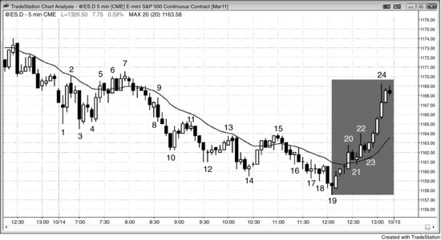
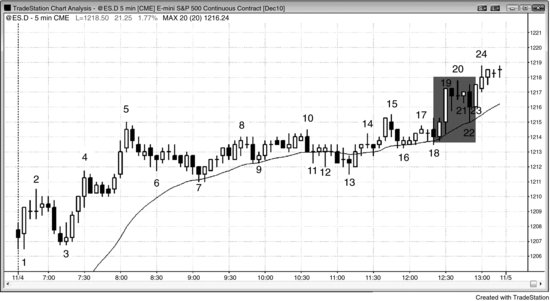
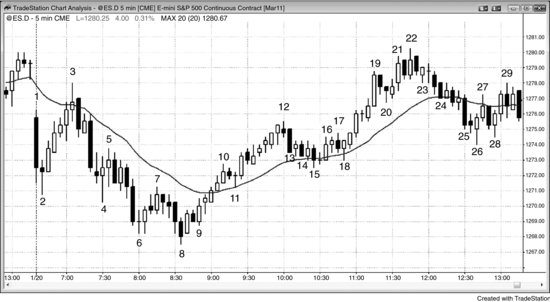

交易日可以分成三段。价格行为原则全天通用，但每一段都有一些值得了解的一般性特征。任何类型的价格行为在一天中任何时候都可能出现，但开盘后的头一两个小时，最容易找到盈亏比达到 2:1 甚至 3:1 的交易机会。这是一天中最重要的时段，对大多数交易员来说，也是最容易赚钱的时段（不够谨慎的话，也是最容易亏钱的时段）。大多数交易员都应该在开盘后一两个小时内全力寻找交易机会，因为这段时间的交易者方程——回报、风险、概率的组合——是全天最好的。正因为它如此重要，第三部分的章节会详细讨论。太平洋时间早上 7:00 常有经济数据发布，经常会引导出当天的趋势方向。计算机在分析速度和下单速度上占有明显优势，而它们就是你的对手。对手优势巨大的时候，不要硬拼。等它们的优势消失后，再在速度不再重要的时候入场。一旦 Always-in 的方向确立，就顺着趋势方向交易。即使错过了头一两根K线，只要趋势足够强，行情里还有大把利润空间。

在日线图上，强多头趋势K线下方和强空头趋势K线上方常常会出现短小的影线。这些影线往往是开盘反转造成的。举个例子，如果多头判断当天可能(60%+)是强多头趋势日，而开盘后头几根K线市场下跌了一段，大部分多头会认为这里可能(60%+)就是当天的最低点，是一个很快就会消失的绝佳低吸机会。如果判断正确，市场就会上涨，他们就在当天最低点附近买到了。在日线图上，这根多头趋势K线的底部会留下一小段影线，正是开盘那几根K线下跌形成的。这些聪明的交易者提前就做好了准备，用极小的风险换来了巨大的回报，而且这笔交易成功的概率至少有 50%（因为根据市场整体特征，他们判断当天可能(60%+)会上涨）。

盘中的中间时段，大约从太平洋时间 8:30 到 9:30 开始，到 11:00 至 11:30 结束，有时延续到 12:30，更容易出现双向交易，比如交易区间或通道。窄交易区间最常出现在这个时段。窄交易区间对用突破单入场来说是非常糟糕的环境。在强烈的双向市场中，市场稍微一跌，买方就进来接手。所以在窄交易区间里用突破单在市场下跌时做空，恰恰跟机构的操作相反。买方包括两类：

- 在盈利的空头头寸上获利离场的空头
- 买入做多头剥头皮的多头

在区间顶部，情况正好相反，卖压占主导：

- 多头在盈利的多头剥头皮仓位上平仓
- 空头卖出开仓做空头剥头皮

波段交易者也有参与，但整体来看，当市场处于交易区间——不管是不是窄交易区间——大部分成交量都是剥头皮，机构在做低买高卖。作为交易员，最好的赚钱方式就是跟机构做一样的事：如果你要在交易区间里交易，就去做剥头皮，低买高卖。有经验的交易员会在区间顶部用限价单在弱高 1 和高 2 买入信号K线的上方做空，在区间底部用限价单在弱低 1 和低 2 信号K线的下方做多。限价单交易更难准确评估，初学者应该避免使用。用突破单入场时要非常谨慎：只在区间顶部、市场开始转跌时用突破单做空，只在区间底部、市场开始转涨时用突破单做多。市场总是快速冲向区间的顶部和底部，引诱抱有希望的初学者在顶部追涨买入、在底部杀跌卖出。这些初学者只看到急速上冲和下冲的力度，却忽视了过去 20 根K线形成的交易区间，结果做出了跟机构完全相反的操作。这个时段的很多建仓形态只适合剥头皮，而大多数交易员靠剥头皮无法维持生计，所以在这个时段应该非常挑剔。当天的最高点或最低点大约有 90% 的概率出现在全天的前三分之一时段内，所以中间三分之一时段通常是交易员在判断开盘后的初始趋势到底会延续还是反转。多头和空头都在积极博弈，争夺控制权，各自试图推动出一波延续到收盘的趋势。市场常常在太平洋时间 8:30 左右反转，然后在中间时段剩余的时间里持续运行。交易员需要意识到，开盘后形成的趋势未必能持续全天，开盘后头几个小时之后，完全相反的走势随时可能出现。

新手往往在日内中间时段亏钱，亏掉的金额经常比上午头两个小时赚到的还多。如果确实如此，那么除非出现特别强的信号，否则中间时段就不该交易。很多交易员在开盘头两个小时赚到大部分利润，之后要么大幅减少交易，要么干脆不做了。打个比方：你开了两家店，一家很赚钱，另一家怎么折腾都在亏，而且亏的经常比赚的还多——你还会继续开那家亏钱的店吗？答案不言自明。你可以把上午和中间时段看作两家店，关掉那家亏钱的就好。你的目标是赚钱，不是全天都在做交易。如果全天的价格行为都很好、你也不累，当然应该一直做下去，但通常不是这样。中间时段双向交易更多，常见通道、窄幅交易区间、频繁反转、趋势K线缺乏跟随，以及大量十字星。除非交易员用突破单入场时非常精挑细选，或者有能力用限价单做逆势押注失败的交易来获利，否则就该等到价格行为变得更可预测再说。宁可不做，也不要做那些亏损大于盈利的交易。新手经常赢得刚刚够多，足以让自己一直这么干下去，心想只要积累经验就行了。然而不管经验多丰富，窄幅交易区间永远都很难做。几乎总是应该等到 Always-in 方向明确了再出手，这样跟随的概率才够高，才能支撑一笔盈利的交易。

日内三个时段往往形成趋势恢复形态。比如市场在头两个小时下跌，然后反弹到大约太平洋时间上午 11:30 左右，之后可能再次下跌，恢复上午那段的空头趋势。有时候这个模式很清晰——上-下-上或者下-上-下，但更多时候没那么明显，尽管这种倾向依然存在。正因如此，很多交易员会把中间时段里逆转上午走势的那段行情，仅仅看作初始趋势的一个潜在回调，然后关注原来的趋势是否在 11:30 左右恢复，一旦出现恢复的迹象就会入场。即使在形态不太清晰的日子里，交易员也知道市场经常在 11:30 左右产生某种走势，而且这个走势往往会延续到收盘，因为机构在那个时候开始最后一轮交易。这个走势可以是反转，也可以是突破。比如头两个小时大幅下跌，然后弱弱地反弹到 11:30，看起来像是在见顶回落，结果市场反而向上突破，形成趋势反转日，一路涨到收盘。交易员在进入 11:30 之前不会锁定某个方向，而是随时准备好应对任一方向的走势，因为市场即将进入最后三分之一时段，机构也开始了最后一轮交易。

最后一个时段一直持续到收盘。它经常恢复当天早些时候的趋势，形成趋势恢复日，但有时也会反转趋势、形成反转日。如果日线图上处于强多头趋势，大多数日子的收盘价会高于开盘价，市场通常会在最后 30 到 60 分钟尝试上涨；空头趋势中则相反，更多日子的收盘价低于开盘价，临近收盘时经常下跌。

在最后 30 到 60 分钟里，交易员应该留意两种截然不同的价格行为，因为每种都带来机会——前提是你做好了准备；如果没准备好，每种也都会带来麻烦。第一种：在最后半小时里，市场有时会出现一轮猛烈的趋势，原因是风控主管要求交易员在收盘前必须平掉亏损头寸。动量程序检测到强趋势后也会不停地顺势交易，只要动量还在延续就不会停。有些日子里，很多共同基金在临近收盘时也有类似的订单要执行。想等回调入场的交易员会被套在场外，因为回调根本不来。如果你看到这种情况，就在当前K线收盘时顺势入场，保护性止损放在K线的另一端。趋势若延续到收盘，你能快速赚到一笔丰厚的利润。值得一提的是，交易员经常会累，而他们的优势本来就很小，状态不好时就不应该勉强交易。一天中任何时候，交易员都可能变得疲惫、无聊或分心，只有恢复正常状态后才应该继续。电脑不会累，临近收盘时的交易表现跟全天一样好，这是电脑相对于个人交易员的又一个优势。

日线图处于多头趋势时，多头趋势K线几乎总是比空头趋势K线多；空头趋势时则相反。比如，日线处于强空头趋势中，尾盘前出现了一波温和反弹，很多交易员会预期当天收在低点附近，日线最终形成一根收盘接近最低价的强空头趋势K线。正因如此，有经验的交易员一旦看到反弹开始掉头向下，就会迅速做空，预期当天收在低点附近。另一些交易员则会等到跌势明确后再做空。结果就是，日线处于空头趋势时，空头趋势日的尾盘往往出现一波强劲的杀跌。日线处于多头趋势时则相反，大部分K线收在高点附近，尾盘前即使出现一波下跌，市场也往往在最后一小时内重新走高。

另一种尾盘走势对交易员来说更棘手——它不会把你踢出盈利头寸，反而倾向于让你止损出场。市场确实在朝收盘方向运行趋势，但K线实体大、影线长，中间还有两三次来回反转打止损，不过都没有触及信号K线之外的原始止损位。如果你判断的趋势方向没问题，市场确实在形成带长影线的K线，那就可以做波段交易，坚持持有、不动原始止损，等回调结束后再把止损收紧到回调极值点之外——这样是能赚到钱的。

每当有经济报告发布，不管是太平洋时间上午7点的房地产数据，还是上午11:15的美联储声明，进出场时都很容易出现滑点，导致实际风险往往偏大、回报往往偏小。而且概率也只有50%。这样一来交易者方程就很差，大多数交易员应该等上几秒到几分钟，等市场恢复有序后再下单。

**图 11.1** 风控经理助推尾盘趋势

如图 11.1 所示，尾盘的反弹部分归因于风控经理的"拍肩膀"干预。当市场开始转涨并运行到K线22时，所有在K线10之后做空的交易员都面临头寸在收盘时变成亏损的风险，而在K线16之后做空的交易员已经处于亏损状态。交易公司的风控经理会监控交易员在收盘时持有什么头寸。如果很多交易员持有的空头头寸突然转为亏损，他们可能因为情绪上不愿认错而死扛着，期盼尾盘再来一波杀跌。他们的奖金取决于业绩表现，可能很不愿意承认自己对今天空头趋势的判断突然错了。风控经理的工作就是冷静客观地做判断，他会要求交易员平掉空头头寸。如果足够多的公司同时这么做，就会推动尾盘形成一波持续不断的上涨。在家交易的人一直在等回调做多，但回调始终没来。一旦意识到发生了什么，他们可以在K线21和K线23处短暂回调的上方买入，或者在任意一根K线收盘时买入，然后把保护性止损放在入场K线低点下方。动量程序检测到持续的买盘后也会开始买入，只要上涨动量保持强劲就会一直买入。共同基金和对冲基金在收盘前的买入操作也会起到推波助澜的作用。当市场在尾盘杀跌时，所有这些交易者所做的事情正好相反。

日线图上市场处于窄幅多头通道中（图中未展示）。过去32天里只有2天收在当天低点附近，其中21天收盘价高于开盘价。在日线的多头波段中，大部分K线都是阳线实体，交易员们都急于在尾盘反弹中买入。

开盘后头几个小时市场处于交易区间中；该区间大约是日均波幅的一半，提示交易员可能出现突破并演变为趋势性交易区间日。当市场从K线7与K线2构成的双顶向下运动时，交易员越来越倾向于认为突破方向向下，卖压随之增大。市场随后形成了一个更低的交易区间，接着从K线15这根均线缺口K线处再次下跌、向下突破，但又反转上涨回到开盘价上方。记住，大多数反转日一开始都是以趋势性交易区间日的形式展开的。

正如常见的情况，日内中段市场横盘整理，然后K线7到K线10的空头趋势在最后三分之一时段试图恢复。但向下突破失败了，K线10到K线16的交易区间成为了空头趋势中的最终旗形。

**图 11.2** 尾盘趋势可能令人恐惧

即使你对尾盘趋势方向的判断是对的，只要收盘前出现了几根十字星，你仍然可能亏钱。如图 11.2 所示，K线 19 之前出现了两根强多头趋势K线，形成了一波急速上涨，后续大概率会有跟随，但做多的保护性止损至少要放在这段急速走势的下方，或者至少放在第二根大多头趋势K线的低点下方。一旦市场在K线 20 附近开始出现十字星，就有急跌回调的风险。如果你是在K线 16 上方买入的，可以把止损收紧到K线 20 下方，或者移到盈亏平衡点。但如果你是在K线 19 急速拉升收盘价买入的，或者在K线 21 十字星上方买入的，止损就必须放在急速走势那两根K线低点的下方，至少也要放在K线 19 下方。影线是一个警告信号，说明市场已经进入多空双方来回拉锯的状态。如果你在这种环境下交易——只有非常有经验的交易员才应该在尾盘进入窄交易区间后还考虑持仓——就必须按波段交易来做，容忍双向波动，用宽止损。

这是一个趋势恢复日：大约在当天前三分之一的时间里出现一波上涨，到K线 5 结束，然后日内中段进入交易区间，尾盘多头趋势恢复并延续到收盘。最后一波上涨从太平洋时间上午 11:15 开始，不过向上突破要到下午 12:30 才出现。

**图 11.3** 日内中段反转

当天趋势在开盘后大约一小时内确立之后，市场经常在日内中段（大约三分之一时间段）开始时发生反转，大概在太平洋时间上午 8:00 到 9:30 之间（通常在 8:30 左右）。有时候市场不会反转，而是进入持续几个小时的交易区间，然后在最后一两个小时向某个方向突破。这种突破既可能形成趋势恢复日，也可能形成反转日。如图 11.3 所示，K线 8 到K线 12 的上涨力度非常强，早盘的空头趋势无法在日内最后三分之一时段重新主导。相反，K线 17 试图将市场推低的这波弱势尝试失败之后，K线 8 到K线 12 的上涨趋势恢复向上。多头恢复上涨始于K线 18 的回调——它回到了均线附近，同时也是从K线 12 到K线 15 楔形牛旗的回调。不过多头未能延续涨势，市场回落到开盘价附近，在日线图上形成了一根十字星。

K线 3 是对均线的测试，也是与K线 1 构成的双顶，因此可能是当天的最高点。交易员当时关注的是开盘区间底部的突破，预期突破后出现大约一个测量移动幅度的下跌。结果市场急速下跌到K线 4，之后又出现了两次下推，形成了一个空头急速与通道趋势，其中通道部分是楔形。交易员把这看作日内中段开始时可能向上反转的机会，也是潜在的当日最低点。买入信号出现在以K线 8 开始的两K线反转形态上方。很多交易员认为市场在K线 9 这根外包阳线时已经翻转为 Always-in 做多，大部分交易员在K线 10 多头急速走完时确认市场已经转多。
