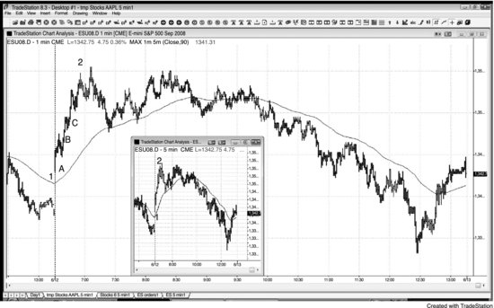
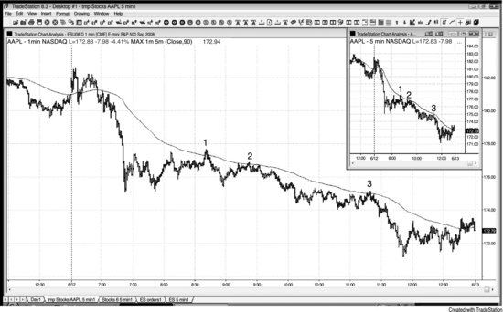
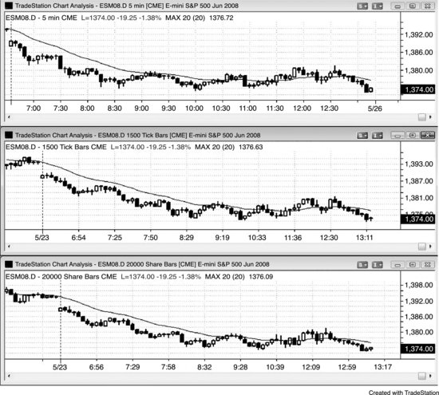
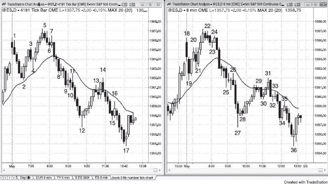
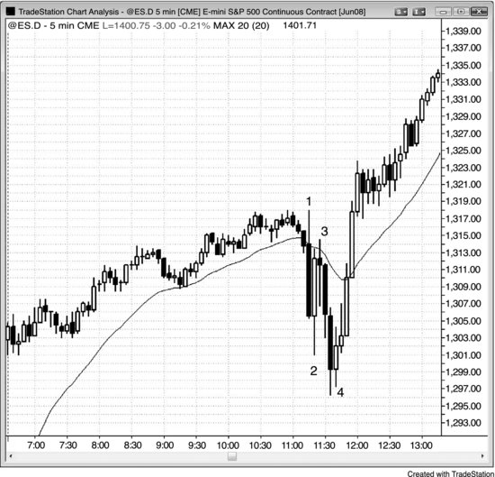
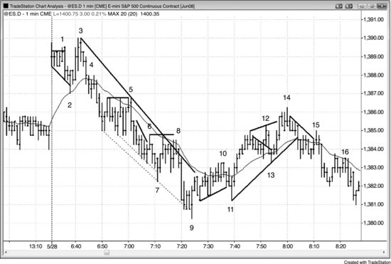

对剥头皮交易者来说，Emini 最好用 5 分钟K线图。但如果是做 Emini 或个股的日内波段交易，简单的 5 分钟线段图就够了。原因在于：在笔记本电脑或单显示器上，你可以同时放 6 个线段图，每个显示一只不同的股票，而且每个图都能容纳一整天的K线。如果换成K线图（蜡烛图），由于每根K线比线段更宽，屏幕上就只能显示大约半天的价格行为。之所以特意提这一点，是想提醒交易员：这套方法用简单的线段图同样好用，尤其当你只想做最好的波段交易入场时。K线图对 Emini 剥头皮交易者的好处在于，可以快速看清每根K线属于多方还是空方，特别是建仓K线。此外，很多高/低 2 的变体在线段图上不容易辨认。

价格行为交易技术适用于所有市场和所有时间周期，因此交易员首先要做一个最基本的决定：交易哪些市场、用哪个时间周期。大多数交易员的目标是长期收益最大化，这意味着每个人都需要找到一种适合自己性格的方法。

假设 5 分钟 Emini 图每天平均有十几个好的入场机会，3 分钟图有 20 个，1 分钟图有 30 个；而保护性止损的风险分别是 5 分钟 8 个 tick、3 分钟 6 个 tick、1 分钟 4 个 tick——那为什么不去做更短的时间周期呢？交易次数更多、风险更小、赚得更多——对吧？没错，但前提是你能在实时行情中足够快地读懂图表，能在精确的价位正确下达入场单、止损单和止盈单，而且能一天 7 小时、年复一年地持续做到这一点。对很多交易员来说，时间周期越短，错过的好交易反而越多，胜率也越低。他们根本没办法在 1 分钟和 3 分钟图上用这套方法快速剥头皮，盈利还不如用 5 分钟图。所以 5 分钟图才应该是他们的重心，同时不断努力加大仓位。最好的交易机会往往出其不意，建仓形态看起来让人不太敢信。大多数交易员就是来不及处理这些信息——他们几乎必然会挑三拣四，偏偏漏掉那些最好的建仓形态，而那些才是对最终盈亏最关键的。最好的交易往往形成和触发得非常快，一眨眼就错过了，剩下的全是质量较差的交易，包括所有的亏损单。

高时间周期图表上一波行情的平均幅度大于低时间周期图表。不过，几乎每一波高时间周期的波段都是从 1 分钟和 3 分钟图上的反转开始的。问题在于，很难判断哪些反转能真正走出来，而且一天做 30 笔以上的交易、每笔都期待大行情，实在让人精疲力竭。1 分钟和 3 分钟图上最好的交易，最终会在 5 分钟和 15 分钟图上形成强有力的入场点。对大多数交易员来说，集中精力做 5 分钟图上最好的交易、同时不断加大仓位，才是更赚钱的做法。一旦能稳定盈利，收入会非常可观，而且胜率高、压力小，更容易长期保持状态。

还有一点，随着仓位不断增大，到了一定程度，你的交易量会在 1 分钟图上影响到市场。举个极端例子：假如你挂了一笔 5000 手 Emini 的止盈限价单，位置在市价上方 2 个 tick，任何盯着价格阶梯的人都会看到这个异常。而你一天做 10 到 15 笔交易，很难每次都成交。同样，以这种规模用突破单入场，滑点会有 1 到 2 个 tick，足以毁掉剥头皮的盈亏比。交易员用价格行为方法完全可以做到每笔 5000 手，但不能靠大多数交易所需要的那种剥头皮入场和出场技巧来实现。希望你将来也能遇到这样的"烦恼"——因为交易量太大而不得不重新调整方法！

1 分钟图在两种情况下有用。第一种，如果 5 分钟图正处于逃逸趋势中，你还没有仓位但想进场，可以在 1 分钟图上找高/低 2 回调顺势入场。第二种，对经验丰富的交易员来说，1 分钟图可以辅助在 5 分钟图上做趋势股票的波段交易。当股票处于趋势状态时，价格对均线非常敏感，交易员可以在均线附近利用高/低 1 或高/低 2 建仓形态顺势入场，止损幅度设为信号K线的高度。要缩小这个风险，可以切换到 1 分钟图，等 5 分钟图上价格触碰或穿越均线后，在 1 分钟图上出现的第一个反转信号处入场。如果在 1 分钟图上叠加 5 分钟 20 周期均线，就能很快看到价格触碰均线的位置，然后下单。实际操作中，你需要在 1 分钟图上画一条 90 周期均线来替代 5 分钟的 20 周期均线。为什么是 90 而不是 100？因为 1 分钟图的均线在每根 1 分钟K线收盘时都会重新计算，而不是每 5 根才算一次，近期K线的权重会让 100 周期均线稍微偏平。另外，1 分钟图上最初的 4 根收盘价并不包含在 5 分钟均线的计算中。为了修正这个偏差，用 90 周期均线（我用的是 EMA，但用任何均线都可以），它跟 5 分钟 20 周期均线非常接近。实际交易中，你很少有时间去看 1 分钟的股票图表，因为注意力都集中在 Emini 上。不过，当一只股票趋势很强时，偶尔可以在 1 分钟图上快速入场。

上面的讨论隐含了一个重要概念：不同时间周期上可以同时存在方向相反的趋势。比如，市场过去几周一直在强势上涨，但最近两天走出了一个空头趋势通道，而过去 15 分钟价格正在向下行的 5 分钟均线回调。这时，5 分钟图是空头趋势，1 分钟图是多头趋势，而这两天的下跌在 60 分钟图上可能（60%+）只是一个牛旗。同时，日线图可能（60%+）是看空的，月线图却是看多的。试图把所有这些调和起来只会让人困惑，而等所有时间周期都朝同一个方向再下手，纯粹是浪费时间——这种情况很少发生，即使发生了也不保证能赚到钱。选定一个时间周期，交易眼前的价格行为就够了。只要能正确解读行情、好好执行，不看其他图表一样能做得很好。

很多交易员用的是基于成交量而非时间的图表。比如，Emini 图表可以设置为每满 5,000 个 Tick 或每成交 25,000 手合约就收一根K线。用哪种图表类型并不重要，关键是你能适应那个速度——在那个节奏下看图、下单都觉得舒服就行。所有图表上的形态都源于人的行为模式，本质上是一样的。基于时间的图表上趋势线往往更精确，但很多交易员并不追求精确的趋势线，用大概的位置就够了。

我有一些朋友用基于斐波那契数列的 Tick 图，还有一些朋友用不常见的时间图，比如 8 分钟或 13 分钟。什么方法都有行得通的时候，但只盯一张图操作起来更简单。不管是 Tick 图、成交量图还是时间图，也不管每根K线包含多少 Tick、多少手或多少分钟，一整天下来所有类型的图表上都会出现大量优质的价格行为信号。远比图表类型重要的，是交易员实时解读行情和正确管理交易的能力。你可以随便试各种 Tick 数、成交量或分钟数，会发现图表看起来都不错，合理的信号到处都是。我个人偏好 5 分钟图，原因有几个：

- 趋势线和趋势通道线通常（60%+）很精确
- 每天有足够多的建仓形态
- 我能看到K线快要收盘的时机，提前准备交易

Tick 图或成交量图有个问题：几秒钟内涌入一大波成交，K线会比预期提前收盘，结果我发现自己漏掉了太多好信号——那些在收盘后回看图表时一目了然的信号。而且趋势线的精确度也会下降。另外，用 Tick 图或成交量图的交易员往往倾向于选择更低时间级别的图表，目的是缩小止损幅度，指望通过降低风险来实现盈利。他们必然忽略了一个代价：胜率也会下降，最终反而亏钱。

**图 13.1** 用K线图做波段交易

像图 13.1 这样的简单K线图，用来做价格行为波段交易已经完全够用了。在趋势中，找回调顺势入场即可——多头趋势里找高 2，空头趋势里找低 2。此外，当一条强趋势线被突破后，可以在回测时寻找逆势入场机会，比如在大概率（60% 以上）形成新多头趋势的行情中寻找更高低点或更低低点，前提是出现了一根强反转K线。

**图 13.2** 1 分钟图上的回调

如果 5 分钟图上没有回调，而你又不知道该怎么做多，可以看看 1 分钟图（见图 13.2）。5 分钟 Emini 缩略图显示，从开盘起价格直拉了 11.75 个点，中间没有任何回调。如果交易员错过了开盘时启动的趋势做多机会，就会彻底踏空整个波段，因为根本没有回调入场点。然而，如果他们去看 1 分钟图，就会发现有三个高 1 建仓形态（K线 A、B 和 C），都可以做多入场。激进的多头会在 1 分钟图上用限价单挂在前一根K线的低点买入，预期每次反转尝试都会迅速失败。一旦做多成功，他们就会切回 5 分钟图管理持仓，不再看 1 分钟图，否则突然会觉得那些走势看起来像是可以做空的反转形态。看 1 分钟图只有一个目的——找高 1 和高 2 的做多入场点，因为 5 分钟图上没有回调。在 1 分钟图上做逆势交易只会让你亏钱。实际上，那三个做多建仓形态所在的位置，恰好就是 1 分钟图上做空者会平仓的价格，而他们平仓回补本身就构成了额外的买方力量，推动市场继续上涨。

**图 13.3** 1 分钟图上的均线回调

如图 13.3 所示，这是 AAPL 在一个强空头趋势日的 1 分钟图，在 90 周期指数均线（相当于 5 分钟图的 20 周期 EMA）附近提供了三次不错的做空机会，风险很小（仅一根K线的高度）。缩略图展示的是 5 分钟图上强势的急速与通道空头趋势。大多数交易员只看一张图就够了，不必费心去看 1 分钟图。1 分钟图上各种小波动很容易让人着迷，结果反而忽略了 5 分钟图上的大局，最终赚到的 Tick 数少得多。新手特别容易过度交易、过早出场、不让利润奔跑，最后即便全程做空方向正确，还是亏钱。

**图 13.4** 成交量图和 Tick 图在开盘后第一个小时左右K线更多

图 13.4 中的三张图都来自同一个 Emini 日盘。上面是 5 分钟图，中间是每根K线 1,500 笔交易的 Tick 图，下面是每根K线 20,000 手的成交量图（每根K线在该K线起始以来累计成交量达到 20,000 手或以上的第一笔交易时收盘）。三张图的价格行为相似，都可以用来交易，但由于大部分成交量通常（60% 以上）集中在开盘后第一个小时左右，Tick 图和成交量图会出现偏斜——盘初和尾盘最后一个小时每小时的K线数远多于其他时段。

**图 13.5** 价格行为适用于任何时间周期和任何图表类型

图 13.5 左边是斐波那契 4,181 笔交易的 Tick 图，右边是 8 分钟K线图。两张图上都有很多可靠的建仓形态。每种图表都会在某些时候给出好的信号，但只盯一张图交易会更轻松。Tick 图、成交量图还是时间图都无所谓，每根K线包含多少笔交易、多少股或者多少分钟也无所谓，你甚至可以挑一个完全随机的数字。真正重要得多的，是交易员实时解读市场和正确管理交易的能力。所有图表呈现的不过是人类基因的表达，用哪种方式呈现这种表达并不重要，因为所有图表展示的都是同样的行为。

**图 13.6** 报告发布时的大K线和反转

经济报告发布时，市场容易出现情绪化的剧烈波动，伴随大K线、外包K线和多次反转。报告发布后的几秒到几分钟内，机构的程序化交易在分析速度和下单速度上都占有明显优势。当对手拥有这么大的优势时，不要跟他们抢。等他们的优势消失后再交易——也就是速度不再重要的时候，通常（60% 以上）是在前一到三根K线之后。尽管快速波动和大K线会在所有交易员心中激起强烈情绪，价格行为建仓形态依然非常可靠。一般来说，始终用盈亏平衡点止损持有部分仓位做波段，因为有时候波段走势会远超你的想象。

如图 13.6 所示，联邦公开市场委员会（FOMC）报告在太平洋时间上午 11:15 发布（有时会晚几分钟），随后引发了情绪化交易，表现为大K线、外包K线，以及 30 分钟内出现的多次反转。不过，牢记基本规则的价格行为交易员在这段行情中表现不错。K线 2 是一根大的多头反转K线，但只要与前一根K线大幅重叠，就很可能（60%以上）正在形成交易区间，此时绝不应该在区间顶部做多。正确的做法是寻找被套的交易者、小K线和二次入场点。

K线 3 是一笔很好的做空剥头皮机会，因为有一批急于入场的多头被套住了——他们把那根大反转K线误判为合理的做多建仓形态。

K线 4 是对当日低点（开盘时形成的）向下突破的第二次反转尝试。二次入场点永远值得交易，而在情绪化的交易日里，一根多头趋势内包K线已经算是你能等到的最好信号了。这笔交易至少会走出两腿上涨，因此你需要将一部分仓位做成波段交易。初始止损大约设在信号K线的中间位置，等K线 4 的入场K线收盘后，再移到该入场K线低点下方一个 Tick。之后可以把止损逐步跟踪到前一根K线低点下方，最终移到盈亏平衡点。

情绪化的交易日经常催生出远超预期的趋势行情，抓住这样一波趋势所获得的利润，比很多很多笔剥头皮交易加起来都多。这里的多头趋势持续了将近 30 点，折合每手约 1,500 美元。

**图 13.7** 1 分钟图上第一个小时内的剥头皮交易

如图 13.7 所示，Emini 开盘后的头一两个小时，在 1 分钟图上提供了许多盈利的剥头皮机会，前提是你能快速解读价格行为并迅速下单。实际操作中这非常困难，大多数交易员会感到压力太大，做不好反而亏钱。

K线 1 是一个 iii 形态的向上假突破，同时也是跳空高开日的一个更低高点。

K线 2 在均线处形成了高 2 建仓形态，同时也是楔形牛旗和趋势通道线反转。

K线 3 是跳空高开日创新高失败后的做空机会，这很可能（60%以上）引发对缺口的测试（市场通常有 60%以上的概率会尝试回补缺口，所以交易员应该寻找朝那个方向交易的机会）。

K线 5 是均线处的低 3。低 3 是楔形或三角形的一种变体，这里同时也是三重顶熊旗。

K线 6 是一次失败的微型趋势线突破，也是K线 5 熊旗突破后的突破回调做空。

K线 7 反转了两条空头趋势通道线，但做多并不盈利，这让交易员确信空方力量很强。由于通道很陡，这是一个楔形反转而非楔形牛旗，因此更好的做法是等趋势线被突破后买入更高低点，或者等价格回到均线上方再入场。

K线 8 是一次失败的趋势线突破、一个双顶回调、一个低 2 做空建仓形态，也是从K线 7 算起的 5 个 Tick 的失败做多。这么多因素都偏向空方，市场快速下跌毫不意外。

K线 9 是对空头趋势通道线过冲后的第二次向上反转尝试，也是空头通道末段卖出高潮之后的向上反转。当空头通道向下突破后又反转上行时，通常有 60%以上的概率至少走出两段式上涨，穿越通道顶部。

K线 10 是一笔糟糕的做空，因为交易员预期会出现更高低点和第二腿上涨。这笔交易在K线 11 处变成了 5 个 Tick 的失败做空，而这本身就构成一个反转形态。实际上，交易员应该在K线 10 下方买入，预期第二腿上涨。

K线 11 是一个双底牛旗，也是一个更高低点，应该会带来第二腿上涨。

K线 12 是一次失败的牛旗突破，但从K线 11 开始的急速上涨力度够强，交易员应该只在出现更低高点时才考虑做空。

K线 13 是均线处的高 2，也是对K线 10 上方突破的回测。

K线 14 是扩张三角形顶部的二次入场做空，同时也是这段空头反弹中的第三次上推，构成楔形做空。它还是一个趋势通道线反转，以及与K线 5 构成的双顶熊旗。

K线 15 是均线处的低 2，一次失败的趋势线突破（从K线 14 高点算起），也是K线 11 到K线 13 趋势线突破后的更低高点。

K线 16 是均线处的又一个低 2 做空，同时是双顶熊旗。
