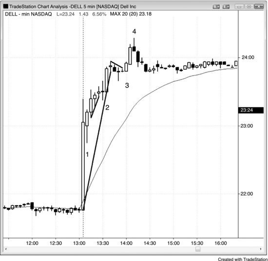
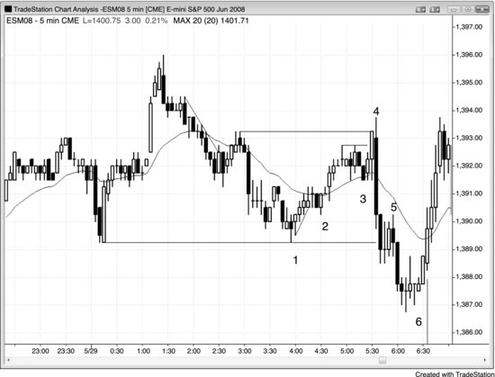
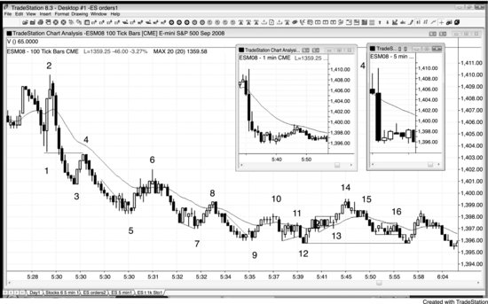
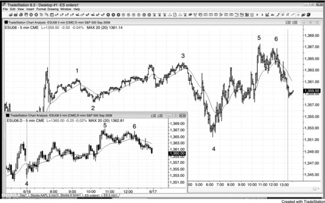

价格行为的交易方法适用于所有市场、任何时段。全球范围内有大量专业交易者参与，很多市场已经实现了24小时交易。盘前的极值点经常会在日盘中被测试，但做日内交易时其实不需要特意去看 Globex 的价格——从中能获取的额外信息非常有限，日盘自身的价格行为足以提供充分的信号。也有不少交易员在日内交易时全程使用 Globex 图表，这样做完全合理。我个人更倾向于使用日盘图表，因为跨越两天或更长时间的趋势线和趋势通道线在日盘图表上非常可靠，对我的交易非常重要。

有些交易员会在一只股票收盘后发布财报时尝试做交易，因为大幅波动看起来有很大的盈利空间。但这种波动其实很难剥头皮，大多数交易员不应该去尝试。原因在于：

- 行情变化太快，来不及判断和下单
- 突破单的滑点很大
- 回调幅度大
- 经常出现反转
- 当你终于搞清楚市场在做什么的时候，行情往往已经停了

**图 14.1** 收盘后的交易

如图 14.1 所示，Dell 在收盘后发布了财报。盘后看似有一些交易机会，但这种行情对大多数交易员来说通常太难做了，很难稳定盈利。K线 1 是向上突破后出现的一根高 1 多头内包K线，在其高点上方一美分处构成做多入场点。

K线 2 在外包K线高点上方一美分处做多入场，这根外包K线先跌破了多头微型趋势线，随后反转向上。

K线 3 是主要趋势线被突破后出现的高 1 突破回调做多。

K线 4 是一根空头反转K线，构成了最终旗形做空的建仓形态——此前市场突破多头通道上沿后出现了买入高潮。此外，K线 3 旗形突破了一条重要的多头趋势线，说明空头正在逐渐积攒力量。只有当趋势线已被突破时，才应该尝试押注一段强趋势的失败。同时，在强趋势中做逆势交易，需要以5分钟图表（而不是3分钟或1分钟图表）上的反转K线作为信号。之后市场在盘后时段的剩余时间里进入了窄幅交易区间横盘。

**图 14.2** 盘前交易

盘前是可以交易的，但在纽约证券交易所早上6:30（太平洋时间）开盘前的一两个小时内，通常没有太多入场机会（见图 14.2）。不过早上5:30经常会有经济数据发布，往往会引发快速的趋势和反转。

K线 1 是楔形做多，同时也是双底，但交易员必须扛过K线 2 的回调才能盈利。楔形底部（也叫三推下跌，还有很多其他名称）通常会带来两段式上涨。

K线 2 是一个更高低点，也是一个小型趋势线反转。

K线 3 是均线处的高 2。

一份经济报告引发了向上的假突破，随后出现了一根外包阴线（K线 4）。交易员会在K线 3 下方做空，因为很多多头的止损正好设在那里。

K线 5 是突破回调。

K线 6 是二次入场点，是从新的波段低点向上反转的第二次尝试（K线 5 是第一次）。

**图 14.3** 快速行情中 Tick 图表有更多K线

如图 14.3 所示，Emini 对早上5:30（太平洋时间）发布的失业数据反应很差。这是一张100 Tick 图表，每根K线代表100笔成交，与成交量和时间无关。注意，K线 1 到K线 5 之间的30根K线全部在一分钟内形成，因为数据发布后行情非常快。K线生成速度太快，除了市价单之外几乎不可能下其他类型的订单。从理论上讲，根据价格行为可以做出很多盈利的剥头皮交易，但大多数交易员绝对不应该尝试这种交易。展示这张图的唯一目的是证明：即使在这种极端行情中，标准的价格行为形态也始终存在。

缩略图是同一段30分钟交易对应的1分钟和5分钟图表。

**图 14.4** Globex 时段和日盘经常有不同的建仓形态

如图 14.4 所示，Globex 24小时时段的K线图中出现了一个扩张三角形，在K线 5 的高点处结束（K线 1 和K线 3 是前两次上推）。缩略图展示的是日盘图表，使用相同的编号。日盘交易员即使不看 Globex 的扩张三角形，也能在K线 5 处做空。K线 5 突破前一天的高点后回调到均线，随后市场反弹至一个更低高点，并在K线 6 处出现双顶熊旗的做空建仓形态（第一个顶在6根K线之前）。
