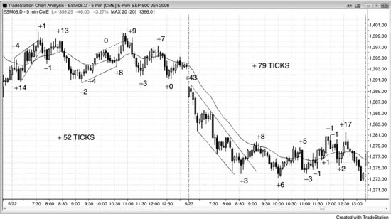
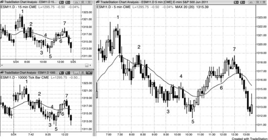
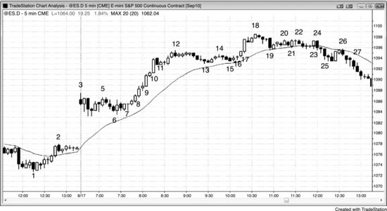
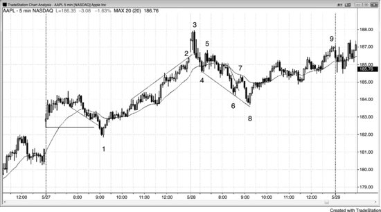
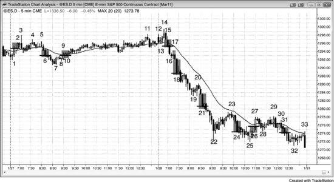
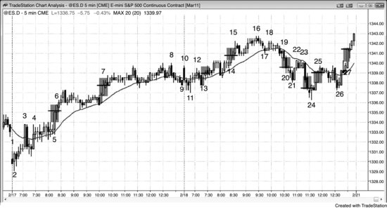

这大概是交易中最重要的一个概念。交易员应该时刻判断市场是否处于趋势中，"Always In"方法能帮你做出这个关键判断。假设你必须始终持有仓位——要么做多、要么做空——你当前的持仓方向就是 Always In 的方向。很多交易员和机构都在用这种方法的某种变体。比如，大多数共同基金通常 Always In 做多；大多数对冲基金也会保持接近满仓的状态，只不过它们往往在一些市场上 Always In 做多，同时在另一些市场上 Always In 做空。如果你是个总错过大行情的个人交易员，就应该考虑采用 Always In 方法。

判断 Always-in 的方向跟判断趋势是涨还是跌不一样，因为大多数趋势交易员在市场方向不明时不会持仓。市场在任何时刻都处于 Always-in 做多或 Always-in 做空的状态，趋势方向通常有一个大致的共识。一天做20笔以上交易的交易员会看到 Always-in 的方向全天反复翻转，但几乎没有人能日复一日地如此频繁反手。不过，那些一天只找3到10个最佳波段机会、愿意在多次回调后仍坚持对当前波段方向判断的交易员，就具备 Always-in 的思维。他们可以在每一个新信号出现时反手，也可以在一个波段开始走弱时先止盈，再去找任意方向的交易机会。实际上很少有人真的整天待在市场里、每出一个反向信号就反手。大多数交易员需要盘中休息，而且反手交易对他们来说很难。虽然他们会参与很多 Always-in 的反转建仓形态，但通常把每一笔当作波段交易来做——先出场，再找反方向的机会。他们更在意的是让利润至少达到跟风险一样大，而不是盯着下一个反向信号去反手，并且把 Always-in 信号当作入场的建仓形态来用。一般来说，如果一个信号清晰到可以被视为 Always-in 反转，交易员就可以认为它至少有60%的概率触及一个跟风险同等大小的利润目标。虽然 Always-in 信号的最低标准只是市场更可能（60%+）朝新方向而非旧方向运动——理论上只需要51%的确定性就够了——但大多数这类信号的确定性在60%甚至更高。比如在 Emini 中，如果交易员需要用2个点的止损来做一笔交易，利润目标就应该设在入场价至少2个点以上，只要正确解读了价格行为，成功概率可能（60%+）至少有60%。

如果交易员此刻看着图表，被迫立即建仓——做多或做空——而且能至少稍微偏向某个方向，那他看到的就是 Always-in 的仓位方向，也就是至少短期趋势的方向。如果无法形成判断，就去看均线以及导致当前不确定状态的那段走势（记住，不确定意味着市场处于交易区间）。如果近期大部分K线的收盘价在均线下方，Always-in 的方向可能（60%+）是做空；如果大部分在均线上方，可能（60%+）是做多。如果进入交易区间之前是一轮上涨，Always-in 的方向可能（60%+）是做多；如果之前是一轮下跌，可能（60%+）是做空。如果你心里盼着回调好买入，Always-in 的方向可能（60%+）就是做多；如果你盼着反弹好做空，可能（60%+）就是做空。如果实在判断不了，那市场就是在交易区间里，低买高卖就行。你的目标是跟市场的节奏同步。就像小时候，两个朋友在甩跳绳，你准备跑进去跳——你会紧盯绳子的节奏，一旦心里有了谱就跳进去。做交易也一样，一旦你对市场方向有了合理的把握，就该入场了。

有些交易员用高时间周期的图表来判断 Always-in 的方向。比如，如果他们用5分钟图做交易，而60分钟图处于多头趋势并且在均线上方，就只在5分钟图上找做多的建仓形态。也有人用高时间周期图表上的指标来辅助判断。比如，如果60分钟的随机指标在上升，就只在5分钟图上找回调做多的机会。有些交易员不太适应一天在5分钟图上评估10到20次反转，更倾向于用高时间周期的图表，那样一天可能只需要做3到5次决策。这种方法是有效的，但因为K线更大，止损也得更大，仓位就应该相应缩小。

开盘之前，交易员心里就已经有一个倾向——昨天最后的 Always-in 仓位可能(60%+)还在主导市场。一旦出现两根连续的、方向一致的、力度较强的趋势K线，就可能(60%+)确立了新的 Always-in 方向。在突破出现并得到跟随之前，这个判断还不确定，但可以作为一个起点。如果背景合适，就可以据此交易，比如在第一次回调时入场。积累了足够经验的交易员，理论上可以全天持仓，在每一个合理的信号处反转仓位。

市场始终在试图反转，而且经常离成功很近，但就差最后那一点跟随，不足以让交易员确信反转已经成立。这些"差一点就翻转"的时刻，恰恰是顺势交易员的好机会。比方说，多头趋势中出现了一根很强的空头突破K线，很多多头会在这根K线收盘时买入，预判不会有跟随卖盘。他们判断得没错：大多数反转尝试都会失败，这只是一个短暂的低价买入机会。还有些多头会等着看下一根K线怎么收——如果不是收阴，就在收盘时买入。另一些多头会在这根K线高点上方买入，也有人在那根强空头K线的高点上方买入——那里可能(60%+)是空头设置保护性止损的位置。空头没有等到需要的即时跟随，就会回补空头头寸。多头和空头都在买，市场至少会涨好几根K线。空头在下一个合理的建仓形态出现之前不会愿意做空，而那个形态通常要等到新的趋势高点出现之后才会形成。初学者看到那根强劲的空头急速K线时会感到害怕，以为市场正在突破下跌，必须立刻做空。他们眼里只有那根很强的空头K线，一下子就把之前那段强劲的多头趋势抛在了脑后。结果他们在失败的突破尝试低点附近一两个 Tick 的位置做空，随着市场回升被止损出场。反弹往往看起来疲弱，所以他们也不买。他们一直想找低 1 或低 2 做空，期待那根强空头急速K线之后会有跟随，但低 1 失败了，止损被打掉；接着低 2 也失败了，连亏三次。根本原因就在于他们不理解 Always In 做多意味着什么——多头趋势仍然有效，虽然差一点就翻转为 Always In 做空，但终究没有翻转。在真正翻转发生之前，唯一该做的方向就是做多。反复押注反转会成功，代价很高，因为 80% 的反转都不会成功。

Always In 是一种波段交易方法。要让它发挥作用，交易员应该只关注一天中最重要的 3 到 10 个波段，而不是在每个小信号处反复反转（很多天有 20 个甚至更多的反转，但大多数幅度太小，做不出利润）。大多数交易员在价格朝有利方向移动了大约 2 到 3 倍初始风险的距离后，就会了结部分或全部仓位，也不会执着于每时每刻都留在市场里。机构开始止盈时，价格就会回调到一个水平——在这个位置机构会顺着趋势方向重新入场，趋势因此得以恢复。强趋势转变为交易区间时，Always-in 仓位往往不变。如果交易员要在交易区间里做交易，应该把大部分甚至全部交易当作剥头皮来做。但只要 Always-in 方向没有改变，就应该考虑只在趋势方向上做剥头皮。比如，一个强空头趋势开始向上修正，但没有出现强劲的多头急速K线，市场仍然待在均线下方，那 Always-in 仓位就依然是向下。尽管市场已经进入交易区间，交易员也应该只找趋势方向上的剥头皮机会，也就是做空机会。如果出现了一个强的买入建仓形态，它可能(60%+)会把 Always-in 方向翻转为做多，至少维持足够多的K线来做一笔多头剥头皮。但任何不够强、不足以把 Always-in 方向翻转为向上的买入建仓形态，通常(60%+)都不值得交易。

这是一种波段方法，所以交易员不应该在市场处于窄交易区间时使用它。实际上，大多数交易员在那种时候都不应该交易，而应该等待突破或失败的突破。两者都可以引出一笔 Always-in 波段交易。如果有经验的盈利交易员想在窄交易区间里交易，他们要么持有窄交易区间形成之前就已建立的 Always-in 仓位、等待波段利润，要么就只做限价单入场的剥头皮，在区间两端以及前一根K线高低点上下方的突破处逢高卖、逢低买。

交易区间日里，Always-in 的翻转往往要等到市场接近区间另一端时才看得清楚。比如，市场常常在一轮多头急速推到区间顶部之后，才明确变成 Always-in 做多；同样，也常常在一轮强劲的空头急速跌到区间底部之后，才明确变成 Always-in 做空。问题在于，在区间顶部做多、在区间底部做空，恰恰与交易员应该做的相反。Always-in 是一种波段思路，适用于趋势行情，在交易区间里使用很危险——交易区间里更适合剥头皮、低买高卖。举个例子，当市场向区间顶部移动时，会突破区间内的波段高点，有些交易员可能认为市场已经翻转成 Always-in 做多，但那个波段高点本身通常不够重要，突破力度和跟随也不够强，不足以让所有人认同市场已经翻转。如果你看着上涨走势，心里拿不准它是不是真的翻成了 Always-in 做多，那说明你还不确定。而不确定正是交易区间的标志——答案已经摆在那里了。趋势带来的是一种持续的紧迫感：你确信市场还会继续走，拼命盼着回调好在更低的价格买进。交易员明白，如果这轮上涨是一段新的多头趋势，而不仅仅是交易区间里的一次短暂急速上冲，走势会连续出现强的多头趋势K线，不会每突破一个波段高点就停顿下来。仅仅在区间内向顶部或底部做了一波剧烈运动是不够的，只有市场强势突破整个区间并伴随跟随，共识才会形成。新手怕行情所剩无几，但有经验的交易员知道，强势且成功的交易区间突破通常至少能达到测量移动目标，利润空间足够大。

交易区间日里，最强的空头急速往往出现在当日低点附近，原因是真空效应。强势多头预期市场会测试交易区间的低点，所以在市场接近低点时暂停买入，这就造成了失衡，市场以空头急速的形式快速下跌。与此同时，动量程序也会捕捉到加速信号，迅速加入做空，直到动量减缓或反转。如果交易员只看当前这段下跌，会看到一轮强空头急速，很容易认为 Always-in 的方向刚刚变成了强烈做空。但若退一步纵观整张图表，就会对可能存在的真空效应有所警觉。这时候不该找做空机会，而应该考虑买入这个失败的突破尝试。

那么，交易员需要看到什么才能确定 Always-in 的方向？几乎所有的 Always-in 交易都需要先出现一轮急速，交易员才会有信心。他们需要看到一个足够强的突破，强到让人预期会有跟随。突破强度的判断标准在第二册书中讨论过。通常至少要出现连续两根强的多头趋势K线，大多数交易员才会相信 Always-in 的方向是做多；至少要出现连续两根强的空头趋势K线，才会认为 Always-in 是做空。在开盘后的第一个小时，趋势尚未明确建立之前，连续两根多头趋势K线会让交易员寻找做多的剥头皮机会，连续两根空头趋势K线则让他们寻找做空的剥头皮机会。这部分内容在第 19 章"交易开盘"中有讨论。

如果背景合适，即使只有一根幅度一般的趋势K线，也足以让交易员相信 Always-in 的仓位已经翻转到相反方向。不过，通常需要至少连续两根或更多趋势K线，才有足够多的交易员相信方向已经反转，从而带来显著的跟随。这和逆势交易员的逻辑类似——逆势交易员可能愿意扛住一次回调，但扛不住两次（比如在底部做多时，如果低 2 被触发，多头会退出，有时甚至反手做空）。同样，Always-in 交易员一般也更愿意等到看见第二根连续的强趋势K线，才确信 Always-in 仓位已经反转。

交易员通常 (60%+)需要看到第二根趋势K线，才会相信 Always-in 方向已经反转，所以第二根趋势K线的收盘价非常重要。举个例子，如果出现了一根空头突破K线，交易员就会紧盯下一根K线的收盘。空头希望看到阴线收盘，多头则希望看到阳线实体。市场有惯性，大多数试图改变当前状态的尝试都会失败。也就是说，很多交易员会在空头突破K线收盘时买入，押注下一根跟随K线收阳、空头放弃。如果突破力度不算太强，而且有充分理由相信突破应该会失败（比如在牛旗底部出现的突破尝试），这可以是一笔不错的交易；但判断难度很高，只有经验丰富的交易员才应该考虑这样做。多头希望在回调中买入，所以会寻找空头急速来押注失败。他们把空头急速看作站错方向的空头做出的承诺——这些空头之后必须亏损买回空单。而且这些空头至少在一两根K线内不会再卖出，市场上的卖方力量会减少。这就提高了在空头急速中买入的多头获利的概率。同理，当市场处于 Always-in 做空状态时，空头会把小腿顶部出现的多头急速视为极佳的做空机会。他们认定这些多头会被套住，很快就会被迫平掉亏损的多头仓位，变成卖方。

如果跟随K线很强，交易员可以在该K线收盘时入场，或者在小幅回调时入场。比如，出现了一根强劲的多头突破K线，下一根也是强多头趋势K线，很多交易员就会在跟随K线收盘时买入，或者在回落一两个 Tick 时买入。如果跟随K线很弱，比如是十字星，通常 (60%+)最好等回调再买，而不是在该K线收盘时买。如果跟随K线只超过突破K线几个 Tick，大概率突破会失败。如果超过很多 Tick，收盘时大概率会形成一根强趋势K线。大多数交易员会认为市场有了明确的 Always-in 方向。有时市场只走了几根K线就超过突破K线，然后悄悄地以通道形式向突破反方向反转，既没有明确确认突破失败，也没有明确翻转 Always-in 方向。这种情况下，对大多数交易员来说 Always-in 方向可能 (60%+)没有改变，但他们会设好保护性止损，以防回调走得太远。市场很可能 (60%+)正在进入交易区间，所以他们会切换到交易区间模式来操作——也就是剥头皮，不让盈利的单子变成亏损的。比如，多头突破后跟了几根弱的跟随K线，然后市场开始形成一条弱的空头通道，但始终没有出现空头急速，那市场仍然可以维持 Always-in 做多。但多头应该设好保护性止损，以防空头通道跌了很远却始终没有出现明确的空头反转。如果多头是早期买入的，有较大的浮盈，止损可以放在盈亏平衡点。如果是后期买入的，可能 (60%+)应该在信号K线下方出场。总的来说，如果跟随力度弱，交易员不应该在高位附近买入，而应该等回调再买。如果确实在高位附近买了，只可能是因为感觉到了紧迫性。如果没有立即出现跟随来证明这种紧迫性确实存在，就应该出场，等回调再买入。

作为一个参考标准，Always-in 翻转为做空的最低要求通常 (60%+)是跟随K线不能收阳。如果它是一根小阴线或十字星，对大多数交易员来说这就确认了空头掌控局面，但也说明新的空头趋势并不强。这时最好等反弹后卖出，或者做低 1、低 2 建仓形态，而不是直接在K线收盘时卖出。如果跟随K线有强阳线实体或是多头反转K线，这可以是突破失败的买入信号。如果它有一根小阳线实体，大多数交易员会等更多证据再做空，但会认为形成新趋势的概率已经大大降低。市场向多头方向突破、可能 (60%+)形成 Always-in 做多时，情况正好相反。跟随K线的最低要求通常 (60%+)是不能收阴。如果跟随K线不够强，那就等回调再买，不要在该K线收盘时买。如果跟随K线收阴，这次突破可能是多头陷阱，而这根K线往往就是突破失败做空的信号K线。不过偶尔市场确实已经翻转为多头趋势，但交易员需要看到更多确认才能得出这个结论。

一旦交易员确认突破有跟随，他们就会去寻找测量移动的目标。比如，出现了一个持续3根K线的强多头急速，突破了交易区间上沿，很多交易员会认为市场至少有60%的概率基于急速高度或交易区间高度形成一个测量移动，于是立刻用市价单至少买入一个小仓位。他们之所以有信心，是因为对等距移动的方向概率（第二本书讨论过）有至少60%的把握，而只要满足这个条件，数学上就值得做这笔交易。随着急速继续延伸，风险保持不变，等距移动的方向概率维持在60%或更高，但回报在增长，交易在数学上变得更划算。假设他们在高盛（GS）一个强3根K线急速的顶部买入，急速高度是1.00美元，那么市场至少有60%的概率先向上走出1.00美元的测量移动，而不是先跌1.00美元回到急速底部。如果急速在接下来几根K线扩展到1.50美元，他们的风险仍然到急速底部（这时他们多半已经收紧了止损），而测量移动目标现在到了当前K线上方1.50美元、入场价上方2.00美元的位置。此时他们至少有60%的概率赚到2.00美元，同时最多亏损不超过1.00美元——交易非常强。如果急速继续增长，概率依然不错，回报也会继续增加。随着交易员收紧止损，风险缩小，交易在数学上变得更好。一般来说，只要市场明确处于 Always-in 状态，交易员在用交易者方程评估交易时，都应假设概率至少为60%。

市场通常在开盘后第一个小时内的某个时间点进入 Always-in 模式，许多交易员喜欢在那时做一笔 Always-in 交易。有些人在市场朝有利方向移动了相当于风险1到2倍的距离后就止盈。比如，如果他们在苹果（AAPL）上做了一笔 Always-in 做多入场，初始保护性止损设在入场价下方1美元，那么他们会在赚到1到2美元利润后对部分或全部仓位止盈。另一些人更倾向于持仓，直到出现明确的反转、市场翻转为相反方向的 Always-in 状态时才平仓。那时他们会反手操作，真正做到始终持有仓位。由于大多数交易员不具备在每次小反转时都翻转仓位的能力，他们只关注一天中最强的两到五次反转。有时回调会不断扩大，但始终没有明确形成 Always-in 反转。比如，市场出现了一个强多头急速，明确处于 Always-in 做多状态，但随后出现了一个低动量回调，持续了好几个小时。这时交易员需要重新审视自己的前提。他们应该在市场中保留一个最坏情况的保护性止损，以防回调继续扩大、价格跌破入场价。这种情况有时确实会发生，而且全程没有出现明确的空头急速和 Always-in 做空信号。如果他们已经有了好几个 E-mini 点的浮盈，多半不愿意看到市场回到入场价，因此会选择用盈亏平衡点止损。如果被止损出场了，他们可以等待，寻找任一方向的 Always-in 交易机会。如果市场在入场后几分钟内就回调、还没有产生任何有意义的利润，保护性止损应该放在多头急速下方，即使距离可能很远。如果距离确实很远，仓位大小必须足够小，把风险控制在正常范围内。

一旦你认为市场已经进入 Always-in 状态，通常最好至少用市价单或在微小回调时建一个小仓位，当 Always-in 的方向明确且强劲时尤其如此。当动量较低、没有那种紧迫感时，有些交易员更愿意等较大的回调再入场。但这样做有踏空的风险，因为很多出色的 Always-in 交易一开始动量就不大，却一路走下去，走了很多根K线、很多个点之后才出现回调。一般来说，只要市场处于 Always-in 做多状态，交易员会把空头每一次试图压低市场的行为都视为买入机会，因为他们知道大多数试图反转趋势的尝试都会失败。他们会在每一根空头趋势K线的收盘价附近买入，在前一根K线低点或任何前期波段低点下方买入，在所有支撑位（如多头趋势线）下方买入。当市场处于 Always-in 做空状态时，交易员会把多头每一次试图推高市场的行为都视为做空机会，因为他们正确地判断大多数这类尝试都会失败。他们会在每一根多头趋势K线的高点附近做空，在前一根K线高点、任何前期波段高点以及任何阻力位（如空头趋势线）附近做空。

由于通常需要第二根趋势K线才能让交易员相信 Always-in 仓位已经反转，那根趋势K线的收盘就很关键。比如，如果出现了一根空头突破K线，交易员会紧盯下一根K线的收盘。空头希望看到阴线收盘，多头希望看到阳线实体。市场有惯性，大多数试图改变当前状态的尝试都会失败。也就是说，很多交易员会在空头突破K线收盘时买入，押注跟随K线会收阳，空头会放弃。如果突破力度不算太强，而且有充分理由相信突破应该会失败（比如在牛旗底部出现的突破尝试），这可以是一笔不错的交易；但因为判断难度很高，只有经验丰富的交易员才应该考虑这样做。多头希望在回调中买入，所以会寻找空头急速来押注失败。他们把空头急速看作是站错方向的空头做出的承诺——这些空头之后必须亏损买回空单。而且，这些空头至少在一两根K线内不会再卖出，所以市场上的卖方力量会减少。这就增加了在空头急速中买入的多头获利的概率。同理，当市场处于 Always-in 做空状态时，空头会把小腿顶部出现的多头急速视为极佳的做空机会。他们假定这些多头会被套住，很快就会被迫平掉亏损的多头仓位，变成卖方。

如果跟随K线很强，交易员可以在该K线收盘时入场，或者在小幅回调时入场。比如，如果出现了一根强劲的多头突破K线，下一根也是强多头趋势K线，很多交易员就会在跟随K线收盘时买入，或者在回落一两个 Tick 时买入。如果跟随K线很弱，比如是十字星，那通常最好等回调再买，而不是在该K线收盘时买。如果跟随K线只超过突破K线几个 Tick，大概率突破会失败。如果超过很多 Tick，那收盘时大概率会形成一根强趋势K线。大多数交易员会认为市场有了明确的 Always-in 方向。有时市场只走了几根K线就超过突破K线，然后悄悄地以通道形式向突破反方向运行，既没有明确确认突破失败，也没有明确翻转 Always-in 方向。这种情况下，对大多数交易员来说 Always-in 方向多半没有改变，但他们会设好保护性止损，以防回调走得太远。市场很可能正在进入交易区间，交易员应该切换到交易区间模式来操作——也就是剥头皮，不让盈利的单子变成亏损的。比如，如果出现多头突破后跟了几根弱的跟随K线，然后市场开始形成一条弱的空头通道，但始终没有出现空头急速，那市场仍然可以维持 Always-in 做多。但多头应该设好保护性止损，以防空头通道跌了很远却始终没有出现明确的空头反转。如果多头是早期买入的，有较大的浮盈，止损可以放在盈亏平衡点。如果是后期买入的，大概应该在信号K线下方出场。总的来说，如果跟随力度弱，交易员不应该在高位附近买入，而应该等回调再买。如果他们确实在高位附近买了，只可能是因为他们感觉到了紧迫性。如果没有立即出现跟随来证明这种紧迫性确实存在，就应该出场，等回调再买入。

作为一个参考标准，Always-in 翻转为做空的最低要求通常是跟随K线不能收阳。如果它是一根小阴线或十字星，对大多数交易员来说这就确认了空头掌控局面，但也说明新的空头趋势并不强。这时最好等反弹后卖出，或者做低1和低2建仓形态，而不是直接在K线收盘时卖出。如果跟随K线有强阳线实体或是多头反转K线，这可以是一个突破失败的买入信号。如果它有一根小阳线实体，大多数交易员会等更多证据再做空，但会认为形成新趋势的概率已经大大降低。市场向多头方向突破、可能形成 Always-in 做多时，情况正好相反。跟随K线的最低要求通常是不能收阴。如果跟随K线不够强，那就等回调再买，不要在该K线收盘时买。如果跟随K线收阴，这次突破可能是多头陷阱，而这根K线往往就是突破失败做空的信号K线。不过偶尔市场确实已经翻转为多头趋势，但交易员需要看到更多确认才能得出这个结论。

做 Always In 波段交易时，回调不可避免，必须容忍。大多数回调并不是反转入场机会，所以不能每次逆向运动都紧张兮兮。一般来说，一次回调触及了盈亏平衡点止损后，市场又朝你的方向走了好几根K线，那通常 (60%+)不会再回到你的入场价。所以多数情况下可以把止损移到盈亏平衡点。如果第二次回调又打到了盈亏平衡点止损，而你又吃不准方向，那就先离场观望，等下一个让你有信心的 Always In 建仓形态再进场。方向不确定是交易区间的典型特征，而 Always In 是用于趋势的方法，这一点要记住。

如果你判断市场存在 Always-in 的方向，就不该做逆势交易。逆势交易几乎只能是剥头皮，风险大概是回报的两倍，成功概率得达到不切实际的 70% 甚至更高才能赚到钱。如果你预期会有一波回调，从数学上讲，更好的做法是等回调结束后顺势入场，而不是赌回调幅度够大、概率够确定，然后去做一笔逆势剥头皮。

我有个朋友，每天耐心地在开盘头两个小时里等一个 Always In 建仓形态。一旦找到，他就预期趋势至少会持续两个小时，覆盖至少三分之一的平均日内振幅。看到 Always In 建仓形态后就入场，然后设置一个括号单——止损放在信号K线的另一侧，止盈限价单放在某个测量移动目标位或支撑阻力区域，距离至少是止损的两倍。因为他做的是 Always In 入场，方向上达到等距运动的概率至少有 60%。如果他在 Emini 上冒 2 个点的风险，那至少有 60% 的概率在保护性止损被触及之前赚到 2 个点。不过实际上，当他冒 2 个点风险时，利润目标总是 4 个点以上。以 Always In 入场来算，成功概率可能 (60%+)至少 50%。虽然概率永远无法精确知道，但他很多交易的概率可能 (60%+)超过 60%。他跟很多交易员一样，不喜欢在盘中阶段交易，因为那时候小幅反转很常见。等待期间干什么呢？出去办事或者锻炼身体。过两个小时回来，再找一笔收盘前的 Always In 交易。

什么样的市场才算强的 Always In 状态？Always In 只在趋势或至少潜在趋势中出现，所以要关注趋势和反转中的强势信号。本书开头的导论部分列了一份清单，满足的条件越多，盈利的可能性就越大。一个明显的信号是强烈的急速走势，尤其是持续好几根K线的那种。比如，开盘后出现了一波强劲的上涨反转，急速阶段由三根幅度可观的多头趋势K线组成，交易员就在用市价单和微小回调买入。他们不想等回调，因为比起"会出现回调"，他们更确信的是接下来几根K线内市场会走得更高。这种迫切感就是完美的 Always In 情形。如果你还没做多，就该考虑至少建一个小仓位——用市价单入场，或者挂一个比当前K线高点低几个 Tick 的限价单买入。止损应该放在哪里是算得出来的，也许是反转入场K线的最低点。如果这意味着得冒 8 个点的风险，而你平时只冒 2 个点，那就只下正常仓位的四分之一。最关键的是必须做多，哪怕仓位很小，因为你确信市场会涨。如果你判断当天正在演变为一个强多头趋势日，就尽量持有至少一部分仓位到收盘，除非出现了明确的强空头反转。

对于股票，盈亏平衡点止损被触及的概率更低，所以更适合做波段交易。一般来说，价格移动约 0.5% 到 1%（大约初始风险的两倍）后，可以先止盈三分之一到一半的仓位，剩下的继续持有做波段。如果市场看起来在逆你的方向走但还没真正反转——比如在测试当日高点时——可以再减掉四分之一到三分之一的仓位。但要尽量保留至少四分之一的仓位，一直持有到盈亏平衡点止损被触及、出现明确的强势反向信号、或者收盘。趋势走出的幅度往往远超你的想象。

持仓过程中要经受住反复回调的考验，一直拿着，直到价格到达目标位、出现明确的反转建仓形态，或者保护性止损被触发。有时候回调来得很猛，但还不足以触发 Always-in 反转，这时应该坚持原来的计划，不要因为一根逆向的大趋势K线就乱了阵脚。如果止损被打掉，就先观望，等任何一个方向再次出现明确且强劲的建仓形态再进场。一旦出现这样的形态，就重复上述流程。如果你的交易仓位是两手，持有一手多单时触发了反转形态，那就卖出三手——一手平掉剩余的多单，另外两手在反方向上开仓。第一手做剥头皮，目标是风险的 1 到 2 倍；第二手做波段。

这种方法的关键在于，只在出现明确且强劲的建仓形态时才入场或反转。如果没有这样的形态，就靠盈亏平衡点的止损来保护自己，即使波段仓位的利润可能因此全部回吐。如果你同时关注一小批股票，几乎每天至少有一只会出现可靠的入场信号，让你有机会做一笔波段交易。

盘中任何时刻，你都可能判断当前明显处于趋势中，或者已经出现了明确的反转。做 Always-in 交易至少需要具备其中一个条件。一方控制着波段走势，价格可能 (60%+)沿着这个方向继续运动。想一想保护性止损应该放在哪里，再算一下以市价入场需要承担多少 Tick 的风险。一般来说，趋势可能 (60%+)还会再走差不多同样数量的 Tick，而且既然你认为趋势存在，成功概率就优于 50-50。如果你很有把握市场处于 Always-in 状态，概率可能 (60%+)达到 60% 甚至更高。趋势延续之后，你通常 (60%+)可以跟踪止损来降低风险。同时，如果市场从入场以来已经走了很长一段，原来的利润目标也可以上调，新的保护性止损位置会产生新的利润预期。这样重新评估后，潜在利润就大于风险，成功概率仍然优于 50-50。趋势中的波段交易天然具备这种不断改善的数学优势，这也是它作为最好的交易方式之一的原因，对新手来说尤其如此。

经验丰富的交易员可以利用 Always-in 方法沿趋势方向分批加仓，前提是对趋势强度的判断有足够信心。比如，交易员认为当前多头趋势很强，就可能根据近期日均波幅，用限价单分批建立多头仓位。假设交易的是 Emini，近期日均波幅大约在 12 到 15 个点，过去几个小时最大回调只有 2 个点，那他们可能在回调 1 个点时买入一小部分仓位，然后在再低 1 到 2 个点的位置继续买入（相当于日均波幅的 10% 到 20%），之后在更低几个点的地方为全部仓位设一个止损。如果之前的回调幅度是 3 个点，他们可能改为在低 3 个点的位置挂限价买单，然后在再低 2 到 3 个点的位置加仓，并为全部仓位设置 2 个点的止损。一旦市场翻转为 Always-in 做空，就平掉全部多头仓位，转而寻找做空机会。分批加仓在第二本书中有详细讨论。

**图 15.1** Always-In 波段交易

无论是趋势日还是交易区间日，只要交易区间日的波动幅度够大，Always-in 交易都可以作为一种有利可图的波段交易方法。如图 15.1 所示，第一天是交易区间日，用 Always-in 方法可以赚到 52 个 Tick，每手大约 600 美元。第二天以始于开盘的空头趋势开始，随后进入交易区间。用 Always-in 方法交易可以赚到 79 个 Tick，每手大约 950 美元。如果交易员用两手做交易——一手剥头皮、一手做波段——每天可能有 10 笔成功的剥头皮交易，每手每天额外赚大约 450 美元。听起来、看起来都很简单，但实际操作起来非常难。

**图 15.2** 高时间周期图表

5 分钟图表（比如图 15.2 右侧那张）有 81 根K线，大多数交易日会出现 20 多次反转。如果交易员不习惯做这么多关于 Always-in 方向的判断，可以减少图表上的K线数量来减少决策次数。三张图表上的K线编号是一致的。左上方是 15 分钟图表，左下方是每根K线包含 1 万个 Tick 的图表。这两张高时间周期图表的反转次数少得多，但仍然有好几个不错的信号，足够交易员以此为生。由于K线更大，止损也必须放得更宽才能给交易留出运行空间。为了让总风险金额和 5 分钟图表上的交易保持一致，仓位就得缩小。

**图 15.3** 跳空高开后回调

如图 15.3 所示，市场大幅跳空高开，但随后出现一根强**空头反转K线**，当天有可能变成**始于开盘的趋势**空头日。这是一个可靠的 Always-in 做空**建仓形态**。不过交易员也清楚，大幅跳空高开的日子有可能发展成强**多头趋势**日，而且市场常常会先横盘或下跌大约一个小时，之后才出现**多头突破**。正因如此，虽然他们做空了，但也随时准备反手做多。K线 4 是一根**空头趋势K线**，但带有很长的**影线**，而且接下来几根K线没有出现**跟随**。另外，当天第二根K线是一根强**多头趋势K线**，而不是交易员希望看到的作为**入场K线**的强**空头趋势K线**。市场的表现不像一个强**空头趋势**。很多人会在 K线 4 之后的**内包K线**上方出场，等待**第二次信号**，但从技术上讲，市场仍然处于 Always-in 做空状态，因为还没有出现明确的买入信号。市场两段式上涨到 K线 5，可能正在尝试与当天第一根或第二根K线构成一个**双顶**。选哪根作为第一个顶并不重要，含义是一样的。有些交易员把第一根K线视为第一个顶，另一些则更看重第二根K线。K线 5 之后的K线是一根空头**内包K线**，同时也是第二个卖出信号，但接下来几根K线里市场依然没有走出强**空头趋势K线**。空头再次看到了问题。到这个时候，市场已经在一个很小的区间里运行了超过 30 分钟。一旦出现这种情况——尤其是在大幅跳空开盘之后——市场就进入了**突破模式**。交易员会在区间高点上方一个 Tick 处挂**买入突破单**，也会在区间低点下方一个 Tick 处挂**卖出突破单**做空。这是一个可靠的**突破模式**形态。

K线 7 是一个多头 **ii** 形态，出现在 K线 5 的**双顶**之后，也在 K线 4 和 K线 6 构成的**双底**之后。**ii** 形态是一种暂停，也就是一种**回调**，所以这是一个更小级别的**突破模式建仓形态**——市场同时在构建**双顶回调**和**双底**的入场机会。虽然有些交易员会在 **ii** 形态被突破时入场，但大多数人会等开盘区间的突破。

K线 8 前面那根是一根强**多头趋势K线**，收盘价高于 K线 5 的高点，很多交易员在那个**波段高点**上方做多。K线 8 本身是一根更大的**多头趋势K线**，也是开盘区间的**突破**。此时交易员看到的是：在一个强跳空高开的日子里，**突破模式建仓形态**出现了多头突破，他们相信市场已经进入了**多头趋势**。由于不知道短期内是否会出现**回调**，但又确信市场很可能 (60%+) 很快走高，他们直接以**市价单**买入——机构也是这么做的，这是正确的做法。市场的日内波幅很可能 (60%+) 至少等于近期的平均日波幅，而波幅的扩大很可能 (60%+) 来自价格上涨。新手往往被突破的速度和所需止损的大小吓到，但他们应该学会至少建一个小仓位，以市价入场，一直持有到出现强卖出**建仓形态**——比如 K线 18 的**最终旗形**反转。如果在 K线 8 收盘附近买入，理论上**保护性止损**应该设在 K线 7 下方，也就是最近的 HL。如果这个止损距离是他们能承受的 3 倍，那就只买三分之一的仓位。另一种做法是把止损设在 K线 8 的低点下方，因为强**突破**应该会立刻出现**跟随**。这样被止损出场的概率更高，但如果市场触及止损后又转头上涨，他们可以再次买入做波段。

K线 9 和 K线 10 也是大**多头趋势K线**，但正因如此，它们构成了买入**高潮**，而连续的买入**高潮**通常 (60%+) 很快就会出现更大幅度的横盘到下行**回调**。之后K线变小，市场在接下来两个小时进入了一段**窄交易区间**，但始终没有回到**均线**附近。在回落到 K线 13 和 K线 15 时，市场试过回到均线，但多头非常激进，在**均线**上方好几个 Tick 的地方就挂了**限价单**买入。他们太担心市场可能碰不到均线，所以把买单挂在了均线上方。这是**多头趋势**非常强的标志。不过，只要强**多头趋势**中出现了长时间的横盘整理，就会跌破多头**趋势线**，而且可能变成一个**最终旗形**——这里正是如此。这让多头随时准备快速**止盈**。K线 11、13 和 15 构成了**窄交易区间**中的三次下推，可以看作一个三角形或**楔形牛旗**。

连续几根空头趋势K线跌破交易区间，并不一定意味着交易员认为 Always-in 的方向已经翻转为空头。K线12之后的窄交易区间虽然被两根空头趋势K线跌破，但这两根K线都很小，之前也没有出现过像样的空头力量。交易员并没有做空，而是在等一个回调至均线的 EMA 20 缺口K线做多机会。K线14那个 LH 也被三根空头趋势K线跌破，但这段空头急速并不强势，多头仍在等待第一次回调到均线的买入机会。之前既没有明显的抛压，也没有明显的空头力量。交易员认为 Always-in 的方向仍然是多头，于是在价格经过两段式横盘回调到K线15时买入。

K线17又是一次强劲的多头突破，因此也构成了一个急速加高潮的组合。但由于它可能是最终旗形的突破，就有失败并引发趋势反转的可能。当一轮趋势已经走了20根K线以上，多空双方都会关注出现的大阳线，尤其当这次上涨是从一个潜在的最终旗形中突破出来的时候——这里正是这种情况。交易员认为这根大趋势K线带有高潮性质，怀疑回调很快就会开始，于是纷纷开始卖出。多头卖出平仓锁定利润，空头卖出开仓建立新的空头仓位。他们在该K线收盘时卖、在其高点上方卖、在随后出现的任何小K线（尤其是收阴的）上卖，也在前一根K线低点下方卖。多空双方都预期至少会出现一个持续10根K线以上的两段式回调，并且可能测试K线15——也就是潜在最终旗形的底部。如果下跌非常猛烈，双方都会观望一下再买；如果只是简单的两段式回调、市场看起来即将反弹，双方都会买入。多头会重新建立多头仓位，空头会买入平仓锁定利润。这里，从K线14下来的一系列空头K线可能 (60%+) 会带来更低的价格，因此收盘前没有出现明显的买盘。

K线18是当天的第三次上推（K线3和K线12是前两次），也是一个可能的最终旗形反转——既可以从K线11到K线16之间的大交易区间（一个三角形）的角度来看，也可以从K线17买入高潮之后那两根小K线的角度来看。同时它还是另一种意义上的第三次上推，其中K线14和K线17分别是前两次。市场经常在太平洋时间上午10:30到11:00左右回调，回调通常在11:30左右结束。而且，市场整天都没有碰到均线，虽然K线15时曾经接近。下一次回调可能 (60%+) 会更深，因为后续回调往往越来越深，尤其是在太平洋时间上午11:00之后。更深的回调离均线已经很近，几乎可以肯定至少会稍微刺穿均线。这些因素叠加在一起，让有经验的交易员开始怀疑这轮强劲的多头趋势是否正在向交易区间过渡。这次回调也有可能演变成一次大幅度的深度回调，甚至变成空头趋势，因为K线15处的三角形已经突破了K线6到K线12之间陡峭的多头趋势线，而K线18是一个潜在的 HH 趋势反转。许多交易员在K线18高点的两K线反转下方做了最后一次止盈了结，然后等着至少出现两段式、持续10根K线的回调并触及均线，再考虑在收盘前重新做多。

K线19是一次强劲的空头急速，提醒交易员回调之后可能出现空头通道。有些交易员可能在最终旗形顶部反手做空，但由于市场整天都没有触及均线，均线附近会有 EMA 20 缺口K线的多头限价买单等在那里。因此，Always-in 的仓位可能 (60%+) 仍然是多头。多头认为下一根K线可能 (60%+) 不会是空头K线，于是在该K线收盘时买入。大多数翻转 Always-in 方向的尝试都会失败，在强趋势中尤其如此。

K线23是一个在均线处的双底做多入场点，但它变成了两K线反转下跌的第一根K线。一旦市场跌破K线24的低点，大多数交易员就认为 Always-in 仓位已经翻转为空头。这是一个多头陷阱，也是一个小型最终旗形顶部（最终旗形的突破可以是一个 LH）。K线25之后那根K线是一个第一次均线缺口K线做多建仓形态，但趋势此时已经转为空头。虽然出现了一根强劲的多头趋势K线，但它并不是对上方交易区间下沿的失败突破，而且没有获得跟随，随后在均线附近形成了一个突破回调做空入场点：要么在K线26变成外包阴线时入场，要么在它的低点下方入场——在均线下方做空一根作为均线测试的空头K线低点，是一种可靠的交易。

到了第27根K线，市场明显处于 Always-in 做空状态，交易员纷纷以市价做空，顺应收盘前的趋势。风险经理走上交易大厅，要求手下交易员必须平掉多头仓位。交易员们很不情愿，因为他们还抱着幻想，觉得多头趋势会恢复、帮他们解套，但老板不允许他们再等。他们和风险经理的薪酬都跟业绩挂钩——交易员可以对亏损的多头仓位有感情，但风险经理的职责就是抛开情绪、该认亏就认亏。老板永远说了算，结果就是收盘前走出了一波空头趋势。动量卖出程序检测到强趋势后也加入其中，只要下跌动量持续，程序就会持续卖出，进一步强化了这波走势。

从第6根K线到第12根K线的上涨中，最大的回调不过两个点左右。有经验的交易员可能会挂限价单，在任何一到两个点的回调处分批建多仓，往下每隔一到两个点再加一次仓，止损设在最后一笔入场价下方两到三个点。如果市场翻转为 Always-in 做空，他们就平掉多头、转而寻找做空机会。假设他们在一个点的回调处买了一手，又在低一个点处加了一手，那么到第13根K线时就持有两手多头仓位。保护性止损可以设在再低两到三个点，或者均线下方大约两个点处。由于当时处于多头趋势，他们预期市场至少会回测前高，所以可以在市场创新高时先在第一手仓位上拿一个点的利润，然后要么挂限价单在大约四个点处（大约是初始风险的2倍）平掉第二手仓位，要么等到市场在第18根K线附近滞涨时出场——那个位置可能正在形成从第12根K线到第16根K线的潜在最终旗形构成的最终旗形反转建仓形态。

**图 15.4** 早盘寻找波段建仓形态

交易员应该在开盘后尽早寻找 Always-in 交易机会，因为这类机会往往能带来可观的波段利润。有时候，仅仅一根强趋势K线就足以让大多数交易员相信市场已经确立了 Always-in 的方向。在图 15.4 中，第3根K线是一根强空头外包阴线，从多头通道上方的突破处反转下跌，这可能让大多数交易员相信后续会有跟随，Always-in 的方向已经转为做空。这根紧跟在强多头趋势K线之后的大阴线，是当日高点和始于开盘的空头趋势建仓形态的合理候选。

AAPL 在第1根K线处完成了缺口测试，那是一根强反转K线——价格创出日内新低、跌破空头趋势通道线后反转上涨。这是一个很好的波段做多入场点，持有到收盘差不多能赚将近 $4.00。向上跳空缺口构成了急速阶段，第1根K线则是回调，随后形成的通道一路上涨到第3根K线见顶。有些交易员在价格突破第1根K线上方时就认为 Always-in 的方向已经翻多，也有些是在随后两根多头趋势K线走出来之后才确认。五根K线的多头急速完全抹平了此前五根K线的空头急速（也就是跌到第1根K线低点的那一波）。这是一次高潮反转，后续至少再走出第二段上涨的概率较大。

到第7根K线为止的四根K线多头急速虽然强劲，但之前跌到第6根K线的四根K线空头急速更强。大多数交易员仍然认为 Always-in 的方向还是做空，他们想等到出现一个 HL 或 LL 回调之后再考虑做多。

第8根K线是楔形牛旗内的一个向上反转，同时也是突破第1根K线高点的 HH。如果你只是平掉空头而没有反手做多，这笔交易差不多能赚 $2.40。很多交易员认为当市场突破第8根K线上方时，Always-in 的方向已经翻多，后面跟出的那根多头趋势K线让更多人确认了这一点。之前冲到第7根K线的那波上涨体现出买压，这让多头更有信心——第二次尝试反转向上时，买盘力量可能比第一次更强。

当市场还差一根K线就能翻转 Always-in 的方向时，交易员往往会押注失败，押注那根关键K线不会出现。比如，如果第5根K线前面那根是强多头趋势K线，很多交易员本来会把 Always-in 做空翻为做多（多数人在第3根K线之后的五根下跌K线走完时已认定市场 Always-in 做空）。但正因为他们知道大多数翻转尝试都会失败，所以他们会在那根多头趋势K线收盘价附近做空，预期第5根K线不会是一根强多头K线、空头波段会继续。

**图 15.5** 跟随往往是大概率事件

只要交易员对接下来几根K线的方向有信心，就存在交易机会。图 15.5 中每个灰色方框所标示的区域，都是交易员认为后续会有跟随的地方。方框内的小横线标出的是大多数交易员达成共识的价格位置，尽管不少交易员更早就已经确认了方向。当趋势很强时，比如从第14根K线开始的那波下跌，通常会出现连续几次突破，每次都让交易员重新建立起信心。

有些交易员严格执行 Always In 策略，全天始终持有多头或空头仓位，但大多数人会沿途止盈，一旦觉得市场失去方向就先出场。交易员通常会在出现反方向信号时了结当前仓位，即使那个信号还不够强到让他们反手。记住，说服交易员平掉多头的门槛，远低于让他们建立空头仓位的门槛。在K线1收盘价买入或在K线1高点上方一个 Tick 做多的交易员，看到K线3那根大的空头反转K线会感到不安，尤其是开盘反转往往会带来持续的跟随。单凭K线3本身，多数交易员还不会判定市场已经翻转为 Always-in 做空，但很多人会在K线4形成的小楔形熊旗 LH 下方平掉多头或反手做空。另一些人则会在K线5——熊旗的二次入场点突破回调——下方出场或反手做空。到跌破K线5的那根空头K线收盘时，或者到K线5低点下方一个 Tick 时，或者到K线6收盘时，大部分交易员都会把市场视为 Always-in 做空。

从当日新低K线7开始的强反弹让空头感到不安，因为这又是一次开盘反转，而且可能就是当天的低点。从K线3开始有一个两K线的急速下杀，K线7则可能构成急速加楔形通道形态中的第三推，其中K线3之后的那根K线是第一推，K线6是第二推。一部分空头会在K线7上方平仓，大多数则会在K线8这个 HL 上方离场。K线7是对K线5起始的微型通道的向上突破，K线8就是突破回调的买入信号。很多交易员认为市场在K线8上方已翻转为 Always-in 做多，而当市场在K线10处的多头 ii 形态上方反弹时，大多数人确认了这一判断——K线10同时也是一个失败的低2做空。他们认为熊旗失败了，市场至少会走出一个基于K线7到K线9熊旗高度的测量移动。

从K线14开始的自由落体过程中，有好几个位置让交易员重新确信市场在接下来几根K线内还会继续下跌，比如K线18收盘时、K线18之后那根内包K线低点下方一个 Tick、以及K线18低点下方一个 Tick。尽管K线18之后的内包K线是阳线实体，交易员仍然认为趋势向下，把那根K线当作低1做空的建仓形态。K线21和K线24的情况也类似。做空的交易者方程非常好，即便主观感觉概率只有50%。实际上概率至少有60%，但交易员经常因为恐惧和自我否定，把等距移动的概率估成50%，从而给自己找到一个看似合理、实则错误的借口不去做这笔交易。正确做法是：以一个"无所谓"的仓位大小市价做空，设一个合理的保护性止损——比如放在最近那根大空头趋势K线高点上方——然后持仓扛过回调，直到出现明确的买入建仓形态，比如K线25的 LL 主要趋势反转（MTR）。如果止损距离是正常水平的4倍，仓位就不要超过正常的四分之一。如果还是害怕，就只用正常仓位的10%。关键是：当机构资金如此激进地做空时，你必须跟着做空，因为失控趋势的交易者方程是最强的。

**图 15.6** Always-In 建仓形态

如图15.6所示，有好几个区域交易员对至少未来几根K线的方向充满信心，每一个都是 Always-in 交易的合理入场点。激进的交易员会更早入场，也会做更多反转交易，但图中标注的区域是大多数交易员确认 Always-in 方向的位置。

在K线14收盘买入、或在其后十字星高1上方做多的交易员，看到K线16的 HH 二次入场做空信号会感到不安。K线16还可能是K线14急速之后通道的顶部，而从K线11到K线16的整段上涨可能只是K线7到K线12那个潜在最终旗形之后的一个 HH。大部分多头会在K线16下方平仓，激进的交易员则会做空，认为这是一个合理的 Always-in 翻转点。更保守的交易员——那些一天只做三到五次反转的人——会等到K线19或K线20出现强空头收盘，才判定市场为 Always-in 做空。

当交易员对方向有信心时，应该假定自己的确定性至少有60%。如果风险大约是2个点，那么利润目标也至少需要2个点才能让交易者方程有利。这意味着他们可以在上述每个区域附近寻找入场机会，入场后挂一个包含止损和止盈的括号单。止损设在距入场价2个点的位置，止盈限价单也设在2个点。如果市场接近利润目标后又掉头——就像K线7收盘后的那波反弹——他们可以收紧止损。这种情况下，差不多会在盈亏平衡点附近的两K线反转处出场。有些交易员不调止损，只要自己的交易前提没有被明确否定就一直持仓，容忍途中的回调。也有些交易员在信号足够强时会去追求3到4个点的利润目标，比如在K线5或K线6的收盘做多，在K线13的突破回调上方做多（对应K线9和K线11的高2牛旗），在K线16的小楔形顶下方做空，在K线20的收盘做空，在K线22和K线23形成的小低2突破回调下方做空，或者在K线26的突破回调上方做多。有些交易员会认为这些是最强的建仓形态，大概有70%的把握在触及2个点止损之前先拿到2个点的利润。那他们就只追求2个点的利润，因为数学上非常有利。

既然大多数交易员在K线6时已判定市场为 Always-in 做多，他们就预期反转做空的尝试会失败。于是他们会寻找在强空头趋势K线收盘处买入的机会，比如K线6之后第四根K线那根空头趋势K线、以及K线7之前两根K线处测试均线的那根。
