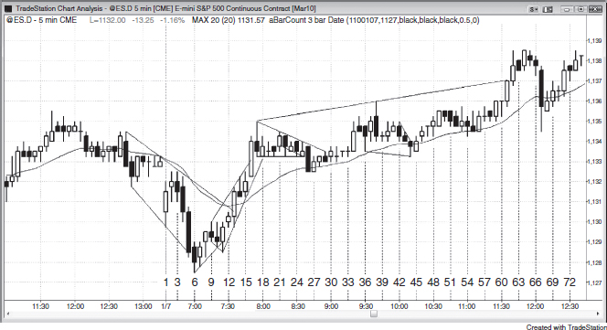

有些高频交易公司每天在4000只股票上执行数千万笔交易，每笔只赚一美分。这是最极端的剥头皮方式，但普通交易员没有紧挨交易所的超级计算机，根本做不了。我有一个朋友是 Emini 的极端剥头皮者，每天大约交易25次，每笔赚两个 Tick。无论我怎么问，他都不肯说自己用不用保护性止损、最多能亏多少，关于加仓的问题也从来不正面回答。有些交易员就是不愿透露太多细节。我不确定这是因为他们不切实际地担心别人抄袭导致策略失效，还是怕别人发现他们交易了那么多笔、一天下来净赚也不过几个点。不过他倒是告诉我，他每笔交易大约做100手。一个共同的朋友告诉我，他去过他那栋价值200万美元的房子，我相信他每年至少赚100万美元。

虽然我认为极少数性格适合的人确实能做到，但对绝大多数交易员来说几乎不可能，所以大部分人根本不应该尝试。一般来说，剥头皮交易通常要求风险大于回报（概率60%以上），因此胜率至少要达到70%才能稳定盈利。这对大多数交易员来说不现实，哪怕是很成功的交易员也做不到。但确实有少数人能靠剥头皮谋生。不过，大多数交易员应该只做回报至少等于风险的交易，因为60%的最低胜率要求现实得多。更好的做法是专注于回报至少是风险两倍的交易，这样即使只赢一半左右也能赚到钱。

尽管交易员应该以波段交易为重点，但他们可能会惊讶地发现（概率60%以上），5分钟图上的剥头皮建仓形态远比想象的多。不过，建仓形态的存在本身并不是入场的充分理由。事实上，几乎没有人应该尝试在一天的5分钟图上做30到40笔剥头皮交易，因为要把图表读得那么准、还能快速获利了结，实在太难了。大约三分之一的建仓形态是突破单入场，大约三分之二是限价单入场。所有市场、所有时间周期都是如此——大约一半的K线存在合理的剥头皮建仓形态。展示极端剥头皮的例子，有助于说明你每天面前有多少微妙的价格行为信息，也可能有助于提高你的专注度（概率60%以上）。有些交易员也许能这样做一两个小时，但大多数人还是应该去寻找两到四个点的波段交易机会。

很多时候，只要管理好仓位，剥头皮者在当前价格做多或做空都能赚到钱。这一点适用于所有交易，新手可能会觉得意外（概率60%以上）。举个例子：在 Emini 一段已经确立的多头趋势中，出现了一根大的多头趋势K线，后续很可能有跟随买盘（概率60%以上）。交易员可以在这根K线收盘附近买入，设大约3个点的风险来应对可能的回调（概率60%以上）。如果市场直接涨到目标价，就止盈出场。如果市场反而回调了5到10根K线但没有触及止损，就可以等回调结束、趋势恢复后，在原来的目标价止盈。很多经验丰富的交易员会在回调过程中和牛旗突破时加仓。有些人会持有全部仓位直到市场回到原始目标价，然后止盈。也有人会选择在原始入场价出场——第一笔入场保本出场，后面加仓的部分则带着利润出场。

空头可以在多头买入的完全相同的价格做空，预期那根大K线代表着衰竭。如果市场在接下来几根K线里下跌，空头就能获利出场。如果市场反而又涨了一两根K线，他们可以加仓继续做空，风险设置的 Tick 数等于那根大多头趋势K线的高度。比如那根K线有12个 Tick 高，他们可以在高出4个或8个 Tick 的位置加仓做空，整体仓位从原始入场价算起承担12个 Tick 的风险。如果加仓后市场掉头下跌，他们可以在原始目标价或原始入场价平掉全部仓位。如果在原始入场价出场，后面加仓的部分是盈利的，第一笔入场则保本出场。所以，多头和空头的剥头皮者可以在完全相同的时间、完全相反的方向入场，双方都能赚到剥头皮的利润。关键在于资金管理。

**图 16.1** 极端剥头皮

图 16.1 是 Emini 的 5 分钟图，展示了极端剥头皮的做法。一天共有 81 根K线，图中每隔三根标注一个编号。如果交易员打算用 2 个点的止损去剥 1 个点的头皮，当天至少有 40 次机会。要记住，用突破单入场的交易员通常需要价格在信号K线之外运行 6 个 Tick，才能用限价单止盈 4 个 Tick。

K线 1 是一根多头反转K线，也可能是昨日收盘价下方空头旗形向下突破失败的信号。不过它顶部有 2 个 Tick 的影线，高点距昨日收盘价和均线只有 4 个 Tick，所以做多的剥头皮空间未必够。在K线 1 上方买入的交易员看到入场K线收盘偏弱，很多人会在盈亏平衡点附近离场。

K线 2 是一根十字星，没能收在K线 1 上方。这对多头来说是弱势信号，对空头来说是强势信号。这一根K线的反弹可能演变成突破回调，之后再下一腿。交易员可以在K线 2 低点下方 1 个 Tick 处挂空单。

K线 3 没有触发这笔空单，但收盘偏空，也没有涨过K线 2 的高点。K线 3 和K线 2 因此在均线下方形成了双顶，有可能引发一段下跌。交易员可以在K线 3 收盘时做空，止损设在高点上方，或者在那里反手做多；也可以在K线 3 低点下方 1 个 Tick 处用卖出突破单做空。这个位置同时也在K线 2 多头入场K线的下方 1 个 Tick。很多当初在K线 2 做多的交易员可能 (60%+) 正好在这个位置止损出场（入场K线下方），从而加速下跌。一旦触发，就形成了突破回调，可能 (60%+) 带来一段向下的波段。交易员可以考虑剥 1 到 2 个点的头皮，也可以整仓做波段（最终净赚 6 个 Tick），或者一部分剥头皮（比如一半仓位），另一部分做波段，期望波段部分赚 3 到 4 个点。

K线 4 的入场K线是一根强空头趋势K线，至少可能 (60%+) 打出新的日内低点。市场曾试图突破K线 1 的高点但失败了，现在又在试图跌破K线 1 的低点。由于价格在均线下方，而且开盘后从昨日空头旗形向下跳空，空头力量强劲，有望形成一段不错的向下波段，完成测量移动。K线 2 有可能成为当日最高点，而整天也有可能演变成一个强空头趋势日。凭借这样的空头力量，交易员可以在价格以空头收盘跌破K线 2 多头入场K线时加空，也可以在K线 4 低点下方用突破单做空，或者在跌破K线 1 创出新日内低点时做空。

K线 5 在突破K线 1 低点时扩展为一根大阴线。这既可能代表空头力量增强，也可能意味着高潮性抛售。由于该K线下穿了空头趋势通道线，如果市场从这里反转上涨，至少可以走出两段上涨。这将是价格第二次尝试在昨日低点下方反转向上，同时也构成楔形反转，因此有可能形成当日最低点。交易员可以在该K线收盘处做空，但如果这样做，就必须做好准备——一旦市场在这一带停滞，要能在盈亏平衡点附近离场，并且随时准备反手做多。开盘跳空下行，随后回调到均线，现在又出现了一波卖出高潮。这可能构成急速与高潮底部，而大约 90% 的交易日里，日内高点或低点会在开盘后约 90 分钟内形成，所以交易员必须把早盘每一个可能的反转都视为潜在的日内极端点。

K线 6 的低点仅比K线 5 的收盘价低 5 个 Tick，所以在K线 5 下方做空的空头差 1 个 Tick 就能剥到 1 个点的头皮。到了这个位置，他们开始紧张。有些人可能在K线 6 上方离场，甚至反手做多。但K线 6 本身是一根空头趋势K线，空头仍然占主导，大多数交易员会继续持有空单。K线 6 的低点也恰好是从K线 1 的高点和低点向下的精确测量移动目标，同时完美回测了两天前一段强势上涨的突破位（图中未显示）。

K线 7 形成了一个多头两K线反转。这对空头来说是个麻烦。大多数空头会尝试在盈亏平衡点离场，但也愿意承受 1 到 2 个 Tick 的亏损。有些交易员会在多头收盘时买入，押注这里可能是当日低点，预期至少走出两段上涨。还有些交易员会在更低时间周期的图表上做多，或者通过成交量图、Tick 图等其他类型的图表上的反转信号入场。由于K线 6 约一半的区间被前后两根K线重叠覆盖，一个小型交易区间正在形成。逆势交易通常会出现回调，所以如果交易员在K线 7 上方买入，就需要在预期中的回调过程中坚持持有多单，寄望于回调能形成一个 HL。

K线8收在最高点，说明多头在收盘时积极买入，急于建仓。但之前跌到K线6的那波抛压很强，所以第一次向上反转大概率会失败，市场可能(60%+)还会尝试继续下行。另一种做法是在这根强收盘K线买入。如果交易员认为第二段上涨可能(60%+)出现，并且预期途中会有回调，那么可以在接下来几根K线的最低价附近、或低于最低价1到2个tick的位置用限价单买入，预期低点1会失败、形成一个HL。

K线9是一根空头反转K线，收盘价没能超过K线8的最高价——而K线8是一根强多头趋势K线。市场没有出现跟随买盘。也许多头力量不够，K线8的向上反转会失败，变成跌破K线1之后的突破回调，从而构成一个低点1做空机会。由于市场正在从一个楔形底部修复，第二段上涨可能(60%+)出现，所以与其在K线9下方1个tick做空，已经持有多头仓位的交易员会继续持仓，止损放在K线5这根信号K线下方。因为那个位置只比当日最低价高1个tick，他们可能(60%+)会把止损再往下挪1个tick，放到当日最低价下方。一些还没买入的多头会等HL出现后再进场。激进的多头会在K线9的最低价挂限价买单，因为他们认为市场可能(60%+)要跌破K线9最低价1个tick才能让限价买单成交，而一旦市场从那里反转上涨，空头就会被套在1个tick的失败中，急于平仓出场，反过来推动市场上涨。还有一些多头会在K线9最低价下方1个、2个或3个tick的位置挂限价买单。所有这些买单都会给市场提供支撑。如果市场跌破K线9下方1个tick后在几秒钟内反弹了2到3个tick，那些在更低1到2个tick处挂了限价买单的多头会把买单上移1到2个tick，因为他们看到市场跌不动了，更急切地想进场。K线9作为低点1做空建仓形态质量不好，所以出现HL的概率更大。市场确实有一波强空头急速走势——这是低点1所需要的，但市场并不明显处于空头趋势中——而这也是做空低点1的前提条件。另外，卖出高潮之后不应该做空低点1，而当时的走势就可能是一个卖出高潮。

空头把K线10视为空头趋势中的双顶，希望它能带来一波像K线2和K线3双顶之后那样的下跌。但他们对那个楔形底部心存顾虑——如果市场没有像当天早些时候那样迅速下跌，他们会赶紧止损离场。

K线11跌破K线9下方2个tick后急速反弹。那些尝试在K线9最低价和低于1个tick处买入的多头很高兴自己已经持有多头仓位；而那些想在K线9下方2到3个tick买入的交易员则担心错过机会。他们把限价单改成了市价单，推动K线11快速上涨。同时，那些在K线9下方做空的空头担心低点1会失败、楔形会走出第二段上涨，于是市价平仓，或者在1分钟、2分钟、3分钟K线的高点上方平仓，或者在成交量图、tick图的K线高点上方平仓。K线11的收盘价高于前六根K线的收盘价（这是强势信号），实质上是一根外包阳线，出现在一段可能的新多头趋势起点。一些多头会买入这根强收盘K线，因为它延续了K线7和K线8的强势，趋势可能(60%+)已经向上反转。K线11的最高价没有超过前一根K线的最高价，但最低价低于前一根K线、最高价与前一根K线齐平，已经足够接近外包K线的标准，市场会按外包K线来反应。这时它和前两根K线构成了三重顶，如果市场没有反转下跌、反而多涨了1个tick，这个形态就变成了失败的顶部，可能(60%+)引发更多买盘。K线11还跌破了K线6到K线7的趋势线，以及K线9到K线10的趋势通道线，形成了一个小型对冲线做多建仓形态。K线9、10、11构成了一个小型扩张三角形，它应该充当牛旗而非反转形态，因为第二段上涨可能(60%+)出现。

K线12向上突破了三重顶，同时突破了K线11外包阳线的高点。虽然K线12本身很小，但它到达了三重顶上方两个tick的位置。如果只突破一个tick就反转下跌，交易员会将其视为一个潜在的多头陷阱，并寻找退出多头仓位的机会。空头也会把它当作两段式空头反弹来做空。一些空头会在这根K线低点下方一个tick处挂单做空，以防它演变为低2做空机会。不过，由于K线12的高点非常接近均线，空头会觉得如果市场先触碰均线再做空，信心会更大。很多空头在均线被触碰之前不会考虑做空，因为在此之前，他们会担心市场可能只是横盘震荡，直到测试均线为止。当市场距离磁力位只差一个tick左右时，交易员对这次测试不会有信心，除非市场多走那一个tick、真正触及磁力位。在那之前，他们通常不会积极地将其视为已完成的回调来交易。一些多头会在这根K线上方加仓做多，认为这是空头夺取控制权的一次失败尝试，市场因此更可能上涨。K线12的高点距离K线3的低点还差两个tick，距离那些空头的盈亏平衡止损位只差一个tick。如果市场从这里下跌，就构成了一次完美的突破回测——之所以说"完美"，是因为它尽可能地逼近了那些止损位却没有真正触发。如果市场反而再涨一个tick，这次突破回测就会失败；那些仍在场内的空头就会平仓，他们的买入操作会推动市场上涨。多头清楚这一点，会精确地在那个价格挂买入突破单加仓做多，从空头的回补买入中获利。

K线13是一根强多头突破K线，市场突破并大幅收于均线、空头趋势线以及强K线5（空头趋势K线）高点的上方。熊旗失败并向上突破，交易员会预期大约出现一个测量移动幅度的上涨。如果熊旗成功，他们原本会预期市场测试当日低点。而一旦熊旗失败，他们就会预期市场向上走出相当的点数。多头会在K线13收盘时买入，预期市场测试当日高点。当天的波幅只有5个点，大约是近期日均波幅的一半，因此市场无论向上还是向下都有形成测量移动的空间。此刻空头刚刚平仓出场，在至少再出现两次上推尝试之前，他们不太可能做空，这意味着接下来几根K线里多头掌握着控制权。如果会出现测量移动，此时向上的可能性比向下更大。

K线14是一根空头反转K线，有可能形成一个较低高点、一个失败的突破以及一个低2做空机会。不过，基于上述理由，K线13突破之后市场更可能至少出现两次上推尝试，所以即便这个做空被触发，它也更可能失败，而失败本身会变成一个突破回调做多机会。因此，多头会试图在K线14低点下方的任何下跌中买入。如果市场只在K线14低点下方走了一个tick就反弹，形成一个一tick的空头陷阱，激进多头会想抓住这个机会买入。为此，他们会在K线14低点挂限价买单。原因在于：在K线14下方做空的空头可能不够多，不足以填满那些激进多头挂出的所有限价买单。既然多头掌控局面，想买的交易员可能比想卖的多。另一种做法是，多头可以在K线14下方挂"触及即成交"的买入单，或者干脆在市场跌破K线14时立刻以市价买入。还有些多头会在K线14低点下方两个tick和三个tick处挂限价买单。

另外一些多头想在两点和三点的回调处买入，他们会在K线14高点下方7个tick和11个tick处挂限价买单。如果市场恰好回调两个点，大多数想在回调末端买入的交易员只能在下方7个tick的位置成交，而无法正好在最低点成交，因为在最低那个tick处，买方挂单的合约数量很可能远多于卖方的报价量，于是这些多头只能在高一个tick的地方买入。

最后，还有一些多头会把每一个空头建仓形态都视为多头建仓形态，并预期会有一些急切的空头在这根K线的空头收盘价处被套做空。那些空头迟早需要回补仓位，很多人会把买入止损单挂在这根空头反转K线高点上方一个tick处。聪明的多头深知这一点，总是试图精确地在被套空头回补的那个价格买入做多。因此，这些多头会在K线14高点上方一个tick处挂买入突破单。

K线15向上突破了K线14这根空头反转K线的高点，但收盘时又回落了。K线14和K线15构成的双底有可能作为牛旗失败，从而引发一波抛售，走势跟K线2和K线3的双底如出一辙。同时，K线15的高点和开盘高点形成了双顶，当天有可能演变为双顶熊旗，并产生一个向下的测量移动，跌破日内低点。K线13、14、15的高点构成了一个微型楔形。如果价格跌破K线15的低点触发了这个形态，市场可能（60%+）出现两段式横盘到下跌的回调。反过来，如果市场向上突破，这轮上涨就会突破日内新高、突破微型楔形上沿，届时会有更多空头回补平仓，也会有新的多头进场剥头皮做这波突破。

K线16是一根大幅突破K线，突破了趋势通道线，可能（60%+）是一个买入高潮，之后可能（60%+）出现至少两段式横盘到下跌的回调，持续一个小时甚至更久。每当多头趋势持续一段时间后出现一根大阳线，概率上更倾向于它代表着衰竭——最后一批弱势多头在买入，最后一批弱势空头在回补，而强势多头和强势空头都在等这根大阳线收盘后再动手卖出：多头卖出平仓止盈，空头开新空仓。剩余的空头只会在回调时才平仓，强势多头也只会等回调后才重新买入。道理跟K线5代表的卖出高潮一样。K线16的高点距离昨日高点只差5个 Tick，而昨日高点始终是一个阻力区域，所以那些打算在这根K线高点上方买入做剥头皮的交易者会担心：市场必须突破那个阻力位，他们才能赚到1个点的利润。有些多头会在这根K线收盘时买入，因为如果价格精确回测昨日高点，他们就能赚1个点出场。精确回测的概率比突破昨日高点要大，但形成一个更低高点（LH）的概率更大，尤其是在趋势通道线过冲之后。新进场的多头一旦看到任何犹豫或回调，就会迅速平掉多单，因为在阻力区买入一个可能（60%+）的买入高潮，他们连亏1个 Tick 都不愿意。另一些交易者则会用更宽的止损，市场回落时加仓，这些交易者最终会成功。激进的空头会在K线16收盘时做空，或者在其高点及高点上方做空，然后向上加仓，止损大约设在K线16本身的高度范围内。K线16有2个点高，他们可能（60%+）愿意冒2个点的风险去赚1个点，并会尝试在K线16收盘价或高点上方1个点处加空。他们没能在更高位置加仓，但在K线26那根强空头趋势K线上成功以1个点的利润剥头皮出场。他们的止盈平仓也促成了K线26之后的向上反转。要记住，所有交易者在看每一个 Tick 时，都同时把它当成买入建仓形态和卖出建仓形态来评估，不断衡量做多和做空两个方向的交易者方程。每天都有很多时候，多头和空头都能进场剥头皮并且双方都赚钱，前提是交易管理得当。K线16的收盘就是一个典型的例子。

K线17在K线16上方3个 Tick 处反转下跌。那些迟到的多头迅速出场，激进的空头开始做空。K线17变成了一根强空头反转K线，空头会在它收盘时做空，也会在其低点下方1个 Tick 处做空。还有一些空头已经在更低时间级别的图表上提前做空了。这是一个连多头都不会买入的空头建仓形态。一旦价格跌破K线17的低点，多头就把它视为一次多头趋势通道线上方的突破失败，多空双方都预期会出现至少两段式的回调，持续一个小时甚至更久。回调完成之前，多头不会激进买入。既然交易者们都在等两段式回调，空头就会开始挂限价单在更低高点（LH）处做空。从K线17来看，之前上涨的那段是一个强多头急速阶段，所以多头希望后面能走出一个多头通道和一段测量移动，幅度大致等于从K线6或K线11的低点到K线17高点之间的急速段。

K线18没有触发做空信号，反而变成了一根多头内包K线。既然交易者们预期两段式回调，聪明的多头不会在它的高点上方买入，而激进的空头会在K线18的高点及上方1到2个 Tick 处挂限价单做空，止损设在K线17这根空头反转K线的高点上方。

K线19既没有触及K线18高点处的空头限价单，也没有触发K线17和K线18低点下方的卖出突破单，市场变成了一个 ii 形态。不过多头仍然不会买入，空头则越来越急切地想要做空。

K线20现在变成了一个 iii 建仓形态，而且收了阴线，这对空头有利。聪明钱仍然在等着在K线17下方做空——也就是在 iii 下方做空——同时也准备在更低高点（LH）处做空。

K线 21 很可能就是所有人都在等的多头陷阱。它是第二段上涨（K线 18 是第一段），比 K线 18 的高点仅高出一个 tick，那些判断失误的多头很可能也在那里做多了。目前场内并没有被套的空头，因为最保守的空头本应在 K线 17 下方用突破单入场，而该触发条件尚未出现。此刻场内的空头都是聪明的激进交易员，押注的正是一个较低高点多头陷阱。他们希望多头被套在场内——一旦市场下跌，这些多头就不得不平掉多单，由此产生的卖出将加速下行。而且多头一旦被套，其他多头也会选择观望，等更多价格行为走出来之后才考虑再次买入。聪明的多头早就在等两段式回调，所以这里根本没有认真的买盘。弱多头错误地买入了这个 iii 形态。聪明的空头在 iii 形态上方 1、2、3 个 tick 处分批做空，保护性止损设在 K线 17 高点上方。空头会关注在这根K线下方以及 K线 17 下方做空的机会，K线 17 本身就是一根强空头反转K线。大多数空头会等到 K线 17 下方才做空，因为他们认为那才算顶部确认。不过，聪明的空头只打算做一笔剥头皮交易，因为之前的上涨力度很强，而且当天的波幅仍小于平均水平。到这个位置，如果波幅要扩大，向上的概率远大于向下。同时所有人都相信，这轮买入高潮更可能只是一次暂停，之后至少还有一段上涨。这段横盘至下跌的回调有可能形成最终旗形，进而引发一波波段下跌，但前提是先出现一次向上的突破。

K线 22 使 K线 21 变成了一个较低高点最终旗形做空信号（iii 下降三角形就是那个最终旗形），但这根K线未能跌破 iii 形态的低点，因此没能引入那些等着在旗形下方和 K线 17 下方用突破单入场的空头。而且 K线 22 收在中间位置，说明有交易员在收盘前买入，这与空头占优时应有的走势恰恰相反。

到 K线 25 时，横盘回调仍在继续，市场正在形成一个窄幅交易区间，也就是一个突破建仓形态。空头原本希望市场在 K线 17 出现后一两根K线内就跌破它的低点，那样才表明卖压紧迫。然而市场选择横盘而非下跌来完成回调，这是多头有力量的信号。此刻市场距离均线仅有两个 tick，既然均线附近可能形成支撑，而且回调已经持续了 10 根K线，多头就会开始考虑重新建立多头仓位。这对空头来说是个麻烦——他们一开始预期的是一笔高概率的空头剥头皮，但现在成功概率变小了。一旦空头突破陷入停滞，他们就会迅速回补。K线 25 触及了 K线 17 与 K线 21 之间的空头趋势线，形成了一个下降三角形。下降三角形出现在多头趋势中时是一种牛旗。不过，若按K线实体来看，K线 21 到 25 其实也构成了一个小通道。通道往往像楔形一样经历三次推动后尝试反转。K线 22 和 K线 24 已经是两次下推，所以可能只剩一次下推，因此三角形的下行突破有可能失败。

K线 26 是一根空头突破K线，收在最低点并跌破了均线。新入场的空头希望市场再跌几个 tick 就触及他们的止盈限价单。但这根空头趋势K线仅收在均线下方一个 tick，而一个强突破应该收在均线下方好几个 tick——正如 K线 13 的多头突破收在均线上方好几个 tick 那样。它同时也精确回测了开盘高点上方的突破位置。即便是那些在 K线 21 多头趋势K线收盘价做空的激进空头，到现在也还没能赚到一个点的利润；如果市场在这里转头向上，他们就会遭遇 5 个 tick 的亏损，不得不买回空单。那些在 K线 16 收盘价或其高点上方做空的空头则已在此处平仓。多头将 K线 26 视为空头试图把市场翻转为始终持空方向的一次尝试，但他们知道大多数反转尝试都会失败。多头认为空头需要让下一根K线成为强空头趋势K线，才能让交易员相信始终持有方向已经翻转。鉴于之前的多头趋势非常强劲，多头并不认为空头能做到这一点，甚至不确定空头能否把价格推到 K线 26 这根空头趋势K线的低点以下。因此多头在这根空头趋势K线收盘时就买入了，并准备在它的低点下方继续加仓。还有一些多头在 K线 17 高点下方 7 个 tick 处挂了限价买单，因为他们要在多头趋势中买入 2 到 3 个点的回调。

K线 27 是一根多头内包K线，可能正在均线附近构成高 2 做多建仓形态。如果成立，这就是一个持续了大约 10 根K线的两段式回调，对多头来说时间已经差不多够了。多头希望K线 17 高点那波急速上涨之后能走出一段上行通道，而这次回调到均线的位置，可能就是通道的起点。这里同时构成了对K线 2 高点的突破回测。另一方面，这里也可以看作突破回调，空头会在它的低点下方做空，那个价位也就是K线 26 空头突破K线的低点。空头希望出现一根有实体的阴线，以提高 Always-in 方向翻转为做空的概率。一旦交易者看到多头收盘，就判定空头失败了，Always-in 方向依然向上，于是在收盘价和K线上方买入。

K线 28 是第二根多头内包K线，形成了一个 ii 形态。这时交易者在观望：交易区间是不是还在继续？突破只是在暂停、等待更多卖压涌入？还是突破已经失败、多头即将重新掌控局面？

K线 29 是 ii 形态的多头突破，同时也是对均线和开盘区间突破的成功测试。不过，它只突破了 1 个 tick，而且是一根小阴线，很容易被看作K线 26 空头突破之后的回调做空建仓形态。空头会在它的低点下方挂单做空。问题在于，过去一个小时一直在做空的空头此时开始担忧——市场明明有机会给他们一笔剥头皮利润，结果却没做到。他们不会再死拿空单太久。他们的买入止损分别挂在：K线 26 空头趋势K线的高点上方、K线 23/24/25 三重顶上方、K线 21 的 LH 上方、K线 17 多头高潮高点上方、以及昨日高点上方。由于这些止损位彼此只差一两个 tick，一旦开始触发，就可能形成连锁式扫止损，空头集体放弃、多头接管市场。

K线 30 突破了K线 29 的高点，并以 1 个 tick 的幅度突破了空头趋势线，但没能突破K线 26 的做空入场K线。这已经是两腿上涨，空头可以接受这只是空头突破之后的正常回调，但他们会担心自己的空单走得不顺，因此会很快回补。多头知道这次回调已经走了两腿、持续了大约 10 根K线，最低标准已经满足，于是准备积极买入，期待一波测量移动上行到 1,127.50 附近。这个幅度足够大，值得他们把部分或全部新仓位做成波段。他们把空头的每一个止损位都视为买入建仓形态，在空头回补的同一价位买入。多头和空头在市场上涨时于相同价位同时买入，市场应该会加速上行。一些多头还把这段交易区间看作楔形牛旗：K线 17 是第一推下跌，K线 20 是第二推，K线 26 是第三推。他们还看到第三推内部嵌套了一个更小的楔形，由K线 22、24、26 构成三推下跌。

K线 32 和 33 是两根小十字星，说明交易者正在决定是否要去扫那些买入止损。这时空头开始按市价回补，因为他们知道自己的空单不过是逆势剥头皮。能在盈亏平衡点出场、甚至只亏一两个 tick，他们大概就满意了。市场守住了均线上方，而在一波大幅急速上涨之后能站稳均线，这是看涨信号。

K线 34 是一根多头趋势K线，但收盘比最高点低了几个 tick。市场在K线 17 的高点和昨日高点附近遇到了卖压。

K线 35 给了多头一笔剥头皮利润，但形成了一根空头反转K线，只创了 1 个 tick 的日内新高。一些交易者在这根K线收盘时做空，另一些在它低点下方 1 个 tick 处做空。激进的多头不会被这次回调吓到，他们希望这会变成突破回调、推动市场突破昨日高点。只要市场守住均线上方、K线 26 的 HL 上方、或K线 34 多头趋势K线的低点上方，他们就继续持有多头仓位。

在K线 36 做空的空头很担忧：这根K线收盘价恰好在他们的入场价，而且没能把市场推到K线 34 多头入场K线下方。他们会在这根K线收盘时回补，并在其高点上方也挂好回补单。一些多头会在它高点上方做多，但大多数不会，因为那等于在日内高点附近买入，而市场已经在交易区间里震荡了好几个小时。只有在强多头趋势中，在日内高点买入才是好策略，眼下的价格行为并不属于那种情况。

K线37是一根多头趋势K线，但在三根大幅重叠的大K线上方做多并不理想。这三根K线构成了一个交易区间，在交易区间顶部做多风险很大，因为大多数突破都会失败。真要交易的话，在那里做空反而更合理。

K线38在K线36多头信号K线上方5 tick、昨日高点上方1 tick的位置反转向下。许多早些时候做多的多头很可能在昨日高点挂了限价单止盈，而激进的空头也会在那里做空。K线37的多单在向上走了5 tick之后，很可能已经把止损移到了盈亏平衡点附近，而市场跌穿了这些止损。K线38变成了一根大的空头反转K线，但由于它与前面四根K线有大量重叠，所以更像是在形成交易区间而非反转。这是第二次尝试反转开盘高点，因此一些交易员会在这根空头反转K线低点下方1 tick处挂卖出止损单做空。另一些交易员则会等出现一个更低高点再做空。从K线38高点往上的那段上涨，可以看作多头趋势线被突破之后的两段式更高高点，因此这是一个概率较高的趋势反转。正因如此，多头很可能会等两段式回调走完再重新做多。

K线39是一根十字星内包K线。空头仍然会尝试在K线38低点下方做空，同时其他空头会挂限价单在更低高点处做空——他们会在K线39高点以及高出1到2 tick的位置挂限价空单。过于急切的多头会把这里看成一个高2做多建仓形态（K线37是高1），恰好在激进空头做空的位置做多。市场已经进入日内中间三分之一的时段，更容易出现交易区间，所以多头必须保持耐心，除非市场再次变得非常强劲，否则不要在高位做多。

K线41同样缺乏力度，那些早早在K线40做多的多头，一旦市场跌破这根K线的低点，就会迅速接受2 tick的亏损离场。空头会在那里做空，博一个概率较高的更低高点，但他们不会太激进，因为市场开始形成带影线的重叠小K线（这就是铁丝网形态的行为特征），突破入场更容易失败。通常在铁丝网底部做多突破、在铁丝网顶部做空突破，效果更好。

K线42会迫使一部分高2多单平仓，剩下的会在K线38及其信号K线低点下方平仓。

K线43让交易员开始考虑市场是否在构建一个楔形牛旗。一个小的横盘头肩顶形态经常会演变成三角形或楔形牛旗，而K线35和K线40就是肩部。既然交易员在寻找楔形牛旗，他们就需要找到三次下推和一个高3做多建仓形态。K线36和K线38是前两次下推。K线42很可能是第三次下推的起点，如果市场从那里反转上行，楔形牛旗（同时也是失败的头肩顶）就会被触发。

K线44向下突破K线36低点1 tick，测试了K线27上方的突破位和均线。它可以作为信号K线，尽管带有空头实体（在交易区间中信号K线经常看起来不理想）。只有在强趋势中做逆势交易时，交易员才真正需要一根漂亮的信号K线；其余大部分时候，信号K线看起来弱是很正常的。激进的多头在K线36低点挂了限价买单，预期任何向下的突破都会在几个tick内失败。其他多头会在这根K线上方买入高3，因为那是一个楔形牛旗。如果市场涨过K线44的高点，这也是一个5 tick的空头陷阱，迫使被套空头回补空单。

K线45触发了买入，尽管它只比K线44高点高出1 tick。日内中间三分之一时段市场往往缺乏动力，但价格行为的实际形态通常还是可靠的。其他交易员会在K线45上方做多，因为他们把它看成一个双K线反转。而且很多交易员更愿意在多头趋势K线上方做多，因为阳线收盘意味着市场已经朝他们的方向走了至少一小段。

K线49让多头拿到了1个点的剥头皮利润，但许多多头一直在每个信号上买入，部分仓位做剥头皮、部分做波段。从K线17高点开始的那段强劲的抛物线式上涨可以看作一个急速阶段，此后的双向交易在均线处获得支撑，很可能正在形成通道。做波段的多头持续买入，并把保护性止损跟踪在最近的波段低点——也就是K线44——下方。

在当天剩余时间里还有很多类似的交易机会，但以上这些足以说明一个问题：如果交易员有能力高度集中注意力并且清晰地解读行情，那么一整天可以做几十笔剥头皮交易。不过，极端剥头皮对大多数交易员来说会是一个亏损的策略，不应该去尝试，而且永远不应该让风险大于回报。交易员应该把自己限定在其他许多更容易成功、也更容易执行的方法上。这一章的意义只是为了说明：每张图表上发生的事情远比表面看到的要多得多，交易员需要全天不停地思考。今天有很多建仓形态可以让交易员追求至少与风险等大的回报，但他应该对看到的每一个建仓形态都加以思考。这张图表展示了交易员一天之内能做出多少个决策。大多数有经验的交易员只会从中选取一小部分来交易。
