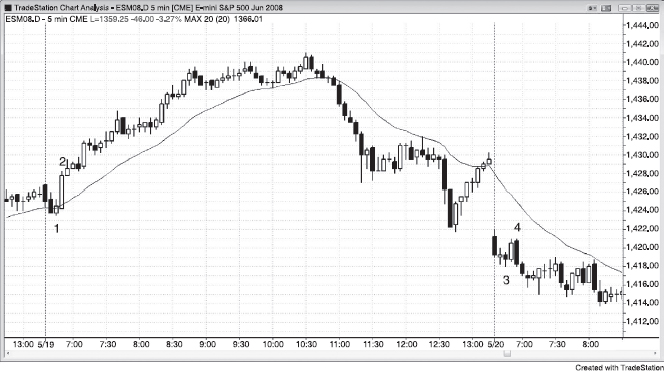
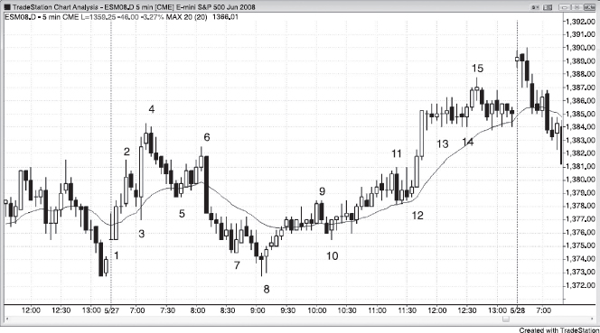
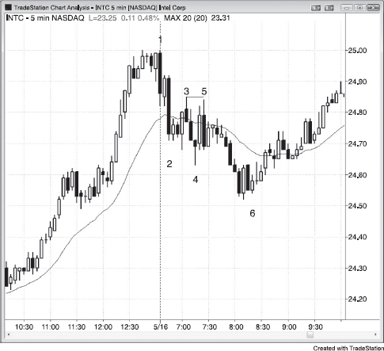
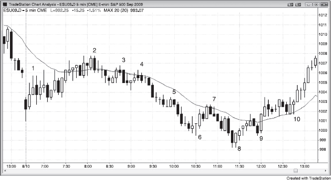

我曾在网上跟一位交易员有过很多交流，他每次交易100手国债期货，但每天太平洋时间早上7:30到8:00之间就会离开。他说自己统计过交易结果，发现85%的利润都来自第一个小时，之后的时间只是在消耗情绪，有时这种消耗还会延续到第二天。因此，几年前他就决定只做第一个小时的交易，效果非常好。

以下是第一个小时的一些特征：

- 所谓"第一个小时"很少真的是一个小时。它指的是第一波像样的波段启动之前的那段时间，短则15分钟，长则两个小时，通常被称为开盘区间。
- 这是最容易赚钱的时段。有经验的剥头皮者知道，反转在这段时间里很常见。这些交易员通常能精心挑选出很多次剥头皮机会，押注突破尝试大多会失败——这在一天中的任何时段都是如此，胜率在60%以上。他们的做法就是低买高卖。一般来说，他们会回避十字星信号K线，但在一波上涨之后，不管信号K线是多头趋势K线还是空头趋势K线，都会在其下方做空；同样，在一波下跌之后，不管信号K线是多头趋势K线还是空头趋势K线，都会在其上方做多。连续出现同方向的趋势K线，往往能提示他们下一次剥头皮的方向。连续两根强多头趋势K线出现后，剥头皮者通常会倾向做多；连续出现空头趋势K线则会让他们倾向做空。
- 这也是最容易亏钱的时段。新手看到大趋势K线，就害怕错过大突破，在强多头急速拉升的顶部追多买入，在强空头急速下跌的底部追空卖出，结果反复亏损。这段时间需要考虑的变量更多，建仓形态出现的速度也更快。新手经常分不清波段交易和剥头皮的建仓形态，导致仓位管理出错。新手不应该做剥头皮，在第一个小时尤其如此。
- K线幅度大的时候，应该用更宽的止损，同时缩小仓位。
- 昨天收盘前 Always-in 的方向，经常会延续到今天的开盘。
- 反转很常见，来得突然，幅度往往很大。如果你来不及读懂价格行为，就等市场节奏慢下来、Always-in 的方向变得清晰之后再动手。
- 当天第一根K线成为全天最高点或最低点的概率只有大约20%，所以不必急着在第二根K线就入场。事实上根本不需要急于交易，因为用不了多久 Always-in 的方向就会变得清晰，成功交易的概率也会更高。
- 全天的最高点或最低点通常在第一个小时内形成，所以波段交易者会耐心等待一个可能成为当天极值的建仓形态。这种形态的成功概率往往只有40%左右，但由于回报可以是风险的好几倍，交易者方程对波段交易来说仍然非常有利。大多数交易员应该把开盘区间里出现的合理反转当作一天中最重要的交易机会。这笔交易在最初五根甚至更多K线里往往看起来很不好，但随后会突然突破，这时大多数交易员才看清 Always-in 的方向。大多数日子里，交易员需要尝试不止一次反转交易才能抓住一次成功的波段，但即使是没走远的那些尝试，通常也能赚一点小钱或者只亏很少。这就为这类相对低概率的交易创造了有利的交易者方程。
- 全天最高点通常以某种形式的双顶起步，虽然很少是标准形态；全天最低点通常以某种不太标准的双底起步。
- 一旦 Always-in 的方向变得清晰，交易员可以直接市价入场，也可以在任何小幅回调时入场做波段。有经验的剥头皮者则会寻找顺势方向的回调来剥头皮。
- 数据报告发布后的几分钟内，交易由计算机程序主导。其中很多程序几乎能即时获取报告数据并据此生成交易指令，另一些程序则基于统计而非基本面来交易。在对手拥有更快的决策和下单速度这种优势的环境里，你很难跟他们竞争，最好等一两根K线再入场。
- 大多数交易日都存在缺口开盘（参见第20章关于缺口开盘的内容）。
- 开盘走势往往能预示当天的行情类型。如果第一根K线是十字星，或者前几根K线大量重叠且带有明显的影线，那么当天出现大量双向交易的可能性更大。

太平洋时间早上7:00经常有经济数据发布。即使网上没有列出报告，市场走势通常也像是有报告发布一样。计算机在分析速度和下单速度上有明显优势，而它们就是你的竞争对手。当对手拥有巨大优势时，不要硬拼。等他们的优势消失、速度不再重要的时候再交易。

开盘后的第一个小时——更准确地说是"开盘区间"——是市场确立当天第一段趋势的时间窗口，趋势一旦启动，这个阶段就结束了。它通常持续一两个小时，有时短到只有15分钟。这个阶段最容易赚钱，也最容易亏钱。原因在于，很多交易员没办法在这么短的时间里处理这么多变量，加上当天K线数量有限，能用的信息也不多。他们要判断一笔交易到底该做波段、剥头皮，还是两者兼顾，而这些都要基于交易者方程的三个变量——概率、风险和回报来做决定。偏偏在这段时间里，经济数据经常发布，反转频繁出现，需要不断做决策，K线本身也经常异常大，迫使他们把风险调到远高于平时的水平。一天中其他时段，风险大小通常是固定的，不用花太多心思。想明白了吗？要思考的东西更多，留给思考的时间却更少。计算机在分析速度和下单效率上有明显优势，而它们就是你的对手。对手占据巨大优势时，不要硬拼。如果你心里在想"真希望我也有程序化交易公司那样的速度优势"，那说明你已经意识到自己处于劣势了。等它们的优势消退之后，再去做那些速度不再重要的交易。

交易本身就够难了，优势永远很小，而第一个小时的额外复杂性可能让交易员超出自己的能力范围。如果需要考虑的变量太多，多到没法盈利，那就通过减少变量来提高成功概率。比如，可以只找高胜率的剥头皮机会，或者只找可能（60%+）成功的波段建仓形态；也可以等出现明确的 Always In 交易之后再做波段，或者在回调时顺着那个方向剥头皮入场。还可以把仓位缩到平时的一半甚至四分之一，同时用信号K线之外的保护性止损——这样止损距离往往要比平时大两倍甚至更多。

交易员分不清波段和剥头皮的建仓形态，是导致亏损的最大原因之一。从交易者方程可以知道，剥头皮者通常需要60%以上的胜率，因为风险和回报大小差不多。剥头皮的建仓形态远比波段的多，但大部分剥头皮形态的成功概率达不到60%，应该放弃。不过，第一个小时反转很常见，交易员往往没有足够的时间去充分评估交易者方程。如果默认做法是见反转就进场、进去之后再算账，长期下来一定会亏。当天的最高点或最低点，往往出现在一个成功概率不到50%的建仓形态之后——用来剥头皮简直糟糕透了，但用来做波段交易却可能非常好。

有经验的交易员通常能在第一个小时里找到4次甚至更多的剥头皮机会，光靠这些就能谋生。比如，平均每天有两笔盈利的剥头皮交易、每笔赚2个点，交易25手 Emini 合约，一年就能赚100万美元。但大多数交易员在只有5到10根K线的情况下，被迫快速判断风险、回报和概率，很难做出可靠决策，所以不应该在反转又快又突然的第一个小时去剥头皮。相反，他们应该耐心等待一个可能（60%+）引发 Always In 波段的建仓形态，或者等波段已经启动、市场的 Always-in 的方向明确之后，再做波段交易。这样回报会大于风险（可能是风险的2到3倍），而且由于 Always-in 的方向已经明确，市场朝着自己方向走出的 tick 数至少等于止损距离的概率在60%以上——到那时就可以把止损移到盈亏平衡点。

很多经验丰富的交易员会在第一个小时里寻找强趋势K线或连续趋势K线，然后在回调时剥头皮。举个例子，如果出现了两根连续的强多头趋势K线，接着跟了一根十字星，他们可能会在十字星低点附近或更低位置挂限价单买入。在他们看来，这只是一个很弱的反转信号，尤其是在如此强劲的多头急速运动之后，这个信号大概率会失败。也就是说，在十字星下方做空的空头将不得不回补空单，而且短期内大概率不会再卖——至少等一两根K线。这就把空头从市场中挤了出去，还把一部分空头变成了买方，从而给多头剥头皮者提供了不错的盈利机会。保护性止损和目标的大小取决于K线的幅度。如果 Emini 日均波幅大约 15 个点，而多头趋势K线大约 2 个点高，交易员可能会冒 2 个点的风险去赚 2 个点，前提是他们相信成功率有 60%——在这种情况下确实经常如此。另一些多头可能会在更低位置加仓，止损放在整个多头急速运动底部的下方。只有非常有经验的交易员才应该在第一个小时里押注K线突破失败，因为行情可能又快又猛，走出很远的距离，交易员必须对自己的判断以及在快速剧烈波动的市场中管理交易的能力有充足的信心。

第一个小时的走势可以非常迅速，交易员经常被大趋势K线的兴奋感裹挟，结果追得太晚。他们知道趋势很快就要来了，害怕错过，反而被反转套住。由于市场在第一个小时里仍在寻找方向，反转十分常见。交易员可能做了一笔交易，打算波段持有，结果下一根K线就反转了。这时候他们得做出决定：是马上出场，还是靠信号K线之外的止损来扛。往往就在他们纠结的时候，他们意识到反方向的交易其实比自己手中的仓位更好，于是陷入了挣扎——怎么把亏损减到最小，同时翻到反方向去。结果拿得太久，指望出现回调让自己少亏一些，最终以比计划更大的亏损出场。不仅如此，大额亏损让他们情绪受挫，需要缓一缓才能做下一笔交易。等他们准备好再次交易的时候，市场已经在新方向上走了很远，即使趋势看上去很强，他们也不敢进场了。收盘后，他们把图表打印出来，简直不敢相信那些入场形态当时有多清晰。但事后看图跟实盘交易完全是两回事。

交易员也可能在本该波段持有的交易上做了剥头皮，结果反而亏钱。如果这周早些时候他们在自认为不错的波段交易上连续亏了几次，今天开盘时就会对波段交易心存戒备。假设这周有好几次行情走出了剥头皮者的利润空间，但很快反转，把他们止损出场了。于是今天，他们决定在第一个小时里每笔交易都只做剥头皮。前两笔剥头皮都亏了，而第二笔被止损时，触发止损的那根K线反转成了一根外包K线，带动行情沿着他们原来持仓的方向走出了一波非常强的趋势。因为他们已经决定只做反转剥头皮，只能眼睁睁看着市场一根K线接一根K线地往前走。趋势跑了 8 个点才出现回调，他们突然意识到，这一笔波段交易的利润抵得上 4 笔成功的剥头皮。

连续几天亏损之后——剥头皮亏是因为选了低概率的入场形态，波段又总被止损出场，放弃之后偏偏错过了一波大趋势——他们又困惑又沮丧。觉得自己什么都做对了还是在亏，交易太不公平了："为什么别人在第一个小时能赚钱，我不管怎么做都在亏？"原因就在于他们想做的太多了。他们在正在形成的交易区间顶部买入、底部卖出，期待突破成功，却不愿面对大多数突破尝试都会失败的现实。等到最好的波段入场形态出现时，他们又不敢做，因为它看上去很弱，看上去大概率会失败，跟过去一小时里的五次反转一样。如果交易员有这种感觉，应该暂停交易开盘区间，等 Always-in 的方向明确之后再说。没错，这时候进场趋势已经走了几个点，能赚的少了，但成功概率大得多。赢得少但赢得多，远比一天亏好几次、指望终于搞懂怎么在第一个小时里盈利要好得多。

开盘后头一两个小时经常出现优质的波段交易建仓形态，交易员必须做好准备去抓住它们。虽然很多人觉得开盘第一个小时的形态跟其他时段不一样，但从价格行为的角度看其实没有区别。这些建仓形态跟一天中其他时段、任何时间周期上的建仓形态并无不同。真正的区别在于：波动幅度往往更大，形态展开的距离更远，反转也经常来得又急又猛。反转在启动时看起来很弱是常见现象——往往先出现两三根弱十字星，趋势才真正突破出去。要认识到这很正常，如果你已经入场了又看到这种弱势，不要急着平保出场。相信自己的判断，因为你很可能是对的（概率 60% 以上），而且你有机会拿到一笔丰厚的波段利润。

开盘还有一个不同之处：很多交易机会是基于昨天的价格行为形成的。昨天最后两三个小时经常会走出一个通道，到了今天开盘，要么直接突破，要么以缺口的形式远远跳出那个旗形。不管是哪种情况，都要留意反转和延续。记住，通道本质上就是旗形——多头通道就是熊旗，空头通道就是牛旗。另外，如果昨天收盘时市场明确处于 Always-in 做多或做空状态，交易员应该假设趋势会在今天开盘后延续，直到出现相反的证据为止。

最后一个重要区别是：大多数交易日的最高点或最低点出现在开盘后大约一个小时内。如果你手里有一笔交易可能正好踩中当天的极值点，尽量用波段的方式持有一部分仓位。如果你确实在这样一笔交易里，而且市场朝你的方向强劲运行，就把止损移到盈亏平衡点，让自己有机会吃到开盘后经常出现的暴利行情。

虽然开盘后第一个小时的任何反转都可能成为当天的最高点或最低点，但任何单一反转真正成为当天极值点的概率通常不超过 50%（概率 60% 以上）。如果交易员选择等到反转之后出现明确的跟随，确认进入明确的 Always-in 状态，那么该反转成为当天极值点的概率往往超过 60%。等待 Always-in 确认的交易员用更小的利润换取了更高的概率，而偏好只做高概率交易的人乐于接受这种取舍。由于当天极值点的建仓形态确定性通常只有 40% 到 50%（概率 60% 以上），把它当作剥头皮来做通常是不划算的（概率 60% 以上），尽管从波段交易的角度看交易者方程很好。趋势在启动之初往往走得很慢，看起来根本不像趋势，但通常在五根 K 线左右就会突破（概率 60% 以上），形成明确的 Always-in 市场。大多数时候，多头趋势日的建仓形态属于某种形式的双底，尽管通常不够标准、看起来并不像双底（概率 60% 以上）。同样，空头趋势日的建仓形态通常属于某种不太标准的双顶（概率 60% 以上）。举个例子，如果开盘后出现一系列强多头趋势 K 线，然后部分回调，五到十根 K 线之后又回来测试，这就形成了一个双底旗形入场，有不错的概率走出新的当天高点。之后的突破可能按测量移动的幅度上涨，进而演变为多头趋势。

交易员经常在第二根 K 线突破第一根 K 线高点或低点时入场，但剥头皮成功的概率往往不到 50%，具体取决于当时的情况。这意味着只有做波段才能让交易者方程成立，但交易员常常错误地把这笔交易当成剥头皮来管理——在概率大约 50%、风险和回报差不多大的情况下，这是一种亏钱的做法。他们说服自己会拿住做波段、扛过回调，却在一两根 K 线之内就抢了个小利润，松了口气。他们其实本来就打算剥头皮，只是自己没意识到，月底一算账发现亏钱了还纳闷。原因就是他们做了一笔交易者方程不利的交易。开盘第一个小时有些反转有 70% 的概率达到剥头皮目标，但只有 40% 的概率达到波段目标。交易员必须在入场之前就想好怎么管理这笔交易，因为入场之后临时改目标是一种必输的策略。你不能按一个前提入场，却按另一个前提去管理——但交易员在第一个小时经常搞混剥头皮和波段交易，因为一切发展得太快，K 线又大，而且 K 线形成过程中内部回调幅度也很大。

开盘第一个小时走势可以非常快，交易员容易被大趋势 K 线的兴奋感冲昏头脑，追高入场。他们知道趋势很快就要启动，害怕错过，结果反而被反转套住。由于市场在第一个小时还在寻找方向，反转非常频繁。交易员可能做了一笔打算拿波段的交易，结果下一根 K 线就反转了。这时候他们得决定是出场，还是依赖信号 K 线之外的止损。而就在做这个决定的时候，他们意识到反方向的交易其实比自己手里的更好，于是纠结着怎么尽量少亏、同时翻到另一个方向。他们拿得太久，等着回调出场，最后亏了比原计划更多的钱。不仅如此，大幅亏损让他们心态受挫，需要缓一缓才能做下一笔交易。等他们准备好再交易时，市场已经朝新方向走了很远，即使趋势看起来很强，他们也不敢下手了。收盘后他们把图表打印出来，简直不敢相信建仓形态其实那么清晰。但事后看图跟实盘完全是两码事。

交易员也可能在本该做波段的交易上用剥头皮的方式亏钱。如果这周早些时候，他们认为不错的波段交易连续亏了好几次，今天开盘时就会对做波段心存顾虑。假设这周有好几次市场走出了剥头皮的利润空间，却很快反转，把他们止损打掉。今天他们决定第一个小时所有交易都做剥头皮。前两次剥头皮亏了，但第二次被止损打掉时，触发止损的那根 K 线反转成了外包 K 线，随后朝着他们已经不持有的方向走出一波非常强的趋势。由于他们决定只做反转方向的剥头皮，趋势一根 K 线接一根 K 线地推进，他们只能干看着。趋势跑了 8 个点才出现回调，他们这才意识到，光这一笔波段交易的利润就相当于四次剥头皮成功的收益。

连续几天因为在低概率建仓形态上做剥头皮而亏钱，又因为频繁被止损打出来而放弃了波段交易（结果放弃之后偏偏错过了一波大趋势），他们既困惑又沮丧。他们觉得自己什么都做对了还是亏钱，觉得交易太不公平了："别人在第一个小时赚得盆满钵满，为什么我怎么做都亏？"原因是他们做得太多了。他们在正在形成的区间顶部买、底部卖，期待突破成功，却无视大多数突破尝试都会失败这个现实。然后他们又不敢做最好的那个波段建仓形态，因为它看起来很弱，好像跟过去一小时里前面五次反转一样会失败。当交易员陷入这种状态时，应该暂停开盘区间的交易，等到 Always-in 方向明确再出手。没错，这样入场时趋势已经走了两三个点，能赚的少一些，但成功的概率大得多。赢得少但赢得稳，远好过一天亏好几次、还在琢磨怎样才能在第一个小时稳定盈利。

当天第一根K线成为全天最高点或最低点的概率大约是 20%（跳空幅度很大的日子除外，这时如果第一根K线是强趋势K线，概率可以达到 50% 甚至更高）。第一根K线通常很长，经常占到当天最终波幅的 20% 左右。举个例子，假设 Emini 最近的日均波幅大约是 10 个点，今天的第一根K线高度为 2 个点，那么在第二根K线向上突破第一根K线高点时买入，大约只有 20% 的概率赚到 8 个点，风险却要略超过 2 个点。这是一个亏损的交易者方程。如果交易员非常擅长主观评估所有变量，能筛选出概率更高的交易，就有可能获得数学上的优势，但这种基于第一根K线的高概率交易大约一个月才出现一次。即便交易员在回报达到风险的 2 倍时止盈，一个月也就成功那么几次，所以在当天第二根K线上寻找波段入场机会很少值得。不过，大多数交易日的第一个小时内都会出现一次可靠的波段机会——回报达到风险的 2 倍——如果早盘出现了强烈的反转建仓形态，交易员就应该考虑做波段。一旦趋势幅度达到止损的 2 倍左右，就可以把止损移到盈亏平衡点，让一部分仓位继续持有，直到出现 Always-in 反转信号。

有时候市场在开盘后的头一两根K线就开始走出趋势，第一根K线最终成为当天的极端点。市场从开盘就形成趋势时，尽早入场非常重要，但不一定非要等到第二根K线。这种形态在跳空开盘时最常见，不管缺口大小。如果你入场的位置可能正好是一轮大趋势的起点，尝试把一部分仓位做成波段就格外重要。形态非常强的话，你甚至可以把大部分仓位都做波段，然后迅速把止损移到盈亏平衡点。

但如果这个强势的开盘走势被反转了——价格向反方向突破到新的日内极端点——那么当天可能朝反方向走趋势，也可能演变为交易区间日。一个强劲的开盘趋势即便被反转，仍然说明有交易员愿意在那个方向上积极交易。一旦反转走势减弱，他们会在当天晚些时候很快再次朝那个方向出手。

如果你认为某个向下的反转不会成为当天最高点，你的确信度不应该超过 30%，因为那意味着你至少有 70% 的把握认为它不是最高点——而开盘区间还在形成的时候，市场永远不会给出那么高的确定性。实际上，一天中任何时段都很少有这么确定的事。那样的优势太大了，交易员们早在确定性达到那个水平之前就会把它消化掉。不要过度执着于某个观点，尤其是在第一个小时内，因为即使最强的走势也可能在下一根K线就剧烈反转。不过，虽然开盘头几个小时内的反转成为当天最高点或最低点的概率可能只有 30% 到 40%，但如果出现了良好的跟随，概率可以迅速升到 50% 到 60%。

尽管大多数早盘反转只适合剥头皮而不适合波段，但如果某次反转特别强，交易员应该尝试至少把一半仓位做成波段。前面提过，第一个小时左右是全天最有可能找到盈亏比达 2 到 3 倍的交易机会的时段。一般来说，大多数交易员应该在开盘后的一两个小时内非常努力地去抓潜在的波段交易，因为这些交易在回报、风险和概率的组合上拥有最佳的交易者方程。

为什么市场会在开盘后的头几根K线大幅运动然后反转？为什么不直接开在当天的最低点或最高点上？当天的开盘价位并不是由某一家或一组机构决定的，它代表的是开盘那一刻买卖双方之间的短暂均衡，通常由盘前交易活动决定。比如 Emini 基本上是一个 24 小时市场，在纽约证券交易所开盘前的几个小时里一直在活跃交易。如果机构当天计划了大量买入，市场为什么还会把某只股票开在昨日收盘价上方，然后先卖下去再拉升到新高呢？设想你是一个机构交易员，今天有大量买单要执行——你当然希望市场开在你想买的价位上方，然后急速下跌到你的买入区域，在那里你可以和其他同样持有大量类似客户买单的机构一起大举买入，随后期待出现一个小型抛售高潮，形成一个有说服力的日内低点。多头机构不急于买入所制造的真空效应，能够迅速把价格吸到它们的买入区域——这个区域始终在支撑位附近——它们会在那里大力持续买入，往往由此形成当天的最低点。

如果开盘卖出高潮之后的反弹足够强劲，很少有交易员会去做空，因为大家普遍认为上行动能已经很强，至少还会再走一段上涨腿，然后才可能回去测试那个低点——如果真的要测试的话。假设你是一个机构交易员，有没有什么办法能促成这种走势？有。你可以在盘前收盘阶段买入、推高价格，同时填掉一部分订单。太平洋时间早上 6:30 正式开盘前，只需要很小的成交量就能把价格推动起来。等正式开盘后，你可以平掉部分甚至全部多头仓位，甚至反手做空。因为你想在更低的价格买入，所以在市场跌到你认为有价值的支撑区域之前，你不会出手。这就是真空效应：买方一直在场，但他们觉得几分钟后价格还会更低，就先退到一边观望。既然过几分钟就能买到更便宜的，何必现在出手？尽管存在非常强势的多头，买方的暂时缺席让价格被迅速吸下去。一旦跌到他们的买入区域，他们看到了价值，也不再认为市场会继续下跌，便像凭空冒出来一样大举买入，形成一波非常急剧的多头反转。做空的一方同样会注意到这个支撑，如果他们判断这段下跌腿大概率已经走完，也会止盈了结空头仓位，转而成为买方。

价格行为非常重要。交易员需要观察的是：当市场跌到某个关键支撑价位——比如均线、前一个波段高点或波段低点、昨天的低点、趋势线或趋势通道线——时，市场是如何反应的。大部分交易都由计算机完成，它们通过算法来计算这些支撑位的位置。如果有足够多的机构依赖相同的支撑位，买盘就会压过卖盘，市场就会向上反转。买盘到底有多强，事先无法知道，但由于支撑位始终建立在数学基础之上，有经验的交易员通常能提前预判出大概率会发生反转的区域，做好下单准备。一旦下跌动能开始减弱、市场从关键价位开始回升，机构就会平掉所有空头仓位，积极买入以填满自己的订单。由于大多数机构的订单方向一致，市场便开始上涨。如果一家机构认为当天的低点大概率已经出现，它就会在上涨过程中持续买入，并在每次回调时积极加仓。因为它的订单量非常大，不会一次性全部买入，以免造成急速拉升后出现买入高潮。相反，它更倾向于全天有序地持续买入，直到所有订单全部成交。随着订单不断被填满，这种持续的买盘推动市场进一步上涨，同时吸引动量交易员全天跟进买入，进一步加大买压。

实际情况真的是这样吗？机构交易员知道自己是不是这么操作的，但没有人能确切知道某一天市场反转的真正原因。反转是由无数因素共同导致的，但那些因素并不重要，真正重要的只有价格行为。反转经常在某份报告发布后几秒钟内发生，但普通交易员不太可能仅靠看 CNBC 就搞懂市场会对报告作何反应。不管报告是利多还是利空，市场都可能涨也可能跌，在没有价格行为的情况下，交易员根本无法可靠地解读报告。最好的办法就是直接观察市场的反应，然后根据价格行为来做交易。很多时候，报告发布前的那根K线本身就是一个很好的建仓形态，报告一出就被触发。如果你非要在报告发布的那一刻交易，就提前下好单、设好保护性止损，相信自己的判断。但因为报告发布时滑点可能很大，几乎总是等报告出来之后再做更好。如果你在报告发布时入场，可能会发现入场就被滑了好几个 tick，然后市场剧烈反转，出场又被滑了几个 tick。你以为风险只有 8 个 tick 的交易，结果实际亏了 16 个 tick 甚至更多。如果你做的是流动性更差的市场，滑点会更严重，可能第一个小时就亏得太深，到收盘都回不到盈亏平衡点。

早盘 7:00（太平洋时间）数据发布后市场急涨，通常是因为机构本来就打算买入，只是一直在等更低的价格。当报告结果足够偏多，让它们觉得不可能再等到更低价时，就在数据发布的瞬间直接买入。如果机构还有大量订单要成交，它们会整天持续买入，那一天就会变成多头趋势日。反过来，如果它们最初的买盘被另一批机构压制——那些机构一直在等反弹，好在更高的价格做空——那么向上的突破就会失败，市场转而下跌。这些空头之前一直隐而不发，因为它们在等反弹才出手做空，直到开始激进做空、把市场打压下来，力量才显现出来。当然，市场运作中还有无数其他因素在起作用，包括大量动量交易者——他们对报告本身没什么看法，只是在行情展开时顺着方向大举交易。但机构在数据发布前已经形成的方向倾向，仍然是一个重要因素。机构在报告发布之前就已经知道自己要做什么，尽管所有机构都会预备应急方案，以防报告出现完全出乎意料的结果。

大约 70% 的交易是自动化完成的，计算机生成的买卖指令正变得越来越重要。道琼斯公司有一个叫 Lexicon 的新闻服务，向订阅者推送机器可读的金融新闻。Lexicon 扫描道琼斯所有关于股票的报道，把信息转换成算法能用的格式，让算法在零点几秒内做出买卖决策。有些算法基于报告中的基本面数据：上个月新增了多少就业岗位？核心消费者价格指数（CPI）是多少？国债拍卖的投标覆盖率是多少？另一些算法运行在更长的时间周期上，除了新闻外，还结合股票表现和财报来做交易决策。还有一些算法纯粹是统计驱动的，比如：如果 Emini 在没有出现哪怕 1 tick 回调的情况下涨了 10 tick，就市价买入并在赚到 2 tick 后离场。另一家公司可能找到统计依据，对同一波上涨做空赚 3 tick。没有人能知道任何一家公司具体在做什么，但只要有人能想到一个点子，并且通过回测验证了数学上可行，他们的计算机就很可能（60%+）在跑这个策略。有些公司的算法可能是基本面和统计方法的混合体。比如：如果经济数据利好，程序会立刻买入；但如果统计数据显示，针对这个特定经济数据，Emini 在上涨 3 个点后会反转并创出新低，程序就可能止盈甚至反手做空来剥头皮。

有些程序使用差分进化优化软件生成数据，再用这些数据生成新的数据。它们可以不断优化数据，直到达到某种数学上的确定性水平，然后自动执行买卖。有些订单规模大到需要花时间来执行，算法交易软件会把大单拆成小单，以免被那些试图利用初始趋势获利的交易者发现。掠夺性算法则反其道而行，专门试图揭示这些算法交易程序想要隐藏的东西。每个人都在寻找优势，越来越多的公司用计算机来发现优势、执行交易。

计算机分析数据和下单的速度远快于人类交易者，而且这些程序具有数学优势，所以在数据发布的那一刻试图和它们竞争注定是亏损的。这些都是超高性能计算机，部署在离交易所极近的位置，能在零点几秒内完成巨额交易。结果就是价格变动往往太快，来不及看清。实际上，价格变动可能快到你家里的电脑比实际行情延迟好几秒。很多时候，前一两秒价格剧烈波动，几秒后又反转，然后可能再反转一次。交易者根本无法在这种情况下足够快地做出判断和下单来盈利。更好的做法是等一等，看看数据发布后是否出现明确的 Always-in 方向走势，然后顺着那个方向交易。当你的对手比你有优势——在这种情况下是速度优势——最好等到他们的优势消失再交易。大多数交易者不应该在数据发布后的最初几秒内交易，而应该等价格行为恢复正常，这通常（60%+）需要 1 到 10 分钟左右。

如果开盘那轮卖出高潮后的反弹足够强，很少有人会想做空，因为大家普遍感觉上涨动能足够强，至少还会有第二段上涨腿，然后才可能去测试低点——如果低点真的会被测试的话。如果你是一个机构交易者，有没有什么办法让这种走势出现？有的！你可以在盘前收盘附近买入，把价格推上去，同时成交一部分订单。在股票市场中，盘前（太平洋时间上午 6:30 开盘之前）推动价格所需的成交量并不大。然后等市场开盘后，你可以平掉部分或全部多头仓位，甚至建一些空单。因为你想在更低的价格买入，所以要等到市场跌到你认为有价值的区域——也就是支撑位附近——才开始买入。这就是真空效应。买家确实存在，但如果他们觉得价格几分钟后会更低，就会先退到一边。既然几分钟后能买到更便宜的价格，何必现在买？这种"买家在场但不出手"的状态会让价格被迅速吸下去。一旦价格进入他们的买入区间，他们看到了价值，也不认为市场会继续下跌，就会像突然冒出来一样疯狂买入，造成一轮非常猛烈的多头反转。空头也会看到支撑位，如果他们判断这段下跌腿可能（60%+）已经结束，也会转为买入来了结空头仓位。

价格行为非常重要。交易者想看的是：当市场跌到某个关键支撑价位时，市场会怎么反应。这个关键价位可能是均线、之前的波段高点或低点、昨天的低点、趋势线或趋势通道线。大部分交易由计算机完成，用算法来计算这些支撑位的位置。如果足够多的机构依赖相同的支撑位，买盘就会压过卖盘，市场就会向上反转。事先不可能知道买盘会有多强，但因为支撑总是建立在数学基础上的，有经验的交易者通常（60%+）能提前预判哪些区域可能出现反转，并做好交易准备。如果下跌动能开始减弱、市场从关键价位开始反弹，机构就会平掉所有空头仓位，激进地买入来填满订单。因为大多数机构的订单方向类似，市场就会开始上涨。如果一家机构认为当天的低点可能（60%+）已经出现，它就会在市场上涨时持续买入，在每次回调时激进买入。由于订单规模巨大，它不会一次性全部买入，以免造成急速上冲然后触发买入高潮。相反，它宁可整天有序地持续买入，直到所有订单成交。随着订单不断成交，持续不断的买盘把市场推得更高，这又吸引了动量交易者整天跟着买入，进一步加大了买压。

这真的是市场运作的方式吗？机构里的交易员知道自己是不是这么做的，但没有人能确切知道市场在某一天为什么反转。反转是无数原因共同作用的结果，但那些原因并不重要。唯一重要的是价格行为。反转经常发生在数据发布后的几秒内，但个人交易者不太可能（≤40%）仅凭看 CNBC 就能理解市场将如何回应一份报告。市场可能因为利多或利空报告而上涨或下跌，交易者在没有价格行为的情况下根本无法可靠地解读一份报告。要知道市场会怎么反应，最好的办法就是看着它反应，然后根据价格行为展开交易。很多时候，数据发布前的那根 K 线就是一个很好的建仓形态，在数据发布时被触发。如果你觉得非要在数据发布时交易不可，就下好入场单、设好止损，相信自己的判断。但由于数据发布时滑点可能很大，几乎总是等报告发布之后再交易更好。如果你在数据发布时入场，可能会发现入场就吃了几个 tick 的滑点，然后市场猛烈反转，出场又吃了额外的滑点。你原以为风险是 8 tick 的交易，最终亏了 16 tick 甚至更多。如果你交易的是流动性较差的市场，滑点可能更严重，第一个小时就可能亏到收盘都回不到盈亏平衡点。

没有人能事先知道，所有大型机构的买单汇总起来能否压倒准备做空的机构，还是空头一方的资金量远远更大、有能力把市场打压下去。大多数交易日里，市场会在一段时间内呈现双向博弈的状态：多头持续买入，空头持续卖出。市场在买卖双方的真空地带中上下试探，等待某一方在价格到达极端位置时夺取控制权。当价格跌到足够低时，一直在等市场回到合理价值区域的强势多头便会大举买入。随后市场迅速上行，直到多头不再认为当前价格具有好的价值，于是停止买入、开始止盈。而一直在等更高价格出手的强势空头仿佛凭空冒出来，开始大举做空。到了某个时刻，其中一方不再愿意在当前价格继续激进交易，由此制造了失衡，让另一方得以推动市场朝自己有利的方向运动。输的一方开始平仓，进一步助推了趋势。赢的一方看到市场朝自己方向运行，便继续加仓，趋势因此变得更强。到了一定程度，他们会开始止盈，这就导致了回调。一旦市场回撤到这些机构认为有价值的位置，他们就会再次加仓，结果通常是对趋势极端点的一次测试。

经济数据公布时经常出现剧烈反转，这些反转可能让你觉得完全不合理，但这并不重要。一份利多报告怎么能先引发一波上涨，几秒钟之后市场就创出当日新低？几分钟前市场还那么偏空，怎么现在突然又变得这么强？不要去想原因。你只需要关注标准的价格行为建仓形态，看到就入场，不必考虑反转背后的理由。你唯一需要知道的就是反转确实正在发生，你必须入场。你不需要理解原因，但要清楚一点：这种事可以发生得非常快，你可能还来不及反应就已经亏钱了。

虽然 5 分钟图是最容易解读、也最可靠的周期，但 3 分钟图的交易效果也不错，在开盘第一个小时尤其如此。不过 3 分钟图更容易产生亏损交易，如果你追求最高的胜率、不想承受亏损带来的负面情绪，就应该坚持用 5 分钟图交易，把精力放在增加仓位规模上。

作为交易员，最好让分析尽量简单，在市场快速运动的第一个小时尤其如此。绝大多数开盘走势都与前一天最后一个小时左右的价格行为有关，形式上无非是突破、失败的突破、突破回调，或始于开盘的趋势，其中任何一种都可能发展得非常快。

日内交易最难的一点是保持专注。大多数交易员就是做不到在整个交易时段都高度投入地盯着市场，他们会被无聊和分心打败，也经常怀疑这正是自己无法持续盈利的一大障碍。事实的确如此。第一个小时给了你一个很好的机会来解决这个问题。就算你觉得自己不可能一整天都盯着每一个 tick 或至少每一根 5 分钟 K 线，你也许可以做到坚持一个小时。这必须成为你的核心目标之一，因为这是一个很好的赚钱方式。这段时间成交量巨大，每天第一个小时都会出现好几个交易机会。如果你只交易第一个小时，等持续盈利之后再逐步加大仓位，你可能会发现自己只需要在那一个小时里保持高度专注就够了。之后一整天，你只需要寻找两三个主要的反转机会即可——这些机会几乎总是可以提前 10 分钟甚至更早预判到，尤其是在你等二次入场点的情况下（一旦你看到第一次入场信号，就做好准备抓第二次，通常几根 K 线之内就会出现）。一旦你能把第一个小时交易好，就试着扩展到前两个小时。前两个小时通常提供一天中最好的交易机会，而且往往能贡献你一整天预期利润的全部。

在节假日前后交易时——比如圣诞周或独立日那一周——第一个小时往往特别重要，因为很多时候只有那段时间市场的表现才像正常交易日。之后市场经常进入窄幅交易区间，一直持续到收盘。如果你打算在节假日前后做交易，就必须对第一个小时的建仓形态格外留心。

交易 5 分钟图时，很容易忽略一点：很多机构交易者同时也在关注 15 分钟图。15 分钟图的第一根K线在第三根 5 分钟K线收盘时完成，因此第三根K线附近的走势会直接影响 15 分钟K线的形态。比如，开盘后前两根K线朝同一方向运动，第三根是一根较小的暂停K线，那么这根K线的突破方向就决定了 15 分钟图上是形成突破还是可能失败。正因如此，当天第三根K线的突破往往能引发一波大行情。大多数时候不要单凭第三根K线就入场，但要意识到它具有特殊的重要性。如果它确实是一根关键K线，通常会有其他价格行为信号作为配合，应该以那些额外信息作为入场依据。

类似的逻辑也适用于 30 分钟和 60 分钟图对应的最后一根 5 分钟K线（比如 60 分钟图由 12 根 5 分钟K线组成，最后一根收盘时 60 分钟K线也同时收盘）。不过，过于关注这些更长周期及其并不频繁的入场机会，反而容易错过一个甚至多个有利可图的 5 分钟交易，得不偿失。

铁丝网形态说明多空双方都在积极交易。如果第一个小时出现铁丝网形态，当天往往会演变成多空轮流控盘的走势。即便铁丝网形态之后出现了趋势，通常也会在某个时点给出一个可交易的逆势建仓形态。

当天第一根K线往往能预示全天的走势。如果它是一根十字星，落在昨天最后一小时窄幅交易区间的中间位置，而且均线走平，那么大概率是一个交易区间日。如果它是一根趋势K线但上下影线明显，那它本身就构成了一个单K线交易区间。既然大多数交易区间突破都会失败，市场可能无法在这根K线上方或下方维持超过一两根K线就会反转。有些交易者会在第一根K线有明显影线时，押注其突破失败，并且愿意加仓一两次。比如，不管市场是跳空高开还是低开，也不管K线实体是阳还是阴，只要影线足够明显，很多交易者就会在K线上方做空、在下方做多来做剥头皮交易，因为他们知道第一个小时通常以反转为主，而交易区间的突破——即使这个交易区间只是单根K线——大概率会失败。所以他们押注突破失败，朝相反方向交易。既然把那根K线视为单K线交易区间，就进入了交易区间模式，这也意味着通常会对大部分或全部仓位做剥头皮。

随后的几根K线也能揭示当天的倾向。如果十字星持续出现，第一个小时内反转了五次，那么交易区间日的概率就上升了。如果开盘有一个大缺口，而且市场在前四根K线持续走趋势，那趋势日的概率就比较大。交易者要做好准备，把始于第一根K线的趋势当作始于开盘的趋势来对待，前几根K线可能就是急速与通道趋势日中的急速阶段。不过也要做好准备：第一次回调可能演变成一个小型最终旗形，由此引发反方向的急速推动，突破开盘区间的另一端，然后朝反方向走出趋势。

第一个两小时内最强的波段交易来自多个形态的共振，但这些形态有时很微妙，交易者应该在开盘前就去寻找它们，并思考可能会发生什么。任何时候都要同时考虑多头和空头各自的理由，因为双方都有聪明钱在操作。一如既往，交易者要关注突破和突破失败。比如，昨天收盘前是不是有一个持续了 18 根K线的空头旗形回调到了空头趋势线附近？如果是，今天是不是刚好在空头旗形下方、均线下方开盘，构成了对旗形的突破，然后反弹了两根K线到均线处形成了一根空头反转K线？如果是这样，那这就是一个在均线处的开盘反转做空机会，也是突破回调做空——测试空头趋势线之后，配合一根好的信号K线，构成了一笔高概率的波段做空交易（也适合剥头皮）。共振因素越多，概率越高；当一个波段建仓形态具备高概率时，这个形态就非常强。再看另一种情况：昨天是不是在一个三天的弱多头趋势中，从一个持续了 25 根K线的交易区间向上突破收盘？这个趋势是否呈楔形？市场是否接近两周交易区间的顶部？突破是否走了两段上涨，收盘时到达了三天楔形上涨的趋势通道线？如果是，今天是不是在昨天收盘价下方几个 tick 开盘，先向上交易，然后反转走出一根强空头反转K线，形成了突破昨日高点和交易区间（可能是最终旗形）上方以及楔形多头通道顶部之后的二次入场做空信号？如果是这样，那这就是一笔高概率的波段做空交易（也适合剥头皮）。

**图 PIII.1** 早盘反转失败

市场经常在开盘头几根K线之后突然反转，但你要随时做好准备：反转可能失败，演变成突破回调。如图 PIII.1 所示，K线1是当天第三根K线，是一根小型多头反转K线，从均线和前一天的波段低点处向上反转。这是一个很好的开盘反转做多入场点，同时也意味着前15分钟K线没能形成强空头趋势K线。

从K线1开始，市场连续走出了四根多头趋势K线。第二根之后，一些多头开始在前一根K线低点挂限价买单，预期第一次回调尝试会失败。他们在K线2之后的第三根小阴线上被成交了。

第二天，K线3同样在前一天的波段低点处向上反转，带来了剥头皮的利润，但多头入场K线随后以两K线反转的方式向下翻转，形成了做空入场信号。注意K线3是一根空头趋势K线，并不是强反转K线，所以这并不是一个好的逆势做多建仓形态。多头期待的是楔形反转，其中前两次下推发生在前一天最后几个小时。但K线3和它前面那根K线都是小型交易区间K线，实体太小，缺乏足够的多头力量来扭转那波强劲的抛售。多头试图在K线3之后那根K线上制造出这种力量，但空头迅速以一根更大的空头趋势K线将市场打了下来。

跌破K线3低点的同时也跌破了当天前15分钟K线的低点，而当天又是大幅低开，这进一步提高了出现可交易的下跌波段的概率。

注意前一天的收盘价刚好低于开盘价，远低于当天最高价。这在日线图上形成了一根反转K线，尽管它只有一个小的阳线实体。一些基于日线图交易的交易员会挂卖出突破单，只要今天跌破昨天低点就做空。由于在那个价位有大量交易员愿意卖出，今天市场跳空低开，第一根K线就交易到了昨天低点之下，触发了日线图上的卖出信号。突破在K线3处一度尝试失败，但向上的反转也同样失败了，形成了双顶熊旗和突破回调做空机会，入场点在K线4下方的两K线反转处。

**图 PIII.2** 开盘头几根K线可以奠定全天基调

如图 PIII.2 所示，开盘头几根K线的价格行为往往预示着后市走向。从开盘到K线4前一根K线的那段上涨中，出现了几根大阳线，只有两根小阴线，说明多头愿意积极进攻。这一点要记住，万一当天晚些时候再次出现买入建仓形态就能派上用场。牢记这一点之后，交易员应该更愿意将一部分多头仓位做波段持有，因为趋势更可能延续。

当天最高价通常来自某种双顶，只不过看起来很少像典型的双顶。这里K线6是第二次向上测试的终点，因此构成双顶做空的信号。K线4成为可能的当日最高点。K线8与昨天收盘低点形成双底，构成了今天的最低点。虽然开盘反转做波段交易的成功概率可能只有40%，但其中很多交易的结果是小赚或小亏。这些小交易通常互相抵消，而那40%能走出4个点以上的交易就成了盈利的来源。对大多数想在日内交易中建立一套稳定盈利模式的交易员来说，做好开盘走势的交易应该是基石。

有经验的剥头皮者预期大部分突破尝试都会失败，在开盘一两个小时内倾向于低买高卖。可能的剥头皮机会包括：

- 在第一根K线（十字星）上方卖出，并在更高位置加仓（第一笔在盈亏平衡点出场，第二笔和第三笔带利润出场）
- 在K线1这根多头趋势K线上方买入
- 在K线2之后那根空头内包K线下方做空（突破昨天交易区间上沿失败）
- 在K线3突破前一根K线高点时买入（因为到K线2的那波急速上涨很强，有较大概率会出现第二腿上涨）
- 在K线3突破创出新高后紧跟着的两K线反转下方做空（低2做空信号）
- 在K线6这根多头趋势K线下方做空，因为它是对下跌到K线5的空头微型通道的两段式回撤，而那段到K线5的强空头微型通道底部有较大概率会被回测

K线8是第二次尝试反转当日新低突破的成功信号，同时与昨日收盘形成双底，因此很可能（60%+）引发至少两段式上涨。实际上，这轮两段式反弹只有一小段横盘暂停，所以整个上涨过程大部分走的是通道形态。当反弹主要以通道形式运行时，即使中间有暂停和一小段第二腿，大多数交易员仍然会把整个通道视为第一腿，并期待后续出现更明显的第二腿。K线8到K线11的上涨只是通道的延伸，期间没有明显回调，因此很多交易员会把这一段反弹仅视为一腿。不过，与大多数通道一样，这段走势中有大量重叠K线、明显的影线以及空头趋势K线。多头通道本质上就是熊旗，所以交易员一直在等待向下突破的机会——一旦突破，回调幅度就可能大到足以确认第一腿已经结束。之后他们需要判断：第二腿上涨是否仍然可能（60%+），还是回调已经持续了足够长时间，使得空头认为市场不会再涨多少，从而在当前价位重新积极做空。结果市场并未向下突破，反而强势向上突破，过去几个小时一直做空的空头不得不赶紧回补。多头看到了多头急速阶段的力度，一路市价追买，因为当急速走势强到这种程度时，概率偏向更高的价格。

K线12是一个高2做多信号，对应第二段更大幅度的上涨，这一段内部同样包含两个较小的腿。

**图 PIII.3** 不要在小波幅的股票上剥头皮

交易员不应该经常在日均波幅不到1美元的股票上剥头皮，但价格行为的入场方法依然有效。如图 PIII.3 所示，英特尔（INTC）在开盘头15分钟出现了两根大的空头趋势K线，随后在K线3和K线5形成双顶熊旗。这是一个可靠的形态，通常（60%+）会引发空头趋势日，这里确实走出了急速加高潮型的空头趋势。昨天的多头趋势非常强，以至于今天的两段式下跌在K线6就反转向上，可能（60%+）是触及了15分钟或60分钟图上的均线，但至少可以做10美分的剥头皮。

只要均线像昨天那样陡峭上行，任何跌破均线的强烈抛售之后几乎都会跟随一波可交易的反弹。K线6是一根双底牛旗的信号K线，与昨天11:35那根强急速上涨中的回调形成双底。随后市场出现了一波更强的多头急速走势并一直延续到收盘，整个上涨演变为急速加高潮型多头趋势。由于第二段急速走势相当于传统急速与通道型多头趋势中的通道部分，其底部通常（60%+）会被回测，这里也确实如此。

**图 PIII.4** 开盘铁丝网形态往往预示着交易区间日

铁丝网形态（窄交易区间伴随长影线和大K线）的特征是明显的影线、K线大幅重叠、频繁反转——如果开盘头90分钟出现这种走势，说明多空双方激烈博弈、方向不确定，当天通常（60%+）会走成交易区间日。如图 PIII.4 所示，当天走出了趋势性交易区间，但由于收盘落在上方交易区间的顶部，因此也算是多头反转日。

开盘出现铁丝网形态后，当天某个时段通常（60%+）会在两个方向都出现可交易的波段。到第三根K线时，铁丝网形态就已经很可能（60%+）成立了，因为这根K线大约一半的波幅被前一根K线重叠，而且收在中间位置，意味着下一根K线也很可能（60%+）重叠其大约一半的波幅。铁丝网形态一直延续到K线2那波弱反弹结束。接着出现了空头趋势线突破和一个更低高点（LH），然后在K线4形成LH的二次入场点，与K线3构成双顶。随后几根K线向下突破，趋势性交易区间变得很可能（60%+），尤其是当时的波幅只比近几日平均略大一半多，而且急速下跌之后，波幅很可能（60%+）会通过一段向下通道继续扩大。交易员正在寻找向下突破后的测量移动目标来做波段空头。向下突破使市场变为 Always-in 做空，跟随抛售是大概率事件。到K线6前一根K线为止的向下通道，可能（60%+）是一个交易区间的起点。K线9是更高低点（HL）之后一段两K线多头急速走势的第一根，一旦这段急速走势完成，大多数 Always-in 交易员会判断市场已经转为 Always-in 做多。

到K线7的反弹突破了多头趋势线，随后出现了一个更低低点（LL），在K线8形成两K线反转的做多入场，接着K线9的更高低点（HL）反弹一直延续到收盘。

K线1处连续两根多头趋势K线就足以让一些多头剥头皮者在K线1低点挂限价买单，保护性止损设在前面那根多头K线的下方。他们在随后的那根空头K线上成交做多，接下来几根K线内就可以获利1到2个点出场。
