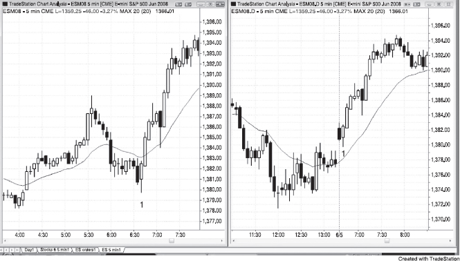
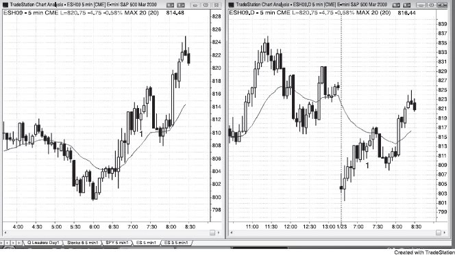

在 Globex Emini 的 tick 图或成交量图上，开盘位置并不容易辨认，因为它只是24小时连续交易日的一部分，跟图表其他位置看起来没什么区别。实际上，包含日盘开盘的那根K线几乎总是含有开盘前的 tick 数据。Globex 的高点和低点往往会在日盘中被测试，Globex 上的一些形态也会在日盘开盘后的前面很多根K线内走完。开盘后第一个小时左右走势通常很快，单看日盘就能提供很好的价格行为。大多数交易员没有能力同时盯两张图做交易，尤其是在开盘后这种快节奏的市场里，所以只需要在 Globex 5分钟图和日盘5分钟图之间选一个就好，这纯粹是个人偏好的问题。有些成功的交易员整天看 Globex，但我更喜欢看日盘。也有交易员先看一个小时左右的 Globex，然后切换到日盘图。Globex 图上出现的大多数建仓形态，只看日盘的交易员同样能在日盘的价格行为中找到入场理由。与其在两张图之间手忙脚乱地分析、下入场单、止损单和止盈单，搞得自己晕头转向还亏钱，不如偶尔错过一笔交易。

当日盘出现大缺口、并在开盘后30分钟左右回补缺口时，Globex 上的均线方向往往跟日盘相反。比如出现大幅低开缺口时，日盘均线是朝下的；但如果 Globex 上已经走出了更低的低点，并且在开盘前30分钟一直在反弹，那 Globex 的均线可能正在上升，价格也在均线上方。如果你只看日盘，看到大缺口、市场从开盘起强势回补缺口，这时候应该关注动量而不是均线，因为动量才是当下真实价格行为的反映。只看日盘的交易员要注意，开盘后第一个小时左右均线常常不可靠。

**图 17.1** Globex 和日盘通常给出关联信号

如图 17.1 所示，Globex 和日盘通常在同一时间给出信号，但形态往往不同。左边 Globex 图和右边日盘图上的K线 1 都是太平洋时间上午 6:35 的K线。Globex 上出现的是最终旗形反转做多信号，而日盘上出现的是一根空头趋势K线反转，构成对昨日收盘前两段式上涨的突破回调做多信号。记住，如果当天第一根K线是趋势K线，它通常是一个剥头皮的建仓形态。如果它失败了，尤其是出现一根方向相反的趋势K线，那就变成反方向的建仓形态。

在 Globex 时段，K线 1 在下降均线下方，但在日盘中K线 1 在均线上方。两个时段的均线可能需要一两个小时才会趋于一致，在此之前它们各自可以提供不同但同样有效的建仓形态。不过对大多数交易员来说，同时看两张图并不会带来什么额外好处，反而更容易导致反应不够快、错过可用的交易机会，或者在下单时犯错。

**图 17.2** Globex 上的均线不同

当出现大缺口时，日盘均线在前30分钟有时帮不上忙。在图 17.2 中，右侧的日盘低开跳空，市场在90多分钟内都无法站上下降的均线。但左侧的 Globex（几乎24小时交易）在开盘前30分钟就开始反弹，从太平洋时间上午 6:30 起市场就在上升的均线上方运行，看起来更偏多。K线 1 处太平洋时间上午 7:20 的铁丝网建仓形态在 Globex 上位于均线上方，因此偏多；但在日盘上却位于均线下方。不过两边的上涨动量都很强，交易员应该寻找做多的建仓形态。
