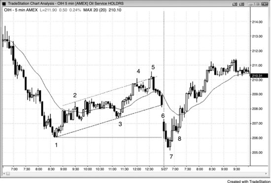
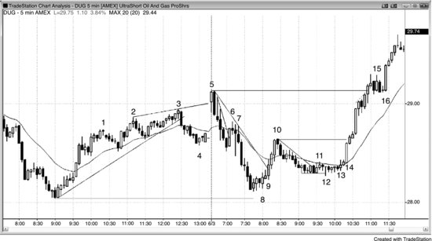
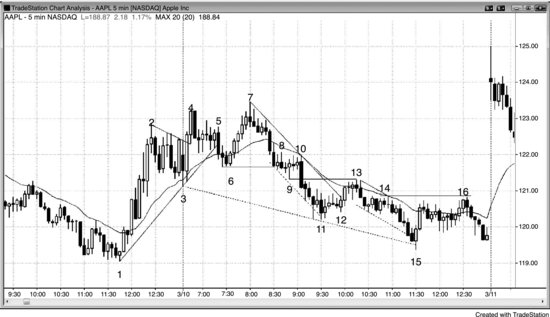
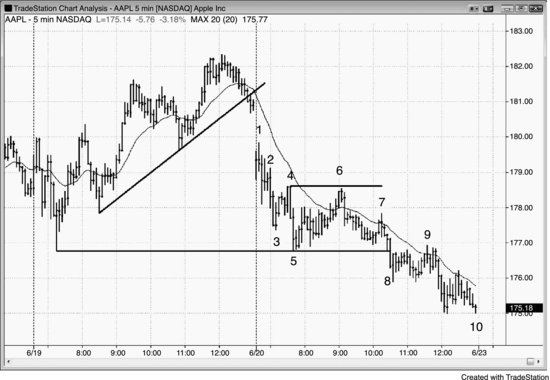
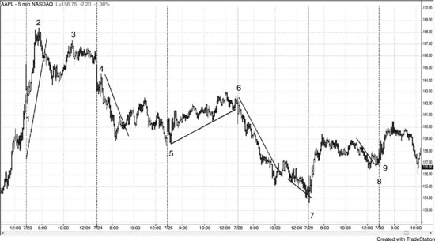

开盘后第一个小时的很多交易机会都跟前一天的形态有关，所以开盘前就应该提前预判可能出现的建仓形态。看一下昨天最后一两个小时的走势，看看有没有强趋势（一个可能延续到今天的 Always-in 方向）、交易区间、通道，或者任何可能在今天开盘时触发突破的形态。虽然有些日子开盘落在昨天最后一两个小时形成的安静交易区间之内、均线也走平，但大多数日子的开盘都会出现某种形式的突破。如果你不确定突破是什么，就看均线，把它当作参考。如果第一根K线整根都在均线上方，就把开盘视为跳空高开；如果第一根K线整根都在均线下方，就当作跳空低开。昨天最后一根K线的收盘价和今天第一根K线的开盘价之间通常存在缺口，这本身就是一次突破。留意一切突破，包括对昨天收盘前通道或旗形的突破——可以是一根K线的最终旗形，也可以是三个小时的通道。还要留意对任何波段高点或波段低点的突破，尤其是昨天的最高点或最低点。

今天一开盘，看到突破之后，你就要评估它获得跟随的可能性有多大。如果出现一个大幅跳空低开，而且第一根K线是一根强空头趋势K线——开盘价接近最高点、收盘价接近最低点——那么今天可能是始于开盘的空头趋势。但如果第一根K线是一根强多头反转K线，那这次突破可能失败，今天可能变成始于开盘的多头趋势。如果空头突破在跟随了几根K线之后出现了一根强多头反转K线，就可能构成一个失败的突破，并可能形成当天的低点。如果反弹只持续了一两根K线，随后又出现一根强空头趋势K线，那这个失败的突破本身可能也在失败。这种情况下，在那根空头K线下方做空就是一个突破回调入场——市场先突破、然后突破失败，但这个失败并没有演变成反转，而是变成了空头趋势中的一次回调。

多头突破的开盘走势正好相反。先看有没有跟随，再看有没有反转形成失败的突破做空机会。向下的反转是否延续——连续出现两三根甚至更多的大空头趋势K线，使空头趋势日的概率大增？还是一两根K线内就出现了多头反转K线，导致那个失败的突破本身也失败了？如果是这样，形态就在演变为突破回调的做多建仓形态。你需要对每一个开盘都做这样的评估：先找到突破，然后看有没有可能反转、形成失败的突破建仓形态。最后，如果确实出现了失败的突破，再观察它有没有跟随、还是正在失败。如果它正在失败，那就是在构建一个突破回调交易机会，突破即将恢复。

**图 18.1** 多头通道就是一面熊旗

昨天的多头通道就是一面熊旗，市场经常在今天开盘时跌破它（见图 18.1）。昨天，石油服务 HOLDRS（OIH）5 分钟图在强烈下跌至K线 1 之后，出现了一波持续将近四小时的两段式反弹，突破了主要空头趋势线（图上未标出），并且两次过冲空头趋势通道线后均反转下跌（K线 4 和K线 5）。这说明多头正在失去控制力，但反弹的幅度本身也体现了多头的力量。

从K线 5 到收盘的抛售使市场翻转为 Always-in 做空状态，交易者预期这一趋势会延续到今天开盘。今天市场跳空低开，出现一根强空头趋势K线，很快跌破了昨天的最低点，随后在那里形成了一个强力的两K线反转。这个跨越两天的大型熊旗失败突破提供了一个很好的做多入场点——在K线 7 的最高点上方一个 tick 入场。这是始于K线 1 的熊旗的最终旗形反转，同时也是一个 LL 型主要趋势反转（MTR）。反转了前一天最高点或最低点的开盘反转往往会形成当天的高点或低点，所以交易者应该对部分或大部分仓位做波段持有。在这里，设好盈亏平衡点止损，就可以把波段一直持有到K线 5 上方的新波段高点，最多可赚 5.00 美元。

当开盘形成对前一天收盘形态的突破时，交易者应该在失败的突破建仓形态（如K线 7）上入场；如果失败的突破本身也失败、变成突破回调，则反向入场。这里随后出现的三根K线的反弹足够强，二次上推的可能性很大，所以交易者此时不应急于寻找突破回调的做空机会。既然二次上推的可能性大，更好的做法是在K线 8 上方买入，或者在前两根K线中任何一根的最低点下方买入。K线 8 是一个突破回调做多的信号K线，对应的突破是向上突破K线 6 构成的开盘区间顶部。同时它也是一个双顶熊旗失败后的做多建仓形态，其中K线 6 是第一个顶。

有一点很重要：尽管昨天从K线5到收盘出现了一波急跌，今天开盘时市场完全可能跳空高开到K线6的位置。如果真是这样，K线5之后的抛售就会变成一次失败的突破。

**图 18.2** 日内早盘的失败突破

不管第一根K线多强，哪怕昨天收盘时有交易者被套，都要随时做好突破失败的准备（见图 18.2）。

UltraShort Oil and Gas ProShares（DUG）昨天收盘前走出了一个持续四小时的多头通道，这实际上是一面熊旗，而且临近收盘时已经向下突破。这个多头通道属于尖峰加通道式的多头趋势，跌到K线4时形成了一个可能的双底牛旗建仓形态。跌到K线4的过程跌破了多头通道，而今天的开盘则从通道顶部向上突破。虽然当天第一根K线是一根强多头反转K线，有可能开启一轮始于开盘的多头趋势，但紧接着就出现了一根强空头趋势K线，两根K线合在一起构成了一个两K线反转，同时也是一个做空失败突破和更高高点（HH）主要趋势反转（MTR）的建仓形态。最终结果是突破K线3处楔形顶部和扩展三角形顶部（K线2和K线3是前两次上推）失败，走出了一轮始于开盘的空头趋势。

昨天的尖峰加通道式多头趋势以楔形通道收尾，因此有可能（概率60%以上）至少出现两腿回调，但从突破回调到K线4之后，市场又走出了一个更高的高点到K线5。当出现像楔形二次入场或扩展三角形这样的强反转建仓形态时，市场通常（概率60%以上）会修正至少10根K线并走出两腿回调，这里正是如此。市场大致走了一个测量移动的距离，测试到昨天低点的略上方。低点处出现的两根阳线实体是买压的信号，一些多头在K线8突破这两根阳线的高点时用突破单入场，也有交易者在K线8这根外包阳线上方入场。市场正在尝试与昨天的低点构成双底，如果能突破K线5的高点，接下来几天可能会继续走高，走出一个向上的测量移动。

K线9是一根外包阳线突破K线，它把市场翻转为始终持仓做多。这让交易者意识到市场并不是在形成熊旗，更可能是在构筑当日低点。

上涨到K线10的这一波是一个三根K线的多头尖峰，影线短、阳线实体大，因此有可能（概率60%以上）还会有第二腿上涨。回调大概率会守在K线9的低点上方——正是在那个位置，大多数交易者确信市场已经翻转为多头模式。

上涨到K线3的过程非常强劲，出现了许多多头趋势K线。虽然最终以楔形收尾，但这种强度意味着修正之后有可能（概率60%以上）还会有第二次上攻。在更高时间周期的图表上，这段走势大概率是一个多头尖峰。

楔形通常（概率60%以上）不会在至少两腿修正完成之前就失败，所以当市场跳空高开并形成一根多头趋势K线时，多头很兴奋。但下一根K线就把他们止损出场了，聪明的交易者把这识别为连续反向失败，随即做空。

K线6是陡峭空头趋势中一次失败的趋势线突破，属于微型趋势线低点1做空信号。这是强空头尖峰中的低点1做空，而且可能是新一轮空头波段的起点，因此是一个合理的交易。

K线7构成了一个空头低点2做空建仓形态，同时与K线6形成了一个小型双顶。

K线8正是价格行为交易者在K线3那波强势上涨之后一直等待的深度回调。这也是当天的两腿下跌，同时测试了昨天的低点。有些交易者把从高点跌到K线8的走势看作两腿回调：第一腿跌到K线4，中间反弹形成一个更高的高点。

K线9又提供了一次买入机会，因为这是一个失败的低点2，失败的低点2通常（概率60%以上）至少会引发两腿以上的上涨。这是一笔很好的交易，因为它把多头套在了场外，错过了强势上涨，之后只能追着市场买入。这种外包阳线形式的失败低点1或低点2陷阱在强趋势启动时很常见，是趋势有可能（概率60%以上）走得很远的信号。

K线10是一段强势上涨，突破了趋势线，突破了均线上方，而且包含多根多头趋势K线，所以接下来有可能（概率60%以上）出现一个更高低点（HL）回调。K线10同时也是一根均线缺口K线，但到了这个阶段，你应该找机会在回调时做多，只有出现非常好的建仓形态时才做空，而且只做剥头皮。从K线9开始，趋势就是向上的，直到被证明翻转为止。

K线11是从一个空头微型通道突破后失败，K线12则成为一个更低低点（LL）突破回调做多的建仓形态。

市场在走向K线13的过程中形成了两根小的空头趋势K线，这实际上是从K线12反转上涨后的两腿回调。你可以在K线13买入——在第二根空头趋势K线的上方入场，或者在K线14——那根作为突破回调的内包K线上方入场。这是一个更高低点（HL）主要趋势反转（MTR）。

市场突破K线10高点时没有出现回调，说明多头力量很强。你可以在1分钟图上找一个高点2做多入场，也可以等5分钟图出现暂停或回调再进场。

K线15不是一个好的高点1做多位置，因为上涨势头已经不再是强劲的多头尖峰了。在此之前，市场经历了一波小型尖峰加通道式的多头行情，在小趋势通道线过冲（虚线）后反转下跌，之后有可能（概率60%以上）至少经历几腿横盘或向下的修正。而且信号K线是一根强空头趋势K线，显示双边交易正在加剧。双边交易的第一个迹象出现在更早的、K线15之前4根K线处的那根空头趋势K线上，K线15之前的5根K线也存在一定重叠和明显的影线。

K线16是在小内包K线上方突破时形成的高点2做多建仓形态，止损可以设得很紧。

**图 18.3** 第一小时双顶

如图18.3所示，开盘第一小时内，市场经常形成双顶或双底，这个位置往往成为全天极值，或者至少是随后几个小时的极值。AAPL前一天收盘时留下一个窄幅交易区间，该区间可能是一个最终旗形的建仓形态。K线3是当天第一根K线，AAPL迅速跌破了前一天收盘时形成的多头旗形下沿，然后又从上方突破，形成一个小型楔形多头旗形突破。但这次突破也失败了，下一根K线就反转回落。虽然K线4处的两K线反转是一个不错的最终旗形做空入场点，但当时向上的动能很强，而且之前向下的突破已经失败过一次，所以等更多价格行为出现后再做空可能更稳妥。到这个时候，先是向下突破失败，接着旗形突破也失败，再加上昨日高点处出现反转，空头的逻辑就更站得住脚了。

K线5出现在一个铁丝网形态的尾端，套住了那些在高点2买入的多头，是一个很好的做空入场点——在高点2信号K线（前一根K线）低点下方一个跳动入场。这根K线把多头套住，随后迫使他们止损出局。市场有可能在均线以及K线2与K线3之间的多头旗形区域找到支撑，所以交易员应对空单保持谨慎。任何由重叠K线组成的区域，尤其是K线实体较大、且窄幅交易区间内多次反转时，都属于强烈双边交易的区域。多头会在下方买入而不在上方买入，空头会在上方做空而不在下方做空。结果就是突破往往会被拉回区间内——K线3、9、11的空头突破和K线4、7的多头突破之后都是如此。

K线6是一个反转做多的信号，原因如下：

- 它是一次失败的突破
- 是多头趋势中（大部分K线都在上升的均线上方）向均线回调的第二腿
- 形成了两K线反转
- 回调到均线时出现了一根多头K线

需要注意的是，下跌到K线6的过程中突破了一条趋势线，说明空头开始愿意积极出手，所以交易员应做好准备，应对K线4处多头趋势顶部测试失败的可能。

K线7是一根反转K线，突破新高后失败。这是第二次尝试突破昨日高点未果（K线4是第一次），由此形成了一个楔形顶部和一个更高高点（HH）主要趋势反转（MTR）。由于当天到目前为止的波幅只有近期典型日内波幅的大约一半，所以无论向哪个方向突破，都很有可能使波幅翻倍，而且有可能（概率60%以上）至少走出两腿（趋势交易者大概有足够的信心，在任何回调之后至少再推动一腿下跌）。K线7是第二次尝试突破昨日高点却失败，当市场连续两次尝试做同一件事都失败时，通常（概率60%以上）会转而朝相反方向运行。K线7的双顶（也是多头趋势中的第三次上推）成为了当天的最高点。

很多交易员会认为，当K线7之后那个由4根K线组成的多头旗形被两根强空头趋势K线跌破时，市场就已经变成始终持仓做空了。也有些交易员希望看到更多证据才下判断。

K线9跌破了K线6的波段低点，但没有跌破当天最低点。由于波幅仍然很小，而且市场两次突破昨日高点都未能形成跟随，再跌一腿去测试当天最低点的概率非常高——那个低点就像一块磁铁，而且近在咫尺，市场已经进入了它的吸引范围。

K线10完成了一个铁丝网形态，但因为所有人都确信还会有第二腿下跌、去测试并创出新的日内低点，所以在小内包K线下方做空的低点2是一个很好的入场机会。这也是跌破K线6之后的突破回调做空入场。最后，由于这根突破K线实体很大、收在最低点，那些需要更多证据才能确认市场已经转为始终持仓做空的交易员也得到了满足。市场很可能继续走低，目标大致在测量移动下跌幅度对应的位置附近。

铁丝网形态的回调在K线10处突破了一条次要空头趋势线（图中未画出），所以这波回调可能是第一段下跌后的修正。但之前下跌的动能太强，多头还没有信心大举买入，他们需要看到更多价格行为。

跌至K线11日内新低的这波下跌几乎是一路直线下来，因此这段下跌可能（60%+）还没结束——交易者会期待至少再出现第二段下跌来测试K线11的低点。由于这是对空头趋势通道线（该通道线起自K线8前一根K线）的失败突破，市场可能（60%+）先走出两段上涨。

K线12是在K线11小双底之后出现的一个小双底回调做多建仓形态，但此前既没有像样的趋势线突破、也没有强反转K线，所以这最多只能做一笔剥头皮。而且，第二段下跌仍然可能（60%+）出现，也没有迹象表明 Always-in 的方向已经反转为多头。与其被七根带长影线的横盘K线之后的一笔小多头剥头皮分散注意力，不如集中精力寻找再次做空或加空的机会。

K线13是空头的又一个低点2入场机会，但上涨到均线的这波反弹突破了一条有效的空头趋势线。这对多空双方都是一个信号：只要反转足够强，下一次从新波段低点向上的反转就有不错的概率走出两段上涨。低点2做空是一个二次入场点，而且信号K线是均线处的一根空头K线，这提高了成功的概率。

K线14是又一个低点2做空机会，出现在K线13之后一波相当强的两K线空头急速下跌之后。

K线15是市场跌破新低后出现的两K线反转向上。在过冲两条空头趋势通道线之后，市场收出了一根强多头反转K线。这是从K线13第一次趋势线突破回调之后的第二段下跌（一小段急速构成第一段下跌，随后的通道构成第二段），也是对K线1——前一日最低高点——的突破回测。有些交易者把它看作双底做多建仓形态，也有人看作K线7强劲反弹之后的HL。这是从日内高点起的第二段下跌，也是一个大楔形牛旗的底部，其中K线3和K线11是前两个推低。所有这些都是多方强势的迹象，增加了反弹走出两段上涨的概率。第二段上涨在K线16结束，K线16突破了第一段上涨的高点后反转下来，未能突破K线14的高点，与K线14形成双顶熊旗。K线15也是K线13空头急速下跌之后抛物线通道的底部。还有交易者认为K线8低点之前的两根空头趋势K线才是更重要的急速段，他们的通道从K线10开始。也有人把K线10看作急速段，K线13之后的下跌看作通道。还有人认为K线4之后那根空头趋势K线或K线5那根空头趋势K线才是重要的急速段，他们把K线7视为HH的突破回调。事实上，每一根空头趋势K线都代表着抛压，而抛压是累积的。一旦积累到足以压倒多头的临界质量，市场就开始下跌。

顺便提一下，当一波强劲的上涨以三连推结束、随后以较弱的动能回落（斜率更缓、趋势K线更小、影线更多）时，三连推的高点大概率会在不久后被突破，因为这个底部很可能是高时间周期的HL。市场在次日开盘就实现了这一目标。如果市场继续上涨，下一个目标就是从双底出发的测量移动。

**图 18.4** 从前一日形态中突破

如图 18.4 所示，当日的第一根K线往往是对前一日通道的突破。前一日是一个多头趋势性交易区间日，也是一个急速与通道型的多头趋势，有三个推高。收盘时市场跌破了通道，开盘跳空进一步向下突破。K线1是一个突破回调做空建仓形态，有可能成为始于开盘的空头趋势的起点。

K线3试图形成一个失败突破的开盘反转，但下跌很陡、走的是通道，这使得K线3的做多风险较高，尽管日内已经出现了小型三连推下跌。当下跌处于窄通道中时，更稳妥的做法是等突破后再等一个回调再买入。

K线5是一个更低的低点突破回调，试图与前一日的低点形成双底（价格分毫不差）。它引发了一波小楔形反弹，在K线6处形成了双顶熊旗。

双顶熊旗是开盘后第一波下跌之后的常见建仓形态，在股票中尤其多见，后面经常跟着一段持续的空头趋势，通常（60%+）表现为趋势性交易区间式的下跌。K线6的信号K线是一根均线缺口K线。

K线7是一个突破回调做空建仓形态，尽管日内新低的突破尚未充分展开——但已经足够了。它也是一个失败的双底回调，同时也是一个成功的双顶回调建仓形态，以及对K线6以来微型通道的失败突破。

K线9是一个两段式突破回调，回调位置在跌破昨日低点和今日低点之后的区域。

昨天全天的多头趋势实际上只是一个大型熊旗，今天则是熊旗突破后走出的空头趋势。今天既是一个趋势性交易区间空头趋势日，也是始于开盘的空头趋势日，同时还是一个缺口型急速与通道空头趋势。

**图18.5 空头通道就是牛旗**

空头通道就是牛旗，开盘时向上突破空头通道后，往往会出现突破回调买入信号。如图18.5所示，昨天是一个强空头趋势日，但K线4突破了一条主要趋势线，说明市场在测试K线3低点之后可能（概率60%以上）尝试反转，而这种测试通常（概率60%以上）会以两段式下跌的方式完成。然而市场并没有反转，而是以两段式下跌一路卖到了收盘。

K线8突破了由K线4反弹所生成的那条更平缓的新主要趋势线，随后在均线附近的K线9处形成了一个小型两段式突破回调（两根空头趋势K线中间夹着一根多头趋势K线）。这个突破回调同时也是一个更高低点（HL）主要趋势反转（MTR），由此引发了一个始于开盘的多头趋势日。当开盘后前5到10根K线形成横盘区间时，很多机构会在区间突破时入场，这种突破往往会带来一个趋势日。如果更早入场——比如像这个例子中在均线测试K线上方入场——风险反而更小。

K线10是第三推（三个趋势性交易区间），因此预期会出现两段式回调。不过，上涨到K线10的通道很窄，所以跌破通道后的突破及两段式下跌可能（概率60%以上）只是暂时的，之后大概率会回来测试高点。

K线11测试了前一个交易区间的低点，是太平洋时间上午11:45的一波急跌，目的是把多头套在场外。它形成了一根均线缺口K线做多信号，同时也是一个高2建仓形态。最后这一段多头腿突破了第三个交易区间的顶部，一路延伸到接近收盘时完成了一个测量移动（高度约为K线10到K线11那段下跌幅度的2倍）。

这是一个急速与通道多头趋势，随后形成了双底牛旗（K线11和两小时前那个交易区间的底部），整体来看是一个始于开盘的多头趋势日。

**图18.6 昨日形态很重要**

前一天的形态几乎总会影响开盘后第一个小时的走势。看图18.6时，不用纠结图上那些很小的K线，重点关注概念即可。

K线1是一次急跌回调，测试昨天的强势收盘，之后迅速反弹上涨。在K线1回调高点上方一个tick处有买入入场点，在当天第一根K线高点上方同样有买入入场点。

K线4是一个突破回调做空建仓形态。开盘形成了一个更低的低点（出现在K线3的更低高点LH和主要趋势反转MTR之后），K线4构成了一个低2做空建仓形态。

K线5是一个开盘反转，出现在更低高点（LH）主要趋势反转（MTR）之后，测试的是昨天空头趋势线被突破后形成的空头低点。今天高开后下跌，测试了那个更低低点（LL）。K线5上方的突破回调入场实际上等同于一个高2，因为K线5是第二段下跌（昨天收盘是第一段），同时也与昨天最后一根K线以及当天早些时候形成的低点构成了一个小型双底。

K线6的小型更低高点（LH）加上趋势线突破，产生了一个突破回调做空机会。当天第一根K线测试了趋势线下方并反弹上涨，但这波上涨在K线6处失败了。

K线7是一个楔形做多建仓形态（跌破空头趋势通道线和昨日低点后的失败突破），这个楔形出现在主要空头趋势线被突破之后。它是从跌破那条小型趋势通道线后反转上涨的。

K线8是从昨天收盘前那条趋势线上方突破后的突破回调。那个空头通道就是一面熊旗，所以K线8就是一个突破回调做多建仓形态。它同时也是昨天开盘强势反弹之后一个大型两段式回调的终点。K线8的突破回调更高低点（HL）之后，最容易的入场点是K线9处的高2。
