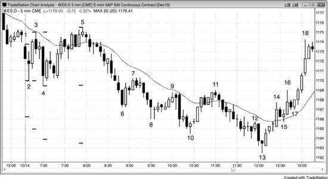
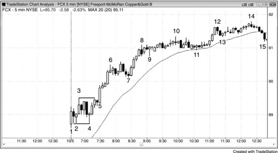
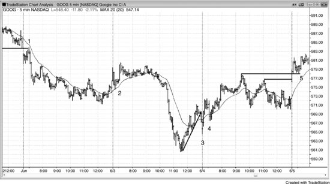
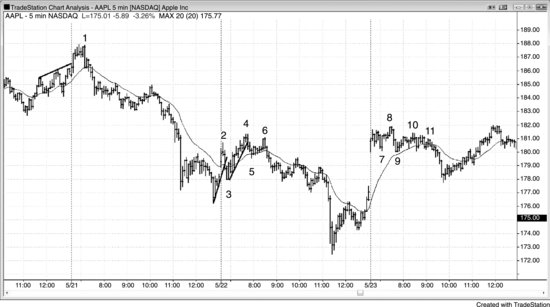
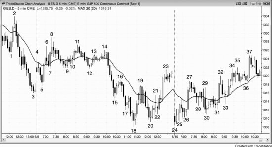
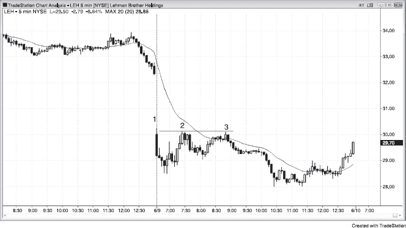
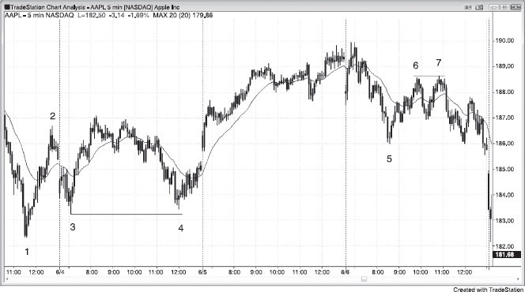
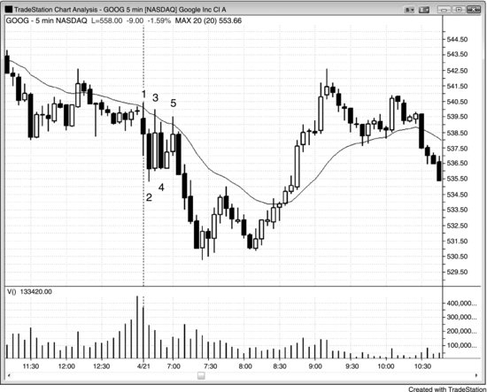
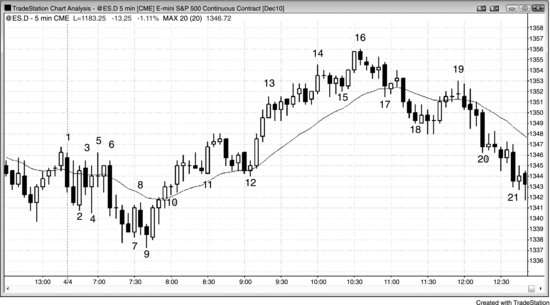

机构交易员在开盘前就有需要执行的订单，他们希望以尽可能好的价格成交。比方说，如果手上主要是买单，而市场大幅低开，他们会立刻买入——觉得这个低价是难得的好机会，不会持续太久。如果判断市场还会再跌一些，就会等到更低的价格再出手。反过来，如果市场高开，他们可能会觉得市场应该先回落一下。既然预期很快就能在更低的位置买到，现在就没有动力去买。这就形成了一个卖出真空效应，市场会迅速下跌——因为机构多头只是在等更好的价格买入，并没有人在主动抛售。他们几乎都会等市场跌到某个支撑位，比如均线、趋势线、测量移动目标，或者前期的波段高点、波段低点。如果有足够多的机构手上都有偏向买入的订单不平衡，而且都在差不多的价位开始买入，那么这轮急跌就能形成强劲的向上反转。这波抛售与其说是空头在主导，不如说是强势多头在等市场跌到支撑位——一到位就大举买入，把空头彻底压制住。这就是真空效应：市场被迅速吸到一个有大量强势买家等候的价位。

反过来也一样。当机构在开盘前积累了大量卖单时，市场往往会出现一个买入真空效应，价格被迅速推高，然后空头突然出手，把市场打下来。这些空头从开盘起就看空，但如果他们相信市场还会往上走到某个阻力位，就不会急着做空，而是等到市场涨到他们认为不会再涨的位置。在那个点位做空才合理——如果觉得市场还会再涨一点，提前做空就不划算。一旦市场到了那个位置，就开始大举做空，彻底压过多头。结果就是一个向下的开盘反转。

这些剧烈的上下反转就是开盘反转，它们常常成为当天的最高点或最低点。如果交易员能理解背后的逻辑，不被"所有急速走势都只是急速阶段、后面会跟着通道"这种想法误导，就能在反转时果断做波段交易，有时甚至可以把一部分仓位持有大半天。

虽然大多数交易日都会出现开盘反转或始于开盘的趋势——这类机会大约有50%到60%的概率拿到至少2倍于风险的回报——但新手很难在多个建仓形态中判断哪一个最好。任何建仓形态的确切概率都没法精确知道，因为变量太多，开盘区间内的建仓形态尤其如此，但我给出的数字是合理的参考。大多数交易日，开盘区间内会出现好几个合理的反转建仓形态，但它们只有大约30%的概率演变成盈亏比至少2:1的波段交易（不过其中很多有大约60%的概率拿到1:1的盈亏比）。另外，最早出现的那个反转有时是最好的机会，但随后出现的几个反转往往会把价格拉回到入场价以下，把新手吓得出局。新手可以选一个自己觉得够强的建仓形态入场，然后依靠保护性止损，允许回调出现，等着最终的突破；或者也可以先按1:1的盈亏比剥头皮出场，如果接下来又出现了看起来不错的反向反转建仓形态，就反手做。对大多数交易员来说，更容易走上盈利之路的做法是：选一个自己认为好的建仓形态入场，依靠保护性止损，容忍回调，只有在出现强烈的反向信号时才出场。

当天第一根K线成为全天最高点或最低点的概率，在所有市场中大约是20%。如果这根K线是一根没有长影线的强趋势K线，概率提高到30%。大约50%的交易日里，全天的最高点或最低点会在前5根K线左右形成；90%的交易日里，会在开盘后一两个小时内形成。虽然大多数反转建仓形态做波段交易后拿不到2倍于风险的利润，但如果交易员坚持持有，大部分最终会变成剥头皮级别的盈利。赢利交易的利润通常 (60%+)至少跟亏损交易的损失一样大，再加上偶尔的大赢交易，这种做法整体上是值得的。另一种选择是只做剥头皮，目标是拿到至少1:1盈亏比的利润。当天最高点通常 (60%+)来自某种形式的双顶——尽管两个高点的价格往往不完全一样；当天最低点通常 (60%+)来自双底。总的来说，如果当天是反转行情，交易员应该等到出现双顶或双底之后再考虑做波段交易。一旦形成双顶或双底，根据背景和建仓形态的不同，大约有40%到50%的概率演变成波段交易，并成为当天的极值。

大多数交易员应该下功夫成为识别和交易最佳开盘反转的专家，把这类波段交易作为自己交易体系的基石。举个例子，当 Emini 日均波幅大约在 10 到 15 个点时，一个看起来还不错的开盘反转（背景良好且有一根像样的信号K线），做到 4 个点波段的概率往往只有 40% 左右（建仓形态特别强的时候可以到 50% 到 60%）。但 2 个点的止损在达到利润目标或出现反转信号（交易员可以小亏或小赚出场）之前被打掉的概率，往往只有 30% 左右。这让交易者方程对这种交易非常有利。如果 10 笔交易中有 4 笔赢了 4 个点，波段交易部分就赚了 16 个点。再假设其中大约 3 笔亏损不超过 2 个点，另外 3 笔小赚大约 1 到 3 个点，这些交易加起来基本打平。选对建仓形态的话，这是比较典型的结果。这样 10 笔交易下来，总共赚了大约 16 个点，平均每笔 1.6 个点，对日内交易员来说已经很不错了。

如果没有出现反转，那根急速K线后面实际上可能跟着一段通道，全天走成急速与通道趋势日。如果反转确实出现了，但只持续了几根K线就又朝急速方向反转回去，那这次反转尝试就算失败了——它变成了一个突破回调建仓形态，后面通常会接某种形式的通道。比方说，市场在当天前 3 根K线强势上涨后出了一根空头反转K线，很多交易员会在那根K线下方反手做空。但如果急速很强、反转K线很弱，更多交易员会判断这次反转尝试大概率失败。他们会在任何回调中挂买入突破单，挂在前一根K线高点上方——包括那根空头反转K线的高点上方（如果没有进一步回调的话）。一旦市场上涨触发了这些突破单，前面那波小跌就变成了突破回调，反转尝试宣告失败。如果对上涨力度特别有信心，一些多头还会在反转K线价位或更低处挂限价单买入。

开盘总会引发突破或反转，有时两者兼有。除了缺口开盘之外，开盘常见的形态跟盘中其他时段出现的并无二致，包括：

- 始于开盘的趋势，这在第一册第一部分已经讨论过。
- 突破与反转（反转本质上就是失败的突破）。在支撑或阻力区域寻找反转机会，比如均线、趋势线、趋势通道线、波段高低点（尤其是昨日高低点）、突破区域、交易区间的顶底，以及测量移动目标位。
- 突破回调（失败的突破未能反转市场方向）。

大多数交易日里，当天的最高价或最低价会在开盘后大约一小时内形成。一旦当天的一个极端确立，市场就会朝另一个极端反转。当然，始于开盘的趋势日里不存在反转，但市场仍然会朝另一个极端运动，通常在尾盘附近到达。开盘反转通常可以识别，并且能提供很好的波段交易机会。开盘后的第一波走势往往又快幅度又大，让人很难相信它会突然掉头，但这恰恰是常见现象。转折点通常出现在某个关键位置，比如测试昨日高低点、昨天或今天的波段高低点、突破昨天或今天的交易区间、趋势线或趋势通道线、均线，或者上述任何一个在不同时间周期图表或 Globex 图表上的对应位置。即使最佳建仓形态出现在 60 分钟或日线图上，几乎总能在 5 分钟日盘图上找到价格行为上的入场理由，所以擅长读图的交易员只需要盯住自己用来交易的那一张图表就够了。

开盘阶段的价格行为往往能揭示当天的性格。如果第一根K线是一根十字星，又落在昨天收盘区间的中部，那它本身就构成了一个单K线交易区间，当天走出交易区间日的概率就会增大。如果第一个小时内出现大量重叠的K线，影线很长，且多次反转，那交易区间日的概率同样增大。反过来，如果向上或向下跳空后，第一个小时内出现三到四根空头急速K线，而且这些趋势K线实体大、重叠少、影线短，那当天走出空头趋势日的概率就高了。交易员经常会观察开盘后第一个小时左右有没有出现连续的多头趋势K线。如果出现了，他们会将其视为市场处于 Always-in 做多状态的信号，至少可以做一笔剥头皮交易。也就是说，他们认为市场可能正处于多头趋势的早期阶段。在跟随力度足以让交易员相信某种测量移动有可能（60%以上）实现之前，大多数交易员会选择对大部分甚至全部仓位做剥头皮。这就是开盘第一个小时左右经常出现多次反转的原因。如果出现的是连续的强空头趋势K线，交易员就会认定市场处于 Always-in 做空状态，当天正在尝试演变为空头趋势日。比如，在已经走出连续的强空头趋势K线之后，如果有一根K线突破了前一根的高点，许多交易员就会在这根回调K线的低点下方做空来剥头皮。如果背景合适，他们可能会认为这次回调只是一轮大趋势的起点，从而将大部分甚至全部仓位做成波段交易。

开盘区间往往能为判断全天走势提供线索，为之后的交易提供支撑和阻力参考，也可以用来做测量移动的投射。开盘区间的顶部和底部通常有好几种选法，因此很少有人能完全一致地认定到底是哪几根K线构成了它，或者它花了多长时间才成形。大体上，开盘区间就是前30到90分钟内交易区间的高度（如果存在交易区间的话），或者该时段内最大一段走势的幅度。有时候这段走势内部还包含两到三个小腿，有时候会在回调后再创一个更高的高点或低点，或者更低的高点或低点。如果出现了这种新极值，有些交易员会据此扩大开盘区间的范围，另一些则继续沿用原来的区间，把新极值看作无意义的过冲。

把开盘区间的大小分成三类来看很有用。如果区间幅度只有近期日均幅度的大约25%，交易员就会在区间向任何一个方向突破时入场。一个月大约有两次，这种情况会发展成始于开盘的趋势日，回调小、推进持续不停。

如果开盘区间大约是近期日均幅度的三分之一到一半，交易员会预期当天的幅度将扩大到接近平均日幅。这种日子通常（60%以上的概率）会先走一段交易区间，然后向上或向下突破。其中大约三分之二会演变为趋势日，通常（60%以上的概率）是趋势性交易区间日，不过任何类型的趋势日都有可能。突破幅度一般会达到以开盘区间高度为基础的测量移动目标。通常（60%以上的概率）在当天晚些时候会回来测试突破点，而且经常会回到之前的区间内。如果回到开盘区间的反转力度很强，市场收在该区间的另一侧，这一天就变成了反转日。这实际上是反转日最常见的形成方式。另外三分之一的情况中，市场只是稍微突破开盘区间就反转，并从区间的另一侧突破，之后又折回区间内。出现这种走势时，当天通常（60%以上的概率）会变成一个小型交易区间日，但有时候第二次突破也能引发一个反方向的趋势性交易区间日。

第三种情况是开盘走势幅度很大。这通常（60%以上的概率）是由一段强劲的急速推动造成的，当天往往演变为急速与通道趋势日，但有时也会引发高潮反转，一般是在一个小型最终旗形之后。

有一点很重要：如果市场在开盘时走出一段强劲的走势然后反转，那段初始的强劲走势说明那个方向有力量，它有可能（60%以上的概率）在当天晚些时候卷土重来。比如，如果开盘前四根K线强烈下跌，然后反转上涨走出强多头趋势，你应该记住最初那段空头走势，不要想当然地认为多头会控制市场到收盘。那段初始的下行力量说明空头之前愿意激进做空，他们有可能（60%以上的概率）在当天晚些时候寻找下一个做空机会，尽管目前处于多头趋势。因此，如果多头趋势中出现了一段强烈的回调，不要忽视它有可能（60%以上的概率）是又一次趋势转换——这次是转回空头趋势。

开盘第一个小时出现的形态与盘中后半段相同，但反转往往更为猛烈，趋势持续的时间也更长。要最大化交易利润，关键之一在于：任何一笔有可能成为当日最高点或最低点的交易，都应波段持有一部分仓位。如果该笔交易看起来特别强，就波段持有全部仓位，在价格运行了初始风险的1到2倍后，先止盈1/3到1/2。假设你在自认为可能是当日低点的位置买入，初始止损设在信号K线下方，大约低于入场价3个点，那么盈利约2到4个点时先平掉1/4到1/2，盈利约4到6个点时再平掉1/4到1/2。另一种做法是不用固定限价单，而是在盈利2个点后首次暂停时减仓一部分，盈利4个点后首次暂停时再减一部分。剩余合约一直持有，直到出现明确且强烈的反向信号，或盈亏平衡点止损被触发。每次出现顺势入场形态时都可以加仓，例如强趋势中两段式回调至均线附近。这些加仓合约大部分或全部做剥头皮，但仍需波段持有一部分。

有些反转一开始很平静，走了许多根K线仅有轻微的趋势，看起来就像旧趋势中的又一个旗形，但随后市场突然猛烈地向相反方向突破，进入新趋势。例如，一个熊旗可能向上突破，市场反转进入多头趋势。还有一些反转从入场K线开始就带有很强的动能。要对所有可能性保持开放心态，尽量捕捉每个信号，尤其是强信号。难点在于：反转经常来得很突然，交易员可能还没来得及说服自己"这个反转入场形态真的会走出反转"。但只要信号K线是一根强趋势K线，成功率就不错，你必须入场。如果觉得还需要更多时间评估这个入场形态，至少先进1/2或1/4的仓位，因为行情可能突然飞速运行，你必须参与其中，哪怕只做一点。然后在首次回调时再加仓。

双底牛旗与双底回调不同——双底回调是反转形态，而双底牛旗是多头趋势已经启动之后出现的延续形态。从功能上看，两者一样，都是做多的入场形态。

双顶熊旗同理：它是空头趋势进行中的延续形态，而非像双顶回调那样的反转形态。不过两者都是做空的入场形态。在一波强烈的下跌和一次回调之后，空头趋势恢复，然后市场再次回调到与第一次回调大致相同的水平。这个交易区间就是双顶熊旗，是一个做空的入场形态。多数情况下，第二次回调会略低于第一次，这在空头趋势中是正常的，因为每个波段高点往往低于前一个。入场方式是在入场K线下方1个tick处挂卖出突破单。

有时候市场在开盘后约3到10根K线内形成一个交易区间，其中出现两次或更多次反转。如果该区间相对于平均日线振幅而言很小，那就很可能（60%以上）会被突破。在第一根K线之后，如果既出现了向上反转又出现了向下反转，有些交易员会在这个小区间被突破时入场，目标是一个测量移动幅度。交易员可以在区间突破时入场，但如果能在区间顶部或底部利用小K线押注失败、或者等突破之后在失败突破或突破回调处入场，风险会更小——这与处理任何交易区间的方法一样。

**图 19.1** 小型开盘区间突破后的测量移动

当开盘区间大约是近几日振幅的一半时，市场通常（60%以上）会突破开盘区间，并尝试将振幅大致扩大一倍。有时候开盘区间有多种画法，到底哪种正确？通常（60%以上）都正确，因为不同的交易员会依据不同的画法做出决策。但在图 19.1 这一天，没有哪种画法能精确指导止盈或反转位置。大多数支撑位——包括测量移动的投射目标位——都不会引发反转，因为市场具有惯性，强烈倾向于延续当前走势。这意味着大多数反转尝试都会失败。但当市场最终反转时，必定发生在某个支撑位。如果在支撑位出现了强反转入场形态，盈利交易的概率就更高。截至K线5，当日振幅仍只有近几日平均振幅的一半左右，因此振幅大幅扩大的概率很高。每一次新的反转都使开盘区间有所扩大，但下跌至K线6的抛压很强，所以这次突破很可能（60%以上）会带来一个大致等距的向下测量移动。

当天走出了趋势性交易区间日，尾盘又回到了上方区间内，这种情况很常见。这里，当天收在上方区间顶部附近，形成了一个反转日。大多数反转日都是从趋势性交易区间日开始的。理解这一点之后，交易员就可以在价格从下方区间底部反转上涨时，将一部分仓位做成波段交易。

开盘后大约第一个小时内的反转，只有大约 25% 能发展为波段，因此在出现双底、双顶或者明确的 Always In 建仓形态之前，最好先做剥头皮，等到胜率适合波段时再出手。今天就是个普通日子，前面好几个建仓形态都只适合剥头皮。K线 3 和K线 1 构成双顶，因此大约有 50% 的概率成为当天最高点。它同时也是一个回调到均线的突破回调做空形态。K线 4 和K线 2 构成双底，也有大约 50% 的概率成为当天最低点。结果两者都不是。在 90% 的交易日里，最高点或最低点出现在开盘后头两个小时内，而且通常来自某种类型的双顶或双底。K线 5 和K线 3 构成双顶，同时也是一个小型楔形顶和均线缺口K线，最终成为当天最高点。

在散户投资者占日成交量比例较大的时候，他们对开盘缺口和反转的影响也更大，因为他们会根据日线图在开盘前挂单。比如日线上出现了一根多头反转K线，交易员收盘后看到了，就会在开盘前挂一张买入止损单，挂在那根K线高点上方。他们太怕错过买入机会，甚至愿意以开盘价直接买入，哪怕买入价高于那根K线的高点。这往往导致市场跳空高开，去寻找愿意接盘的卖家。一旦这些过于急切的买方在虚高的价格成交，市场就会回落到机构认为有价值的位置。机构在那里大量买入，将市场推回新高，形成开盘多头反转。开盘时那段短暂的小幅下跌，会在日线多头趋势K线底部留下一根影线，这在多头趋势日里很常见。空头趋势日则相反：急于出场的多头在开盘时不惜以开盘价卖出。市场往往要跳空低开才能找到足够的买家。一旦他们的卖单成交，市场就会涨到机构觉得有卖出价值的位置，然后反转下跌，创出新低，经常走出空头趋势日。

**图 19.2** 开盘区间的大小很重要

如图 19.2 所示，开盘区间的大小往往能提示当天后续走势。这张 Freeport-McMoRan（FCX）的 5 分钟图上，开盘区间大约只有近几天日均波幅的四分之一。经过几根K线后，交易员发现当天波幅可能很小，大多数人会忽略第一根K线，转而等待一次向上急速运动和一次向下急速运动。一旦市场跌破K线 3，就形成了一段向上急速运动（即向下反转）。一旦市场涨破K线 4，就形成了一段向下急速运动（即向上反转）。到那时，很多交易员会把这两段急速运动当作突破模式建仓形态，在上方急速运动高点上方一个 Tick 处挂买入止损单，在下方急速运动低点下方一个 Tick 处挂卖出止损单。一旦其中一张单成交，另一张就变成初始保护性止损单。如果入场后市场掉头，交易员通常会将保护性止损单加倍，并计划在止损被触发时反手。

交易员往往可以在突破之前入场。比如这里，开盘跳空高开幅度很大（从陡峭的均线可以看出），第一根K线是多头趋势K线，所以走出多头趋势日的概率不小。K线 4 在K线 2 的 ii 形态下方仅跌破一个 Tick 后便反转上涨，很多交易员在K线 4 这根双底牛旗信号K线上方做多（记住，当天最低点通常来自某种类型的双底）。还有人在K线 5 涨破那根小空头内包K线时买入，另一些人则在突破K线 3 高点时买入。

当开盘区间像这样很小的时候，区间内的回调也很小；而当市场突破后进入趋势阶段，回调往往仍然很小，这里就是这样。通常在尾盘最后两个小时左右会出现一次回调，幅度大约是之前回调的两倍，K线 14 之后的那段下跌就是如此。

交易员经常留意开盘第一个小时内是否出现连续的趋势K线，一旦出现，很多人就会据此判断市场的 Always-in 方向。比如，K线 2 处出现了连续的多头趋势K线，但由于实体较小、影线较长，大多数交易员还需要更多确认才会断定 Always-in 方向朝上。这个确认来自K线 4 之后的两根多头趋势K线。到那时，很多交易员认定 Always-in 方向朝上，于是持有多头波段仓位，止损设在两根K线急速段的底部下方。K线 5 是一根强多头突破K线，进一步印证当天是多头趋势日，后续连续出现的几根多头实体也提供了额外的证据。注意K线 4 之前有三根空头趋势K线，每一根后面都跟着一根带多头实体的K线。空头无法形成跟随卖盘，说明空方很弱。多头将那些空头趋势K线视为买入机会而非做空建仓形态，这是市场可能（60%+）上涨的有力证据，在大幅高开缺口的交易日尤其如此。

**图 19.3** 开盘处的突破回调

如图 19.3 所示，Google（GOOG）在这四天的开盘阶段都出现了突破回调。K线 1 是陡峭均线附近的一个低 2 做空信号，价格跌破前一天低点 6 美分从而回补了缺口，形成向下反转，构成了当天的最高点。

K线 2 是突破前一天波段高点之后的均线回调。多头 ii 形态是做多建仓形态。K线 2 多头K线之后的那根K线与当天第一根K线形成了双顶，构成了当天的最高点。

K线 3 是一个向上的反转（失败的突破），发生在价格跌破前一天尾盘上涨所形成的多头趋势线之后。K线 4 是一个 HL，与K线 3 大致构成双底。

K线 5 是一个高 2 双底牛旗（第一个底在两根K线之前），同时也是突破前一天高点后的第一次回调。这有可能发展成始于开盘的趋势日。

**图 19.4** 开盘早期的失败突破

如图 19.4 所示，Apple（AAPL）在这三天的开盘阶段都出现了失败突破，并引发了开盘反转。K线 1 是趋势通道线过冲后的开盘反转二次入场点（低 2）。

K线 2 是向上突破后的向下反转（失败的突破），突破对象是前一天最后一小时的交易区间以及延伸到前一天收盘的空头趋势线（图中未标出）。之后市场从均线处反转上涨，形成了K线 3 的 HL，同时也是一个突破回调。

K线 4 是在尚未确认为多头趋势日的情况下出现的 HH 反转下跌，因此是一个好的做空机会。它还呈楔形，是开盘缺口急速上涨之后通道的顶部。

K线 6 是K线 5 跌破多头通道后形成的 LH 最终旗形向下反转。交易员预期价格会回测K线 3 处的通道底部。

K线 7 是大幅高开缺口日中的高 2 突破回调，但市场在K线 8 的 HH 和最终旗形突破处再次回落。由于当天此时尚未确认为多头趋势日，这是一个好的做空机会。

K线 9 创了新低，但下跌动能很强，可能（60%+）会有第二段下跌。开盘高开缺口是一个多头急速段，而K线 8 到K线 9 的下跌是一个空头急速段。这构成了一个高潮反转建仓形态，之后通常（60%+）会进入交易区间，这里也确实如此。在交易区间内，多空双方都在加仓，试图推动价格朝有利于自己的方向形成通道式跟随走势。最终空头胜出，多头不得不平掉多头仓位，进一步加大了抛压。

K线 10 是一个低 2，也是一个两段式 LH。

K线 11 是在K线 10 的 LH 之后，基于失败的高 2 形成的二次做空入场点。多头两次尝试扭转 LH 所暗示的空头方向，两次都失败了。当市场两次试图做同一件事都失败时，通常（60%+）会朝反方向运行。

**图 19.5** 低开缺口和高开缺口都可能引发开盘上涨

如图 19.5 所示，K线 4 是一根强空头反转K线，同时处于强空头趋势中均线测试的位置，构成了跌破K线 1 之后的突破回调做空建仓形态。高开至均线附近的缺口就是这次回调。

K线 2 到K线 3 的走势是急速与通道型空头趋势，K线 4 是对通道顶部附近的测试。这种测试之后通常（60%+）会进入交易区间。同时，高开缺口向上突破了前一天最后一小时的陡峭空头趋势线，多头在寻找突破回调的做多建仓形态。当多空双方各自都有合理的论据时，就意味着存在不确定性，而不确定性通常（60%+）意味着市场正处于交易区间的起点，这里正是如此。

K线5虽然不是反转K线，但它构成了一个突破回调——市场向上突破昨日空头通道后回踩，同时也是一种高2变体（K线4是空头K线，随后出现一根多头K线，接着向下走出第二小段，到达K线5）。这可能是高潮性收盘之后形成的HL。既然收盘前那段强烈的下跌几乎没有回调，这种走势就不太可能持续，因此属于高潮行为——高潮之后往往会出现两段式逆势运动。K线5之后的那根多头趋势K线，与K线5本身及其前面的空头K线一起构成了两K线反转，同时也与从K线4下来的那段走势形成两K线反转。要记住，一段急速下跌紧接着一段急速上涨（就像那根多头趋势K线），本身就是卖出高潮——在高时间周期图表上表现为两K线反转，在更高时间周期图表上则表现为多头反转K线。

K线8是一个楔形顶，也是从K线5的HL起算的两段式上涨。

这一天是趋势性交易区间日，从K线20开始的反弹测试了之前那个较高交易区间的底部。

K线24是双底牛旗，第一个底是K线20，或者是K线18低点之后那根内包信号K线。它同时也是对昨日低点测试后的反转上涨，以及从K线18到K线23那个大型两段式熊旗的失败突破。

K线25是当天前30分钟内一根强劲的外包阳线，交易者因此认为Always-in方向可能已经转为做多。他们希望后续回调能守住K线25的低点，当K线26向上转时，他们认为当日低点可能已经确立。

K线26是一个HL，并触发了从一个ii建仓形态的突破。ii形态的第二根K线有强劲的多头收盘，这提高了上涨概率。它同时也是熊旗中一个失败的低2，套住了那些看到大幅向下跳空缺口就做空二次入场（低2缺口回调）的空头。这是一个小型最终熊旗，是第二次尝试反转市场跌破昨日低点的走势，也是第二次尝试在向下跳空穿过昨日两段式熊旗之后反转回升。

**图19.6** 缺口开盘后的两段式回调

如图19.6所示，大幅向下跳空缺口之后，往往会出现两段式回调至均线附近，随后突破进入空头趋势。

K线2和K线3在一个大缺口下跌日形成了双顶熊旗（缺口就是旗杆），同时与K线1一起构成三角形（三个顶加上收敛形态即为三角形）。

K线3是两K线反转的第一根K线，也是低2做空建仓形态。更稳妥的做法是在K线3之后的空头K线下方做空，而不是在K线3这根多头趋势K线下方做空，因为市场很可能先横盘整理，然后再次尝试向上突破K线1和K线2的双顶。在交易区间顶部的空头K线下方做空，比在多头趋势K线下方做空更可靠。

虽然大多数交易者认为开盘区间只持续一两个小时，但市场经常在太平洋时间上午8:30左右启动一段趋势，这里就是如此。K线3的双顶究竟算开盘反转还是普通的双顶，这并不重要。重要的是，趋势往往在上午8:30左右启动或反转。

**图19.7** 双底牛旗与双顶熊旗

如图19.7所示，双底牛旗和双顶熊旗很常见。K线3和K线4在反弹至K线2之后形成了一个大型双底牛旗。K线6和K线7在强劲下跌至K线5之后形成了双顶熊旗。

**图19.8** 两次失败尝试后的反转

当市场两次尝试向上突破都失败时，通常（60%以上的概率）接下来会尝试向下突破。如图19.8所示，GOOG在太平洋时间上午7:00数据公布前，在一个小型交易区间内横盘整理，因此处于突破模式。由于收敛的交易区间中出现了三个顶，这就是一个三角形。交易者可以在交易区间低点下方用突破单入场做空，但在K线5下方做空低2的风险更小。这是低2，因为K线3和K线5构成了两段上涨。由于当时市场处于交易区间中，高2和低2可以同时存在，这里就是如此——高2做多失败，变成了低2做空。由于交易区间位于均线下方，它就是一个熊旗，因此向下突破的概率更大。

K线2是连续第二根空头趋势K线，两根K线都是大实体、小影线，这让交易者认为Always-in方向朝下，后续任何回调都会形成做空建仓形态，至少够做一笔剥头皮。K线5下方的低2做空入场是第一个机会，从那根大阴线入场K线和跟随K线就能看出，大多数交易者相信这波抛售会延伸到足以做波段交易的幅度，而不只是一笔剥头皮后反转上涨。K线5与K线3形成双顶，触发了一笔波段做空。

交易员把这个双底叫做开盘反转也好，觉得它出现得太晚、不算开盘区间的一部分也好，都不重要。关键是，市场经常在太平洋时间上午 8:30 前后反转，交易员要知道这一点，并做好入场准备。

**图 19.9** 开盘铁丝网形态

如图 19.9 所示，有些交易日一开盘均线就走平，K线大幅重叠，根本找不到安全的建仓形态（顶部或底部附近没有小K线可以用来做押注失败的入场）。这就是铁丝网形态，处理方式跟所有铁丝网形态一样：耐心等待。等其中一方被趋势K线的突破套住，然后找机会押注这个突破失败。铁丝网形态的突破通常 (60%+) 会失败，所以铁丝网形态往往就是最终旗形。这里突破跌破了昨日低点，而市场经常在突破前一日高点或低点后反转，这种倾向进一步提高了铁丝网形态成为最终旗形的概率。该形态有三连推向上，整体横盘运行。一些交易员把它看作三角形——只看K线实体会更容易辨认。

K线 7 是铁丝网形态底部突破后出现的一根向上反转K线，但前面已经走出了 4 根空头趋势K线。这样的空头力度足以让交易员等待第二次买入信号。虽然有些交易员把它看作高 2（高 1 是K线 6 的高点），但K线 6 是一根强外包阴线，大多数交易员认为这波下跌是从K线 6 开始的。K线 6 就是那根让交易员开始认为市场可能 (60%+) 正从交易区间突破进入趋势的K线，他们预期在这根外包阴线的多头陷阱之后至少还会有第二腿下跌。所以大多数交易员把K线 7 看作高 1，因为下跌走势是从K线 6 顶部开始的，而不是从K线 5 顶部。

K线 7 突破了一条微型趋势线，随后K线 9 形成了一个 LL 突破回调买入建仓形态。K线 9 的收盘价在其中点之上，满足了反转K线的最低要求。到这个时候，价格行为基本是双向的，反转频繁，影线也很明显，所以在新的日内低点做二次入场的多头甚至不需要一根反转K线。

K线 9 上方的多头入场，是对之前日内低点和昨日低点的第二次反转尝试。之后市场一路上涨穿过了开盘区间的另一侧，并在K线 12 处给出了一个高 2 突破回调做多建仓形态。K线 12 是出现在均线处的一根多头反转K线，作为牛旗末端的买入信号非常强。K线 9 之后那根强多头趋势K线让很多交易员转为 Always-in 做多；另一些交易员是在突破K线 10 上方的那根强多头趋势K线出现后确认 Always-in 做多；还有一些是在K线 11 那根突破高 2 买入建仓形态的强多头趋势K线出现后才确认。
