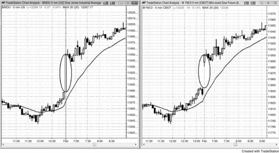
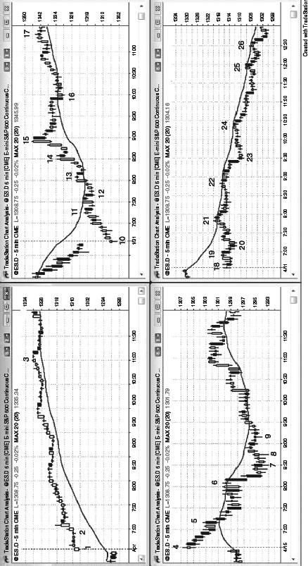

在任何时间周期上，所谓缺口开盘，就是当前K线收盘后与前一根K线之间没有重叠。5分钟图上，大多数交易日都会出现缺口开盘。缺口本质上就是一种突破——市场从前一日最后一根K线突破出来，交易方式与其他突破相同。不同之处在于，交易员知道大缺口会提高当天走出趋势日的概率。缺口越大，走出趋势日的可能性越高（60%以上），同时也越可能（60%以上）充当急速运动的角色，随后沿同方向发展出趋势性通道。举个例子，大幅向上缺口大约有50%的概率随后走出多头通道，20%的概率进入交易区间，30%的概率演变为空头趋势。这些概率只是大致参考，因为要用计算机回测得出精确数字，需要考虑的变量实在太多。多大的缺口才算"大"？缺口之后涨多少才算通道，而不仅仅是略微上斜的交易区间？跌多少才算反转，而不只是一个较深的回调？另一个参考标准是：如果某个缺口是过去大约5天里最大的，或者超过日均波幅的一半左右，就可以认为是大缺口。

5分钟图上，相对于昨天收盘价的大幅缺口开盘属于极端行为，通常（60%以上）会导致当天在某个方向走出趋势日。日线图上是否也有缺口并不重要，因为交易方式是一样的。唯一重要的是市场如何回应这种相对极端的行为——是接受还是拒绝？缺口越大，越可能（60%以上）以此为起点，走出远离昨日收盘价的趋势日。开盘前几根K线的大小、方向以及趋势K线的数量，往往能揭示随后可能（60%以上）出现的趋势日方向。有时市场从开盘第一两根K线就开始走趋势，但更常见的情况是先朝反方向试探一段，再反转进入一个持续全天的趋势。每当看到大缺口开盘，明智的做法是假设会出现一段强趋势。不过，趋势有时可能（60%以上）需要一个小时才真正启动，而且通常（60%以上）以一个两段式逆势运动作为开端——比如两段式回调到均线附近，或者走出双底、双顶。有时还会出现第三段推动，形成楔形旗形。每笔交易都要确保有一部分用于波段持仓，即使连续几笔波段部分被止损出场也不要放弃。一笔好的波段交易抵得上10笔剥头皮，因此在确认当天不会走趋势之前，不要轻易放弃波段机会。

可以把缺口想象成一根巨大的、不可见的趋势K线。比如，大幅向上缺口之后，市场仅出现一段小幅回调，然后全天以通道形式上涨，这很可能（60%以上）就是一个缺口型的急速与通道多头趋势，缺口本身充当了那根急速K线。以Emini为例，可以去看标普现金指数，你会发现当天的第一根K线是一根大的趋势K线，对应的正是Emini上的缺口。

开盘的交易方式跟其他任何开盘一样：寻找始于开盘的趋势、一个失败的突破（即反转），或者突破回调。唯一的不同在于，波段交易要更积极；一旦当天开始走趋势，就在回调处寻找加仓机会。交易过程中应该始终分批止盈——这些止盈可以是剥头皮级别的——但只要趋势仍然强劲，就继续寻找顺势入场的机会。

趋势日的概率提高，并不意味着一定会走出趋势日。大多数大缺口日在开盘后前5到10根K线里都会出现交易区间行为，多空双方正在争夺趋势方向，有些甚至全天都在交易区间里运行。要对所有可能性保持开放，不要被某种预设信念束缚。你的任务是跟随市场，你无法影响它，更不可能用意念让它朝你想要的方向走。如果做错了就出场，别指望市场去做那个低概率的事情，突然朝你的方向走。如果出现了大缺口但价格行为不够清晰，就先假设市场处于交易区间，低买高卖。在出现高概率的波段建仓形态之前，可能（60%以上）需要先做几笔剥头皮。

**图 20.1** 缺口就是一根急速K线

如图 20.1 所示，5分钟图上的缺口开盘不过是突破和急速运动的另一种表现形式。右侧图表中，道指期货在开盘时跳空高开，但在左侧的道琼斯工业平均指数现金图上，那个缺口只是一根大的多头趋势K线。

**图 20.2** 缺口可以引发向上或向下的趋势

大缺口开盘会提高当天走出趋势日的概率（方向可涨可跌），但也有可能演变成交易区间日。如图 20.2 右下方图表所示，K线 18 到 K线 22 之间的横盘走势就是大缺口之后连续数小时横盘的例子。

缺口越大，当天沿缺口方向走出趋势日的可能性就越高。比如左上方图表中的 K线 1 是一个大幅向上跳空缺口，当天走出了多头趋势日。

左侧两张图表都是大幅向上跳空开盘：上面那张走成了多头趋势，下面那张走成了空头趋势。右侧两张图表都是向下跳空开盘：上面那张走成了多头趋势，下面那张走成了空头趋势。

K线 1 是大幅向上跳空日的一根多头趋势K线。当天走成了始于开盘的趋势，表现为缺口急速与通道形式的多头趋势。

K线 4 是一根十字星，但带有多头实体。市场在随后两三个小时内持续下跌。从开盘到 K线 7 日内低点的这段下跌走势，有明显的影线、重叠的K线以及几根多头趋势K线，这些都表明存在双向交易。多头在此过程中持续制造买压，并在下半日控制了市场。

K线 10 是大幅向下跳空日的一根多头趋势K线，当天走出了始于开盘的多头趋势日。

K线 18 是大幅向下跳空日的一根十字星。市场在随后几个小时里延续横盘走势，直到 K线 23 出现一波空头急速才向下突破。开盘的十字星本身就是双向交易的信号，这种双向格局持续了好几个小时。空头急速出现之后，当天转为空头趋势日，空头在 K线 24、25 和 26 的均线回测中压倒了多头。虽然在 K线 21 和 22 的均线回测时空头已经表现出力量，但当时还不足以让市场突破交易区间、进入空头趋势。

大幅向上或向下跳空之后，如果没有出现强反转，交易者方程对顺势交易者就会非常有利。比如 K线 1 处市场大幅向上跳空后开始横盘，走出多头趋势日的概率随之上升，可能达到 60% 甚至更高。交易员预期当天的日内波幅大约与近几天的平均水平相当，大概 20 个点。市场在回补缺口之前先上涨 20 个点的概率可能在 60% 以上，因此在开盘后前几根K线买入的交易员，承担大约 10 个点的风险，目标是 15 到 20 个点的利润，成功率有 60%，这是一笔非常好的交易。他们的止损甚至可以设在缺口中间位置以下，这样风险可能只有 6 个点而不是 10 个点。不管怎么说，正是这种优异的数学期望，让大缺口开盘能够提供非常好的交易机会。
