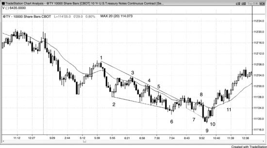
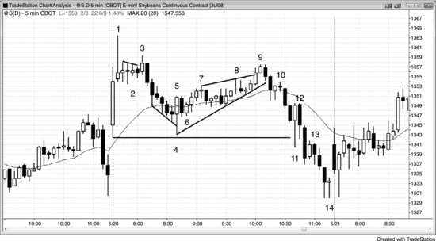
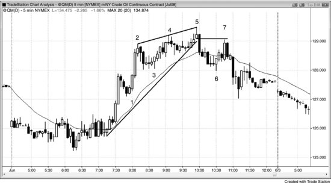
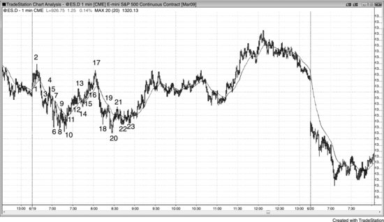
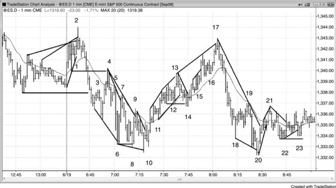

本章提供了大量详细的合理日内交易实例，融合了三册书中的核心思路。

**图 21.1** 10年期国债 10,000股图表

图 21.1 是一张10年期美国国债期货图表，每根K线基于10,000股成交量。成交量超过10,000手合约时，该K线收盘。由于每根K线的最后一笔交易可以包含任意数量的合约，大多数K线的成交量会超过10,000手，而非恰好10,000手。这些K线不基于时间，有些可能只需几秒钟就形成，有些则可能需要10分钟以上才能累积超过10,000手合约。

K线3、4和5是空头趋势中测试均线后的做空入场。

K线6是一个二次入场的空头趋势通道线过冲后的向上反转，但信号K线较弱（一根小十字星）。不过，从K线6楔形反转开始的上涨突破了趋势线，为后续测试低点时的做多提供了建仓形态。

K线7是一个两段式更高低点，但它本身是一根十字星，说明多空双方都在积极交易，而非单边强劲买盘的信号，况且前面还有两根强空头趋势K线。虽然这是一个勉强可以接受的做多建仓形态，但最好等待更强的信号出现。如果你做了多，应该在K线8下方止损出场，因为K线8是均线处的低2做空建仓形态，而且带有空头实体。这是一个很强的卖出信号，逆势做多的交易员应该在空头第二次尝试恢复趋势时出场，甚至考虑反手做空。在空头趋势中做多的逆势交易员，遇到低2信号时都应该出场，除非趋势已经明确反转，低2建仓形态很可能（60%以上概率）失败。K线11就是这种情况的例子。

K线9是一个更低低点处的主要趋势反转（MTR），也是K线6楔形底突破后的突破回调，构成了一个可能出现强趋势反转的做多建仓形态。它同时也是空头趋势通道过冲后的反转，是一根多头反转K线，并形成了两K线反转。从K线6到K线9的交易区间构成一个窄通道，成为空头趋势的最终旗形。此外，它还是K线2急速下跌后形成的更大楔形通道的反转。急速与通道形态中的空头通道常以三推结束，这里也是如此（K线2、6、9）。

K线10是一根内包K线上方的突破，结束了第一个微小的回调（一根空头趋势K线）。交易员可以在K线10上方做多，或者在已有K线9上方多单的基础上加仓。在经历了急速与通道的空头形态（K线2结束了急速阶段）以及三推下跌（K线2、6、9分别终结了三次推进）之后，市场很可能（60%以上概率）展开一段持续时间较长的两段式上涨，因此K线10处的暂停很可能（60%以上概率）只是第一段上涨中的一部分，而非第二段上涨的起点。一般来说，如果空头通道持续了20到30根K线，修正阶段至少会持续通道K线数量一半的K线数。如果修正幅度太小，空头会犹豫不敢做空，多头则会继续买入，因为他们觉得修正还需要更多K线才能充分展开。多空双方都需要确认市场是否正在反转，而从K线10起的四根K线多头急速上涨就是强有力的反转证据。急速与通道形态的空头走势通常（60%以上概率）会回撤到K线3附近的通道起点，这里确实如此。多头经常在那个位置止盈。那个区域正是某些交易员开始逐步加仓的位置，一旦市场回到他们最初的入场价，他们往往会平掉全部仓位。他们在K线2到K线3之间建立的初始多单大约在盈亏平衡点出场，而所有在更低价位加的仓都赚了钱。空头往往也会在这里再次积极做空，因为他们知道市场早些时候就是从这个区域开始下跌的，有可能再次如此。但这天已经快收盘了，空头没有足够的时间来获利，所以他们选择不在尾盘做空。

K线11是一个高2做多建仓形态（高1出现在两根K线之前），出现在一段强劲的多头急速上涨之后。交易员预期至少还有两段上涨，而这个两段式回调相对于急速上涨的幅度来说太小，可能并不意味着第一段上涨已经结束。交易员认为有三种可能：一是这个回调幅度太小，只是较为复杂的第一段上涨的一部分；二是第一段已经结束，第二段上涨正在开始；三是第一段已经结束，市场会先做更深的回调，然后再超越这一段的高点。三种可能都指向市场会继续上涨，所以这是一个很好的做多机会。没错，K线11也是两K线反转顶部的入场K线，也是空头趋势中均线缺口K线做空的二次入场点，本可能导致市场测试空头低点。但急速上涨已经把市场翻转为 Always-in 做多状态——大多数交易员都这么认为，所以空单走不远的概率很大。大多数交易员认为这次反转的力度远强于做空建仓形态。

**图 21.2** 欧元/美元的强势开盘

如图 21.2 所示，5 分钟 EUR/USD（外汇）在创出新高后，于K线 2 处向下反转。此前的多头腿动能很强——连续 8 根K线中没有出现一根空头趋势K线，因此在跌破K线 1（多头急速的底部）之前，任何回调大概率都会先回测K线 2 的高点。K线 3 是一根均线缺口K线，同时也是对K线 1（上涨起点）的突破回测。它与前面两根K线共同构成了一个微型楔形，按理应该至少引发一波向上的反弹。这同时也是强多头急速之后的楔形牛旗。第一腿下跌是K线 2 之前的三根K线，第二腿下跌是K线 2 之后的两根K线，第三腿是K线 3。

市场形成了一个三角形，最终演变为窄幅交易区间。三角形至少要在一个方向上有三次推动：K线 2、4 以及 6 或 8 构成了三次向上推动，K线 1 或 3 连同K线 5 和 7 构成了三次向下推动。当存在多种解读时，有些交易者会更看重其中一种，另一些交易者则偏向另一种。只要分歧存在，市场就处于交易区间中，也就进入了突破模式——大多数交易者应该等待突破，而不是在窄幅交易区间内部交易。

K线 8 是一次失败的向上突破尝试（比K线 4 高点低一个 tick），随后以空头外包K线的形式跌穿了区间底部。它与K线 4 或K线 6 构成了双顶熊旗。

K线 9 是一根小K线，位于外包K线中部上方，是一个风险较小的突破回调做空机会。

K线 10 是另一个突破回调做空机会。

K线 11 是在均线处配合空头信号K线的低 2 做空建仓形态，同时也是第二次尝试向下突破K线 3 急速低点。

K线 12 同样是在均线处的低 2 做空建仓形态。永远不要停止挂单。空头可能因为出现了多头十字星和更高低点而放松警惕，但你仍然要意识到市场处于空头波段中——一旦价格跌破这根K线，就会形成低 2 做空。

K线 13 是趋势通道线过冲及卖出高潮K线之后的 ii 做多建仓形态。这是一个抛物线楔形底——意思是下跌在尾段加速后反转向上。从K线 10 开始有三次向下推动，由前两次推动（K线 10 和 11 之后的波段低点）画出的趋势线，比由后两次推动（K线 11 之后的波段低点与K线 13 前的最终低点）画出的趋势线更平缓。

市场已经下跌了大约 20 根K线，突然出现了这波空头趋势中最大的空头趋势K线（K线 13 前两根）和最大的两K线空头急速。这根急速很可能代表衰竭——它可能是最后一批弱势多头在出逃，最后一批弱势空头在追空。强势多头正在这里买入，即使价格继续下跌也会加仓而非恐慌出局；强势空头则只会在大幅回调之后才做空。这就创造了至少持续 10 根K线、至少两腿上涨的良好机会。紧接着出现的强多头内包K线表明买方正在掌控局面，是一根不错的信号K线。

K线 15 是三次向上推动后的第一根均线缺口K线。从K线 13 开始的两K线多头急速构成了向上的急速阶段。急速与楔形形态通常在回调之前还会再有两次向上推动，这里也不例外。

K线 16 是一个 ii HL 做多建仓形态，因为交易者预期从趋势通道过冲及K线 13 低点入场后的反转至少会有两腿上涨。它与K线 14（从楔形通道底部到K线 15 底部的那段回调）构成了双底牛旗。那根大空头趋势K线把空头套进了空头仓位，也把弱势多头套在了场外。

**图 21.3** 大豆开盘买入高潮

如图 21.3 所示，大豆 5 分钟图在开盘时出现了买入高潮，随后形成小型最终旗形，之后又出现楔形熊旗，并走出了幅度较大的第二腿下跌。

K线 2 是K线 1 急速上涨之后的十字星交易区间，因此是个糟糕的买入建仓形态——横盘甚至下跌的风险太大。激进的交易者用限价单在前一根K线高点处挂空，在K线 3 处成交，预期这个高 1 会失败。K线 3 是低 2 做空、更低高点，同时也是最终旗形做空。交易者在K线 1 的买入高潮之后寻找更深的回调，同时也在关注可能出现的开盘反转和当日高点。

K线 4 过冲了空头趋势通道线，随后从与当天第一根K线构成的双底处反转向上。这里可能就是当日低点。入场点在K线 6 的 ii K线上方，该K线收阳，且收盘在均线之上。

K线9是一个LH楔形熊旗，同时跟K线3构成双顶熊旗。从K线4低点算起，市场经历了四段上涨，形成一个低4变体。市场可能正在走出从K线1开始的两段式下跌，交易员会在K线9下方或K线9之后那根空头K线下方做空。紧随其后的那根K线是一根很大的空头趋势K线，说明很多交易员在K线9之后那根空头K线下方入场做空了。

K线10是趋势线突破后的突破回调。

K线11是当日新低之后出现的一根很大的多头反转K线，构成一个两K线反转。但K线12未能突破K线11的高点，这使它成为一根很好的做空信号K线——K线11早期入场做多、被套住的多头，会在K线12这根空头趋势K线下方止损出场。这也是一个突破回调做空建仓形态。K线13是突破回调做空入场点。

**图 21.4** 原油楔形顶部

如图21.4所示，原油5分钟图上形成了一个楔形顶部，随后出现了一个LH。K线1是从前方交易区间突破后的高1突破回调，也是一个两K线反转。它同时是一段强两K线多头急速突破交易区间后的第一次回调，这次突破使市场转为 Always-in 做多。

K线3是一个不错的高2做多机会，入场点在多头趋势K线上方。尽管存在铁丝网形态和第二次买入高潮，但K线2处的顶部不够强，还不足以说明空头已掌控局面。

K线5是一个楔形顶部，也是K线2多头急速之后通道的顶端。自K线2以来市场一直呈双边交易状态，表现为明显的影线、重叠K线、回调和空头实体，所以价格回测K线3通道低点的概率很高。

下跌到K线6时突破了趋势线，并略微跌破了K线3这个多头趋势的HL，说明空头力量很强。

K线7是对K线5信号K线低点的两段式突破回测，是跌破多头趋势线后形成的LH——因此可能是一个主要趋势反转（MTR）。它也是一个两K线反转做空建仓形态、一次均线上穿后的急速回落，以及一个楔形熊旗。楔形熊旗中，第一推是K线6前四根K线处的那根小多头K线，第二推是K线6之后那根K线。

**图 21.5** 1分钟图上的剥头皮交易

图21.5是1分钟图，展示了开盘后90分钟内的多笔价格行为剥头皮交易。下一张图是这个区域的放大。对大多数交易员来说，在实盘中快速读懂图表并抓住其中大部分交易几乎不可能，但这张图说明价格行为分析即使在1分钟级别上也同样有效。

**图 21.6** 1分钟图开盘阶段的剥头皮交易

图21.6是 Emini 1分钟图开盘后90分钟的放大图，标注了价格行为剥头皮建仓形态。编号与前一张图相同。

K线1是高2做多（之前有两推下跌）。

K线2是楔形做空，也是最终旗形。

K线3是空头急速之后的突破回调做空，也是低1。

K线4是突破回测做空，同时是LH和低2，其中K线3是低1。

K线5是均线下方的LH和低2做空。

K线6是楔形做多，也是两K线反转和扩张三角形底部。

K线7是趋势线突破失败做空，同时跟K线5构成双顶熊旗。

K线8是K线7突破趋势线后形成的两段式LL，也是交易区间日中的LL。

K线10是楔形反转二次入场和HL。这个HL可能意味着多头趋势正在形成。

K线11是趋势线突破后的第一次回调，是高2做多，高1在三根K线之前。

K线12是另一个多头高2。

K线13是楔形做空、最终旗形，也可能跟K线4构成双顶熊旗。

K线14是多头趋势线突破失败、跌破交易区间失败、双底牛旗，也可能是第二段上涨的起点。

K线15是高2。两根K线之前有一个多头旗形突破回调入场。

K线16是多头趋势中的高2。

K线17是楔形，也是测试当日高点失败（双顶），因此可能是一个LH。

K线19是均线处的空头低2、楔形熊旗、K线18买入者的5 tick 的失败，也是空头急速将市场翻转为 Always-in 做空之后的第一次回调。

K线20是交易区间日中两推至当日新低（K线18是第一推），虽然从K线17高点起有一段强空头腿，但此时还不算空头日。K线20也是在当日新低仅低1 tick 后的反转上涨（1 tick 突破失败和双底），同时是楔形、两K线反转上涨，以及两K线最终旗形突破后的反转。

K线21是第二段上涨、楔形熊旗（K线20之前的 ii 形态是第一推），可能跟K线19构成双顶熊旗。

K线22是趋势线（K线17到K线19）突破后的两段式回调至HL，也是双底（K线10和K线20）回调做多。

K线23是趋势线突破失败，同时是双底牛旗（K线23比K线22高1 tick）。
