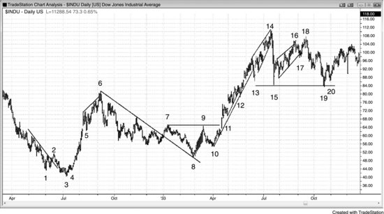
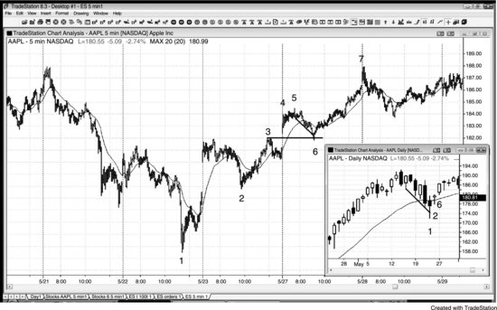
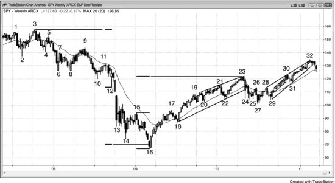
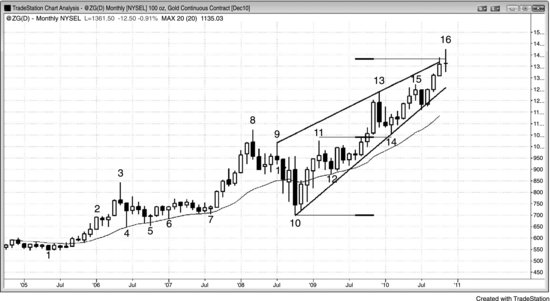
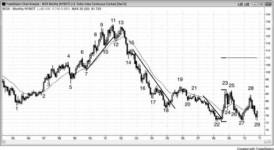
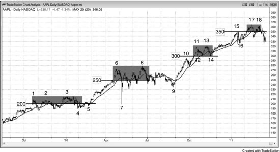
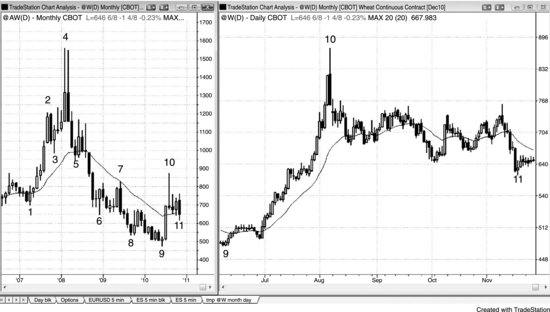
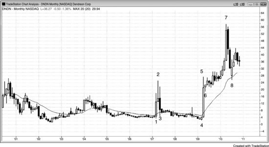

日线、周线和月线图偶尔也会产生日内交易信号，但频率很低，对日内交易员来说反而是种干扰，应该忽略。最常见的信号来自昨天的高点和低点，在5分钟图上就能看到。这些更长时间周期的图表上确实经常出现价格行为入场机会，但信号K线太大，要保持和日内交易相同的风险水平，能做的合约数就少很多。再加上隔夜风险，你可能还得进一步缩减仓位，或者考虑用风险有限的期权策略，比如直接买入期权或价差组合。日内交易员只有在不会占据盘中思考的前提下，才应该交易这些图表上的信号——照看一笔基于日线图的小仓位时，很容易错过几笔大仓位的日内交易机会，而这些错失的利润往往足以抵消日线信号带来的收益。

所有股票都会形成标准的价格行为形态，但机构持仓很少的小公司股票有大幅上下波动的显著风险。它们波动性往往更大，在股市术语里被称为高贝塔股票。比如，你不会指望沃尔玛（WMT）一个月内暴涨1000%，但一家小型药企的唯一药物获得FDA批准，或者突然成为收购目标时，这种事就完全可能发生。有些交易员喜欢这种巨大的快速波动，但多数交易员更愿意规避双向剧烈波动的风险以及糟糕的成交价。做这类特殊品种的交易员必须紧盯这些股票，很难同时兼顾其他股票。风险太大，他们只能用投资组合的一小部分来做，这就抹掉了大幅波动带来的大部分收益。再加上不可预测性带来的压力，大多数交易员都不该碰这类股票。

逆着强趋势做交易时，目标应该是1%到2%的剥头皮利润，因为大多数逆势交易最终只是回调，随后变成顺势入场机会。缺口会让入场变得复杂。一般来说，如果开盘价在昨天的区间内，然后价格突破该区间外一个tick触发入场突破单，风险会更小。如果你没法盘中盯盘而且又出现了跳空开盘，最好放弃这笔交易。如果你能盯盘而且出现了跳空开盘，就观察缺口回调，然后在回调失败后入场，跟随市场继续远离昨天区间的方向。换句话说，如果你本来想做多，但今天跳空高开了，就等开盘后先出现一波下跌，然后在开盘反转向上时买入，保护性止损放在今天低点下方。如果入场失败被止损出场，就换别的股票看，或者出现了二次入场点的买入建仓形态时，最多再试一次。不要在一只没按你预期走的股票上花太多时间，否则你会亏钱。亏损后想在同一只股票上把钱赚回来是人之常情，但这恰恰暴露了情绪弱点。如果你觉得必须证明自己是对的、确实是个厉害的看图高手，也许你确实看图很准，但你不是一个好的交易员。好的交易员接受亏损，继续前行。

日线图上的回调很少出现经典的反转K线，交易员面临的不确定性比做5分钟图时更大。不确定性意味着风险更高，仓位就得更小。交易员需要考虑先建一部分仓位，然后随着价格行为的展开逐步加仓。在多头回调中，如果市场又跌了一些但空头还没有表现出控盘迹象，可以在更低的价格加仓；也可以在趋势恢复之后、出现一个高于原始入场价的HL小幅回调时，在更高的价格加仓。

每天收盘后扫一遍日线图，经常会发现值得第二天关注的建仓形态。一旦形态触发，盘中往往会出现一段趋势，提供很多好的5分钟顺势入场机会。如果这只股票不是你平时做日内交易的品种，但成交量大约在500万股以上，就值得考虑把它加入你的日内交易股票池，跟一两天。不过有时候，即使是像石油服务HOLDRS（OIH）这样流动性很好的股票，你的券商也可能没有可供做空的库存，你只能做买入方向的建仓形态。如果你真的想做空，可以改买看跌期权，哪怕只是做日内交易。

整数关口具有磁吸效应，因此能带来交易机会。比如 Freeport-McMoRan（FCX）过去几个月涨了 20%，目前在 93 美元附近交易，很多交易员会预期它将涨到 100。正因如此，空头不会积极做空，因为他们相信很快能在更高的价格做空；多头则会积极买入，因为他们相信 FCX 会涨过这个磁吸位。空头的缺席制造了真空效应，往往导致股价快速拉升至磁吸位。通常会冲过磁吸位 5% 到 10% 才开始回调，而且至少会回落到整数关口下方一次，然后再决定下一步走向。多头可以在股价被整数关口吸引上涨时买入，刚过关口就止盈；空头可以等股价突破关口后再做空，回测下方时止盈。多头通常还会在那个位置再做一次剥头皮。

**图 22.1** 价格行为不会随时间改变

价格行为是大量交易员各自独立操作、出于无数理由尽可能赚钱的综合结果。正因如此，它的特征指纹始终不变，对于能够解读它的人来说，永远是可靠的赚钱工具。图 22.1 是道琼斯工业平均指数 1932 年和 1933 年的日线图，看起来跟今天任何股票在任何时间周期上的走势一模一样。

K线 2 是一个低点 2，同时突破了趋势线。

K线 3 是一个小型最终旗形反转，也是趋势线突破后对 K线 1 低点的 LL 测试（趋势线突破加测试可以构成主要趋势反转（MTR））。

K线 4 是一个突破回调，也是一个小型 HL。

K线 5 是强多头急速走势中的第一次回调，也是一个高点 2。

K线 6 是多头急速走势之后的楔形通道，随后引发了两段大幅下跌，终止于 K线 8。

K线 7 是一次趋势线突破和两段式回调。它是一个大型楔形牛旗的突破，该楔形牛旗的第一次下推始于 K线 5。

K线 8 是一个 LL 主要趋势反转（MTR）和突破回调，也是一个更大的楔形牛旗，同时是对 K线 2 的突破回测。

K线 10 是一个 HL，也是 K线 9 突破 K线 7 到 K线 8 空头通道后的回调。空头通道就是牛旗。

K线 11 是一个小型高点 2 突破回调，出现在 K线 7 和 K线 9 构成的双顶熊旗突破失败之后。

K线 12 和 K线 13 是次要趋势线突破后的向上反转。

K线 14 是一个楔形，也是一个小型最终旗形反转。

K线 15 是一次动能很强的逆势下跌，反弹测试 K线 14 高点后可能（60%+）会被再次测试。它和 K线 13 构成了双底牛旗，但向下的力度很强，市场可能已经翻转为 Always-in 做空。交易员会寻找 LH 做空机会，如果做多会影响后续在 LH 位置做空的心态，他们就不会在这里买入。有时候交易员在等待做空 LH 的过程中剥头皮做多，等到做空机会真正出现时反而切换不过来了。

K线 16 是一个楔形 LH，K线 17 是该楔形的失败突破。

K线 18 是对 K线 14 多头趋势极值的 LH 测试，也是楔形 HH 突破回调的低点 2 做空入场点。楔形下方有一次失败突破，而到 K线 18 的反弹是楔形的 HH 突破回调。也有交易员把它简单看作一个比 K线 16 结束的那个更好的楔形。K线 18 同时也是对 K线 14 信号K线低点的突破回测。

K线 19 是对 K线 15 低点的测试，构成了双底牛旗。

K线 20 是向上反转中的 HL 回调。

**图 22.2** 缺口回调

如图 22.2 所示，当日线图上出现买入建仓形态且市场跳空高开超过昨日高点时，交易员通常会在 5 分钟图上等回调再买入。AAPL 在日线图（缩略图）上处于强多头趋势中，K线 1 处出现了第一次均线回调，同时是空头趋势通道过冲（两张图的编号相同）。日线图上的 K线 2 日内强势反转上涨，收盘接近最高点。在日线图上以 K线 2 高点上方一个 Tick 买入是合理的，也就是 5 分钟图上 K线 3 的高点。但第二天跳空高开，超过了 K线 2 的高点。与其冒着可能反转下跌的风险，更稳妥的做法是在 5 分钟图上观察缺口回调后的反转上涨再入场。

5 分钟图上的 K线 6 回补了缺口，同时是一根均线缺口K线，也是空头趋势通道过冲后的向上反转。这是一个很好的做多入场点，保护性止损放在 K线 6 下方。0.62 美元的风险带来了数美元的收益。

**图 22.3** SPY 周线图

如图 22.3 所示，SPY 周线图看起来像是一轮空头反弹，因为从 K线 16 到 K线 32 的上涨斜率比跌到 K线 16 那段抛售更平缓。市场也没有站稳在 K线 6、8、10 低点构成的阻力上方——那些低点是上方交易区间的底部。不过，这轮反弹已经回撤了跌到 K线 16 那段空头趋势的很大一部分，空头趋势的影响力所剩无几，市场实际上已经变成了一个大交易区间。如果这确实是空头反弹，最终应该会回测 K线 16 的低点。多头希望市场继续突破 K线 3 以来空头趋势中的波段高点，最终创出历史新高。空头则希望市场在 K线 21、22、23、27 和 32 构成的扩展三角形中失败，然后跌破三角形底部 K线 27，进而跌破 K线 16 创出新低。由于反弹幅度很大，图表更像是一个大交易区间，失去了趋势特有的确定性。不确定性是交易区间的标志——一旦市场表现出不确定性，通常（60%+）就是处于交易区间中，这里正是如此。

从 K线 3 下跌的过程中，市场在 K线 5、9、11 处形成了 LH，在 K线 6、8、10、12 处形成了 LL。由于始终没有出现强劲的空头突破，这段下跌更可能（60%+）只是对交易区间底部的测试，或者是一个潜在的大牛旗。有些交易员认为跌到 K线 6 的空头急速可能已经把市场翻转为 Always-in 做空，但跌到 K线 13 的空头急速让所有还在犹豫的交易员都确认了 Always-in 做空。

K线 14 是第二轮卖出高潮的第三根K线，也是从最终旗形发出的两K线反转尝试，但市场从 K线 15 开始再次以急速加高潮的方式下跌。这是第三轮卖出高潮，同时形成了一个楔形底（K线 13、14、16）。底部刚好略过了基于上方交易区间高度计算的测量移动目标位。

上涨到 K线 17 的走势包含 12 根阴线实体和小影线，只有少数几根阳线实体，大多数交易员会认为这段走势足够强劲，可以视为一段急速。K线 16 低点出现三轮卖出高潮之后又有这样一段急速上涨，交易员预期至少还会有第二段上涨，甚至可能出现基于 K线 16 低点到 K线 15 或 K线 17 高点计算的测量移动。

K线 23 略高于测量移动目标位和趋势通道线顶部，同时在 K线 6、8、10 的上方交易区间底部区域形成了一个两K线反转下跌。第一个目标是跌破通道，K线 24 处实现了。第二段下跌在 K线 27 的两K线反转处结束。K线 29 是一个 HL 突破回调，出现在 K线 28 突破 K线 23 以来两段式回调牛旗之后。它同时也是头肩底牛旗的右肩，左肩在 K线 24 到 K线 25 之间。K线 21 到 K线 28 之间的交易区间也构成了一个头肩顶，其中 K线 21 是左肩，K线 23 是头部，K线 26 和 K线 28 的双顶是右肩。跟 80% 的顶部形态一样，市场向上突破，空头再次认识到大多数顶部不过是牛旗。

从 K线 29 到 K线 32 的走势处于一个相当窄的多头通道中，后续很容易继续走高。但整张图表是一个大交易区间，大幅反弹之后通常（60%+）会跟着大幅下跌，市场可能很快就会开始回调到 K线 27——扩展三角形的底部，甚至回到 K线 16 空头低点附近。

K线 16 是一个测量移动下跌。大多数机构只做他们认为会成功的交易，也就是说概率至少有 60%。因此他们至少需要一个测量移动才能让交易者方程为正（测量移动是回报与风险相等的位置，到达这个位置交易者方程才开始变得合理地有利可图）。结果就是价格经常精确触及目标位后就反转或至少暂停，因为很多机构会在那里部分或全部止盈。大多数目标位跟所有支撑和阻力一样，很快就会被突破，因为测量移动只是最低需要达到的目标，很多机构会认为市场足够强、可以走得更远。

**图 22.4** 月线黄金楔形通道

如图 22.4 所示，黄金月线图在 K线 7 到 K线 8 的多头急速之后进入了一个楔形通道。有些交易员会把当前走势看作第三推，其中 K线 11 和 K线 13 是前两推。也有人把 K线 8 或 K线 9 看作第一推。

每当有5到10根K线紧贴趋势线运行时，市场很可能（60%+）很快跌破该趋势线。这使得从K线10起画的多头趋势线容易被向下突破。既然市场刚好位于趋势通道线和测量移动目标位上方，那么两段式下跌很可能（60%+）即将启动。市场至少会回调到K线8高点下方，也可能回调到K线10所在的楔形底部。市场向上突破楔形顶部并走出一段向上测量移动的可能性不大（≤40%）。

**图 22.5** 美元指数期货月线图

如图 22.5 所示，美元期货月线图上有好几笔够格的最佳交易。美元与瑞士法郎、日元一样属于避险货币，当交易员预期股市下跌时，往往会买入这些货币。

美元以多头急速上涨的方式突破了K线2处熊旗的顶部，将市场转为始终持仓做多。随后形成了一段通道，接着K线5回测了K线3通道起点的底部。这在K线5构成了一个双底牛旗，之后K线7出现了突破回调做多建仓形态。市场在K线11的更高高点处见顶。有些交易员把K线3到K线11的走势视为一个宽通道，也有人认为通道从K线5或K线7才开始。所有交易员都怀疑K线11或K线13可能是通道底部回调的起点，因为市场开始呈现双向博弈特征，出现了多次反转和明显的空头实体。这些迹象表明抛压正在不断累积。

下跌到K线10的走势是一根强空头趋势K线，跌破了从K线7起画的陡峭多头趋势线（未标出）。这波下跌力度足够强，促使许多多头在市场反弹创新高到K线11时选择止盈。空头开始在那个更高高点处做空，到K线13的更低高点主要趋势反转（MTR）时做空更加积极。下跌到K线12的过程中出现了两根强空头趋势K线，并跌破了多头趋势线。市场本应走出至少两段式下跌，实际上是先以空头急速下跌到K线14，然后以通道方式下跌到K线18。跌到K线14的走势让大多数交易员确信市场已经翻转为始终持仓做空，后面还会有更多卖盘涌出。

空头通道一直延续到K线18，那是一轮大型空头趋势末端卖出高潮中的第5根K线。交易员预期至少会出现一波反弹到均线的行情，而且这里与K线1形成了双底。

均线处出现了一个 EMA 20 缺口K线做空机会，但由于之前的急速上涨很强，最好等待第二次信号。第二次信号出现在K线19的均线缺口K线处，它与K线17之后那段小反弹的高点构成了双顶熊旗。

急速下跌到K线20之后，紧接着一段抛物线式的高潮通道下跌到K线22，市场在那里形成了一个更低低点主要趋势反转（MTR）。随后市场横盘整理，走出一种 iii 形态的变体（只看实体）。其中一个低 1 做空失败后反转向上，形成了一个小型双底，而K线23的多头急速上涨极其强劲。这很可能（60%+）将市场翻转为始终持仓做多，多头会努力守住急速段的底部。他们在低点附近大举买入，在K线27和K线29处也是如此，形成了双底牛旗。K线27是一个双底主要趋势反转（MTR），K线29是三角形中第三次下推后的反转上涨——这个三角形最终可能向上或向下突破。

楔形牛旗（K线24、26、27）之后又出现一波反弹，然后在K线29形成双底。这是一个盈亏比很好的做多建仓形态，因为交易员是在交易区间底部买入。由于市场正处于交易区间底部，走出等距上涨的概率大约是 60%。风险大约是 5.00 美元，有 60% 的概率测试K线28所在的交易区间顶部。交易员冒 5.00 美元的风险去赚 10.00 美元，成功概率 60%，这非常划算，每笔交易的平均利润约 4.00 美元。由于这还是一个双底牛旗，实际概率很可能（60%+）高于 60%。目标是该交易区间的向上测量移动，大致会测试到K线15所在的空头通道顶部附近。

必须认识到，这同时意味着大约有 40% 的概率市场会跌破K线22的低点，所以一旦出现这种情况，交易员必须离场。如果真的跌破了，下一个目标就是根据K线27到K线28或K线22到K线23这几段下跌幅度计算的向下测量移动。

即使市场确实上涨，更可能（60%+）的情况是在K线11高点附近受阻，形成一个更大的交易区间。

**图 22.6** 整数关口可以充当支撑和阻力

如图 22.6 所示，AAPL 当时处于强多头趋势中，但在接近整数关口时出现了停滞。整数关口往往像磁铁一样吸引价格。一旦足够多的交易员确信价格终将触及这个磁铁位，空头就不再做空，市场在买入真空效应中快速拉升，突破了目标价位。比如，空头认为市场会涨过 300 美元，而且可能 (60%+)至少超出 5% 到 10%，因为市场一旦进入整数关口的吸引范围，通常 (60%+)就是这个走法。既然空头预期市场会涨到 315 美元附近（高于整数关口 5%），他们就选择暂时退场。在他们看来，如果相信几根K线之内市场还会更高，那在到达之前做空就没有意义。空头的缺席使市场快速上涨，因为多头必须把价格推得更高才能找到足够的对手盘来承接他们的多头仓位。

一旦市场涨到目标价上方 5% 到 10%，多头开始止盈，空头开始做空，准备回测整数关口，而且通常 (60%+)至少会击穿一次。回调到K线 12 低点时，离 300 美元只差一分钱（K线 12 低点是 300.01 美元），随后市场在当天收盘前大幅反弹。K线 13 附近的双顶做空成功将 AAPL 压到了 300 美元以下，但买方随即回来，形成了K线 14 的双底。

**图 22.7** 日线和月线可以处于相反的趋势中

如图 22.7 所示，小麦在右侧的日线图上走出了一波急涨，但在左侧的月线图上看，这只是空头市场中的一段反弹。K线 10 在空头趋势中形成了均线缺口K线，同时与K线 7 构成双顶熊旗，也是对K线 3 和K线 5 所形成的上方交易区间底部（头肩顶形态）的突破回测。两张图表的编号相同。

日线图上K线 10 这根空头反转K线形成的前一天，一位电视评论员说小麦还会大涨，他正在市价买入，同时也会在回调时加仓。当一波持续较久的多头急速（10 到 20 根K线）之后出现大阳线时，市场面临很大的风险——可能 (60%+)出现一段较长的两段式回调。因为大部分强势多头只会在出现明显回调后才买入，而大部分强势空头会在市价做空并在更高位加仓。这位电视评论员对小麦最终还会大幅上涨的判断也许没错，但他在一波抛物线急速和高潮的顶部买入，占用了太多资金。他应该像机构那样操作：空头在做空，多头在等两段式回调再买。

K线 10 前一天，新闻对小麦显然非常利多，但这无关紧要。图表告诉交易员，强势空头和强势多头都在押注一波大幅回调。急速和抛物线高潮说明弱势多头和弱势空头在做错误的事，而强势多头和强势空头则在押注回调。交易中最好的赚钱方式就是跟聪明钱做同样的事，而不是听电视上的专家。聪明钱的资金规模太大，这些聪明的交易者根本藏不住自己在做什么。但你必须能读懂图表，才能理解正在发生什么。

**图 22.8** 新闻可以推动个股

如图 22.8 所示，Dendreon Corporation（DNDN）因其前列腺癌药物的新闻发布而出现剧烈的上下波动。截至K线 2 的两个月里，股价暴涨了 800%，随后在接下来几个月内回吐了 90% 的涨幅。之后股价又暴涨了 2000% 直到K线 7，然后在接下来三个月里下跌了 50%。面对如此巨大的上下波动风险，交易员只能用很小的仓位交易，而缩小的仓位会抵消大幅波动带来的收益。再加上不可预测性带来的压力，交易员做这种市场时几乎无暇顾及其他品种，而且不做这类特殊情况、去做别的交易可能 (60%+)反而赚得更多。这种行情看着确实过瘾，但你的目标是赚大钱，而不是追求情绪上的刺激，或者在一笔罕见的大行情中用小仓位赚一点钱后获得毫无意义的成就感。
