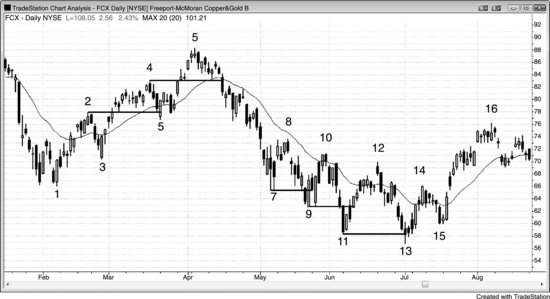
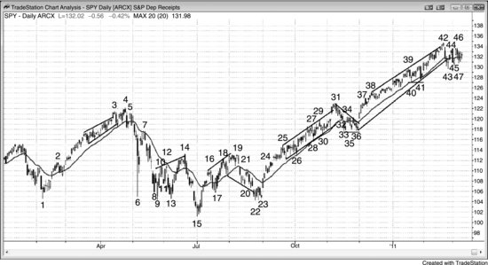
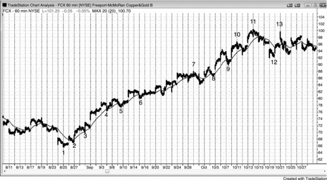
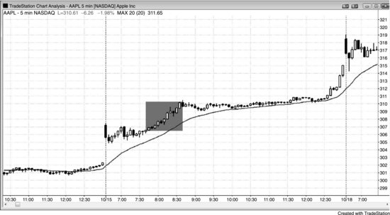
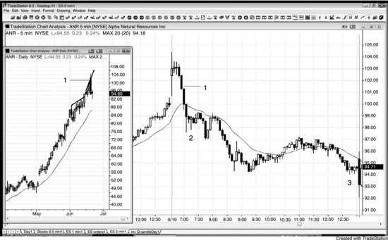
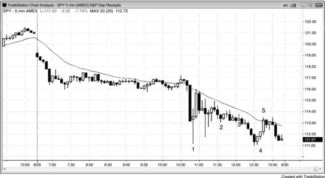
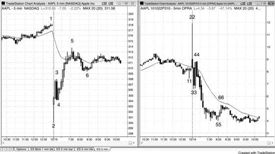

我曾和一位女交易员聊过，她自己经营着一家小公司，同时帮自己和丈夫打理股票投资组合。有天早上醒来，她发现组合一夜之间亏了50万美元。从那天起她变成了日内交易者，下定决心再也不持仓过夜。她读图表的能力很强，但不愿再承受隔夜敞口可能带来的巨额亏损。其实她还有一个选择：如果想持有几天到几周的头寸，完全可以用期权来做。以她的实力，拿出投资组合中相当一部分资金做期权交易完全没问题，没必要把自己局限在日内交易上。我已经好多年没跟她联系了，但我相信不管她是不是严格只做日内交易，都做得不错——不过如果把期权纳入策略，说不定能做得更好。

期权的买卖价差往往比较大，因此交易员通常只应在高时间周期图表上考虑期权交易。只要建仓形态的交易者方程明显为正，交易就是合理的。下面列举一些可以根据60分钟图或日线图考虑买入看涨期权或看跌期权的情形：

- 多头趋势中，价格回调到均线附近时买看涨期权。
- 空头趋势中，价格反弹到均线附近时买看跌期权。
- 交易区间底部买看涨期权。
- 交易区间顶部买看跌期权。
- 空头楼梯形态中出现新低时买看涨期权。
- 多头楼梯形态中出现新高时买看跌期权。
- 强多头突破中，在多头急速阶段买看涨期权。
- 强空头突破中，在空头急速阶段买看跌期权。
- 交易区间底部，在一个较弱的低1或低2下方买看涨期权。
- 交易区间顶部，在一个较弱的高1或高2上方买看跌期权。

你也可以在更低的时间周期（比如5分钟图）上做期权交易：

- 如果你是新手，账户资金有限，或者想完全确定自己的风险敞口，可以买SPY的看跌或看涨期权，而不是直接交易SPY或Emini。SPY当月平值期权的买卖价差通常只有1个tick，很多大盘股也是如此。这样即使根据5分钟图下单，交易者方程仍然有利。
- 极少数情况下，日内波动幅度大到你对报价或成交不敢置信——不管交易的是Emini、股票、债券、外汇还是其他品种——这时可以用限价单买看跌或看涨期权，根据5分钟图做日内交易。

期权交易还有很多其他适用的场景和策略，但以上列举的对日内交易者来说最简单、最不分散注意力。如果交易员有能力做其他类型的期权交易，当然应该做，但大多数活跃的日内交易者没法在不影响日内交易收入的情况下兼顾那些策略。风险逆转组合、零成本领口、比率价差等策略的交易者方程通常很好，但对日内交易者来说大概太分散精力了。下单本身就比较复杂，需要高度专注才能做对。你需要在众多行权价和到期日中做选择；买卖价差往往比较宽，交易成本感觉偏高；虽然应该用限价单，但限价单经常不能很快成交。下单之后还要管理仓位，随着交易的发展往往需要做调整。做外汇的交易员在认为股市会下跌时，会买入瑞士法郎或美元这类避险货币，同时做空瑞典克朗这类风险偏好货币，以此对冲股票组合——这样可以避免期权的成本，但前提是你对外汇市场足够熟悉，而外汇市场很多行情发生在隔夜时段。这些对日内交易者来说都太分心了，大多数人要么专心做日内交易，要么最多再加上简单的看涨或看跌期权买入。

最简单的做法是以买看跌或看涨期权为主，偶尔做价差组合，持仓一到几天。你可以考虑容许价格再走出一个新的极端点来反对你的仓位，也可以准备加仓——因为用这些策略，你的风险是完全已知且有限的。在一个可能的主要趋势反转顶部，你也可以直接做空少量股票，但白天很可能会忍不住一直盯盘，结果错过日内交易的机会，最终股票上赚的钱还不够弥补日内交易损失的利润。

期权含有时间价值，每天都在衰减，看涨期权和看跌期权的价值都会因此减少。如果买入价差组合，买入端和卖出端各自都要承受买卖价差的损耗，佣金也是双倍。正因为这些成本的存在，交易员必须严格筛选，只做最好的期权建仓形态。而且，只有当加入期权确实能提升日内交易的整体收益时，才应该这么做——对大多数交易员来说并非如此。不管交易什么品种，想要稳定盈利都很难，大多数能赚到钱的交易员通常会选择专注于期权、期货或股票中的某一种，而非三者兼做。不过要注意，期权交易员把股票头寸视为交易的重要组成部分，而且他们大多持仓数天到数周，不像日内交易员那样只持仓几分钟到几小时。

还有一种少见的情况，日内期权可能比期货和股票更合适，那就是市场大幅暴跌、接近跌停的时候。如果出现了可靠的反转形态，你可能觉得小仓位买入 Emini 风险不大，但实际风险可能很大，即便用的是信誉良好的经纪商。原因在于系统可能过载，你的订单可能 30 分钟甚至更久都得不到处理或回报。假设你以为抄到了底部便买入，结果市场跌穿了你的保护性止损位，屏幕上可能还显示止损单处于未成交的挂单状态，尽管市场早已大幅跌破了那个价位。这时你不知道订单到底成交没有，打电话给经纪商又要等 30 分钟。大约 30 分钟后，屏幕才显示你的单子在本该成交的时候带着一些滑点成交了。大跌日经纪商的订单系统运转不正常，你不可能承受这么长时间的不确定性。经纪商对你的订单成交情况不承担任何责任，你很容易在 Emini 上亏掉 10 个点。替代方案是买入看涨期权，这样即使入场后市场继续暴跌，你也能确切知道自己的风险上限。你可以尝试用止损来限制看涨期权的潜在亏损，但即便市场大幅跌穿你的止损而未触发，至少你知道损失不会是灾难性的（前提是仓位大小合理）。市场为什么能跌穿你的保护性止损却不触发它？因为止损是基于最后一笔成交价触发的，如果你持有的那个特定期权没有发生交易，买价和卖价可能已经远低于你的止损价位，但止损不会被执行，你的期权实际价值已经远低于你以为的水平。有一点很重要：期权的保护性止损往往起不到保护作用。如果市场快速逆向运行，你应该尽快用限价单出场。

你也可以考虑用 SPY 期权做日内交易，而不是直接交易 SPY 或 Emini，尤其是在刚起步、担心大额亏损的阶段。举个例子，如果你买入一个还有一个月到期的 SPY 平值看涨期权，成本大约 250 美元，即使 SPY 跌到零，你最多也就亏这么多（当然前提是你确实买入的是看涨期权，而不是误操作成裸卖看跌或看涨期权）。就算 SPY 在接下来一小时跌了 1%，你的看涨期权大概也能控制在 100 美元以内的亏损出场。如果你在多头趋势的回调中买入了看涨期权，大概率（60% 以上）能以 10 到 20 美分的利润出场，换算下来就是 10 到 20 美元的盈利，这需要 SPY 大约走出 25 到 45 美分的涨幅。如果 SPY 反而跌了 50 美分，你的看涨期权大概亏 30 美分，也就是 30 美元。买入看跌或看涨期权能让新手更清楚自己的最大风险是多少，这样他们就能更专注于思考如何交易，而不是一直担心会亏多少钱。

如果你每天在期货或股票市场只做几笔日内交易，那就有余力在期权市场更活跃一些，尤其是在同时积极做股票波段交易的情况下。这些机会多到可以再写一本书，但这里有几个要点值得一提。比如，你持有一只股票的多头仓位，日线图上正在筑底，而且你愿意在更低价位加仓，那你可以在比当前价低一档执行价的位置卖出看跌期权。如果股票上涨甚至小幅下跌，你都能收到权利金；如果股票跌破了看跌期权的执行价，期权买方会对你行权（你被迫以执行价买入股票），等于在更低价位加了仓。

对持有股票多头仓位的交易员来说，另一种常见用法是卖出虚值看涨期权来收取权利金。这种备兑看涨期权策略每年大约能给组合增加 10% 的回报，但偶尔会在股票大涨时导致你的仓位被行权平掉。

如果你预期某只股票或期货合约会有大幅波动，但不确定方向，可以买入跨式组合（同时买入一个看跌期权和一个看涨期权），但这样做要承受两条腿的时间衰减、手续费和买卖价差。跨式组合很少划算。期货交易员还有另一种选择：把期货和期权组合成 delta 中性头寸，让上涨和下跌的概率相等。比如在 Emini 中，一张多头合约相当于买入 500 股 SPY 或 10 张平值看涨期权。如果你买入一张 Emini 合约（或 500 股 SPY），同时买入 10 张平值看跌期权（或者反过来，做空一张 Emini 或 500 股 SPY，同时买入 10 张平值看涨期权），下单那一刻这就是 delta 中性头寸。市场一旦涨跌，delta 就会变化。市场上涨时，Emini 赚的钱会超过看跌期权亏的钱；市场下跌时，看跌期权赚的钱会超过 Emini 亏的钱。只有市场横盘好几天、期权因时间衰减而贬值时，你才会亏钱。你可以在市场波动过程中做很多微调来提高收益，但 Emini 日内交易员太忙了，没精力再加上这些操作。

期权交易员经常谈到"催化剂"，指的是即将到来的新闻事件，可能引发某只股票大幅波动。最常见的是即将公布的财报，不那么常见的包括新产品信息或潜在的收购。由于不确定性很大、大涨大跌的可能性都很高，期权的权利金通常会被大幅推高。新闻一出来，权利金就会急剧收缩，哪怕股票朝你预期的方向大幅波动，你仍然可能亏钱。举个例子：假设你看好亚马逊（AMZN）的财报，在公布前一天花 5.00 美元买了一张看涨期权。财报确实很好，AMZN 开盘涨了 5%，但你的看涨期权开盘价可能只有 4.00 美元。你判断对了——财报强劲、开盘大涨，但权利金膨胀得太厉害，AMZN 可能得涨 10% 你的看涨期权才能增值。正因为大幅膨胀的权利金会被快速抹平，交易员在催化剂事件前买入期权时必须非常谨慎。如果波动率太高，期权就很贵，需要巨大的波动幅度才能赚到钱。一种缓解办法是买入价差组合，这样你卖出那条腿的权利金损失可以在很大程度上抵消买入那条腿的权利金损失。不过价差组合通常只有在你计划持有一周以上时才值得买入，因为它们一般只有在出现大幅波动、或波动较小但临近到期时才能赚钱。

很多指数期权交易员会关注芝加哥期权交易所市场波动率指数（VIX），它的走势往往和指数相反。通常在市场恐慌性下跌、交易员大量买入看跌期权对冲多头头寸时，VIX 会大幅飙升。另一些交易员显然是在押注空头趋势延续而买入看跌期权。不过，市场开始回升之后，看跌期权的买入量有时也会增加，但原因不同。这时候买看跌期权的不是投机者押注下跌，也不是受惊的多头在对冲，而往往是有信心的多头在保护新建的多头头寸。在这种情况下，买入看跌期权反而意味着下行风险已经小了很多。这些新多头愿意在回调中继续持有股票，因为他们有看跌期权做保护——如果市场下跌，他们会继续持有股票和期货头寸，不会恐慌性抛售把市场推得更低。换句话说，这种看跌期权的买入是一个信号，说明下行风险在缩小、多头正在变得有信心。不过你不可能知道，市场上整体的看跌期权买入到底是在押注继续下跌，还是在保护新建的多头头寸。依赖电视上评论员的观点来建仓，从来都不靠谱。如果他们真能靠交易赚大钱，大多数人不会浪费时间在 CNBC 上夸夸其谈。

很多对冲基金在买入股票的同时也会买入看跌期权来对冲，对冲标的可以是组合中具体的个股，也可以是整体市场（比如 SPY 的看跌期权）。对冲基金很少做到完美对冲，大多数会根据整体市场情况调整看跌期权的保护量。有些基金会用波动率指数来调整看跌期权头寸。比如过去几周股市跌了 10%，导致波动率指数上升了 20%，他们就会回补部分或全部看跌期权，因为这些看跌期权已经达到了当初的目的。他们最初在市场处于高位时买入看跌期权，是为了防范股票组合的下跌风险。市场真的下跌后，股票贬值，看跌期权升值，他们就会对看跌期权止盈，然后要么减少对冲比例、等待市场反弹，要么买入新的看跌期权把对冲滚动到更远期的合约上，通常会选一个更低的行权价。如果市场强劲反弹，而他们的对冲比例偏低，就会买入更多看跌期权来增加下行保护。

如果你在日线或60分钟图上交易期权，而且有把握行情会在未来一两天内启动，那最好直接买入期权，不必做价差。但如果你觉得行情可能要一周甚至更久才会启动，可以通过买入价差来减轻时间价值衰减的影响。这样做虽然会降低整体盈利空间——因为市场朝有利方向运行时，卖出的那条腿也会升值——但整体盈亏比会有所改善。一般来说，卖出那条腿的行权价应该选在支撑位或阻力位附近。比如，SPY 在 105，出现了一个强买入信号，但 108 附近有阻力。你可以买入一个月后到期的平值 105 看涨期权，同时卖出虚值 108 看涨期权来部分对冲成本。买入看涨期权的成本减去卖出看涨期权收到的权利金，净成本大约是 1.20 美元。由于 108 是阻力位，而阻力位具有磁吸效应，市场应该会被吸引到 108 附近。两条腿的看涨期权都会升值，但平值 105 看涨期权升值更快，完全足以弥补卖出 108 看涨期权上的亏损。如果市场以非常强劲的多头急速拉升，你判断它会轻松突破 108 阻力区域，可以把卖出的 108 看涨期权买回来止损，继续持有做多的 105 看涨期权——它的利润足以覆盖卖出那条腿的亏损。如果涨到 108 的走势偏弱，你觉得市场可能会回落，就应该带着利润平掉价差。通常不值得一直持有价差到到期日，尽管到期时利润才会最大化。因为你的前提假设已经改变，需要重新评估仓位——这在做期权交易时始终是需要考虑的问题。如果到期时 SPY 在 108，卖出的 108 看涨期权会归零作废，做多的 105 看涨期权价值 3.00 美元，净利润大约 1.80 美元。但假如离到期还有两周，市场已经涨到 108，你的浮盈是 1.50 美元，那大概率（60%以上）直接平仓更好，因为不值得冒着利润变亏损的风险去等到期——万一到期前市场跌回 105 以下就得不偿失了。市场涨到 108 之后，你面对的盈亏比已经不再像建仓时那么有利。更明智的做法是落袋为安，去寻找下一笔交易。

交易员既可以买入价差，也可以卖出价差。比如，SPY 在 130，如果你看涨，可以买入看涨价差——买入平值 130 看涨期权，同时卖出更高行权价的虚值看涨期权，比如 133。你也可以通过卖出看跌价差来做多——卖出平值 130 看跌期权，同时买入虚值 125 看跌期权。一般来说，大多数交易员更倾向于买入价差而非卖出价差，因为他们更愿意做多平值期权而不是做空平值期权。如果做空了平值期权，标的只要稍微反向波动，就可能面临额外的麻烦。比如，如果你卖出了那个看跌价差，SPY 跌到 129，并且在到期日附近一直停留在那里，你可能会被行权——也就是说券商会自动以 130 的价格把股票卖给你；届时你就得决定如何处理这些股票以及剩余的那条做多虚值看跌期权。

如果你计划持仓几周，买入价差通常是最好的选择，尤其是能持有到最后一周的话。因为卖出的那条腿总是更虚值的，越虚值的期权时间价值衰减越快，而且在最后一周衰减速度会急剧加快。不过，如果你预期短期内会出现一波突破卖出行权价的大行情，也可以买入价差后只持有几天。只有在你认为市场会在一周内突破卖出行权价的情况下，才应该为持仓不到一周的交易买入价差。否则，直接买入普通的看涨或看跌期权即可。比如，SPY 在 134，你判断未来一周会跌到 130。你可以买入一个看跌期权，比如平值 134 看跌期权；也可以考虑做价差，比如买入 134 看跌期权，同时卖出 132 或 131 看跌期权。

期权每天都在损失时间价值，即使市场纹丝不动也是如此，所以只有在你认为自己的交易前提仍然成立时才应该继续持仓。否则就平仓，哪怕是亏损平仓。怎么判断前提是否还成立？看看当前的市场状态，假设你手里没有任何仓位，然后问自己：现在还会不会建立同样的仓位？如果不会，说明前提已经不成立了，应该立即平仓。

新手常犯的一个错误是：期权盈利后持有太久。比如，交易员在交易区间底部买入看涨期权，目标是未来一周内价格回到区间中部，结果市场一天就冲到了目标位。这时候通常（60%+）应该把大部分甚至全部利润落袋为安。没错，这种强劲的动能有可能是多头趋势的开端，但交易区间继续维持的概率更大（60%+）——要么市场很快横盘，时间衰减吃掉权利金；要么市场回调，利润消失。期权的利润消失起来非常快，一旦有了就一定要赶紧锁定。

不要因为一只股票知名度高，就想当然地认为它的期权成交活跃。如果成交不活跃，买卖价差可能大到无法接受。比如，平值看涨期权的买价可能是 $1.20，卖价可能是 $1.80。也就是说，你大概要花 $1.80 才能买到这张看涨期权，买完立刻卖掉只能拿回 $1.20，一下就亏了 60 美分，相当于投入资金的三分之一！一般来说，如果你要交易的那个行权价未平仓量不到 1,000 张，或者近期日均成交量不到 300 张，通常（60%+）就不该做这笔交易。流动性差的期权几乎不应该碰。但如果非要做，入场和出场都必须用限价单。即便如此，你的限价单也可能挂在那里等好几个小时才成交，有时候等不住就只能用市价单出场，潜在利润会因此大打折扣。活跃期权市场的好处之一在于——像 SPY，当月平值和近平值期权的买卖价差通常（60%+）只有 1 美分，用市价单也能拿到很好的成交价。

买卖价差大本身不应该成为拒绝买入期权的理由，因为价差与股票价格是成比例的。AAPL 股价 $300 时，平值看涨期权的买卖价差可能是 20 美分，新手看着可能觉得很多。但如果一只股票股价 $30，期权买卖价差只有 2 美分，交易员就不会有任何犹豫。他们可能会买 10 张 $30 那只股票的看涨期权，来对应 1 张 AAPL 的看涨期权。从数学上看，这是合理的交易方式。

价差组合在以下情况下很有用：日线图上出现强劲的急速走势，但市场距离目标位还有一段距离。比如，SPY 在 118，正在大幅下跌，远低于均线，进入了新的空头趋势，你判断未来几天会跌到 115。但你可能不太敢直接买看跌期权，因为市场随时可能先反弹到均线附近，然后再跌到目标位。这时候你可以用价差组合：买入 118 看跌期权，同时卖出 115 看跌期权。如果接下来几天市场一路跌到 115 支撑区，你的价差组合大概能赚 $1.50。如果市场反而涨到了均线附近的 120，你的价差组合可能浮亏 1 美元。如果你认为自己的判断依然成立，可以把空头腿（卖出的看跌期权）买回来平仓，大约赚 50 美分的利润，同时继续持有多头腿（买入的看跌期权）。如果判断正确，市场在接下来一周跌到 115 目标位，这条多头腿可能再赚 $2.00，整笔交易的总利润大约 $2.50。从价差组合中拆出单腿需要经验，尤其是在市场走势与你相反的时候，但如果你对自己的图表分析有信心，这是一种不错的方法。

顺带一提，位于支撑位和阻力位附近的期权空头头寸会增强这些位置的强度，因为期权往往会在未平仓量最大的行权价附近到期。某个行权价上的期权成交量越大，该价位的磁力效应就越强，支撑和阻力也就越强。如果成交量足够大，到期时会对市场产生实际影响。当某个支撑位或阻力位非常明显时，该行权价会引来大量期权交易，成交量可以变得非常大。事实上，SPY 和 QQQ 经常在未平仓量最大的看跌和看涨行权价附近到期。期权的空头一方通常（60%+）是机构——也就是聪明钱，他们会在期权市场和相关市场中想尽一切办法，让自己卖出的期权以毫无价值的方式到期，从而把收到的全部权利金都留在手里。

VIX 衡量的是标普500指数期权的波动率。在强劲的多头急速走势中，如果你判断后续跟随的概率较大，买入看涨期权、SPY 或 Emini 通常（60%+）都是不错的交易——但 VIX 本身也会带来额外风险。顺便说一下，VIX 每16个点大约对应标普500指数1%的日均波幅（也就是说，VIX 在32时，SPY 和 Emini 的日均波幅大约是2%）。如果急速走势足够强，VIX 也可能（60%+）飙升，导致你买入看涨期权的成本偏高。之后几个小时如果市场转入平静的多头通道，VIX 可能（60%+）回落，你的看涨期权价值反而不会增加。正因如此，如果你想在多头急速阶段买看涨期权、或在空头急速阶段买看跌期权，又没能在急速走势初期就入场，最好等到一次回调再买，这样可以避免在 VIX 短暂飙升时入场、导致期权暂时溢价的问题。

期权波动率大幅上升时，虚值期权的价格通常（60%+）会出现不成比例的上涨，这就是所谓的偏斜（skew）。偏斜定价会让刚接触价差交易的人很不满，因为最终利润比看起来合理的水平要少。举个例子：假设标普处于多头市场的交易区间中，SPY 在133附近，一个交易员买入了133/128的看跌价差——花3.50美元买入133看跌，同时卖出128看跌收入2.00美元。两周后因为某个全球危机事件，SPY 下跌了4.00美元。这个交易员可能（60%+）以为价差也会增加4.00美元，但实际上，市场急跌时大量交易员会买虚值看跌期权来保护多头仓位，虚值看跌的价格相对于平值看跌会不成比例地上涨。结果价差可能（60%+）只增加到大约2.50美元，也就是赚了1.00美元。市场急跌时波动率也会急剧上升，对虚值看跌（看涨期权也一样）的影响更大。不过，要让这个价差在到期前几周接近5.00美元的利润上限，市场可能（60%+）需要跌到下方行权价再低5%的位置，也就是大约123。价差只有在市场远低于下方行权价、或者距到期只剩最后一周时，才会接近利润上限。交易员买入价差时，一般应该预期未来几周内市场会在某个时点运动到接近卖出腿的位置，否则就要做好持仓到到期前一周左右再平仓的准备。如果到期时 SPY 低于128（即下方行权价），这个看跌价差就能拿到全部5.00美元的利润，但大多数交易员会在到期之前就平仓。

由于日线图上大幅急速走势期间虚值期权的偏斜效应，如果交易员预期未来一周左右市场会有明显的涨跌，应该考虑直接买入单一期权，而不是做价差。如果距离到期还有好几周才打算平仓，就更应该这样做。举个例子：假设市场刚刚在日线图上出现了3%的强烈下跌，然后反弹到一个可能（60%+）的 LH 位置，交易员预期未来几天会开启强劲的第二段下跌。这种情况下，直接买入看跌期权可能（60%+）比做价差更划算。如果他本来愿意花总共3.00美元买两手看跌价差，不如考虑花大约3.50美元买一手平值看跌期权。如果未来一周左右确实出现了预期中的急跌、市场很快跌到128，这手看跌期权可能（60%+）值7.50美元。虽然这仍然低于他可能（60%+）期望的5.00美元利润（即买入时 SPY 在133与当前价128之间的差），但比两手看跌价差能赚到的2.00美元要多得多。如果看跌期权在几天内快速涨了3.00或4.00美元，就应该立刻平仓，因为市场很可能（60%+）会回调并进入交易区间。继续持仓的话，4.00美元的利润可能（60%+）很快缩水到2.00美元。市场一反弹，他可能（60%+）会觉得自己原来的判断不再成立，最后带着2.00美元的利润离场，后悔当初太贪了。期权市场时不时会送出意外的礼物，但远没有新手想的那么多。一旦市场给了，几乎总是（60%+）应该先落袋为安，再去寻找下一笔交易。

**图 23.1** 在多头急速走势中买入看涨期权

当一只股票处于强劲的多头急速走势时，交易员可以买入看涨期权或看涨价差。很多在强劲多头走势中买看涨期权的交易员偏好虚值行权价，因为时间衰减略微少一些。如图 23.1 所示，这张 AAPL 的日线图上出现了几段多头急速走势，由一连串影线很小、相互重叠不多的多头趋势K线组成。动能很强，说明价格继续走高的概率较大。如果交易员想参与这波上涨又想控制风险，可以买入看涨期权或看涨价差。入场几天后可以先部分止盈，剩余仓位在出现反转信号或价格回调到接近入场价时再全部平仓。

市场处于上升趋势时，交易员想买入，但又希望以稍低一点的价格进场，这时常见的做法是在市场下方卖出一份看跌期权。比如，在任何一段阴影标注的多头腿中，都可以卖出一份1个月到期、大约2%虚值的看跌期权，权利金约$8。如果市场下跌被行权接了股票，相当于以比当前价低2%的价格买入，完全可以接受。如果市场继续上涨，这$8权利金就是纯利润，1个月大约赚2%。还有一些交易员会直接卖出平值看跌期权。比如市场在260并且急速上涨时，可以卖出一份1个月到期的260看跌期权，权利金大约$12。即使被行权接了股票，这$12仍然归自己。也就是说，哪怕价格只是略微跌破260就继续上涨，实际买入成本也只有248。

**图 23.2** 用期权押注楼梯形态突破失败

市场处于楼梯形态时，每当出现一次新的突破，都可以用期权做反向操作，预期价格会回调到前一级台阶。如图23.2所示，FCX日线图涨到K线4之后出现回调，跌破了K线2的高点，说明多头并不算很强。如果交易员正确判断K线4上方的突破之后会回调到K线4高点下方，可以在K线5的十字星处买入看跌期权，或者在下一天收盘前买入——到那时，当天很可能是一个强空头趋势日（概率60%以上），这一点已经相当明显。

市场在K线9处反转上涨，并涨到K线7低点上方好几美元后，交易员可以在K线11收盘时或收盘前买入看涨期权，预期价格至少会涨到K线9低点上方几美元。K线13收盘时，看到K线底部有很长的下影线，可以再次买入看涨期权。

K线12是一根空头反转K线，同时也是潜在的最终旗形反转、均线缺口K线，与K线10构成双顶，并且是交易区间顶部一个较弱的高1或高2突破。在当天尾盘买入看跌期权是合理的。市场自K线5以来处于一个宽幅空头通道中，很多交易员会在每次反弹到前一段下跌腿中点上方、接近均线时买入看跌期权。不少人会等到接近收盘时再操作，以确认当天确实是空头趋势日，就像K线8、K线10、K线12以及K线14之后那根K线那样。他们在最近一个波段低点下方止盈，而所有空头的止盈加上多头的买入，共同推动了每次新低之后的反转上涨。空头在新低处回补平仓，而不是在突破时继续加码做空，这说明空头趋势正在转变为双边市场，也就是交易区间。

**图 23.3** 用期权在交易区间极端位置做反向交易

市场处于交易区间时，交易员可以在区间顶部买入看跌期权并了结之前买的看涨期权，然后在区间底部买入看涨期权并了结看跌期权。如图23.3所示，Morgan Stanley（MS）从K线5低点反转上涨后，在K线9之后反转下跌——K线9是第二次尝试突破K线2高点。由于K线6形成了一波急速上涨，随后回调到K线7，那么到K线9的三次上推（K线6是第一推）很可能构成一个通道（概率60%以上），之后会回测K线7这个通道底部。交易员可以在K线9之后第三根空头K线收盘附近买入看跌期权。

K线11是一根多头反转K线，与K线7构成双底牛旗，同时也处于K线10空头急速下跌之后的通道底部。交易员可以在当天收盘前了结看跌期权并买入看涨期权。

K线13之后的那根K线有空头实体，交易员可以在区间顶部了结看涨期权并买入看跌期权，尤其是因为这里形成了一个楔形熊旗——K线10之后的两根K线构成第一推上涨，K线12是第二推。

跌到K线15之前有一波非常强的急速下跌，虽然K线15与K线11形成了双底，但市场可能需要更长时间筑底才能大幅反弹。在这里买入看涨期权的交易员，应该在K线16——楔形熊旗顶部——反转时止盈。

K线17是一根多头反转K线，也是从K线9高点开始的第三推下跌。很多交易员把这里看作K线5到K线9那波强势上涨之后的潜在多头三角形，是买入看涨期权的机会。同时，这也是交易区间底部的一个低2反转上涨（K线7、K线11和K线15确立了区间底部）。交易区间底部的低2做空信号通常会失败并引发反转上涨（概率60%以上），大多数试图突破交易区间的操作也是如此。

看多后市的专业期权交易员，有时候会建立风险反转组合（risk reversal），这个话题已经超出了本书的范围。举个例子，市场从K线5的低点强力反弹，随后进入一个交易区间。很多交易员有理由认为，市场大概率会再次测试交易区间的顶部，甚至可能突破创新高。K线15形成双底之后，某位期权交易员注意到24.00附近有很强的买盘，如果能在这个价位买入，他会很满意。既然他看多后市，那么在市场从K线15的三角形底部（由K线7和K线11构成）向上反弹的过程中，他随时可以买入一份看涨期权。假设他以1.50的价格买入一份一个月后到期、执行价为26的虚值看涨期权（11月到期），那他大概可以通过卖出一份执行价为24的虚值看跌期权来完全覆盖这笔成本，卖出看跌期权能收到大约1.50的权利金。这样一来，他持有多头26看涨期权加上空头24看跌期权，净成本为零——这就是所谓的风险反转组合。如果市场跌破24，股票就会以24的价格被指派到他手中，而24正是他原本希望买到的价格。届时他就持有了股票多头，同时仍然持有看涨期权。如果市场大幅下跌，他会亏掉买看涨期权所花的1.50，再加上股价跌破24入场价之后每跌一美元就亏一美元。但他认为这种情况不太可能发生，在这种市况下，大概有70%的概率能赚到钱。市场确实短暂跌破了24，但只是一根K线的小幅回探，而且距离到期还有好几周，在这种情况下被指派接入股票的可能性很小。如果真的被指派了，他就同时持有股票多头和看涨期权，可以在K线18测试交易区间顶部时对两笔仓位都进行止盈。如果没有被指派，他可以平掉整个风险反转组合，在多头看涨期权和空头看跌期权上都赚一大笔——看跌期权的价值已经跌到接近零（他卖出时收到1.50，现在大约10美分就能买回来）。风险反转组合的逻辑，跟交易员认为市场可能先形成更低的低点、然后完成主要趋势反转（MTR）的逻辑很相似。交易员看多市场正在反转上行，同时也能接受在市场跌到更低低点时被指派接入股票（买入）。

**图23.4** SPY是一个适合做期权的市场

如图23.4所示，SPY的日线图经常提供买入期权的机会。

两段式上涨创出更高高点后到达K线4，K线4是一根空头反转K线，这是一个买入看跌期权做空的好建仓形态，目标是测试均线。市场正在与K线3形成一个小型双顶，因此多头趋势很可能正在演变成交易区间——一旦如此，测试区间底部和均线就是大概率事件。如果交易员看到这根K线很可能收成一根强空头K线，可以在收盘前买入看跌期权。K线3本身是一个买入高潮，同时也是对多头通道的过度突破，紧接着出现了一根强空头K线，说明空方愿意积极出手。两段式更高高点上涨到K线4之后，有理由认为市场会再次测试均线。

K线6收盘后，很多交易员认为它的低点大概率会被再次测试。波动率越高，期权权利金越贵；K线6幅度巨大，所以看跌期权的权利金严重偏高。交易员可以买入一个看跌期权价差组合——买入一份一个月后到期、执行价为113的平值看跌期权，同时卖出一份大约低4档执行价的看跌期权。卖出的看跌期权执行价不能选太远，否则权利金太少不值得卖。如果市场迅速跌破109，交易员可以平掉整个价差组合获利了结。但如果他们继续持有，看到市场反弹到K线7的均线位置，可以先买回空头109看跌期权（此时它的价值已经大幅缩水），同时继续持有113看跌期权——虽然这时113看跌期权也贬值了不少。但随后几根K线市场继续下跌，看跌期权会迅速升值，交易员就能在价差的两条腿上都赚到钱。这种操作叫做分腿平仓（legging out），因为价差的两个部分是在不同时间分别平掉的。

K线7是K线6那根巨幅空头急速K线之后对均线的回测。市场大概率至少会跌回这根空头急速K线的中间位置。交易员可以在均线位置买入看跌期权，或者在K线7即将收盘时、看到它很可能收成一根强空头K线时买入。

K线9是一根强多头趋势K线，而且三根K线内已经出现了第二根强多头趋势K线，这是买压的信号。K线6底部的长下影线也表明这个价位有很强的买盘。市场大概率会测试均线，因此交易员可以在K线9即将收盘时买入看涨期权，前提是看到这根K线很可能收成一根强多头反转K线。

K线13 是三角形底部的第二次向上反转尝试，位于巨大空头急速K线下方，其中K线6 和K线9 构成了前两段下跌。它同时也是一根多头反转K线，进一步说明 105 附近存在买压。交易员可以在该K线收盘前买入看涨期权。

K线14 是一根强空头反转K线，也是一根均线缺口K线，位于楔形熊旗顶部。当交易员判断这根K线大概率会收成一根强空头K线时，就可以在收盘前买入看跌期权。

K线15 是一个风险更高的买入看涨期权建仓形态，因为下跌动能非常强，但它是从K线4 高点开始的第三段下推——K线6 是第一段，K线8 到K线13 形成第二段。一旦交易员看到上涨至K线16 的多头急速K线有多强，就可以在K线17 这根强多头反转K线收盘时买入看涨期权，博取大楔形底部叠加强多头急速之后的第二段上涨。

K线19 前的 5 根K线中市场已经开始滞涨，十字星收盘就足以成为买入看跌期权的理由——这里既是楔形（K线16、18、19）的顶部，也与K线14 形成双顶。

K线21 是强空头急速之后回到均线的两段式回调。当交易员看到两根十字星未能收在均线上方时，就可以在收盘时买入看跌期权。

K线23 是过去 5 根K线中的第三根多头K线，说明存在买压。市场正试图在K线19 的反弹之后形成一个更高低点。这里也是K线19 开始的急速与通道空头走势中的位置，同时与K线18 之后的低点以及K线20 构成楔形牛旗。交易员可以在多头收盘时或次日收盘时买入看涨期权——次日是一根影线极短、收盘远在均线上方的大阳线。这属于显著底部之后强多头急速的一部分，后市大概率还会走高。如果打算持仓两周以上，很多人会选择买入看涨期权价差而非单纯的看涨期权，以减轻时间价值衰减的影响。

K线31 是一根空头反转K线，出现在价格向上突破一段持续时间较长的多头通道之后。市场至少应该回测均线并跌破通道底部，这是一个买入看跌期权的好机会。实际上，交易员在开盘时市场还处于前一根K线高点上方时就可以买入看跌期权。为什么这是一笔好交易？因为市场突破一个持续较久的多头通道后，通常会反转下跌到通道底部，而且反转一般在 5 根K线内发生。因此在第三根K线上方买入看跌期权，风险是有限的。

这段通道有一个非常罕见的特征。过去 10 年里，市场只出现过一次连续这么多根K线不触及均线的情况（K线26、28、30 都没有碰到均线），而那一次之后，市场在差不多相同数量的K线内就回测了均线。极端行为会带来均值回归的交易机会——如果市场正在做一件好几年都没发生过的事，那它很可能马上就会停止。期权交易员可以在反方向下注。每当你看到异常现象，都应该回溯历史数据，评估它到底有多异常。如果你回测过去 10 年或 20 年的数据，会发现超过 95% 的情况下，连续出现 30 根以上的缺口K线后，市场都会在 10 根K线内回来触碰均线。发现这一点的交易员开始对多头仓位止盈，并在前一根K线高点上方买入看跌期权，押注市场会回测均线。市场很快触碰均线的概率极高，所以这里买入看跌期权是一笔好交易，交易员可以在K线32 测试均线时止盈。例如，一旦市场在K线31 之前形成一根K线的回调，交易员就会在价格突破该K线高点时买入看跌期权——而这在下一根K线就发生了。市场从K线31 的跳空高开开始下跌。当一段窄多头通道持续了很长时间后，空头会在通道顶部、波段高点上方以及前一根K线高点上方开始入场。一件很少发生的事是不可持续的，因此属于高潮行为，随后的回调通常比大多数交易员预期的更深、持续更久。所以K线31 的高点大概率会维持至少几周，形成至少两段式的横盘到向下回调。回调的幅度在K线数量和点数上应该与图表上此前各段走势相当，因为市场倾向于延续既有行为（惯性）。

类似的强劲窄多头通道也出现在上涨至K线3 的走势中，以及K线36 到K线39 之间。交易员在前一根K线高点上方和强多头趋势K线收盘时买入看跌期权——这些强多头趋势K线可能是衰竭性买入高潮——也在这些大阳线之后的小K线上买入看跌期权，预期市场会下跌测试 1 到 3 天。看跌期权买家在日线图上的这些剥头皮交易中赚了 50 美分到 1 美元。

K线42又是极端行为的一个例子。虽然SPY图表在K线41上涨过程中出现了几根小阴线，但Emini图上却没有。Emini连续走出了15根多头趋势K线，这种情况已经很多年没出现过了。这意味着行为极端，因此属于高潮。聪明的空头在K线42之前的几根K线就开始分批买入看跌期权建仓，预期至少会出现一段10根K线的两段式回调，而且跌破均线的概率很大（60%以上）。

**图23.5** 多头趋势中回调到均线时买入看涨期权

图23.5是FCX的60分钟图，当时市场处于强多头趋势中，交易员可以在每次价格回落到均线下方时买入看涨期权。大约80%的强趋势终结尝试都会失败，因此看涨期权在接下来几天盈利的概率很大。如果打算持仓超过一到两周，交易员会买入看涨期权价差组合，以减少时间衰减的影响。

三连推上涨到K线11之后（K线10是第二推），出现两段式回调的概率很大，所以在随后的下跌腿中，交易员不应该买入看涨期权。

由于K线11是过度多头行情中的第三推，接下来既可能出现趋势反转，也至少可能进入交易区间。很多持有多头仓位的交易员想继续持有股票，但同时需要防范大幅下跌。一种策略（超出本书范围）是零成本领口组合。多头可以花2.00买入一个月到期的虚值90看跌期权，同时卖出一个虚值105看涨期权收取2.00。这样在90以下就获得了零成本保护。如果市场上涨5%，股票会被行权卖出，但他赚到了那额外的5%利润。很多交易员不做领口组合，而是直接卖出一个看涨期权（备兑看涨策略），不买看跌期权，原因在于看跌期权贵得不成比例——要找到一个与看跌期权等价的看涨期权，就不得不牺牲太多上行空间（看涨期权的行权价通常比看跌期权更接近平值）。

**图23.6** 用看涨期权做日内交易

如果你平时不跟踪某只股票，但在5分钟图上注意到大幅跳空高开后出现了一波强劲的多头急速走势（见图23.6），可以买入看涨期权持有到收盘。你可以设一个价格警报：一旦标的价格跌回到你买入看涨期权时的价位以下，就用限价单小赚出场。否则就在收盘前平掉看涨期权。

**图23.7** 用期权交易日内单边趋势

单边趋势行情往往提供很好的期权逆势交易机会，而且这类交易对日内交易员的干扰不大，因为风险有限。如图23.7所示，Alpha Natural Resources Inc.（ANR）在日线图（插图）上处于强多头趋势中，4天前刚刚向上突破了一个楔形顶部。昨天又跳空突破了另一条趋势通道线，并突破了100这个心理关口——100是一块磁石。5分钟图一旦开始回落，测试100就成了大概率事件。一个月到期的7月100看跌期权可以在7.20买入，合理的最坏情况出场点是价格涨回开盘时交易区间顶部上方，届时看跌期权大概亏1美元左右。到K线2时，这些看跌期权已经值8.80。第一次暂停是一个很好的部分止盈位置，因为价格测试了均线下方和100下方之后，可能出现开盘反转向上拉回。但开盘后的空头急速走势非常强，因此至少还会再走一段通道下跌形成第二腿的概率很大（60%以上）。如果交易员把止损移到7.30附近，这个止损始终不会被触发。到收盘时，看跌期权的价值超过了10.00。交易员也可以不在市场上挂止损单，而是设一个软件警报——如果ANR涨到102以上就尝试用限价单平仓。挂保护性止损的问题在于：如果市场大幅反弹但100看跌期权上没有成交，止损单就永远不会被触发，即使买卖报价早已远高于止损价。

从日线来看，当天形成了一根外包阴线。在强多头趋势中，这种外包阴线的次日通常没有太多跟随（概率60%以上，这里次日确实是一根小十字星），因为大的外包阴线很可能只是一个小交易区间的起点（概率60%以上）。不过短期内测试日线上行均线的概率很大。当交易员在期权上获得意外大利时，最好平仓了结，第二天再找新机会。这个仓位已经没剩多少油水可榨了，持仓过夜只会分散日内交易的注意力。

**图23.8** 日内剧烈波动时考虑用期权

2008年9月29日（图 23.8），众议院未能通过 7000 亿美元的华尔街救助法案，道琼斯工业平均指数暴跌 700 点。道指在短短 10 分钟内就下挫 430 点，订单系统因过载而锁死的风险非常现实。如果你想做逆势交易，可以不交易 Emini 和股票，转而买入看涨期权。比如，在K线 1 收盘时以大约 6.00 美元买入 SPY 11月 114 看涨期权，然后在价格回到均线附近时卖出，获利 0.80 美元（每张股票期权代表 100 股，因此利润为每张合约 80 美元）。

如果你在K线 3 可能形成的双底牛旗处买入（概率 60% 以上），买入价大约是 6.80 美元，但这个位置并不理想——在强空头趋势中做逆势交易时，最好等到出现一根多头信号K线再入场。我当时试图通过一家券商买入 QLD（一只杠杆为 QQQ 2 倍的 ETF），但看到空头信号K线后立刻撤单。问题是，券商的在线订单系统既不让我撤单，也不告诉我是否已经成交。我以防万一挂了一张突破单止损，但此时我有两笔订单在外，都不知道有没有成交。我立即用另一家券商进行对冲（所有交易员都应该至少有两个券商账户，就是为了应对这种罕见但至关重要的情况），对冲仓位是原来的 2 倍——尽管我并不知道最初的多头单和止损单是否已成交。40 分钟后我一直在查的第一家券商才回复，原始订单和止损单都已成交，结果只亏了 4 美分！对冲方面，可用的工具有很多。我买入了 QID——一只与 QQQ 反向、杠杆 2 倍的 ETF——来对冲我的 QLD。当天的新低处（趋势线突破后的更低低点——K线 3 附近的横盘走势可以视为空头趋势的突破）出现了一根多头内包K线。我平掉对冲仓位，获利 1.40 美元，同时以 5.80 美元买入 SPY 看涨期权。价格回测均线时我卖出期权，获利 0.50 美元。

这不是我喜欢的交易方式，尽管最终结果还不错。我的错误在于想当然地认为当今的技术已经足够好，订单系统不会再锁死了。更明智的做法是直接交易看涨期权，比如在K线 4 的低点买入——这样即使订单系统锁死，我的风险也是确定的。

关于在这种暴跌日买入看涨期权，还有最后一点：CBOE 波动率指数（VIX）今天飙升至 50，极为罕见。VIX 每上升 16 点，标普 500 的日均波幅大约增加 1%。VIX 达到 50 意味着日均波幅约为 3%，以 SPY 115 附近的价格计算就是超过 3 个点——这种波动水平不可持续。如果你买入看涨期权，权利金会快速缩水，因此并不适合隔夜持有。举个例子，第二天 SPY 涨了 3.00 美元，但看涨期权只涨了大约 0.50 美元，原因就是波动率急剧收缩。正常情况下，平值看涨期权在标的每涨 1.00 美元时大约涨 0.50 美元，所以在 VIX 高位买入期权的盈亏比显然很差。

**图 23.9** AAPL 因财报下跌，但看跌期权并未上涨

如图 23.9 所示，AAPL 在过去两个月涨了 40%，昨天收盘后发布了财报。假设一位交易员在昨天收盘时以大约 8.00 美元买入了一张虚值 310 看跌期权，他本来期待今天 AAPL 跳空低开 14.00 美元时能大赚一笔。结果，这张看跌期权只短暂盈利了一下，很快就跌破了买入价——尽管 AAPL 持续下跌了好几个小时。重大催化事件前，期权权利金往往被严重高估，只有出现巨幅波动才可能盈利（概率 60% 以上）。交易员在催化事件前买入期权时必须非常谨慎，波动率过高、期权太贵的时候不应该买。

左侧图表中 AAPL 的K线 2 对应右侧图表中虚值一个月到期的 11月 310 看跌期权的K线 22。

到K线 5 时，AAPL 仍在下跌约 5.00 美元，跌幅约 1.6%，但同一时刻K线 55 处的看跌期权却下跌了 4.00 美元——期权买方原本希望它至少涨 1 美元到 9.00 美元甚至更多。原因是财报前看跌期权非常贵，昨晚财报公布后不确定性消散，权利金被大幅压缩。
