市场是线性的——价格只能涨或跌。在常规图表上，时间轴增加了第二个维度，但市场本身只有价格，本质上是一维的。你可以给阳线和阴线涂上不同颜色，用实体宽度反映成交量，或者叠加各种指标来增加维度，但市场本身始终只有一个维度。这套书反复强调的核心观点是：市场其实很简单。市场之所以涨跌，是因为它在不断寻找最合理的价格，而这个价格时刻在变，因为无数基本面因素永远在变。所谓基本面，就是交易员认为重要的一切，包括每只个股的数据、整体市场状况、政治形势、从地震到战争的各种天灾人祸，以及国际因素。正因如此，市场始终在尝试从交易区间（即当前市场对价值的共识区域）中突破出来，形成趋势，去寻找那个瞬息万变的合理价格。如果向上突破，说明多头暂时成功表达了"市场太便宜"的观点；如果向下突破，则说明空头至少在短期内赢得了"市场太贵"这场争论。每一次突破尝试都会遭到持相反看法的交易员的抵抗，他们会设法让突破失败、令市场反转。这在任何时间周期、任何一根K线以及任何一组K线上都是如此。交易区间可以只有一根K线，也可以有上百根K线；突破可以持续一根K线，也可以延续很多根。交易的关键在于培养判断多空双方谁更强的能力。当交易员认为胜算偏向某一方时，他就拥有了优势。所谓"胜算"，指的就是交易者方程。优势（正向的交易者方程）意味着：价格先触及止盈目标的概率大于先触及保护性止损的概率。有了优势，交易员就有机会通过下单来赚钱。

每一类市场都会想办法让交易变得困难。市场里满是非常聪明的人，他们跟你一样拼命想从对手账户里赚钱，所以没有什么事是轻松的，即便在强趋势中赚钱也不例外。当市场以大趋势K线强势运行时，风险很大，因为保护性止损往往要放在急速阶段起点之外。而且急速上涨或下跌来得又快又猛，很多交易员被突破的幅度和速度吓住，来不及缩小仓位、放大止损，只能眼睁睁看着趋势飞速推进，心里盼着能有一波回调。波段交易者经常不愿意在急速阶段入场，因为他们偏好回报至少是风险两倍以上的交易。如果回报只跟风险差不多大，即使概率很高，他们也宁可放弃。

一旦趋势进入通道阶段，走势总是看起来像在反转。比如在多头趋势中，会出现很多反转尝试，但几乎全都很快演变成牛旗。大多数多头通道里的买入信号K线都比较弱，迫使偏好用突破单入场的多头在弱通道顶部附近买入。这是一笔低概率的做多交易，尽管市场确实在继续上涨。那些愿意在弱多头通道顶部附近做低概率买入建仓形态的波段交易者很喜欢这种走势，因为他们的潜在回报可以是风险的好几倍，足以弥补相对较低的成功概率。但对大多数交易员来说，在弱多头通道顶部附近买入低概率的建仓形态是很难做到的。只想做高概率交易的人往往干坐着，看着趋势一根根K线缓慢向上磨，因为可能连续二十根甚至更多K线都没有高概率入场机会。结果就是：他们看着市场一路涨上去，想做多却错过了整段趋势。他们只想等高概率交易，比如回调至均线附近的高点2回调。如果等不到满意的回调，就会一直等下去，最终错过整段趋势。这其实没什么问题，因为交易员应该始终待在自己的舒适区内。如果你只习惯做高概率的突破单入场，那等一等是对的。通道不会永远持续下去，很快就会出现合适的建仓形态。经验丰富的交易员会在前一根K线低点附近甚至下方用限价单买入，有时还会在多头通道中做几笔空头剥头皮。这两种都可以是高概率交易——包括做空，前提是在阻力位出现了一根强空头反转K线，并且有理由认为回调即将发生。

通道阶段结束后，市场进入交易区间。交易区间中常常出现猛烈的多头急速冲到顶部，也会出现猛烈的空头急速砸到底部。交易员往往只盯着那根强势急速K线，认定突破会成功，结果高买低卖——这跟能赚钱的交易员所做的恰好相反。而且，从顶部下来和从底部上来的反转，信号K线通常都很弱，交易员很难去做这种看上去不舒服、但想在交易区间赚钱就必须做的入场。交易区间内大多数交易的概率在50%左右徘徊，只有偶尔能达到60%左右。这意味着高概率的建仓形态很少见。同时，很多低概率事件也会发生，比如看起来不像样的反转却走出了大波段，以及强势急速之后却没有跟随。

这些听起来好像做交易根本没法赚钱，但如果你回过头去看每个相关章节，就会想起来：不管市场怎么走，都有能盈利的交易方法。你的优势永远不会大，但只要你够谨慎、不带情绪、客观地读懂面前的图表，只挑最好的交易去做，就有条件靠交易谋生。

每时每刻、每张图表上，都有交易员基于各种理由、在各种时间周期上进行交易。对于自由裁量交易员——不管是机构还是个人——在多头趋势中通常会怎么做，能归纳出哪些共性？多头趋势从一次突破开始，也就是一段向上的急速，其中可能包含一根或多根多头趋势K线。如果突破失败，市场回落到交易区间中，交易员会押注失败（这是一个最终旗形反转），继续在交易区间里交易。当突破足够强并且成功时，大多数自由裁量交易员会带着紧迫感买入——市价买入，在小回调时买入，在K线收盘时买入，在前一根K线高点上方买入。一旦市场转入通道阶段，他们会在前一根K线低点下方买入，比如在低1和低2信号K线下方，预期反转尝试会失败（趋势中大多数反转尝试都会失败），同时也会在前一根K线高点上方买入，比如在高1、高2和三角形买入建仓形态上方。然后，他们会在这些小型牛旗突破后的回调中买入。在强多头趋势中，他们甚至会买入空头微型通道的第一次突破，因为他们知道市场已经连续上涨了很多根K线之后，可能根本不会出现突破回调的建仓形态。趋势早期力度强的时候，他们会在价格突破前方波段高点时买入新的突破；但随着双向交易（抛压）的增加——表现为更多更大的空头趋势K线以及更多顶部带影线的K线——交易员开始在前方波段高点上方卖出。大多数人卖出是为了给多头仓位止盈，但随着通道斜率变缓、回调变深，越来越多的交易员开始在波段高点上方做空，寻求剥头皮的机会。当双向交易增加到空头力量与多头差不多时，交易员就会判定市场已经进入了交易区间。这意味着他们对每次反弹能否恢复趋势已经不那么确定了——他们不再把反弹当作强多头趋势中的回调来看待，因为在那种情况下突破通常很快就会回测前高。他们会低买高卖，大多数人采取剥头皮策略。他们会在交易区间顶部附近寻找高1和高2的买入建仓形态，并在信号K线上方做空，而不是在那里买入。起初他们只找剥头皮的机会，比如回调到均线、交易区间底部或多头通道底部。一旦看到抛压增加，就会开始将部分空头仓位转为波段持有，最终全部转为波段持有，同时只在深度回调中买入——那种持续十根K线以上、包含两段或更多腿的回调。当出现过一次或多次回调，其卖压强到足以跌破趋势线和均线时，一些空头就会寻找机会在回测多头趋势高点时做空，预期会出现主要趋势反转。他们会在较低高点处的反转建仓形态、双顶或更高高点处做空，即便他们知道向下波段交易的成功率可能只有40%甚至更低。只要回报远大于风险，他们就拥有正向的交易者方程，即使成功概率相对较低。多头会在交易区间底部寻找合理的建仓形态买入，比如较大的高2买入建仓形态、楔形牛旗、高时间周期趋势线和测量移动目标位。交易员明白，交易区间不过是高时间周期图表上的一段回调。当急速与通道在5分钟图上比较陡峭时，二者合在一起就构成高时间周期图表（如15分钟或60分钟图）上的一段简单急速。5分钟图上的交易区间通常只是15分钟或60分钟图上的一段回调。当多头在5分钟交易区间底部附近买入时，很多人会持仓做波段上涨，等待突破到新高并走出向上的测量移动，即使概率可能低于50%。这种相对低概率的波段做多之所以拥有正向的交易者方程，是因为回报远大于风险。

交易区间阶段的信号往往不清晰，充满不确定感。大部分信号都是微型双底、微型双顶以及小型的最终旗形反转。这属于低概率交易，交易员必须谨慎操作、快速止盈（剥头皮）。要强迫自己低买高卖，而不是在区间顶部附近追买强多头急速K线，或在区间底部附近追卖强空头急速K线。那些急速K线看起来总是很强，但不要忽略它们之前的K线——在交易区间中，大多数突破尝试都会失败。一旦市场进入交易区间，如果某一段走势处于强微型通道中、持续了4根或更多K线，就不要在突破时入场。先观察突破是否强劲。如果强劲，就在突破后的回调处入场。如果出现一段空头微型通道下跌到区间底部，就等多头突破出现，然后在回调处买入，无论回调形成的是HL、微型双底还是LL。如果出现一段多头微型通道上涨到区间顶部，就等着在LH、微型双顶或HH回调处做空。与所有交易一样，一定要确保有合适的信号K线。

如果市场进入窄幅交易区间，就等待突破，因为窄幅交易区间的优先级高于一切，包括任何看似合理的交易理由。在窄幅交易区间里用突破单入场是一种亏损策略，尽管那些建仓形态看起来总是值得一做。正确的做法是耐心等待突破，然后判断它会成功还是失败。

如果交易区间的顶部被成功突破，上述过程就会重新开始。交易员会把这次突破视为一段急速走势，然后至少寻找一个测量移动目标。如果向上突破后失败、市场反转向下，交易员会把那个交易区间视为多头趋势中的最终旗形。如果随后又向下突破了交易区间，交易员就会评估这次突破的强度——如果足够强，就按相反方向重复整个流程。向下突破交易区间不一定要先出现一个失败的向上突破。交易区间不一定是最终旗形反转，也可以是其他类型的反转建仓形态，比如双顶、三重顶、头肩顶或三角形。关键只在于出现了一个强劲的向下突破，交易员接下来就会预期空头突破之后出现回调和空头通道，然后市场演变为交易区间，之后可能再出现多头或空头突破。最佳交易的例子包括：

- 建仓形态强劲的开盘反转：
  - 波段交易，目标回报至少是风险的2倍：成功概率在50%到60%之间。
  - 剥头皮交易，目标回报至少等于风险：概率大约在60%到70%之间。
- 强反转，回报至少是风险的2倍，概率在50%到60%之间：
  - 主要趋势反转（MTR）：趋势线被强势突破之后，观察弱势的趋势恢复在测试趋势极端点时是否失败；反转信号K线应当强劲。空头趋势之后，寻找在HL、双底或LL处买入的机会。多头趋势之后，寻找在HH、双顶或LH处做空的机会。
  - 交易区间或弱通道中，一段上涨或下跌波段之后出现的强最终旗形反转。
  - 空头楼梯形态中，在第三推或第四推下跌时买入，目标是测试前一推的低点。
  - 多头楼梯形态中，在第三推或第四推上涨时做空，目标是测试前一推的高点。
  - 急速与通道日或趋势性交易区间日中，当通道或突破到达测量移动目标且走势正在减弱时交易。
- 多头趋势中，买入高2回调至均线的建仓形态。
- 空头趋势中，卖出低2回调至均线的建仓形态。
- 多头趋势中，买入楔形牛旗回调。
- 空头趋势中，卖出楔形熊旗回调。
- 多头趋势中，牛旗突破后买入突破回调。
- 空头趋势中，熊旗突破后卖出突破回调。
- 多头趋势的强多头急速走势中，买入高1回调，但不要在强买入高潮之后这样做。
- 空头趋势的强空头急速走势中，卖出低1回调，但不要在强卖出高潮之后这样做。
- 在交易区间顶部做空，尤其当它是二次入场点时。
- 在交易区间底部买入，尤其当它是二次入场点时。

限价单入场对读图能力的要求更高，因为交易员是在市场朝反方向运动时入场的。限价单只应用于顺势交易。比如，如果你打算在前一根K线低点挂限价买单，那只有在市场处于 Always-in 做多状态，或者你判断市场即将切换到 Always-in 做多时，才应该这样做。假如你认为市场仍是 Always-in 做空，只不过可能（60%+）还会有一小波反弹，那就不应该先用限价单做多来剥头皮，等低 2 做空建仓形态出现后再反手。逆势使用限价单的成功率太低，算下来交易者方程是负的，除非你已经是一个持续盈利且经验丰富的剥头皮交易者，否则你会赔钱。趋势中的意外通常（60%+）顺着趋势方向发生——当你觉得空头趋势中某个低 1 信号很弱、市场应该再往上推一波时，实际上不涨的概率很大。不过，经验丰富的交易员可以在以下这些潜在的最佳交易建仓形态中，使用限价单或市价单可靠地入场：

- 在强多头突破的急速阶段，用市价单买入，或在前一根K线低点及更低位置挂限价买单入场（急速阶段入场需要更宽的止损，而且急速行情来得很快，对很多交易员来说很难操作）。
- 在强空头突破的急速阶段，用市价单卖出，或在前一根K线高点及更高位置挂限价卖单入场（急速阶段入场需要更宽的止损，而且急速行情来得很快，对很多交易员来说很难操作）。
- 在一段强烈的向上反转之后或交易区间底部，可能（60%+）正在形成新的多头趋势时，在低 1 或低 2 弱信号K线的低点或更低位置挂限价买单入场。
- 在一段强烈的向下反转之后或交易区间顶部，可能（60%+）正在形成新的空头趋势时，在高 1 或高 2 弱信号K线的高点或更高位置挂限价卖单入场。
- 在均线附近的安静牛旗中，在前一根K线低点或更低位置挂限价买单入场。
- 在均线附近的安静熊旗中，在前一根K线高点或更高位置挂限价卖单入场。
- 在一根多头K线向上突破牛旗时，在该K线下方挂限价买单，预判会出现突破回调。
- 在一根空头K线向下突破熊旗时，在该K线上方挂限价卖单，预判会出现突破回调。
- 在多头趋势中做波段交易时，在突破回测处买入或加仓——所谓突破回测，就是市场回落试图触发前一笔多头入场的盈亏平衡点止损。
- 在空头趋势中做波段交易时，在突破回测处卖出或加仓——所谓突破回测，就是市场反弹试图触发前一笔空头入场的盈亏平衡点止损。
- 在强多头趋势的回调阶段，在一个固定的 tick 数处挂限价买单，这个 tick 数等于或略小于之前几次回调的平均幅度。
- 在强空头趋势的回调阶段，在一个固定的 tick 数处挂限价卖单，这个 tick 数等于或略小于之前几次回调的平均幅度。
- 当空头趋势即将转为多头趋势，还差一根多头趋势K线来确认 Always-in 反转，但突破看起来不够强时，在多头突破K线的收盘价卖出，预判跟随K线不会确认 Always-in 翻转，空头趋势将会恢复。
- 当多头趋势即将转为空头趋势，还差一根空头趋势K线来确认 Always-in 反转，但突破看起来不够强时，在空头突破K线的收盘价买入，预判跟随K线不会确认 Always-in 翻转，多头趋势将会恢复。

以下是一些新手在实现持续盈利之前应该遵循的指导原则（等到稳定盈利之后，再慢慢拓展交易范围）：

- 只做回报至少等于风险的交易。刚开始学的时候，重点关注回报至少是风险 2 倍的交易。
- 只做你认为可能（60%+）会成功的交易。先不用去想行情能走多远，只需要问自己：这个建仓形态看起来好不好？如果好，就可以假设成功概率至少有 60%（等距移动的方向性概率在第二本书第 25 章数学部分讨论过）。当潜在回报至少等于风险时，就构成了正的交易者方程。
- 只用止损单入场。
- 始终在市场中挂好保护性止损，因为信念和希望在你的前提判断失败时无法保护你。
- 在市场中挂好止盈限价单，这样你就不会因为贪心而眼看着利润消失，却还在期待更多。
- 只在多头K线上方买入，在空头K线下方做空。
- 只做小仓位。如果你觉得自己能做 300 股，那就只做 100 股，让自己处于"无所谓"的状态。这样你会更客观，不容易被情绪左右。
- 每天只找 3 到 5 笔合理的交易机会。拿不准就不做。
- 寻找简单的策略。如果看不清楚，就等一等。
- 对新手来说，最好的选择是：开盘区间形成的趋势、强趋势反转，以及强趋势中的回调。

大多数刚入门的交易员都会尝试不同风格：用跟风险差不多大的目标做**剥头皮**，用至少两倍于风险的目标做**波段交易**，或者两者结合。他们想看看自己能不能赚到钱，哪种风格更适合自己的性格。没有唯一正确的方式，只要操作得当，这三种风格的**交易者方程**都是正的。最好的单笔交易是高概率的**波段交易**，因为它给交易员留出了灵活空间，容错率更高。高概率既让**剥头皮者**可以在部分或全部仓位上获利了结，也让**波段交易者**赚到更大的利润——这样一来，不管是提前止盈还是稍晚止盈，所有交易员都有不错的赚钱机会。这样的机会一天通常出现两三次，大多数要么是 **Always-in 反转**，要么是**强趋势**中的**回调**。

如果你愿意做低概率的交易——**回报**至少是**风险**的两倍——那就必须每个合理的**建仓形态**都做，因为一旦挑挑拣拣，数学上就对你不利了。这类交易的**交易者方程**对一组交易来说是正的，但单笔来看大概率会亏（**概率**低于 50%，所以多数会亏）。一天里通常只有一两次机会，**回报**是**风险**的好几倍，但信号不强（所以**概率**低）。如果你有耐心，是可以提前预判到的。记住，**概率**低是因为**建仓形态**看起来不好。如果**建仓形态**很强，**概率**可能达到 60% 甚至更高。这种情况下，每笔交易本身的**交易者方程**就是正的，挑选着做在数学上也说得通。交易员在还没能稳定盈利之前做**反转**交易时，应该只做**建仓形态**特别强的（比如概率达到 60% 的）。这些**反转**中的每一个都可能导致一次 **Always-in 反转**。但要认识到一点：并非所有 Always-in 反转都来自**反转**交易，很多其实是通过强力**突破**加**跟随**来实现的。

每笔交易的数学计算都至关重要，忽视这一点是人们亏钱的首要原因。他们看到一根强**多头反转K线**，马上在其高点上方一个 Tick 入场，却无视这已经是**窄交易区间**里第四根大幅重叠的K线。他们看到连续四根大**空头趋势K线**形成一个强**空头**急速下跌，就在第四根K线收盘时做空，却无视这段急速走势不过是测试**交易区间**底部的一段简单空头**腿**。他们看到一个**多头**急速拉升之后很快出现了一根**低 2** **信号K线**，于是在其下方做空、期待**反转**，却没意识到市场更可能处于一个强**多头通道**的早期阶段。当一个人在考虑交易时，市场可能瞬间变化，交易员常常要同时顾及**信号K线**和**入场K线**的强度、下单位置、整体**风险**、在哪里**止盈**、当天是盈是亏，以及各种个人事务。他们往往处理不了更多东西，结果就忽略了最重要的考量——自己计划的**交易者方程**是不是正的？成功**概率**乘以**回报**，是否大于失败**概率**乘以**风险**？人们有一种天然倾向：如果研究的大部分因素看起来都不错，就觉得这笔交易应该能成。这算是一种替代具体数学计算的直觉判断，但确保你的计划在逻辑上站得住脚总是更好的做法。比如，我在 YouTube 上看过一个视频，那个交易员仔细解释说他总是交易第二张 Emini 合约，**剥头皮**赚一个 Tick 的利润来覆盖手续费。他有自己的网站，声称自己是盈利的交易员，也许确实如此，但不是靠这第二张合约赚的。他两张合约的**保护性止损**都设在大约 8 个 Tick 之外，也就是说第二张合约拿 8 个 Tick 的**风险**去博 1 个 Tick 的利润。要想在这张合约上不亏不赚，市场必须在 90% 的交易中先越过**信号K线** 3 个 Tick，然后才触及他的**保护性止损**。这几乎不可能发生，所以他的第二张合约平均而言是亏钱的，哪怕 80% 的时候都赚了钱！他在第一张合约上赚的可能足以弥补第二张合约的亏损，月底算总账还是盈利的，但如果他真正理解了数学，盈利会更多。只要交易员采用任何策略，就必须考虑数学。如果市场走得太快、来不及计算当前**建仓形态**的数学，那就不该做这笔交易。应该等一等，之后再入场，而且只在确信策略的**交易者方程**为正时才入场。

在合适的背景下，任何一种交易都可能成为最佳交易，一些顶级交易员也各有偏好。据说 Paul Tudor Jones 喜欢做反转，Richard Dennis 是出了名的突破交易者，Paul Rotter 是剥头皮交易者，John Henry 用 Always In 方法交易一揽子市场，而几乎所有交易员都喜欢做回调。我偏好高概率交易，最常做的是回调入场和交易区间中的押注失败交易。我特别喜欢突破，因为强突破的跟随概率往往超过 70%。我比较少去寻找反转交易的机会，因为大多数反转尝试都会失败，但遇到强势的反转建仓形态我也会交易。

读完三本书、57 万字之后，交易员该从哪里入手？第一本讲的是趋势，也就是市场基本上处于单边运行的时候。第二本讨论了交易区间——双边交易的状态，以及突破——从交易区间过渡到趋势的阶段。第三本讲的是反转，即趋势转变为反向趋势，或者至少转入交易区间。这些信息量太大，没人能一次全部消化，最好的办法是一开始先挑一种或几种方法。本章展示了一些交易实例，对某种建仓形态感兴趣的交易员可以在对应书的相关章节里找到更多信息。随着技术提升、对自己性格的了解加深，交易员会发现自己在特定形态和市场条件下更加得心应手，也更容易赚到钱。与其跟市场或自己的情绪硬扛，不如待在自己的舒适区，不必为那些错过的好机会耿耿于怀。就算同时盯着几十个市场和时间周期，每天试图抓住几百个建仓形态，最终也不过做 5 到 20 笔交易，其余全部忽略。既然任何主要市场的 5 分钟图上每天都有 5 到 10 个最佳交易，交易员如果只专注于一个市场和一个时间周期（比如 5 分钟），努力在这些最佳交易形成的过程中识别它们，然后仔细下单、管理好仓位，长期下来稳定赚钱的机会反而更大。之后再逐步加大仓量，就能从一张图表上赚到超乎想象的钱。交易就是这么简单；但再简单，实时操作也极其困难——因为这是零和博弈，优势永远很小，而你的对手是全世界最强的竞争者。

市场要么确信当前价格是错的，以趋势的方式去寻找一个认同区域（交易区间）；要么已经处于认同区域，等待分歧（突破）出现。趋势推进过程中会暂停，然后再次突破。到了某个节点，交易员开始认为走得太远了，于是押注突破失败，预期市场形成交易区间。这就产生了多头趋势中的双顶和最终旗形，以及空头趋势中的双底和最终旗形。多头趋势的最终旗形通常是高 1 或高 2 建仓形态，或者三角形；空头趋势的最终旗形通常是低 1 或低 2 建仓形态，或者三角形。随着时间推移，交易区间内的分歧不断加剧，市场再次突破，去寻找新的认同区域。突破有时会失败，市场便以反向趋势的形式朝相反方向运行。这个过程在每个市场、每个时间周期上全天反复发生。从数学角度看，大约有一半的情况突破会成功，另一半则是突破失败并反转。交易的关键在于判断某一方是否拥有足够的优势，使交易者方程为正。

赚钱始终必须是交易员的首要目标，而在漫长无聊的等待中夹杂着短暂的焦虑和不确定，这是这份工作不可避免的一部分。如果好几个小时都没有建仓形态出现，交易员往往会变得松懈。等到交易机会终于开始形成时，他们有时在心理上还没准备好去执行。但这恰恰是他们必须学会克服的难题。做交易就是为了赚钱，该出手时必须出手。消防员可能等上好几天，永远不知道警报什么时候会响，但警报一响就得立刻行动，而且不能出任何差错。他们是专业人员，拿工资就是为了把事情做对。交易员也是一样——机会只是偶尔出现，但必须学会像专业人员一样，在关键时刻快速、精准地做出反应。如果能学会在这种环境下保持从容，就具备了靠交易谋生的条件。

一位朋友曾跟我说，他亏了很多年，直到不再做逆势剥头皮才开始赚钱。现在他每年能赚超过100万美元。正是因为认识到只做最好的交易的重要性，他的结果才彻底改变。除非是在一个很强的反转建仓形态上入场，否则交易员应该只在价格基本处于均线上方时做多，在大部分近期K线处于均线下方时做空。如果市场在均线上下来回穿梭，那就等到价格明显偏向某一侧再出手。交易员应该远离逆势剥头皮（以及所有风险大于潜在回报的剥头皮）。这类交易看起来总是很诱人，而且赚的次数也够多，足以让交易员觉得"再多练练就行了"。但实际上它们的交易者方程是负的，会慢慢把账户蚕食殆尽。逆势剥头皮最诱人的时候是在弱通道中——顺势的建仓形态看起来不够强，每次推到新极端位置时又总有漂亮的反转K线出现，加上很久没交易了，交易员开始焦虑。举个例子，如果出现一个弱的空头通道，每次跌破到新低之后通常很快就会出现一根多头反转K线。但这些反转K线的成因，其实是做空的剥头皮者在止盈——他们准备在这根K线高点上方几个Tick的位置重新做空。如果一个沉不住气的交易员用买入止损单在多头反转K线上方入场，就会持续亏钱，因为他会在70%的交易中亏损，而且平均亏损金额比平均盈利更大。永远要耐心等待顺势的建仓形态出现。如果没有你看得上的形态，就不要交易，也绝不要去碰看起来很诱人的逆势剥头皮。一旦市场明确转入交易区间，交易员就可以双向交易了。但大多数新手在市场仍处于通道中、远未演变成交易区间时，就开始做逆势交易了。如果一个交易员没有把握区分通道和交易区间，那就应该只做顺势交易。

另一个常见错误是看1分钟图或更小周期的图表，比如Tick图和成交量图——这些图表每一到两分钟就会生成一根甚至多根K线。收盘后回看，交易机会很容易辨认，而且由于K线较小，每笔交易的风险也更低。但其中大部分机会在盘中实时交易时很难把握。最好的机会来得快、很容易错过，交易员最后往往做的是那些并不太好的交易。市场时刻都在尝试反转，1分钟图上每隔3到10根K线就会出现一次反转尝试。但大多数反转走不远，不足以完成一笔盈利的剥头皮，最终只是变成更大级别趋势中的一个旗形。如果一个交易员在5分钟级别的多头趋势中做空了1分钟图上的顶部，他必然会亏损，而且还会错过那个失败的1分钟顶部所创造出的5分钟做多信号。如果你的目标是赚钱——这本来就应该是你的目标——那就只做最好的交易，远离1分钟图。如果交易对你来说只是一个寻求刺激的爱好，那别忘了爱好是要花钱的——也许还有别的爱好同样好玩，但便宜得多。

在考虑是否要做一笔交易时，交易员需要决定做多还是做空、用止损单还是限价单入场、做波段还是剥头皮、用正常仓位还是减仓，以及止损和止盈目标是用常规的还是更大或更小的。这些变量所产生的交易者方程组合数量，远远超过他在有限时间内能评估的范围。等所有决定做完了，他还得正确地下单并管理交易。对于刚开始做交易的人来说，要同时做好这一切几乎不可能，所以应该想办法减少需要做的决策数量。

大多数交易员应该把事情简单化，在实现稳定盈利之前，每笔交易都用同样的方式去做。对于刚起步的交易员来说，用突破单入场比用限价单入场更好。比如，市场处于多头趋势中，他在犹豫是用突破单在前一根K线高点上方买入，还是用限价单在前一根K线低点买入，这时应该选择突破单入场，因为入场时市场正朝着他的方向运行，趋势延续的概率更高。如果用限价单买入，回调很可能跌得太深，他会心态失衡，在趋势恢复之前就亏损离场。他还应该从一开始就统一仓位大小、保护性止损幅度和止盈目标幅度，每笔交易都保持一致。要么做波段交易，要么做剥头皮，但止盈目标至少要和保护性止损一样大。入场之后就不要改变计划，比如把波段改成剥头皮、把剥头皮改成波段，更不能把剥头皮的目标缩到比风险还小。如果发现自己入场后总想改计划，就应该把挂单设好后离开，一个小时后再回来看。如果下单后就开始担心钱的问题，说明仓位太大了，必须缩减。如果之前用500股SPY做交易，就应该减到只做100股，让自己进入"无所谓"的状态。用100股做、赢60%的交易，远好过用500股做、因为焦虑而无法执行计划最终亏80%。如果他总是急着下单，又老想等确认信号，结果总是在强多头急速走势的顶部买入，或者在强空头急速走势的底部卖出——恰好赶上反转，那他就需要练耐心了。他应该避免在突破时入场，只在回调时入场。为了锻炼耐心，可以尝试每天只做三笔交易，做完三笔就必须等到第二天再交易。培养耐心需要很长时间，眼睁睁看着很多好机会从眼前溜走却不出手，这很难做到。当他对某个架构有任何疑虑时，应该把这种困惑当作内心雷达在提醒他：市场正处于或即将进入交易区间。此时只能低买高卖。想做第一笔交易的初学者，应该考虑在开盘区间启动的趋势中寻找波段交易机会，或者在一天中任何时候出现的强趋势反转中寻找机会，潜在回报至少要是风险的两倍。外汇市场本质上是24小时市场，没有真正的开盘，但其他方面的表现与股票、期货一样，交易方法也应该相同。如果交易员选择信号K线强劲、背景良好的架构，尤其是出现第二次信号时，成功概率通常能达到60%，形成一个很强的交易者方程。那些没有达到止盈目标的交易，要么小赚要么小亏，大致互相抵消，所以整体风险可以接受。交易员通常能学会在架构触发前好几根K线就提前预判，这样当架构即将触发时，他们在情绪上就已经做好了准备。有了经验之后，他们每天可以做更多交易，开始寻找成功概率至少60%、回报至少等于风险的架构（不必像波段交易那样要求回报至少是风险的两倍）。5分钟图上每天通常有5到10个这样的架构，由于回报相对于风险来说较小，这些属于剥头皮（波段交易的止盈目标至少是风险的两倍）。比如多头趋势中回调到均线的高2，同时出现强多头信号K线，就是一个例子。空头趋势中回调到均线的低2，同时出现空头信号K线，也是一个例子。经验更丰富之后，可以开始在强急速走势中入场。能持续盈利的交易员可以加入任何交易者方程为正的架构，即使不是最佳交易，包括一些潜在回报小于风险但概率达到80%的剥头皮，以及潜在回报远大于风险但概率只有大约40%的波段架构。他们可以开始在交易区间的顶部和底部做反向交易（尤其是在出现第二次信号时），只要有合理的预期认为始终持仓方向即将翻转到自己这边。突破交易是一种好策略，但对初学者来说很难操作，大多数交易员应该等回调再入场。

交易员经常在设定初始止损时犯难。如果背景好，只要风险不是太大也不是太小（比如K线高50 tick，却只用2 tick的止损），多头等距上涨或空头等距下跌的概率就有60%。只要风险不过大，交易者方程都是正的。如果K线异常大，比如50 tick高，交易员用8 tick的保护性止损和目标，或者19 tick的保护性止损和目标，交易者方程同样为正。选什么都行，只要回报至少等于风险，而且风险不过大也不过小。大多数交易员凭直觉就知道什么叫过大——比如保护性止损比图表上最高的K线还大；什么叫过小——比如K线明显比平时大得多，止损却比平时还小。在两者之间随便选一个就好，比如用平时的止损，或者放大50%到100%。明白了这一点，决策时压力就小很多。快速选一个看起来合理的止损幅度就行。如果K线非常大，可以用平时的止损（比如 Emini 里大约8 tick），也可以用2到3倍大的止损，只要目标至少跟止损一样大就行。

任何交易者方程为正的交易，在数学上都是合理的。举个例子，如果一个交易员在 AAPL 上有50%的概率先赚到2.00美元再亏1.00美元，交易者方程就是正的，这就是一笔好交易。如果有60%的概率先赚1.00美元再亏1.00美元，或者40%的概率先赚3.00美元再亏1.00美元，同样是好交易。经验丰富的交易员每天都在做这类交易，并且能稳定盈利。在这些好交易里，有一些特别好——建仓形态异常强，多个支撑因素汇聚在一起，信号K线也很强，交易者方程非常正。最好的交易，要么有60%到70%的概率赚到至少等于风险的回报，要么有50%到60%的概率赚到2倍甚至更多的风险。初学者应该主要做这类交易，因为交易本身很难，这些交易的容错空间最大，盈利的机会也最好。举个例子，假设一段多头趋势中出现了一波强烈的抛售，价格跌到远低于均线的位置，然后以楔形形式反弹到略高于前高的位置；反弹过程中有好几根明显的空头实体，说明抛压很强，同时有一根强空头反转K线刺穿了一条较长期的空头趋势线。在这根空头反转K线下方做空的交易员，大约有70%的概率赚到2到4倍风险的利润。这样的强反转建仓形态每周在各大市场都会出现好几次，而且几乎每天都有质量接近的反转机会。

趋势反转对初学者来说可能更棘手，因为大多数反转会失败，而初学者往往过于急切，在弱建仓形态上就入场了。要形成主要趋势反转（MTR），必须有一次对主要趋势线的强力突破，第一段反转腿要有很强的动能，还要有一根强反转K线。聪明的交易者会等价格回来测试趋势的极端位置，然后在测试成功时入场——在顶部是LH、双顶或HH，在底部是HL、双底或LL。他们希望信号K线是一根强反转K线。如果建仓形态缺少上述任何一个要素，就不应该做这笔交易。止损管理方式跟前面讲的顺势交易一样。主要趋势反转的潜在回报是风险的很多倍。成功概率超过60%的反转每周只出现几次，但概率在50%到60%之间、回报至少是风险2倍的其他最佳反转交易，几乎每天在每个市场都会出现。到达目标之前通常会有回调，很多交易员发现持仓一度有过剥头皮者的利润、现在又回到了入场价，就很难继续拿住。但如果最初的交易前提仍然成立，继续持有才是更好的选择。

大多数交易日的开盘区间也会出现强建仓形态。举个例子：市场高开跳空，涨了几根K线后回调到均线，在那里与当天第一根K线形成双底，同时出现一根强多头反转K线。在这种情况下，在该信号K线上方做多，至少有60%的概率在接下来几小时内获得数倍于风险的利润。超过80%的交易日，开盘区间都会出现一个合理的波段交易建仓形态。交易员往往需要连续尝试好几个信号，才会有一个最终演变成趋势，但那些没有演变成趋势的交易通常只是小赚小亏、基本相互抵消（概率60%以上）。开盘区间的大多数反转，回报达到风险2倍或更多的概率只有30%。但通常至少会有一次概率约60%的机会（概率60%以上），交易员应该下功夫学会识别那个最佳的建仓形态。一旦找到，就要扛住回调坚持持仓，因为即使在强信号触发之后，开盘区间的反转依然很常见，趋势有时需要一段时间才能真正走出来。另一种做法是，对所有合理的反转建仓形态都做交易，但只做剥头皮，目标回报至少等于风险。即使在一个强建仓形态上赚到2倍风险的概率只有50%，赚到等同于风险金额的概率往往有60%甚至更高，这就构成了正的交易者方程。这些建仓形态在本书第三部分"交易开盘"中已有描述，相关数学计算在第二本书中讨论。

如果交易员能适应快速行情并愿意承受更大风险，也可以在强急速阶段顺势入场。比如，可以在强空头急速的第二、第三或第四根K线收盘时做空，止损设得较宽，甚至可以设在急速顶部之上。不过实际上很少需要承受那么大的风险。如果使用宽止损，就要相应缩减仓位，但仍然至少有60%的概率赚到与所承担风险等量的tick数。如果急速非常强且背景合适，可能只需承担不到急速高度一半的风险，仍然有70%的概率赚到至少2倍于风险的利润（概率60%以上）。难点在于急速发生得太快，新手通常来不及在市场给出的时间内完成所有调整（概率60%以上）。他们需要放大风险和回报目标，还得在情绪上适应这种大幅快速波动，这对大多数新手来说负担太重了。所有这些最佳交易的关键，都在于能在形态形成过程中就识别出来，这需要反复练习。但如果交易员能学会只识别其中一种，每天耐心等待它出现，就已经让自己处于一个能够盈利的有利位置了。

另一个最佳交易的例子出现在强急速结束之后。假设市场刚刚走出一个4根K线的空头急速，大幅跌破一个交易区间，急速中的K线影线很短、空头实体大小适中（没有大到构成高潮），然后市场形成了一个回调到均线的低点2回调，信号K线是一根空头反转K线。这个建仓形态至少有70%的概率获得不低于风险的利润。

最好的交易机会出现在强趋势日——大部分K线都在均线的同一侧，全天只有一两次均线回调。这种最强的趋势日一个月只出现几次，但几乎每天都有可靠的趋势。在回调处入场，尤其是多头趋势中均线附近的高2、楔形或三角形做多建仓形态，或者空头趋势中均线附近的低2、楔形或三角形做空建仓形态，可能是日内交易中最可靠的一类交易。如果交易员跟踪一组大约5只日均成交量大（超过500万股）且日均波幅在2美元以上的股票，那么每天应该能找到一两笔交易，在剥头皮部分净赚大约日均波幅的三分之一，波段部分通常还能赚更多，而风险大约只有回报的一半。入场后，应该把保护性止损放在信号K线之外（通常不需要冒超过1美元的风险，大多数时候在60美分以内）。等入场K线收盘后，一旦出现一根顺势的趋势K线，就把止损移到入场K线之外。举个例子，如果这只股票的日均波幅是3美元，当价格顺方向走了大约60到80美分时，就应该把止损移到盈亏平衡点，或者比盈亏平衡点差几美分的位置。假设你在120.10美元买入，股价涨到120.80美元，就应该把止损移到120.07美元左右。用限价单在盈利1美元时平掉大约一半的仓位，然后靠盈亏平衡点的止损来保护剩余仓位。接下来在5分钟图上沿着波段低点做跟踪止损，在盈利2美元时再减掉一部分。最后剩下的仓位可以考虑一直持有，直到止损被触发或出现明确且强烈的反向信号。

既然在多头趋势中买回调是这么好的交易，为什么做交易赚钱还这么难？因为每个建仓形态都有各种各样的问题，而且很多时候你很难相信一个形态真的那么好，往往等它触发后走了一两根K线、你已经踏空了，才后悔莫及。每一次回调刚开始的时候看起来都像反转，等到该买牛旗的时候，你脑子里还盘旋着之前那个空头反转的想法，害怕得不敢买。有时候趋势刚刚起步，市场还处在一个更大的交易区间里。因为在交易区间里最好是低买高卖，交易员会犹豫要不要在多头腿的顶部买入高2，毕竟它正好在交易区间的顶部，还没有突破。但是，如果整体背景好、上涨走势和建仓形态都很强，买入就是正确的做法。同样的道理，当市场可能正在启动空头趋势时，在交易区间底部做空低2才是正确的交易。如果交易员拿不准，可以等到更有把握再动手，但只要他们相信交易者方程明显对自己有利，就必须学会去做这笔交易。没错，他们经常会亏，但数学站在他们这边。想想看，一个顶级棒球击球手70%的时间都失败了，但靠那30%的成功照样赚到几百万美元。一个有经验的交易员可以在60%以上的时间盈利，而且平均每笔盈利比风险大，有时候大2倍甚至更多。要有耐心，但当你等了很久的那个建仓形态终于出现时，要学会果断入场，相信数学。

做回调交易最核心的前提是：交易员必须相信当前图表处于强趋势或强波段之中。由于大多数交易员在5分钟图上要到开盘一两个小时后才能确认当天是趋势日，所以这些交易通常不会出现在第一个小时。最容易识别的建仓形态是均线处的两段式回调。回调到均线的时候，看起来怎么都不像能带来多大的顺势行情，但走出来之后几乎每次都会突破前一个趋势极值，而且涨幅或跌幅远超你的想象。在强趋势日，每一笔顺势入场都要拿出一部分做波段，这一点很重要——尽管这意味着有时候波段部分会被盈亏平衡点的止损打掉。但那些真正走出来的大波段会远远弥补这些损失。每出现一个新的建仓形态，你既可以简单地把剥头皮部分的仓位加回来，也可以在现有的波段持仓上叠加一个完整仓位。剥头皮部分平仓后，你的波段仓位就变成了正常波段仓位的2倍（如果每次新信号都加仓，就是3倍甚至4倍）。对大多数交易员来说，更简单的做法是把剥头皮的合约加回来，或者干脆保持原始仓位不变，在不同盈利水平分批减仓。否则你手里的合约会多到让你不舒服，而一旦不舒服，就很难守住自己的交易规则。

市场具有惯性，因此当它处于趋势中时，大约80%的反转尝试最终都不会真正反转趋势，而是演变为旗形（即延续形态）。别忘了，趋势中的回调本质上就是一次失败的反转尝试。所以，做回调交易是一种可靠的方法，也是大多数成功交易者最常用的方法。有些回调幅度很大，会持续好几天，入场时看起来像是在做反转交易，但如果去看更高时间周期的图表，或者把当前图表的K线压缩、显示更多天数的走势，就会发现那不过是一个回调而已。

毫无例外，所有强趋势最终都会出现更大幅度的回调，并逐渐演变为交易区间。很多交易者会等回调明确形成交易区间之后，才开始按交易区间的方式来操作。如果交易者在解读价格行为方面特别擅长，有时会在交易区间形成的最早阶段——也就是最近一段趋势腿的末端——就开始入场。比如，在一个弱的多头通道中，市场不断积累大量卖压，同时又到达了一个或多个阻力区域（如测量移动目标位），这时可以在一个小型新高处做空。在趋势暂时衰竭的位置做空，交易者预期的是出现一个较大的回调或一段交易区间。交易区间交易者本质上是剥头皮者，在Emini中，当日均波幅大约为10到15个点时，他们通常寻找2到3个点的利润。反转交易者追求的则是大幅回调，甚至反转为空头趋势，计划波段持仓，至少在Emini中拿到4个点。

如果图表从左下角附近起步、在右上角附近结束，期间没有任何空头腿跌破屏幕中线，或者出现了多次波段摆动、其中包含大量多头趋势K线且回调都很小，那么交易者应该在每一个高2做多信号入场——前提是信号K线触及或穿透均线，尤其是信号K线在均线上方以阳线收盘时。一旦做多，等入场K线收盘后，如果入场K线是一根强多头趋势K线，就应该把止损从信号K线下方一个tick移到入场K线下方一个tick。可以考虑在盈亏比达到1:1时平掉一半仓位（这个比例可以根据经验调整），然后把止损移到盈亏平衡点，或者差一两个tick的位置。每当出现新的机会就加仓。大多数市场处于强趋势的时间大概只有20%甚至更少。

当市场明显偏多时，在高位附近买入（在高位附近的回调中买入），然后在更高位出场，是一种有效的策略，因为市场往往会走出很远才出现像样的回调。当市场处于交易区间时，在高位附近买入通常是错误的，交易者应该在低位附近买入。如果交易者判断不了市场是处于趋势中还是交易区间中，就应该在强急速运动之后的回调处入场——这种方法在趋势和交易区间中都有效，因此对大多数交易者来说是最好的方法。如果市场在一波上涨后正在形成多头旗形，就找机会做多；如果在一波下跌后正在形成空头旗形，就找机会做空。

取得一些成功之后，人很容易变得自信，大多数交易者会开始想把更多的建仓形态纳入自己的工具库。而且，眼看着大量有利可图的剥头皮机会在面前展开，他们很不甘心干坐一两个小时等最好的建仓形态出现。最糟糕的事情就是开始在窄幅交易区间里做交易。这种情况经常出现在当天中段——你已经盯盘等了好几个小时却找不到入场点的时候。这些窄幅交易区间通常位于整体区间的中部、均线附近且均线比较平坦，看起来总是很简单。但它们会伤害你的账户和心态。不幸的是，每个人都觉得自己能搞定，结果做了一堆交易，月底一看账户亏了好几千块。

注意，在交易区间上沿用限价单做多突破、或在下沿用限价单做空突破，并没有出现在最佳交易的清单里。实际上，清单里列的恰恰是相反的操作。初学者不应该用突破单去做交易区间的突破，因为不管看起来多好，大多数突破尝试都会失败。还记得第二本书里讲过的吗：交易区间会反复出现强多头急速冲到顶部、看起来一定会突破的情况，也会出现强空头急速打到底部、看起来像要向下强力突破的情况，但两者最终都会失败并迅速反转。在交易区间中，要低买高卖，而不是高买盼更高、低卖盼更低。如果初学者想做突破交易，应该等到出现一个清晰且强劲的突破之后，再在回调中寻找入场点。随着经验的积累，他们可以在急速阶段K线收盘时或收盘前入场。

在交易区间顶部做空、底部做多，是一种合理的策略，尤其是在二次入场点出现时。这种交易对新手来说比较难，因为看上去像是在逆势操作。市场通常会快速冲到交易区间的顶部或底部，看起来好像马上就要突破了，但大多数突破都会失败。当建仓形态出现在一波强势运动之后，效果尤其好。举个例子，市场出现一波强劲的多头急速冲到交易区间顶部，随后形成一个动能递减的楔形牛旗，回落到区间下三分之一，那么在强反转K线出现时做多，或者在牛旗的突破回调处做多，通常都是好交易。不确定性——也就是概率相对较低——是交易区间的标志性特征。市场大部分时间待在区间中部，这里多数交易的成功概率大约只有50%；而当市场到达区间顶部或底部时，通常是靠一波看起来一定会突破成功的强急速到达的。有经验的交易员明白，这些急速不过是测试，80%都会失败；虽然每一腿走势都很强，但60%到80%的概率下市场很快就会反转，去测试区间的另一端。这类建仓形态让新手为难的地方在于，冲向顶部的多头急速和冲向底部的空头急速看上去都太强了，很难让人相信它们会失败。但几乎全部都会失败，而且那股强劲的动能反而会把交易员套在错误的方向上，同时让他们错过正确方向的交易。记住，每笔交易都有某些困难之处，但理解这些困难的交易员就能从中看到机会。

当市场没有明确趋势时，可以在反弹至前一个波段高点附近做空低2，在回落至前一个波段低点附近做多高2（低买高卖）。这类交易日会出现好几波持续5到10根甚至更多K线的波段，然后趋势线被突破，引发反向波段。如果到达前一个极端位置的动能很强，就等二次入场点，通常5根K线左右就会出现。

在最好的建仓形态中，新手应该重点关注用突破单入场，让市场在入场时已经朝自己的方向运动。同时，只在多头信号K线上方做多、在空头信号K线下方做空。怎么判断一笔交易是否有60%的成功概率？如果你觉得这个建仓形态看起来不错、有比较大的机会成功，那基本可以认定概率至少有60%——否则你不会产生这样的判断。当你对某个建仓形态特别有信心时，可以在交易者方程中把概率设为70%。三本书里讲到的任何交易，条件合适的话，都可以成为最好的交易；但其中不少建仓形态只适合那些已经稳定盈利、读图经验非常丰富的交易员来操作。大多数交易员应该只做最好的建仓形态。记住，60%的成功概率意味着40%的失败概率，一个命中率40%的人朝你开枪，仍然是极大的威胁。一定要认识到这40%是非常真实且危险的，任何时候都要用保护性止损。

有一类最好的建仓形态，成功概率50%到60%、回报是风险的2倍，在大多数市场里每天至少出现一次。另一个好选择是做成功概率60%到70%、回报跟风险差不多的交易。在5分钟Emini图表上，大多数交易日里通常会出现好几个这样的机会，但大部分交易员很难说服自己成功概率确实有60%，所以这类交易更适合有经验的交易员。另外，每天强建仓形态通常只有几个，交易员不用承受一天做15笔以上交易时那种不断做决定的压力。这给了他们更好的机会保持客观，尽自己最大能力去解读价格行为。

交易员需要找到一种与自己性格相匹配的交易风格，因为如果打算以交易为生，就必须在工作中感到舒适和愉快。很多人看到日线收盘后打印出来的图表上能找到十几个甚至更多的交易机会，便觉得剥头皮是个好策略。但实际上，极少有人能在实盘中抓住所有这些交易，而且最好的机会往往转瞬即逝，根本来不及操作。最终只能挑那些容易做的，而这类交易失败率太高，结果反而亏钱。因此，对几乎所有交易员来说，用小于风险的回报去做剥头皮都是一个糟糕的策略。剥头皮的一大问题在于，做到 60% 的胜率其实并不难，这让交易员觉得自己离赚大钱只差一步之遥。但事实上，要靠这些微利的剥头皮维持生计，胜率需要达到 80% 左右，而不管他们自以为离这个目标有多近，实际上永远也达不到。小额剥头皮还有一个问题：新手常常会误判自己认为有 80% 概率的建仓形态。他们做的很多交易实际上最多只有 60% 的把握，尽管下单时感觉确定得多。新手可能会觉得（概率 60% 以上）只要再积累一点经验，就能把胜率提升到 80%，届时数学就站在自己这边了。现实是，他们永远不可能做到那么好，因为即便是最优秀的交易员中也极少有人能达到那个水平。这就是残酷的现实。而且，他们也永远不可能做到每天下 20 到 40 笔交易——那需要极高的专注力，以及连续数小时快速读图的超强能力。就算他们真的能连续 10 天靠大量小额剥头皮盈利，那也更可能（概率 60% 以上）只是统计上的偶然，而非一种能持续多年的能力。结果就是，他们大多数时候都在赢，但亏损的那几笔比盈利的大，账户就这样慢慢缩水了。

与剥头皮相反的另一个极端是波段交易——目标利润至少是风险的 2 倍，每天只找一两笔好机会。这类建仓形态大多只有 40% 到 50% 的确定性，但这已经足以让交易者方程为正。当某个建仓形态看起来有 50% 到 60% 的成功概率时，就是一笔最佳交易。大多数日子里通常有两三个这样的机会（概率 60% 以上），有时能多到五个甚至更多。这是最可靠的策略，但大多数交易员受不了连续几个小时盯着屏幕等待一笔好交易出现。而且，机会可能在一两分钟的窗口内形成并触发（概率 60% 以上），稍不留神就错过了。另一种专注于大波段的方法是尝试始终待在场内，每天寻找一到五次反转，全天保持持仓方向。但大多数交易员在盘中需要休息，而且做反转交易本身就很难。虽然他们会接很多 Always-in 反转建仓形态，但通常还是把每一笔当作波段交易来做（概率 60% 以上），更关注利润至少等于风险，而不是在下一个反向信号出现时翻仓。要记住，如果一个信号足够有说服力，可以算作 Always-in 反转建仓形态，那它平均来说可能至少有 60% 的成功概率（概率 60% 以上）。这意味着，交易员按这些信号操作，并使用至少等于止损幅度的止盈目标，交易者方程就是正的。

对大多数日内交易员来说，折中的做法可能是最好的（成功率60%以上），也是多数老手的选择。他们每天大约做5到10笔交易，只在回报至少不低于风险、且概率至少达到60%时才出手。那些经验丰富、风格激进的交易员，想要抓住这些可交易的波段，就会找微型双顶做空、找微型双底做多。他们不会去计算确切的百分比，而是凭感觉判断这笔交易看起来好不好。如果一个交易员觉得某个建仓形态很强，很可能获得至少等于风险的回报，那它的成功概率就至少有60%（详见第二册第25章）。这样一来，即便止损和利润目标一样大，交易者方程仍然有利。虽然这种风格是多数成功交易员的选择，但大多数新手应该去寻找强波段交易的机会，哪怕成功率通常只有50%到60%。原因在于：当回报是风险的2倍甚至更多时，交易者方程更强，尽管成功概率更小。在Emini中，当日均波动幅度大约在10到15个点时，应该寻找那些有较大机会产生4个点（初始风险的2倍）或更大波段的交易，在4个点的位置全部或部分出场。积累经验之后，交易员可以先在2到4个点处剥头皮出一部分，剩下的仓位做波段。如果专注于这类建仓形态，就给了自己一个合理的盈利机会。如果发现自己总是过早出场，可以考虑下OCO订单（二择一订单：一个在2到4个点处止盈，另一个在亏损不超过2个点时止损出场），下完单就走开，一小时后再回来看。结果可能让他们大吃一惊——突然就开始赚钱了。一旦趋势确立，就顺着趋势方向寻找更多入场机会，多数情况下冒大约2个点的风险、在2个点处剥头皮出场，如果趋势非常强，就留一部分做波段。虽然说起来简单，但交易从来都不轻松，因为你是在零和博弈中与非常聪明的对手竞争，那些收盘后看起来显而易见的东西，在实时交易中往往一点都不明显。学会稳定盈利需要很长时间，即便做到了，也必须每天保持敏锐、严守纪律。这很有挑战性，但这恰恰是它的吸引力所在。一旦成功，财务上的回报可以非常丰厚。

你必须考虑交易者方程，只在你认为成功概率乘以潜在回报明显大于失败概率乘以风险时，才下单。回报由你的止盈限价单决定，风险由你的止损位置决定，不过滑点可能导致实际风险比止损显示的更大。方程中最难的部分是概率，因为永远无法精确知道。你通常只有很短的时间来做判断。既然只有两个选择时交易会更简单，一般来说，如果你拿不准，就假设限价单在止损被触发之前成交的概率是50%。如果你对这笔交易有信心，就假设胜率是60比40，虽然实际上往往更高。

这套数学有很重要的含义。举个例子，假设你在AAPL的5分钟图上交易，冒1美元的风险去赚0.5美元，成功率是60%；如果这类交易做10次，你大概赢6次、赚3美元，输4次、亏4美元，也就是说每笔交易平均亏0.1美元，还不算手续费。这就是剥头皮者的困境，也是你应该避免风险大于回报的剥头皮交易的原因。有了经验之后，你也许能找到成功率80%的剥头皮机会，用0.8美元的止损和0.4美元的利润目标。就算能做到，每笔交易平均也只赚0.16美元，这是一种很弱的策略；而且大多数交易员做不到，所以应该把自己限制在回报至少等于风险的交易上。比如，如果你在AAPL的某笔交易中要冒1美元的风险，除非你相信自己至少有60%的概率赚到1美元，否则就不要做这笔交易。只要你用的是波段目标，就要为回调留出余地，因为到达目标通常需要更多K线，等待的K线越多，出现回调的概率就越大。

通道很难交易，而市场大部分时间都处在通道中，所以一天之中大多数K线都不好做。举个例子，如果用突破单入场，多头通道会迫使交易员不断在顶部买入。多头急速阶段结束、通道刚开始时，往往会出现一两个不错的高1或高2做多信号。但到了通道后期，如果通道本身比较弱，就不适合在K线上方买入了。多头通道本质上是一种弱多头趋势，坡度越平越弱，而在弱多头趋势的顶部买入，交易者方程很少能好过勉强可以接受的水平。通道的交易方法在第一本书里讨论过。对大多数交易员来说，通道很少提供最佳交易机会，窄通道尤其如此。如果通道的波段幅度较大，回调通常会构成最佳建仓形态。如果通道很窄，大多数交易员应该等待空头突破多头通道，然后评估突破的力度。如果突破强劲、市场翻转为 Always-in 做空，就去找做空的建仓形态。如果市场正处于空头急速阶段，在急速阶段中做空的成功概率通常在60%以上，这些往往就是最佳交易。强空头急速之后的第一次回调，通常会形成可靠的低1或低2做空建仓形态，尤其是当信号K线是均线附近的一根强空头趋势K线时。这些同样通常是最佳交易。一旦趋势放缓进入空头通道，尤其是窄且坡度平缓的通道，大多数交易员没有足够的经验去找到最佳交易，应该等待走势反转，然后寻找做多机会。

如果你做5分钟图，每天至少有90%的概率会出现这样一笔交易：回报至少是风险的2倍，成功概率至少50%。收盘后打印出图表来看，这些交易总是很容易辨认，但在实时行情中，它们很少像你期望的那样清晰。对大多数交易员来说，赚钱的关键就是在这些建仓形态形成的时候下苦功去识别它们，并且严格限制自己只做这类交易——至少在稳定盈利之前如此。坐在那里好几个小时不下单确实很难受，但你的目标应该是赚钱。如果你目前没有达到这个目标，就应该认真考虑减少交易次数，把目标控制在每天只做一到三笔。而且，这些交易应该是最优质的，比如强趋势中的两段式回调、强开盘反转、非常强的趋势线突破后的趋势反转、或者在非常强的急速段入场。做波段交易时，交易员必须能够忍受回调，不要急着止损出场。只要最初的入场逻辑依然成立，就继续持有。一旦趋势在测试入场价格后恢复——这种测试往往会触发那些过早收紧保护性止损的交易员的盈亏平衡点止损单——就把止损收紧到盈亏平衡点。

逐根K线读图时，你会发现大量的建仓形态，但有建仓形态并不意味着你就该下单。每个市场、每个时间周期、每张图表上，几乎每隔几根K线就会出现建仓形态。例如在5分钟 Emini 图上，经常有15笔用突破单入场能赚2个点的交易，还有20到30笔用限价单入场能赚2个点的交易，但其中大多数要么发生得太快，要么在形成时不够清晰，大部分交易员不能指望靠全部交易它们来维持生计。交易员不应该试图一天做40笔交易。不过，稍加练习的新手通常每天能找到3到5笔最佳交易。即便如此，也不需要全部都做，更不必因为事后看到很多没抓住的不错波段机会而焦虑。优秀的交易员一天中看到的大多数建仓形态都不会去做。他们明白，决定盈利的不是交易数量，而是每笔交易是否具有正期望的交易者方程——做多做少都行。

本章提到的建仓形态，每天都会在5分钟 Emini 图以及几乎所有市场的5分钟图上至少出现一次。如果交易员有耐心等上几个小时等它出现，并且严格限制自己只做本章列出的这些交易，他们会非常成功。问题是，学会把自己限制在最优质的交易上，也许是交易中最难的一件事。如果你还没有开始赚钱，这是你必须认真考虑尝试的方向。赚钱的一个重要环节是避免烂交易——烂交易造成的亏损，几乎总是远超好交易带来的利润。在成为熟练的盈利交易员之前，最应该避免的一类交易是：窄交易区间中的任何建仓形态，尤其是当它处在当天价格区间的中间位置、靠近一条平坦的均线、而且当天不是明确的强趋势日时。

对大多数日内交易员来说，取中间路线可能是最好的选择，这也是大多数有经验的日内交易员实际采用的做法。他们每天大约做5到10笔交易，只在回报至少等于风险、且成功概率至少60%时才出手。激进的老手如果想抓住这些可交易的波段，会寻找微型双顶做空、微型双底做多。他们不会去想具体的百分比数字，而是简单判断这笔交易看起来行不行。如果一个交易员觉得建仓形态很强，大概率能带来至少等于风险的回报，那成功概率就至少有60%（第二本书第25章解释过这个道理）。这样一来，止损幅度可以和利润目标一样大，交易者方程仍然是有利的。虽然这是大多数成功交易员采用的风格，但大部分新手应该优先去找强波段交易，即使成功率往往只有50%到60%。因为当回报是风险的2倍以上时，尽管成功概率更小，交易者方程反而更强。在 Emini 中，当日均波幅大约10到15个点时，要找那些有较大概率走出4个点（初始风险的2倍）或更多波段的交易，在4个点处部分或全部止盈。积累经验后，交易员可以先在2到4个点处平掉一部分做剥头皮，然后把剩余仓位做波段。如果专注于这类建仓形态，就给了自己一个合理的盈利机会。如果发现自己经常过早出场，可以考虑下OCO单（一个在2到4个点止盈，另一个在亏损不超过2个点时止损出场），然后离开屏幕，一个小时后再回来看。你可能会惊讶地发现自己突然就开始赚钱了。趋势确立之后，顺着趋势方向寻找额外的入场机会，大部分仓位冒大约2个点的风险赚2个点做剥头皮，如果趋势非常强，就把一部分做波段。听起来简单，但交易永远不容易，因为你是在一个零和游戏里跟非常聪明的人竞争，收盘后看起来一目了然的东西，在实时行情中通常一点也不明显。学会稳定盈利需要很长时间，而且即使做到了，每天还得保持敏锐和纪律。这很有挑战性，但这也正是交易的魅力所在。一旦你成功了，经济回报可以非常丰厚。

你必须考虑交易者方程，只在你认为成功概率乘以潜在回报明显大于失败概率乘以风险时才出手。回报由你的止盈限价单决定，风险由你设置保护性止损的位置决定，不过滑点可能让实际风险比止损显示的更大。方程中最难的部分是概率，永远无法精确知道。你通常只有很短的时间来做判断。交易可以简化为只有两个选择——如果拿不准，就假设限价单在止损被触发之前成交的概率是50%。如果对这笔交易有信心，就假设胜算是60对40，虽然实际概率往往更高。

这个数学逻辑有重要的实际意义。举个例子，假设你在5分钟图上做AAPL，冒1美元的风险去赚0.5美元，成功率60%。如果做10笔这样的交易，大概率会赢6笔赚3美元，输4笔亏4美元——也就是说每笔交易平均亏0.1美元，还要再加上手续费。这就是剥头皮者的困境，也是你应该避免那些风险大于回报的剥头皮交易的原因。有了经验之后，你也许能找到成功率80%的剥头皮机会，用0.8美元的止损去赚0.4美元的利润。即便做到了，每笔平均也只赚0.16美元，这是一个很弱的策略。大多数交易员做不到这一点，应该把自己限定在回报至少等于风险的交易上。比如，如果你知道一笔AAPL交易要冒1美元的风险，那就不要做，除非你相信至少有60%的概率赚到1美元。每当你使用波段目标时，必须考虑到回调，因为达到目标通常需要更多的K线，等待的K线越多，出现回调的可能性就越大。

交易员在尝试新方法时，第一件事应该是打印出自己要交易的市场和时间周期的几周图表，看看那些建仓形态是不是真的有效。开始实盘之后，不管账户多大，都应该只做1手期货合约或100股股票。如果已经有一定经验、又坚持要做大仓位，那就先想清楚自己最多能扛多大仓位，然后实际只做大约四分之一。比如你觉得自己能做10手 Emini，实际只做2到3手就好。必须做到亏了也不心疼，这样才能保持客观，连续亏两次之后还能继续下单。仓位一旦开到极限，这一点几乎不可能做到。只有连续几周到几个月都能稳定赚钱之后，才应该开始加仓。不过，大多数交易员要花很多年才能做到持续盈利。

交易中最难的一件事，就是判断一个建仓形态到底够不够好、值不值得下单。实时行情里尤其难——你总觉得还要再等一根K线才能确认，但等那根K线走完，最佳入场点已经错过了。要做到扫一眼图表就能立刻看清正在发生什么，需要多年的练习，哪怕到了那个水平，也没有什么是完全清晰的。不过，有些形态确实比其他的更容易识别，初学者最聪明的做法是只专注于一两种容易提前预判的建仓形态。好在很多建仓形态既容易辨认，成功率又很高。

一旦你在 Emini 上能稳定每天净赚两三个点，或者在 AAPL 上每天净赚50美分到1美元，就应该把精力放在加大仓位上，而不是去学一大堆新的建仓形态。这些就是最好的建仓形态——如果你做25手 Emini，每天只净赚2个点，一年就是50万美元。做100手、每天净赚4个点，一年就是400万美元。很多股票，比如 AAPL、GS、RIMM 和 QQQ，大多数时候做到3000股以上也不会有明显滑点。如果你在一只股票上做3000股、每天平均赚50美分，一年大约就是30万美元。

对初学者来说，最难的事情之一是等好几个小时才等来一个建仓形态，好不容易等到了，又很容易说服自己它没那么好。比如，市场已经跌了40根K线，反弹到均线上方后又被卖下来、创出更低的低点，但收出了一根很强的**多头反转K线**——这时候你可能很难相信市场接下来会涨20根K线，但确实有可能。如果你下不了手，就把仓位缩小到亏了真的无所谓的程度（所谓"无所谓"仓位）。交易员不下单就不可能赚到钱。把计算简化一下：如果你觉得一笔交易可能 (60%+) 会成功，就假设概率是60%，虽然实际可能有80%。只要回报跟风险一样大，**交易者方程**就是正的。如果你拿不准，就假设概率是50%，但要让回报至少是风险的2倍。

如果一个交易员回顾过去一年的所有交易，可能会发现某个特定的建仓形态贡献的利润比其他任何形态都多。那为什么不只等着做这一种形态呢？更进一步，为什么不只等它的完美版本呢？因为那样的话，你可能一周只能做一笔交易，而尽可能多地做可靠形态里的优质建仓形态能赚多得多的钱。没有哪一种形态是绝对最好的，条件合适时，每种形态都可以是最好的。只要一笔交易有很强的**交易者方程**，做了就比耐心等那个一周才出现一次的"完美"交易赚得多。钱是靠做交易赚来的，不是靠等出来的。最好的交易是概率至少60%的波段建仓形态，因为你在管理仓位时有很大的灵活性——可以**剥头皮**、可以做**波段**，也可以两者兼用。

**图 24.1** 强**多头趋势**中的最佳交易

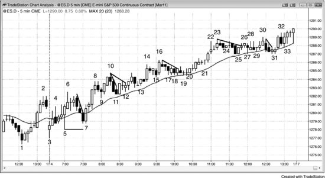

一旦交易员认定市场处于 Always-in 做多状态，最好的交易几乎总是在回调时买入——尤其是在均线附近、且信号K线带有阳线实体的时候。如图 24.1 所示，前一天尾盘拉出一波强势上涨，收盘时市场处于 Always-in 做多状态。开盘的两根连续多头趋势K线足以让交易员怀疑 Always-in 方向仍然偏多。到 bar 6 为止的四K线多头急速进一步证实了买压的存在。Bar 7 是一个两K线反转买入建仓形态，因为它既是从 bar 6 开始的高 2，也与 bar 5 构成双底牛旗。Bar 7 的低点比 bar 5 的低点高出 3 个 tick，反映出多头的急迫感——他们太急于做多，生怕市场根本不会跌回 bar 5 的底部，所以提前几个 tick 就出手买入。这同时也是对 bar 3 高点的突破回测（尽管 bar 7 的低点比 bar 3 的高点低了 1 个 tick）。从 bar 7 起连续四根多头趋势K线，可能（概率 60% 以上）让大多数交易员确信市场处于 Always-in 做多状态，因此他们都在寻找回调买入的机会，尤其是两段式回调至均线附近、且信号K线带有阳线实体的时候，比如 bar 7、12、20、25 和 31。Bar 31 是一个更大级别的高 2，因为它处于从 bar 23 开始的第二段下跌的底部。Bar 25 标志着第一段下跌的结束。到 bar 24 时，市场已进入窄幅交易区间。到了那个位置，大多数交易员要么应该接受任何买入信号并耐心持仓，要么空仓观望。一旦窄幅交易区间形成，即便之前的趋势很强，向上突破的概率也会降到 55% 甚至更低。

对同一个信号，往往有多种解读方式，不同交易员看到的角度也不一样。比如，bar 12 的买入信号可以看作三角形突破买入建仓形态，其中 bar 9 和 bar 11 是头两次下推。它也可以看作对 bar 11 两K线反转高 1 的突破回测（bar 11 是这两根K线中的第一根），而那个高 1 同时也与 bar 9 构成双底。有些交易员把它看作均线附近的高 2，其中 bar 11 的两K线反转充当高 1。Bar 12 与两K线之前的那根多头趋势K线构成微型双底。大多数可交易的底部都来自某种形式的微型双底（或简单的双底，比如 bar 7 与 bar 5 的两K线反转），正如大多数可交易的顶部都来自某种形式的微型双顶——例如 bar 6 与其后三K线处的空头K线、bar 10 最终旗形与 bar 8、bar 16 最终旗形与 bar 14、以及 bar 23 与 bar 22 的双顶（也是最终旗形）。不过，在像今天这样的强多头趋势中，大多数交易员应该忽略这些逆势剥头皮的机会，只专注于寻找买入点。

注意，当天只有第一根K线跌破了均线，而在 bar 5 的多头急速之后，仅有两根K线的收盘价低于均线，而且下一根K线就迅速翻上去了。这是强势的信号。到收盘时回头看，很容易判断今天是一个多头趋势日（始于开盘的多头趋势、急速与通道多头、趋势性交易区间多头）。但在盘中实时推进时，这一点并不那么明显，因为趋势日总是看起来像在构建反转形态，可每一次回调最终不过是又一个牛旗。交易员必须不断寻找强势信号，如果这些信号确实存在——就像今天一样——就必须竭尽全力在回调时买入，因为这些就是最好的交易。成功概率在 60% 或更高，潜在回报至少与风险相当。如果交易员以波段方式持仓，最终的回报可以达到风险的好几倍。

市场可能（概率 60% 以上）在交易价格超过强势 bar 5 反转K线时就进入了 Always-in 做多状态。如果交易员在 bar 5 上方买入，初始止损设在 bar 5 下方，那么*计划风险*是 14 个 tick。一旦市场交易价格超过了强势的 bar 7 两K线反转，他就会把止损收紧到 bar 7 低点下方 1 个 tick，此时距离入场价 11 个 tick。到这一步，交易员知道继续持仓的*实际风险*只有 11 个 tick。既然他认为市场处于 Always-in 做多状态，那他就相信等距运动的概率至少是 60%。当概率为 60% 时，要满足正向交易者方程，最低利润至少要等于实际风险的 11 个 tick。也就是说，只要他在 bar 5 信号K线高点上方 12 个 tick 处止盈，这个策略就是盈利的——意味着上涨幅度至少要达到 bar 5 上方 13 个 tick。这在 bar 10 期间就实现了（达到了 bar 5 上方 15 个 tick），这也是 bar 10 带有阴线实体的原因之一——部分多头在此获利了结。很多交易员会把部分或全部仓位做波段交易，以追求更大的利润。

**图 24.2** 10年期美国国债期货中的最佳交易

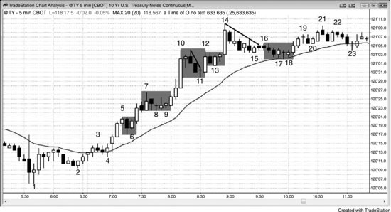

10年期美国国债期货非常适合在明确的 Always-in 趋势回调中用突破单入场。如图24.2所示，有些交易员认为市场在K线1起始的两K线多头急速中转为 Always-in 做多，另一些交易员则认为直到K线4的失败低点2处才翻转为做多，尤其是K线2到K线4之间已经出现了四根多头趋势K线。当市场从K线4到K线5强势向上突破时，毫无疑问已经是 Always-in 做多。此时交易员开始在回调中买入。K线6是一个高1做多建仓形态。有些交易员不太愿意买高1，因为回调往往会延伸为高2或楔形牛旗。如果交易员既不想买高1，又不想错过一波强趋势，可以在趋势高点上方挂一张买入突破单。这里，当K线6的高1形成时，谨慎的多头可以在K线5高点上方一个 tick 处挂买入突破单。这样就能确保：一旦K线6的高1带动趋势恢复，他们就能入场做多；而如果之后出现更复杂的回调，这张单子也不会被触发。

K线9和K线11都是高2做多建仓形态。K线9同时还是与K线8构成的微型双底，是K线8高1或高2的回调（有些交易员把K线7之前那根空头趋势K线视为高1回调），也是一个三角形突破建仓形态（三次下推分别是K线7之前的空头趋势K线、K线8和K线9）。K线12是一根大阳线，顶部只有很小的影线，底部没有影线，说明多头非常强势。随后K线13形成了一个可靠的突破回调做多建仓形态。

K线14是一根大阳线，出现在一段持续上涨之后，而且前面有一个小型交易区间（K线10到K线13），这个交易区间可能是最终旗形。最终旗形之后，交易员通常会等待至少10根K线、两段式回调至均线附近再考虑买入。下跌到K线15形成了一个楔形牛旗，但由于它是一个微型通道，大多数交易员仅将其视为一段回调，买入意愿不强。多头微型通道向上突破后大多会出现回调，所以最强势的多头在观望：回调能否在均线处获得支撑，还是K线16下方的下跌会引发又一段下行。后者的可能性较低，因为多头趋势非常强，市场刚好在均线上方，而且仍然处于 Always-in 做多状态。K线18的 ii 形态是一个极好的做多建仓形态，原因有多个：它是微型通道突破回调，处于均线位置，信号K线是阳线，与前面两根K线处的阳线构成微型双底，同时也是一个 EMA 20 缺口K线做多建仓形态。

有经验的交易员把K线14视为第二次、第三次甚至第四次买入高潮，预期之后会进入交易区间。虽然在这里做空对大多数交易员来说不算最佳交易，但非常有经验的交易员会在以下位置做空：K线14收盘时、其后那根空头趋势K线收盘时、该空头趋势K线下方、或者再之后那根十字星下方，预期至少出现两段式回调至均线。其中一些交易员可能会用较小的仓位做空，要么是因为他们愿意在更高位置加仓，要么是因为即使被止损出场，他们对下一次信号会更有信心，届时会用正常仓位交易。K线14收盘后，有些交易员立刻在K线14的收盘价挂了限价卖空单。大多数这些限价单不会成交，因为之后那根空头趋势K线的最高价没有超过K线14的收盘价。这说明卖方非常急迫，也让做空剥头皮的交易员更有信心在这根空头内包K线收盘处或其下方做空，预期至少测试均线。再下一根K线同样没能突破K线14的收盘价，它顶部的影线与K线14的高点构成了一个小型双顶。

很多交易员喜欢买回调，一个重要原因是风险更小。交易员不需要把止损放在多头急速底部下方，而是可以放在回调底部下方。剩余的盈利空间通常会少一些，但这就是用更小风险换来的代价。比如，交易员可以在K线10收盘时买入，但理论上保护性止损得放在K线8（多头急速底部）下方。如果改为等待回调买入，比如在K线11上方买入，止损只需放在K线11低点下方，风险就小很多了。

市场始终在试图把概率维持在50%附近，因为只有这样多头和空头才是平衡的。你的每一笔交易都必须有一个机构愿意做对手方，而它不会轻易给你60%的胜率。但机构无法完美地控制概率，概率经常会偏移到60%，这就给了交易员一个很好的交易者方程。

**图24.3** 欧元/美元图表上的最佳交易

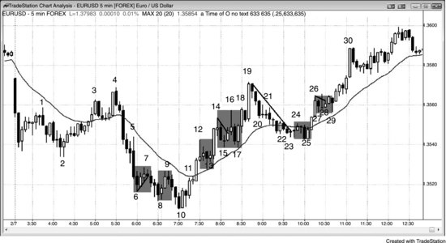

如图 24.3 所示（5 分钟 EUR/USD 外汇图表），一旦市场明确处于 Always-in 做多或做空状态，交易员就会寻找回调入场机会。当天前两根K线是均线下方的大阴线（空头趋势K线），使市场进入 Always-in 做空状态。K线 4 与K线 1、K线 3 构成楔形 LH，同时也是空头趋势中均线缺口K线做空的二次入场点——此时趋势已经演变为交易区间（K线 3 是空头趋势中第一根在均线上方留有缺口的K线）。K线 5 是一根大阴线，同时是外包阴线，也是双底失败的信号，因此多数交易员认为市场仍处于 Always-in 做空状态。在K线 7 的低 1 建仓形态下方做空，以及在K线 9 的双顶熊旗（与K线 7 构成双顶）下方做空，都是合理的交易。K线 9 同时也是K线 7 熊旗突破之后的突破回调做空机会。K线 10 处的两K线反转向上是一个约有 60% 概率获得波段利润的建仓形态，对所有交易员来说都是很好的机会，包括新手在内。K线 4 是空头趋势中的缺口K线，这种形态通常会先测试空头低点（当时是K线 2），然后走出一段至少包含十根K线和两段式回调的反弹。到K线 6 的空头急速下跌力度太强，交易员无法在此买入。K线 8 是一个合理的买入机会，原因有以下几点：

- 它是K线 2 下方突破之后的第二次反转尝试
- 它构成扩展三角形底部（当天第三根K线是第一次下推，K线 2 是第二次）
- 它是K线 7 熊旗的最终旗形反转
- 它本身是一根强多头反转K线

扩展三角形底部始终是主要趋势反转（MTR）建仓形态。不过，由于到K线 4 的上涨腿和到K线 6 的下跌腿幅度都很大，多数交易员不会将其称为主要趋势反转，而是用其他方式来描述（尽管在 15 分钟图表上几乎可以肯定这是一个非常漂亮的主要趋势反转）。K线 10 是在已经很强的形态中的二次入场点。交易员在K线 10 高点上方买入——K线 10 是两K线反转的第二根K线——初始保护性止损设在K线 10 低点下方。当市场达到风险的 2 倍时，他们止盈部分或全部仓位，剩余仓位继续波段持有，跟踪止损设在最近的 HL 下方。有些人会在K线 19 处的双顶（与K线 4 构成双顶）和楔形（由K线 12、14、19 以及K线 14、16、19 构成）下方出场，另一些人则继续持有，止损放在K线 17 下方。

到K线 12 时，市场已明确处于 Always-in 做多状态，交易员预期至少还有一段上涨腿，并且有较大概率（60% 以上）基于K线 10 到K线 12 的强多头急速高度产生测量移动。多头可以在K线 13 的高 1 处买入，也可以在K线 12 上方的突破处买入。

K线 15 也是一个高 1，但此时多头急速已不那么强，因为之前已出现过一个高 1 买入建仓形态，而且市场有较大概率（60% 以上）已接近交易区间的顶部。K线 17 是一个更安全的买入建仓形态，因为它是均线附近的高 2，且信号K线是一根强多头趋势K线（与前一根K线构成两K线反转）。

K线 22 处回调到均线的走势形成了一个空头微型通道，因此通道上方的第一次突破很可能（60% 以上）会先出现突破回调，然后才能走出较大幅度的上涨。K线 25 就是这个突破回调的买入建仓形态。

K线 25 是一个两K线反转，与K线 23 构成双底。有些交易员可能会称之为微型双底，因为它只包含四五根K线。它同时也是K线 24 突破K线 19 到K线 23 空头微型通道之后的回调，与K线 17 构成近似双底，并且是更大级别多头趋势中的第一根均线缺口K线——这通常是买入信号（概率 60% 以上）。由于下降通道很窄，等待K线 25 两K线反转上方的二次入场点是概率更高的做法。

到K线 26 的多头急速由三根连续的强多头趋势K线组成，因此后续走出更高价格的概率很大。任何多头仓位最差的保护性止损位在K线 25（急速底部）下方，但多数交易员会更早出场，比如在K线 26 低点或K线 25 信号K线高点下方出场。市场在K线 27 上方触发了高 1 做多，然后在K线 28 上方触发了高 2 做多。市场仍明确处于 Always-in 做多状态，所以交易员不应急于在回调时出场。K线 29 是一个楔形牛旗买入建仓形态（K线 27、28、29 构成三次下推）；它同时也是与K线 27 构成的双底，是K线 28 高 2 牛旗突破之后的突破回调买入建仓形态，以及一个失败的 LH（前一根K线是一个小的 LH，也是失败的高 2 买入建仓形态）。

**图 24.4** IBM 的最佳交易

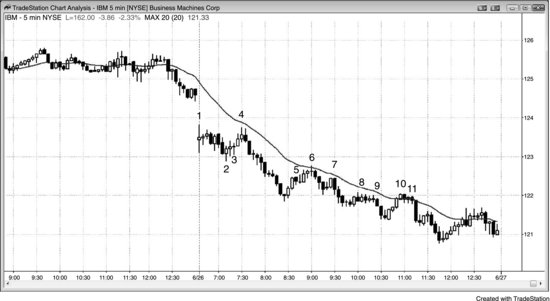

如图 24.4 所示，IBM 这张 5 分钟图中的最佳交易包括：K线 2 的开盘反转兼缺口急速与通道底部做多，K线 4 在均线处的双顶做空，K线 6 在强空头急速之后均线处的低 2 做空，K线 7 的低 2 兼微型通道突破失败做空，K线 9 的小三角形或横盘楔形熊旗做空，以及K线 11 在均线处的低 2 做空。

这段强空头趋势中出现了多次均线回调做空机会。K线 2 下方突破之后，交易员会认为当天属于趋势性交易区间日，甚至可能是更强的始于开盘的趋势日。到K线 6 时，交易员已经在每一次向均线的两段式回调和每一个低 2 建仓形态上做空了。

K线 6 是均线处的低 2 做空（K线 5 是一根小空头K线，结束了第一腿上涨）。它与前面两根K线的高点构成微型双顶，同时也是紧邻其前方那根内包K线的单K线最终旗形反转。

K线 7 是测试K线 6 下方盈亏平衡点止损位后的向下反转，也是K线 6 处结束的熊旗下方突破后的回调。

K线 9 是低 2 做空，K线 11 是均线处的低 2 做空，同时与K线 10 构成微型双顶。这两个建仓形态看起来都不理想，但在强空头趋势日里，你必须相信均线处的低 2 做空拥有非常高的成功概率。

K线 5 之前的两根K线组成的多头急速非常强，大多数新手会将其视为一轮猛烈的多头反转的开端。上涨到K线 6 的过程中共有 7 根K线，其中只有一根带空头实体。人很容易只盯着这股力量，而忽视之前发生的一切。这轮急涨是超过 20 根K线以来首次回调到均线的走势，经验丰富的交易员将其视为做空信号。新手只看到了力量，想在后续的更高低点上做多，期待趋势反转或至少出现第二腿上涨。他们把K线 6 之后的三根强空头趋势K线仅仅理解为对日内低点上方突破的急速回测，然后买入等待下一腿上涨。经验丰富的交易员则认为这不过是一次对强趋势的反转尝试，最可能只是一个熊旗。他们在K线 7 处的两段式横向修正中做空，正确地预判了空头趋势会恢复。

**图 24.5** USO 的最佳交易

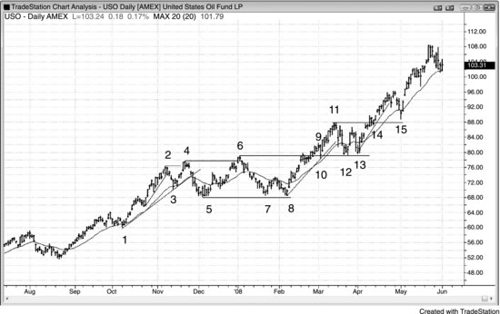

如图 24.5 所示，USO（United States Oil Fund LP）日线图上当天的最佳建仓形态包括：K线 1 的楔形牛旗，K线 3 在均线处的高 1 测试，K线 5 在更大级别高 2 中的二次入场点（K线 3 是第一次下推），K线 6 的扩张三角形兼更高高点（HH）主要趋势反转（MTR），K线 8 的双底（与K线 5）兼微型通道突破回调（K线 7 开始的上涨突破了微型通道上沿），K线 10 的微型通道突破失败，K线 12 的第二次均线缺口K线建仓形态、双底（与K线 10）、高 2 以及K线 6 的突破回测，K线 13 的双底兼高 2，以及K线 15 在均线处的高 2 兼K线 11 的突破回测。

市场明显处于多头趋势中，因此最佳交易很可能就是任何高 2 做多，尤其是在均线附近的，比如K线 1、K线 5 和K线 12。K线 1 是均线处的高 2，有些交易员将其视为小型楔形牛旗。K线 5 是更大级别高 2 买入建仓形态中的第二腿下跌，其中K线 3 是第一腿下跌。

激进的交易员会把K线 1 附近那段横向移动到均线的小幅波动看作安静的牛旗，而非反转形态。因此他们会在前几根K线的低点或更低位置挂限价单买入，而不是等待市场恢复多头趋势。

K线 6 是更高高点（HH）主要趋势反转（MTR）和扩张三角形顶部，做空是合理的。不过，大多数主要趋势反转并不会引发反方向的趋势，而是更多演变成交易区间，但通常有足够的空间做一笔小波段交易（回报至少是风险的 2 倍）。

K线 8 和K线 13 都是两段式回调跌破均线的形态（缺口K线）。

K线 8 是对K线 5 所在交易区间低点的二次测试，K线 13 是对K线 6 所在交易区间高点突破的二次测试；两者都形成了双底牛旗。

K线 10 构成了一个突破回调的二次做多入场点（同时也是由K线 2、3、4、5、6、8、9 形成的扩张三角形顶部的失败）。

注意，尽管这是一段明确的多头趋势，K线 6 仍然是一个不错的做空机会，因为下跌到K线 5 的过程中趋势线已被突破。K线 6 是一段两腿楔形状的上涨创新高，同时也是扩张三角形（K线 2、3、4、5、6）的顶部。

K线 15 是K线 11 的突破回测。很多顺势建仓形态看起来会很差，但你必须信任自己的判读并下单，否则就会和其他弱手一样被套在场外，错过绝佳的交易机会。

在强多头趋势中，做多并不需要多强的建仓形态。你可以在任何位置市价买入并赚到钱，但有建仓形态的配合可以让你用更紧的止损。

有些交易员会在价格到达利润目标大约一半时，将保护性止损移到盈亏平衡点。比如，某个交易员在K线8上方做多，预期市场向上突破交易区间后出现测量移动上涨，那么当市场到达K线9附近时——此时已超过目标距离的一半，而且有好几根K线收在交易区间顶部上方——他可能就会把止损移到盈亏平衡点。如果保护性止损被打掉了，他完全不必为此烦恼，因为止损本来就该这样发挥作用：限制亏损。至少40%的交易都会亏损，这再正常不过。

**图 24.6** UltraShort S&P 500 ProShares (SDS) 的最佳交易

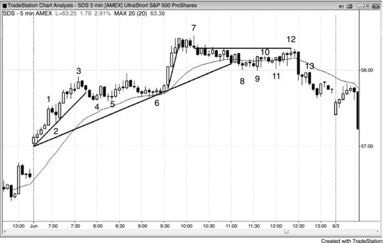

如图24.6所示，SDS 5分钟图上的最佳建仓形态包括：K线2处始于开盘的多头趋势中第一次回调做多，K线5处的高点2做多，以及K线6处均线附近的楔形牛旗（或三角形）二次入场做多。

这是一个始于开盘的趋势日。开盘后向上的动能很强，第一段主要上涨腿在K线3处结束。当多头趋势很强时，要寻找高点2做多。K线5和K线6都是很好的高点2做多入场点，K线6同时也是均线回调做多。K线6的高点2对应的是前面2根和4根K线形成的微型双底，同时也是从K线3开始的大型两段式回调的入场点，其中K线4是高点1的做多建仓形态。

K线7是第二段上涨腿，也是一次失败的旗形突破（最终旗形反转），之后价格缓慢下跌并跌破了当天的主要趋势线。

当市场进入窄幅交易区间或窄通道时，大多数交易员应该停止交易。一些有经验的交易员会在前一根K线低点买入、在前一根K线高点做空，也会在底部买入小阳线、在顶部附近做空小阴线，比如K线12之后那样。

从K线8开始的下跌过程中没有出现明显的反弹，而且空头已经控制市场超过一个小时，所以寻找第二段下跌是合理的。K线10是一小段上涨腿，K线12是第二段上涨腿，并且在从K线11上涨的过程中出现了低点2。另外，K线12是一根跳空到均线上方的小K线，也是一个小型、几乎水平的楔形顶部，其中K线10是第一次推高，K线11之后两根K线是第二次推高。它还是一个低点4建仓形态、一个更低高点（LH）的主要趋势反转（MTR），以及对K线7低点的测试。

K线13是K线9突破的突破回调，同时也是一根失败的多头反转K线，把做多的交易员套在了里面。

就在K线7之前，市场进入了窄幅交易区间，一直持续到K线12之后不久。这是用突破单入场最糟糕的环境，因为这和机构的做法完全相反，而你的目标就是尽可能模仿他们。作为新手，你无法用限价单入场再加仓，所以只能等待。机构在K线低点下方买入，所以价格跌破前一根K线低点后反而涨了起来。你也能看出他们在前一根K线高点上方做空，因为之后一两根K线价格就跌了下来。既然新手只能用突破单入场，一旦看到市场有任何进入窄幅交易区间的迹象，就绝对不该交易，因为用突破单入场只会反复亏损。如果你是新手并且决定每天最多做三笔交易，那在K线7之后你应该想什么？你是在告诉自己"这正是我等了一整天的机会……市场安静了、不那么吓人了"？还是在想"这里的概率太低了，把我仅有的三次交易机会浪费在这里简直是愚蠢的"？这里显然是用突破单入场最差的环境，在突破真正发生之前，最佳交易几乎不可能出现。你一边交易一边指望自己的单子能赶上一次成功的突破，但之前5到10个信号全都没有成功。在你能稳定盈利之前，绝对不要在窄幅交易区间里交易，即便已经稳定盈利了，等一等也更好。你当然可以像机构那样用限价单入场，在市场反向运动时分批加仓做空或做多，但那在情绪上非常消耗。浮亏会大到让人难以承受，最终你会犯错，比如在市场即将反转、朝你有利方向运动之前，带着巨大亏损平仓出局。远不如用突破单入场，等到胜率经常能达到60%的行情环境出现再动手，不要在窄幅交易区间里交易。

**图 24.7** AAPL 空头趋势中的最佳交易

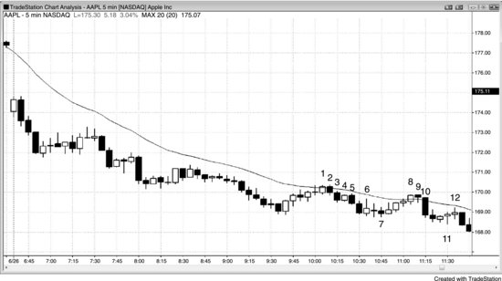

如图24.7所示，AAPL 5分钟图上的最佳建仓形态包括：K线1处的EMA 20缺口K线做空，K线2处两K线反转下方做空，以及K线7处的双底做多。

AAPL 当天走出了始于开盘的空头趋势。K线2 是一个两K线反转建仓形态，适合做 EMA 20 缺口K线做空。K线2 的入场价为 $169.88，初始止损设在入场K线上方 $170.38。入场K线是一根外包阴线，交易者一进场就会把保护性止损挂在这根K线高点上方，很可能 (60%+) 在K线收盘之前就已经挂好了。这样做是合理的，因为能明确风险——如果市场马上反转并涨过这根K线的高点，他们就不应该继续持有空头仓位了。如果入场K线不是外包K线，他们会把止损放在信号K线上方。这笔交易的初始风险是 50 美分。

激进的交易者会在K线3 和K线4 的高点挂限价单做空，预期任何上涨都会失败，从而形成突破回调做空建仓形态，也就是对K线3 突破熊旗的回调。他们把这段走势看作安静的熊旗而非多头反转，预期还会有更多抛压，所以在任何K线高点上方做空都是合理的。

K线5 是一个质量很差的高 1，因为市场正处于强空头趋势中，交易者不会在此平掉空头仓位，也不会反手做多。市场仅比K线5 高出 7 美分，而交易者此时还不会把保护性止损向下移动，因为最大浮盈才 38 美分，他们需要给这笔交易留出时间去发展。通常 (60%+) 来说，像这样的交易，浮盈要达到 60 到 80 美分左右，才适合把止损移到盈亏平衡点。

到了K线6，交易者可以用限价单平掉一半仓位，锁定 $1.00 的利润（K线6 的低点比入场价低 $1.07）。从这根K线的外包阳线形态可以看出，很多交易者可能 (60%+) 在这里回补了部分甚至全部空头仓位。到了这一步，他们会把保护性止损移到盈亏平衡点，或者差几美分的位置（$170.91 是合理的，因为 AAPL 很少会把止损多扫过 1 美分），然后除非出现清晰而强劲的反转，否则不会出场。在这种强空头趋势日中，出现强劲反转是不太可能 (≤40%) 的。他们预期会出现回调来吓走弱势空头。比如，反弹到K线9 时刚好触及盈亏平衡点止损，精确到 1 美分（$170.88），随后又掉头向下。

如果交易者被止损出场了，可以在K线10 再次做空，依据是K线9 对均线的测试以及突破回测。K线10 表明突破回测达到了目的——把交易者吓出场外，因为很明显有大量空头在这里重新入场。如果交易者之前让自己被止损扫出，现在虽然又重新做空，但入场价格已经差了 41 美分！

**图 24.8** GS 强空头趋势中的最佳交易

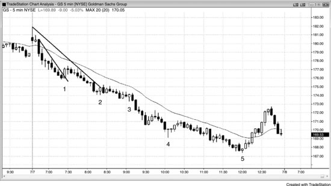

如图 24.8 所示，这张高盛集团（GS）的 5 分钟图中，最佳建仓形态包括：K线1 之后两根K线形成的微型通道突破失败做空、K线3 之后那根K线下方的突破回调做空（这里是低 2），以及K线5 多头反转K线上方的二次入场点做多——此时市场已经走完了从太平洋时间 11:10 空头急速阶段开始的急速与通道下跌。

小幅回调趋势是最强的空头趋势类型。由于之前没有出现任何多头力量的迹象，交易者全天都应该只考虑做空，除非有迹象表明可能 (60%+) 出现尾盘反弹的建仓形态。在出现潜在底部（K线5）之前，交易者可以在每次小幅回调时做空。截至K线1，之前最大的回调幅度略超 1 美元，所以交易者可以挂限价单，在最近低点上方 1 美元处做空。他们需要先确定保护性止损的位置，才能计算出最低的合理利润目标。由于止损位置往往不容易判断，他们需要从最坏情况来考虑。比如，如果市场涨过了当天第四根K线的高点，那空头的论据就会大大减弱。因此，他们可以把保护性止损设在该K线高点上方，大约 $179.50。由于做空价格大约在 $177，风险大约是 $2.50。如果他们通常 (60%+) 每笔交易不承担超过 $500 的风险，那只能交易 200 股。这是一个趋势行情，他们必须假设至少有 60% 的概率创出新低，也就是大约 $1.00 的利润。但他们应该只做潜在回报至少与风险相当的交易。这意味着他们应该先平掉一半仓位（100 股），目标是入场价下方 $2.50，大约在 $174.50。在K线2 前两根K线形成的空头趋势K线上就能成交。到那时，他们可以把止损移到盈亏平衡点，然后持有剩余仓位，直到 Always-in 方向反转为多头、或者止损被触发、或者在最后一个小时左右出现合理的反转上涨、或者收盘。如果在K线5 上方出场，第二批 100 股能赚 $900。如果在市场变成 Always-in 多头、多头急速上涨到 $170 时出场，能赚 $700。如果持有到收盘，这第二批 100 股也能赚大约 $700。

这是一个应当规避的典型反转入场案例。每天盘中，尤其是开盘头两个小时，你都应该反复审视图表，判断当天是否是趋势日（主要类型在本系列第一本书中已有介绍）。如果是趋势日，就不应该做逆势交易。像这种始于开盘的趋势日最容易辨认。到当天第3根K线时（一根大阴线趋势K线，远离开盘价大幅下跌），你就应该有所警觉了；等到市场跌破K线1，你应该已经非常确定了。

K线1处的上涨是一根大阳线趋势K线，突破了一条微型趋势线，因此很可能（60%以上）会失败。激进的交易者可能会在K线2、K线3和K线4这些反转K线上方买入，认为多头在那次趋势线突破中展示了足够的力量。但从当天第3根K线起，市场就一直处于均线下方。交易者应该牢记，在这种小幅回调的空头趋势日里，第一次反弹到均线附近通常都会失败，随后市场会再去测试低点。不要说服自己"市场已经跌了这么多，该反弹了"。这样想的话，你本质上就是在逆势思维，试图在强趋势日里寻找逆势刮头皮的机会。你不敢在低点附近做空，反而寄希望于趋势反转——这是低概率的押注。算一算就知道：大多数逆势刮头皮都会失败，每次亏损金额太大，偶尔一两次盈利根本补不回来。

不过，GS 这天全天都没有在均线处出现过一个可交易的低2做空入场形态，所以有经验的交易者会在每一个微小的回调处做空，依靠典型的回调序列（在本系列第二本书中有介绍）来兜底——即便回调走得比预期更远，也有办法脱身。无论是哪种类型的第一次回调，后面通常都会跟随一次对趋势极端价位的测试（这里指当天的最低点）。

**图 24.9** VOD 日线图上的最佳交易

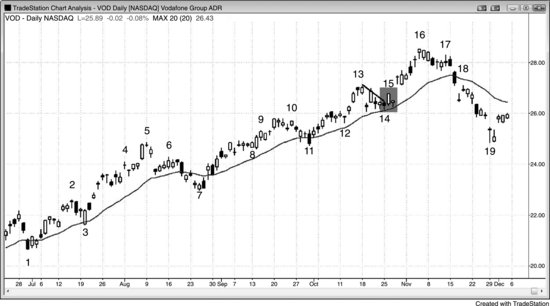

如图 24.9 所示，英国沃达丰集团（VOD）日线图上的最佳入场形态包括：K线3处均线附近的高1、K线7处的楔形牛旗兼均线缺口K线二次入场点、K线8处的小三角形、K线11处均线附近的楔形牛旗、K线12处的高2、K线14处的楔形牛旗，以及K线15低点处的突破回调做多。

当市场处于强多头趋势中，牛旗发生突破，且突破K线带有阳线实体时，在其低点下方挂单买入是一种可靠的策略。原因在于回调通常会演变成突破回调做多入场形态，而你等于以更低的价格买入了。VOD 在日线图上处于强多头趋势中。K线15是均线附近楔形牛旗的多头趋势K线突破，因此任何回调大概率都很短暂，会成为突破回调买入的信号K线。交易者可以在K线15的低点挂限价单买入。那些打算等回调K线出现后再在其上方买入的交易者，第二天看到大幅跳空高开就傻眼了。如果他们仍想做多，只能以更差的价格入场。

虽然市场从K线5开始下跌，跌破了K线3以来上升通道底部的趋势线（未标示），但这两根K线的下跌甚至都没有触及均线。这使得K线6不太可能是主要趋势反转（MTR）的较低高点，更像只是在形成一个回调。这个回调在K线7处结束——那里同时是高2、楔形牛旗和均线缺口K线。

**图 24.10** 大多数时候应低买高卖

一般来说，应该始终寻找低买高卖的机会，只有在强趋势中例外——多头趋势中高买更高卖，空头趋势中低卖更低买回。但如果你在自己认为是次要顶部的位置做了空，比如在图 24.10 中 Emini 图表的K线15或K线16下方做空，结果市场又形成了一个高2（如K线17），那就应该平仓，甚至反手做多。如果高2的信号K线是阳线，同时在测试均线，这一点尤为成立。反过来也一样：如果你在一段空头腿的底部买入，结果市场形成了一个合理的低2，信号K线是阴线且在测试均线底部，那就应该平仓，并考虑反手做空。

当 Emini 的日均波幅大约在10到15个点时，交易员通常需要承担大约2个点的风险。他们应该寻找成功概率至少60%、回报至少与风险相当的交易机会。大多数交易日都有5个甚至更多这样的建仓形态，比如在这张图中做空K线1的开盘反转、在K线3低点上方做多、做多高点2回调（K线7、K线14之后那根K线、K线17），以及K线22的微型通道突破回调。记住，如果交易员觉得一个建仓形态可能不错，就应该假定成功概率至少有60%。只要回报至少与风险相当，交易者方程就是正向的。

注意，大多数小级别反转都来自微型双顶、微型双底和小型最终旗形。剥头皮者喜欢在看到这些建仓形态之后再下单。

**图 24.11** 回报应该始终至少与风险相当

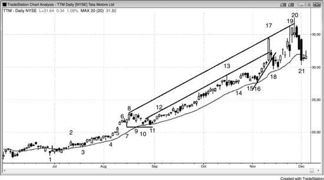

最佳交易是指成功概率至少60%、潜在回报至少与风险相当的交易。如图24.11所示，Tata Motors Ltd（TTM，印度汽车制造商）这张日线图上的最佳建仓形态包括：K线3和K线4的高点2建仓形态、K线5到K线6之间多头急速段中的任意一根K线、K线10的高点2、K线11的楔形牛旗、K线12突破后的高点1、K线14的突破回调及其前一根K线的高点2入场、K线16的高点2，以及K线20的更高高点反转。

在强趋势中，楔形牛旗回调至均线是可靠的做多建仓形态。TTM从K线1开始处于强多头趋势中，不到两个月就涨到K线8，涨幅接近40%。市场在K线10处出现高点2回调至均线，这是一个合理的做多机会，随后在K线11内包K线处演变为楔形牛旗做多建仓形态，同样位于均线附近。K线11是对K线10处结束的牛旗突破之后的回调，因此也构成一个突破回调做多建仓形态。如果交易员在K线10上方做多，既可以在三根K线之后的下跌中以盈亏平衡点出场，也可以依赖信号K线下方的保护性止损——那个位置不会被触及。此外，他们还可以把止损设在K线7低点稍下方。

K线7是多头趋势中一段强多头急速阶段的第一次回调，且前面没有出现买入高潮。这是一个理想的高点1做多建仓形态，同时也是微型通道突破失败做多建仓形态。由于它是突破K线5结束的窄交易区间之后的第一次回调，因此也是突破回调做多建仓形态。

K线17那根巨大的多头趋势K线是一个买入高潮。每当一段持续10根、20根甚至更多K线的趋势中出现一根巨大的多头趋势K线时，这根K线往往代表着衰竭。它的形成源于最后一批空头回补离场，加上迟到的多头进场买入，这两拨人都是弱势交易者。此时强势多头只会等回调再买入，强势空头则在做空，而且越高越空。K线17的突破远远冲过了过去几个月的趋势通道线，由此引出一条更高的趋势通道线。市场在K线19和K线20两次试图突破这条线，两次都遇到强劲的抛压——从两根K线顶部的长上影线、K线19的空头实体，以及K线20的收盘价远低于K线中点就能看出来。当市场两次尝试做同一件事都失败时，通常会转向反方向运动。从K线18开始的空头K线、K线19和K线20顶部的长上影线代表着不断积累的抛压，而从K线17开始K线实体逐渐变大，说明多头正在极力把趋势推向更强的多头方向。这种努力最终导致了他们的衰竭，抛压逐渐将他们压垮。市场至少有可能出现一段两段式回调，甚至可能出现趋势反转。

向K线18的下跌跌破了一条多头趋势线，加上上述所有抛压，继续下跌的可能性很大，因此在K线20之后那根强空头K线下方做空是一笔高概率交易。这是一根收在最低点的大空头趋势K线，与K线20构成一个大型双K线反转。空头实体的大尺寸和极小的影线表明抛压非常强劲。

**图 24.12** SOLF 的最佳交易

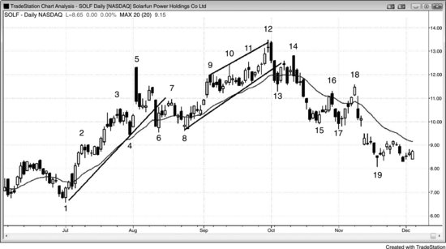

如图24.12所示，Solarfun Power Holdings Company Ltd（SOLF，中国光伏电池制造商，产品用于太阳能面板）日线图上的最佳建仓形态包括：K线4在均线处的高点2、K线5在第三次上推后的大幅向下反转、K线7在两次强劲下推后的低点2、K线8的双底牛旗、K线9之后的小型高点2和K线10之后再次出现的高点2、K线12的更高高点，以及K线14的两段式更低高点。

HH 反转之后，通常会出现一个 LH 做空建仓形态。从 K线5 高点开始，SOLF 走出了一轮强劲下跌。K线6 之前出现了第二根大阴线，K线3 和 K线4 附近也有多根空头趋势K线。这些都代表抛压，而抛压是会累积的，累积到一定程度就可能引发趋势反转。不过，空头在突破趋势线之后未能连续打出多根空头趋势K线，所以 Always-in 的方向仍然是多头。

下跌到 K线8 时强势击穿了多头趋势线，但随后价格急速反弹到 K线9，突破了头肩顶中 K线7 右肩的高点，因此后续大概率会有跟随。价格急速拉升到 K线9 之后，市场以通道形式上行至 K线12，形成了高于 K线5 的 HH。经历了从 K线5 开始的强势抛售，空头在寻找做空机会，多头在考虑止盈。有些交易者把 K线12 看作通道中的三连推——其中 K线9 或 K线10 是第一推，K线10 或 K线11 是第二推。K线12 的信号K线是一根十字星，所以有些交易者可能会等空头展现出更多力量后再行动。

K线12 之后出现了一根强空头趋势K线，这是强势卖盘的信号，让空头有信心在接下来几根K线上积极做空。这三根K线组成的空头急速段由大实体阴线构成，而且击穿了多头趋势线。交易者认为后续大概率还会继续下跌，而且此时 Always-in 的方向已经变成做空，他们会在反弹时寻找做空机会。

市场形成了一个两段式 LH，在 K线14 处回测了 K线12 的低点，而且从该K线的第一个 tick 就开始下跌。交易者非常确信市场要跌。有些人在价格跌破前一根K线低点、形成外包阴线时做空；另一些人在价格突破 K线13 急速段低点时做空，预期至少能走出一个测量移动的幅度。

下跌到 K线15 的空头急速段同样很强，但有些空头被 K线18 的急速反弹甩出了场外，反弹刚好到 K线16 高点上方。有些交易者在 K线15 这根多头趋势K线上方买入，理由是它与 K线8 构成了双底牛旗，同时也是两K线反转，还是两根K线之前的单K线最终旗形反转。但 K线18 之后紧接着就是一根大实体阴线，空头又回来了。好的交易被甩出去是常有的事，但一定要尽量避免。不要过早收紧止损，尽量用盈亏平衡点的止损持有一部分仓位，直到市场明确转为 Always-in 做多。反弹到 K线18 的幅度还不足以翻转 Always-in 的方向，所以波段交易者应该继续持有空单。

从 K线5 到 K线8 的抛售足够猛烈，让交易者开始考虑市场是不是正从多头趋势转变为交易区间。反弹到 K线12 的过程中出现了很多回调、阴线实体以及顶部带影线的K线，这些都是抛压的信号，说明市场正在转变为双向博弈。这更像交易区间里的一条多头腿，而不是多头趋势。交易者开始在波段高点上方做空——比如 K线10 突破 K线9 高点时，或者 K线11 突破 K线10 高点时。K线12 是一个 HH（高于 K线5）的主要趋势反转（MTR）信号K线，但大多数交易者认为更可能走出交易区间、回测 K线8 区间底部，而不是直接进入空头趋势——大多数交易区间突破尝试都会失败，向来如此。虽然在 K线15 到 K线17 之间有一些止盈行为，但 K线16 和 K线18 形成了双顶熊旗，最终带动价格突破区间下沿。很多交易者在 K线15 附近部分止盈，并把保护性止损移到盈亏平衡点，期待更大幅度的波段下跌，但他们知道这种概率不到 50%。不过，有时候确实能拿到意外的大利润，这次就是这样。

**图 24.13** CX 的最佳交易

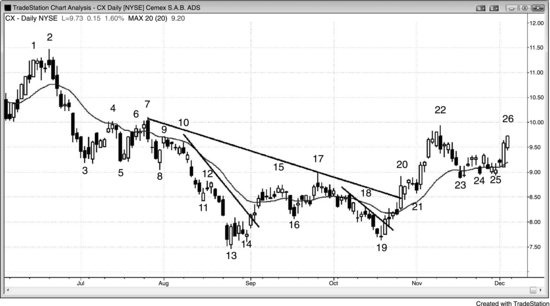

如图24.13所示，墨西哥大型水泥生产商 Cemex（CX）的日线图上，最佳建仓形态包括：

- K线2处的**最终旗形**反转，与K线1形成**微型双顶**；正值空头急速阶段，可在随后三根K线中的任一根做空。
- K线4处的**楔形熊旗**回调至均线做空。
- K线5**卖出高潮**（**突破**失败）与**双底**之后，在小型多头**内包K线**上方买入。
- K线7处的**低 2**与**微型双顶**做空，也可以在价格跌破前一根K线低点时做空（因为那根K线本身就是**低 2**的**信号K线**）。
- K线8处的三重底配合**多头反转K线**买入。
- K线10与K线9形成**双顶熊旗**，在均线处做空（同时也是**空头趋势**中均线处的**空头反转K线****低 2**）。
- K线12处**微型通道**突破失败，配合**突破回调**做空——这是对三重底下方突破的回调。
- K线14处的**微型双底**牛旗买入。这里也是K线13强**多头反转K线**之后**低 2**失败的信号，加上一段大幅两段式下跌（近似腿1 = 腿2的走势：腿1是K线2到K线3的急速下跌，腿2是K线9到K线13的空头通道，包含三次推进；K线7是一段较小的空头急速，与腿2共用同一个空头通道）。
- K线15处的**均线缺口K线**下方做空。
- K线16处的**HL**上方买入。
- K线17处的**低 2**做空（从K线16起有两次上推，K线15是更大级别**低 2**的第一次上推），同时也是**楔形熊旗**（K线13之后那根K线是第一次上推）。
- K线19处的**HL****主要趋势反转（MTR）**买入。
- K线21处的**高 2**买入（与K线20之后的多头**内包K线**形成**微型双底**）。
- K线25处的三角形（或**楔形牛旗**）在均线处买入，该区域多根K线带有阳线实体（**买压**）。

出现强空头急速时，交易员预期价格还会继续下跌，市场处于 Always-in 做空状态，交易员会寻找做空机会。CX 急速下跌到K线3，交易员预期价格会更低，等待逢高做空。他们在K线4处的两段式小反弹回到均线时做空。有些交易员用**限价单**在均线处做空，因为这是强空头急速之后第一次回调到均线。另一些交易员用**止损单**在K线4下方做空。K线4跌破了前一根K线的低点，属于第一次入场做空，而在K线4下方做空的交易员拿到的是**二次入场点**。

K线7处更大级别的两段式反弹构成**低 2**做空建仓形态。激进的空头用**限价单**在前一根K线高点上方和K线4上方做空，另一些人在价格跌破前一根K线低点、触发**二次入场点**做空信号时入场（K线6是第一次信号）。很多交易员偏好在强**空头趋势K线**下方做空，所以在K线7下方入场。由于太多交易员等着在那里做空，结果第二天市场直接跳空低开。

K线11之前出现了一段强空头急速，K线12突破了**微型通道**上沿。空头在K线12下方做空，预期第一次**微型通道**突破尝试会失败。

虽然到K线17的横盘走势突破了一条陡峭的空头趋势线，但下跌到K线13的位置远低于K线8的低点，交易员不得不重新寻找底部。他们需要再看到一次反弹突破空头趋势线，然后再一次测试趋势低点，才会认为市场确实在反转，而不只是又一轮空头反弹。到K线17的两段式上涨足够强，明显突破了均线上方，说明存在**买压**。交易员在K线17的**空头反转K线**下方做空，因为他们把这里看作一轮大型两段式反弹的终点，即**低 2**做空建仓形态。同时这也是**空头趋势**中的**均线缺口K线**做空，当时趋势还没有明确翻转为 Always-in 做多。

K线19的外包十字星算不上一根强劲的**HL**买入**信号K线**，但有些交易员在它上方买入，也有人在随后那根强**多头趋势K线**上方买入——那根K线突破了一条空头趋势线。这里也是对K线14上方做多者的**突破回测**，扫掉了那些多头的盈亏平衡止损。**突破回测**扫了盈亏平衡止损之后又沿新趋势方向反弹回升，这是一个**盈亏比**很好的建仓形态。风险在**信号K线**底部，回报则是新**多头趋势**带来的上行空间，通常是风险的好几倍。

K线20处的多头急速强势突破了均线和一条长期空头趋势线。有些交易员把这看作突破了倾斜**头肩底**的颈线。大多数交易员认为K线19到20的多头急速足够强，后面应该还有更高的价格，也就是说市场已经转为 Always-in 做多。他们在K线21的**高 2**建仓形态上方买入，又在K线24的**高 2**上方加仓。在K线25处的**楔形牛旗**回调到均线时买入阳线上方，则是更安全的做法。

也有交易员把K线23之前的下跌解读为空头微型通道，但价格仍在均线上方，且处于强多头趋势中，因此他们认为这段下跌很可能（60%+）最终成为牛旗的一部分。所以，与其等突破失败后做空，不如假设突破虽会失败、但失败幅度不大，最终演变为突破回调的买入信号。记住，当空头微型通道的失败突破本身再度失败时，就变成了突破回调做多入场。K线24就是那根突破回调K线，但它的实体是阴线，所以多数交易员不会在它的高点上方买入。不过，回调随后发展为两段式回调，一直延伸到K线25，同时也形成了双底牛旗。

**图 24.14** GOOG 的最佳交易

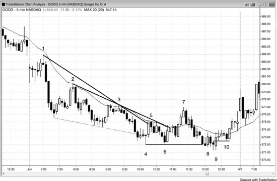

如图 24.14 所示，这张 GOOG（谷歌）5 分钟图上的最佳建仓形态包括：K线2和K线3处均线附近的低点2回调；K线4处的最终旗形加楔形底反转买入；K线7处的均线缺口K线、低点2加双顶做空；K线9处主要趋势反转（MTR）的更低低点买入；以及K线10处的更高低点加扫止损式突破回测买入。

当价格强力突破空头趋势线时，交易员会寻找对空头低点的测试来做多，前提是测试不能跌得太深。GOOG 从低点强势反弹到K线7，这段涨势由影线很短的多头趋势K线组成，不仅突破了空头趋势线，还站上了均线。而且在K线1之后的空头急速下跌过程中，曾出现过好几根影线很短的强多头趋势K线，说明多头愿意积极买入。这种买压是不断累积的，到了某个节点就能把空头磨垮，让多头重新夺回市场控制权。

激进的交易员会在K线5之后那根阴线的高点挂限价单做空。那里出现了三根连续重叠的K线，任何多头都被迫在这个交易区间的顶部买入。在空头日里、紧贴均线下方的位置这样做，尤其不明智。既然这里的买入很可能（60%+）会失败，精明的交易员就反其道而行之，在那些弱势多头买入的位置做空。

从K线7开始的下跌有很多重叠K线，还夹杂着几根阳线，说明存在双向交易，空头并未完全掌控局面。价格一跌破K线4的空头低点，买盘就在K线8处涌入。多头没能直接把市场反转过来，价格又一次跌破了空头低点。K线8是从K线7以来空头通道的第一次向上突破，所以不太可能（≤40%）有跟随。但到了K线9——第二次反转尝试——多头成功掌控了接下来的三根K线。K线9是K线8突破空头微型通道后的突破回调，而空头通道本身就是一面牛旗。

空头试图把K线9以来的反弹变成三K线熊旗，但多头在K线10的更高低点处压倒了他们。K线10在K线9做多信号K线上方仅 8 美分处反转向上（对一只 500 美元的股票来说，8 美分微不足道），构成一个极好的突破回测，交易员可以在它的高点上方加仓。它还把多头套在了场外，这些人现在只能追高买入。多头认为K线9很可能（60%+）带来至少两腿上涨，因此在接下来几根K线期间，在前一根K线低点或更低位置挂限价买单。他们预期任何低点1做空都会失败，进而形成一个更高低点。K线10正好触发了他们的限价买单，保护性止损设在K线9低点下方。

空头在当天早些时候有过不错的做空机会。市场跳空低开后，在K线1处均线下方形成了低点2做空建仓形态。激进的空头会在K线1之后那两根大阴线形成过程中做空——在它们的收盘价做空，或者在它们的低点下方一个Tick处做空。

空头急速非常强劲，很可能（60%+）出现跟随下跌，最可能的形式是空头通道，当天大概率演变为急速与通道型空头趋势日。空头会寻找在反弹高点做空的机会，也就是在发展中的空头通道顶部做空。K线2就是均线处的低点2做空建仓形态，同时也是对当天第一根K线下方突破的回测。

K线3是均线处的又一个低点2做空建仓形态，尽管这面熊旗中出现了强多头趋势K线。

K线4是从两K线最终熊旗处的向上反转，也是空头通道中的第三次下推，这种形态通常至少引发两腿反转。至少，这个楔形底很可能（60%+）像空头楼梯形态那样，回测前一次下推的低点（也就是K线2卖出后那段下跌的波段低点）。它也是第二次向上反转的尝试，第一次发生在两根K线之前。虽然十字星作为信号K线并不理想，但下跌过程中出现了很多多头趋势K线，所以不需要太大的力量就能扭转市场。空头趋势本身并不算特别强，内部存在大量双向交易。

在空头趋势中买低点，通常至少应该对一部分仓位做剥头皮——价格测试均线时（也恰好在前一个波段低点上方），交易员可以先了结一部分。之后可以把保护性止损移到盈亏平衡点。大多数交易员会在市场跌破始于 Bar 5 的两根空头趋势K线后出场，但也有人会把止损留在 Bar 4 的空头低点下方。这还算不上一个强底部，因为反弹到 Bar 5 时才勉强突破趋势线，市场仍处于 Always-in 做空状态。多头在这里保持谨慎、早点出场是明智的。

Bar 7 是一个可以接受的均线缺口K线做空机会，同时与 Bar 3 构成双顶熊旗，也是空头趋势中的两段上涨。不过，在一根多头趋势K线下方做空风险较高，尤其是在三K线多头急速走势之后。更好的做法是等待对空头低点的 HL 或 LL 测试，再考虑做多。

**图 24.15** AAPL 中的 LH

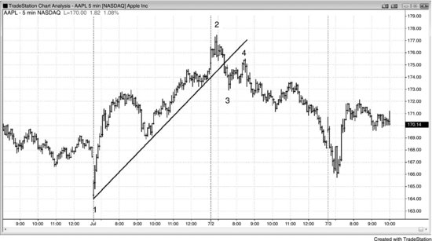

如图 24.15 所示，这张苹果（AAPL）5 分钟图上最好的建仓形态是 Bar 4 的 LH 主要趋势反转（MTR）和突破回测——出现在市场急速下跌至 Bar 3 之后。激进的交易员可以在始于 Bar 1 的多头急速中任意一根多头趋势K线处买入，但由于保护性止损距离较远，仓位必须相应缩小。

当市场经历急速与通道走势后跌破陡峭的通道，交易员通常会寻找 LH 做空机会。下跌到 Bar 3 的动能很强，大幅跌破了多头趋势线。交易员判断 Always-in 方向已经翻转为做空，因此在寻找 LH 卖出信号。两段式反弹到 Bar 4 形成 LH，是对 Bar 2 两K线反转下方突破的回测，这是一个低风险的卖出信号，至少会有第二段下跌，也可能演变为趋势反转。

**图 24.16** AMZN 中的最佳交易

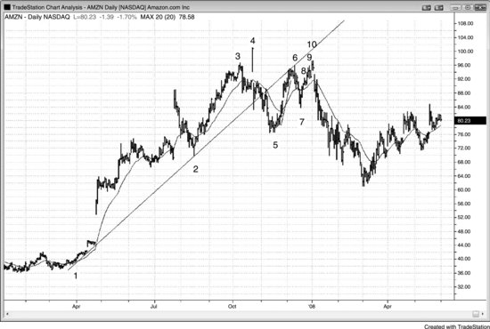

如图 24.16 所示，这张亚马逊（AMZN）日线图上最好的建仓形态是 Bar 10 的两段式 LH 主要趋势反转（MTR），它还有若干其他支撑性特征，会在后面几段中说明。其他不错的交易包括：Bar 2 处的楔形牛旗、均线缺口K线和双底牛旗，以及 Bar 3 的最终旗形和楔形顶部。有些交易员把第一波上涨视为多头趋势在 Bar 2 抛售之前的高点；另一些交易员则认为那是第二波上涨，6 月高点才是第一波。

当市场强力跌破多头趋势线之后，交易员会寻找 LH 做空机会。AMZN 日线图在 Bar 10 处出现了两段式回调形成的 LH。有些交易员认为它与 Bar 3 或 Bar 4 的高点构成双顶，当然也与 Bar 6 的高点构成双顶。它与 Bar 6 形成了双顶熊旗，因此是一个二次入场的做空信号。Bar 6 是第一次入场，但上涨到 Bar 6 的动能太强，不太可能就此开启空头趋势。还有些交易员忽略 Bar 4（视为异常值），把上涨到 Bar 10 的走势看作大型楔形顶部的变体：Bar 2 前的高点是第一推，Bar 3 是第二推，Bar 10 是第三推。

Bar 7 跌破了一条较小的多头趋势线，显示出更强的空头力量，随后反弹到 Bar 10 再次测试 Bar 3 和 Bar 4 的高点。

Bar 10 是自 Bar 7 急涨以来的三次推高，这种形态必须视为一种楔形反转。这是交易员能找到的最理想的二次入场做空信号：一个双顶熊旗，由小楔形构成，出现在两段式反弹测试趋势高点（Bar 4）的过程中，且发生在主要趋势线被突破（跌至 Bar 5）之后——恰好在交易员正积极寻找低风险做空建仓形态的时候。

**图 24.17** GS 日线图上的最佳交易

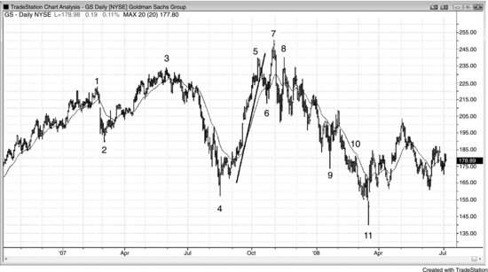

如图 24.17 所示，这张高盛集团（GS）日线图上最好的建仓形态包括：Bar 3 的 HH 主要趋势反转（MTR）和小楔形顶部；Bar 4 卖出高潮之后的 HL 和小双底牛旗；Bar 7 的 HH（高于 Bar 5 和 Bar 3）、最终旗形和扩张三角形顶部（它是大型扩张三角形的二次入场点，其中 Bar 1 是第一推、Bar 3 是第二推；同时也是小型扩张三角形的第一次入场，其中 Bar 5 前的暂停是第一推、Bar 5 是第二推）；Bar 8 的 LH；Bar 9 之后的低 2 和楔形熊旗；Bar 10 在均线附近的低 2；以及 Bar 11 的岛形底部和扩张三角形牛旗（Bar 2 是第一次下推、Bar 4 是第二次——要记住，扩张三角形牛旗经常跟在扩张三角形顶部之后出现）。

一轮强反弹既可以是多头趋势的一部分，也可能只是受真空效应推动、测试交易区间顶部的走势。空头预期市场会涨过K线 3 的高点，所以一直等到价格到达那里才做空。从K线 4 开始一路上涨的过程中，他们始终看空，但在价格突破K线 3 高点之前做空并不划算。既然他们认为市场还会涨，那在价格到达一个他们认为涨不动的位置——即新高——之前就做空，是不明智的。他们注意到之前反弹到K线 3 时，价格涨过K线 1 高点后便出现了抛售，这一次他们预期同样的情况会再次发生。由于这是第三次上推，他们做空的位置可能正是一段持续较久的下跌的起点，这段下跌至少应该有两条腿。因为这是一个扩展三角形顶部（K线 1、2、3、4 和 7），一个合理的目标是跌破K线 4，之后市场可能形成一个扩展三角形牛旗。

K线 11 是扩展三角形牛旗中的做多信号。这笔交易虽然合理，但强度不如本章讨论的其他反转。

**图 24.18** MSFT 的最佳交易

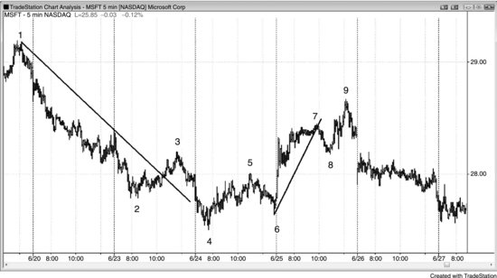

如图 24.18 所示，这张微软（MSFT）5 分钟图上的最佳建仓形态包括：

- K线 3 的楔形熊旗
- K线 4 的 LL 主要趋势反转（MTR）和小型楔形底
- K线 5 的大小两个低 2
- K线 6 的 HL 主要趋势反转（MTR）、楔形牛旗和双底牛旗
- K线 9 的两段式 HH 主要趋势反转（MTR）、小型急速与通道顶部，以及楔形熊旗（K线 3、7 和 9）

虽然反弹到K线 3 时大幅突破了空头趋势线，但随后下跌到K线 4 时已远远跌破K线 2，因此交易员需要先看到一个 HL，才能考虑趋势反转的可能。K线 6 就是那个 HL，同时也是一个两K线反转，敏锐的交易员在第二天第一根K线向上突破这个两K线反转时就入场做多了。

反弹到K线 9 是一个两段式 HH，出现在下跌到K线 8 跌破多头趋势线之后。从K线 4 的低点算起，这也是三次上推，K线 5 和K线 7 分别是前两次。有些交易员把这段反弹看作一个大的楔形熊旗，其中K线 3 结束第一推，K线 7 是第二推。

**图 24.19** ORCL 的最佳交易

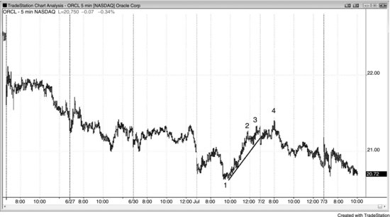

如图 24.19 所示，这张甲骨文（ORCL）5 分钟图上的最佳建仓形态包括：

- K线 1 的 LL 主要趋势反转（MTR）（从前一个低点的反弹突破了一条陡峭的空头趋势线）
- K线 4 的两段式 HH 主要趋势反转（MTR）和小型楔形顶

一轮急涨冲向交易区间顶部，通常是买入真空效应造成的，而不是新趋势的开始。市场具有惯性，当它处于交易区间内时，大多数突破尝试都会失败。空头预期价格会测试甲骨文 5 分钟图上过去几天交易区间的顶部，所以在市场到达那个区域之前没有理由做空。这使得反弹到K线 2 的过程中市场呈现单边上涨态势，但一旦价格抵达交易区间顶部，空头便仿佛凭空出现。此时他们不相信市场在不回调的情况下还能涨多高，于是持续做空。三次上推到K线 4 的反弹，是一个很好的在两K线反转下方做空的建仓形态。

**图 24.20** Emini 开盘反转

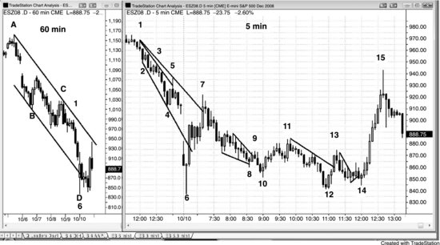

图 24.20 右侧 Emini 5 分钟图上的最佳建仓形态包括：

- K线 6 的开盘反转
- K线 7 的最终旗形顶部和楔形顶（K线 6 前面那根K线的高点是第一腿上推，尽管它是一根空头K线）
- K线 8 的楔形牛旗和 HL
- K线 10 的突破回调（来自K线 9 突破空头微型通道）
- K线 11 的低 2 和双顶（与下跌到K线 8 那段楔形的顶部形成双顶）
- K线 12 的大型两段式（K线 10 是第一推下跌）HL 主要趋势反转（MTR）（K线 12 同时从下跌到K线 10 的小型空头趋势和终止于K线 6 的大型空头趋势中反转向上）
- K线 14 的 HL 主要趋势反转（MTR）和二次入场突破回调买入信号（它也是头肩底的右肩，K线 10 是左肩）

尽管大多数学者和电视评论员都认为大盘的所有走势都是由个股基本面综合决定的，但政治因素往往会制造巨大的行情。一个明显的例子是 1994 年共和党掌控国会后出现的那轮惊人的多头市场，人们常称之为克林顿超级大牛市。2008 年的崩盘是另一个例子——那轮空头趋势和恐慌性抛售，到底是次贷危机引发的，还是市场意识到奥巴马即将入主白宫的直接结果？虽然做交易必须依据图表所展示的信息，但无论你的政治立场如何，尝试理解政治对市场的影响，在知识层面都是很有趣的。

多么完美的一天！看右侧的5分钟图，形态上只是一个普通的HL空头趋势反转，并不起眼，但从图表右侧的价格刻度就能看出，有些K线超过30个点高，而正常日子里K线的平均波幅大概只有2个点左右。当时正值2008年股灾期间，道琼斯工业平均指数本周已经下跌20%，市场试图至少构筑一个临时底部。在那之前的一年多里，我一直跟朋友说道指会在2008年跌破10000点，因为市场看起来可能已经进入了一个跨年级别的交易区间。我们可能已经筑顶，抛售可能导致价格进一步大幅下跌，但交易区间是更常见、因而也更可能（60%+）的结果。

虽然道指今天的波幅高达1000点，但对价格行为交易员来说，这不过是再普通不过的一天。我把仓位缩减到正常的20%，因为每笔Emini交易要承受大约10个点的风险，但一天下来，利润仍然比平时多。

今天是周五，道指这一周每天都下跌200到700点，所以出现反转的可能性很大（60%+）。不过你得保持耐心，寻找标准的价格行为建仓形态。

左边是60分钟图，K线D（也就是右边5分钟图上的K线6）跌穿了K线A和K线C构建的趋势通道线（对应5分钟图上的K线1），随后反转上涨。

在5分钟图上，市场跌破K线2到K线4的趋势通道线之后，K线6形成了一根巨大的十字星。十字星算不上好的信号K线，但市场同时在5分钟和60分钟图上都出现了趋势通道线过冲反转，而且道指已经下跌700点，因此出现一波可交易的反弹是很可能（60%+）的。

K线7突破了空头趋势线，但形成了最终旗形顶部和两腿上涨，所以很可能（60%+）会出现回调。不过，从K线6低点起来的上涨非常猛烈，因此在测试空头趋势低点之后，很可能（60%+）还会有第二腿上涨。明智的做法是耐心等待一个HL出现（上涨动能那么强，出现LL的可能性不大（≤40%））。

K线10是一个潜在的底部，因为它是K线9突破楔形后的一个LL突破回调。不过，从K线7下来的走势持续了一个多小时，而且回撤很深，所以在最终底部确立之前，很可能（60%+）还要再来一腿下跌。

上涨到K线11的这一波突破了另一条空头趋势线，说明多头正在积蓄力量。

K线12相对于K线10是一个LL，因此可能是当天的一个HL，但下跌到K线12的动能太强，所以很可能（60%+）还会有一次测试。

上涨到K线13的这一腿出现了好几根多头趋势K线，并突破了另一条多头趋势线。

K线14是一根明显的多头反转K线，同时也是微型趋势线回调，相对于K线12又是一个HL，所以这里有可能是最终低点——事实也正是如此。这使得K线12成为K线6之后第一个有力的HL，是对那个空头低点的一次极佳测试。这就是当天最核心的交易机会，也是K线7那波强劲上涨之后，你一整天都应该耐心等待的那笔交易。今天还有很多其他交易机会，但这一笔最容易提前预判，而且走势非常完美。5分钟和60分钟图上都出现了趋势通道线过冲，K线7的大幅上涨让HL成为大概率事件，随后两段式回调到K线12形成了一个可能的60分钟级别HL，接着K线14在5分钟图上的HL确认了K线12的HL。做这笔交易并不需要60分钟图，我实际上也没用。之所以把它列出来，是为了说明更高时间周期的力量同样在发挥作用，从成交量也能清楚看出机构在关注这些形态。

K线15在创出当天新高后反转下跌。

K线10处的两K线反转向上反弹，约有60%的概率拿到波段利润，对所有交易员来说都是绝佳的建仓形态，包括新手在内。K线4是空头趋势中的缺口K线，这种情况经常会先回测空头低点（当时是K线2），然后展开一波反弹，最低目标大约是十根K线、两段式回调。下跌到K线6的空头急速走势太猛，交易员不敢在那里买入。K线8是一个合理的买点，原因有以下几个：

- 它是跌破K线2之后的第二次反转尝试
- 它构成一个扩展三角形底部（当天第三根K线是第一次下推，K线2是第二次）
- 它是K线7熊旗之后的最终旗形反转
- K线8本身是一根强多头反转K线

扩展三角形底部始终是主要趋势反转（MTR）的建仓形态。不过，由于K线4之后的上涨和到K线6的下跌幅度都很大，多数交易员不会称之为主要趋势反转，而是用其他方式来描述（尽管在15分钟图上，这几乎肯定是一个非常漂亮的主要趋势反转形态）。K线10是已经走强的形态中的二次入场点。交易员在K线10高点上方买入——K线10是两K线反转中的第二根——初始保护性止损放在其低点下方。当市场涨到风险的2倍时，他们会部分或全部止盈，剩余仓位继续持有做波段，跟踪止损放在最近的更高低点下方。有些人会在K线19的双顶（与K线4构成双顶）和楔形（K线12、14、19，以及K线14、16、19）处出场，另一些人则继续持有，止损放在K线17下方。

**图 24.21** 国债最终旗形

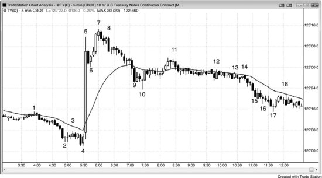

如图24.21所示，这张5分钟10年期美国国债期货图上最好的建仓形态包括：K线4、7、10处的最终旗形反转，K线3处的小型低点2，K线6处的高点1，以及K线11处的楔形熊旗二次入场点。

最终旗形经常提供高概率的反转交易机会。

K线4是一个两K线反转，出现在一个水平熊旗之后，而那个熊旗中只有一根空头实体K线。熊旗中出现多头实体K线，是买压的信号。

虽然巨大的K线5多头趋势K线带有高潮性质，但在如此强劲的动量之后，K线6的高点1仍然是一个合理的建仓形态，至少可以做一笔剥头皮多单。同时，那些在空头内包K线下方做空的空头被套住了，他们会在K线6上方回补。

K线7是两K线反转中的第一根，第二根是一根强空头趋势K线。反转发生在K线5高点正上方，说明多头显然急于止盈，而空头只是在等市场涨过K线5高点再做空。这是一个很好的最终旗形做空建仓形态，尤其是K线7前面那根也是一根大的多头趋势K线，因此构成了第二次买入高潮。连续的买入高潮之后，通常至少会出现两段式回调。

K线10是一根相对较大的十字星反转K线，也是ii最终旗形突破后向上反转的信号K线（ii形态经常演变为最终旗形）。它同时也是一个楔形牛旗，其中K线6是第一次下推，K线9是第二次。

K线11是水平最终牛旗向下反转的第二次信号，这个牛旗出现在K线10之后的小幅急速上涨后面。它同时也是一个楔形熊旗，其中K线9之后的多头内包K线是第一次上推，K线10之后的反弹是第二次。此外，它还是强趋势下跌到K线10之后的均线缺口K线做空机会。

K线12和K线13都是两K线反转向上的建仓形态，但均未触发，市场始终没有交易到信号K线上方。有些交易员把K线12看作一个最终旗形做多的建仓形态，认为K线12之前的窄幅交易区间是这波从K线12开始的下跌中潜在的最终旗形。

**图 24.22** Emini 双向交易中的最佳交易

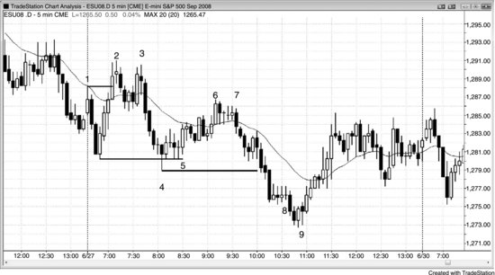

如图24.22所示，这张5分钟Emini图上最好的建仓形态包括：K线1之后第三根K线处从前一天低点向上的两K线反转，K线3处的双顶，K线7处的楔形熊旗，以及K线9处趋势性交易区间日和阶梯形态中的小型最终旗形向上反转。

当一天不是趋势日时，它就是交易区间日，或者至少会出现大量双向交易。

K线2突破了开盘高点，所以聪明的交易者会等待二次入场点做空，这个机会在K线3的双顶处出现了。一天中的第一波波段经常以双顶或双底起步。当时的振幅大约是平均日振幅的一半，所以这天很可能会突破，演变成一个向上或向下的趋势性交易区间日，之后再回调测试初始区间的突破。

K线4的空头急速走势把当天转变为 Always-in 做空日，交易员开始寻找在反弹时做空的机会，预期市场会向下突破，随后走出大致等幅的测量移动。K线6之前的多头通道是一个三推上涨，K线之间重叠很多，中间还穿插了几次小型反转尝试，力度远不及K线4之前的那段抛售。一旦交易员判定这段上涨不会形成强势的多头突破通道，就会认定它是一个熊旗，后面会延续空头趋势。K线6差一个 tick 就打到K线3下方的盈亏平衡点止损，这说明空头非常强——他们在K线6处积极加仓做空，成功守住了自己的止损位。

激进的交易员会在K线6的两K线反转之后出现的十字星处或上方挂限价单做空。他们把这看作一个弱势的高1买入建仓形态，很可能失败（概率60%以上）。

K线9是一根强多头反转K线，但由于它与前一根K线重叠很大，实际上起到了两K线反转的作用。它的高点刚好与前一根K线的高点齐平，所以不管把它看成两K线反转还是多头反转K线，结论都一样。无论怎么看，它都是趋势性交易区间日中的一个强反转建仓形态，位置正好处于测量移动目标下方的区域，又紧跟着K线8的最终旗形，同时也是当天的第三次下推。这些因素叠加在一起，让交易员相信市场至少会走出两段式反弹来测试K线4的低点。在K线9向上突破那根多头反转K线之前买入，大约有60%的概率做成一笔盈利的波段交易，因此对所有交易员来说都是一个强建仓形态，新手也适合操作。那根多头反转K线是低2最终旗形向上反转的强信号K线（最终旗形在K线8下方触发），同时也是大型抛物线楔形底部的信号K线（第一次下推在K线1之后第三根K线处结束，第二次下推在K线4处结束）。虽然K线9是一根空头K线，但它并未触及多头信号K线下方的保护性止损。还有些交易员在K线9上方买入，因为K线9与那根多头信号K线构成了微型双底，提供了一个二次入场的买入信号。根据微型双底的高度来计算，至少可以走出等幅的测量移动（大约是多头K线底部到K线9顶部这段距离的两倍），而且底部形态较大，很可能涨幅更大（概率60%以上）——至少持续10根K线、走出两段上涨。

注意这里出现了好几次小型反转，而且大多数反转都源自双顶、双底、微型双顶、微型双底和最终旗形，情况一直如此。很多交易员不会做反转交易，除非看到其中至少一种形态。

**图 24.23** Emini 无明确趋势时的几个最佳交易

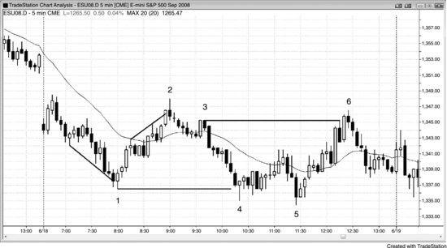

如图 24.23 所示，这张5分钟 Emini 图上的最佳交易包括：K线1是缺口急速与通道底部之后的两K线反转；K线2是在当日新高以及急速与通道顶部处的反转；K线3是微型通道的失败突破（低1）；K线5是当天第三次下推，价格创出更低的低点，在最终旗形突破后于交易区间底部形成向上反转；K线6是双顶、急速与通道顶部、低4，同时位于交易区间的顶部。

在非明确趋势日，交易员应该在价格创出新极值时押注突破失败，尤其关注二次入场点和楔形。

K线1是楔形反转，伴随一根强反转K线。

K线2是楔形顶部、双顶，同时也是第二次均线缺口K线做空建仓形态。

K线3是突破回测的信号K线，价格打到了K线2下方做空者的盈亏平衡点止损位。

K线4是一根处于急速下跌中的十字星。因为它可能只是形成一两根K线的熊旗，交易员选择等待二次入场点再买入。激进的交易员会在K线4后面那根K线的低点处或下方挂限价单买入，预期市场会出现第二段上涨的尝试。他们把这看作一个弱势的低1做空建仓形态，很可能失败（概率60%以上）。

K线5是在第二次尝试突破低1下方新低失败后形成的向上反转。作为信号K线的内包K线收了阳线。

K线6是一个低4做空，价格在向上突破K线3的波段高点之后发生了反转。

**图 24.24** 胜率50%时，回报必须是风险的两倍

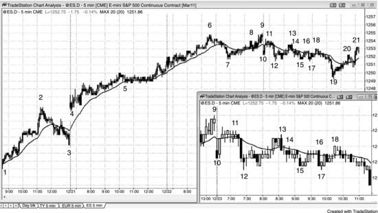

虽然在交易区间中部做空的成功概率可能只有 50% 左右，但只要回报是风险的 2 倍，它仍然可以算作一笔最佳交易。如图 24.24 所示，5 分钟 Emini 之前走了好几周的强多头趋势，在 K线 7 处出现了一根均线缺口K线。这种形态经常引发对多头高点的最后一次测试，随后进入更深的回调——至少包含两段下跌。K线 10 处出现小型向下跳空缺口之后，市场立刻反弹到均线稍上方。空头期待第二段下跌，但不确定 K线 10 那根K线的跌幅是否足以构成第一段。当某一段走势不够清晰时，通常不会有足够多的交易员相信它能延续，因此也不会有足够多的人去下注，结果就是在走势变得更明确之前，不会出现跟随。两段下跌到 K线 12 之后，市场走出两段反弹到 K线 13，一些交易员将其视为小型楔形熊旗，另一些人将其视为头肩顶的右肩——K线 6 是左肩，还有人将其视为与 K线 11 构成的双顶熊旗。K线 13 的高点低于 K线 9 的高点，也低于 K线 11 附近的高点，它有可能是更大级别第二段下跌的起点。

在 K线 11 下方做空，位置处于两天交易区间的中部，等距离运动的方向性概率大约是 50%。也就是说，市场有约 50% 的概率先涨 1 点再跌 1 点，也有约 50% 的概率先跌 1 点再涨 1 点，2 点、3 点、4 点的情况同样如此。一般来说，当市场处于交易区间、且已经连涨了 5 到 10 根K线时，交易员应该只找做空机会。K线 11 是自开盘低点以来的第 8 根K线，它之后的那根K线是市场第三次跌破前一根K线低点。交易员可以在这里做空，甚至在第一次或第二次下探时就做空，期望有足够多的交易员把这里视为潜在的更低高点，从而引发更多抛压。但由于信号不够有说服力，下跌直到 K线 13 形成更清晰的更低高点之后才真正启动。

那么，为什么在 K线 11 附近做空算是最佳交易？成功概率只有 50%，而且还处在多头趋势的交易区间中部。别忘了交易者方程有三个变量，除了概率之外，还要考虑回报和风险。过去一个月左右，Emini 的日均波幅超过 10 点，但今天的波幅只有 2 点，而过去几年里日波幅低于 5 到 6 点的交易日屈指可数，因此今天的波幅在收盘前翻倍甚至翻 3 倍的概率很高。问题在于，交易员不知道突破方向是向上还是向下，还是先向一方再向另一方。既然市场在交易区间里已经连涨了 8 根K线，短期内向下运动的概率更大。交易员可以直接做空，保护性止损设在 K线 11 信号K线上方，同时在入场价下方 4 点处挂一个 OCO 限价止盈单，然后耐心等待。由于不确定性很大，只有在愿意承受回调——这在交易区间中不可避免——的前提下，才应该做这笔交易。实际风险只有 4 个 tick，相当于冒 4 个 tick 的风险去赚 16 个 tick，成功概率大约 50%。即便当时看起来不像，这仍然是一笔非常好的交易。

一旦出现一根大的空头突破K线，紧接着在 K线 12 处又有立刻的跟随，对大多数交易员来说市场就转为 Always-in 做空了。他们会假设市场继续保持这个方向，除非出现 Always-in 做多信号，或者价格涨回到 K线 11 之后那根小空头K线所开启的空头尖峰顶部之上。K线 13 恰好测试到了那根K线的高点——一个 tick 都不差——随后市场一路跌到 K线 19。K线 19 的低点比 K线 11 信号K线低 17 个 tick，而且 K线 19 带有多头实体，这可能构成一个 17 tick 的失败——意味着很多空头在信号K线下方 16 个 tick 处止盈了空单，而不是等到下方 17 个 tick。他们差 1 个 tick 就到整 4 点，说明空头力量在减弱。市场触及了空头 4 个 tick 利润的限价出场单后，这根K线变成了一根多头反转K线。大多数空头会在 K线 19 这根多头反转K线上方出场，因为出现了 17 tick 的失败，拿到 11 个 tick 的利润就走，而不是指望市场重新跌回去给他们原计划的 16 个 tick。

这一周是圣诞节前一周，假期前后日均波幅通常偏小。过去几周有好几天的波幅不到 7 点。再加上初始风险只有 4 个 tick，而不是通常的 7 到 8 个 tick，很多交易员认为风险更小、近期平均波幅也更小，意味着赚到 4 点的机会可能也更小。这些交易员押注 17 tick 的失败，将限价止盈单设在入场价下方 15 个 tick，而不是 16 个 tick。每当一段走势有更大概率走不到位时，很多交易员就会把限价单比平时少设 1 个 tick，因为他们知道市场经常会碰到那个明显的目标价位，但随后就反转了，并不会触及止盈限价单。还有些交易员选择将止盈限价单设在入场价下方 3 点处，他们显然会拿到自己的 3 点利润。
