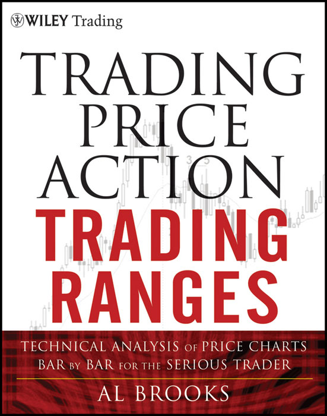
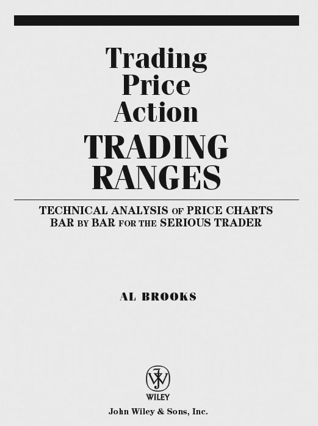

## 目录

- 封面
- 丛书介绍
- 书名页
- 版权信息
- 致献
- 致谢
- 本书术语表
- 前言
  - 怎么读这套书
  - 强势信号：趋势、突破、反转K线与反转
  - K线计数基础：高 1、高 2、低 1、低 2
- [第一部分：突破——向新趋势的转换](#part-i)
- [第1章：突破交易实例](#chapter-01)
- [第2章：突破中的强势信号](#chapter-02)
- [第3章：初始突破](#chapter-03)
- [第4章：在既有强趋势中的突破入场](#chapter-04)
- [第5章：失败突破、突破回调与突破回测](#chapter-05)
- [第6章：缺口](#chapter-06)
- [第二部分：磁吸——支撑与阻力](#part-ii)
- [第7章：基于第一腿（急速阶段）幅度的测量移动](#chapter-07)
- [第8章：基于缺口和交易区间的测量移动](#chapter-08)
- [第9章：反转常常终止于此前失败反转的信号K线处](#chapter-09)
- [第10章：其他磁吸目标](#chapter-10)
- [第三部分：回调——趋势转化为交易区间](#part-iii)
- [第11章：首次回调序列：K线、次要趋势线、均线、均线缺口、主要趋势线](#chapter-11)
- [第12章：双顶熊旗与双底牛旗](#chapter-12)
- [第13章：20根缺口K线](#chapter-13)
- [第14章：首次均线缺口K线](#chapter-14)
- [第15章：一天中引发突破和反转的关键时间节点](#chapter-15)
- [第16章：趋势和交易区间的腿数计算](#chapter-16)
- [第17章：K线计数：高/低 1、2、3、4 形态与 ABC 回调](#chapter-17)
- [第18章：楔形及其他三连推回调](#chapter-18)
- [第19章：对抗线：楔形回调至趋势线](#chapter-19)
- [第20章："反转"形态：双顶与双底、头肩顶与头肩底](#chapter-20)
- [第四部分：交易区间](#part-iv)
- [第21章：交易区间交易实例](#chapter-21)
- [第22章：窄交易区间](#chapter-22)
- [第23章：三角形](#chapter-23)
- [第五部分：订单与交易管理](#part-v)
- [第24章：剥头皮、波段交易、交易与投资](#chapter-24)
- [第25章：交易数学——要不要做这笔交易？做了能赚钱吗？](#chapter-25)
  - 交易者方程
  - 方向概率
- [第26章：入场需要两个理由](#chapter-26)
- [第27章：用突破单入场](#chapter-27)
- [第28章：用限价单入场](#chapter-28)
- [第29章：保护性止损与跟踪止损](#chapter-29)
- [第30章：止盈与目标价位](#chapter-30)
- [第31章：分批建仓与分批平仓](#chapter-31)
- [第32章：被套的交易——被套在场内或场外](#chapter-32)
- 关于作者
- 关于配套网站
- 索引

## 丛书介绍

John Wiley & Sons 创立于 1807 年，是美国历史最悠久的独立出版公司。公司在北美、欧洲、澳大利亚和亚洲均设有办事处，致力于面向全球客户开发和推广印刷及电子产品与服务，涵盖专业知识和个人发展两大领域。

Wiley Trading 丛书汇集了在市场不断变化中存活下来并取得成功的交易员著作——他们有的靠重新发明交易系统，有的靠回归基本功。无论你是新手交易员、专业交易员，还是介于两者之间，这些书都能提供实用的建议和策略，帮助你在当下和未来持续盈利。

更多丛书信息请访问 [www.WileyFinance.com](http://www.WileyFinance.com)。

## 书名页

## 版权信息

版权所有 © 2012 Al Brooks。保留所有权利。

本书第一版名为 *Reading Price Charts Bar by Bar: The Technical Analysis of Price Action for the Serious Trader*，于 2009 年出版。

由 John Wiley & Sons, Inc. 出版，地址：美国新泽西州霍博肯。同步在加拿大发行。

所有图表均使用 TradeStation 制作。© TradeStation Technologies, Inc. 保留所有权利。

除非符合 1976 年美国版权法第 107 条或第 108 条的规定，否则未经出版方事先书面许可，不得以任何形式复制、存储或传播本出版物的任何部分，包括电子、机械、影印、录制、扫描或其他方式。也可通过向 Copyright Clearance Center, Inc.（地址：222 Rosewood Drive, Danvers, MA 01923，电话 (978) 750-8400，传真 (978) 646-8600，网址 [www.copyright.com](http://www.copyright.com)）支付相应费用获得授权。如需向出版方申请许可，请联系 Permissions Department, John Wiley & Sons, Inc., 111 River Street, Hoboken, NJ 07030，电话 (201) 748-6011，传真 (201) 748-6008，或访问 [http://www.wiley.com/go/permissions](http://www.wiley.com/go/permissions)。

免责声明：出版方和作者已尽最大努力编写本书，但不对书中内容的准确性和完整性作任何明示或暗示担保，亦不对适销性或特定用途的适用性作任何默示担保。销售代表或书面销售材料均不得创设或扩展任何担保。书中的建议和策略未必适合你的具体情况，建议酌情咨询专业人士。对于任何利润损失或其他商业损害——包括但不限于特殊、附带、间接或其他损害——出版方和作者不承担任何责任。

如需了解其他产品和服务，或获取技术支持，请联系美国客户服务部：(800) 762-2974；美国境外请拨打 (317) 572-3993 或传真 (317) 572-4002。

Wiley 也以多种电子格式出版书籍，部分印刷版内容可能在电子版中不可用。更多 Wiley 产品信息请访问 [www.wiley.com](http://www.wiley.com)。

***国会图书馆编目出版数据：***

Brooks, Al, 1952--
Trading price action trading ranges : technical analysis of price charts bar by bar for the serious trader / Al Brooks.
p. cm. -- (The Wiley trading series)
"The first edition of this book titled, Reading price charts bar by bar : the technical analysis of price action for the serious trader, was published in 2009"--T.p. verso.
Includes index.
ISBN 978-1-118-06667-6 (cloth); ISBN 978-1-118-17231-5 (ebk);
ISBN 978-1-118-17232-2 (ebk); ISBN 978-1-118-17233-9 (ebk)
1. Stocks--Prices--Charts, diagrams, etc. I. Brooks, Al, 1952-- Reading price charts bar by bar. II. Title.
HG4638.B757 2012
332.63′2042--dc23
2011029299

## 致献

谨将本书献给我的女儿 Skylar Brooks——她温柔、善良、细腻，才华出众，充满信任，始终怀抱希望。她希望这个世界变得更好，而且比我们任何人都更努力地去实现这个愿望。

## 致谢

我最主要的目标是写出一套全面系统的价格行为著作。读者对我上一本书《Reading Price Charts Bar by Bar》最大的意见是太难读了。我非常感谢所有提供过建设性反馈的读者，以及参加我每日实盘网络研讨会的交易员们。他们的许多意见非常有洞察力，我都吸收到了这一版中。同样要感谢所有参加过我实盘交易室的交易员，因为他们给了我反复讲解的机会，让我得以更清楚地表达自己看到了什么、在做什么。他们提出的很多问题帮我找到了更好的表述方式，这些内容都写进了这套书里。

特别感谢 Victor Brancale，他花了大量时间校对手稿，提供了数百条极有价值的修改建议；感谢 Robert Gjerde，他搭建并管理了我的网站，也对聊天室和网站给出了坦率的反馈。最后要感谢 *Futures* 杂志的集团编辑总监 Ginger Szala，她一直给我提供发表文章和参加网络研讨会的机会，也经常提出很好的建议，帮助我更深入地融入交易社区。

## 本书术语表

以下所有术语都是从实用交易的角度来定义的，而不是技术分析师常用的那种理论化定义。

我要特别感谢 Victor Brancale，他花了大量时间校对书稿，提出了数百条极有价值的修改建议；还要感谢 Robert Gjerde，他搭建并维护了我的网站，也在聊天室和网站上给了我许多坦诚的反馈。最后，感谢《Futures》杂志的集团编辑总监 Ginger Szala，她不断为我提供发表文章和参加在线研讨会的机会，在如何更深入地参与交易社区方面也给了我非常实用的建议。

## 本书术语表

以下所有术语的定义都侧重于为交易者提供实际帮助，不一定按照技术分析师惯用的理论方式来解释。
