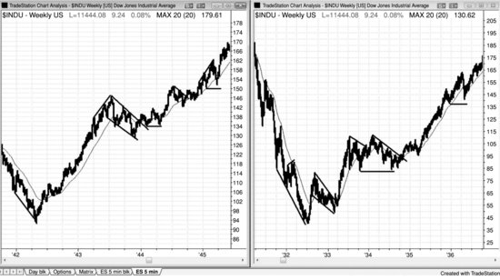
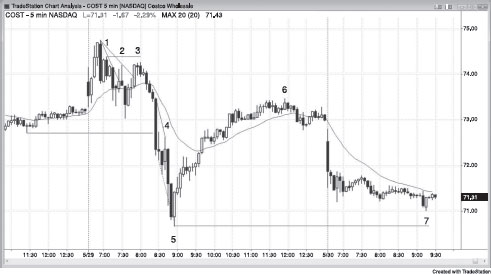
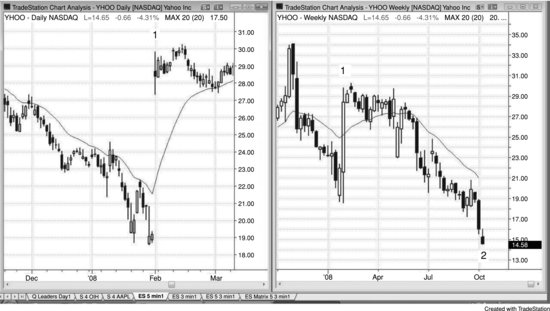

市面上几乎找不到一本交易员写的、全面系统的价格行为著作。写这样一本书得花几千个小时，而稿费跟做交易的收入比起来太少了。如今，我的三个女儿均已离家读研，写书不仅充实了我的生活，更给我带来了极大的成就感。我最初只是想修订《Reading Price Charts Bar by Bar》的第一版（John Wiley & Sons, 2009），但写着写着，就决定把自己观察市场和做交易的方法完整展开来讲。打个比方，我是在教你拉小提琴——靠这些书里的内容足以让你以交易为生，但你必须自己投入大量时间去练。在 [www.brookspriceaction.com](http://www.brookspriceaction.com) 上回答了成千上万个交易员的提问之后，我觉得自己表达思路的方式清晰了很多，这几本书应该比第一本更好读。第一本书侧重于解读价格行为，而这套书的核心是怎么用价格行为来做交易。由于篇幅扩展到第一本书的4倍多，John Wiley & Sons 决定将其拆成三本。第一本讲价格行为基础和趋势。第二本讲交易区间、订单管理和交易数学。第三本讲趋势反转、日内交易、日线图、期权，以及适用于所有时间周期的最佳建仓形态。很多图表在《Reading Price Charts Bar by Bar》中也出现过，但大部分都做了更新，讲解也基本重写了。第一本书12万字的内容里，只有大约5%保留到了这套新书的57万字中，所以读者不会觉得重复。

我写这三本书的目标，是讲清楚为什么精心筛选的交易能提供很好的盈亏比，以及怎么从这些建仓形态中获利。我希望这些内容对专业交易员和商学院学生有价值，也希望刚入门的交易员能从中找到有用的东西。每个人都会看价格图表，但多数时候只是扫一眼，带着某个具体的、有限的目的。实际上每张图表里都藏着大量可以用来盈利的信息。问题是，交易员必须花时间去搞懂每一根K线背后的含义：机构资金到底在干什么。

大型市场中90%甚至更多的交易量来自机构，也就是说，市场本质上就是机构的集合体。几乎所有机构长期来看都是盈利的，少数不赚钱的很快就被淘汰了。既然机构是盈利的，而且它们就是市场本身，那你每做一笔交易，对手方都是一个盈利的机构——这个机构集合体的一部分。每笔成交都需要一家机构愿意买、另一家愿意卖才能达成。个人交易者的小单量交易也一样，只有在机构愿意做同一方向时才能成交。如果你想在某个价位买入，市场不会到达那个价位，除非有一家或多家机构也想在那里买。你也没办法在某个价位卖出，除非有机构愿意在那里卖——因为市场只会走到有机构愿意买、同时也有机构愿意卖的价位。举个例子，Emini 现在在1,264，你持有多头仓位，保护性止损设在1,262。你的止损不会被触发，除非有机构也愿意在1,262卖出。几乎所有交易都是如此。

如果你交易200手 Emini 合约，那你就是机构级别的量了，实际上相当于一家机构，有时候能让市场动一两个 Tick。但绝大多数个人交易者根本没有能力推动市场，不管怎么乱来都不行。市场不会专门来打你的止损。市场可能会测试你保护性止损所在的价位，但那跟你的止损毫无关系——只有在一家或多家机构认为在那里卖出合理、同时另一些机构认为在那里买入有利可图时，市场才会去测试那个价位。在每一个 Tick 上，都有机构在买、也有机构在卖，它们都有经过验证的系统，靠这些交易来赚钱。你应该始终跟着大多数机构资金的方向交易，因为它们决定了市场的走向。

收盘后把当天的图表打印出来，怎么才能看出机构这一天都做了什么？答案很简单：只要市场在涨，大部分机构资金就在买入；只要市场在跌，更多资金就在卖出。随便挑一段上涨或下跌的走势，逐根K线去研究，很快就能发现大量反复出现的形态。时间一长，你就能在实盘中看到这些形态正在成形，从而让你有信心下单。有些价格行为很微妙，所以要对各种可能性保持开放。比如，有时候市场在往上走，某根K线跌破了前一根K线的低点，但趋势照样继续上涨。你应该这样理解：大资金正在前一根K线的低点甚至更低的位置买入，很多经验丰富的交易员也在做同样的事。他们买入的位置，恰恰是弱手交易员止损出场亏钱的位置，或是另一批弱手交易员以为市场要开始下跌而做空的位置。一旦你接受了这个事实——强趋势中经常出现回调，大资金是在回调中买入而不是卖出——你就能抓住一些绝好的交易机会，而这些机会以前你可能觉得完全是错的。不要想太多。市场在涨，机构就一直在买，哪怕在你觉得该止损出场的时候它们也在买。你要做的就是跟着它们的行为走，不要用太多逻辑去否认眼前正在发生的事情。看起来违反直觉没关系，重要的是市场在涨，机构在大量买入，你也应该跟着买。

机构通常被认为是聪明钱，意思是它们足够聪明，能靠交易谋生，而且每天的交易量很大。电视上说的"机构"还是指传统机构，比如共同基金、银行、券商、保险公司、养老金和对冲基金；这些公司过去占了大部分成交量，它们主要基于基本面做交易，交易方向主导着日线图和周线图上的市场走向，也主导了日内的很多大波段。直到大约十年前，大多数交易决策还是由非常聪明的交易员做出并执行的，但现在越来越多地交给计算机来完成。这些机构有程序可以即时分析经济数据，分析完立刻下单，全程不需要人工参与。另外还有一些公司用计算机程序进行大规模交易，这些程序基于价格行为的统计分析来下单。目前计算机驱动的交易占到日成交量的70%之多。

计算机非常擅长做决策，而下棋和赢 *Jeopardy!* 的难度其实比炒股还大。加里·卡斯帕罗夫多年来是全球象棋决策第一人，但1997年计算机做出了更好的决策，打败了他。肯·詹宁斯被公认为 *Jeopardy!* 史上最强选手，但2011年计算机也把他彻底击败了。计算机被广泛接受为机构交易的最佳决策工具，只是时间问题。

既然程序使用的是客观的数学分析，支撑和阻力区域应该会变得更加清晰。比如，随着越来越多的成交量基于精确的数学逻辑来交易，测量移动的预测应该会更准。同时，由于程序会在日线图上买入小幅回调，可能会出现更多持续时间较长的窄通道。不过，如果足够多的程序在同一关键位置平多或做空，抛售可能会来得更猛、更快。这些变化会很剧烈吗？可能（60%+）不会，因为在所有交易都靠人工完成的年代，同样的基本力量就已经在发挥作用了；但随着交易中越来越多的情绪因素被剔除，市场应该会在一定程度上朝着数学意义上的完美靠拢。随着这些公司对市场走势的贡献越来越大，传统机构也越来越多地使用计算机来分析和下单，"机构"这个词正变得越来越模糊。对个人交易员来说，更好的理解方式是：机构就是任何交易量大到足以对价格行为产生显著影响的实体。

买卖程序贡献了市场大部分的成交量，因此它们对每张图表的形态影响最大，也为个人交易者创造了大部分交易机会。没错，知道思科（CSCO）财报亮眼、股价上涨当然是好事——如果你是打算持仓几个月的投资者，那就跟传统机构一样买入 CSCO 就行。但如果你是日内交易者，那就忽略新闻，直接看图表。程序化交易创造的形态完全基于统计，跟基本面毫无关系，却能提供绝佳的交易机会。传统机构依据基本面下单，决定的是一只股票未来几个月的方向和大致目标位；然而那些利用统计分析做日内交易和其他短线交易的公司，越来越多地决定了价格到达目标位的路径，以及这段行情最终的高点或低点。即便在宏观层面，基本面充其量也只是大致的参考。看看 1987 年和 2009 年的崩盘就知道了——两次都出现了剧烈的抛售和反弹，但基本面在同样短的时间内并没有发生剧烈变化。两次崩盘中，市场都被拉到月线趋势线略下方，然后从那里强劲反转上涨。市场下跌的原因是人们对基本面的预期，但跌到哪里止住，是由图表决定的。

有一些大型形态在所有时间周期和所有市场中反复出现，比如趋势、交易区间、高潮和通道。也有很多可交易的小型形态，仅基于最近几根K线。这套书是一本全面的指南，帮助交易者理解图表上看到的一切，从而把握更多盈利机会，同时避开亏损交易。

我能传达的最重要的信息是：专注于最好的交易机会，避开最差的入场形态，确保你的利润目标（回报）至少等于保护性止损（风险），并且不断增加你的交易手数。我完全承认，我对每个入场形态背后原因的解释都只是个人观点，我对某笔交易为什么有效的推理可能完全是错的。但这不重要。重要的是，读懂价格行为是一种非常有效的交易方法，而我确实花了很多时间去思考为什么某些走势会以特定的方式出现。我对自己的解释感到满意，它们让我下单时更有信心；但这些解释跟我是否下单无关，所以对不对我并不在意。就像我能瞬间改变对市场方向的判断一样，如果遇到更合理的解释，或者发现自己的逻辑有漏洞，我也会立刻改变对某个形态为什么有效的看法。我提供这些观点，是因为它们看起来说得通，可能帮助读者更放心地去交易某些入场形态，也可能对思维有所启发——但做价格行为交易并不需要这些观点。

这套书非常详尽，读起来有难度，面向的是那些想尽可能深入学习图表阅读的认真交易者。不过，书中的概念对各个水平的交易者都有用。书里涵盖了 Robert D. Edwards 和 John Magee（*Technical Analysis of Stock Trends*，AMACOM，第9版，2007）等人描述的许多经典技术分析方法，但更侧重于逐根K线分析，展示如何通过每根K线提供的信息来显著提升交易的盈亏比。大多数书只在一张图表上标出三四笔交易，言下之意是图表上其他部分要么看不懂、要么没意义、要么风险太大。我认为盘中每一个 Tick 的变化都有值得学习的东西，每张图表上的好交易远不止那几个明显的机会——但要看到它们，你必须理解价格行为，不能忽略任何一根K线。我从几千台显微镜手术中学到：有些最重要的东西可能非常细小。

我逐根K线阅读图表，从每根K线中寻找它传递的所有信息。每一根都很重要。每根K线收盘时，大多数交易者都会问自己："刚才发生了什么？"面对大部分K线，他们的结论是当下没什么值得交易的，不值得费力去理解，于是选择等待更清晰、通常更大的形态出现。好像他们觉得那根K线不存在似的，或者把它当成机构程序化交易的产物，认为个人交易者没法参与。在这些时段他们觉得自己游离于市场之外，而这些时段占了一天的绝大部分。然而看看成交量就知道——他们忽略的那些K线，成交量跟他们据以下单的K线一样大。显然有大量交易正在发生，但他们不理解这怎么可能，本质上就假装这些交易不存在。这是在否认现实。市场上随时都有交易在发生，作为交易者，你有责任搞清楚为什么会发生，并找到从中赚钱的方法。理解市场在告诉你什么，这个过程极其耗时、极其困难，但它会为你打下成为成功交易者所需的基础。

大多数K线图书籍都让读者觉得必须死记硬背各种形态，但我这三本书不一样——我会讲清楚为什么某些形态能成为可靠的建仓形态。书中有些术语，技术分析师是一个用法，交易员又是另一个用法，而我完全是站在交易员的角度来写的。我相信很多交易员其实早就明白书里讲的全部内容，只不过他们描述价格行为的方式跟我不同。成功的交易员之间没什么秘密：大家都熟悉那些常见的建仓形态，很多人对同一个形态有自己的叫法。他们基本上在同一时间买卖，抓的是同样的波段，只是各自的入场理由不同。很多人凭直觉做价格行为交易，从来不觉得有必要去解释某个建仓形态为什么有效。我希望他们能从我对价格行为的理解和视角中获得一些启发，进而提升已经相当成功的交易水平。

大多数交易员的目标是找到一种与自己性格契合的方式，把交易利润最大化。我认为，缺了这种契合，长期稳定盈利几乎不可能。很多交易员都想知道自己要多久才能做到稳定盈利，也做好了在一段时间内亏钱的准备，哪怕亏上好几年。而我自己花了十年以上才学会怎么稳定盈利。每个人的处境和干扰因素不同，所花的时间自然不一样，但交易员必须逐一扫除大部分障碍，才能持续盈利。我自己就经历过几个大问题。首先是养育三个很棒的女儿——她们随时随地占据着我的心思，让我总想着作为父亲该做些什么。随着她们长大、越来越独立，这个问题才慢慢化解。接着我又花了很长时间，才接受自己性格中许多特质是真实存在且无法改变的（至少我认定自己不愿意去改）。最后还有信心问题。在很多事情上，我一直自信到近乎自负的程度，认识我的人一定会惊讶于交易这件事竟让我如此为难。但内心深处，我觉得自己恐怕永远也找不到一套既能长期稳定盈利、又让自己乐于坚持多年的方法。于是我买了各种系统，自己编写和测试了数不清的指标和系统，读了大量的书和杂志，参加了研讨会，请了私人导师，还加了聊天室。我跟那些自称做得很成功的交易员交流过，但从没见过他们的账户对账单，我怀疑其中大多数人能教但自己不会做。交易这行通常是：懂的人不说，说的人不懂。

这些经历其实帮了大忙，因为它让我把所有该避开的弯路都走了一遍。任何一个没做过交易的人看到图表，都会得出一个结论：交易肯定非常简单——这也是交易的吸引力之一。收盘之后，谁都可以回头看任何一张图表，找到很明显的入场和出场位置。但在实时行情中做到这一点，难度完全不同。人天生就想精确地买在最低点，而且不希望价格回头。一旦价格回头了，新手就会赶紧止损，怕亏得更多，结果连续止损，最后把账户做爆。用宽止损在一定程度上能解决这个问题，但很快交易员就会连续遇到几笔大额亏损，账户严重缩水，然后就不敢再用这种方法了。

你可能会担心：把这些书里的内容公开，会不会培养出一大批优秀的价格行为交易员，大家在同一时间做同一件事，导致没有足够的后续买卖盘把价格推到目标位？不会。因为机构控制着市场，它们旗下已经拥有全世界最聪明的交易员，这些人至少凭直觉就已经掌握了书中的全部内容。任何时刻，都有极其聪明的机构多头在跟极其聪明的机构空头做对手盘。既然最重要的参与者已经懂价格行为，再多一些人懂也不会打破这种平衡。所以我完全不担心写出这些内容会让价格行为失效。正因为这种平衡的存在，任何人拥有的优势都非常小，哪怕图表读得再好，只要犯一个小错就会亏钱。不懂价格行为的交易员想赚钱非常难，但光懂价格行为也不够。学会读图**之后**，交易员还要花很长时间才能学会怎么交易，而交易本身跟读图一样难。我写这几本书，就是为了帮大家更好地读图、更好地交易。如果你两样都做好了，就有资格从别人的账户里把钱赚到自己手里。

各种形态之所以反复出现，是因为高效市场本来就是这个样子——无数交易员出于上千种不同理由下单，而其中起决定作用的成交量，背后都是基于合理逻辑的交易。市场向来如此。同样的形态在全球所有市场、所有时间周期中反复出现，要在这么多层面上同时操纵价格，根本不可能。价格行为是人类行为的外在表现，有着基因层面的基础。只要人类没有进化，价格行为就大概率不会改变——正如我研究过去80年的图表所看到的那样，从来没变过。程序化交易也许在表面上让图表略有不同，但我找不到任何证据支持这一说法。如果真有影响，程序化交易反而会让图表变得更平滑，因为它不带情绪，而且极大地增加了成交量。如今大部分成交量由计算机自动完成，体量巨大，非理性和情绪化行为在市场中已经微不足道，图表因此更纯粹地反映了人类的行为倾向。

价格行为源自我们的DNA，在人类进化之前不会改变。看图I.1中的两张图表，第一反应可能觉得这不过是两张普通图表，但请注意底部的日期。这两张道琼斯工业平均指数的周线图，一张来自大萧条时期，一张来自二战时期，呈现的形态跟我们今天在所有图表上看到的一模一样——尽管如今大部分成交量都由计算机完成。

**图I.1** 价格行为不会随时间改变

假设所有人突然都成了价格行为剥头皮交易者，小级别形态也许会短暂出现一些变化，但长期来看，高效市场终将胜出，所有交易员的"投票"最终会蒸馏成标准的价格行为形态——因为无数人理性行事的结果只能如此，无法逃脱。况且，交易本身就非常难做好。虽然基于价格行为做交易是一种合理的方法，但要在实时行情中成功运用依然极其困难。不会有那么多人同时做得足够好，以至于对形态产生持久的显著影响。看看Edwards和Magee就知道了：全世界最优秀的交易员用他们的理念交易了几十年，这些理念到今天依然有效，原因同样如此——图表之所以是这个样子，是因为这就是高效市场不可改变的"指纹"：海量聪明人用各种方法和时间周期，竭尽所能地赚钱。打个比方，Tiger Woods打高尔夫毫无秘密可言，谁都可以模仿他，但能靠打高尔夫谋生的人少之又少。交易也是一样。一个交易员可以掌握几乎所有知识，但还是亏钱，因为把这些知识组合成一套持续盈利的打法实在太难了。

那么多商学院至今仍在推荐Edwards和Magee的书，原因何在？那本书本质上很简单，主要就是以趋势线、突破和回调作为交易基础。原因就是：这套方法有效，从来都有效，将来也会有效。如今几乎所有交易员都有电脑、都能看到日内数据，其中很多技术都可以用来做日内交易。而且K线图能提供更多关于谁在主导市场的信息，从而实现更及时的入场和更小的风险。Edwards和Magee关注的是整体趋势；我用的是同样的基本技术，但对图表上的每一根K线都更加仔细地分析，以提高盈亏比，同时我在日内图表上投入了大量精力。

我当时的想法是，如果一个人能把图表读得足够好，在行情即将启动且不会回头的那一刻精准入场，就能获得巨大的优势。胜率会很高，少数亏损也会很小。我决定以此为起点，结果发现根本不需要添加任何东西。事实上，任何额外的添加都只会分散注意力，降低盈利能力。这听起来太简单、太理所当然了，以至于多数人不愿意相信。

我是一个纯粹依靠Emini标普500期货日内图表上的价格行为做交易的日内交易员，我认为读懂价格行为对所有交易员来说都是一项极其宝贵的技能。新手往往打心底里觉得还需要更多东西，也许某个复杂的数学公式——只有极少数人在用的那种——就能给他们带来所需的优势。高盛那么有钱、那么精密，他们的交易员一定有超级计算机和高端软件，确保所有散户注定亏钱。于是新手开始研究各种指标，调整参数、定制指标，试图找到最合适的设置。每个指标都有管用的时候，但在我看来，这些东西只会让事情变得更模糊，而非更清晰。说到底，你甚至不用看图表，随手下一张买单，都有50%的概率是对的！

我否定指标和系统，并不是因为不了解它们的细节。这些年来，我在编写和测试指标与系统上花了超过1万个小时，这方面的经验可能(60%+)比大多数人都多。这段大量使用指标和系统的经历，是我最终成为成功交易员不可或缺的一部分。指标对很多交易员确实管用，但最大的成功来自于找到一种跟自己性格契合的方法。我和指标系统之间最大的问题是，我从来没有完全信任过它们。每遇到一个建仓形态，我都能看到需要测试的例外情况。我总想从市场里榨出每一分钱，只要发现加一点新东西就能改进系统，就永远不会满意当前的回报。你可以不断优化，但市场总是在强趋势和窄交易区间之间来回切换，而你的优化依据是最近发生过的行情，一旦市场进入新阶段，这些优化很快就会失效。我这个人控制欲太强、太偏执、太不安分、观察力太强、疑心也太重，没办法长期靠指标或自动化系统赚到钱。不过我在很多方面都算极端，大多数人并没有这些毛病。

很多交易员，尤其是新手，容易被指标吸引——或者被任何他们想依赖的更高权威吸引，比如大师、电视评论员、投资通讯——他们内心指望这些东西能保护自己，用给他们大把钞票的方式来表达认可和爱。他们希望指标能告诉自己什么时候该入场，却没意识到，绝大多数指标的基础就是简单的价格行为，而我在下单的时候，根本来不及同时处理好几个指标可能(60%+)在传达的信息。假设多头趋势中出现了一次回调，然后价格反弹创了新高，但这波反弹里有大量重叠K线、不少空头实体、几次小回调，而且K线顶部有明显的影线——任何有经验的交易员都能看出来，这是一次对趋势高点的弱势测试。如果多头趋势仍然强劲，不该出现这种走势。市场几乎可以确定正在向交易区间过渡，甚至可能(60%+)转为空头趋势。交易员根本不需要振荡指标来告诉自己这些。而且振荡指标容易让人把注意力放在找反转上，减少对价格图表本身的关注。大多数日子里，市场会出现两三次持续一个小时或更久的反转，这时振荡指标确实能派上用场。问题出在市场强趋势运行的时候。如果你太关注指标，会发现它们整天都在形成背离，你可能(60%+)会反复逆势入场，不断亏钱。等你终于接受市场处于趋势中时，当天剩下的时间已经不够把亏损补回来了。反过来，如果你只看K线图，会清楚地看到市场正处于趋势之中，不会被指标诱导去找趋势反转。最常见的成功反转，是先以强劲动力突破趋势线，然后回调测试极端价位。交易员如果过于关注背离，往往会忽视这个根本性的事实。没有事先出现逆势动力冲击并突破趋势线，仅仅因为背离就入场，是一种会亏钱的策略。先等趋势线被突破，再看旧极端价位的测试是否形成反转，还是旧趋势恢复。你不需要指标来告诉你，在那个位置出现的强反转是一个高概率交易——至少够做一次剥头皮——而且几乎肯定会伴随背离出现，那何必再加一个指标让自己的思考变得更复杂？

有些评论者建议组合使用多个时间周期、指标、波浪计数以及斐波那契回撤和延展，但真到下单的时候，他们只会在出现好的价格行为建仓形态时才动手。而且当他们看到一个好的价格行为建仓形态时，又会开始翻找指标上的背离、在不同时间周期上做均线测试、数波浪或找斐波那契建仓形态，来确认眼前已经看到的东西。说到底，他们就是价格行为交易员——只看一张图、完全依靠价格行为来交易，只不过不愿意承认罢了。把交易搞得这么复杂，肯定会错过大量交易机会，因为过度分析耗掉了太多时间，来不及下单，只能等下一个建仓形态。把简单的事情搞这么复杂，逻辑上说不通。当然，多加任何信息都有可能(60%+)帮助做出更好的决定，很多人也许确实能在决定是否入场时处理大量输入。仅仅出于简单化的教条就忽略数据，并不明智。目的是赚钱，交易员应该尽一切可能让利润最大化。我只是个人没办法在下单所需的时间内同时处理好多个指标和时间周期，我发现仔细读一张图对我来说利润高得多。另外，如果我依赖指标，就会在价格行为的解读上变得偷懒，经常忽略明摆着的东西。价格行为比任何其他信息都重要得多，如果你为了从别的东西那里获取信息而牺牲了价格行为告诉你的一部分内容，你很可能(60%+)是在做一个错误的决定。

刚开始做交易的人最头疼的一点，就是一切都太主观了。他们想找到一套确定性的规则来保证盈利，也讨厌一个形态今天管用、明天就失灵。市场非常高效，因为无数聪明人在参与一场零和博弈。一个交易员要想赚钱，就得持续比大约一半的对手更强。而大多数对手都是盈利的机构，所以交易员必须极其出色才行。哪怕只有一丁点优势浮现，很快就会被人发现，随即消失。别忘了，你的每笔交易对面都站着对手。他们用不了多久就能看穿你那套"神奇系统"，一旦看穿，就不会再给你送钱了。交易的魅力之一，恰恰在于它是一场优势极小的零和博弈——发现并抓住这些稍纵即逝的小机会，既有智力上的满足感，也有实实在在的经济回报。这件事做得到，但非常辛苦，要求你始终保持毫不松懈的纪律性。所谓纪律，就是去做你不想做的事。人天生好奇，总想尝试新东西，但最优秀的交易员能抵住这种诱惑。你必须守住自己的规则，排除情绪干扰，耐心等待，只做最好的交易。看一张收盘后打印出来的图表，这些好像都很容易做到；但在实盘中一根K线一根K线地等、有时一小时一小时地熬，难度完全不同。好不容易出现了一个绝佳的建仓形态，如果你走了神、被惰性拖住了，就会错过它，然后不得不再等更久。不过，只要你能培养出耐心和纪律，遵循一套可靠的方法，盈利空间是巨大的。

交易股票和 Emini 的赚钱方法数不胜数，但所有方法都离不开价格波动（好吧，卖空期权除外）。如果你学会读图，每天都能捕捉到大量盈利机会——不需要知道是哪家机构启动了这波行情，也不需要知道任何指标显示了什么。你不需要这些机构的软件或分析师，因为他们的操作会通过图表表现出来。你要做的就是跟着他们搭顺风车，这样就能赚到钱。价格行为会告诉你他们在干什么，让你在早期就入场，同时把止损设得很紧。

我发现，下单时考虑的东西越少，盈利反而越稳定。我只需要笔记本电脑上的一张图表，不加任何指标，只留一条 20 周期的 EMA——分析量不大，每天却能让很多好的建仓形态变得清晰可见。有些交易员可能还会看成交量，因为异常放大的成交量尖峰有时出现在空头趋势尾声附近，随后形成的一两个新波段低点往往能提供不错的做多剥头皮机会。日线图上，成交量尖峰有时也出现在跌势走过头的时候。不过，它的可靠性还不够高，不值得我为此分心。

很多交易员只在交易背离和趋势回调时才关注价格行为。事实上，大多数使用指标的交易员如果没有一根强信号K线，根本不会下单；反过来，如果背景合适，很多人即便没有背离，光凭一根强信号K线也会入场。他们希望看到一根大反转K线带着强劲的收盘价，但实际上这种情况相当少见。理解价格行为最有用的工具包括：

- 趋势线和趋势通道线
- 前期高点和低点
- 突破和失败的突破
- K线实体和影线的大小
- 当前K线与前几根K线的关系

尤其是当前K线的开盘价、最高价、最低价和收盘价与前几根K线走势的对比，能揭示很多关于后续走向的信息。图表能告诉你谁在控制市场，这一点远超大多数交易员的认知。几乎每一根K线都提供了重要线索，指示市场接下来会往哪里走。如果一个交易员把这些盘面活动一律当作噪音忽略掉，那他每天都在错过大量盈利机会。这几本书里的大部分观察都直接跟下单有关，但也有少数只是关于有趣的价格行为倾向性，可靠性不足以作为交易依据。

我个人交易 Emini、期货和股票时主要依赖K线图，但大多数信号在任何类型的图表上也看得到，很多甚至在简单的线形图上都很明显。我主要用 5 分钟K线图来说明基本原理，但也会讨论日线图和周线图。由于我也交易股票、外汇、国债期货和期权，我还会讨论价格行为如何作为这些品种交易的基础。

作为交易员，我看一切都是灰度的，脑子里时刻在想概率。如果一个形态正在形成，虽然不完美，但跟某个可靠的建仓形态比较接近，那它的走法大概率也差不多。差不多就够了。只要长得像教科书里的建仓形态，交易的展开方式通常也跟教科书里的类似。这就是交易的"艺术"部分，要在这片灰色地带做好交易，得花好几年时间。每个人都想要具体、清晰的规则或指标，想找聊天室、报告、热线电话、导师来告诉自己什么时候进场，怎么把风险降到最低、利润最大化。但长远来看，这些东西没一个管用。你必须自己为决策负责，但首先得学会怎么做决策——也就是说，你得习惯在灰蒙蒙的迷雾中操作。没有什么事情是非黑即白的。做了这么多年交易，我深刻体会到：任何事情，不管看起来多不可能，都有可能发生，也终将发生。这就像量子物理一样，每种你能想到的事件都有一个概率，那些你还没想到的事件也有概率。市场没有感情，事情为什么发生也不重要。盯着看美联储今天会不会降息纯粹是浪费时间，因为不管美联储做什么，都既可以被解读为利多，也可以被解读为利空。关键是看市场怎么走，而不是美联储怎么做。

仔细想想就会明白，交易是一个零和游戏，零和游戏里不可能存在一套持续有效的规则。如果规则真管用，所有人都会用，那就没人来做对手盘了，交易也就无法成立。指导原则很有用，但可靠的规则不可能存在。刚入行的交易员往往很难接受这一点，因为他们总想相信交易就是一个只要找到一套完美规则就能大赚的游戏。所有规则都有管用的时候，而且通常管用的次数刚好够多，多到让你误以为只要再调一调就能让它一直管用。你其实是在试图造一个"交易之神"来保护自己，但这是自欺欺人，是在给一个只有笨办法才管用的游戏找捷径。你的对手是全世界最聪明的一群人，如果你聪明到能想出一套万无一失的规则，他们也能，那所有人又回到了零和困境。不灵活就赚不到钱，因为你得跟着市场走，而市场灵活到了极点。它可以朝任何方向弯，弯的时间比大多数人能想象的都长。它也可以每隔几根K线就反复来回折腾，而且能折腾很久很久。最后，介于两者之间的一切走法它都可以走，也都会走。永远不要因此沮丧，接受这就是现实，把它当作这场游戏之美的一部分去欣赏就好。

市场会自动向不确定性靠拢。一天中的大部分时间，任何市场上下等距移动的概率都是50:50。也就是说，如果你连图表都不看，随便买一只股票，然后下一个二择一委托单（OCO），止盈限价单设在入场价上方X美分，保护性止损设在入场价下方X美分，你赢的概率大约是50%。同样，如果你不看图表、随便在任意时点卖出一只股票，然后止盈限价单设在下方X美分，保护性止损设在上方X美分，赢和输的概率也大约各占50%。当然有一个明显的例外：X相对于股价不能太大。一只50美元的股票，你不可能把X设成60美元，因为你亏60美元的概率是0%。你也不能把X设成49美元，因为亏49美元的概率同样微乎其微。但只要X处于你所在时间周期内的合理范围，这个规律基本成立。当市场处于50:50时，它就是不确定的，你没有理由对方向抱有任何倾向。这正是交易区间的标志，所以只要你觉得不确定，就假设市场处于交易区间。图表上偶尔会有一些短暂的时段，方向概率会偏高。在强趋势中，可能达到60%甚至70%，但这不会持续太久，因为市场会向不确定性和50:50的状态回归——回到多头和空头都觉得价格合理的位置。当趋势存在、方向有一定确定性时，市场也会向支撑和阻力区域靠拢，这些区域通常是某种测量移动的目标位。到了那里，不确定性总会重新出现，至少会短暂形成一段交易区间。

交易时段内千万不要看新闻。如果你想知道某条新闻意味着什么，面前的图表会告诉你。记者觉得新闻是天底下最重要的事，市场上发生的一切都必须用当天最大的新闻来解释。因为他们干的就是新闻这行，新闻自然就成了宇宙中心，也就成了金融市场一切波动的原因。2011年3月中旬股市下跌时，他们把原因归结为日本地震，却完全不在乎市场三周前就已经开始下跌了——那是一轮**买入高潮**之后的正常回落。2月底，当我在日线图上看到一轮持续的**多头趋势**之后出现了15根连续的**多头趋势K线**时，就在聊天室里告诉大家，市场很可能（60%以上的概率）会迎来一波明显的**回调**。这是一次异常强烈的**买入高潮**，是市场发出的重要信号。我根本不知道几周后会发生地震，也不需要知道。图表已经在告诉我交易员们正在做什么：他们准备退出**多头**仓位，开始**做空**。

电视上的专家同样没什么用。每次市场出现大幅波动，记者总能找到一位曾经预测对了的专家来采访——这人自信满满、口才出众，让观众觉得他有神奇的预测能力。但没人告诉你的是，这位专家上次连续10个预测可能全都错了。接着他再抛出下一个预测，不明就里的观众就会信以为真，让它影响自己的交易决策。观众可能没意识到，有些专家永远看多，有些永远看空，还有些专门语不惊人死不休，只做极端预测。记者不过是随手抓来一个跟当天新闻方向一致的人罢了——这对交易员毫无价值，反而有害，因为它会干扰你的判断，让你偏离自己的方法。这些重大预测，没有谁能持续做到60%以上的准确率。专家说得再有说服力，也不代表他真靠得住。同样聪明、同样有说服力的人可能持有完全相反的观点，只不过没被拉来采访而已。这就跟看庭审一样，你只听了辩护方的陈述。只听一方永远听起来很有道理，但永远会产生误导，可靠性很少超过50%。

机构中的**多头**和**空头**时刻都在交易，这正是市场方向始终充满不确定性的原因。即使没有突发新闻，财经频道也整天在播采访，每个记者各挑一个专家来撑场面。你得认识到，就接下来一小时左右的市场方向而言，她挑对人的概率大约只有50%。如果你决定依赖那位专家来做交易决定——他说午后市场会下跌，结果市场却一路上涨——你会去**做空**吗？你应该相信这位来自华尔街顶级公司、口若悬河的首席交易员吗？他年薪显然超过百万美元，公司不会白花这笔钱，除非他确实能持续准确地判断市场方向。实际上，他可能确实做得到，可能也是个出色的选股人，但他几乎可以肯定不是**日内交易**者。有人以为一个人既然能靠管理资金年赚15%，就意味着他能准确预测未来一两个小时的市场方向——这种想法很蠢。算笔账就明白了：如果他真有那种能力，一天赚1%赚两三次，一年就可能赚到1000%。既然他没做到，就说明他不具备这种能力。他的时间周期按月算，你的按分钟算。既然他无法靠**日内交易**赚钱，你为什么要根据一个在**日内交易**上已经被证明失败的人来做交易决定呢？他不是一个成功的日内交易员，这个简单的事实本身就说明了——他做**日内交易**会亏钱；如果他能赚钱，早就去做**日内交易**了，收入也会远超目前水平。即使你跟他一样持仓好几个月，试图复制他基金的业绩，听他的建议仍然不明智——因为他下周可能就改主意了，而你根本不会知道。入场之后的仓位管理跟入场本身同样重要。如果你跟着这位专家，希望像他一样年赚15%，就得跟上他的仓位管理，但你根本做不到，长期下来必然亏损。没错，你偶尔会做出一笔漂亮的交易，但随机买入任何一只股票也能做到。关键是这种方法在100笔交易之后是否赚钱，而不是看头一两笔。听听你平时给孩子的忠告：不要因为电视上的东西看起来光鲜亮丽、令人信服，就傻傻地以为那是真的。

前面说过，对同一条新闻，一定既有看多的专家，也有看空的专家，记者随便挑一个放进报道里就行。你真的打算让一个记者替你做交易决策？这简直是疯了！如果那个记者会做交易，她早就去当交易员了，赚的钱比当记者多几百倍。你凭什么让她影响你的判断？你这么做，要么是对自己的能力缺乏信心，要么是在找一个"父亲式的人物"来庇护你。如果你容易被记者选的专家牵着走，那就不该做这笔交易。她挑的那个专家不是你爸，既不会保护你，也不会保护你的钱。就算那个记者碰巧选了一个方向判断正确的专家，那个专家也不会陪你管理仓位，回调一来你大概率就止损出场了。

财经新闻台不是做公益的，它们是来赚钱的，所以需要尽可能多的观众来拉高广告收入。没错，它们想做到报道准确，但第一目标还是赚钱。它们很清楚，节目好看，观众才会多。所以必须请有意思的嘉宾——有人会抛出耸人听闻的预测，有人一副学者范儿让人安心，有人纯粹是长得好看；大部分嘉宾多少得有些娱乐价值。虽然有些嘉宾确实是出色的交易员，但他们帮不了你。比如，节目采访一位世界顶级的债券交易员，他通常只会笼统地谈谈未来几个月的趋势，而且往往是在建好仓好几周之后才说这些。如果你是日内交易者，这对你毫无用处，因为不管月线图上是多头趋势还是空头趋势，日内图上的上涨和下跌次数差不多一样多，每天都有做多和做空的机会。他的时间周期跟你完全不同，他的交易跟你在做的事情毫无关系。节目还经常采访华尔街大公司的图表分析师，这类人资历不错，但他的观点是基于周线图的，而观众想的是几天内就止盈。对那个分析师来说，即使市场在接下来两个月跌了10%，他推荐买入的多头趋势仍然成立。但观众早就在那之前割肉出场了，根本等不到三个月后再创新高的那一天。除非这个分析师针对的是你的具体目标和时间周期，否则他说的话对你毫无用处。当电视台改为采访一位日内交易员时，他讲的是已经做完的交易，信息来得太晚，帮不了你赚钱。等他上电视的时候，市场可能已经反向运行了。如果他上电视时还持有日内仓位，采访只有两分钟，之后他还要继续管理交易，而在直播中他不会做仓位管理。就算你跟着他进了同一笔交易，当市场转向对你不利时，或者市场朝你的方向走而你在考虑是否止盈时，他都不会在你身边帮你做决定。不管什么情况下，看电视来找交易建议——哪怕是在非常重要的报告发布之后——都是亏钱的捷径，永远不要这么做。

只看图表就够了，图表会告诉你需要知道的一切。给你送钱或从你手里拿走钱的是图表，所以它才是你做交易时唯一应该关注的东西。就算你在交易大厅里，连最好的朋友都不能信。他可能正在大量卖出橙汁看涨期权，暗地里却让经纪人在低于市价的地方买入十倍的量。他只是想制造恐慌把价格打下去，好通过代理人在更低的价位大量建仓。

朋友和同行总会给你各种建议，你大可随意忽略。不时会有交易员告诉我，他们发现了一个很好的建仓形态，想跟我聊聊。可每次我说不感兴趣，对方都会不高兴。他们马上觉得我自私、固执、封闭——在做交易这件事上，我确实如此，甚至有过之而无不及。那些能帮你赚到钱的特质，在普通人眼里往往都是缺点。为什么我不再看交易类书籍和文章，也不跟别的交易员讨论他们的想法？正如前面说的，图表已经告诉了我一切，其他信息只会分散注意力。有些人因为我的态度而不满，但我觉得部分原因在于：他们表面上是在提供帮助，实际上是想用一份"礼物"来换取我的指导。当我告诉他们我不想听任何别人的交易技巧时，他们就感到沮丧和恼火。我会说，我自己的方法都还没掌握透，大概这辈子也做不到完全精通，但我有把握——把已有的东西打磨好，赚的钱肯定比引入非价格行为方法要多得多。我会打个比方：假如 James Galway 送了一把漂亮的长笛给 Yo-Yo Ma，并坚持让 Ma 学吹长笛，理由是 Galway 靠长笛赚了很多钱，Ma 应该接受吗？当然不该。Ma 应该继续拉大提琴，这样赚的钱远比同时去学长笛要多。我不是 Galway，也不是 Ma，但道理是一样的。价格行为是我唯一想演奏的乐器，我坚信，把它练到极致所赚的钱，远超把其他成功交易员的方法拼凑进来。

图表——而非电视上的专家——会准确告诉你机构是如何解读新闻的。

以昨天为例，Costco 当季盈利增长 32%，超出分析师预期（见图 I.2）。COST 开盘跳空高开，第一根 K 线测试了缺口，随后 20 分钟内涨了超过 1 美元。接着股价慢慢回落，测试昨天的收盘价。期间出现了两次反弹突破空头趋势线的尝试，但都失败了。这形成了一个双顶（K 线 2 和 K 线 3）熊旗，或者说三顶（K 线 1、2 和 3），随后市场暴跌 3 美元，跌破前一天的低点。如果你根本不知道那份财报，你会在 K 线 2 和 K 线 3 空头趋势线突破失败时做空，还会在 K 线 4 下方加空——K 线 4 是跌破昨日低点之后的一次回撤。然后你会在 K 线 5 的大反转 K 线处反手做多，那是第二次尝试反转跌破昨日低点的走势，也是价格刺穿陡峭空头趋势通道线底部后的高潮反转。

**图 I.2** 忽略新闻

或者，你也可以因为那份利好财报在开盘时买入，然后一边看着股价暴跌一边发愁——电视分析师不是说要涨吗？结果你很可能在第二波下跌到 K 线 5 时割肉离场，亏掉 2 美元。

任何在很少几根 K 线内就走出很大幅度的趋势——也就是 K 线较大、彼此之间重叠很少的组合——最终都会出现回调。这种趋势动能极强，回调之后趋势恢复并测试趋势极值的概率很高。只要回调没有演变成反方向的新趋势、没有反超原趋势的起点，极值通常都会被突破（概率 60% 以上）。一般来说，如果回调幅度达到 75% 或更多，再回到原趋势极值的概率就会大幅降低。对于空头趋势中的回调而言，到了那个程度，交易员更应该把它当作一段新的多头趋势来对待，而不是视为旧空头趋势里的回调。K 线 6 大约回撤了 70%，之后市场在次日开盘时测试了高潮性空头低点。

市场因为某条新闻跳空高开，不代表就一定会继续涨，不管那条新闻听起来多么利好。

如图 I.3 所示，在两张雅虎（YHOO）图表（左边是日线，右边是周线）的K线 1 开盘之前，新闻报道微软有意以每股 $31 收购雅虎，市场跳空高开，几乎直接涨到那个价位。很多交易员觉得这笔收购板上钉钉——微软是全球最优秀的公司之一，想买雅虎肯定能成。不仅如此，微软手握大量现金，必要时很可能会加价。结果呢，雅虎的 CEO 说自家公司起码值每股 $40，但微软从未还价。这笔交易慢慢无疾而终，雅虎的股价也跟着一路下滑。到了 10 月，雅虎的价格比收购消息公布前低了 20%，比消息当天低了 50%，而且还在继续跌。所谓的强劲基本面和来自重量级买家的收购要约，也不过如此。对价格行为交易员来说，空头趋势中的一波大涨，大概率只是一个熊旗——除非随后出现一系列更高低点和更高高点。大涨之后也可能形成一个牛旗，再带来一波上涨，但在多头趋势得到确认之前，必须清楚：更大级别的周线趋势才是更重要的。

**图 I.3** 市场可以在利好消息中下跌

唯一靠得住的就是图表本身。如果看不懂图表在说什么，就不要交易，等看清楚了再动手。清晰的信号总会出现。一旦出现，就必须果断下单，承担风险，执行计划。不要切到 1 分钟图去收紧止损，那样只会亏钱。1 分钟图的问题在于，它用更小的K线和更小的风险诱惑你，看起来入场机会很多。但你不可能每个都做，最终只能挑挑拣拣，而这种挑选会毁掉你的账户——因为你不可避免地会选中太多烂机会。在 5 分钟图上入场时，你的交易依据是对 5 分钟图的分析，根本不知道 1 分钟图长什么样。所以必须按照 5 分钟图的止损和目标来执行，接受这样一个事实：1 分钟图上价格经常会反向运动，触发 1 分钟级别的止损。如果你盯着 1 分钟图看，注意力就没法全部放在 5 分钟图上，那些更厉害的交易员就会把你账户里的钱赚走。想要具备竞争力，就必须排除一切干扰，只关注面前这张图表的信息，相信只要做到这一点，就能赚到很多钱。这听起来不太真实，但确确实实如此，永远不要怀疑。保持简单，遵守你的简单规则就好。持续做一件简单的事其实极其困难，但在我看来，这就是最好的交易方式。最终，随着交易员对价格行为的理解越来越深，交易的压力会小很多，甚至变得相当无聊，但盈利能力会大幅提升。

虽然我从不赌博（因为赔率、风险和回报的组合对我不利，我绝不跟数学对着干），但交易和赌博之间确实有一些相似之处，在不做交易的人看来尤其如此。赌博是一种概率游戏，但我更倾向于把它限定为：赔率稍微对你不利、长期下来必然亏损的情况。为什么要这么限定？因为如果不限定，那所有投资都算赌博了——买投资型房产、买房子、创业、买蓝筹股，哪怕买国债都有运气的成分和本金全部亏损的风险（政府可能选择让美元贬值来缩小实际债务规模，那你拿回的那些美元的购买力就会比买入时低很多）。

有些交易员用简单的博弈论方法，在一笔或几笔亏损之后加大仓位（这叫马丁格尔交易法）。21 点的算牌者和交易区间交易员非常像。算牌者试图判断牌面概率什么时候偏离得太远。具体来说，他们想知道牌堆里剩下的大牌是否可能偏多。当计数显示很可能如此时，他们就根据"接下来大牌出现比例偏高"这个概率下注，从而提高赢的几率。交易区间交易员的做法类似：他们寻找市场在某个方向上走过头的时机，然后反方向入场，押注均值回归。

我曾试着在网上玩过几次不用真钱的扑克，想看看它跟交易有哪些异同。很快我就发现了一个根本无法接受的问题：运气造成的不公平让我始终焦虑不安，而我绝不希望运气在自己的成败中占据很大比重。这是赌博和交易之间的巨大差异。尽管大众常把两者混为一谈，但在我看来它们本质上截然不同。交易中，所有人拿到的"牌"都一样，游戏从一开始就是公平的，长期来看盈亏完全取决于自身的交易水平。当然，有时候操作正确也会亏钱，而且由于所有可能结果的概率分布，连续亏好几次也完全可能发生。从理论上讲，交易做得很好却连亏10次甚至100次以上，这种概率确实存在，只是极其微小；而据我记忆，从没见过连续4个好信号全部失败的情况，所以这个概率我愿意承受。只要交易做得好，长期一定能赚到钱，因为这是一个零和游戏（扣除佣金——如果选对了券商，佣金应该很低）。只要你比大多数交易员强，就能赢走他们的钱。

有两类赌博跟纯粹的碰运气不同，而且都与交易有相似之处。在体育博彩和扑克中，赌客赚的是其他赌客的钱，而非庄家的钱，因此只要比对手强出一截，就能让胜率偏向自己。不过，他们付出的"佣金"可能远高于交易员，体育博彩尤其如此——抽水通常高达10%甚至更多。这就是为什么像Billy Walters这样极其成功的体育博彩高手凤毛麟角：他们必须比对手强至少10%才能打平。成功的扑克玩家要多一些，电视上各种扑克节目里就能看到不少。但即便是顶级扑克玩家，收入也远比不上顶级交易员，因为他们的下注规模在实际操作中受到的限制要大得多。

就我个人而言，交易并没有什么压力，因为运气成分小到可以忽略不计。不过交易和打扑克确实有一个共同点，就是耐心的价值。打扑克时，耐心等到最好的牌再下注，赚的钱会多得多；做交易也一样，耐心等到最好的建仓形态再出手，盈利才最为可观。对我来说，等待的过程在交易中要轻松得多，因为等待期间我能看到所有其他的"牌"，而从细微的价格行为现象中寻找线索本身就很有意思。

赌博界有一句经典格言，放之四海而皆准：没拿到好牌就别下注。做交易也是一样——等到一个好的建仓形态再进场。如果既没有纪律，也没有一套靠谱的方法，盈利就只能靠运气和侥幸，那么你的交易毫无疑问就是赌博。

一个令人遗憾的偏见是：不做交易的人往往把所有日内交易者，乃至所有市场交易者，都视为赌博成瘾者，认为他们存在心理疾病。我估计确实有不少人是"上瘾"了，做交易更多是为了追求刺激而非赚钱。他们愿意押注低概率的机会、亏掉大笔钱，只因为偶尔赢一把时能感受到那股巨大的快感。但大多数成功的交易员本质上就是投资者，跟买商业地产或收购小企业的投资者并无二致。唯一的区别不过是时间周期更短、杠杆更高而已。

遗憾的是，初学者偶尔赌一把是常有的事，而这几乎必然会让他们赔钱。每一个成功的交易员都是按规则做交易的。一旦出于任何原因偏离了规则，就是在靠希望而非逻辑行事，这就变成了赌博。初学者经常在连亏两把之后开始赌。他们急着回本，愿意冒险去搏。他们会去做自己平时根本不会做的交易，只因为想尽快把刚才亏的钱赢回来。既然他们自己都觉得这笔交易概率不高，驱使他们下单的是亏损带来的焦虑和沮丧，那他们就是在赌博，而不是在交易。赌输之后，感觉更糟——不仅当天的亏损更大了，还会格外难受，因为他们不得不面对一个现实：自己没能坚守纪律。而他们心里清楚，纪律是成功交易最关键的要素之一。

有趣的是，神经金融学的研究者发现，交易员即将下单时的脑部扫描图像，跟瘾君子即将吸毒时几乎一模一样。他们发现了一种滚雪球效应：无论结果好坏，继续下去的冲动都会不断增强。更糟的是，面对亏损时，交易员反而会加大风险而非减少风险，这往往直接导致爆仓。Warren Buffett虽然不懂神经科学，但显然深谙其中的道理，他说过："只要智力正常，你真正需要的是一种性格——能管住那些让别人在投资中犯错的冲动。"伟大的交易员能控制自己的情绪，并且始终遵守自己的规则。

关于赌博还有最后一点：人天生倾向于认为，没有什么事能永远持续下去，任何行为最终都会回归均值。市场连续出现三四笔亏损交易后，下一笔总该赢了吧？就像抛硬币一样，不是吗？遗憾的是，市场根本不是这样运行的。当市场处于趋势中时，大多数反转尝试都会失败；当市场处于交易区间中时，大多数突破尝试也会失败。这跟抛硬币正好相反——硬币每次都是50对50的概率，而在交易中，刚刚发生的事情再次发生的概率往往高达70%甚至更高。正是这种"硬币逻辑"的误导，让大多数交易员到了某个阶段都会开始研究博弈论。

马丁格尔策略在理论上行得通，但在实践中不行，因为数学与情绪之间存在冲突，这就是马丁格尔悖论。如果每次亏损后都把仓位翻倍（甚至翻三倍）并反向开仓，理论上你确实能赚钱。在5分钟Emini图表上，如果认真筛选交易机会，连亏四次并不常见，但一定会发生；连亏十几次的情况也会出现，尽管我自己没遇到过。不管怎样，假设你能承受的最大仓位是10手，从1手起步，计划每次亏损就翻倍并反向——连亏四次后，下一笔就需要16手；连亏八次后，就需要256手！连亏四次以上之后，你下一笔仓位超出自己承受范围的概率不低于40%。一个愿意拿1手起步的人，绝不可能愿意交易16手或256手；而一个能承受256手的人，也绝不会愿意只拿1手来启动这个策略。这就是这种方法内在的、无法克服的数学难题。

交易既有趣又充满竞争，人们自然会把它跟各种游戏做类比，而因为涉及下注，最先想到的通常是赌博。但更贴切的类比其实是国际象棋。下棋时，你能看到对手的每一步动作，不像纸牌游戏那样看不到对手的底牌。而且在扑克中，拿到什么牌纯粹靠运气；但在象棋中，每颗棋子的位置完全取决于你自己的决策。象棋中没有任何隐藏信息，胜负完全由双方实力决定。能读懂眼前局面并判断后续走势——这种能力对棋手和交易员来说都是巨大的优势。

外行人同样担心市场崩盘的可能性，正因为这种风险，他们再次把交易跟赌博联系起来。在日线图上，崩盘是极为罕见的事件。这些非交易者害怕的，是自己在极端情绪化的行情中无法有效应对。虽然"崩盘"一词通常用于日线图，指的是像1927年和1987年那样在很短时间内出现20%以上的熊市跌幅，但把它当作一种普通的图表形态来看更有用——这样可以消除情绪干扰，帮助交易员遵守自己的规则。如果你去掉时间轴和价格轴，只看价格行为本身，会发现日内图表上频繁出现的走势跟经典崩盘的形态根本无法区分。如果你能克服情绪的影响，崩盘同样能赚钱，因为所有图表上都存在可交易的价格行为。

图I.4（来自TradeStation）展示了崩盘形态可能出现在任何时间周期上。左边是GE在1987年崩盘期间的日线图，中间是COST在一份非常强劲的财报发布后的5分钟图，右边是1分钟Emini图。虽然"崩盘"这一术语几乎只用来描述日线图上短时间内20%以上的抛售，过去一百年里也只被广泛使用过两次，但价格行为交易员看的是形态，而同样的崩盘形态在日内图表上很常见。既然崩盘在日内如此常见，就没必要专门用这个词来称呼它，因为从交易角度来看，它不过是一段可交易的空头波段。

**图I.4** 崩盘很常见

顺便说一下，同样的形态出现在所有时间周期上，这意味着分形数学的原理或许可以用来设计交易系统。换句话说，每一个形态都可以在更小的时间周期图表上细分为标准的价格行为形态，因此基于价格行为分析的交易决策适用于所有时间周期。

## 怎么读这套书

我尽量把三本书的内容按照对交易员有帮助的顺序来编排。

第一本：*Trading Price Action Trends: Technical Analysis of Price Charts Bar by Bar for the Serious Trader*

- *价格行为与K线基础。* 市场要么处于趋势中，要么处于交易区间中。这对每个时间周期都成立，甚至对单根K线也是如此——它要么是趋势K线，要么是非趋势K线（十字星）。
- *趋势线与趋势通道线。* 这些是用来识别趋势和交易区间的基本工具。
- *趋势。* 趋势是每张图表上最显眼、也最能赚钱的部分。

第二本：*Trading Price Action Trading Ranges: Technical Analysis of Price Charts Bar by Bar for the Serious Trader*

- **突破。** 突破是交易区间向趋势转变的过程。
- **缺口。** 突破经常产生多种日内缺口，对交易者很有参考价值，但前提是你对缺口采用一个较宽泛的定义。
- **磁力位、支撑与阻力。** 突破之后市场开始运行时，价格往往会被某些特定价位吸引，这些磁力位经常触发反转。
- **回调。** 回调是趋势转入临时交易区间的过程。
- **交易区间。** 交易区间是价格大体横盘的区域，但其中每一段都是小趋势，在更高时间周期图表上，整个交易区间通常只是某个趋势中的一次回调。
- **下单与交易管理。** 交易员需要尽可能多的工具，要理解剥头皮、波段交易、分批建仓和分批平仓，还要掌握用突破单和限价单进行入场和出场的方法。
- **交易的数学基础。** 所有交易背后都有数学逻辑，一旦你看懂了行情为什么这样演变，心理压力会小得多。

第3册：*Trading Price Action Reversals: Technical Analysis of Price Charts Bar by Bar for the Serious Trader*

- **趋势反转。** 在所有交易类型中，趋势反转交易的盈亏比是最好的，但由于大部分反转会失败，交易员必须精挑细选。
- **日内交易。** 读者理解了价格行为之后，就可以用它来做交易。关于日内交易、第一小时交易以及详细实例的章节会具体展示方法。
- **日线、周线和月线图表。** 这些图表上的价格行为建仓形态非常可靠。
- **期权。** 价格行为可以有效应用于期权交易。
- **最佳交易。** 有些价格行为建仓形态特别好，初学者应该先集中精力学习这些。
- **交易准则。** 有很多重要的概念可以帮助交易员保持专注。

如果你遇到不熟悉的术语，可以在本书开头的术语表中查到定义。

有些书上的图表用的是市场所在地的时区，但如今交易已经全球化、全电子化，时区不再那么重要。我在加州做交易，所以图表用的是太平洋标准时间（PST）。所有图表都用 TradeStation 制作。每张图表上都有很多值得关注但尚未讲到的价格行为细节，我会在主要讨论之后以"本图深度解读"的形式补充说明。第一遍读的时候你可能觉得看不懂，但读第二遍时就能理解了。你见过的标准形态变体越多，实盘中就越能在它们形成的过程中及时识别出来。我通常也会指出图表上最重要的一两笔交易。如果你愿意，第一遍可以跳过这些补充讨论，等三册书都读完再回来看图表，届时这些深度解读对你来说就不难了。其中很多建仓形态虽然还没讲到，但都是重要概念的极佳示例，如果读者打算再过一遍这套书，这些讨论会很有价值。

本书出版时，我每天在 [www.brookspriceaction.com](http://www.brookspriceaction.com.) 发布 Emini 的收盘分析，并在交易时段提供实时盘面解读。

三册书中所有图表的大尺寸版本都可以在 John Wiley & Sons 的网站上找到：[www.wiley.com/go/tradingranges](http://www.wiley.com/go/tradingranges)。（详见本书末尾的"关于网站"页面。）你可以放大查看细节、下载图表或打印出来。当某张图表的解说长达好几页时，把图表打印出来对照着看会方便很多。

## 强势信号：趋势、突破、反转K线与反转

以下是强趋势中常见的一些特征：

- 当天出现大幅跳空开盘。
- 高点和低点（波段）呈趋势性排列。
- 大多数K线都是顺势的趋势K线。
- 相邻K线的实体几乎没有重叠。例如在多头急速阶段，很多K线的最低价刚好在前一根K线收盘价附近，只低一个 Tick 或与之持平。有些K线的最低价恰好等于前一根K线的收盘价、并未低于它，这意味着想用限价单在前一根K线收盘价挂买的交易员根本无法成交，只能追高买入。
- 很多K线几乎没有影线，或者两端影线都很短，说明交易非常急迫。例如在多头趋势中，一根多头趋势K线以最低价开盘后一路上涨，说明前一根K线一收盘，交易员就迫不及待地买入。如果这根K线又以最高价或接近最高价收盘，说明临近收盘时买方仍在大力买入，因为他们预期K线收盘后会立刻有新的买盘涌入。他们宁愿在收盘前就买入，因为担心等到K线收盘后要多花一两个 Tick 才能买到。
- 偶尔出现实体之间的缺口（例如在多头趋势中，某根K线的开盘价高于前一根K线的收盘价）。
- 趋势起步时出现一根强趋势K线形成的突破缺口。
- 出现测量型缺口，即突破回测未能与突破点重叠。例如多头突破后的回调没有跌破突破发生时那根K线的最高价。
- 出现微型测量缺口，即一根强趋势K线前后两根K线之间存在缺口。例如在多头趋势中，如果一根强多头趋势K线后面那根K线的最低价等于或高于它前面那根K线的最高价，这就构成一个缺口，同时也是突破回测和强势信号。
- 没有出现大的高潮。
- 没有出现很多大K线（甚至大的趋势K线也不多）。实际上，最大的趋势K线往往是逆势的，它们会诱使交易员寻找逆势交易机会，从而错过顺势交易。逆势建仓形态几乎总是看起来比顺势建仓形态更诱人。
- 没有明显的趋势通道线过冲，即便有小幅过冲，也只带来横盘修正。
- 趋势线被突破后只是横盘整理。
- 出现失败的楔形和其他失败的反转形态。
- 出现一组 EMA 20 缺口K线（连续 20 根或更多K线都没有触及均线，在第二本书中详细讨论）。
- 几乎找不到可以盈利的逆势交易。
- 回调幅度小、频率低，而且大多呈横盘走势。例如当 Emini 日内平均波动幅度为 12 个点时，所有回调可能有六成以上不超过 3 到 4 个点，市场常常连续 5 根K线以上不出现回调。
- 有一种紧迫感。你会发现自己一直在等一个像样的顺势回调来入场，等了无数根K线都等不到，但市场就是不停地缓慢推进。
- 回调的建仓形态质量很好。例如多头趋势中的高 1 和高 2 回调，信号K线都是强多头反转K线。
- 在最强的趋势中，回调的信号K线反而偏弱，导致很多交易员不敢进场，只能追着市场跑。例如在空头趋势中，低 2 做空的信号K线往往是两三根K线组成的小型多头急速中的小阳线，而入场K线有些是外包阴线。趋势中"一切"都呈趋势性排列：收盘价、最高价、最低价、实体。
- 反复出现两段式回调，不断创造顺势入场机会。
- 均线的另一侧不会连续出现两根逆势趋势K线收盘。
- 趋势走得很远，接连突破多个阻力位——如均线、前波段高点和趋势线——而且每次都以相当多的 Tick 幅度突破。
- 逆势急速形式的反转尝试缺乏跟随，很快失败，反而演变为顺势旗形。

一个多头突破具备以下特征越多，突破成功并走强的概率就越大：

- 突破K线是一根大实体的多头趋势K线，影线很小或没有。K线越大，突破成功的概率越高。
- 如果这根大突破K线的成交量达到近期K线平均成交量的10到20倍，后续出现跟随买盘和测量移动的概率就会增大。
- 急速阶段走得很远，持续好几根K线，一口气打穿多个阻力位——均线、前期波段高点、趋势线——而且每个都被甩开好多个 Tick。
- 突破K线形成过程中，价格大部分时间停留在K线高点附近，回调幅度很小（不到整根不断增长的K线高度的四分之一）。
- 会有一种紧迫感。你觉得必须马上买入，想等一个回调再进场，但回调始终不来。
- 紧接着的两三根K线也带有多头实体，实体大小至少达到近期多头和空头K线实体的平均水平。即使实体相对较小、影线比较明显，只要跟随K线（突破K线之后的那根K线）足够大，趋势延续的概率就更高。
- 急速阶段连续走出5到10根K线，中间最多只回调一根K线左右。
- 急速阶段中有一根或多根K线的最低价恰好等于或仅低于前一根K线收盘价一个 Tick。
- 急速阶段中有一根或多根K线的开盘价高于前一根K线的收盘价。
- 急速阶段中有一根或多根K线的收盘价就在最高价上，或只比最高价低一个 Tick。
- 一根多头趋势K线之后那根K线的最低价，等于或高于该多头趋势K线之前那根K线的最高价，由此形成微型缺口，这是强势信号。这类缺口有时会演变为测量型缺口。虽然对实际交易意义不大，但按照艾略特波浪理论，它们很可能代表的是低时间级别第1浪高点与第4浪回调之间的空间——两者可以相切但不能重叠。
- 整体背景本身就有利于突破成功，比如趋势回调之后的恢复，或者在强势突破空头趋势线之后，价格回到空头低点附近形成 HL 或 LL 测试。
- 市场近期已经出现过好几个强多头趋势日。
- 交易区间内买压不断积累，表现为大量大实体的多头趋势K线，而且多头趋势K线明显比区间内的空头趋势K线更突出。
- 突破至少走了三根K线之后才出现第一次回调。
- 第一次回调只持续一两根K线，而且回调之前那根K线并不是一根强空头反转K线。
- 第一次回调没有跌回突破点，也没有触及盈亏平衡点止损（即入场价）。
- 突破反转了大量近期K线的最高价和收盘价。比如当市场处于空头通道中，突然出现一根大阳线，这根突破K线的最高价和收盘价高于此前5根甚至20根以上K线的最高价和收盘价。同等数量的K线，被收盘价反转比被最高价反转更能说明强势。

空头突破具备以下特征越多，突破走强的概率就越高：

- 突破K线是一根实体较大的空头趋势K线，影线很小甚至没有。K线越大，突破成功的可能性越高。
- 如果这根大突破K线的成交量达到近期K线平均成交量的10到20倍，那么后续出现跟随卖盘和测量移动下跌的概率就会增大。
- 急速阶段走势凌厉，连续好几根K线，同时打穿均线、前期波段低点、趋势线等多个支撑位，而且每个支撑位都被击穿了好多个Tick。
- 突破K线形成过程中，价格大部分时间贴着最低点运行，回调幅度很小，不到整根K线高度的四分之一。
- 会有一种紧迫感——你觉得必须卖出，想等一次回调再进场，但回调迟迟不来。
- 接下来的两三根K线同样带有空头实体，实体大小至少达到近期多头和空头K线的平均水平。即使实体相对较小、影线比较明显，只要跟随K线（即突破K线之后的那根K线）足够大，趋势延续的概率就更高。
- 急速阶段连续走出5到10根K线，中间最多只回调一根K线左右。
- 空头突破向下跌破前期重要波段低点时，跌破幅度要足够大，使得剥头皮交易者在该波段低点下方一个Tick处用突破单入场后能赚到利润。
- 急速阶段中有一根或多根K线的最高价恰好等于前一根K线的收盘价，或仅高出一个Tick。
- 急速阶段中有一根或多根K线的开盘价低于前一根K线的收盘价。
- 急速阶段中有一根或多根K线的收盘价就在最低价上，或只比最低价高一个Tick。
- 一根空头趋势K线之后的那根K线，其最高价等于或低于该空头趋势K线前一根K线的最低价，形成微型缺口，这是强势的标志。这类缺口有时会演变为测量缺口。虽然对实际交易意义不大，但它们很可能代表的是低时间周期上艾略特波浪理论中第1浪低点与第4浪回调之间的空间——两者可以相切但不能重叠。
- 整体背景本身就有利于突破，比如趋势在回调后恢复，或者在强力跌破多头趋势线之后，价格回升至多头高点附近形成更低高点或更高高点的测试。
- 市场近期已经出现了数个强空头趋势日。
- 交易区间内抛压不断增强，表现为大量大实体的空头趋势K线，而且空头趋势K线明显比区间内的多头趋势K线更突出。
- 突破后至少走出三根K线才出现第一次回调。
- 第一次回调只持续一到两根K线，而且回调前面那根K线并不是强多头反转K线。
- 第一次回调没有回到突破点，也没有触及盈亏平衡点止损位。
- 突破反转了大量近期的收盘价和低点。例如，当市场处于多头通道中，出现一根大阴线，这根突破K线的最低价和收盘价低于此前5根甚至20根以上K线的低点和收盘价。如果空头K线的收盘价反转的K线数量比仅靠最低价反转的数量更多，说明力度更强。

最为人熟知的信号K线是反转K线。多头反转K线至少应满足以下条件之一：收盘价高于开盘价（即带有多头实体），或收盘价高于K线中点。最佳的多头反转K线具备以下多项特征：

- 开盘价位于前一根K线收盘价附近或之下，收盘价高于自身开盘价，也高于前一根K线的收盘价。
- 下影线约占整根K线高度的三分之一到二分之一，上影线很小或没有。
- 与前面一根或几根K线的重叠不多。
- 信号K线之后的那根K线不是十字星内包K线，而是一根强入场K线（即多头趋势K线，实体较大、影线较小）。
- 收盘价向上反转了不止一根K线的收盘价和最高价（即收在这些K线的上方）。

空头反转K线至少应满足以下条件之一：收盘价低于开盘价（即带有空头实体），或收盘价低于K线中点。最佳的空头反转K线具备以下特征：

- 开盘价位于前一根K线收盘价附近或之上，收盘价明显低于前一根K线的收盘价。
- 上影线约占整根K线高度的三分之一到二分之一，下影线很小或没有。
- 与前面一根或几根K线的重叠不多。
- 信号K线之后的那根K线不是十字星内包K线，而是一根强入场K线（即空头趋势K线，实体较大、影线较小）。
- 收盘价向下反转了不止一根K线的收盘价和极值（即收在这些K线的下方）。

以下是强多头反转常见的一些特征：

- 出现一根强**多头反转K线**：**实体**大，**影线**短或几乎没有。
- 紧随其后的两三根K线同样带有多头**实体**，**实体**大小至少不低于近期多空K线**实体**的平均水平。
- **急速**阶段持续 5 至 10 根K线，期间几乎没有超过一根K线的**回调**，并且反转了之前**空头趋势**中的许多K线、**波段高点**和**熊旗**。
- **急速**阶段中，有一根或多根K线的低点恰好位于前一根K线收盘价处，或仅低 1 **Tick**。
- **急速**阶段中，有一根或多根K线的开盘价高于前一根K线的收盘价。
- **急速**阶段中，有一根或多根K线的收盘价位于本根K线最高价处，或仅低于最高价 1 **Tick**。
- 整体**背景**支持反转——例如在强力突破**空头趋势线**之后，价格以 **HL** 或 **LL** 的形式回测空头低点。
- 第一次**回调**至少在 3 根K线之后才出现。
- 第一次**回调**只持续一两根K线，且出现在一根非强**空头反转K线**之后。
- 第一次**回调**没有触及**盈亏平衡点**（即入场价）。
- **急速**阶段走出很大幅度，依次突破多个**阻力**位——**均线**、前期**波段高点**、**趋势线**等，每次都以多个 **Tick** 的幅度穿越。
- 反转第一根K线形成过程中，价格大部分时间停留在K线高位附近，期间**回调**幅度不超过该K线当时高度的四分之一。
- 有一种紧迫感：你觉得必须马上买进，想等**回调**再入场，但**回调**始终不来。
- 该信号是近几根K线内的第二次反转尝试（**第二次信号**）。
- 反转起始于对旧趋势**趋势通道线**的**过冲**之后。
- 反转发生在一个重要的**波段高点**或**波段低点**处（例如价格跌破一个强**波段低点**后掉头向上）。
- **高 1** 和**高 2** **回调**中的**信号K线**都是强**多头反转K线**。
- 具备趋势性特征：**趋势性收盘**、趋势性高点、趋势性低点或趋势性**实体**。
- **回调**幅度小，走势**横盘**。
- 之前已出现过对更早期**空头趋势线**的突破（这并非多头力量的第一个信号）。
- 回测空头低点的那段**回调**缺乏动能，表现为大量重叠K线，其中不少是**多头趋势K线**。
- 回测空头低点的那段**回调**在**均线**或旧的**空头趋势线**附近便告失败。
- **突破**反转了近期大量K线的收盘价和高点。例如，空头**通道**中出现一根大阳线，其高点和收盘价高于之前 5 根甚至 20 根以上K线的高点和收盘价。被这根阳线收盘价所反转的K线数量越多，信号就越强——比仅被高点反转同等数量的K线更有力。

以下是强**空头反转**的常见特征：

- 出现一根强**空头反转K线**，实体大、影线短甚至没有影线。
- 随后两三根K线同样带有空头实体，实体大小至少达到近期多头K线和空头K线实体的平均水平。
- **急速**阶段延伸至5到10根K线，期间回撤几乎不超过一根K线，并且反转了此前**多头趋势**中的许多K线、**波段低点**和**牛旗**。
- 急速阶段中，有一根或多根K线的最高价等于前一根K线的收盘价，或仅高出1个Tick。
- 急速阶段中，有一根或多根K线的开盘价低于前一根K线的收盘价。
- 急速阶段中，有一根或多根K线的收盘价落在最低价上，或仅比最低价高1个Tick。
- 整体**背景**有利于反转，例如在强力跌破多头趋势线之后，出现了对多头高点的**更低高点**（**LH**）或**更高高点**（**HH**）测试。
- 第一次**回调**至少在3根K线之后才出现。
- 第一次回调只持续一两根K线，并且出现在一根不构成强**多头反转K线**的K线之后。
- 第一次回调未触及**盈亏平衡点**止损（即入场价）。
- 急速阶段走得很远，连续突破多个**支撑**位，包括**均线**、前期**波段低点**和**趋势线**，每个支撑位都被大幅突破。
- 反转的第一根K线形成过程中，价格大部分时间停留在低位附近，期间反弹幅度不到这根正在形成的K线高度的四分之一。
- 有一种紧迫感——你觉得必须马上做空，想等回调再进场，但回调就是不来。
- 该信号是最近几根K线内的**第二次**反转尝试（**第二次信号**）。
- 反转起始于旧趋势的**趋势通道线**被**过冲**之后。
- 反转发生在重要的**波段高点**或**波段低点**区域（例如突破前期强**波段高点**后反转向下）。
- **低 1**和**低 2**回调处的**信号K线**是强**空头反转K线**。
- 具备趋势性特征：**趋势性收盘**、趋势性高点、趋势性低点，或趋势性实体。
- 回调幅度小，且呈**横盘**走势。
- 之前已经出现过对更早期多头趋势线的突破（这并非空头力量首次显现）。
- 回测多头高点的过程中缺乏动能，表现为大量**重叠**K线，其中不少是**空头趋势K线**。
- 回测多头高点时，在**均线**或旧的多头趋势线处受阻回落。
- **突破**反转了大量近期K线的收盘价和低点。例如，在一个多头**通道**中出现一根大阴线，这根**突破K线**的最低价和收盘价低于之前5根甚至20根以上K线的低点和收盘价。被这根阴线的收盘价反转的K线数量越多，信号越强；仅被最低价反转的K线数量多，则信号稍弱。

## K线计数基础：高 1、高 2、低 1、低 2

在**多头趋势**或**交易区间**的回调中，判断回调结束的一个可靠标志是：当前K线的最高价比前一根K线的最高价至少高出1个Tick。由此衍生出一个实用概念——计算这种情况出现的次数，即**K线计数**。在多头趋势或交易区间的横向或下行走势中，第一根最高价高于前一根K线最高价的K线称为**高 1**，标志着横向或下行走势的第一**腿**结束，不过这一腿可能只是更大回调中的一小段。如果市场未能转入多头**波段**，而是继续横向或下行，那么下一次出现最高价高于前一根K线最高价的K线就是**高 2**，标志着第二腿结束。

**多头趋势**中的**高 2**和**空头趋势**中的**低 2**，常被称为**ABC 回调**：第一腿是A，形成**高 1**或**低 1**入场的方向转变是B，回调的最后一腿是C。在多头ABC回调中，从C处突破的K线就是**高 2**入场K线；在空头ABC回调中，从C处突破的K线就是**低 2**入场K线。

如果多头回调在第三腿后结束，这个买入**建仓形态**就是**高 3**，通常属于**楔形牛旗**。空头反弹在第三腿结束时，对应的卖出建仓形态就是**低 3**，通常属于**楔形熊旗**。

有些多头回调会进一步发展成**高 4**。形成高 4 时，有时先出现一个**高 2**，但这个高 2 没走多远，随后又出现两腿下行和第二个高 2，整个走势其实就是**更高时间周期**上的一个高 2。还有些情况下，高 4 是一个小型的**急速与通道**空头趋势，其中第一或第二次下推是空头急速阶段，后续下推则处于空头通道中。如果高 4 未能恢复趋势，市场跌破高 4 的低点，那么市场很可能已不再处于多头趋势的回调中，而是进入了空头波段。此时应等待更多价格行为展开后再下单。

在**空头趋势**或横盘市场的横向或上行修正中，第一根最低价低于前一根K线最低价的K线就是**低 1**，标志着修正的第一腿结束——这一腿可以短到只有一根K线。后续依次出现的分别称为**低 2**、**低 3**和**低 4**入场。如果低 4 失败（即低 4 做空被触发后，又有一根K线的最高价超过了低 4 信号K线的最高价），说明空头已经失去控制——市场要么变成多空双方交替主导的双向格局，要么被多头取得控制。无论哪种情况，空头若要重新证明自己掌控局面，最好的方式就是以强劲动能突破多头趋势线。
