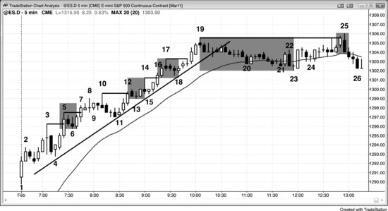
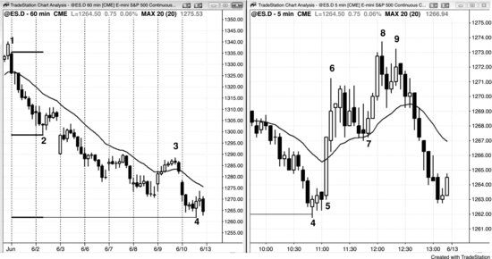

市场始终在尝试突破，同时也始终在尝试让每一次突破失败。这是所有交易中最根本的规律，也是我们一切操作的核心。交易员能培养的最重要技能之一，就是可靠地判断一次突破究竟会成功还是失败（失败意味着反转）。记住，每一根趋势K线都是一次突破，而且无论多头趋势K线还是空头趋势K线看起来多强，其顶部和底部都同时存在买方和卖方。既然每根趋势K线都是一次突破，而趋势K线又很常见，那么交易员就必须明白：整个交易日里，每隔几根K线就要重新评估——当前的突破是会延续，还是会失败并反转。这是交易中最基本的概念，能否真正理解它，直接关系到交易员能不能赚到钱。突破的本质不因对象而异，任何东西的突破都是一样的。即便是像V形底这样剧烈的反转，说到底也只是一次突破紧跟着一次突破失败。有些交易员下单押注突破成功，另一些交易员则反向下单押注突破失败。评估突破成败的能力越强，交易员就越有可能以交易为生。突破会成功吗？如果会，就顺着突破方向寻找入场机会；如果不会（突破失败即反转），就顺着反方向寻找入场机会。所有交易归根到底都是在做这个判断。

**突破**这个词其实容易产生误导，因为它暗示市场只是试图从交易区间过渡到趋势。但实际上，一次买入高潮或卖出高潮试图反转、启动反方向趋势，同样也是突破。关于突破，最重要的一点是：大多数突破都会失败。市场有很强的倾向去延续当前状态，因此对变化有很强的抵抗力。正如大多数终结趋势的尝试都会失败一样，大多数试图终结交易区间、启动新趋势的尝试同样会失败。

突破是指价格越过某个此前有意义的位置，比如趋势线、前高或前低，也包括前一根K线的高点或低点。那个位置就成为突破点；如果价格随后回来测试该位置，这次回调就是突破回测（即突破后的回调到达突破点附近区域）。突破点与突破回测之间的空间就是突破缺口。一次有意义的突破——能使 Always-in 方向明确为多头或空头、并且有较大概率（60%以上）至少持续好几根K线跟随——几乎总是表现为一根相对较大的趋势K线，且没有明显的影线。"Always In"在第三本书中有详细讨论，意思是：如果你必须始终持有仓位，要么做多要么做空，那么 Always-in 方向就是你当前应该持有的方向。突破是市场试图反转趋势或从交易区间进入新趋势的举动。每当市场处于交易区间时，都应该视为处于突破模式——双向交易持续进行，直到一方放弃，市场变得严重偏向一方，形成急速走势，这就构成了突破。所有突破都是急速走势，可以由一根或连续几根趋势K线组成。各种类型的突破非常常见，任何图表上每隔几根K线就可能出现。正如第6章关于缺口的讨论所说，所有突破在功能上都等同于缺口；而既然每根趋势K线都是一次突破（同时也是急速走势和高潮），那它也是一个缺口。很多突破容易被忽视，而且任何一次突破都可能同时突破了多个东西。有时市场在两个方向上都出现建仓形态，因此处于突破模式，这有时被称为处于拐点区域。交易员会准备好在突破发生时顺着任何一个方向入场。突破是每张图表上最常见的特征之一，因此理解突破本身、突破后的跟随以及突破的失败就至关重要。

前一根K线的高点，在更低时间周期的图表上通常（60%以上）对应一个波段高点，所以当价格突破前一根K线的高点时，实际上就是突破了低时间级别的一个波段高点。同样，当价格在当前图表上突破某个前波段高点时，那个高点在更高时间周期的图表上不过是前一根K线的高点。低点的道理也一样：前一根K线的低点在更低时间周期的图表上通常（60%以上）对应一个波段低点，而当前图表上的任何波段低点在更高时间周期的图表上通常（60%以上）就是前一根K线的低点。

区分两种突破很重要：一种是突破后进入新趋势，另一种是在更大的交易区间内突破一个较小的交易区间。举个例子，假设屏幕上的图表处于一个交易区间中，市场向上突破了屏幕下半部分的一个小交易区间，大多数交易员会认为市场仍处于更大的交易区间内，并没有进入多头趋势。市场可能只是形成了买方真空效应，去测试更大交易区间的顶部。正因如此，聪明的交易者不会在屏幕顶部附近的强多头趋势K线收盘价处买入。实际上，很多人会在那里卖出多头仓位止盈，还有人会在那里做空，预期这次突破尝试将会失败。同理，尽管在强多头急速阶段买入高 1 建仓形态可以是一笔很好的交易，但这只在多头趋势中才成立，而不是在交易区间顶部——因为大多数突破尝试在那里都会失败。一般来说，如果出现了一波强多头突破，但价格仍低于屏幕左半边K线的高点，那么在急速顶部附近考虑买入之前，需要先确认一波强趋势反转正在形成。如果你认为市场可能仍在交易区间内，就只考虑在回调时买入，而不要在急速顶部附近买入。

大型交易者在趋势的急速阶段会毫不犹豫地入场，因为他们预期后续会有显著的跟随行情，即使入场后立刻出现回调也不怕。如果回调真的出现了，他们还会加仓。比如，一波强多头突破持续了好几根K线，随着每一个新高 tick 的出现，越来越多的机构确信市场已经变成 Always-in 做多状态；一旦确信市场还会继续上涨，他们就开始买入，并且随着市场持续上涨不断追加买入。这使得急速阶段增长得非常快。他们有很多入场方式：用市价单买入、在 1 到 2 个 tick 的回调处挂限价单买入、用突破单在前一根K线高点上方买入，或者在突破前一个波段高点时买入。用什么方式入场不重要，关键是先建起哪怕一个小仓位，然后在市场继续上涨或出现回调时再加仓。由于他们随着市场上涨不断加仓，急速阶段可以延续很多根K线。新手看到急速阶段不断延伸，会疑惑：谁会在这么大一波上涨的顶部买入？他们不理解的是，机构对市场即将走高充满信心，所以一路都在买入，因为他们不想在等待回调的过程中错过这波行情。新手还担心止损必须设在急速底部下方，或者至少在急速中点以下，觉得距离太远了。机构深知这一点，只是简单地缩小仓位规模，让每笔交易的风险金额与其他任何交易保持一致。

在某个阻力位，早期的买入者会部分止盈，市场随之小幅回调。回调一出现，想要更大仓位的交易者便迅速买入，使得初始回调幅度很小。那些之前错过入场机会的多头也会利用这次回调建立多头仓位。有些交易者不喜欢在急速阶段买入，因为不想承担过大的风险——止损往往需要设在急速底部下方。他们更愿意在一个较优的价格买入，所以会等回调形成后再进场。既然所有人都想在回调时买入，为什么回调还会出现呢？因为并非所有人都想买。早期买入的有经验的交易者知道市场随时可能反转，一旦他们觉得市场已经到达某个阻力区域——可能出现止盈或反转的区域——就会部分止盈、开始分批减仓，有时甚至全部平仓。这些人不同于那些想在第一次回调时以低几个 tick 的价格买入的多头。那些分批止盈的有经验交易者之所以减仓，是因为他们担心反转，或者担心出现更深的回调，以便在低很多 tick 的位置重新买入。如果他们认为回调只会持续几个 tick 然后多头就会恢复，他们根本不会出场。他们总是在某个阻力位止盈，比如测量移动目标位、趋势线、趋势通道线、新高，或者上方交易区间的底部。大部分交易由计算机完成，所以一切都有数学基础，也就是说止盈目标都基于屏幕上可见的价格。通过反复练习，交易员可以学会识别计算机可能止盈的区域，并在相同价位止盈，预判随后将出现回调。虽然趋势具有惯性，能够突破大多数阻力区域，但当反转最终到来时，它一定出现在某个阻力区域——无论你是否能辨认出来。

急速阶段中，有时会出现某根K线或某个形态，让激进的空头觉得回调即将到来，想抓一小段剥头皮利润。但大多数这样做的交易员最终都会亏钱，原因要么是回调幅度不够大，要么是交易者方程不划算——剥头皮成功的概率乘以利润，小于失败的概率乘以保护性止损的幅度。而且，做空的人往往太惦记那点小利润，几乎无一例外地错过了几分钟后出现的、利润大得多的做多机会。

交易员会根据自己对突破是成功还是失败的判断，选择顺着突破方向入场或反向入场。你是相信突破的人，还是不信的人？顺着突破方向入场的方法有很多。一旦交易员感到紧迫——觉得一波重大行情有六成以上概率正在展开——就必须赶紧进场。突破期间入场对很多人来说很难，因为风险大、速度快，他们往往愣在那里不敢下单，心里太担心潜在亏损有多大，也就是说太在意输赢，心态已经失衡了。这时候必须把仓位缩小到"无所谓"的程度，才能果断入场。面对一笔让人害怕的交易，最好的办法就是自动把仓位缩到平时的三分之一或四分之一，同时用比较宽的止损。这样也许能抓到一波大行情——小仓位赚大钱，远好过标准仓位一分不赚。但也要注意，不能因为"无所谓"就随便乱做，拿弱的建仓形态去交易，最后反而亏钱。正确的做法是先发现一个好的建仓形态，然后再切换到"无所谓"的心态。

一旦交易员觉得市场出现了明确的 Always-in 走势，就会认定趋势已经启动，需要尽快入场。比如出现一波强劲的多头突破，可以在那根让你确认趋势已经开始的K线收盘时买入。有人可能还要等下一根K线也收阳才放心，概率在六成以上。如果等到了阳线收盘，就可以在K线收盘的瞬间买入——用限价单挂在收盘价，或者直接用市价单。也可以等第一根暂停K线或回调K线出现，然后用限价单在其收盘价买入、在其最低价上方一个 Tick 买入、在其最低价买入、或在其最低价下方一两个 Tick 买入。还可以挂限价单接任何小幅回调，比如 Emini 回调 1 到 4 个 Tick，或者个股回调 5 到 10 美分。如果突破K线不是太大，下一根K线的最低价有六成以上概率会测试突破前那根K线的最高价，形成一个突破回测，这时可以在那根K线最高价处或稍上方挂限价单买入，止损设在突破K线的最低价。如果你想在暂停K线价格处或下方买入但未能成交，可以在该K线最高价上方一个 Tick 挂买入突破单。如果急速走势很强，可以等第一个高1建仓形态出现再买入，这本身就是一个突破回调。在更早的阶段，也可以切到 1 分钟、2 分钟或 3 分钟图，在前一根K线最低价处或下方买入，或者在高1、高2信号K线上方买入，或者用限价单在均线处买入。入场之后，应该按趋势交易的方式管理仓位，瞄准测量移动目标做波段止盈，而不是只赚一小段剥头皮利润就跑。多头会预期空头的每一次尝试都将失败，因此每次都找机会买入：每一根空头趋势K线收盘附近他们都会买，哪怕那根K线实体很大、收在最低价；市场跌破前一根K线最低价时他们会买，跌破任何前期波段低点时他们会买，跌到趋势线等支撑位时他们也会买。同样，市场每一次试图上行的走势他们也会买，比如在多头趋势K线最高价附近买入，或者在市场突破前一根K线最高价、突破阻力位时买入。这跟强空头趋势中的操作正好相反：强空头趋势中，交易员会在K线上方和下方都卖出，在阻力位和支撑位的上方和下方都卖出。他们在K线上方卖出（包括各种阻力位附近），哪怕是强多头趋势K线也照卖不误，因为他们把每一次上涨都看作趋势反转的尝试，而大多数趋势反转尝试都会失败；他们在K线下方卖出（包括各种支撑位附近），因为他们把每一次下跌都看作空头趋势恢复的尝试，并且预期大多数都会成功。

大多数突破尝试都会失败，因此很多交易员会选择反向入场。举个例子，在一段多头趋势中，如果出现一根收在最低点的大空头趋势K线，大多数交易员会判断这次反转尝试大概率失败，于是在该K线收盘价附近买入。如果下一根K线收出阳线实体，他们会在其收盘价买入，也会在其高点上方买入。第一目标是那根空头趋势K线的高点，第二目标是向上的测量移动，幅度等于那根空头趋势K线的高度。有些交易员会把初始保护性止损设在与空头趋势K线高度差不多的 tick 数，也有些人会采用自己惯常的止损幅度，比如 Emini 用两个点。突破期间信息变化很快，随着后续每根K线的收盘，交易员通常 (60%+) 能逐步形成越来越明确的判断。如果接着又出现第二根强空头趋势K线、再来第三根，就会有更多交易员认为 Always-in 方向已经翻空，空头会加码做空。之前在空头急速阶段买入的多头，很快会判断未来几根K线市场还要走低，于是平掉多单。明知短期内市场还会更低，继续持有多单就不合理了。更合理的做法是先平仓认亏，等认为多头趋势即将恢复时，再在更低的价格重新买入。由于多头暂时变成了卖方——至少在接下来几根K线里是这样——场内已经没有买盘，市场就会下跌到下一个支撑位。反过来，如果第一根空头K线之后市场立刻反弹，空头很快就会意识到自己做错了，随即回补空单。这时候既没有人继续做空，所有人都在买入——多头建立新的多单，空头回补空单——市场就有可能 (60%+) 至少再涨几根K线。

评估一次突破时，交易员必须结合整张图表来看，不能只盯着当前这段走势。比如，如果市场正处于一波强劲的多头急速突破中，不妨看一看屏幕左侧的走势。如果当前价格所在位置左边没有任何K线到达过，那么在急速K线的收盘价附近买入、止损放在急速低点下方，通常 (60%+) 是不错的策略。由于风险比较大，仓位要小，但因为强突破至少有 60% 的概率走出一个大致等于急速幅度的测量移动，交易者方程是划算的（成功概率乘以潜在回报，大于失败概率乘以风险）。然而，如果你看向屏幕左侧，发现当前突破仍在 20 或 30 根K线之前的高点下方，那市场可能 (60%+) 仍处于交易区间之中。交易区间里经常出现猛烈的多头急速冲向区间顶部、随后又掉头向下的情况，市场也会猛跌到底部，那次突破同样以失败告终。因此，在交易区间顶部附近追买强多头趋势K线的收盘价风险很高，通常 (60%+) 不如等回调再买。交易员应该按交易区间的方式来操作，直到市场明确进入趋势为止。

在多头趋势中，价格突破前高之后，通常 (60%+) 会出现三种结果之一：更多买盘涌入、多头止盈、或空头入场做空。趋势强劲时，强势多头会在突破前高时追涨买入（即多头加仓），随后市场会走出某种形式的测量移动。如果在回调出现之前，市场已经涨到突破点上方足够远，足以让交易员至少完成一笔盈利的剥头皮交易，那就可以认为突破位置主要是新买盘在推动。如果市场横盘不动，且突破出现了疲弱迹象（后面会详细讨论），那就说明主要是多头在止盈，他们打算在稍低的位置重新买入。如果市场直接猛烈反转下跌，那就说明强势空头在新高位置占了上风，市场可能 (60%+) 至少要走出两段下跌、至少持续 10 根K线。

除非出现某种罕见的重大新闻事件，交易员不会突然从极度看多跳转到极度看空。转变是渐进的：一个交易员先是变得没那么看多，然后转为中性，接着才转空。当足够多的交易员完成这个转变，市场就会反转，进入更深的回调或空头趋势。每家机构都有自己衡量"过度"的标准，当达到某个临界点时，足够多的机构会判断趋势已经走过头了。它们认为即使不在前高上方追买也不会错过一波大涨，于是只在回调时买入。如果市场在前高上方犹豫不前，说明市场正在变成双向博弈，强势多头开始利用新高来止盈。

止盈说明交易员仍然看多，等着在回调中买入。大多数新高之后都会出现止盈。每一个新高都有可能成为顶部，但大多数反转尝试都会失败，演变为牛旗，随后市场再创新高。如果测试高点的上涨过程中出现了好几个小回调，K线大量重叠，空头实体不少，K线顶部挂着大影线，而且大部分多头趋势K线力度偏弱，那么市场的双向性正在增强。多头在K线高点止盈，只在K线低点买入；空头开始在K线高点做空。同样，当市场接近多头趋势顶部时，多头在止盈，空头在加大做空力度。如果市场涨破了前高，止盈和做空的力度往往（概率60%以上）会进一步加强。

大多数交易员不喜欢反手操作，因此如果他们预期会出现反转信号，更倾向于先平掉多单，再等信号出现。在趋势最后一条上升腿中，这些多头的离场削弱了最后一波上涨的力度。如果市场突破前高之后紧接着出现一波强劲的反转下跌，说明强势空头正在接管市场，至少短期内如此。一旦出现这种情况，那些原本打算在小回调中买入的多头就会转而认为市场还会继续下跌，于是要等更大幅度的回调才肯入场。他们不买，空头就能把价格推得更低，形成一段持续十根或更多K线的深度回调，通常（概率60%以上）包含两条或更多下跌腿。每当新的趋势出现，交易员就会切换思维模式。当多头趋势反转为空头趋势时，他们不再用突破单在K线高点上方买入，不再用限价单在K线低点下方买入，而是开始用限价单在K线高点上方卖出，用突破单在K线低点下方卖出。当空头趋势反转为多头趋势时，他们不再用突破单在K线低点下方卖出，不再用限价单在K线高点上方卖出，而是开始用突破单在K线高点上方买入，用限价单在K线低点下方买入。

有一种情况：多头趋势中的突破会被激进的空头迎头打压，而且这些空头通常（概率60%以上）能接管市场。回调本质上是反方向的一小段趋势，交易员预期它很快结束、大趋势随后恢复。强空头趋势中出现回调时，市场往往会走出两条上升腿。当市场涨破第一条上升腿的高点，就相当于突破了小多头趋势中的前波段高点。但由于大多数交易员会把这段上涨视为即将结束的回调，突破时的主导力量通常（概率60%以上）是激进的卖家而非激进的新买家。因此，小多头趋势通常（概率60%以上）会在突破回调中的第一个或第二个波段高点之后反转下跌，重新回到主要空头趋势方向。

新低在空头趋势中的道理也一样。当空头趋势很强时，强势空头会在突破至新低处加仓做空，市场持续下跌，直到触及某个测量移动目标。随着趋势减弱，新低处的价格行为变得不再那么清晰，这意味着强势空头把新低当作空单止盈区，而不是加仓区。当空头趋势进一步失去力度，强势多头最终会把新低视为很好的做多价位，他们有能力构建出一个反转形态，随后推动一波可观的反弹。

随着趋势成熟，通常（概率60%以上）会过渡到交易区间，但最先形成的那些交易区间之后，趋势通常（概率60%以上）还会延续。那么随着趋势成熟，强势多头和强势空头是怎么行动的？在多头趋势中，趋势很强时回调幅度很小，因为强势多头想在回调中加仓买入。他们担心市场可能（概率60%以上）涨很高之后才会回调，所以一刻不停地分批买入，找一切理由入场。市场上有这么多大机构，几乎每种买入理由都能找到人入场。他们在低几个tick的位置挂限价单，在前一根K线低点上方几个tick、低点处、低点下方分别挂限价单。他们在前一根K线高点上方挂突破单，在任何前波段高点突破处也挂突破单。他们还会在任何多头趋势K线或空头趋势K线的收盘价买入。他们把空头趋势K线看作短暂的低价买入机会，把多头趋势K线看作市场即将快速上涨的信号。

强势空头是聪明的，他们看得出市场正在发生什么。既然他们和强势多头一样，都认为价格很快会更高，那么现在做空就毫无意义。他们只是退到一旁，等到能在更高价位卖出时再出手。高多少才够？每家机构对"过度"都有自己的衡量标准，但一旦价格到了足够多空头机构认为"可能涨不动了"的位置，他们就会开始做空。如果有足够多的机构在差不多的价位做空，图表上就会出现更多、更大的空头趋势K线，K线顶部也开始出现上影线。这些都是抛压的信号，告诉所有交易员：多头正在变弱，空头正在变强。强势多头最终不再在前一个波段高点上方买入，转而在市场创新高时止盈。他们依然看多，但变得更加挑剔，只愿意在回调时买入。随着双向交易增多、下跌过程中空头趋势K线更多、下跌持续的K线数量增加，强势多头就只想在正在形成的交易区间底部买入，在顶部止盈。与此同时，强势空头开始在新高处做空，并愿意在更高位置加仓。如果他们判断市场可能反弹突破到新高，就会在交易区间底部附近部分止盈，但仍会持续寻找在新高处做空的机会。到了某个时刻，市场变成50-50的格局，多空双方谁也无法控制局面；最终空头占据主导，空头趋势开始，上述过程便反过来重演。

一段持续已久的趋势往往会出现一个异常强劲的突破，但那可能是一个衰竭性高潮。例如在一段持续已久的多头趋势中，强势多头和强势空头都乐于看到一两根大的多头趋势K线——尤其是特别大的那种——因为他们预期这将是一个短暂但异常好的机会。一旦价格接近强势多头和强势空头想要卖出的位置，比如测量移动目标附近或趋势通道线附近，尤其当这已经是连续第二或第三个买入高潮时，他们就退到一边不再卖出。最强的交易员不再卖出，导致市场上方形成真空效应。那些能在K线形成早期就检测到动量的程序化交易会迅速反复买入，直到动量放缓。由于几乎没有强势交易员在卖，结果就是出现一两根相对较大的多头趋势K线。这个多头急速正是强势交易员一直在等待的信号，一旦出现，他们仿佛凭空冒出来，开始大量卖出。多头对多头仓位止盈，空头建立新的空头仓位。双方都在K线收盘价附近积极卖出，在K线高点上方卖出，在下一根K线收盘时卖出（尤其是那根K线较弱的话），在再下一根K线收盘时也卖出——特别是当K线开始出现空头实体的时候。他们还会在前一根K线低点下方做空。当他们看到一根强空头趋势K线时，就在它的收盘价做空，在它的低点下方也做空。动量程序同样会止盈。多空双方都预期一轮更大的回调会展开，多头至少要等到十根K线的两段式回调完成之后才会考虑再次买入，而且还得看下跌走势是否显得疲弱。空头同样预期这样的下跌，不会急着过早止盈。

弱势交易员对那根大的多头趋势K线的看法恰恰相反。弱势多头一直在场外观望，盼着有个容易入场的回调来做多，眼看市场越涨越远，急着要赶上这波上涨——尤其那根K线那么强，而且当天交易时间也快结束了。弱势空头之前在较早的位置做空，也许还加过仓，被这根K线快速突破新高的速度吓坏了。他们害怕出现持续不断的跟随买入，于是平掉空头仓位。这些弱势交易员是在凭情绪交易，而他们的对手是计算机，计算机的算法里根本没有"情绪"这个变量。既然计算机掌控着市场，弱势交易员的情绪注定让他们在一段过度延伸的多头趋势末端，在那些大多头趋势K线上遭受惨重亏损。

一旦强多头趋势开始出现相对较大的回调，这些回调——本质上都是小型交易区间——就会表现得更像交易区间，而不像牛旗。突破方向变得不再那么确定，交易员开始觉得向下突破的概率与向上突破差不多。此时一个新高就是试图向上突破交易区间，而概率上它很可能（60%以上）会失败。同理，一旦强空头趋势开始出现相对较大的回调，这些回调就更像交易区间而非熊旗，因此一个新低就是试图向下突破交易区间，概率上它同样很可能（60%以上）会失败。

每个交易区间都处于某个多头趋势或空头趋势之中。一旦双向交易强到足以形成交易区间，趋势就不再强劲——至少在交易区间持续期间是这样。最终总会出现一个突破：如果向上突破且非常强劲，市场就进入强多头趋势；如果向下突破且非常强劲，市场就进入强空头趋势。

空头一旦强势到能把回调推至多头趋势线和均线下方很远的位置，就有信心市场不太可能再涨多高，会在旧高点上方积极做空。此时多头已经决定只在深度回调时才买入。市场在新高位置形成了一种新的主导心态——这里不再是买入的位置，因为新高不再代表强势。没错，多头会在这里止盈，但大多数大资金现在把新高看作绝佳的做空机会。市场到了临界点，大多数交易员不再盯着小回调去买，转而开始寻找反弹做空的机会。空头占据主导，强力的抛压可能（概率60%以上）带来一波大幅回调，甚至趋势反转。下一波强力下推之后，空头会找一个更低的高点再次做空或加仓；而在回调中买入的多头开始担心趋势是不是已经反转，或者至少会出现更深的回调。他们不再指望等到新的多头高点来平仓获利，而是选择在更低的高点平仓，并且在更大的回调走完之前不打算再买入。多头知道大多数反转尝试都会失败，很多从底部一路持有多头仓位的交易员不会出场，除非空头证明自己有能力把市场大幅打压下去。一旦这些多头看到令人震撼的抛压，就会找一个反弹来平掉多头仓位。他们的卖出会限制反弹幅度，而这些卖出，加上激进空头的做空，以及那些把下跌视为买入机会的多头的止盈，会共同制造出第二段下跌。

如果市场进入空头趋势，过程则刚好相反。空头趋势强势时，交易员会在前低下方做空。随着趋势减弱，空头会在新低处止盈，市场可能（概率60%以上）进入交易区间。一波强劲反弹突破空头趋势线和均线之后，空头会在新低处止盈，强势多头会积极买入，试图夺取市场控制权。结果要么是一波更大幅度的空头反弹，要么可能（概率60%以上）反转进入多头趋势。

类似的情况也会出现在回调幅度足够大、让交易员开始怀疑趋势是否已经反转的时候。比如多头趋势中出现一个又深又急的回调，交易员就会开始想市场是不是已经反转。他们关注的是跌破前一波段低点的走势，但这是在多头趋势回调的背景下，而不是空头趋势的一部分。他们会盯着市场跌破前一波段低点时的表现：市场是否会继续下跌到让在那个波段低点下方用限价卖出突破单入场的空头能够获利？新低处是否出现了更多的卖家而非买家？如果是，这就说明空头很强，回调可能（概率60%以上）还会继续走低，趋势甚至有可能已经反转。

另一种可能是，突破到新低之后市场进入交易区间——这说明空头在止盈，而多头的买盘也不够有力。最后一种可能是，突破到新低之后市场向上反转。这意味着有强势多头早就在那个波段低点下方等着，就等市场回来测试。这个信号说明下跌更可能（概率60%以上）只是持续多头趋势中的一个大回调。高位做空的空头在突破到新低时止盈了，因为他们相信趋势仍然向上；强势多头积极买入，因为他们相信市场不会再跌，会反弹去测试多头高点。

任何时候只要出现跌破波段低点的突破，交易员都会仔细观察，寻找多头回归或空头夺取控制权的证据。他们需要判断在新低处哪方力量更强，并根据市场的实际表现来做出决策。如果突破很强，说明新的卖盘占主导；如果走势不明朗，说明空头在止盈、多头在弱势买入，市场可能（概率60%以上）进入交易区间；如果出现强劲的向上反转，说明多头的积极买入是最重要的驱动力量。

有时候，市场处于一个较弱的趋势中，突然出现一根大的顺势突破K线。这根突破K线往往起到急速的作用，后面通常还会跟几根趋势K线，但彼此之间多有重叠，而且带有影线。这些K线构成一个窄的多头通道。与所有急速与通道趋势一样，市场经常会回测通道起点，也就是突破缺口区域。举个例子，假设有一段比较弱的多头波段，然后市场以一根大的多头趋势K线向上突破，后面又跟了三四根较小的多头趋势K线，这些K线通常充当通道。一旦价格回落到通道中第一根K线附近，往往会略微跌破其低点，进入突破K线形成的缺口区域。这个缺口既是测量缺口，也是突破缺口，缺口被测试之后，市场通常会恢复原来的趋势，而不是开始向下反转。

拐点是一个数学术语，指方向发生了改变。比如有一条水平的波浪线反复上下波动，当波浪向下运行时，到了某个位置，斜率会从陡峭下跌变为平缓下跌，开始形成底部。字母 *S* 的中间位置就是曲线的拐点，因为从那个点开始，斜率方向发生了改变。在交易中，拐点就是你预期可能（概率60%以上）发生趋势反转的区域，但反转未必真的出现。既然价格可能向任一方向运动，市场就处于突破模式，交易员会准备好沿突破方向入场。无论向哪个方向突破，市场之后往往会走出测量移动——即走出的点数大致等于之前那段形态的幅度。比如，双顶经常会向上或向下突破。突破之后，市场往往会越过突破点走出一段测量移动，目标距离大致等于双顶底部到顶部的高度。突破点与第一次回调之间经常会出现缺口，缺口中点往往对应一个测量移动目标（测量缺口在第6章缺口部分讨论）。

突破模式在交易区间中可能呈现相反的表现。比如，如果在交易区间中部出现一个突破模式建仓形态，K线下方的买方可能（概率60%以上）多于卖方，K线上方的卖方可能（概率60%以上）多于买方。如果不确定性太大，交易员觉得交易者方程不够理想，通常最好等市场走出明确方向再入场。在交易区间的边缘，可能出现三种情况：（1）反转，（2）突破失败后反转，（3）突破成功。三种情况中只有一种能走出趋势，这与大多数突破尝试都会失败的概念是一致的。

当出现逆势突破时，逆势交易员试图在急速之后构建一个通道（急速与通道趋势）或某种新趋势。但顺势交易员通常能在几根K线之内扭转突破，将其变成旗形。比如，空头通道中出现一两根大的多头趋势K线向上突破通道，多头希望回调之后能形成多头通道。但他们通常会失败，这波多头急速最终只是成为熊旗的一部分。空头把这次急速看作绝佳的加仓机会——价格短暂冲高，恰好是他们心目中合理的卖出价位。

**图 PI.1** 新高会带来新的买家、获利了结者和做空者

当多头趋势向上突破前一个波段高点时，会出现新的买家、获利了结者和做空者（见图 PI.1）。如果突破前的趋势刚刚起步且非常强劲，获利了结的量会比较小，比如K线5、12、17之后那样，但新买入的力量会压倒空头，趋势很快恢复。到了趋势后期，新的买入会大幅减少，获利了结会大幅增加，比如K线19之后。衡量市场是否过度延伸有很多指标，一旦足够多的机构认为多头趋势已经走过头，它们就会对多头持仓止盈，等大约出现10根K线的两段式回调后再重新买入。我经常用"10根K线、两段式"这个说法，意思是这轮回调会比一次小幅回调持续更久、更复杂。通常至少需要10根K线和两段腿，有时甚至会演变成趋势反转。

每次突破出现时，都有失败并引发趋势反转的可能。如果背景合适且反转K线足够强，反转成功的概率就更大。但如果突破K线和引领突破的急速阶段比反转K线更强，而且出现高潮反转的可能性不大，那么反转尝试大概率会在几根K线内失败，形成突破回调建仓形态，推动趋势恢复。比如，K线12是一根小的空头反转K线，但它前面有一个强得多的三根K线多头急速，而且市场在大幅缺口高开之后整天都沿着窄通道上行。这使得反转成功的概率很小，所以多头在K线12的低点及其下方买入。下一根K线是十字星，作为空头的入场K线非常弱，因此几乎可以肯定在它的高点上方买盘会多于卖盘。这根K线变成了一个突破回调买入信号K线（这里是高1买入建仓形态）。再下一根是阳线，更多买家在它的高点上方买入。一般来说，等阳线出现后再在其高点上方入场，买入信号成功的概率更高。K线14是突破K线，但收在最低点，形成了一根空头十字星反转K线——在如此紧密的多头通道中，这是一个很弱的卖出信号。多头非常激进，不想让空单被触发。他们在空头K线的低点及上方挂了限价买单，量足以压倒空头。空单始终没有触发，市场继续上涨。K线14只不过是突破后的又一次回调（它本身也是突破），交易员在K线15的高点上方买入，这又是一个突破回调买入信号。

K线5的突破处有另一个对比突破强度与反转强度的例子。K线5之后的阴线既是K线4单K线牛旗的信号K线，也是K线3上方突破失败的信号K线。相对于从K线4起的三根K线多头急速而言，这根空头信号K线很小，因此不太可能反转趋势。下一根K线是突破回调买入建仓形态，但带有空头实体，算不上强的买入信号K线。再下一根K线有多头实体，在它的高点上方买入成功概率更高。

K线10是ii牛旗的突破，但突破K线是一根空头反转K线，属于弱突破K线，增加了突破失败的可能性。这根突破K线同时也是突破失败的信号K线。

回调有时会跌破多头趋势线，制造出足够的抛压，让空头在下一个新高附近变得更加积极，K线25就是这样的情况。多头仍在止盈，但新的买盘非常稀少。收盘前空头掌控了局面。

强势多头与强势空头都期待着最终涨至K线19的那波强力突破。他们乐于看到一段持续的多头趋势之后出现大幅多头急速，因为预期中的回调会给双方都提供一个短暂的交易机会。这是自K线11低点以来连续第三波未经回调的多头高潮（前两波分别是K线11到K线12和K线15到K线17），而连续的买入高潮通常会导致一段持续约10根K线的两段式回调，跌破均线。强势多头和强势空头都在K线19之前那个两K线多头急速收盘时卖出，也在其高点上方卖出，还在K线19收盘时卖出（尤其因为它带有空头实体），以及在它的低点下方卖出。多头不打算再买入，空头也不急于在空单上止盈，直到两段式回调完成——大约在K线21到K线24区域。这波下跌足够强，让双方都认为市场可能在K线19多头高点之后的较低高点或较高高点测试后发生趋势反转，进入空头趋势，由此引发了从K线25到收盘的抛售。

大多数反转尝试都会失败，所以交易员经常押注反转失败。K线22是多头趋势中一根强的空头趋势K线，许多交易员在它收盘时买入。他们的第一个目标是涨回到这根K线的高点，两根K线之后就实现了；第二个目标是测量移动目标对应的上涨幅度，在当天收盘前也已到达。

K线5之后的阴线是一个突破模式建仓形态。因为它是一根阴线，出现在突破K线3波段高点之后，所以它是一个突破失败的做空建仓形态。同时它也是多头突破中的单K线回调，因此又是一个高1突破回调买入建仓形态。在这个案例中，由于三根K线的多头急速非常强，多头在这根K线的上方和下方都更可能占优。一些人在空头内包K线的低点用限价单买入，另一些人则在它的上方以及K线6的上方用突破单买入。

**图 PI.2** 空头趋势中的低成交量多头突破

如图 PI.2 所示，左侧 60 分钟图上 Emini 处于**空头趋势**，很多交易员会根据K线 1 到K线 2 那段初始急速下跌的高度，寻找**测量移动**目标位附近做多的机会。空头在目标位买回空单**止盈**，激进的多头则主动建多仓，预期价格可能出现**趋势反转**，回测空头通道的起点（K线 2 之后那个较低的**波段高点**）。K线 3 处出现了**均线缺口K线**反转，同时价格突破了空头趋势线，两个条件叠加，至少走出两段上涨的概率明显增大（反转的详细内容在第三本书中讲解）。

右侧 5 分钟图显示，价格跌破 60 分钟**测量移动**目标仅 1 个 Tick 后便向上反转（K线 4 在两张图上对应同一时间）。K线 5 是一根**影线**很短的大**多头反转K线**，多头期待出现强势反转。不过，这根K线的成交量只有约 2.3 万手，大约是普通 5 分钟K线的 3 倍。通常一根 5 分钟K线的成交量在 5,000 到 1 万手之间，而那些能带来持续**跟随**的**多头反转**，成交量往往是平均水平的 5 到 10 倍，也就是至少 4 万到 5 万手。最可靠的K线成交量超过 10 万手。交易员其实不必太在意成交量，图表本身会把你需要知道的一切都告诉你；但如果一根大**趋势K线**在**突破**时伴随巨大的成交量，**跟随**出现的概率就会增大，通常至少会走出一定幅度的**测量移动**。当**空头趋势**很强，向上反转只持续了两根K线就开始**回调**，而且第二根阳线带有很长的**影线**，说明这次反转并不强。经验更丰富的交易员可以通过观察成交量来进一步确认反转力度不足，也可以直接切到 60 分钟图，一眼就能看出明显的强**空头趋势**。不过，日内交易员只看 5 分钟图就够了。他们会在K线 5 形成过程中买入、在收盘时买入，也会在K线 5 高点上方买入。他们还会在K线 7 的 **ioi** 形态处买入——那是一个位于均线附近的**高 4 牛旗**。既然是在一波强势多头行情中做多，就应该假设自己至少有 60% 的概率获得不低于风险的**回报**。可以设 2 个点的止损——这个幅度最近效果不错——然后设 2 个点的利润目标。另一个在K线 5 收盘价买入的交易员，可能愿意把止损放在K线 5 低点下方（大约 4 个点），止盈目标也设为同等点数。在K线 7 上方买入的交易员，止损可以放在K线 7 低点或前一根K线低点下方，风险大约 2 个点，可以持仓等 2 个点的利润，或者等价格涨过K线 6 的高点（在这个例子中也差不多是 2 个点）。
