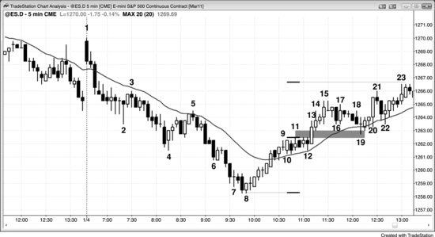

很多新手觉得突破难做——市场动得快，必须迅速做出决定，而且K线往往很大，风险随之升高，仓位不得不缩小。但只要交易员能识别出成功概率较高的突破，交易者方程就会非常有利。

**图 1.1** 突破是可靠的建仓形态

如果某段图表分析跨了好几页，可以去 Wiley 网站（[www.wiley.com/go/tradingranges](http://www.wiley.com/go/tradingranges)）查看或打印该图表，这样阅读文字解释时就不用反复翻页回去看图了。

成功的突破——比如图 1.1 中的多头突破——在数学上非常划算，但在情绪上很难执行。突破来得快，交易员本能地知道风险在急速段的底部（他们会把保护性止损放在多头急速段最低那根K线的低点下方一个 Tick，比如K线14下方），而这个距离往往超出了平时能承受的范围。他们想等回调再进场，但也清楚回调大概率要等市场涨得更高才会出现；他们又不敢直接市价买入，因为那等于在急速段顶部买进——万一下一个 Tick 就反转，就是在顶部买入，而保护性止损又离得很远。然而，他们往往忽略了一个关键事实：数学站在他们这一边。一旦出现这样强劲的突破急速段，市场至少走出一个以急速段高度为基准的测量移动，概率不低于 60%，有时甚至能到 80%。也就是说，他们至少有 60% 的概率赚到与初始风险等量的利润；而且入场后如果急速段继续延伸，风险不变，测量移动的目标却越来越高。举个例子：交易员在图 1.1 中 10 年期美国国债期货 5 分钟图的K线15收盘价买入，保护性止损设在两根K线组成的急速段底部下方一个 Tick（即K线14低点下方一个 Tick），距入场价 7 个 Tick。此时交易员判断市场处于 Always-in 做多状态，认为至少有 60% 的概率在几根K线内继续走高。他们还应该预期至少出现一个测量移动。急速段高 6 个 Tick，因此市场至少有 60% 的概率先向上走 6 个 Tick，再跌到保护性止损位。

到K线19收盘时，急速段已经扩大到 17 个 Tick，而且仍属于突破急速段，所以至少出现一个测量移动的概率仍不低于 60%。如果此时空仓，可以小仓位市价买入，止损放在K线14底部下方一个 Tick，风险 18 个 Tick，目标盈利 16 个 Tick（市场再涨 17 个 Tick 即可获利 16 个 Tick 出场）。而在K线15收盘买入的交易员，止损仍在K线14低点下方 7 个 Tick，但现在有 60% 的概率市场从K线19高点再涨 17 个 Tick，大约能赚 28 个 Tick（14 个 32nds）。急速段在K线19结束——因为紧接着出现了一根空头内包K线，而非又一根强多头趋势K线。这是多头趋势通道阶段一系列回调中的第一个。K线24突破了测量移动目标，大约一小时后市场涨得更高。

实际操作中，大多数交易员会随着急速段延伸而收紧止损，因此实际风险比上面讨论的要小。很多在K线15收盘买入的交易员，可能（60%以上）会在K线17收盘后把止损上移到K线17下方，因为他们不愿看到市场跌破这么强的一根多头趋势K线——一旦跌破，说明自己的判断有误，不想承担更大的亏损。K线19收盘后，这是一根强多头趋势K线，很多交易员可能（60%以上）会把保护性止损移到K线17突破形成的微型测量缺口处。K线18的低点在K线16的高点上方，这个缺口是强势信号。交易员希望市场继续上涨，不希望价格跌入K线18下方进入缺口，所以有些人会把跟踪止损移到K线18低点下方。很多有经验的交易员会利用急速段来追涨加仓。急速段持续上涨时，他们不断加仓做多，因为他们知道急速段的交易者方程极好，而这种绝佳机会转瞬即逝。当市场给出交易者方程很强的机会时，交易员必须果断出手；而当市场不提供这种机会时——比如在窄幅交易区间里——就该少做或者不做。

K线5开始的多头急速把市场翻转成了大多数交易员眼中的 Always-in 做多。价格突破K线11楔形熊旗的高点之后，可能（60%+）会出现大致等于一个测量移动的涨幅。K线15是连续第二根强多头趋势K线，很多交易员认为这确认了突破。K线14和K线15都是强多头趋势K线，实体大，没有明显的影线。从K线5的低点一路上来，买压一直很强——强多头趋势K线很多，K线之间重叠很少，空头趋势K线屈指可数，更没有连续的强空头趋势K线。市场可能正处于多头趋势的早期阶段，聪明的交易者一直在等多头突破。K线14和K线15突破之后，他们迫不及待地做多，一波接一波持续买入，一直买到K线19的高点。

交易员必须强迫自己做的最重要的一件事——通常也是最难的——就是一旦判断出现了可靠的突破急速，至少要建一个小仓位。当你发现自己既盼着回调、又怕回调迟迟不来的时候，就应该假设这是一次强势突破。这时候要找一个最差情况下的保护性止损位置——通常离当前价格比较远——然后以此为止损入场。因为止损幅度大，如果入场已经偏晚，初始仓位就应该小一些。等市场朝你的方向走了、可以收紧止损之后，再考虑加仓，但绝不能让总风险超过平时的水平。所有人都在等回调的时候，回调通常很长时间不会来。原因在于：大家都相信市场很快会更高，但不一定觉得它会很快走低。聪明的交易者明白这一点，所以开始分批买入。他们的止损要放到急速的底部，所以每次买的量很小。如果风险是平时的3倍，就只买平时仓位的三分之一，把绝对风险控制在正常范围内。强势多头持续小量买入，这种买压让回调更难形成。强势空头看到了趋势，同样相信市场很快会更高。既然觉得价格还会涨，就不再找做空机会了——再等几根K线说不定能在更好的价格做空，现在就空没什么意义。于是，强势空头不做空，强势多头分批小量买入，防止错过回调迟迟不来的行情。

结果呢？市场一直往上走。既然你要跟聪明的交易者做一样的事，就应该至少以市价买入一小部分仓位，或者在一两个 Tick 的回调时买入，止损放到急速底部。就算下一个 Tick 就开始回调，大概率也跌不了太远——聪明的多头会把这当成有价值的买点，积极买入。别忘了，所有人都在等着买回调，所以回调真正来的时候只会是小幅的、短暂的。那些一直等着买的交易员都会把这当成期待已久的机会。结果就是，你的仓位很快又会变成盈利的。等市场涨得够高了，可以考虑部分止盈，也可以在回调时加仓——到时候的回调价格可能（60%+）比你最初的入场价还高。关键在于：一旦你判断买回调是个好主意，就应该跟强势多头一样，至少以市价建一个小仓位。

有些交易员喜欢在价格突破前期波段高点时用买入突破单入场，挂在前高上方一个 Tick 的位置。一般来说，回调时入场的回报更大、风险更小、成功概率更高。买突破的交易员通常要先扛过一段回调，才能看到像样的利润。买回调通常比买突破更好。比如，与其在K线6上方买入突破、随后市场涨到K线9，不如等K线10的回调来了再买——后者的交易者方程可能更优。

K线11突破K线9高点的情况也一样。每次出现突破，交易员都要判断它会成功还是失败。如果认为会成功，就会在突破K线或跟随K线的收盘价买入、在前一根K线低点及其下方买入、在前一根K线高点上方买入。如果认为会失败，就不会买——已经做多的会平仓。如果认为失败后会跌出足够剥头皮的空间，可能会做空剥头皮。如果认为这次失败会引发趋势反转，可能会做空并持有波段空单。在这个具体例子中，价格强势突破K线9和K线11构成的双顶时，买入突破是合理的，但那些在K线15收盘价买入的交易员入场价差不多，而且理由更充分——他们是在强多头急速中买入一根强多头趋势K线的收盘。

如果一轮多头趋势或突破看起来不够强，不足以在急速阶段顶部附近买入（比如在最近一根K线收盘时买入），那么等回调再买入的交易者方程会更好。第22根K线是 ii 形态突破的第二根K线，也是一个潜在最终旗形反转建仓形态的起点。这里大概率（60%+）是一个小型买入高潮（详见第三册关于高潮反转的章节）。在这个位置，等回调再买入的交易者方程优于直接在第22根K线收盘价买入。第24根K线也是同样的道理。随着趋势的双向性越来越强，更好的做法是等回调再买入。一旦双向交易足够强烈，而且之前的回调幅度更深、持续超过大约5根K线，交易员就可以开始做空剥头皮了，比如在第24根K线的两K线反转处做空（在随后的空头趋势K线低点下方入场做空）。当市场过渡到交易区间后，空头就会开始做空波段交易，预期出现更深的回调和可能的趋势反转。

这轮多头趋势中其他突破回调买入建仓形态的例子包括：第8根K线的高2牛旗（由第6根K线的上涨回调而来，第6根K线突破了第3根到第5根K线的空头通道）；第12根K线在均线处的高2（第11根K线向上突破了交易区间，同时也突破了第10根K线的高1牛旗；第一段下跌是第11根K线之后的第二根空头趋势K线）；第14根K线的外包阳线（交易员可以在外包阳线形成时买入，但如果在第14根K线上方买入，成功概率更高，因为它是一根多头趋势K线）；第20根K线的 ii；第23根K线处的高2（第23根K线是入场K线）；以及第25根K线的高2（所有双底都是高2形态）。信号K线带有多头实体时更可靠。

一般来说，当趋势刚刚明确转为强 Always-in 做多时，一旦出现初始回调，交易员应该立刻在急速阶段高点上方挂一张买入突破单。之所以这样做，是因为很多交易员不敢在前一根K线低点下方或高1上方买入，担心市场可能出现两段式回调。但如果他们等待两段式回调，就会错过很多最强的趋势。为了避免被强趋势甩在场外，交易员需要养成挂这种"最后防线"买入突破单的习惯。如果他们在高1处已经买到了，就可以撤销那张突破单。但如果因为任何原因错过了前面的入场机会，至少这张单子能确保他们进入趋势——这才是关键。到第19根K线时，趋势明显非常强，大概率（60%+）继续上涨，幅度大约等于急速阶段高度的测量移动。一旦市场出现可能回调的迹象，交易员就需要在急速阶段高点上方挂上最坏情况下的买入突破单。第19根K线之后那根是空头趋势K线，可能是回调的开始。他们需要在第19根K线高点上方1个 Tick 处挂买入突破单，以防趋势迅速恢复。如果他们已经在第20根K线 ii 的高1建仓形态处买到了，就可以撤销第19根K线上方的突破单。但如果因为任何原因没有买到高1，至少在市场创出新高时他们会被带入趋势。初始保护性止损应该放在最近一次小回调的低点下方，也就是第20根K线的低点。

第24根K线是一个两K线多头急速，也是连续第三个没有回调的买入高潮。当天剩余时间不足以形成一个10根K线的两段式回调，所以没有多少空头愿意在这里做空，尤其是从第5根和第12根K线开始的整个上涨过程中抛压极小。不过，一些多头把这当作止盈的机会，事后来看这是个合理的决定，因为在当天剩余时间里市场再也没有回到这个高点上方。

交易员都知道，大多数试图反转趋势的尝试都会失败，很多人喜欢押注这些反转尝试会失败。第12根K线前面那根是一根大阴线（空头趋势K线），它跌破了趋势线，试图从第11根K线的多头突破处向下反转。多头在这根空头趋势K线收盘时买入，预期价格会回到它的高点，甚至可能向上走出一个等于该K线高度的测量移动。当他们看到第12根K线收了阳线后，又在第12根K线收盘时和其高点上方继续加仓买入。一次成功的空头突破通常后面会跟着另一根空头趋势K线，或者至少一根十字星；如果出现的反而是一根多头实体K线——哪怕实体很小——突破尝试失败的概率就更大了，尤其当这根K线处于多头趋势中的均线附近时。空头希望在空头急速之后出现空头通道或其他形式的空头趋势延续，但多头把这次空头急速视为短暂打折买入的机会。空头急速——尤其在日线图上——可能是由新闻引发的，但大多数不会有后续跟随，更长周期的多头基本面会占据上风，导致空头突破失败、多头趋势恢复。空头会因为利空新闻而兴奋和抱有希望，但这类新闻通常只是一天的小事件，跟所有基本面因素加在一起比起来微不足道。

**图 1.2** 突破回调

图 1.2 显示，当一个多头波段向上突破时，市场通常会回测突破缺口。市场跌到第8根K线后反转上涨。第12根K线是第二次均线缺口K线做空建仓形态，但失败了。市场没有测试空头低点，而是在第13根K线处向上突破。突破K线之后那根K线的低点与第11根K线突破点的高点之间形成了一个突破缺口。这个缺口的中点或第一段上涨至第11根K线高点的位置，都可以作为测量移动向上的起点。第13根K线急速上涨之后，出现了一个4根K线的窄通道，在第15根K线处结束，随后价格回测到通道底部。第19根K线的测试也回测到了突破缺口，在这类情况下这是常见现象。

从第5根K线到第8根K线的下跌没有回调，第8根K线之后那根是第一根突破前一根K线高点的K线。为什么有经验的交易员会在强趋势中的第一次回调（通常会失败）时回补高利润的空头仓位？因为他们学到了一点：应该始终寻找机会部分或全部止盈，尤其是在利润很大的时候，因为这些利润可能很快就会蒸发，特别是在可能的卖出高潮之后。这里出现了三个连续的卖出高潮（分别跌至第6、7、8根K线），而第7根K线之后的内包K线是一个潜在的最终旗形（详见第三册）。市场大概率（60%+）向上回调大约10根K线，可能到达均线、第4根K线的低点，甚至第5根K线的高点。空头把这看作在第8根K线附近锁定利润的绝佳机会，预期至少会有一轮10根K线的反弹，然后在更高的位置寻找做空建仓形态。由于上涨力度太强，始终没有出现做空形态，空头庆幸自己明智地止盈了，也不纠结于没有再次做空的好机会。如果他们一直持有空头仓位，所有利润都会变成亏损。止盈是任何强趋势中第一次回调的成因。那些错过下跌行情的空头一直期望有一次回调让他们入场做空，但始终没有等到那个机会。

那些错过跌至第4根K线行情的空头，或者在第4根K线止盈后等待回调再做空的空头，在第5根K线均线处的低2拿到了机会。这根K线带有空头实体，同时也是一个 EMA 20 缺口K线做空建仓形态（本书后面会讨论）。
