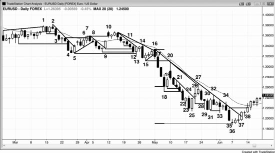
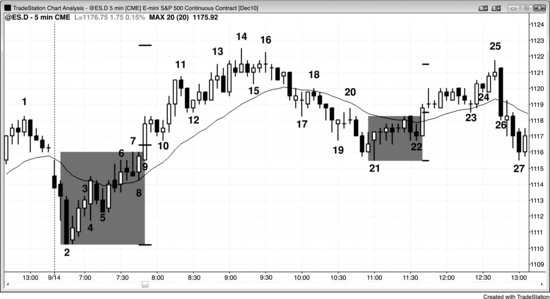
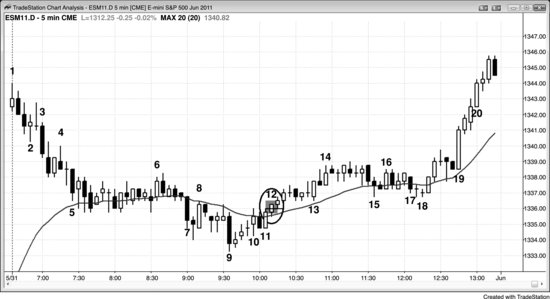

突破成功的最低标准是：交易员在突破时入场，至少能赚到剥头皮者的利润。最强的突破会演变为持续几十根K线的强趋势。有一些早期特征可以帮助判断突破是否足够强，能够到达一个或多个测量移动目标。以下多头突破特征具备得越多，突破走强的概率就越大：

- 突破K线拥有较大的多头趋势实体，影线很小或没有影线。K线越大，突破成功的概率越高。
- 如果成交量达到近期K线平均成交量的10到20倍，后续出现跟随买盘和测量移动的可能性就更大。
- 急速阶段走势凌厉，持续好几根K线，连续突破多个阻力位——均线、前期波段高点、趋势线——每个都突破了好几个 Tick。
- 突破K线形成过程中，价格大部分时间停留在K线高点附近，回调幅度很小，不到正在形成的K线高度的四分之一。
- 有一种紧迫感——你觉得必须马上买入，想等一个回调，但回调迟迟不来。
- 接下来的两三根K线同样拥有多头实体，实体大小至少达到近期多头和空头K线实体的平均水平。即便实体相对较小、影线较长，只要跟随K线（即突破K线之后那根K线）足够大，趋势延续的概率就更高。
- 急速阶段延伸到5至10根K线，期间回调不超过一两根K线。
- 多头突破向上穿越前一个重要波段高点时，超出幅度足够大，让那些在波段高点上方一个 Tick 处挂突破单入场的剥头皮者能赚到利润。
- 急速阶段中，有一根或多根K线的最低价等于或仅低于前一根K线收盘价一个 Tick。
- 急速阶段中，有一根或多根K线的开盘价高于前一根K线的收盘价。
- 急速阶段中，有一根或多根K线的收盘价就在最高价上，或仅低于最高价一个 Tick。
- 多头趋势K线后面那根K线的最低价，等于或高于多头趋势K线前面那根K线的最高价，从而形成微型缺口，这是强势信号。这些缺口有时会变成测量型缺口。虽然对实际交易意义不大，但它们可能（概率60%以上）代表低时间级别艾略特波浪第1浪高点与第4浪回调之间的空间——第4浪可以触及但不能重叠第1浪。
- 整体背景有利于突破方向，例如趋势回调后的趋势恢复，或者在强力突破空头趋势线之后，出现对空头低点的更高低点或更低低点测试。
- 市场近期已经出现过几个强多头趋势日。
- 交易区间内买压不断增强，表现为多根大的多头趋势K线，而且多头趋势K线明显比区间内的空头趋势K线更为突出。
- 第一次回调至少出现在突破后三根K线之后。
- 第一次回调只持续一到两根K线，并且出现在一根并非强空头反转K线的K线之后。
- 第一次回调没有跌回突破点，也没有触及盈亏平衡点（即入场价格）。
- 突破反转了大量近期K线的收盘价和高点。例如，在一个空头通道中出现一根大的多头K线，其最高价和收盘价高于此前5根甚至20根以上K线的高点和收盘价。以收盘价反转的K线数量越多，比以最高价反转同等数量的K线更能说明强势。

以下多头突破特征具备得越多，突破失败并演变为交易区间或反转的概率就越大：

- 突破K线的多头趋势实体较小或中等大小，上方带有很长的影线。
- 下一根K线带有空头实体，是空头反转K线或空头内包K线；该K线收在最低价附近或最低价处，实体大小与突破前K线的平均实体大小相当（不是只有一个 Tick 高的微小空头实体）。
- 整体背景不利于突破方向，例如在交易区间日中向高点反弹测试，但反弹途中出现空头K线、大量重叠的K线、带明显影线的K线，以及多次回调。
- 市场已在交易区间内运行了好几天。
- 突破K线之后那根K线是强空头反转K线或空头内包K线。
- 多头趋势K线后面那根K线的最低价，低于多头趋势K线前面那根K线的最高价。
- 第一次回调在突破后仅第二根K线就出现了。
- 回调持续了好几根K线。
- 回调后的趋势恢复受阻，市场形成一个更低高点并出现空头信号K线。
- 急速阶段仅以一两个 Tick 的幅度突破某个阻力位（如波段高点、空头趋势线或多头趋势通道线），随后便反转下跌。
- 急速阶段勉强突破一个阻力位，还没来得及突破稍高处的其他阻力位就已回调。
- 在前一个波段高点上方一个 Tick 处挂突破单买入的交易员，在回调出现之前赚不到剥头皮者的利润。
- 突破K线形成过程中，回调幅度超过K线高度的三分之二。
- 突破K线形成过程中，回调幅度达到K线高度的三分之一以上，且出现了两次或更多次。
- 回调跌破突破点。任何一根K线的最低价与两根K线之前那根K线的最高价之间都没有缺口。
- 回调跌破急速阶段第一根K线的最低价。
- 回调触及盈亏平衡点止损。
- 有一种困惑感——你不确定突破到底会成功还是会失败。

以上所有特征反过来同样适用于空头突破。以下空头突破特征具备得越多，突破走强的概率就越大：

- 突破K线是一根实体大、影线短甚至没有影线的空头趋势K线。K线越大，突破成功的概率越高。
- 如果成交量达到近期K线平均成交量的 10 到 20 倍，后续抛压延续以及出现测量移动下跌的可能性就会增大。
- 急速阶段走势凌厉、持续好几根K线，同时击穿多个支撑位——均线、前期波段低点、趋势线——而且每个支撑位都被跌穿了很多 Tick。
- 突破K线形成过程中，价格大部分时间停留在K线低点附近，中间的回抽幅度很小，不到该K线不断增长高度的四分之一。
- 有一种紧迫感。你觉得必须赶紧做空，想等一个回调再入场，但回调始终不来。
- 紧接着的两三根K线也是空头实体，大小至少达到之前多头和空头K线实体的平均水平。就算实体相对较小、影线较突出，只要跟随K线（即突破K线之后的那根K线）的实体很大，趋势延续的概率就更高。
- 急速阶段连续扩展到 5 至 10 根K线，期间最多只回撤一根K线左右。
- 空头突破跌破前期重要波段低点时，跌幅足够大，使得以低于该波段低点一个 Tick 的突破单入场的剥头皮者能够锁定利润。
- 急速阶段中有一根或多根K线的最高价，恰好等于或仅高于前一根K线收盘价一个 Tick。
- 急速阶段中有一根或多根K线的开盘价低于前一根K线的收盘价。
- 急速阶段中有一根或多根K线的收盘价就在最低价上，或者仅高出最低价一个 Tick。
- 一根空头趋势K线后面那根K线的最高价等于或低于该空头趋势K线前面那根K线的最低价，从而形成一个微型缺口——这是强势信号。这类缺口有时会演变为测量型缺口。虽然对实际交易意义不大，但它们大致对应的是低时间级别上艾略特波浪第 1 浪低点与第 4 浪回调之间的空间——第 4 浪可以触及但不能与第 1 浪重叠。
- 整体背景本身就有利于突破，比如趋势在回调后恢复，或者在强力跌破多头趋势线之后，价格以更低高点或更高高点的形式测试多头高点。
- 近期已经出现了几个强势的空头趋势日。
- 交易区间内抛压持续增强，表现为大量大实体空头趋势K线，而且这些空头趋势K线明显比区间内的多头趋势K线更醒目。
- 突破后至少走了三根K线才出现第一次回调。
- 第一次回调只持续了一到两根K线，而且是在一根并非强多头反转K线的K线之后才开始的。
- 第一次回调没有触及突破点，也没有触发盈亏平衡止损（即入场价格处的止损）。
- 突破反转了大量近期K线的收盘价和最低价。举例来说，如果市场处于多头通道中，突然出现一根大空头K线，这根突破K线的最低价和收盘价低于之前 5 根甚至 20 根以上K线的最低价和收盘价。空头K线收盘价所反转的K线数量越多，信号就比仅靠最低价反转同样数量K线时更强。

空头突破具备以下特征越多，突破失败并转入交易区间或反转的概率就越大：

- 突破K线的空头趋势实体偏小或中等大小，底部带有很长的影线。
- 突破K线的下一根K线带有多头实体，要么是多头反转K线，要么是多头内包K线；它收在高点附近，实体大小与突破前那些K线的平均实体相当（而不是只有一个 tick 高度的多头实体）。
- 整体背景不利于突破成功——比如价格只是下跌去测试交易区间日的低点，而在这轮下跌途中出现了多头K线、大量重叠K线、带明显影线的K线，以及多次回调。
- 市场已经横盘了好几天。
- 突破K线的下一根K线是强多头反转K线或多头内包K线。
- 空头趋势K线的下一根K线的高点，高于空头趋势K线前一根K线的低点。
- 反转后仅两根K线就出现了第一次回调。
- 回调持续了好几根K线。
- 回调后趋势恢复走势受阻，市场形成一个 HL，伴随多头信号K线。
- 急速下跌仅以大约一个 tick 的幅度跌破某个支撑位（如波段低点、多头趋势线或空头趋势通道线），随即反转向上。
- 急速下跌勉强跌破一个支撑位，但还没来得及跌破稍低处的其他支撑位就已经回升。
- 如果一个交易员在前一个波段低点下方一个 tick 处用卖出突破单做空，那么在回调出现之前，他根本拿不到剥头皮者的利润。
- 突破K线形成过程中，价格回撤超过该K线高度的三分之二。
- 突破K线形成过程中，价格至少回撤了该K线高度的三分之一，而且这种回撤出现了两次以上。
- 回调反弹到突破点上方。任何一根K线的高点与前两根K线的低点之间不存在缺口。
- 回调反弹到急速阶段第一根K线的高点之上。
- 回调触及盈亏平衡点止损位。
- 有一种混乱感。你觉得自己无法判断这次突破到底会成功还是失败。

对交易员来说，突破意味着力量和新趋势出现的可能。突破之前是一段双边交易——多空双方都认为当前价位有价值，也都愿意在此建仓。突破发生时，双方达成了新的共识：市场应该在另一个价位才能找到价值，于是价格快速朝那个新价位移动。市场偏好不确定性，一旦出现确定性就会迅速寻找新的不确定区域。突破就是一段确定性时期——空头突破中，多空双方都确信突破区间内的价格太高了；多头突破中，双方都确信价格太低了。跟随突破的成功概率通常在 60% 到 70% 之间。市场快速移动，直到找到一个多空双方都认为有交易价值的价位。到了那个价位，不确定性就重新回归，没有人知道哪一方会赢、会主导下一次突破。不确定性是交易区间的标志，因此突破本质上就是在寻找一个交易区间、寻找不确定性、寻找等距移动中 50% 的方向概率。急速阶段之后的通道，通常勾勒出随后形成的交易区间的大致顶部和底部。价格在通道中运行时，等距移动的方向概率在不断削弱，到通道末端时实际上已经有利于反转方向。这是因为交易区间的突破通常会失败，概率倾向于价格回到区间中部——也就是方向概率为中性的位置。区间中部就是突破的目标，但在它形成之前，你无从知道它在哪里。

突破从一根趋势K线开始。这根K线可大可小，但与近期K线相比，通常至少算得上偏大。请记住，所有趋势K线都应该被视为突破、急速、缺口和高潮。当它偏小时，很容易忽视它的重要性，但如果后面跟着一些横盘走势，随后市场开始稳步朝一个方向运动，那说明突破其实已经在进行了。最容易辨认的突破是：一根异常大的趋势K线迅速把价格推出交易区间，随后很快又跟上同方向的其他趋势K线。不管突破是一根趋势K线还是一连串趋势K线，它都是急速阶段。前面提到过，几乎所有趋势都可以看成某种形式的急速与通道趋势。举例来说，如果一根多头突破K线收盘强劲，随后几根K线也收盘强劲、影线很短或没有、高点和低点呈趋势排列（没有回调K线），而且相邻多头趋势K线的实体之间几乎没有重叠，那么在市场反转回到突破起点之前，价格很可能会在某个时刻超过当前位置。如果趋势延续下去，动能最终会放缓，通常会形成某种通道。

交易中最重要的概念之一是：大多数突破都会失败。正因如此，每次都顺着突破方向入场，是一种注定亏钱的策略。不过，确实有一些价格行为信号能提高突破成功的概率。比如，一段强势的空头趋势之后，价格两段式回调到均线附近，这时在熊旗下沿做空突破就是合理的交易。但如果市场没有处于趋势中，K线大量重叠，很多K线影线很长，说明市场处于平衡状态。多头和空头都愿意在这里建仓，交易区间正在形成。这时如果出现一根多头趋势K线，推到交易区间顶部甚至更高，那些原本乐意在区间中部做空的空头会在这个更好的价位更积极地卖出。同时，那些原本乐意在区间中部做多的多头，面对更高的价格反而会犹豫，倾向于在区间顶部尽快获利了结。多头和空头的这种行为，在区间中部形成了一种磁吸效应，使得大部分交易集中在区间中部附近。即便市场最终成功突破，走出大约等于区间高度的测量移动，这种磁吸效应仍然倾向于把价格拉回区间内。这正是最终旗形反转如此可靠的原因（详见第三本书）。

随便打开任何一张图表，你都会看到大量实体较大、影线较小的多头和空头趋势K线。每一根都是一次突破尝试，但几乎都没能引发趋势，交易区间依然延续。在 Emini 的 5 分钟图上，这些K线很可能 (60%+) 代表着程序化的买卖指令在试图推动市场。有些算法专门押注这些趋势K线失败，预期大多数突破不会成功。有经验的交易员在判断突破可能 (60%+) 失败时，也会这么做。比如，突破以一根大阳线的形式出现，这些程序可能会在该K线收盘时做空、在其高点上方做空、在随后一两根K线收盘时做空，或者在它们低点下方做空。如果押注失败一方（卖方）投入了足够多的程序化资金，就会压倒试图启动多头趋势的那些程序，交易区间继续维持。最终，总会有一次突破成功。突破K线会很大，形成过程中的回调会很小，而且随后几根K线会有良好的跟随。那些试图押注失败的程序亏了，它们会平掉亏损头寸，进一步推动趋势。这种强势会吸引其他趋势交易者，其中很多是动量交易者，一看到动量就迅速入场。

一旦所有人都确信市场已经进入趋势，价格可能会在出现回调之前走出很远。为什么？假设市场以三根强多头趋势K线形成的急速阶段突入强多头趋势。交易者相信价格不久后还会更高，但对短期内是否会更低没有信心。这让空头回补平仓，进一步推高市场。那些仓位不足的多头相信短期内市场会走高，认为直接按市价买入或在 2 到 3 个 tick 的回调时买入，比等待 8 到 10 个 tick 的回调或等价格回到均线更划算。这同样推高了市场。由于多头和空头实际上都在市场上涨过程中买入，回调迟迟不来，或者至少要等到价格远远超出当前位置、5 根K线甚至更多之后才会出现。

第8章会更详细地讨论这个问题。在突破行情中，交易员愿意随时以市价买入，因为他们相信成功概率超过50%，而且预期利润至少不低于所承受的风险。当突破很强时，概率通常在60%到70%甚至更高。假设在5分钟 Emini 图表上，交易员在急速阶段的最高点买入，此时急速顶部比底部高出4个点，他们认为市场继续上涨4个点的概率可能在60%以上——也就是说，价格先涨4个点的可能性大于4个点的保护性止损先被触发的可能性。怎么确认这一点？因为如果成功率远低于60%，把风险设成跟回报一样大在数学上是不划算的，机构不会做这种交易。既然市场还在涨，说明机构确实在做多。只要价格保持在急速底部上方，这笔交易就还成立，所以他们的风险就是到急速底部的距离。他们知道急速阶段通常会走出大约一个测量移动的幅度，所以利润目标（也就是回报）跟风险差不多相等。如果急速再涨2个点才停下来，那急速的高度就变成了6个点。如果这就是急速阶段的终点，他们会假设市场有大约60%的概率先涨6个点，而非先跌6个点。这意味着所有在更低位置买入的多头，都有60%的概率看到市场再涨6个点，而他们4个点的保护性止损还不会被触发。比如，那些在急速涨了4个点时买入的多头，现在是冒4个点的风险去博8个点的利润，成功率是60%，这是一个非常好的交易方程。他们预期市场有60%的概率测试急速收盘价上方6个点的位置，也就是比入场价高8个点，给出8个点的利润目标。

当突破成功并形成趋势后，初始的快速运动结束，动能开始放慢，双向交易的迹象逐渐显现，比如K线重叠增加、影线变长、出现反方向的趋势K线以及回调K线。尽管趋势可能持续很长时间，但这一段走势通常最终会被回撤，成为交易区间的一部分。比如在急速与通道的多头趋势形态中，急速是突破部分，通道通常成为交易区间的第一段，所以通常会被回撤。典型情况是，市场最终一路回调到通道的起点，完成新交易区间的第二段。在这个多头突破的例子中，市场通常会尝试在那个支撑位反弹，形成一个双底牛旗，有时引发对新区间上方的突破，有时演变成一个持续较久的交易区间，比如窄交易区间或三角形态。较少见的情况是随后出现反转。

在5分钟 Emini 图表上，每天通常有很多突破尝试，但大多数在一两根趋势K线后就失败了。这些突破很可能是某家机构启动的程序化交易，但被其他机构的反向程序所压制。当足够多的机构在同一时间沿同一方向运行程序交易时，它们的合力就能把市场推到新的价位，突破就会成功。不过没有什么是百分之百确定的，即使是最强的突破也有大约30%的失败率。

当突破非常强劲时，会出现3根或更多趋势K线，影线很短，K线之间几乎没有重叠。这说明交易员不愿意等待明显的回调再入场。他们担心回调可能迟迟不来，等到出现时市场已经跑出很远的距离，所以想确保至少抓住趋势的一部分。他们会以市价入场，也会在1到2个 tick 的微小回调上入场，这些源源不断的订单赋予趋势力量，同时阻止明显回调的形成。

突破K线往往伴随着大成交量，有时成交量会达到普通K线的10到20倍。成交量越大、急速阶段包含的K线越多，出现明显跟随的可能性就越高。在突破之前，多头和空头都在逐步建仓，争夺市场主导权，各自试图在自己的方向上制造成功的突破。一旦突破方向明确，亏损的一方会迅速认赔平仓，而获胜的一方会更加积极地加仓。结果就是出现一根或多根趋势K线，通常伴随着高成交量。成交量并不总是特别高，但当它达到近期K线平均水平的10倍以上时，突破成功的概率——也就是后续多根K线持续跟随的概率——会更高。另外，在几根K线内就失败的突破有时成交量也会异常高，但这种情况不太常见。成交量的可靠性不足以值得专门去跟踪，而且组成急速阶段的大趋势K线本身就已经告诉你突破是否可能成功了。试图额外考虑成交量，大多数时候只会分散你的注意力，影响你的最佳交易状态。

所有成功的突破都应被视为急速走势，因为大多数突破之后会形成通道，构成急速与通道趋势形态。不过，突破也可能失败——如果突破前的交易区间本身就是趋势中的一个旗形，那它就变成了最终旗形。事实上，大部分突破确实会失败，只不过突破K线太不起眼，大多数交易员根本没注意到曾有过突破尝试。还有一种不太常见的情况：突破之后市场进入一个窄幅交易区间，这通常（60%以上的概率）意味着趋势将继续延伸，但有时窄幅交易区间会朝相反方向突破，导致反转。

突破可以是一根大趋势K线，也可以是一连串大的或小的趋势K线，而且突破通常（60%以上的概率）会成为前面讨论过的某种趋势形态的一部分。比如，开盘即出现的趋势空头走势，很可能（60%以上的概率）是对前一天某个形态的向下突破。如果趋势走得很有序，后面可能跟着一个持续几小时的窄幅交易区间，然后当天演变为趋势恢复型空头走势，一直延续到收盘。反过来，如果突破不断加速下行，每一根K线的斜率都变得更陡，图表呈现出抛物线式的高潮特征，那之后可能（60%以上的概率）先出现一波回调，再进入通道。这样一来，整天就变成了急速与通道空头趋势日。

有时候，市场在强趋势中运行了很多根K线之后，会在趋势方向上出现一根异常大的趋势K线。这根大K线通常（60%以上的概率）意味着两种可能：一是突破进入一个更陡、更强的趋势，或者至少是趋势中新的一腿；二是标志着趋势的高潮式终结。如果市场只回调了几根K线，而且没有回撤突破K线太多的幅度，那么突破成功的概率就比较大，交易员会在高1回调处入场做多——如果这是多头突破的话（空头突破则在低1处做空）。

即使回调超过了突破点，趋势仍然可以延续，但回调越深，突破失败并引发反转的可能性（60%以上的概率）就越大。在这种情况下，那根大K线代表的是趋势的高潮式终结，而非突破。如果回调较深，交易员可能会犹豫大约一个小时，不敢顺势入场。举个例子，假设一根大的多头趋势K线突破了波段高点或交易区间，但随后回调较深，可能跌到波段高点顶部略下方，这时交易员就拿不准突破究竟是失败了，还是只是涨得有些过头。在这种情况下，多头往往不急着买入，大约会等10根K线左右，市场经常会在此期间进入一个小交易区间。他们不会去买高1，而更可能（60%以上的概率）等高2出现，尤其是大约一个小时之后形成的高2。如果这个交易区间始终保持在均线之上，而且大约过了一个小时，多头就会寻找两段式的横盘或向下回调来做多。有时候横盘走势之后还会出现第二腿下跌。这第二腿可能带来新高，也可能导致趋势反转和更多的抛售。

一旦出现回调——本质上就是一个小交易区间——交易员就会寻找趋势恢复的机会。回调之后的突破，初始目标大约是一个测量移动幅度，大致等于该交易区间的高度。很多交易员会在那个区域部分或全部止盈，而激进的逆势交易员则会在那里建立新仓位。

最容易识别的突破失败，是市场迅速掉头、根本没有像样地尝试继续朝突破方向运行。当同时存在其他反转信号时，这种情况更容易出现，比如市场突破趋势通道线之后伴随一根强反转信号K线向下反转。

突破的对象可以是任何东西：趋势线、交易区间、当天或前一天的高低点。具体突破什么并不重要，因为交易方法完全一样。突破失败就押注失败方向入场；如果反转尝试也失败了——也就是变成了突破回调——就重新顺着突破方向入场。只有在突破非常强劲的时候，才直接追着突破入场。举个例子：假设有一个强多头趋势，然后出现了两根K线的回调，形成高1做多建仓形态。交易员可以在前一根K线高点上方一个Tick处买入，还可以在价格突破到新高时加仓，具体做法是在旧高点上方一个Tick处挂买入突破单。不过通常（60%以上的概率）来说，买回调或者做空失败的突破是更好的选择。

大多数交易日里，交易员会把新的波段高点和波段低点视为潜在的押注失败建仓形态。但在强趋势日，突破通常（60%以上的概率）伴随着巨大的成交量，哪怕在1分钟图上回调也非常小，顺势交易员显然掌控着局面。比如，当多头趋势非常强时，价格行为交易员会在高1和高2回调处买入，而不是等到突破前高才入场。他们总是在尽可能降低交易风险。不过，一旦强趋势确立，无论以什么理由顺势入场都是好交易。在强趋势中，每一个价位都是顺势入场点，所以随时可以市价入场，设一个合理的止损即可。

如果突破出现了一根大趋势K线，但这根K线还没收盘，你就得做个决定。假如你已经把一部分仓位剥头皮出场，正在考虑要不要让剩余仓位做波段，这时一定要想清楚自己还承受着多少风险。有个办法可以帮你判断该不该继续持有波段仓位：问自己，如果此刻手上没有仓位，你会怎么做？如果你愿意以市价单入场，按照波段的仓位大小和波段的保护性止损去做这笔交易，那就继续持有。如果你觉得在此处以这么大的风险市价入场太冒险，那就应该立刻市价出场。

突破发生时，买方和卖方都会把它当作机会。举个例子，假如市场形成了一个波段高点然后回调，当价格再次涨过前一个波段高点时，多头和空头都会入场。多头会买入突破，因为他们把它看作强势信号，相信价格还会继续涨到足以让他们获利离场。空头同样把突破视为赚钱的机会。比如，空头可能会在前高位置或者高出几个 Tick 的地方挂限价单做空。如果市场反转下跌，他们就能获利出场。但如果市场继续上涨，而他们又认为价格可能会回调来测试突破点，就会加仓做空。由于大多数回调都会一路回到前一个波段高点附近，他们可以在突破回测时把第一笔空单大致以盈亏平衡出场，而第二笔在更高位置建立的空单则能获利。

交易员一想到突破，脑海里通常浮现的是交易区间突破。但实际上，突破的对象可以是任何东西。有一种常见但很多交易员会忽略的突破：旗形向意想不到的方向突破——比如熊旗向上突破，或牛旗向下突破。举个例子，如果当前处于一个还算强的空头趋势中，交易员还不确定是否已经出现了可交易的低点，这时他们看到一个熊旗正在形成，就可能开始在前几根K线低点下方买入，预期低 1 然后低 2 甚至低 3 都会失败。有时候这个熊旗形态不错，低 2 做空或楔形熊旗做空信号被触发，但随后立刻反转上涨，走出一两根多头趋势K线。这种突破通常会形成一个测量型缺口，进而产生一段测量移动上涨。交易员会在突破时入场，也会在任何小幅回调时入场；由于空头被套住了，短期内他们不太可能急于再次做空，至少要等市场走出两段上涨腿之后才会考虑。牛旗在多头趋势中的情况则正好相反。

有一种特殊的突破，有时会在趋势日的最后一个小时出现。比如，如果市场一路下跌、完全没有回调的迹象，在空头通道底部可能会出现一两根大的空头趋势K线突破通道下沿。也许会有一个小幅回调，然后再次短暂突破到新低。另一些时候，市场只是毫不停歇地一路下跌到收盘，并没有出现大的空头趋势K线。这两种情况背后可能发生的是：交易公司的风控经理在告诉那些一直在抄底的交易员，他们站错了边，必须立刻以市价平掉仓位。这种急跌通常不会有太多跟随，因为它主要来自被迫卖出。可能有一些聪明的程序化交易者会预判到这种情况并试图从中获利，设计程序短暂做空，加大抛售高潮的力度。动量程序也是强趋势的组成部分。经过一两波抛售高潮之后，收盘前可能会有反弹，也可能没有。在以强劲的多头急速走势或通道收尾的日子里，情况正好相反——风控经理在告诉交易员必须在收盘前买回亏损的空头仓位，随着市场快速上涨，动量程序检测到这个趋势后也会持续买入，只要动量还在延续。

交易员的目标之一就是跟着机构做。很多突破是由大趋势K线构成的，这些K线往往有全天最大的成交量。这说明机构正在最积极地交易，而它们这么做是因为预期这波走势会有持续的跟随。突破发生时，市场给人的感觉可能很吓人、很情绪化，但机构把它看作绝佳的机会——成交量就是证据——你也应该这样看。要努力学会交易突破，因为突破的交易者方程非常好。如果有必要，就先只用四分之一仓位（"无所谓"的仓位大小）来练手、积累经验。这类走势的幅度往往大到即使只用四分之一仓位，赚到的钱也能跟满仓做普通交易差不多。

**图 2.1** 突破每天都会发生很多次

如图2.1欧元/美元外汇日线图所示，每张图表上每隔几根K线就会出现某种形式的突破。严格来说，只要一根K线的高点超过之前任何一根K线的高点，或低点跌破之前任何一根K线的低点，就构成了对那根K线的突破。每一根趋势K线本身就是一次突破（第一册讲过，每根趋势K线都是急速、突破、缺口和高潮）。这张图上标注了许多不同类型的突破和失败。

K线1向上突破了趋势通道线，随后下一根K线跌破了它的低点，形成了一个两K线反转建仓形态，并在K线3的入场K线处被触发。K线2是第二次尝试向上突破多头通道，它也向上突破了另一个两K线反转，但突破失败，市场反转下跌。

K线4跌破了一个波段低点，同时也是从K线2开始的第六根K线，构成一轮卖出高潮。这根K线振幅较大且影线较短，可能代表一个卖出高潮，需要先回调一段才会继续有卖出跟随。事实也正是如此——K线5是一根强多头反转K线，使K线4变成了一次失败突破。

市场经过一个两段式回调回到均线后，K线8突破了这个熊旗。

K线9向上突破了空头趋势线。

K线10向上突破了一个波段高点，但下一根K线跌破了它的低点，突破宣告失败。

K线12跌破了K线9的入场K线以及它前面的信号K线。

K线13试图反转向上，制造一个失败突破，但这个失败突破本身又失败了——K线14再次反转下跌。K线14同时也是对微型趋势线突破和多头反转K线突破的向下反转。当一个失败突破未能令市场反转时，它就变成了突破回调。

K线16向上突破空头趋势线后失败，反转下跌形成了一根外包阴线反转，跌破了此前三根K线构成的熊旗趋势线。

K线16到18形成了一组四K线突破，由强空头趋势K线组成——实体大、影线小、重叠极少。那些在交易区间内逐步加仓做多的多头终于认输，不仅停止买入，还急于在不等回调的情况下迅速卖出手中大量的多头仓位。他们不相信回调会很快出现，反而确信市场几根K线内还会更低。这意味着按市价出场、或者在K线内一个极小的回调处出场就是他们最好的选择。多头的清仓加上随后几根K线内买盘的缺失，共同助推了这波抛售的力度。突破如此强劲时，后面通常（60%+）会跟随一段通道，而且往往会形成一个测量移动——从急速阶段第一根K线的开盘到最后一根K线的收盘。K线36的低点刚好落在该测量移动的投射点之下，通道就此结束。随后市场通常（60%+）会向上回测急速阶段之后第一个合理的买入信号，也就是K线19那根多头内包K线的高点。如果到达那里，接下来还会尝试测试空头通道的起点，也就是K线20的高点。

K线20是一次试图令四K线突破失败的尝试，但突破如此强劲时，通常（60%+）会有跟随，失败的尝试一般本身也会失败，最终只变成突破回调——这里就是如此。市场在距K线15突破点和均线还差一点的位置就重新下跌了。每当市场在未触及阻力位的情况下就转头下跌，说明空头非常强势，因为他们不愿等阻力位被触及就提前动手。空头担心多头可能根本推不到那个位置，所以提前在阻力下方挂出了限价单，这是空头迫切出手的信号。突破点（K线15低点）与突破回调高点（K线20高点）之间的缺口，通常（60%+）会成为一个测量型缺口，往往大约处于整个下跌的中点。空头趋势始于K线2的高点，市场最终跌到了该缺口下方，跌幅超过了K线2高点与测量型缺口中点之间的距离。这次突破以及突破回测时强劲的向下反转，确立了空头趋势的极强格局，交易员在当天剩余时间里应该只找做空机会。也许偶尔可以做一两笔多头剥头皮，但前提是交易员能做到一旦K线跌破前一根K线低点——表明小幅回调可能结束——就立刻反手做空。顺便说一下，艾略特波浪交易员会把那个回调视为第4浪的顶部，突破点视为第1浪的底部。如果中间那段向下的第3浪确实是第3浪——它通常（60%+）是趋势中最强的一浪——那么这两者不能重叠。

交易员的目标之一是跟机构做同样的事。许多突破由大趋势K线组成，这些K线往往承载了当天最大的成交量。这正是机构交易最活跃的时段，它们如此积极地交易，是因为预期这波行情会有持续的跟随。尽管大突破发生时市场让人感觉惊恐和情绪化，但从成交量可以看出，机构把它当作绝佳的机会——你也应该这样看。要学着去做突破交易，因为它们有出色的交易者方程。如果必要的话，先用四分之一的仓位（"无所谓"仓位）来练手积累经验。行情幅度往往足够大，即使是小仓位，盈利也能赶上你用满仓做一笔常规交易的水平。

K线22是一根大幅空头趋势K线，跌破了一个四K线通道的底部，可以算作第三次连续卖出高潮（第一次是K线14，第二次是延续到K线18的四K线急速下跌）。两到三次连续高潮之后，市场通常会出现至少10根K线的两段式回调。但这里情况不同——那段四K线空头急速下跌是当天最具压倒性的特征，也是一轮强突破的起点。没错，它本身就是急速下跌，也就是卖出高潮，但幅度太大了，市场性质已经改变，之前的计数必须全部归零重来。一旦这段急速形成，交易员就能确定市场会有一波强力下跌，而急速之后最常见的形态就是通道。通道在修正之前往往有三次下推，这里也不例外。三次下推分别是K线18、25和36，随后是一波弱反弹直到收盘。

K线23是K线22卖出高潮以及过冲跌破三K线空头通道底部后的一次反转尝试。但大格局如此偏空，仅凭这几根K线就找做多机会是个错误。市场始终在尝试反转趋势，实时盘面上看到底部形态时很容易被情绪带进去；但你绝不能忽视大格局。那段四K线空头急速非常强劲，Always-in 的方向仍然是做空。这个位置上的任何筑底尝试几乎必然只会变成熊旗，事实也正是如此。市场始终有惯性，处于趋势中时，应该预期所有反转尝试都会失败。

K线25是跌破K线20至21通道后的第二次向上反转尝试。由于两次尝试的信号K线都有较强的多头实体，市场可能会回测均线。但大多数交易员不应该做这笔交易，而应继续持有空头仓位。很多时候交易员会逆势剥头皮赚个1个点，然后却没有反手做空，结果错过了顺势交易4个点甚至更多的利润。如果你刚刚做多，要迅速把思路切换回做空确实很难；如果做不到这一点，就不要做逆势剥头皮，以免错过接下来的波段下跌。

K线26如预期般突破了通道顶部。

K线27突破了空头趋势线，也突破了K线18的突破点，但随即失败，下一根K线就反转向下。

K线28是一个三K线熊旗的突破。

K线29跌破了K线26做多入场K线的低点，但在低点找到了买盘，长影线就是证据。

K线32再次测试了空头趋势线，也就是又一次突破尝试，但同样失败了。

K线35是又一根大幅空头趋势K线，因此可能是又一次卖出高潮。当市场在短时间内接连形成第二次、第三次卖出高潮时，出现至少一波两段式回调的可能性很大。

K线36跌破了测量移动目标位，但没有引来卖盘。相反，市场进入了平静的横盘交易，这可能暗示K线22至34熊旗的突破失败了。长期空头趋势之后出现的水平熊旗往往会变成最终旗形，后续通常至少有两段横盘到向上的走势。K线36也是空头通道中的第三次下推，通常至少会引发一次反转尝试。

K线36之后的那根K线突破了K线36的高点，成为做多的入场K线。

K线37是一根突破空头趋势线的多头突破K线。

K线38突破了K线35那根强空头趋势K线的高点。很多空头的买入突破单就设在这根K线上方，因为它的大幅空头实体代表着强烈的抛压。一旦市场涨过它的高点，大量空头就会认为卖方力量已经不足以继续持空，于是在收盘前买回空头仓位（空头回补）。

**图 2.2** 旗形可能沿不太可能的方向突破

旗形有时会沿出乎意料的方向突破，并产生测量移动。在图2.2中，一个楔形熊旗在K线9处向上突破后失败。K线7突破点的高点与K线10突破回测之间的测量型缺口，带来了一个几乎完美的向上测量移动。

K线3是一个低1做空建仓形态，但在三根强多头实体K线和K线2的卖出高潮之后，它很可能失败。激进的交易员会在K线3低点及其下方挂限价买单做多。K线5是低2做空的入场K线，但在K线4那根强外包阳线之后，市场可能正在形成当天的最低点。同样，激进的交易员会在低2信号K线的低点或其下方做多。K线7是楔形熊旗做空的信号K线，但市场处于多头通道中，K线4的外包阳线使得 Always-in 的方向为做多。空头不应该在K线7下方做空，而应等待市场是否形成一个LH。多头在K线8上方做多，预期楔形熊旗失败后会产生向上的测量移动。

随后在K线22上方出现了一个失败的低2熊旗做多建仓形态，入场K线是一根多头趋势K线。这次突破同样带来了向上的测量移动。K线21是多头日中一个空头通道的底部，K线22是该通道突破后的突破回调，因此警觉的交易员会认为这个低2很有可能失败，并引发对当日高点的测试。

K线26的低点跌破了之前12根K线的低点，也跌破了之前13根K线的收盘价。它的收盘价同样低于这些低点，这一点很重要，因为收盘价低于某个低点比单纯的低点更低更能说明力量。被反转的低点和收盘价越多，反转的力度就越强。在之前那12根K线中做多的每一个交易员现在都持有亏损头寸，只要出现一点小反弹就会急着卖出平多。很多人在下一根K线就卖了，形成了该K线顶部的影线。而且这些多头在接下来至少几根K线内不太可能再找做多机会。

**图 2.3** 小型突破K线

如图2.3所示，虽然像K线3和K线19这样的大突破K线经常引发大趋势，但有时像K线12这样的小突破K线也能开启一段持续性的走势。K线9的空头急速下跌之后，交易员开始思考反弹到K线11的走势是否会变成均线处的低2熊旗（K线10和11是两次上推）。但市场没有向下突破，反而向上突破了K线10和K线11的双顶（这使得这段反弹成为一个最终旗形——它是空头趋势的最终旗形，尽管它从未向下突破）。K线12的突破K线很小，但已经足以让交易员开始放弃"反弹到K线11只是熊旗"的想法，转而考虑K线9是否是一个衰竭型卖出高潮，后续可能修正10根K线或更多。K线12之后的那根K线同样很小，但有两个强势信号：多头实体，以及低点没有跌破K线11的高点（即突破点）。虽然反弹到K线14的幅度不大，但它是一段不可阻挡的多头趋势，成为两段上涨的第一段（第二段始于K线18与K线15形成的双底，以及K线13、15、18的低点构成的三角形）。
