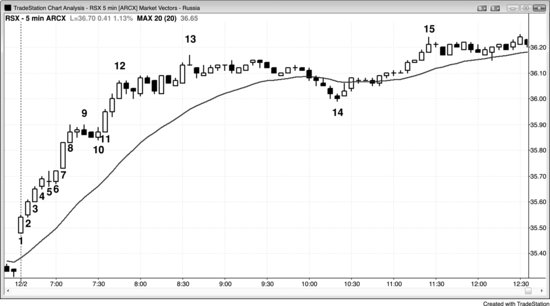
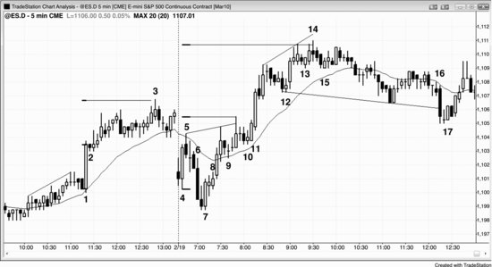
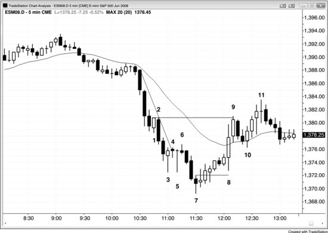

大多数市场的5分钟图上，每天至少会出现几次成功且有意义的突破。大多数突破都以一根趋势K线起步，这根K线通常比前面的K线大，没有影线或影线很短。最强的突破会连续出现一系列趋势K线，彼此之间几乎没有重叠。举个例子，Emini 5分钟图上出现强多头突破时，突破K线一收盘，就有交易员会挂限价单，在那根K线的收盘价买入。如果下一根K线在这个价位开盘后直接上涨、没有跌破这个价位，那些限价单很可能（60%+）成交不了，这些看多的交易员就被套在场外了。他们会有一种紧迫感，害怕错过这波行情，想尽快做多——要么直接下市价单，要么挂限价单在任何一两个 Tick 的小回调处买入，或者切换到更小的时间周期，比如1分钟或2分钟图，在高1或高2回调处入场。这在情绪上很难做到，就好比站在高台跳板上往下跳。两种情况的应对方法其实一样：捏住鼻子、闭紧眼睛、全身绷紧，相信自己不会摔得太惨，那种难受的感觉很快就会过去。如果你交易的是 Emini，就在小回调处买入，然后靠保护性止损来兜底。如果这是一次好的突破，止损不会被打到，接下来好几根K线内你很可能（60%+）赚到2点甚至6点以上，而风险大约只有2点。

如果突破K线之后没有连续出现几根强的多头趋势K线，而是一两根K线突破后紧跟着一根小K线、十字星、内包K线、长影线K线或空头趋势K线，那这次突破就可能（60%+）失败。失败后可能出现几种情况：价格回到交易区间内、趋势反转变成空头趋势，或者只是一次失败的反转——回调了一两根K线后，向上的走势继续恢复。突破成功时，会形成某种形式的急速与通道趋势。

突破入场这件事，收盘后看图好像很简单。但在实盘中，建仓形态往往要么不够清晰，要么虽然清晰却让人害怕。在突破发生时入场，或者等突破K线收盘后再入场，都很难执行，因为突破急速阶段的幅度往往很大，交易员必须迅速决定承受比平时大得多的风险。结果很多人选择等回调再进。即使他们缩小仓位，让实际的美元风险跟平时一样，光是想到要拿两三倍的 Tick 数当风险，就已经让他们退缩了。等回调入场同样困难，因为每一次回调的起点都是一个小反转，交易员会担心这个回调可能是一波深度修正的开始。如果反转只持续了一两根K线、形成了突破回调的入场机会，他们又不敢进，因为担心市场可能正在进入一个交易区间——多头突破时怕买在顶部，空头突破时怕卖在底部。趋势会想尽一切办法把交易员挡在门外，这是让他们整天追着市场跑的唯一方式。建仓形态简单明了时，行情通常只是一个小幅快速的剥头皮机会。行情要走很远的话，它一定是模糊的、让人难以下手的，这样才能把交易员留在场外，逼他们去追。

评论员经常会讨论某只股票一两天的下跌，通常是因为坏消息——比如令人失望的财报或管理层变动。他们在判断这条消息到底只是一波强多头趋势中的一天意外，还是会改变这只股票未来几个月的前景。如果他们认为多头趋势继续的概率更大，就会在空头急速阶段的底部附近买入。如果他们觉得消息的冲击严重到足以让股价承压几个月，就不会买入，反而会在下一次反弹时卖掉手里的多头仓位。技术派交易员把这波下跌看作一次空头突破，从突破强度的角度来评估。如果这波急速看起来很强，他们会在反弹时做空，甚至在K线收盘处做空，预期出现更大的急速、急速与通道，或其他形式的空头趋势。如果相对于多头趋势来说这波急速显得弱，他们就会在空头趋势K线的收盘价和低点附近买入，预期这是一次失败的突破，趋势反转的尝试最终只是又一个多头旗形。

**图 3.1** 连续出现多根趋势K线的突破通常很强

最强的突破带有一种紧迫感，会连续出现好几根趋势K线。图3.1中RSX（Market Vectors俄罗斯ETF）的始于开盘的多头趋势日就是这样。市场向上突破了前一天最后一个小时形成的交易区间。注意看，突破过程中好几根K线的低点都没有跌破前一根K线的收盘价。这意味着，那些等K线收盘后才用限价单在收盘价位置挂买入的多头，很可能（60%以上）根本买不到，他们会被套在场外。市场正在快速远离他们，他们自己也清楚这一点，之后就会找任何理由做多。正是这种紧迫感推动市场急速拉升。这一系列K线应被视为一个多头急速阶段。多头急速阶段之后通常（60%以上）跟着一个多头通道，两者合在一起构成一个急速与通道多头趋势。

K线6是一根内包K线，也是第一次暂停，在始于开盘的多头趋势日中，这通常（60%以上）是一个可靠的高1做多入场点。不过，当趋势强到这种程度，你直接按市价买入就行，或者随便找个理由都能买。去年亚马逊下过雨？那就买。你孩子高中篮球队有人得分了？那就再买点。你必须做多并一直持有，因为市场超过70%的概率会走出一段测量移动——幅度等于或大于急速阶段的大致高度（从K线1的低点或开盘价到K线4或8的收盘价或高点，再把这个幅度加到这些K线的收盘价上）。确切的概率永远不可知，但根据经验，这是一个非常强的突破，测量移动实现的概率很可能（60%以上）超过70%。以K线1的开盘价到K线4的收盘价计算的测量移动目标，恰好在K线8顶部市场暂停的位置。以K线1的开盘价到K线8的收盘价计算的测量移动目标，在收盘时仅被超出3美分（图中未显示）。

**图3.2** 成功的突破需要跟随

在5分钟Emini图表上突破很常见，但像图3.2中K线1和K线11那样强劲、成功、有好几根跟随K线的突破，一天通常（60%以上）只出现一到三次。

K线1向上突破了一个小楔形的顶部，上下都有小影线，是一根大的多头趋势K线。

K线2是一根小的空头内包K线，既是失败突破做空的信号K线，也是突破回调做多的信号K线。要记住，内包K线就是一根K线构成的交易区间，是向任一方向突破的建仓形态。突破经常导致测量移动，一个常见的模式是：从急速阶段的开盘价或低点到急速阶段的收盘价或高点的距离，再从急速阶段的收盘价或高点向上投射。这里，到K线3当日高点的走势，就是以K线1突破K线的开盘价到收盘价计算的测量移动。

开盘区间经常导致突破后走出测量移动，但测量点通常（60%以上）有好几种可能，最好先盯住最近的目标。交易员应该关注K线4的低点到K线5的高点。一旦这个测量移动目标被超过，就应该关注其他可能性。失败的楔形经常导致测量移动，但交易员需要考虑每一种能看到的可能。比如，他们可能会看K线7的低点到楔形顶部（K线9之后第二根K线）。不过，楔形是从K线4开始的，K线7的更低低点可以被看作是对K线4实际低点的过冲。市场试图从K线4的低点开始形成一个楔形熊旗，向上推了三次（K线5，以及K线9前后的两次急速上涨）。以K线4的低点到楔形顶部计算的测量移动目标，在K线14当日高点处仅差1个Tick。找这些测量移动目标的目的是确定合理的止盈区域，如果出现强的逆势建仓形态，还可以在这些位置反向入场。

K线6强力向下突破，创出当日新低，但随即被K线7的外包阳线（多头趋势K线）反转上去。交易员看到K线8附近的横盘走势时，会想到这可能是一个突破回调（即熊旗），后续还会继续下跌。分析的时候，必须同时考虑多头和空头两种情形。结果市场并没有继续下跌，反而快速上涨。这么强的一根空头趋势K线，怎么会这么快就被反转？如果机构手上有大量买单，它们肯定想以最好的价格成交。假如它们判断市场大概率（60%以上）会先测试K线4的低点再涨上去，那它们就会等测试完成后再买入。当价格接近它们的买入区域时，它们不会急着出手，因为它们相信接下来几分钟内价格还会更低一点，所以这些非常积极的多头暂时退到一旁观望。最强买方的缺席导致了卖方力量失衡，市场不得不快速下跌，好让空头找到愿意接盘的对手方，结果就是出现一根大阴线。一旦市场跌到多头认为不会再跌的位置，它们就突然冒出来大举买入，势不可挡，完全压制住空头。空头意识到发生了什么，于是停止做空，转而买回空单。这意味着多头和空头都认为市场会涨，由此产生了60%以上的方向性概率，倾向于等距离上涨。换句话说，市场有60%以上的概率先涨2个点再跌2个点，先涨3个点再跌3个点。实际上，市场向上突破开盘区间并完成一段测量移动、期间不出现2个点回调的概率可能还不止60%，这对多头来说是一笔很划算的交易。

K线9和K线10都是创出当日新高后的突破回调。

K线11是对从K线5高点起始的楔形的突破，构成一个强劲的两K线多头急速，之后又有两次上推。急速之后的多头通道通常（60%以上）有三次上推，其中急速顶部算第一次。

K线12是强多头趋势中的两段式高2突破回调，是一个很好的做多入场形态。

K线13是另一个突破回调，但因为它可能触发第三次上推，多头需要保持谨慎。K线14一旦超过做多入场价5个tick，很多多头就会把止损移到盈亏平衡点，因为他们在考虑K线14这个楔形高点会不会引发一段较长的（10根K线以上）两段式回调，甚至趋势反转。所以K线15对多头来说是个差信号——他们预期任何反弹都会在K线14的楔形高点下方结束，之后至少还有一段下跌。激进的交易员在K线15高点上方做空，因为一个大概率（60%以上）失败的买入信号意味着：可以在新手刚做多的位置反手做空，大约有60%的概率市场会先跌2个点触发弱势多头的保护性止损，然后才涨到他们6个tick止盈限价单的位置。他们冒6个tick的风险去赚8个tick，并且有60%的胜率，这是一笔合理的交易。

K线16向下突破了一个头肩顶形态，但因为大多数顶部形态实际上只是牛旗，突破失败的可能性很大。多头可以在随后出现的小十字星内包K线上方买入，但这样做风险偏高，因为十字星不是可靠的信号K线。等看到K线17这根多头趋势K线后，买入楔形牛旗就变成了一个更可靠的形态。在一根强多头K线上方买入能提高成功率，因为市场已经表现出一定的强势。由于强突破后面通常（60%以上）会连续出现几根趋势K线，而不会紧跟一根小十字星，交易员据此判断这次空头突破力度不足。

**图 3.3** 看图表，不看新闻

如图3.3所示，太平洋时间上午10:30一定发布了什么消息，引发了一波急跌。你不需要关注新闻本身，只需要知道新闻什么时候发布就够了，因为关注新闻会在你和该做的事情之间制造隔阂。它需要你花时间去思考，然后再跟图表对照，这只会拖累你的利润。图表已经告诉你所有需要知道的信息：某件事促使机构大举抛售——交易员只需要这个信息就够了。接下来该做的，就是寻找做空的入场形态。

K线1是一根强多头趋势K线，套住了那些根据K线形态或低时间级别反转信号入场的早期买方。实际上在这张5分钟图上，买入突破单根本没有被触发，因为下一根K线并没有超过K线1的高点。这些多头会在K线1低点下方止损出场，短期内不会再考虑做多，要等更多价格行为出现才行。可以在K线1低点下方一个Tick挂一张卖出突破单——那正是多头放保护性止损的位置，他们平仓时会为下跌提供充足的燃料。一旦这张单被触发，你就知道被套的多头正在出场，而且短期内不愿再买入，聪明的空头也会加仓做空。没人再愿意买了，市场几乎肯定至少能给出剥头皮者的利润，很可能 (60%+)还会更多。

K线5是第三根重叠K线，其中至少有一根是十字星（实际上三根都是）。这就是**铁丝网形态**，通常 (60%+)属于延续形态。跟所有交易区间一样，不要在它的高点买入或低点卖出。可以在区间极端位置对小K线做反向交易。由于所有横向交易区间都有磁力效应，而且经常演变为最终旗形，可以等趋势K线突破失败后，寻找反转回到区间内部的机会。这里，K线7收在中点之上，满足了反转K线的最低要求，而且它跟在连续第三次卖出高潮之后。这种情况通常 (60%+)会引发至少10根K线的两段式回调。

K线3和K线5是经典的K线形态陷阱。那些背记K线反转形态的交易员看到这些带着长下影线、收盘接近高点的大K线，会迫不及待地想做多——他们把长影线和收盘靠近高点当作多头正在掌控局面的证据。但在空头趋势里看到一根实体很小、影线很长的大K线，说明在它的高点上方买入就是在为一个过高的价格买单。空头趋势中你应该在低位买入，而不是在窄通道持续走空、之前毫无多头力量或趋势线突破的情况下，去一根小实体大K线的顶部买入。K线5的陷阱效果比K线3更好，因为它是一根墓碑十字星——K线新手最崇拜的形态。而且市场还交易到了该K线高点之上，看似确认了多头的力量，同时它还是第二次尝试做底（跟K线3形成双底）。但到底哪里出了问题？在一个尚未出现趋势线突破的强趋势中看到这种小实体大K线时，应该感到兴奋，因为它们是绝佳的陷阱，也就是完美的做空建仓形态。只需要等后面通常 (60%+)会出现的小K线。小K线缺乏向上的跟随，这会让那些早期多头非常恐慌。所有人都知道那些多头把保护性止损放在哪里，你正应该在那个位置挂入场突破单做空。看到那些大十字星K线时，你也能看到多头力量，但接下来要想到：既然价格在那些K线的高点附近徘徊，多空已经达到平衡，那么那些K线的高点很可能 (60%+)处于交易区间的中部或上部，而不是在底部。

到K线6为止的两段式横向运动突破了一条趋势线。交易员由此知道多头已经开始急于买入，所以完美的做多建仓形态就是向新低的假突破。聪明的交易者只需等K线3和K线5的低点被短暂跌破一两根K线，然后在前一根K线高点上方一个Tick挂买单。如果没有被成交，就准备不断把买单向下移。如果下跌走得太远，就要等另一次趋势线突破后再考虑做多，因为那意味着趋势已经恢复，这个建仓形态就失败了。之前亏了两三次的早期多头这次会等确认信号再入场，进场偏晚，这会在价格行为交易者入场之后为上涨行情提供额外的燃料。

尽管K线7带着空头实体，至少收在了中点之上，说明有一定力量。多头在K线1、K线3和K线5连续亏损后，想必变得更加谨慎了。而且K线7是铁丝网形态的一次假突破，铁丝网形态经常形成趋势的最终旗形。做多盈利的概率很高，聪明的交易者本应提前预判到这一点，没有理由错过这笔交易。

入场K线带着多头实体，虽然不大，但这是正面信号。同时它是一个内包实体的变体（它的实体在信号K线实体之内，属于内包K线的弱化版本），说明空头并没有夺取控制权。多头开始有信心了，因为入场后那根K线并没有打到保护性止损，不像之前那些早期多头那样。

接下来三根K线都是多头趋势K线，而且收盘价逐根高于前一根收盘价，收盘呈多头趋势。可以合理预期会有两段上涨，但几乎可以肯定在第二段之前会先有一次向下扫止损。K线8的剧烈下探并没有打到盈亏平衡点止损，K线8最终变成了一根多头外包K线，成为第二段上涨的起点（一个HL）。每当一根强外包阳线将市场推入新趋势时，它的低点就是趋势的起点，所有K线计数都要重置。例如，K线9处的两K线反转是一个低1建仓形态，而不是低2。

这轮上涨的目标是空头趋势中的多头信号K线高点（K线3和K线5的高点，可能 (60%+)还包括K线2）。K线9超过最终目标一个Tick。上涨动能非常强，K线8的低点很可能 (60%+)只是第一段上涨的一部分，而不是第二段上涨的起点，后面应该还有一次更大的回调，然后再走出第二段上涨（它在K线11结束）。

K线11形成了一个低2做空建仓形态，做空的是从K线8低点开始的这波上涨。
