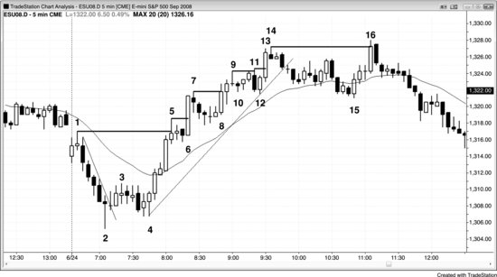
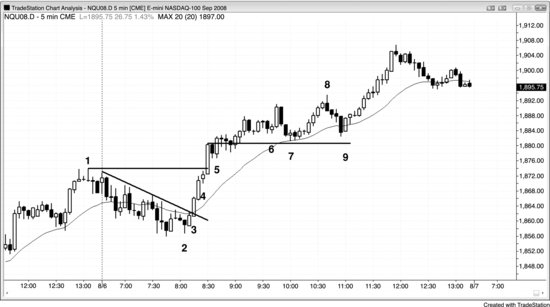

趋势强劲时，每一次回调之后突破前高或前低，都是有效的顺势入场机会。这类突破通常伴随放量，突破K线本身就是一根实体大的强趋势K线，后续几根K线也有明显跟随。聪明钱显然是在突破时入场的。不过，直接在突破点买入很少是最佳做法——价格行为交易者几乎总能找到更早的入场点，比如多头趋势中的高1或高2。有一点很重要：只要趋势足够强，什么时候入场都能赚到钱，前提是止损空间给得够。有些交易员看到趋势已经很强了，却不愿意在最初几个入场点进去，因为他们想等更深的回调，比如回到均线附近的两段式回调。举个例子，市场刚刚确认 Always-in 做多，初始的多头急速阶段由三根实体大、影线短的多头趋势K线组成。这时候有的交易员会觉得这波有点高潮的味道，想等一个高2买入建仓形态再动手。但趋势这么强的时候，最初几次入场机会通常只是高1买入建仓形态。激进的交易员会在前一根K线低点下方挂限价单买入，预期任何反转尝试都会失败。一旦市场跌破前一根K线低点，他们就认为这个高1买入建仓形态至少能带出新高，可能（60%+）还能走出一段测量移动——幅度参照多头急速阶段的高度。如果交易员错过了这两个早期入场点，就必须训练自己，确保能进到这轮强趋势里。当回调开始时，应该在急速阶段高点上方一个 Tick 处挂买入突破单，防止回调只有一根K线就快速翻转上去。如果早期的回调入场都没接住、市场已经开始飙升，这张突破单会自动把他们带进去，不至于踏空。最强的交易中，突破多头急速阶段高点的那根K线通常是一根实体大的多头趋势K线——这说明大量强势多头认为在新高买入是有价值的。既然对这么多人来说这是个好入场，对你来说也一样。

有一个快速判断趋势强度的方法：观察价格突破前一个趋势极值之后市场怎么反应。比如，多头趋势回调后突破了当日高点，突破的那一刻是引来了更多买盘还是卖盘？如果市场往上走了足够远、让突破买入的人至少赚到剥头皮者的利润，说明买盘强于卖盘，这是强趋势的标志之一。反过来，如果市场冲到新的波段高点后一两根K线内就掉下来了，说明卖盘压过了买盘，这更像是交易区间的特征，市场可能正在从趋势转向交易区间。观察市场在新高处的表现，能帮你判断强趋势是否还在持续。如果不是，即便趋势还没结束，力度也在减弱——多头应该在新极值处止盈，甚至可以考虑做空，而不是继续买突破或等小回调做多。空头趋势中情况正好相反。

一般来说，用突破单在新极值入场后，应该把大部分甚至全部仓位做剥头皮处理，除非趋势特别强——那就可以把大部分甚至全部仓位做波段。比如在强多头趋势中，多头会在最近一个高点上方挂买入突破单，但多数人会剥头皮出场。如果市场极度强势，他们可能把大部分仓位留作波段。如果趋势没那么强，空头就会在每一个新的波段高点处用限价单做空——挂在前高或略高一点的位置，价格越高越加仓。如果市场在第一笔空单之后下跌，他们就带着利润出场。如果市场继续上涨，他们预期前高会在几根K线内被回调测试，这样就能把第一笔空单打平出场，同时把更高位置的空单带着利润走。

**图 4.1** 强突破由多根连续的强趋势K线组成

如图 4.1 所示，从K线 4 的 HL（趋势线突破后的更高低点）开始的上涨发展成了一轮强多头趋势，连续七根多头趋势K线带着市场反转穿越了K线 1 的当日高点。动能这么强，所有人都认同一件事：K线 5 的高点会先被突破，然后市场才会跌回到K线 4 处多头趋势的起点下方。市场进入了 Always-in 做多模式，可能（60%+）会走出大约一段测量移动，幅度参照K线 4 到K线 5 的多头急速阶段、或者K线 1 到K线 2 的开盘区间。因此多头可以：

- 直接以市价买入
- 在任何回调中买入
- 在任何K线低点或低点下方挂限价单买入
- 在任何回调高点上方挂突破单买入
- 在任何K线收盘时买入
- 在最近一个波段高点上方挂突破单买入

突破交易者会在每一个前期波段高点之上买入，比如K线5、6、8、11、13和16处。到K线5时，市场明显已经处于强势 Always-in 做多状态。激进的多头会在前一根K线的低点挂限价买单，因为他们预期初始回调只会持续一根K线左右，之后市场就会以高1的形式反转上行。在前一根K线低点买入，通常比在高1上方买入拿到的价格更好。如果交易者倾向于用突破单入场，没有在K线5后面那根K线的低点买入，那他们会在K线6的高1入场信号触发时买入——也就是价格突破前一根K线高点的时候。如果他们还想等更深的回调，比如均线附近的高2，前面两笔入场都没做，那就必须防止自己错过这波强趋势。绝不能让自己被套在一波好趋势的场外。应对办法是在K线5多头急速高点上方1 tick处挂一个最坏情况下的买入突破单。入场价格会更差，但至少能上车——这波行情很可能（60%+）至少走出一段以多头急速高度为基准的测量移动。K线6是一根大阳线、没有影线的多头趋势K线，说明很多强势多头在这根K线上买入了。看到强势多头买入了突破新高的行情，交易者就应该确信这笔交易没问题。初始保护性止损设在最近一个次要波段低点下方，也就是K线6之前那根高1信号K线的低点。

回调交易者每一次入场都会比突破交易者更早进场，因为他们做的是突破回调——也就是牛旗形态。比如K线6的高1、K线8的高2、K线10的楔形反转失败、K线12的高2兼失败的趋势线突破（图上未标出）、以及K线15处的高2——它测试了均线下方（第一次均线缺口K线买入建仓形态），同时与K线12形成双底（这个高2基于从K线14下来的两段明确的较大级别下跌腿）。突破交易者建仓做多的位置，恰好是价格行为交易者卖出多头头寸获利了结的区域。一般来说，在大量聪明的交易者卖出的位置去买入，不是明智之举。但市场很强的时候，在任何地方都能买入——包括在高点之上——而且仍然能赚到钱。不过，买回调的盈亏比远好于买突破。

盲目买突破是愚蠢的。聪明钱不会去买K线11的突破，因为那可能是第三次上推——K线6这根异常强劲的突破K线重置了计数，构成了第一次上推。同样，他们也不会买K线16的突破——那是趋势线突破后对前期K线14高点做的一个HH测试，趋势反转的风险太大。更好的做法是：在突破失败时押注失败，或者等突破回调之后再顺着突破方向入场。当交易者觉得某个突破太弱、不值得买入时，往往会反过来在前期高点及其上方做空。

空头也可以在价格突破前期波段高点时赚钱——方法是在突破时做空，然后逢高加仓。等市场回来测试突破位时，把整个空头仓位平掉：第二笔入场的空单赚到利润，第一笔空单大致在盈亏平衡点出场。如果空头在市场突破K线5、7、9和14上方时做空，这个策略就是可行的。比如，市场从K线7的波段高点回落后，空头可以在那个高点或略高于高点的位置挂做空单，K线8期间这些空单就会成交。接着，当他们判断市场可能再次回落时，或者在高出几个点的位置，再加一笔空单。然后用限价单在原始入场价（也就是K线7的高点附近）挂平仓单，一次性了结所有空头仓位。因为空头在突破回测处买回空单平仓，同时多头也在同一区域加仓做多，回调往往就在那个价位结束，市场再次上行。

K线4处的反转上行是空头趋势最终旗形的突破。有时候最终旗形反转并不来自更低的低点，而是来自更高的低点。对前期极端位的测试可以超越也可以不及前期极端位。K线15是多头趋势中最终旗形的末端，K线16处的反转来自一个新的极端高点（HH）。

**图 4.2** 强趋势通常在次日有跟随

如图 4.2 所示，昨天（只能看到最后一小时）是一个始于开盘的强多头趋势日，因此今天出现足够跟随、收盘高于开盘的概率很高。即使今天开盘有回调，多头趋势也很可能（60%+）至少创出一个名义上的新高。交易者都在等待买入建仓形态的出现。

K线2是一个小幅HL，出现在一个高4买入建仓形态之后，同时与昨天最后一次回调形成双底。信号K线以阴线收盘，但收盘价至少在K线中点之上。错过那次入场的交易者看到接下来两三根K线形成了一波强劲的多头急速，于是判断市场现在处于 Always-in 做多状态。聪明的交易者会至少用一小部分仓位以市价买入，以防市场大幅上涨之后才出现回调。

突破过程中出现了两根大的多头趋势K线，每根都收盘强劲、影线很小。如果你在K线3收盘时做多，此时应该波段持有一部分仓位。也就是说，如果你还空仓，同样可以以市价买入相同的仓位规模，使用你更早入场时会用的那个止损位。这个止损位现在应该设在K线3这根强多头趋势K线的下方。

K线4是一根暂停K线，刚好在昨天高点下方。在它高点上方1 tick处买入是另一个好的入场点。暂停K线是一个潜在的反转建仓形态，所以在它高点上方做多，你是在早期做空的空头买回空单的位置买入，也是在提前离场的多头重新买回多头仓位的位置买入。

到这个时候，趋势已经很明确、很强了，应该在每一次回调时买入。

K线6之后出现了一个两K线反转和第三次上推，这是一个可以接受的做空建仓形态，目标是回调到均线。

K线8是一个合理的逆势剥头皮机会（趋势线突破后突破新高失败），因为它是一根强空头反转K线，并且构成了一个扩张三角形顶部——但趋势仍然向上。注意，当时市场还没有出现过一次收盘低于均线的情况，而且价格已经在均线上方运行了超过20根K线，这两点都是强势的信号。如果你在考虑做一笔逆势剥头皮，前提是趋势恢复上行时你会立刻重新做多。不能先平掉多头、做一笔空头剥头皮，然后又错过趋势恢复后的波段上涨。如果你无法可靠地处理这两次方向切换，就不要做逆势交易——直接持有多头仓位即可。

K线9是一根多头内包K线，出现在第一次收盘低于均线之后，也是一个两K线反转的第二根K线。在这个建仓形态上方突破入场，预期至少会测试多头高点。
