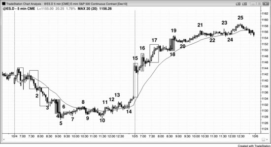
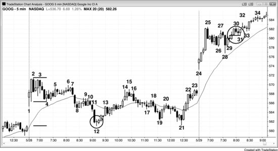
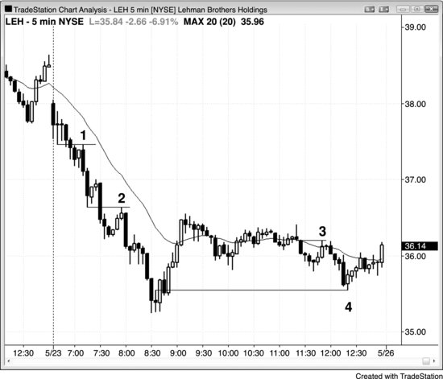
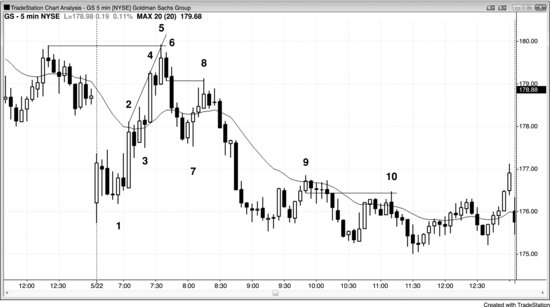
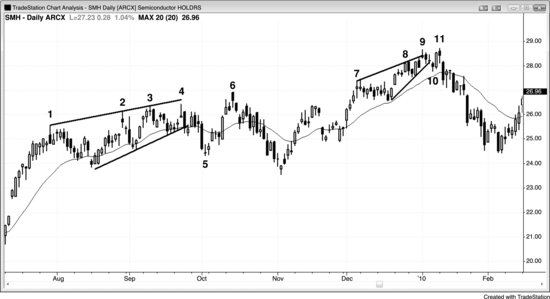
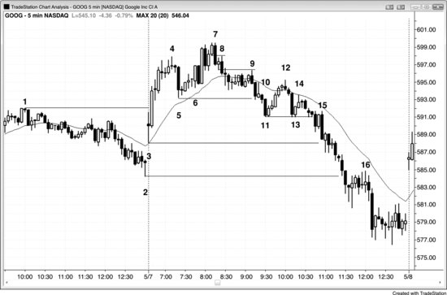
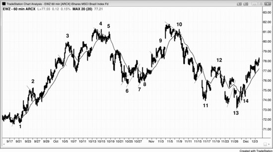
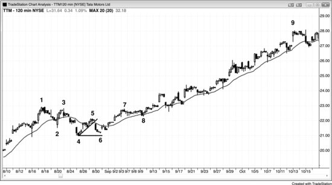
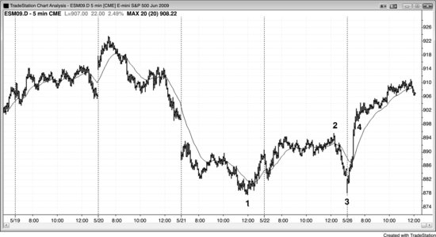
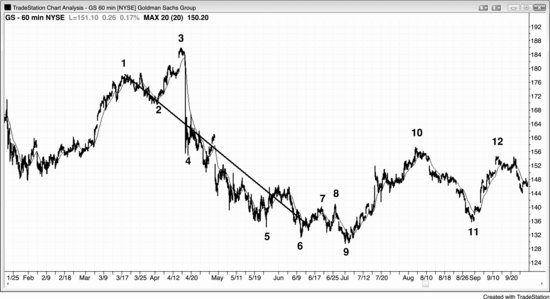

突破——失败突破——要么趋势反转、要么突破回调——然后趋势恢复，这个循环是价格行为中最常见的模式之一。每天的大多数交易都可以看作这个过程的某种变体。放到更大的尺度上，这也是主要趋势反转（MTR）的基础（详见第三册）：先突破趋势线，接着出现突破回调，回测趋势的极端价位。所有突破都会经历这个过程，但最常见的情形是多头旗形或空头旗形的突破——也就是屏幕上与主趋势方向相反的一小段趋势。

每次突破之后，市场最终都会回调，测试之前的重要价位。回调一旦开始，就意味着突破暂时变成了失败——即便后来突破继续推进，在这个节点上你都应该把它当作失败来看待。如果这次失败成功地反转了趋势，那突破就算真正失败了，反转就算成功了。如果反转只持续了一两根K线便恢复了突破方向，那反转的尝试就只是突破之后的一次回调（所有未能反转市场的失败突破，都是顺着突破方向建仓的突破回调形态）。举个例子：多头突破之后，市场回调到入场价附近，形成一根买入信号K线，并在其上方触发做多——这次回调就是对突破的回测（即突破回测），同时在最近回调低点的K线高点上方构成一个做多建仓形态。如果趋势恢复，突破K线通常会变成一个测量缺口；如果趋势反转，原来的多头趋势K线就变成衰竭缺口，而空头趋势K线则变成突破缺口（缺口将在第六章详细讨论）。回测可以发生在突破后的下一根K线，也可以在 20 根甚至更多K线之后才出现。那到底在测试什么？测试的是突破究竟能不能成功。市场从突破处回落，是因为有人在卖出。多头卖出部分仓位锁定利润；空头也在卖出，试图让突破失败，从而把 Always-in 方向翻转为向下。多空双方都在评估突破的力度。如果建仓形态和入场K线都很强，交易员就会预期价格继续走高。当市场回调到突破区域时，已经持有多头仓位的人——不管之前有没有在突破时剥头皮了结过一部分——都会利用这次回调再度买入。那些错过最初入场机会的多头，也会趁回调做多。在突破之前就在入场价下方做空的空头，会认定市场已经翻转为 Always-in 做多并将继续走高，因此会利用这次回调以小幅亏损买回空单平仓。那些在突破时做空的空头，看到突破力度很强而回调的反转力度很弱，就会在小幅盈亏或盈亏平衡附近买回空单。既然空头此时也相信突破会成功、市场还要涨，他们就不会急着再做空，而是等价格涨得更高、出现卖出信号时才考虑。

如果建仓形态或突破本身较弱，而且突破后不久就出现了一根强空头反转K线，交易员就会预期突破将要失败、空头趋势即将开始或延续。多头会平掉手上的多单，至少好几根K线内不再考虑买入；空头则会开新仓做空，或者在已有空单上加仓。结果就是市场跌破多头突破的入场价，对该价位的测试宣告失败，空头趋势至少还会延续一段横盘到下行的波段。

如果突破和反转的力度大致相当，交易员就会去观察空头反转信号K线之后的那根K线。如果那根K线收出强空头收盘，是一根强空头趋势K线，反转继续走低的概率就会增大。反过来，如果是一根强多头反转K线，那失败突破大概率不会成功，这根多头反转K线就变成一根信号K线，在其高点上方一个 tick 处形成突破回调的买入机会。

请记住，交易员在每根K线收盘后做出的最重要判断，就是在前一根K线的上方和下方，买方和卖方谁更占优。在突破和失败突破的情境中，这一点尤为关键，因为接下来的走势通常决定了 Always-in 的方向，其影响会持续很多根K线，而不仅仅是一次剥头皮。

这个过程每天在所有时间周期上反复上演。突破可能只是安静地推过前一根K线的高点，回调从下一根K线就开始了——这种情况放到更小的时间周期图上看，可能是一个 10 根K线的突破。突破也可以非常剧烈，比如一个 10 根K线的多头急速拉升，回调要到 20 根甚至更多K线之后才出现。当这个过程包含很多根K线时，放到更高时间周期的图上看，它只是一次小突破，突破和回调在那张图上不过持续了几根K线而已。

多头突破之后，回调常见的测试区域包括：

- 突破起始点（突破发生时的价格位置）。
- 急速与通道多头趋势中，急速阶段的顶部。市场跌破通道后，通常（60%+）会回测急速阶段的顶部，最终还可能跌到通道底部。
- 最终旗形突破中，急速阶段的顶部。市场从潜在最终旗形中突破后开始回调时，通常（60%+）会测试旗形之前那个波段高点。
- 楼梯形态中最近的波段高点。多头楼梯形态的回调通常（60%+）至少会略微跌破最近的波段高点。
- 多头趋势性交易区间日，较低交易区间的顶部。如果价格没有重新向上反转，可以一路回撤到那个较低交易区间的底部。
- 市场涨到潜在楔形（上升收敛通道）的第三推时，回测第二推顶部的概率非常高。一旦反转，通常（60%+）会测试到楔形底部（第一次回调的低点，也就是楔形通道的底部）。
- 信号K线的高点。即使突破K线突破了 10 根K线前的波段高点，价格也常常会回测突破K线前一根K线的高点。
- 入场K线的低点。如果市场跌破入场K线，往往以一根强空头趋势K线完成，从那里开始的下跌幅度通常（60%+）至少够做一笔剥头皮。
- 上涨那一腿起点处波段低点的底部。市场有时会跌破入场K线和信号K线，一路回撤到多头腿的底部，并在那里形成双底牛旗。
- 任何支撑区域，比如均线、前一个波段低点、趋势线，或者趋势通道线（例如市场形成楔形牛旗时的情况）。

每次出现突破时，交易员都要判断：这波突破后面会不会跟着一段趋势，还是会失败反转。每张图上突破数量都很多，所以熟练掌握这个判断非常重要。突破可能延续好几根K线，但某个时候一定会出现回调。逆势交易员会把这次回调看作突破失败的信号，然后入场赌市场反转，至少赚一笔剥头皮的利润。顺势交易员会部分止盈，但他们预期这次失败的突破走不了太远，很快就会形成突破回调建仓形态，趋势随后继续。举个例子，如果出现多头突破，第一根低点低于前一根K线低点的K线就是回调。但交易员需要判断，这到底是不是突破失败、即将引发向下反转。突破越具备强趋势的特征，后续跟随的可能性（60%+）就越大。如果这些特征很少甚至完全没有，突破失败并向下反转的概率就会增大。强趋势的特征在第一本书《价格行为与趋势》中有详细讨论，强多头趋势的关键特征包括：连续多根多头趋势K线、实体之间几乎没有重叠、影线很短、当天早些时候多头力量已经很强。但如果第二根K线是一根相对较强的空头反转K线或空头内包K线，突破K线本身不是特别大，而且这次突破是第三推，并且那根K线收回到趋势通道线以下，那么突破失败并做空的机会就更好。如果你在那根K线低点下方做空，而下一根K线是一根强多头反转K线，通常（60%+）应该反手做多，因为那个突破的失败本身可能正在失败，反而在构建一个突破回调的做多建仓形态。

突破之后，最终会出现一次回调来测试发起突破的那些交易员的力量，测试是否成功取决于这些交易员是否愿意在同一区域第二次入场。最强的突破通常（60%+）不会完全回到突破起始点，但有些回调可以远远越过突破起始点，之后仍然跟着一段强趋势。比如在多头楼梯形态中，每次突破到新波段高点后都会跟一次深度突破回调。这个突破回调会守住前一个 HL，从而维持 HH 和 HL 不断抬升的多头趋势结构，然后再创出新的 HH。如果突破回调回到距入场价格几个 tick 以内，就是一次突破回测。回测可以发生在突破后的下一根K线，也可以在 20 根甚至更多K线之后，或者两个时点都出现。这根回测K线是一根潜在的信号K线，聪明的交易者会在它高点上方 1 个 tick 处挂一张买入突破单，以防测试成功、趋势继续。这是一种特别可靠的突破回调建仓形态。

向上突破时，突破价格附近通常有大量买盘涌入，买方压倒了卖方。突破回调意味着市场回落到这个价格区域，看买方能不能再次压倒卖方。如果买方再次胜出，市场很可能（60%+）至少走出两段上涨，突破本身算第一段。但如果卖方占了上风，突破就失败了，市场很可能（60%+）出现一波可交易的下跌——因为还持有多单的交易员被套住了，而新的买方在目睹突破失败后也不敢轻易再买。买方已经在这个价格区域两次尝试上攻都失败了，所以市场接下来很可能（60%+）反向运行，至少走出两段下跌。

如果突破后一两根K线内就出现了回调，说明突破已经失败。不过即使是最强的突破，也会有一两根K线的失败走势，而这种失败最终只是变成了突破回调，而不是反转。一旦趋势恢复，之前的突破失败本身也就失败了——所有的突破回调都是这种情况。突破回调本质上就是一次失败的反转尝试。连续的失败构成二次入场点，因此有很大概率形成盈利交易。突破回调也叫杯柄形态，是最可靠的顺势建仓形态之一。

没有真正突破也可以出现突破回调。如果市场强势逼近前高但没有突破，然后安静地回调了一到四根K线左右，这种走势很可能（60%+）跟突破回调的效果完全一样，应该按照回调跟在真正突破后面的方式来交易。记住，走势接近教科书形态时，通常（60%+）会按教科书形态来运行。

如果当天早些时候出现过一波强力走势或趋势的第一段，那么当天晚些时候的顺势突破更可能（60%+）成功；即使突破失败，也不太可能（≤40%）成功反转趋势，而是会变成突破回调。但如果当天大部分时间都没有趋势，只是不断出现一两根K线的双向突破，那么失败引发反转的概率就会增大。

初始行情走完之后，很多交易员会先止盈一部分仓位，然后把剩余仓位的止损设在盈亏平衡点。这里的盈亏平衡点不一定恰好等于每笔交易的入场价。根据股票的不同，交易员可能愿意承受 10 美分甚至 30 美分以上的风险，但这仍然基本算是盈亏平衡止损，即使实际上会亏一点钱。举个例子，如果 Google（GOOG）交易价格在 750 美元附近，交易员刚对一半仓位止盈，想保护剩余部分，但 GOOG 最近经常扫盈亏平衡止损 10 到 20 美分、很少超过 30 美分，那交易员可能会把盈亏平衡止损设在突破点外 30 美分的位置，虽然这意味着至少亏 30 美分，并不是真正的盈亏平衡交易。

过去一年左右，Apple（AAPL）和 Research in Motion（RIMM）对精确的盈亏平衡止损非常"守规矩"，大多数突破回调测试实际上在距离入场价大约 5 美分的地方就停住了。相比之下，Goldman Sachs（GS）经常在回调结束之前先扫一遍止损，所以想守住仓位的交易员必须愿意承受一点风险。另一种做法是在盈亏平衡点出场，然后在测试K线高点上方一个 Tick 处挂突破单重新入场，但这样重新进场的价格几乎肯定比最初入场价差 60 美分以上。如果价格行为仍然良好，持仓扛过突破回测、承受大约 10 美分的风险，比出场后再以差 60 美分的价格重新进场更划算。

大多数主要趋势反转（MTR）都可以看作突破回调交易。比如，市场一直处于空头趋势，然后出现一波突破空头趋势线的反弹，随后回调到一个 LL 或 HL，这就是一个突破回调的做多建仓形态。要注意的是，突破后的回调可以超过原来的极值点——也就是说，在多头反转中，向上突破之后的回调可以跌破空头低点，但多头反转仍然有效，仍然主导着价格行为。

趋势末端的最后一次回调，有时也是反向新趋势的第一段。举个例子：假设市场处于空头趋势中，随后出现一段持续 10 到 20 根K线甚至更长的缓慢上涨，接着出现卖出高潮并向上反转，进入多头趋势。此时，如果把容纳最后那段空头旗形的通道向右上方投射，有时大致也能容纳新的多头趋势。事后来看，那段最后的空头旗形其实就是新多头趋势的第一段上涨，之后的急跌则可以被视为新多头趋势中的一次更低低点回调。如果你识别出这个形态，应该把更多仓位做成波段交易，不要急着出场。一旦新的多头趋势突破空头旗形的高点，就会触发那些空头的保护性止损——他们把那段空头旗形看成一次无力的反弹，认为它成为空头趋势最终更低高点的概率很小（不超过 40%）。当市场反转到那个高点上方后，空头短时间内不会再寻找新的做空机会，这往往导致空头旗形被突破后几乎没有回调，上涨可以走得很远。同样的现象在楔形旗形形成过程中也很常见。比如，楔形熊旗有三次上推，第一次上推之后，市场往往会向下突破至一个更低低点，之后再从那个低点完成两次上推，楔形熊旗就成形了。一旦熊旗完成，市场通常会从楔形熊旗的下方突破，形成新的趋势低点。

突破经常失败，而且失败可以发生在任何时候，哪怕只过了一根K线。在窄幅交易区间里，单根K线突破后回头失败、退回区间内的概率，与继续发展成趋势的概率差不多各占一半。开盘时持续几根K线的急速逆势突破也经常失败，反而走出反方向的趋势日。这部分内容在第三册关于开盘第一个小时的章节中有讨论。

在日线图上，出人意料的新闻事件经常引发急速的逆势突破，但这根急速K线通常不会有跟随走势（比如发展成通道），突破往往失败，急速K线最终只是一次短暂回调的一部分。举个例子：假设一只股票处于强多头趋势中，昨天收盘后公布了一份出乎意料的糟糕财报，今天跌了 5%，交易员开始怀疑趋势是不是要反转。大多数情况下，多头会在空头急速K线的低点和收盘附近积极买入——那里总是处于某个支撑区域，比如趋势线附近。他们正确地押注空头突破会失败、多头趋势将恢复，把这波抛售看成一次短暂的跳楼价甩卖，让他们能以很快就会消失的大幅折扣价买入更多。大约一周左右，所有人就会忘掉那个糟糕的消息，股价通常会回到空头急速K线的顶部上方，继续朝着新高前进。

**图 5.1** 趋势末端的突破可能导致反转或新一段走势

趋势末端的突破有时是一个衰竭性高潮，导致反转；有时则是一次成功突破，开启另一段通道。所有高潮都以交易区间收尾，这个交易区间短则只有一根K线。在交易区间内，多头和空头继续交易，双方都试图让价格朝自己的方向跟随。在图 5.1 中，无论是向下到 K5 的卖出高潮，还是向上到 K19 的买入高潮，最终都是多头赢了。

K1、K2、K3 和 K5 结束了空头急速走势，而连续的卖出高潮往往会引发一轮至少持续 10 根K线、至少包含两段的回调。K4 是整段空头趋势中最大的空头趋势K线，因此可能代表最后一批弱势多头终于放弃、不惜任何价格出场。事实很可能（概率超过 60%）就是如此，市场随后分两段向上回调直到收盘，第一段结束于 K8，第二段结束于当天最后一根K线。

第二天，K15、K16、K17 和 K19 构成了买入高潮。市场成功从多头通道的上方突破——这段多头通道跟随缺口急速上涨至 K15，以三次上推至 K17 告终。但只要回调是横盘而非下跌，就说明多头很强，他们确实成功地把价格推破了三连推的顶部。虽然那根大阳线可能是最后一批空头终于认输造成的，但这里实际上是激进的多头成功将市场推到了楔形顶部上方。这次多头急速走势之后跟随了一段通道，本来试图在 K21 结束，但最终延伸到了 K25。

**图 5.2** 突破回调

如图5.2所示，K线8是一个潜在的失败突破，但这次突破本身很强——由三根空头趋势K线组成，覆盖了当天大部分价格区间，影线短小，K线之间重叠极少。随后市场回调至均线附近，在K线10形成了一个低2做空信号（也可以看作一个小型楔形熊旗）。K线10是第二根空头趋势K线，同时也是回调至均线的第二段终点。突破回调是最可靠的建仓形态之一。

K线12再次构成一个潜在的失败突破，跌破了当天新低。这是连续两次卖出高潮之后的反转上涨走势，而连续高潮之后的反转通常会引发至少10根K线、两段式的回调。虽然K线12这根信号K线是十字星，并非多头反转K线，但其多头影线比空头影线长，说明存在一定买压，空头力量也在减弱。此外，K线8到K线10的熊旗是一个窄幅交易区间，具有磁吸作用，突破之后价格更容易被拉回到该区间的水平。K线11是突破K线，因此形成了一个突破缺口。突破缺口通常会被回测，突破点也是如此。K线1的低点就是突破点。空头希望回调停留在K线1下方，多头则希望相反——至少让市场回到K线1低点上方并站稳。一旦如此，大多数交易员就会将这次突破视为失败，这很可能（概率60%以上）终结空头趋势。最后，前两个小时的交易区间大约是平均日内波幅的一半，这增加了向上或向下突破之后再形成一个类似大小交易区间的概率，从而演变为趋势性交易区间日。因此，可以预期多头会在K线12附近入场，因为这里恰好是当天第一段下跌（K线2到K线4）的测量移动目标位。

K线31是一波小幅上涨之后的回调。这波上涨突破了一个次要波段高点，差一点就创出当天新高。当市场差一点突破然后回落时，其走势与实际发生突破的效果相同，因此属于一种突破回调。K线31这个突破回调仅比K线29信号K线的顶部低了2美分，对于一只交易价格在580美元的股票来说，几乎是完美的突破回测，因此是一个可靠的做多建仓形态。市场再次在三根K线之前的突破价位找到了强劲买盘。旗形突破后的回调是最可靠的建仓形态之一。

当天新高的实际突破发生后，K线33处出现了一个突破回调做多的建仓形态。

虽然盘中不值得频繁切换不同时间周期来观察，但较低时间级别上往往存在一些在你所用图表上看不到的可靠突破回测建仓形态。举个例子，如果你用3分钟图交易，就能看到K线6的高点是对3分钟图上K线3那根K线高点的突破回测。也就是说，去看3分钟图的话，你会发现5分钟图上K线6对应的那根K线，恰好完美回测了3分钟图上K线3对应那根K线的低点。

K线28是一根强空头K线，代表一次向下突破的尝试。在它形成过程中，一度表现为一根大型空头趋势K线，最新价停在低点，且低于前八根K线的低点，构成强烈的空头突破和反转信号。然而当这根K线收盘时，收盘价已回到K线26交易区间低点的上方。大多数逆势突破尝试都会失败，强势交易者会押注它失败；他们清楚，多头趋势中出现空头急速下跌是常见现象，之后通常会再创新高。当K线28处于最低点的那一刻，新手看到的是一根非常大的空头趋势K线，以为趋势正在猛烈反转为强空头，却忽略了图表上所有其他K线。有经验的交易者则将这根空头急速K线视为一次短暂的价格打压，是在多头趋势中以折扣价买入的绝佳机会。当日线图上出现这样的空头急速K线时，通常是因为某个新闻事件——当时看起来很严重，但有经验的多头知道，跟这只股票所有其他基本面因素相比，这点消息微不足道，它不过是强多头趋势中的一根空头K线而已。

**图5.3** 突破回测

很多股票经常走得很规矩，会精确回测到突破点的每一个tick，就像雷曼兄弟控股（LEH）在一天之内四次做到的那样（见图5.3）。由于很多交易员会在信号K线上方或下方一个tick处用突破单入场，像这样精确的回调刚好会把盈亏平衡点的止损打掉一个tick。不过，在回测K线上方或下方一个tick处重新入场通常是一笔不错的交易（比如在K线2低点下方一美分做空）。另一种做法是，在回调时多承担几美分的风险，避免被突破回测扫出场，等趋势恢复后再把止损移到那根回测K线的上方。

卖方在K线1、K线2和K线3的高点区域再次入场。到了K线4，市场回落到当天低点——也就是买方最初压制卖方的位置，买方再次出手。这个HL是买方第二次尝试在这个价格区域夺取控制权，而且这次成功了，所以市场应该至少有两段上涨。

**图 5.4** 突破回测可能触及盈亏平衡点止损

过去一年里，GS 一直以频繁扫盈亏平衡点止损著称，但只要你了解所交易品种的这些特性，就可以做出有利可图的调整（见图 5.4）。

K线8 比K线6 信号K线的低点高出 6 美分。

K线10 比K线9 信号K线的低点高出 2 美分，精确地扫掉了盈亏平衡点止损，多扫了 3 美分。交易者可以在突破回测成功之前多承担大约 10 美分的风险，来避免被止损出场后又不得不在低 50 美分的位置重新做空。一旦市场跌破突破回测K线的低点，就把保护性止损移到该K线高点上方 1 美分处。

K线5 的高点比昨日最后一小时的波段高点高出 2 美分，随后在这个价格区域第二次向下反转。买方两次尝试突破这个区域都失败了，形成了一个双顶，所以市场应该至少有两段下跌。同时，K线5 还过冲了连接K线2 和K线4 的趋势通道线，随后多头趋势线被跌破至K线7，K线8 形成了对多头极端点（K线5）的LH测试，引发了一波空头波段。

K线8 是由四根空头趋势K线组成的急速下跌之后形成的回调，这四根K线跌破了多头趋势线（图上未标出）。交易者在讨论这次突破到底会失败还是成功。多头把K线7 这根外包阳线（与K线3 形成双底）视为空头突破将失败的信号，在K线7 变成外包阳线并突破其高点时买入。空头则认为这波急速下跌很强，寻找回调做空的机会。他们在K线8 后面那根空头内包K线的低点下方卖出（那根内包K线和K线8 构成了两K线反转）。

K线1、K线2 后面那根K线、K线3、以及K线4 后面那根K线，都是单K线突破回调做多建仓形态。

尽管到K线9 为止的三根K线多头急速上涨非常强势，交易者不能忽略之前从K线8 开始的那波更强的抛售。新手往往只看到最近几根K线，却忽略了左边不远处那些更有说服力的K线。K线9 只是空头趋势中对均线的一个低点 2 测试。K线10 与四根K线前那根K线的高点构成双顶，同时位于均线处，因此又是一个低点 2 做空建仓形态。新手可能(60%+)又把这三根强多头趋势K线反弹到均线的走势看作趋势反转，再一次忽略了当前正在运行的强空头趋势。K线10 只不过是空头趋势中又一个LL之后对均线的又一次LH测试。

**图 5.5** 顶部的突破回调可以是一个HH

楔形顶突破之后，回调不一定要形成LH。在图 5.5 中，有两个楔形顶向下突破，但两次回调都形成了HH（分别在K线6 和K线11）。

从 8 月到 10 月，市场一直处于交易区间中，双向交易频繁。这是一个趋势性交易区间形态，一旦向下反转，大概率(60%+)至少会回测下方区间的K线6 高点。市场跌入下方区间后没有立刻反弹回去，下一个测试目标就是下方区间的底部。

**图 5.6** 突破回调建仓形态

图 5.6 中，GOOG 形成了一系列突破回调入场机会。开盘后的急速拉升突破了昨天K线1 的波段高点，而K线5 的回调甚至没有触及均线或突破点。动能很强时，在高点 1 回调处买入是一笔好交易。信号K线是一根小十字星内包K线，说明在那根大阴线之后抛压已经减弱。跌破多头微型趋势线的空头突破失败了，反而变成了突破昨日高点后的回调。K线6 是二次入场点，也是一个高点 2。在强趋势中，高点 2 的入场位有时会高于高点 1 的入场位（这里高点 1 在三根K线之前）。

K线7 是这波上涨中第三次强力的空头急速下跌，代表着抛压——抛压总是具有累积效应——说明空头正变得越来越强。

K线8 是一次突破回测，比信号K线的低点只差了 2 美分。K线9 也是一次突破回测，比K线8 做空信号K线的低点差了 4 美分。这些只是观察记录，在K线8 和K线9 入场做空突破回调并不需要这些信息。

K线9 是一个位于均线处的低点 2 做空建仓形态，而且它本身是一根空头趋势K线，这是一个可靠的组合。随后出现一根内包K线，在K线10 处形成了另一个突破回调做空入场点。这也是第一个明确的LH，可能(60%+)是空头趋势的开端。

K线 11 跌破了K线 5 的回调低点，随后在均线位置的K线 12 形成了突破回调做空入场。K线 12 又是一个 LH，与K线 9 构成双顶熊旗。双顶不一定要完全精确。K线 12 同时也是下跌到K线 11 这段空头急速走势之后的回调，并且是空头通道的起点——后续在这个通道内还出现了好几次空头急速下跌。

K线 13 只比K线 11 低了 5 美分，但很快就在K线 14 的低 1 位置给出了突破回调做空入场。由于K线 14 是阳线实体，更谨慎的交易员会选择等待二次入场点。K线 14 后面那根十字星勉强算一根可接受的入场K线，但在十字星之后的那根外包K线做空更好，因为它是一个低 2。为什么是低 2？因为它前面有两个小的上升腿。K线 14 是第一个上升腿，两根K线之后的外包K线交易到了十字星上方，形成第二个上升腿（也就是低 2 做空入场）。

K线 15 也是一根外包K线做空入场，对应的是跌破K线 11 和K线 13 之后的回调。这个入场特别好，因为有一些多头被套了——他们买入了那个两K线反转，以为那是对K线 11 和K线 13 双底的失败突破。每当跌破双底的突破试图向上反转却失败时，就形成了一个失败的楔形形态，后续通常会有大约一个测量移动幅度的下跌。双底构成了前两次下推，跌破双底的突破是第三次下推。由于从K线 14 开始连续出现了 4 根空头趋势K线，聪明的交易者会等到出现一个 HL 回调之后再考虑做多。

K线 16 是跌破前一天K线 2 波段低点之后的低 2 回调。

上面很多交易只是小幅剥头皮，不应该是大多数交易员关注的重点。它们的意义在于展示一种常见的行为模式。交易员应该把精力放在更大的转折点上，比如K线 4、7、9 和 12。

**图 5.7** 失败的突破

如图 5.7 所示，这张 EWZ（iShares MSCI 巴西基金 ETF）的 60 分钟图上出现了多次牛旗和熊旗的失败突破。一旦趋势形成后出现旗形，且旗形突破失败并随后反转，那这面旗形就是该趋势的最终旗形。

最终牛旗可以在 HH 之后向下反转，比如K线 3 和K线 9；也可以在 LH 之后向下反转，比如K线 5 和K线 10。最终熊旗可以在 LL 之后向上反转，比如K线 6、11 和 13；也可以在 HL 之后向上反转，比如K线 1、8 和 14。

**图 5.8** 最终旗形

有时候，最终熊旗同时也是下一轮多头趋势的第一段上升腿（见图 5.8）。这张印度塔塔汽车（TTM）的 120 分钟图上，熊旗在K线 5 处结束，成为这波下跌的最终旗形。K线 6 形成了一个 HL，随后市场急速上涨到K线 7，超过了K线 5 的 LH，从而形成一个 HH，这是多头力量增强的信号。正如第三册中关于最终旗形的讨论，最终熊旗的突破不一定非要跌破空头低点。

**图 5.9** 双底

如图 5.9 所示，5 分钟 Emini 图上出现了一波强劲的空头趋势，一直跌到K线 1，随后形成了一个动量偏弱的圆弧形熊旗，在K线 2 处结束。接着是一波急跌到K线 3，测试了K线 1 的低点。虽然K线 3 比K线 1 高了几个 tick，但这是一个对空头低点的双底测试。事后来看，上涨到K线 2 的那段走势就是最终熊旗，实际上是新的多头趋势的第一段上升腿；而下跌到K线 3 的走势则是该上涨的突破回调，同时也是对熊旗的失败突破。从K线 3 开始的多头急速上涨动量非常强，直接冲过了K线 2 的熊旗位置，中间没有任何停顿。这通常意味着后面还有更多上涨空间，交易员不应该急着全部平掉多头仓位。第一次回调出现在K线 4 处的高 1，远在K线 2 高点之上。

**图 5.10** 最终旗形的斜率可以预示新趋势的斜率

有时候，趋势的最终旗形的斜率与反转后新趋势的斜率大致相同（见图 5.10）。这张 GS 的 60 分钟图上，K线 1 到K线 2 形成了一个最终牛旗，其大致斜率与反转后的空头趋势差不多。市场其实已经"知道"了这波下跌大概会以什么速率进行，只是中间被一次假的 HH 突破打断了一下——价格冲到了K线 3。从K线 1 到K线 9 的整个形态是一个下降通道，也就是一面牛旗。上涨到K线 3 的走势是一次向上的假突破。
