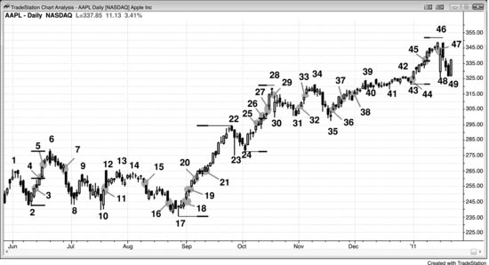
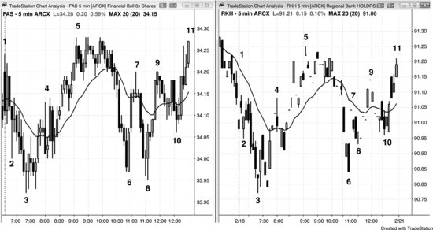
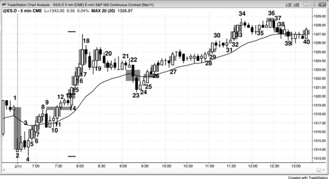
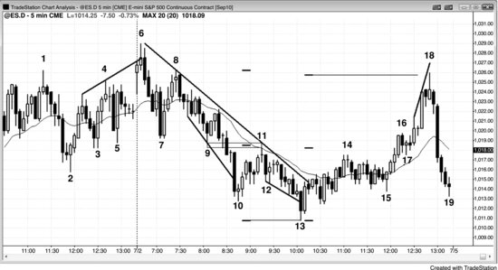
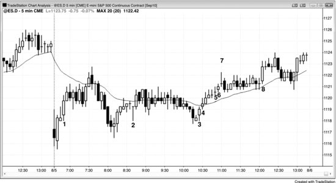

缺口是两个价格之间的空白区域。在日线图、周线图和月线图上，传统缺口很容易辨认。例如，在**多头趋势**中，若今天的最低价高于昨天的最高价，就形成了一个向上的缺口。传统缺口按出现位置可分为几类：位于趋势起点的称为**突破**缺口，位于趋势中段的称为**测量型缺口**，位于趋势末端的称为**衰竭型缺口**。出现在其他位置的缺口——例如趋势**急速阶段**内部或**交易区间**内部——则统称为缺口。交易员通常需要等市场走出后续行情，才能对缺口进行归类。举个例子，假设日线图上市场正从**交易区间**顶部向上**突破**，**突破K线**是一根大**多头趋势K线**，且其低点高于前一根K线的高点，交易员便会将这个缺口视为强势信号，认为它可能是突破缺口。如果随后**多头趋势**延续了几十根K线，回头看就能确认它确实是突破缺口。但如果市场在几根K线之内便**反转**下跌、进入**空头趋势**，那它就是一个**衰竭型缺口**。

假设**多头趋势**已经运行了大约五到十根K线，此时又出现一个缺口，交易员会认为这第二个缺口可能恰好位于多头趋势的中间位置，将其视为潜在的**测量型缺口**。许多交易员会在市场完成**测量移动**后对多头头寸**止盈**。**测量移动**的计算方法是：先量取从多头趋势底部到缺口中点的距离，再从缺口中点向上等距投射。这类缺口通常出现在趋势的**急速阶段**，能给交易员带来信心，促使他们敢于以**市价单**入场或在小幅**回调**中入场，因为他们相信市场会朝着**测量移动**目标继续推进。

当**多头趋势**已经运行了几十根K线、触及**阻力**区域并开始出现**反转**迹象时，交易员会格外留意接下来是否还有向上的缺口。一旦出现，他们便会将其视为潜在的**衰竭型缺口**。如果市场没涨多少就回落至缺口前那根K线的高点下方，交易员会认为这是弱势信号，判断该缺口可能代表衰竭——即一种买入**高潮**。此时他们通常不会再买入，而是等市场至少经历10根K线和两段**回调**之后再考虑。**衰竭型缺口**有时出现在**趋势反转**之前，因此每当出现疑似**衰竭型缺口**，交易员都会审视整体**价格行为**，评估**交易者方程**是否支持做空。如果确实发生了**反转**，推动**反转**的那根**趋势K线**便成为一个**突破**缺口（单根K线同样可以起到缺口的作用），同时也可能标志着反方向趋势的起点。

由于所有**趋势K线**本质上都是缺口，交易员在日内图表上同样能看到与传统日线缺口等价的形态。假设一段**多头趋势**已经到达**阻力**区域，有可能（概率60%以上）向下**反转**（**反转**将在第三本书中详细讨论），但市场仍出现了最后一次**突破**，那根**多头趋势K线**就可能成为**衰竭型缺口**。这根K线有时是一根收盘接近最高点的大**多头趋势K线**，偶尔最后的**突破**由两根很大的**多头趋势K线**组成。这就是一个潜在的买入**高潮**，精明的交易员会注意到这一点并开始卖出。多头会卖出锁定利润，因为他们认为市场有可能（概率60%以上）经历大约10根K线的两段式下跌，届时有可能（概率60%以上）在更低的位置重新买入。同时他们也意识到，这可能是衰竭性买入**高潮**和**趋势反转**，不愿冒险回吐已有利润。激进的空头同样看到了这一点，会卖出开仓做空。如果随后几根K线内出现一根强**空头趋势K线**，且**始终持仓方向**翻转为向下，那最后那根**多头趋势K线**便确认为**衰竭型缺口**，而那根**空头趋势K线**则成为**突破**缺口。当**多头趋势K线**后面紧接着**空头趋势K线**时，就构成了一个**高潮**式**反转**，即**两K线反转**。如果两根**趋势K线**之间隔了一根或几根K线，这些K线便构成了一个岛形顶。岛形顶的底部即空头**突破**缺口的顶部，与所有缺口一样，它可能被回测。如果市场回测后再次下跌，那次**突破回测**便形成了一个LH。若最初的下跌力度很强，当市场测试岛形顶以及再次转跌时，多头和空头都会卖出，因为双方都更有信心市场将继续下跌大约10根或更多K线。多头卖出是为了锁定利润，或者减少亏损——如果他们在**多头趋势****突破K线**形成过程中于高位买入的话。空头卖出则是为了建立新的空头仓位。市场下跌许多根K线后，获利了结的交易员（空头回补）进场买入，推动形成一波**回调**或一个**交易区间**。如果此后市场再次出现一根**空头趋势K线**跌破该**交易区间**，这根K线就是一个潜在的**测量型缺口**，交易员会尝试持有部分空头仓位，直到市场接近该目标位。

当市场开始下跌时，交易员会观察空头K线的力度。如果出现一两根收盘价接近最低点的大阴线（空头趋势K线），交易员就会考虑 Always-in 的方向是否正在翻转为空头。接下来他们会盯着后面几根K线，看是否出现高 1 做多信号K线。假如真的出现了，但相对于之前的下跌力度很弱——比如是一根小阳十字星或者一根空头K线——那么更多交易员会选择在这根信号K线高点上方做空，而不是做多。记住，这是多头趋势里的一个高 1 回调，但现在交易员预期市场会横盘或下跌大约 10 根K线，所以在高 1 做多信号K线上方做空的人比做多的人更多。如果他们判断正确，高 1 做多信号就会失败，形成一个较低高点（LH）。如果向下反转的力度很强，交易员还会在这个 LH 下方和高 1 做多信号K线下方做空。如果市场继续横盘偏弱，随后形成了高 2 做多建仓形态，空头会认为这个建仓形态同样会失败，并在高 2 信号K线高点处及上方挂限价单做空。其他空头会在高 2 做多信号K线下方挂卖出突破单做空，因为那里正是高 2 做多的多头放保护性止损的位置。这些多头一旦被止损出场，至少在几根K线内大概率（60%+）不会再考虑做多。多头缺席、空头在场，就可能引发一波空头突破。如果突破力度较弱，多头也许能构建出一个楔形牛旗（即高 3 做多建仓形态）。如果突破力度很强，下跌大概率（60%+）至少会走出两段小腿，并达到一个测量移动目标——基于交易区间的高度（从多头高点到高 2 做多信号K线底部）。这时突破K线就变成了一个测量型缺口。如果多头在高 3（楔形牛旗）处成功把市场拉起来，那么之前的空头测量型缺口就会被回补，变成一个衰竭型缺口。

这个过程每天在每张图表上都会反复出现很多次。交易员一直在问自己：突破到底能不能成功（让突破K线变成测量型缺口），还是大概率（60%+）会失败（让构成突破的趋势K线变成衰竭型缺口）。标签本身不重要，重要的是它们背后的含义。这是交易员要做的最重要的判断，而且每次考虑交易时都需要做出这个判断：前一根K线的上方和下方，到底是买方更多还是卖方更多？只要他们认为存在失衡，就有了优势。以那个多头突破为例，当终于出现一根失败突破的信号K线时，交易员要判断这根K线下方究竟是买方多还是卖方多。如果他们认为突破力度很强，就会假设下方买方更多，并在这根K线下方买入。另一些人则会观望，看下一根K线是不是只跌了几个 Tick 就停住了；如果是，他们就会在那根K线上方挂买入突破单，将其视为一个突破回调做多建仓形态。这样一来，缺口就大概率（60%+）会变成测量型缺口。空头则会把那根失败突破的信号K线看作一个强烈的卖出信号，在它的低点下方做空。如果空头判断正确，市场就会抛售，回补多头缺口（使其变成衰竭型缺口），很快跌破多头突破K线的低点，他们期望市场继续大幅下跌。

"所有缺口最终都会被回补"——你偶尔会听到这种说法，但它对交易员的实际帮助很有限。市场总是会回来测试之前的价格，所以更准确的说法应该是"所有之前的价格最终都会被测试到"。不过，关注缺口的交易员确实足够多，使得缺口起到了磁力作用，尤其是在回调接近缺口的时候。市场离任何磁力位越近，磁力就越强，市场到达那个位置的可能性也越大（这就是买方真空效应和卖方真空效应的基础）。举个例子，如果多头趋势中出现了一个向上缺口，一旦市场终于开始回调或反转，市场跌穿缺口前那根K线高点（从而回补缺口）的概率，可能只是比跌穿反弹过程中其他任何一根K线高点的概率稍高一点。但由于缺口是磁力位，交易员可以在市场接近缺口时寻找交易机会——就像在市场接近任何其他磁力位时一样。

在高流动性品种的日内图表上，那种K线低点高于前一根K线高点、或K线高点低于前一根K线低点的传统缺口非常少见，不过每天开盘第一根K线上这种缺口倒是很常见。但如果用更宽泛的定义来看，5 分钟图上每天都会出现很多次其他类型的缺口，它们对于理解市场动向和捕捉建仓形态都很有用。偶尔会出现 5 分钟图上某根K线的开盘价高于前一根K线收盘价的情况，这往往是一个微妙的强势信号。比如，如果连续两三根多头趋势K线上都出现了这样的缺口，说明多头力量大概率（60%+）很强。所有这些缺口在日线、周线和月线图上都具有同样的意义。

缺口是价格行为中的重要组成部分，日内交易员应该用更宽泛的定义来理解缺口，把趋势K线看作日内图上的等价物，因为两者在功能上完全一样。只要成交量足够稀薄，每当出现一连串趋势K线，日内图上就会出现真正的缺口。记住，所有趋势K线都是急速、突破和高潮，而突破本身就是缺口的一种变体。当 Emini 当天第一根K线出现大幅高开缺口时，标普500现货指数上就会对应一根大阳线，这就说明缺口和趋势K线反映的是同一种市场行为。趋势起始阶段如果出现一根大趋势K线，就形成了一个突破缺口。比如，市场从低点反转上涨，或者从交易区间突破出来，趋势K线前一根K线的高点与后一根K线的低点之间的空间就构成了突破缺口。你也可以直接把整根趋势K线的实体看作缺口，有些交易员还会把近期的其他波段高点当作缺口的底部。选哪个点没有唯一的标准答案，但这不重要。重要的是确实发生了突破，也就意味着存在缺口，哪怕图上看不到传统意义上的缺口。市场经常会回落到趋势K线前一根K线高点下方一两个 Tick，只要回调没有跌破趋势K线的低点，交易员仍然会认为突破有效。一般来说，如果市场跌到前一根K线高点下方超过几个 Tick，交易员就会对这次突破失去信心，后续的跟随可能 (60%+) 也不会太强，即使没有发生反转。

每当潜在的多头突破中出现趋势K线时，一定要看它前一根K线的高点和后一根K线的低点。如果两者没有重叠，中间的空间就可能 (60%+) 充当测量型缺口。如果趋势继续上涨，留意在测量移动位置的止盈动作（从多头腿的低点到缺口中点来计算）。有时候缺口的底部是几根K线之前形成的波段高点，或者是急速阶段内、趋势K线前几根K线的某个高点。缺口的下沿也可能 (60%+) 是突破K线之后很多根K线才形成的波段低点。空头趋势K线在空头腿中突破时道理相同。始终留意潜在的测量型缺口，最明显的就是空头趋势K线前一根K线的低点与后一根K线的高点之间的空间。

如果多头趋势已经持续了 5 到 10 根甚至更多K线，然后又出现一根多头趋势K线，它可能只是一个普通缺口，也可能成为测量型缺口或衰竭型缺口。交易员需要看后面几根K线才能判断。如果接下来又出现一根强多头趋势K线，形成测量型缺口的概率更大，多头会继续买入，预期涨幅大约是从缺口中点算起的测量移动目标。

还有一种常见缺口是K线的高点或低点与均线之间的缺口。在趋势中，这类缺口可以提供不错的波段交易机会，目标是测试趋势极值；在交易区间中，则经常提供回到均线的剥头皮机会。比如，在一轮强空头趋势中，市场终于反弹到均线上方，反弹过程中第一根低点高于均线的K线就是第一根均线缺口K线。交易员会在那根K线低点下方一个 Tick 挂卖出突破单做空，目标是测试空头趋势的低点。如果突破单没有被触发，他们会不断把突破单上移到刚收盘那根K线低点下方一个 Tick，直到空单成交。有时候市场会涨过信号K线上方把他们止损出场，如果发生这种情况，他们会再尝试一次，在前一根K线低点下方一个 Tick 重新入场做空。一旦成交，那根信号K线就构成了第二次均线缺口K线做空信号。

均线缺口每天都会出现很多次，大多数时候并不是在强趋势中出现的。如果交易员有选择性地操作，很多缺口K线都能提供回到均线方向的押注失败机会。比如，假设当天是交易区间日，市场已经在均线上方运行了大约一个小时。如果随后跌破均线，但紧接着出现一根强多头反转K线，且这根K线的高点低于均线，交易员通常 (60%+) 会在该K线上方做多，前提是该K线高点到均线之间有足够的空间可以做多头剥头皮。

所有时间周期上的突破——不管是日内图还是日线图——都经常形成突破型缺口和测量型缺口，只不过跟传统定义的版本不太一样。突破点与突破后第一次暂停或回调之间的空间就是缺口；如果它出现在一段潜在强趋势的早期阶段，就是突破型缺口，代表强势信号。虽然从这段腿的起点可以算出一个测量移动目标，但这个目标通常太近，交易员不值得在那里止盈，所以应该忽略这个测量移动投影。正确的做法是把这个缺口仅仅当作强势信号，而不是用来设定止盈位的工具。举个例子，如果 Emini 近期日均波幅大约 12 点，开盘一小时后波幅才 3 点，那么突破形成的缺口所对应的测量移动目标只会让全天波幅达到 6 点左右。如果趋势才刚起步，波幅更可能达到 12 点的日均水平，而不是仅仅 6 点，所以交易员不应该在测量移动目标处止盈。

当这段腿的起点到突破型缺口之间的距离大约是日均波幅的三分之一到一半时，缺口的中点往往能推导出一个有效的测量移动投影，交易员可以在那里止盈，甚至反手。比如，市场处于交易区间内，然后出现一根大的多头趋势K线突破了区间上沿，区间顶部的波段高点就是突破点。如果下一根K线横盘或上涨，这根K线的低点就是第一个可以作为突破回测的价位；这个低点与突破点之间的中点，往往就是整段多头腿的中点，而这个缺口就是测量型缺口。如果这段波幅大约是近期日均波幅的三分之一到一半，就用这段腿的底部作为测量移动的起点：量出从那个低点到测量型缺口中点的 Tick 数，再从中点往上投影相同的 Tick 数。然后观察市场接近测量移动目标一两个 Tick 时的表现。如果突破后几根K线内市场回调进入缺口区域，但随后再次上涨，就把那个回调低点作为突破回测点，此时测量型缺口就是那个回调低点与突破点之间的空间。这是强势信号。一旦市场涨到测量移动投影的位置，很多交易员会对多头仓位部分或全部止盈。如果上涨走势偏弱，有些交易员甚至会在测量移动目标处挂限价单做空，不过只有经验非常丰富的交易员才该考虑这样做。

艾略特波浪交易者把这类缺口中的大多数看作一个小的第 4 浪回调停留在第 1 浪高点之上，并预期接下来会有第 5 浪。基于艾略特波浪理论交易的成交量不够大，不足以让它成为价格行为中的重要组成部分，但只要回调没有跌破突破点，所有交易员都会把这看作强势信号，并预期市场将测试趋势高点。这个回调就是突破回测。

如果回调稍微跌破了突破点，就说明强势不足。即便回调跌破了突破点，你仍然可以用那个回调低点与突破点之间的中点来做投影。这种情况下，我把这类缺口称为负缺口，因为数学上的差值是个负数。比如在多头突破中，用突破回测K线的低点减去突破点的高点，结果是个负数。负测量型缺口产生的投影可靠性较低，但仍然可以非常精准，所以值得关注。顺便说一下，楼梯形态在每次新突破之后都会出现负缺口。

小型的测量型缺口也可以围绕任何趋势K线形成。这些微型测量缺口出现在趋势K线前后两根K线的价格区间没有重叠的情况下，跟所有缺口一样，可以推导出测量移动。如果这根趋势K线本身就是一个突破，测量移动通常会更准确。比如，在任意一段多头腿里找一根正在突破进入强多头走势的强多头趋势K线。如果它后面那根K线的低点等于或高于它前面那根K线的高点，中间那段空间就是缺口，可以充当测量型缺口。从这段腿的起点量到缺口中点，再向上投影，看市场需要涨到多高才能让这个缺口恰好处于腿的中间位置。这个区域是多头可能止盈的地方；如果还有其他做空理由，空头也会在那里做空。当这些微型缺口出现在趋势最初几根K线时，市场通常会远远超出基于这个缺口算出的测量移动目标。不要用这种缺口来找止盈区域，因为市场很可能走得更远，你不会想在一笔绝佳的波段交易中过早离场。不过，这些缺口在趋势早期阶段仍然很重要，因为它们让顺势交易者对趋势的强度更有信心。

突破每天都会出现很多次，但大部分都失败了，市场随即反转。不过一旦突破成功，潜在回报可以是风险的好几倍，成功概率也在可接受范围内。交易员一旦学会判断某次突破是否可能（60%+）成功，就应该认真对待这类交易。第 8 章关于测量移动的部分还有更多测量型缺口的例子。

用这种宽泛的缺口定义，交易员可以发现大量交易机会。一种非常常见的缺口出现在任何图表上连续三根趋势K线中。比如，三根K线持续上涨，如果第 3 根K线的最低价等于或高于第 1 根K线的最高价，就形成了一个缺口，它可以充当测量型缺口或突破型缺口。第 1 根K线的最高价是突破点，第 3 根K线的最低价对其构成测试，也就是突破回测。在低时间级别图表上，可以看到第 1 根K线顶部的波段高点和第 3 根K线底部的波段低点。这种建仓形态很容易被忽略，但只要仔细研究图表就会发现，这些缺口往往在随后多根K线内被测试却没有被填补，从而证明买方力量强劲。

还有一种相关的缺口，出现在市场已经趋势运行了很多根K线、然后突然冒出一根异常大的趋势K线时。比如，市场过去几个小时一直上涨，突然形成一根很大的多头趋势K线，收盘接近最高价，特别是这根K线的最高价或随后一两根K线的最高价突破了趋势通道线——这就形成了一个或多个重要缺口，对应一个或多个突破点和突破回测。极少数情况下，这根K线是一段更陡峭的新多头趋势的起点，但更常见的是，它代表一个过度延伸、力竭的多头趋势中的买入高潮，几根K线之内就会出现横盘到向下的回调，可能（60%+）持续大约 10 根K线左右，甚至可能（60%+）演变为趋势反转。有经验的交易员一直在等这种K线出现，而他们的等待让卖方暂时离场，形成买入真空效应，把市场快速吸上去。一旦看到这根K线，多头止盈离场，空头则在K线收盘价附近做空、在K线上方做空、在随后一两根弱K线收盘时做空，或者在那些K线下方用突破单做空。看看买入高潮K线前后的K线：首先要关注的缺口，是高潮K线后面那根K线的最低价与高潮K线前面那根K线的最高价之间的空间。如果市场继续上涨几根K线然后回调再反弹，突破回测就变成了那次回调的最低点。如果市场跌破买入高潮K线前面那根K线的最高价，缺口就被封闭（填补）了。如果市场继续下跌形成一段大的下跌腿，这个缺口就变成了衰竭型缺口。

再看看多头突破之前的K线，寻找其他可能的突破点。这些通常是波段高点，可能有好几个值得关注。比如，几根K线之前可能有一个小的波段高点，更早几个小时还有另外几个更高的波段高点。如果突破K线强势突破了所有这些高点，它们就都是潜在的突破点，每一个都可能带来一段向上的测量移动，你可能需要从每个缺口的中点向上做投影。如果某个投影位置与阻力形成汇聚——比如趋势通道线、高时间周期的空头趋势线，或者根据其他计算（如交易区间的高度）得出的几个测量移动目标位——止盈盘就会在那个位置涌出，同时也会有一些做空的交易员。其中一部分空头在剥头皮，另一些则在建立波段仓位，而且会在更高的位置加仓。

有一种广泛流传的说法：大多数缺口最终会被填补，或者至少突破点会被回测，这确实如此。只要某件事可能（60%+）发生，就存在交易机会。当出现空头急速与通道形态时，市场往往回调上行至通道顶部——也就是缺口底部——试图形成双顶来测试向下的运动。当出现买入高潮K线并突破了某个重要波段高点时，通常（60%+）会有一次回调测试那个波段高点，交易员应该寻找可能引发这次测试的做空建仓形态。但不要急于入场，要确保建仓形态合理，并且有其他证据表明回调即将到来。比如，横盘形成一个牛旗，突破后运行了几根K线，然后出现一根强反转K线，把那个牛旗变成了可能的最终旗形。最终旗形之后通常（60%+）至少会出现两段式回调，测试旗形底部；通常（60%+）会从旗形顶部到底部的高度做一段测量移动向下，有时甚至演变为趋势反转。以上所有内容对空头突破同样适用。

除了趋势起始时形成的突破缺口和趋势中段形成的测量型缺口之外，趋势试图反转时还会形成衰竭型缺口。当趋势后期出现缺口，随后市场反转并回补了该缺口时，它就成了衰竭型缺口。与所有衰竭信号一样（详见第三本书关于反转的内容），衰竭型缺口之后通常（60% 以上）会进入交易区间，有时也会导致反转。衰竭型缺口对日线图交易员更为重要，但日内交易员也经常在跳空开盘后的开盘反转中看到它们。日内交易员将其视为失败的跳空开盘，但本质上它们属于衰竭型缺口。在日线图上，如果一个衰竭型缺口之后紧接着出现反方向的突破缺口，且该缺口在K线收盘后仍未被回补，就构成了岛形反转形态。例如，多头趋势中出现一个向上跳空，随后下一根K线——甚至十几根K线之后——出现向下跳空，两个缺口之间的K线就构成了岛形顶。图18.4（第18章）展示了日线图上一个岛形底的例子。

只要出现通道，并且一根趋势K线的收盘价超过了前一根K线的极值，交易员就应该留意是否会形成缺口。例如，如果出现多头通道或熊旗，而下一根K线的收盘价高出前一根K线高点好几个tick，这根突破K线就可能成为测量型缺口。接下来观察再下一根K线的低点是否保持在前一根K线高点之上。如果是，这根突破K线就可能是测量型缺口。如果缺口被回补，那根趋势K线就可能是衰竭型缺口，多头的急速上涨可能会引发向下反转。

突破缺口在第一本书第23章关于始于开盘的趋势中有进一步讨论，第三本书关于跳空开盘的章节也有涉及。

**图6.1** 日线图上的多种缺口类型

日线图上的传统缺口分为突破缺口（breakaway gap）、测量型缺口、衰竭型缺口和普通缺口。大多数情况下，具体分类并不重要，最初看起来属于某一类的缺口，后来可能被归为另一类。例如图6.1中AAPL日线图上的缺口5，最初可能是测量型缺口，最终却变成了衰竭型缺口。而且，当市场处于强趋势中时，往往会出现一连串缺口，其中任何一个都可能成为测量型缺口。交易员需要意识到每种可能性。例如缺口4、21、25、26、27和45都是潜在的测量型缺口。缺口4是测量型缺口，K线6的高点几乎完美地达成了测量移动目标——从K线2这段上涨腿的底部到缺口中点的tick数，与缺口中点到K线6顶部的tick数大致相当。在K线6处，止盈盘进场了，同时也有新的强势空头入场。基于缺口26和45的目标位，止盈盘也在这些目标位下方附近进场了。

突破缺口经常翻转永持方向，因而是重要的强势信号。大多数交易员会将以下缺口归为突破缺口：缺口3、7、11、15、18、29、32、36、44和47。当突破伴随缺口出现时，应该将缺口视为强势信号，而非用来计算测量移动目标的工具。趋势刚开始时，过早止盈是个错误。不要把一个合理的突破缺口候选当作测量型缺口来使用。

上涨到K线22时突破了K线6的高点，随后回调到K线23和24，构成了突破回测。K线24的低点——也就是市场重新转头向上的位置——与K线6高点之间的空间就是突破缺口。由于K线24的低点低于K线6的高点，这里的突破缺口是负的。因为这是从一个大交易区间中突破出来的，它同时成为测量型缺口的可能性也不小。

一些有经验的交易员会押注突破失败，在K线22下方做空，寻求对突破点的测试和一次快速的剥头皮利润。多头方也在等同样的事情，准备好在回调测试到缺口区域时以市价单或限价单积极买入。多头最初在上涨到K线22的过程中买入了突破，而他们愿意在同一价位再次买入，使得新的多头趋势得以恢复，并至少完成某种形式的测量移动（例如，可能基于K线22高点到K线23低点这段回调的幅度来计算）。

趋势持续一段时间后，交易员会开始寻找更深幅度的回调。回调之前往往会出现一个缺口，这个缺口就是衰竭型缺口，例如缺口5、16、27、33和45。

当一个缺口出现在急速阶段的一连串缺口中，或者出现在交易区间内部时，通常不做分类，大多数交易员直接称之为缺口，例如缺口19、20、37和38。

**图6.2** 趋势K线等同于缺口

日内图表上的传统缺口，通常只有在成交量极低时才能在5分钟图上看到。图6.2展示了两只关联的交易所交易基金（ETF）。左边的FAS当天成交量为1600万股，右边的RKH仅成交9.8万股。RKH图上的所有缺口，在FAS图上都表现为趋势K线；而FAS图上的许多大趋势K线，在RKH图上则表现为缺口。这说明趋势K线本身就是缺口的一种变体。

**图6.3** 趋势K线即缺口

日内图表有自己的缺口形式。每根趋势K线都是一次急速运动、一次突破、一次高潮；而每次突破都是缺口的变体，因此每根趋势K线也是一种缺口。在大多数5分钟图上，开盘缺口很常见。图6.3中，K线2跳空跌破了前一天最后一根K线的低点，形成了一个开盘缺口。

市场在K线5处向上反转，从当时的强底部形态来看，这很可能（60%+）是一轮多头趋势的起点。既然是多头趋势的起点，那它就是一个突破缺口。有些交易员把K线5的实体视为缺口，另一些人则认为缺口是K线4高点与K线6低点之间的空白区域。

K线6和K线7也是趋势K线，因此也是缺口。趋势运行过程中出现缺口很常见，这是强势的标志。

K线11突破了K线9至K线10构成的牛旗，同时也向上突破了开盘区间。由于开盘区间大约是日均波幅的一半，交易员预期波幅会翻倍，因此K线11很可能（60%+）既是一个测量型缺口，也是一个突破缺口。

K线12和K线13之间，市场停顿了三根K线，价格处于前一天高点附近，且临近收盘。有些交易员把这个位置看作当天开盘区间的顶部。K线13是一根空头反转K线，如果市场跌破它的低点，空头就会把它当作失败突破的信号K线（即突破K线9高点和前一天收盘高点后失败）。但由于突破力度很强，大多数交易员判断这个失败突破做空信号不会成功，于是挂限价单在K线13低点及下方买入。这些激进的多头迅速在K线14将市场推了上去。K线14的低点构成了测量型缺口的顶部，K线9的高点构成了底部。K线14是一根外包阳线，属于突破回调做多入场——当市场涨过前一根K线（K线13）的高点时触发买入。多头趋势远远超过了测量移动的目标位。假如空头成功令市场反转下跌，K线11就会从测量型缺口变成衰竭型缺口。只要回调没有跌破K线9高点超过一个tick左右，交易员仍然会把这个缺口视为测量型缺口，并考虑在测量移动目标位附近部分止盈（实际上市场拉升太快，很多人不会在目标位出场）。如果市场跌幅更深，交易员就不会再信任基于K线11缺口的向上测量移动，转而寻找其他方法来计算目标位。到那时，K线11是测量型缺口还是衰竭型缺口已经没有意义，交易员也不会再用这些概念去思考它。只要下跌没有跌破K线10的高点，多头就会认为突破是成功的。一旦跌破K线10的高点或低点，交易员就会把市场看作交易区间；如果下跌力度很强，甚至可能（60%+）视为空头趋势。K线14是对K线11缺口的突破回测，差一个tick未触及K线9的突破位便掉头向上。多头没有让市场跌破K线9的高点或K线12的低点，展示了他们的实力。

市场在K线15再次突破，这意味着K线15是一个突破缺口，也是潜在的测量型缺口。有些交易员会用开盘区间的高度（K线4低点到K线13高点）来做测量移动，另一些人则用K线13突破位与K线15回调之间缺口的中点来计算。

K线15和K线16也是多头趋势中的缺口，因此是强势的标志。

K线17是一根特别大的多头趋势K线，出现在趋势已经运行了10到20根K线之后，因此很可能（60%+）充当衰竭型趋势K线的角色，也是一个潜在的衰竭型缺口。买入高潮有时会引发反转，但更多时候只是带来一波大约持续10根K线的回调，通常（60%+）分为两段。

K线19是另一个潜在的突破缺口，因为它突破了一个小牛旗，但买入高潮之后出现更大幅度回调的可能性更高。

K线20是一次空头突破缺口的尝试，但实体太小，且未跌破正在形成的交易区间底部（K线19前一根K线的低点）。

K线 22 形成了一个突破缺口，空头希望它能引发一段测量移动（从而成为测量型缺口）。这根K线空头实体很大，向下跌破了一个 5 根K线的 Ledge 以及交易区间底部。然而在一段强多头趋势中，它可能只是均线测试的一部分，也可能只是真空效应所致——强势多头和强势空头都在等待稍低的价格入场。多头等着买入建立新仓位，空头等着在空头仓位上止盈。

K线 23 延续了这次突破，但没有出现跟随走势，和多头趋势中大多数反转尝试和空头突破尝试一样，它失败了。大多数交易员希望再看到一根空头趋势K线，才会认为市场已经翻转为 Always-in 做空。这种情况很常见，因此激进的多头会在 K线 23 收盘价附近买入，预期空头无法将市场翻转为做空方向。这样做能让他们在回调的最底部附近建立多头仓位。

K线 24 是一根多头均线缺口K线，也是从 K线 17 买入高潮开始的两段式回调结束的信号K线。虽然 K线 22 可以被视为衰竭型缺口——因为它出现在一段小型空头趋势的末尾——但大多数交易员仍然认为市场处于 Always-in 做多状态，趋势依然向上，因此并不存在一段值得"衰竭"的显著空头趋势。这只是多头趋势中的一次回调，而非一段新的空头趋势。所以 K线 22 只是一次失败的突破。

K线 25 是另一次突破：市场从多头趋势的回调中反转上行，向上突破了一个牛旗（K线 23 之后的多头内包K线是这个牛旗入场的信号K线）。K线 25 同时也是 K线 23 空头急速下跌之后的一个潜在熊旗。一旦 K线 25 明确收在 K线 24 高点上方，空头大概率放弃了"还会有第二段下跌"的预期。这个收盘价使 K线 25 产生了成为测量型缺口的可能性，当 K线 26 在一根暂停K线之后再次推动市场上行时，这一点得到了确认。反弹远远超过了测量移动的目标位，K线 25 最终成为一个突破缺口。

有些交易员仍在考虑空头通道是否正在形成，但当 K线 26 涨过了它前面那根空头趋势K线的高点，并且涨过了 K线 22（空头突破缺口）的顶部时，空头的观点对大多数交易员来说已经站不住脚了。

K线 27、29、32 和 40 也都是多头突破缺口。

K线 36 是一个突破缺口，但下一根K线就反转下跌了。一些交易员随后将 K线 36 视为衰竭型缺口，可能标志着这轮反弹的结束，以及交易区间或更大规模回调的开始。

K线 37、38 和 39 是空头缺口，是空头力量（抛压）的体现。

**图 6.4** 日内缺口

图 6.4 是一张 5 分钟 Emini 图表，展示了多种缺口。唯一的传统缺口出现在开盘时——当天第一根K线的最低价跳空高于前一天最后一根K线的最高价。但由于第一根K线并没有跳空高于昨日最高价，所以在日线图上并没有形成缺口。

市场一路下跌到 K线 13，然后反弹到均线上方，突破了空头趋势线。注意 K线 14 的最低价位于均线上方，这是两个多小时以来第一根出现这种情况的K线。这就是一个均线缺口，这类缺口往往会引发对空头低点的测试，随后出现两段式上涨——尤其是当上涨到缺口K线的过程中突破了空头趋势线的时候，这里正是如此。这个缺口导致 K线 15 形成了一个 HL 趋势反转，之后出现第二段上涨直到 K线 18。

K线 6 向上突破了 K线 1 和 K线 4 的高点，这些高点成为突破位。这些高点与 K线 6 最低价之间的空间就是缺口，这个缺口在 K线 6 之后的那根K线上被回补了。日内交易者把这看作一次跳空高开后的开盘反转下跌，但它本质上是一种衰竭型缺口。

K线 10 前面那根空头趋势K线开盘在高点附近、收盘在低点附近，振幅相当大。由于它出现在市场已经连续下跌了很多根K线之后，属于一次卖出高潮——最后一波恐慌性抛售耗尽了卖盘，没有人愿意在回调出现之前继续卖出，而这种回调往往有两段。这根突破K线跌破了多个波段低点（K线 2、3、5、7 和 9），K线 11 成为突破回测。K线 10 的高点与均线之间也存在一个较大的缺口，这个缺口被一段两段式上涨回补，形成了一个低 2 做空建仓形态。

K线9突破点与K线11突破回测之间的缺口中点，产生了一个从K线8通道顶部向下到K线9的测量移动目标。K线10低点下方偏右一根K线处的标记，就是从上方两个标记向下投射的位置。这个缺口变成了测量型缺口。市场并没有像趋势通道线过冲后常见的那样反转上行，而是向下突破，底部恰好精确到达测量移动的目标价位。因为事先无法知道哪一个测量移动目标会起作用，最好把你能看到的目标都画出来，在任何一个目标位置留意反转信号。这些位置都是空头合理的止盈区域。如果还有其他理由做多，反转又正好发生在测量移动目标位置，盈利的概率就更高。比如这里，市场跌破了趋势通道线和当日前低，然后在一个精确的测量移动位置反转上行。

虽然反弹到K线11已经接近K线7和K线9的突破点，但缺口并没有被填补，说明空头力量很强，随后市场创出了新低。

K线13是在一段持续下跌之后出现的又一根大阴线，构成了第二次卖出高潮。下一根K线填补了K线10低点下方的缺口。

K线14是对K线7和K线9双底（即突破点）的第二次突破回测。但市场并没有继续下跌，而是横盘运行到K线15，形成了一个楔形牛旗。这带来了一波上涨并填补了缺口，K线7和K线9下方的突破宣告失败。当天试图转变为反转日——趋势性交易区间日有时会这样——但多头未能在尾盘维持住控制权。

K线17是一个突破回调，测试了K线14突破点的高点，随后引发了一波强劲上涨，最终在K线13底部到K线11顶部的测量移动目标上方两个 Tick 处停住。测量移动的标记就在K线13右侧，底部标记到中间标记的距离决定了向上投射到顶部标记的位置。

K线18是又一个大均线缺口的例子，这个缺口在随后几根K线内就被填补了。

还有很多较小的缺口，比如K线6低点和K线8高点之间的缺口。虽然K线8高点与K线6低点在同一价位，但这仍然是一个缺口，也是K线6下方突破的突破回测。类似地，K线15反转K线的高点就是两根K线之后那根突破回测K线的突破点。

注意，实体最大的三根K线——K线7、K线10前一根K线、以及K线18前两根K线——都引发了反转。记住，大多数突破走不了多远，通常 (60%+)会反转，至少形成一次回调。当一根大趋势K线出现在趋势已经运行了一段时间之后，通常 (60%+)代表着投降或衰竭。比如K线18前两根的大阳线，出现在一段非常强的多头腿中。空头急于脱身，担心市场还会继续大涨，等回调再出场可能代价更高。其他空仓的交易员也在恐慌，怕错过收盘前的一波大行情，于是用市价单追买，同样担心回调不会来。这种剧烈的买入来自极度紧迫的交易员，他们买完之后，剩下愿意买的人只会等回调再进场。在这么高的价位上已经没人愿意继续买了，市场要么横盘，要么下跌。

图中还有几处微型测量缺口。比如K线6后面的空头趋势K线形成了一个微型测量缺口，K线10后面的多头趋势K线和K线15后面的多头趋势K线也各形成了一个。所有走势最终都超越了测量移动的目标位。

K线6后一根K线的低点和K线7前一根K线的高点之间形成了一个微型测量缺口，K线7的低点恰好是一个精确的测量移动目标。中间那根趋势K线是对当日新低的突破，是一根强空头趋势K线，收在最低点。

K线15后面那根K线突破了一个小型楔形牛旗。再下一根K线的低点刚好测试了K线15的高点，即突破点。这次测试非常精确——只要突破回测的低点没有跌破突破点超过大约1个tick，就是强势信号。如果突破回测跌得更深，则说明突破力度不足，更容易失败。突破点与突破回测之间的空间构成一个微型缺口。由于这是突破缺口，应当仅将其视为突破强度的指标，而不要用来做测量移动的依据。初始突破通常会带来大幅运动，交易员不应急于止盈。微型缺口往往是负缺口，即突破回测K线的低点比突破点K线的低点低1到2个tick。突破K线收盘后，激进的交易员可以在该K线高点上方1个tick处挂限价单买入，风险大约只有3个tick。成功概率可能只有40%左右，但回报是风险的好几倍，因此交易者方程非常有利。

**图 6.5** K线开盘价与前一根K线收盘价之间的缺口

如果一根K线的开盘价高于或低于前一根K线的收盘价，就形成了缺口。这种情况有时完全是低成交量造成的（比如出现大量十字星时），但有时则代表着力量。图6.5中8个缺口有7个看涨，只有K线2处的缺口向下。如果连续出现两个或更多同方向的缺口，且K线带有趋势性实体，就是强势信号。在这7个看涨缺口中，大量交易员在K线收盘时以卖价下了市价买单，这说明市场必须上涨才能找到足够的卖家来成交这些订单。如果卖家只愿意在更高的价格卖出，而多头又愿意以卖价买入，市场就可能继续上涨，至少会持续一段时间。

K线1与其前一根K线的高点以及后一根K线的低点之间形成了一个微型测量缺口。从当天第二根K线的开盘价算起，涨到太平洋时间上午7:35的波段高点，恰好构成一个精确的测量移动。测量移动通常从急速运动阶段中第一根趋势K线的开盘价开始计算。如果市场超过了该目标位，则改用急速运动阶段的底部作为起点，观察市场是否在对应的目标位处开始回调。

向下的缺口在第二根K线就反转上涨，因此属于衰竭型缺口。日内交易者会将其简单理解为向下跳空开盘失败，随后出现了开盘反转上涨。
