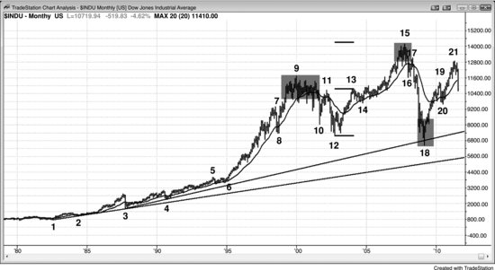
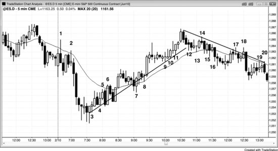

磁力位分两种：支撑和阻力。当磁力位位于市场下方时，它就是支撑位，意味着多头会在该区域建仓，空头会在此对空头仓位止盈。当磁力位位于市场上方时，它就是阻力位，意味着多头会在此对多头仓位止盈，空头会在此建仓。支撑和阻力就像磁铁一样把价格吸引过去。一旦你注意到当前价格附近存在一个磁力位，在价格触及它之前，应只做朝向磁力位方向的交易。到达之后，你需要判断市场接下来是反转、横盘，还是忽略该磁力位继续顺势运行。磁力位告诉你的是价格可能（60%+）去往的目标，而非到达的路径，途中可能（60%+）出现大幅回调。此外，市场可能（60%+）在交易区间内横盘数十根K线，但始终处于磁力位的打击距离之内。尽管你应该对磁力位保持关注，但在市场决定是否去测试磁力位以及以何种方式到达之前，两个方向仍然可能（60%+）出现可靠的交易机会。

交易员时刻在关注支撑和阻力。市场具有惯性，倾向于延续之前的运动方向。当市场处于趋势中时，大多数反转尝试都会失败。比如在一段空头趋势中，大多数支撑位都撑不住，也挡不住下跌。但所有的多头反转都发生在支撑位（所有的空头反转都发生在阻力位），因此一旦市场开始向上反转，潜在回报往往是风险的好几倍。即使成功概率通常（60%+）只有40%，交易者方程仍然为正，这笔反转交易在数学上是合理的。惯性同样意味着，当市场处于交易区间时，大多数突破尝试会失败——价格会反复从区间底部的支撑处向上反转，从区间顶部的阻力处向下反转。尽管大多数反转趋势的尝试都会失败，但所有的趋势反转和所有的回调都起始于支撑位和阻力位，因此知道这些位置在哪里，能帮助交易员在最佳位置止盈和进场做反转交易。

Emini 的交易大部分由电脑完成，算法基于逻辑和数字运行。当算法在下跌中买入或在上涨中卖出时，是因为它们计算出该价格是一个合理的下单位置。如果足够多的算法使用了相近的价格，市场就可能（60%+）反转——至少持续一两根K线，而且往往足以产生一笔盈利的交易。虽然有些算法使用的数据并非直接来自 Emini 价格图表（比如可能（60%+）基于期权市场或其他相关市场的数据），但除非大量程序得出了相近的数字，否则不太可能（≤40%）有足够的力量改变市场方向。市场反转时，总是发生在支撑位和阻力位；经过练习，个人交易员通常（60%+）能发现这些位置。因为其中一些反转能带来盈利的交易，而且这些位置也是合理的止盈区域，所以了解可能（60%+）的转折点在哪里是有价值的。

寻找磁力位的一个重要原因是，它们是部分止盈或全部止盈的合理区域。止盈的动作应该永远比反向寻找入场机会更果断。换言之，反向建仓需要比止盈更强的建仓形态。如果价格走向磁力位的过程比较弱，且方向与更大级别的趋势相反，你还可以在磁力位附近反向建仓，预期会出现反转。市场通常（60%+）会略微过冲磁力位，如果走向磁力位的过程不是强趋势，市场通常（60%+）会反转，至少持续一两根K线。如果趋势恢复、进一步越过磁力位之后又出现第二次反转，这通常（60%+）是一个可靠的反向交易建仓形态，尤其是出现强反转K线的时候。

任何有意义的价格行为都可以形成支撑或阻力，常见的例子包括：

- 趋势线。
- 趋势通道线。
- 任何时间周期上的任何类型的均线。
- 测量移动目标。
- 之前的波段高点或波段低点。
- 多头入场K线的低点和空头入场K线的高点。
- 多头信号K线的高点和空头信号K线的低点。
- 昨日的高点、低点、开盘价和收盘价。
- 任何K线的高点、低点、开盘价或收盘价，尤其是大趋势K线。
- 日枢轴点。
- 斐波那契回撤位和投射位。
- 任何类型的布林带。

**支撑**和**阻力**是交易员创造的术语，用来描述某个价格在数学上具有足够的优势，使交易员可以据此做出有利可图的交易。这些术语的存在是为了帮助交易员发现交易机会。在每个时间周期上，每根K线的高点都对应着某个阻力位，低点都对应着某个支撑位，而收盘价之所以恰好停在那里——不高一个 Tick 也不低一个 Tick——是因为电脑将它放在了那个位置，背后自有其逻辑。支撑和阻力未必一眼就能看出来，但既然一切都由电脑控制，而电脑依靠逻辑运作，那么一切就必定有其道理，即使经常难以理解。图表上的每个价格都具有某种数学优势，但这种优势通常非常微小，除了高频交易程序之外，普通交易员根本无法利用——许多高频交易程序本身就是为了赚取一分钱利润而设计的剥头皮策略。从定义上讲，只有当一个价格在方向性概率上存在明显的不对称时，才称得上支撑或阻力。比如，市场跌到某个支撑位，交易员认为至少有大约 60% 的概率会出现一波足以做剥头皮的反弹——剥头皮是指每个交易员的最小交易单位。如果概率只有 52% 或 53%，交易员可能不会觉得这够得上"支撑"二字，而只会将这个价格视为平平无奇。如果市场处于交易区间的中部，前一根K线的低点从广义上来说，总是至少可以算作一个最小的支撑区域，但这并不意味着预期反弹幅度大到足以做出一笔有利的交易。如果预期反弹只有两三个 Tick，从交易员的角度来看就算不上支撑。假设当前K线还在形成中，价格停在低点，比前一根K线的低点高一个 Tick，此时市场先弹两个 Tick 再跌两个 Tick 的概率大概有 53%。但这个优势太小、波动幅度也太窄，交易员不会据此下单（高频交易程序可能会做这笔交易），因此交易员不会将其称为支撑。阻力的道理正好相反。

支撑和阻力之所以存在，是因为市场具有记忆。一旦价格回到之前的位置，市场往往会重复上次在该位置发生过的行为。比如，市场跌破交易区间的底部后又反弹回来测试该底部，通常会再次遭到卖出，因为上次价格处于这个水平时走的就是同样的路径。那些没能及时了结多头仓位、一路扛过空头下跌那段行情的交易员，会急切地抓住第二次机会，以更小的亏损出场。他们会一直持有仓位，等待市场反弹回来测试突破位。到了那个时候，他们就会卖出平掉多头，由此制造抛压。与此同时，在下跌底部止盈的空头也会急着趁反弹再次做空。空头的新卖单加上多头的平仓卖出，共同构成了对进一步上涨的阻力，通常会把市场再次压下去。

当市场多次跌到某个价格后都弹起来，就说明该价格位置存在支撑。如果市场涨到某个价格后反复回落，那个区域就是阻力。任何支撑或阻力区域都会像磁铁一样，将价格吸向自己。随着市场逐渐靠近，它进入了磁场范围，距离越近磁力越强，市场触及该价格的概率也越高。这种磁力有一部分来自真空效应。举个例子：如果市场正处于空头趋势中的一段反弹，朝着空头趋势线靠近但尚未碰到，卖方往往会退到一旁，等待测试完成。既然他们相信市场会碰到那根趋势线，那么在趋势线下方就急着卖出就不合理——反正很快就能在更高的价格卖出。卖方的缺席造成了买方力量的失衡，也就是真空效应，将市场快速向上吸引。结果往往走出一根多头趋势K线。随后，做剥头皮的多头止盈平仓，空头入场做空。由于低点处并未出现明确的多头反转形态，大多数多头买入时就是当剥头皮来做的，预期只是一段回调，之后空头趋势仍会继续。

寻找磁力位的一个重要原因在于，它们是合理的部分止盈或全部止盈位置。止盈时的反应一定要比寻找反方向入场时更快。换句话说，在反方向开新仓所需要的建仓形态，比止盈时的要求更强。如果价格朝磁力位的运动较弱，又是逆着更大趋势的方向，你也可以考虑在反方向开仓，押注反转。市场通常会至少小幅冲过磁力位，如果朝磁力位的运动并非强趋势，市场通常会反转，至少持续一两根K线。如果趋势恢复后越过磁力位更远、然后出现第二次反转，这通常是一个可靠的反方向建仓形态，尤其是在出现一根强反转K线的时候。

任何显著的价格行为都可以形成支撑或阻力，常见的例子包括：

- 趋势线。
- 趋势通道线。
- 任何时间周期上的任何类型的均线。
- 测量移动目标位。
- 前方波段高点或波段低点。
- 多头入场K线的低点和空头入场K线的高点。
- 多头信号K线的高点和空头信号K线的低点。
- 昨天的高点、低点、开盘价和收盘价。
- 任何K线的高点、低点、开盘价或收盘价，尤其是大型趋势K线。
- 日线枢轴点。
- 斐波那契回调位和投射位。
- 任何类型的通道带。

一旦市场到达目标位，交易员就会认为市场向下走出足够获利空间的概率更大了。空头仿佛凭空冒出来，激进而持续地做空，把市场打压下去。那些在强多头趋势K线顶部买入的弱势多头，看到没有后续跟随，顿时傻眼了。但他们其实误读了那根多头趋势K线的含义——他们以为交易员突然确信市场要突破趋势线、开启一段多头腿，却完全忽略了真空效应，没想到空头只是在等市场再涨一点。那根强多头趋势K线之所以出现，是因为空头暂时退场观望，而不是因为空头在回补空单。一直在买入的多头需要找到对手方来接单，而他们只能在更高的价位找到愿意做空的对手——那个位置正是空头认为市场将开始反转的地方。市场会继续下跌到一个中性区域，通常还会跌穿这个区域（概率60%以上），跌到多头重新获得数学优势的位置。这是因为市场永远不知道自己已经走得够远了，直到走过头才知道。之后市场会围绕中性区域上下波动，波动区间越来越窄，因为多空双方对价值的定义越来越精确。到了某个时刻，双方都觉得当前价格偏离了合理价值，市场便再次突破，开启新一轮的价值寻找。

每一次逆势的急速运动都应该被视为真空效应引发的回调。比如，如果5分钟图上出现一根猛烈的空头急速K线，然后市场突然反转、进入一段多头腿，说明在那个低点存在一个支撑区域——不管你事先有没有看到。多头之前退场等待，直到市场到达他们认为足够划算的位置，而这个好价格的买入机会转瞬即逝。他们果断入场，大量买入。聪明的空头也知道那个磁力位的存在，趁机在空单上止盈。结果就是5分钟图上形成了一个市场底部。这个底部和所有底部一样，出现在某个高时间周期的支撑位上，比如一条多头趋势线、一条均线，或者一个大型牛旗底部的空头趋势通道线。重要的是要记住：如果5分钟图上的反转信号足够强，你应该基于这个反转信号买入，不管你有没有在日线图或60分钟图上看到支撑。同样，即便你在高时间周期上看到了支撑，除非5分钟图上出现了正在构筑底部的迹象，否则也不应该在那个低点买入。换句话说，你不需要翻看很多不同的图表去寻找支撑位，因为5分钟图上的反转本身就告诉你支撑就在那里。如果你能够同时跟踪多个时间周期，你会在市场到达支撑位和阻力位之前就提前看到它们，这可以提醒你在市场触及磁力位时，去5分钟图上寻找建仓形态。但如果你只是认真跟踪5分钟图，它会告诉你所需要知道的一切。

一般来说，如果市场测试某个支撑区域四五次，跌破该支撑的概率就会上升，到某个时刻，跌破就变得比反弹更有可能（概率60%以上）。如果在这个位置托住市场的买方一次又一次未能成功推动反弹，他们最终会放弃，被卖方压垮。比如，市场停在一条走平的均线上方，交易员每次价格触及均线都会买入，预期出现反弹。但如果市场持续横盘，连一个足以获利的剥头皮反弹都没给出，到某个时刻他们就会卖掉多单，形成抛压，同时也不再在均线附近买入。买盘的消失会使市场跌破均线的概率增大。多头已经认定均线提供的折扣不够大，不值得激进买入，他们要等价格再便宜一些才动手。如果市场跌破均线后的10到20根K线内找不到这些买家，通常（概率60%以上）要么开始向下趋势运行，要么继续在交易区间内波动，但此时已经在均线下方了。交易员会开始在反弹到均线附近时做空，这会增加市场形成更低高点的概率，并使均线开始向下倾斜。一旦市场跌破支撑，支撑通常（概率60%以上）就会变成阻力；一旦市场突破阻力，阻力通常（概率60%以上）就会变成支撑。

趋势线和趋势通道线也会出现同样的情况。比如，如果一个多头市场回调到趋势线四次或更多次，而且每次都没能大幅反弹到趋势线上方，到某个时刻多头就会停止在趋势线测试时买入，转而卖出多单，形成抛压。这些抛压叠加上空头的卖出，再加上多头已经不再买入，市场就会跌破趋势线。不过有时候，市场反而会突然加速上涨——空头停止在每次小幅反弹时做空，转而回补空单，推动市场走高。

**支撑**和**阻力**是交易员创造的术语，用来描述某个价格具有足够的数学优势、让交易员可以做出盈利交易。这些术语的目的是帮助交易员发现交易机会。每根K线在每个时间周期上，高点都处于某个阻力位，低点都处于某个支撑位，而收盘价之所以在那里——不多一个tick也不少一个tick——是因为计算机出于某种原因把它放在了那里。这些支撑和阻力可能并不明显，但既然计算机控制着一切，而计算机使用逻辑，那么一切都必然有其道理，即便我们经常难以理解。图表上的每个价格都有某种数学优势，但这些优势通常太小，除了高频交易程序之外无人能够利用——其中很多程序本身就是为了赚取极微薄利润而设计的剥头皮策略。从定义上说，一个价格只有在存在方向性概率不平衡时，才算是支撑或阻力。比如，如果市场跌到一个支撑位，交易员认为至少有大约60%的概率会出现一次足以做剥头皮的反弹——这是每个交易员的最低标准交易。如果概率只有52%或53%，交易员大概率不会认为这个概率高到值得使用"支撑"这个词，而只会把这个价格看作没什么特别的。如果市场处于交易区间中间，前一根K线的低点在广义上总算是一个最小的支撑区域，但这并不意味着预期的反弹大到足以做出盈利交易。如果预期反弹只有几个tick，从交易员的角度来看就不算支撑。假设当前K线还在形成中，价格正处于低点、距离前一根K线的低点只有一个tick，可能有53%的概率市场会先弹起两个tick再跌两个tick。但这个优势太小、价格波动也太小，交易员无法据此下单（虽然高频交易程序可能会做这笔交易），所以交易员不会称之为支撑。阻力的道理正好相反。

支撑和阻力之所以存在，是因为市场有记忆。一旦市场回到之前的某个价格，它往往会重复上次在这个价位时的行为。比如，如果市场跌破一个交易区间的底部，然后反弹回到区间底部，通常（概率60%以上）会再次被卖出，因为上次在这个价位时市场就是这么走的。那些没能及时平掉多单、被套在整段空头腿中的交易员，非常想得到第二次以较小亏损出场的机会，他们会一直持仓等到市场反弹回来测试突破位。到了那个时候，他们就会卖出多单，形成抛压。同时，在下跌底部止盈的空头也急于在反弹时重新做空。空头的卖出加上多头的清仓，共同构成了对进一步上涨的阻力，通常（概率60%以上）会把市场重新打压下去。

当市场回落到某个价格、多次触及后每次都弹起来，说明这个价位存在支撑。如果市场涨到某个价位后反复回落，这个区域就是阻力。任何支撑或阻力区域都像磁铁一样，把市场吸向那个价格。随着市场靠近，它进入磁场范围，越近磁力越强，市场触及该价格的概率也越大。磁力增强的部分原因来自真空效应。比如，如果市场在一段空头趋势中反弹、接近空头趋势线但还没碰到，卖方往往会退场等待测试。如果他们相信市场会触及趋势线，那在趋势线下方就卖出就不划算了——反正很快就能在更高的位置卖。卖盘的缺失造成了买方主导的失衡，形成真空效应，迅速把市场吸上去，结果往往形成一根多头趋势K线。之后，做剥头皮的多头止盈平仓，空头卖出建立新的空单。由于在低点没有出现明确的多头反转信号，大多数多头是以剥头皮的心态买入的，只预期出现一次回调，然后空头趋势继续。

机构交易由自主交易员和计算机程序共同完成，程序化交易的占比越来越大。机构的交易决策可以基于基本面、技术面，或两者的结合，这两类交易都可以由人或计算机来执行。大体上，多数自主交易员主要靠基本面信息做决策，多数计算机交易则以技术面数据为依据。目前市场上大部分成交量来自高频交易公司，而这些交易主要基于价格行为和其他技术数据，所以程序化交易本质上是技术面驱动的。20世纪末，单个机构运行一个大型程序就能推动市场，程序执行时会形成一个微型通道，交易员看到微型通道就知道有程序在运行。现在，Emini 大多数交易日都会出现十几个微型通道，很多交易日的成交量超过10万手。按 Emini 目前1200点的价位算，这大约相当于60亿美元，已经超出单个机构在一笔小额交易中会投入的规模。这说明单个机构没法把市场推太远、推太久，图表上所有的价格运动都是多个机构同时朝同一方向交易的结果。另外，高频交易计算机对每一个 Tick 都会分析，全天不间断地下单。一旦检测到某个程序在运行，很多高频交易公司就会顺着这个程序的方向做剥头皮交易，在微型通道（程序）持续推进期间，高频交易往往占了大部分成交量。

那些主要依据技术面交易的机构不可能一直把市场推向单一方向，因为价格到了一定水平，依靠基本面交易的机构会认为出现了有价值的交易机会。如果技术面机构把价格推得太高，基本面机构和其他技术面机构会觉得这是卖出多头仓位、建立空头仓位的好价位，它们的抛压会压倒多头方向的技术面交易，把市场拉下来。当技术面交易制造出一轮空头趋势后，市场到了某个点位，基本面机构和其他技术面机构会觉得价格明显便宜了。买家会涌入，压倒那些制造抛售的技术面机构，把市场推回上行。

所有时间周期上的趋势反转都发生在支撑和阻力位附近，因为技术面交易员和程序会在这些区域停止追涨（多头加仓）或杀跌（空头加仓），开始止盈，很多还会反向交易。这些点位都基于数学计算，占全部交易量70%、机构交易量80%的计算机算法对它们的位置一清二楚。同样，机构的基本面交易员也会关注明显的技术面因素。他们把图表上的主要支撑和阻力视为价值区域，市场到达那些位置时会反向建仓。那些基于价值交易的程序通常也会在差不多的位置找到价值，因为不管用什么衡量标准，主要支撑和阻力附近几乎总存在显著的价值。大部分程序的决策依据就是价格，没什么秘密可言。当一个价位很重要时，不管用什么逻辑，所有程序都能看到。基本面交易员（包括人和机器）会等价值出现，一旦发现就大举投入。他们想在市场便宜时买、贵时卖。比如，市场在下跌，但接近一个机构认为足够便宜的价位时，买家会突然冒出来大举买入。这种情况在开盘反转中表现得最剧烈、最频繁（开盘反转可以朝上或朝下，在第三册讨论开盘交易的章节中会详细介绍）。空头回补止盈，多头买入建立新仓位。没有人擅长判断市场到底涨到位了还是跌到位了，但大多数有经验的交易员和程序对于"市场是不是走过头了"通常还是有相当把握的。

机构会等到市场明显超卖后才出手买入，因此在潜在底部上方的区域缺少买家，市场得以加速下跌，一直跌到机构认为"已经够便宜"的位置。有些机构靠程序来判断买入时机，有些靠主观决策。一旦足够多的机构入场买进，市场通常（60%+）会至少走出两段上涨，在对应时间周期的图表上持续大约十根或更多K线。下跌过程中，机构一路做空，直到他们判断市场已经到达一个概率较高（60%+）的目标位，继续下跌的可能性不大，这时便开始止盈。市场越超卖，成交量中技术性交易的占比就越高，因为基本面交易员和程序不会在自己觉得市场已经便宜、即将被买入的时候继续做空。当市场接近一个重要支撑位时，买家的相对缺席往往导致卖盘加速涌向支撑位，通常（60%+）形成真空效应，把价格吸到支撑下方，以高潮式的抛售完成最后一波杀跌，随后市场急速反弹。大多数支撑位不会真正止住空头趋势（大多数阻力位也不会止住多头趋势），但当市场最终反转向上时，它一定处在某个非常明显的重要支撑位上，比如一条长期趋势线。抛售的底部和向上反转通常（60%+）伴随着非常大的成交量。下跌过程中，市场会经历多次反弹到阻力位、再回落到支撑位的来回拉锯，每一次反转都发生在足够多的机构认为"走过头了，反方向交易有价值"的时候。当足够多的机构在同一水平附近同时行动时，一次主要反转就形成了。

判断支撑（和阻力）的方法既有基本面的，也有技术面的。比如可以通过计算来估算标普500的市盈率倍数理论上应该是多少，但这类计算永远不够精确，无法让足够多的机构达成共识。相比之下，传统的支撑和阻力区域更容易被看到，因此更可能（60%+）被大量机构注意到，也能更清晰地标示出市场应该在哪里反转。1987年和2008—2009年的崩盘中，市场都是跌到略低于月线趋势线的位置后反转上涨，形成了一个重要底部。此后市场持续上涨，期间多次回测，直到涨得过头——而那总是在一个重要的阻力位上。只有到那时，机构才有信心认为卖出多头、建立空头仓位具有明确价值。接下来过程反转，市场转而向下运行。

基本面（买入或卖出的价值）决定总体方向，但技术面决定实际的转折点。市场始终在探测价值——也就是寻找极端位置——而这些极端位置总是落在支撑位和阻力位上。任何时候发布的报告和新闻都可能改变基本面（对价值的认知），足以推动市场上涨或下跌几分钟到几天。持续数月的重要反转基于基本面，其起点和终点都在支撑位和阻力位上。这对所有市场、所有时间周期都适用。

有一点很关键：市场从大顶开始转跌之后，新闻仍会报道基本面偏多；市场从大底开始转涨之后，新闻仍会报道基本面偏空。新闻还在说看多或看空，并不代表机构也这么看。要根据图表做交易，不要跟着新闻做。价格就是真相，市场永远走在新闻前面。实际上，市场顶部时新闻最看多，市场底部时新闻最看空。记者被狂热或恐慌裹挟，到处找专家来解释为什么趋势这么强、还会持续很久。他们会忽略最聪明的那批交易员，甚至根本不知道那些人是谁。那些交易员关心的是赚钱，不是上新闻，不会主动找记者。记者打车上班时，出租车司机跟他说刚卖掉所有股票、还抵押了房子去买黄金，记者听了兴奋得不行，赶紧找个看多的专家上节目来印证自己的"深刻洞察"。"你看，市场多强啊，连出租车司机都在买黄金！所有人都会抛掉其他资产来买，金价肯定还要涨好几个月！"在我看来，当最弱的交易者都终于进场了，市场就没有新的买盘了。你要卖出获利，就需要有人愿意在更高价格接盘。当没有人愿意接盘时，市场只能朝一个方向走——跟新闻告诉你的刚好相反。电视上那些口若悬河的教授级专家不断用高深的论点说黄金不可能跌、明年还会再翻一倍，确实很难不被说动。但你要清楚，他们上电视是为了自我宣传和娱乐效果。电视台需要娱乐内容来吸引观众和广告收入。想知道机构到底在干什么，看图表就行。机构体量太大，根本藏不住，只要你懂得读图，就能看到他们在做什么、市场要往哪里走——这跟你在电视上看到的东西通常没什么关系。

大部分主要顶部并不是由巨大的K线和成交量构成的高潮形成的，那种高潮更常出现在主要底部。顶部更多是从交易区间中走出来的，比如双顶或头肩顶，随后以一段空头急速突破完成破位。不过，顶部也可以是高潮形态，底部也可以是交易区间。

交易区间（后续章节）和通道（第一册）的章节会讲怎么利用支撑和阻力来下单。比如，交易员会在通道或其他类型交易区间的底部附近买入，在顶部附近做空，然后在价格测试通道或交易区间另一侧时止盈并反手。

在强趋势中，市场会超越大多数磁力位。比如在多头趋势里，初学者会发现上涨远远超过他们画出的每一个测量移动目标和趋势通道线。这些初学者会在每一个他们认为的阻力位错误地做空，结果一整天亏损越来越大。他们不断在看起来很好、实际很差的顶部做空，却不肯在看起来很差、实际很好的回调处买入。不过，当回调或反转最终出现时，一定发生在某个阻力位上。即使在强趋势中，测量移动目标也经常精确到tick地起作用。这当然部分是因为计算机能精确计算。计算机主导着市场，它们的止盈必然设在某个计算出的水平上，而那个水平总是在某个磁力位。另外，如果一笔交易勉强算"好"——也就是说这个策略是盈利的——回报至少要跟风险一样大，交易者方程才为正。这通常意味着当回报达到风险大小时就会出现一些止盈动作，因为这是使策略盈利所需达到的最低水平。小级别的波段经常精确结束在测量移动的投射位上，很多强趋势也恰好终结于某个重要测量移动目标处，精确到tick以内——价格被真空效应吸到了磁力位。

**图 PII.1** 道琼斯工业平均指数月线图

道琼斯工业平均指数月线图（图 PII.1）展示了几种类型的支撑和阻力（都是磁力位）。

趋势线和趋势通道线是重要的支撑和阻力区域。2009年崩盘中，K线18的底部在从1987年崩盘低点到1990年10月回调低点所画的月线趋势线下方反转上涨。它同时也处于由K线8和K线12形成的趋势通道线上（构成了对冲线形态，后面章节会讨论）。所有从空头市场反转上涨的重大反转都发生在支撑位上，所有顶部都发生在阻力位上，但大部分支撑和阻力并不能阻止趋势。不过，如果出现了强反转形态，而且形成在支撑或阻力位上，机构就会止盈，很多还会反向入场。市场底部更多来自抛售高潮，比如1987年和2009年的崩盘。市场顶部更多来自交易区间，比如K线9和K线15附近。

K线15的高点接近一个测量移动上涨目标，基于K线12到K线13多头急速的高度。

均线反复充当支撑，比如K线3、4、6、8、14和20处，也反复充当阻力，比如K线11和17处。

交易区间充当支撑和阻力。K线9交易区间的向下突破成为K线11反弹的阻力，K线15交易区间成为K线17反弹的阻力。市场涨到K线15后，K线16在K线9交易区间顶部获得支撑。

波段高点和低点充当支撑和阻力。K线12在K线8的低点获得支撑，形成双底。K线13与K线11形成双顶，但市场横盘整理后很快向上突破了那个阻力。

**图 PII.2** 支撑可以变成阻力，阻力可以变成支撑

图 PII.2的Emini 5分钟图中，支撑变成了阻力，阻力变成了支撑。均线和趋势线都是如此。

K线1、2、5、6、17、18、19和20反弹到均线时遇到卖盘，K线7、8、13、15和16小幅回调到均线时有买盘接住。

K线12、13、15和16反复测试均线，多头没有得到回报，很快就不再在回调处买入了。市场随后跌破均线，空头开始在小幅反弹至均线时做空，形成一系列更低高点和更低低点。

多头趋势线是一条最佳拟合线，画的时候尽量让更多K线触及它。买方明显在趋势线附近买入，测试了十几次却没有出现急速的上涨离开趋势线。这种缺乏加速的状态让多头随着时间推移越来越谨慎，最终不愿在趋势线附近买入了。一旦市场跌破趋势线，多头更加犹豫不敢买入，开始平掉多头仓位；空头变得更加激进。更低高点和更低低点形成后，交易员开始画空头趋势线，在反弹处做空。

顺便说一下，任何向上倾斜的通道都应该被看作一面熊旗，即使它是多头市场的一部分，因为最终趋势线会被跌破，市场走势就如同那个通道就是熊旗一样。同样，任何向下倾斜的通道都应该被看作一面牛旗，其最终的突破应该按照多头腿正在展开的方式来交易。
