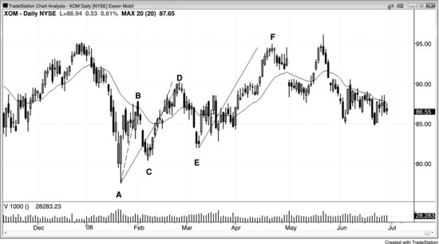
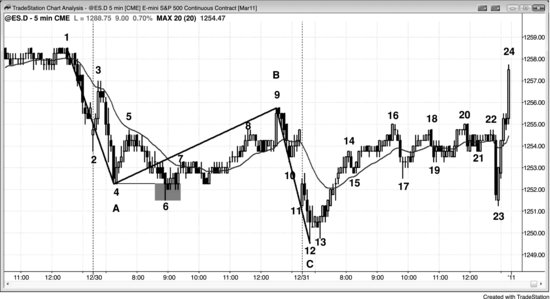
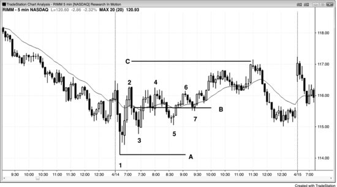
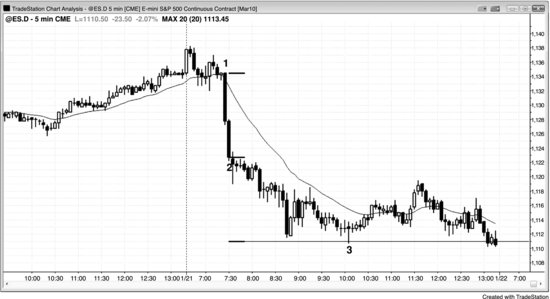
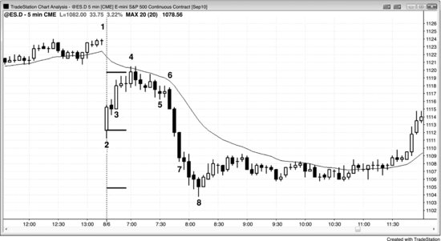

测量移动是指一段波段的幅度与之前同方向的波段相等。你根据市场第一次走出的幅度，来估算第二次能走多远。测量移动为什么有效？如果你在寻找测量移动的机会，说明你认为自己知道 Always-in 的方向，也就是说你对这波行情至少有 60% 的把握。测量移动的计算通常基于急速阶段或交易区间的高度，初始保护性止损一般设在第一段行情起点的外侧。比如，一波强劲的买入急速阶段出现后，初始保护性止损就放在急速阶段最低点下方一个 Tick。如果急速阶段幅度很大，交易员通常不会真的承担那么大的风险，而且一般仍然能赚到钱，但理论上止损位依然在急速阶段下方。此外，概率往往还超过 60%。假设急速阶段大约 4 个点高，那风险就大约是 4 个点。既然你相信测量移动会实现，认为在急速阶段顶部买入是合理的，那你就是在一笔概率 60% 的交易中承担 4 个点的风险。从数学角度看，如果概率是 60%，要让这个策略盈利，回报至少要与风险相当。这一点在第 25 章"交易数学"中有详细讨论。也就是说，要让这个策略成立，你需要有 60% 的概率赚到至少 4 个点——这恰好就是测量移动的目标位。换句话说，只有当测量移动目标大约 60% 的时间能被触及，这个策略才行得通。而顺势交易是最可靠的交易方式，如果真有哪种策略能长期有效，顺势交易的测量移动一定是其中之一。这是不是测量移动有效的真正原因？没人能确定，但这是一个合理的解释，也是我能想到的最好的解释。

大多数测量移动要么基于急速阶段，要么基于交易区间。基于急速阶段的测量移动通常会引出一段交易区间；基于交易区间的测量移动通常会引出一段急速阶段。比如，双顶（一种交易区间形态）出现之后，交易员往往在向上或向下的突破达到测量移动目标时部分止盈。交易员寻找的是突破——也就是一段急速阶段——他们通常预期急速阶段到达测量移动区域后会出现部分止盈行为。如果突破时的急速阶段很强，且在测量移动目标处没有明显停顿，那么这段急速阶段本身又会基于自身高度产生一个新的测量移动。市场到达那个位置后，交易员往往开始止盈，结果通常就形成一段交易区间。

一波强劲行情出现回调后，通常会有同方向的第二腿，其幅度往往与第一腿接近。这个概念是几种可靠的目标测算方法的基础，用来预估第二腿可能在哪里结束。测量移动区域是一个合理的止盈位置，止盈后可以等下一次回调再重新建仓。如果出现强反转建仓形态，也可以考虑做一笔逆势交易。

当市场走出一波急速行情然后回调，通常（60% 以上的概率）会出现第二腿，而且第二腿的幅度往往与第一腿接近。这就是"第一腿 = 第二腿"的走法，也叫 ABC 走法或 AB = CD。这些字母命名容易搞混，直接说"第一腿"和"第二腿"以及第一腿之后的回调，更简单明了。字母标记容易混淆的原因在于：AB = CD 形态中的 B、C、D 分别对应 ABC 走法中的 A、B、C。ABC 中的 B 腿是回调段，它在市场概况图（CME 集团的价格与时间信息图）上形成一个密集区。任何密集区的中间位置往往都能引出一个测量移动，而这里算出的目标与 AB = CD 算出的一致。以多头趋势中的 AB = CD 为例：从 A 点出发，加上 AB 腿的长度（即 B - A），再加到 C 上，得到 C + (B - A)。用密集区的方法则是：从 A 出发加上 AB 腿的长度（即 B - A），再向下减去 BC 密集区高度的一半，然后将 B 减去 BC 密集区一半高度后的值作为从 BC 密集区中间向上的测量移动目标。两个公式的结果都是 C + (B - A)，所以测量移动的投影是一样的。这些计算过于复杂，实际意义也有限，因为你不应该仅凭斐波那契扩展、测量移动或其他任何吸引位就用限价单逆势交易。它们只是提供一个参考，帮你在行情接近目标之前一直顺势持仓，到了目标附近再留意逆势建仓形态。

除了那些明确的回调入场点可以构成测量移动之外，有时还有一种不太明显但同样有效的情况。当市场出现一段强劲的趋势运动，接着是一段力度不小的回调腿，然后进入交易区间，交易员可以用这个区间的大致中点来推算第二段回调腿可能到达的位置。随着交易区间不断展开，持续调整你估算的中点位置，等到第二段回调腿最终走完，这个中点通常就在回调整体的中间附近。这只是一个参考，帮你大致判断两段式回调会在哪里结束、市场会在哪里形成顺势入场的建仓形态。你也可以直接用"第1腿 = 第2腿"的方法来测量。比如在一个两段式牛旗中，量出第一段下跌腿的长度，然后从回调的顶部减去这个高度，就能找到第二段下跌腿可能结束的合理位置。

在急速与通道趋势中，有一种类似的变体：通道的高度往往跟急速阶段的高度差不多。当急速阶段很强的时候尤其如此，比如由异常大的趋势K线组成，或者由几根重叠很少、影线很小的强趋势K线组成。当急速阶段很强时，市场往往会沿某个方向形成测量移动——通常是顺势方向——基准取自第一根和最后一根急速K线的开盘价、收盘价、最高价或最低价的某种组合。举个例子，如果出现一个巨大的多头急速阶段，量出从第一根K线的开盘价到最后一根K线收盘价的点数，再把这个点数加到最后一根K线的收盘价上。随后形成的通道通常会在这个区域遇到阻力，市场往往会回调到通道底部。这个测量移动目标就是你可以对多头仓位止盈的区域。有时市场的测量移动可能是从第一根急速K线的最低价到最后一根急速K线的收盘价或最高价，也可能是从第一根K线的开盘价到最后一根K线的最高价，所以审慎的做法是把所有可能性都考虑一遍。偶尔市场不会形成什么像样的向上通道，而是直接反转跌破急速阶段的底部，然后形成向下的测量移动。

有一点很重要：大多数时候市场处于某种形式的交易区间中，因此等距移动的方向概率是50%。也就是说，市场向上走X个点的可能性和向下走同样点数的可能性是一样的。当存在趋势时，顺势方向的胜率更高。当急速阶段很强时，出现跟随的概率可能（60%+）达到60%，如果整体图表形态也支持一波强劲的趋势运动，有时甚至能到70%。另外，当市场处于交易区间底部时，概率偏向向上运动；处于区间顶部时，概率偏向向下运动。这是因为市场有惯性——市场倾向于延续当前的状态。如果正在走趋势，更大概率继续走趋势；如果在交易区间里，突破尝试更大概率失败。事实上，大约80%的趋势反转尝试都会失败，所以你应该等它们演变成回调，然后顺势入场。同样，大约80%的交易区间突破尝试也会失败，在区间顶部和底部做押注失败，从数学角度看远比在顶部附近追多头趋势K线、在底部附近追空头趋势K线更划算。

下面是一个用到多项假设的测量移动实例。市场出现了一个由3根多头趋势K线组成的强劲多头急速阶段，突破了一个交易区间。下一根K线是一根小十字星，这次暂停意味着急速阶段在前一根K线——也就是连续多头趋势K线的最后一根——就已经结束了。这次突破很强，因为K线之间的重叠非常少，每根K线的开盘价都在前一根收盘价的位置或上方。所有K线中最大的影线也只有2个tick，有几根K线底部完全没有影线。第一根K线高3.5个点（14个tick），第二根高10个tick，第三根高8个tick，第四根K线有1个tick的多头实体，底部有3个tick的影线，顶部有2个tick的影线。这根十字星是第一根缺乏动能的K线，因此它告诉你急速阶段在前一根K线就结束了。第一根K线的开盘价比第三根（也是最后一根）多头趋势K线的收盘价低8个点，所以这个急速阶段至少应该被视为8个点高。你也可以用第一根K线的最低价到第三根K线的最高价，甚至到第四根十字星K线的最高价来量，但用较小的数值做初始目标更保守。如果第二段腿超过了这个目标，再看其他目标。

假设你在急速阶段形成过程中的某个位置买入，止损放在急速段底部下方。为简单起见，就把止损设在急速段第一根K线开盘价下方一个 tick 处。如果急速段涨了 3 个点时你以市价在最高点买入，风险大约是 3 个点，目标利润至少也是 3 个点。你相信市场会走出一个等于急速段高度的测量移动——也就是 3 个点。止损的位置你是知道的，虽然还不知道急速段顶部在哪，但至少知道它会涨到你买入的位置。既然你判断市场处于趋势中，就有理由认为市场向上走 3 个点的概率大于 50%——换句话说，市场更可能先涨 3 个点，而不是先跌到下方 3 个点的止损位。

随着急速段继续上涨到 7 个点，你的判断也跟着更新。你认为市场仍处于趋势中，至少有 50% 的概率先涨 7 个点，而不是先跌 7 个点。此时初始仓位已有 4 个点的浮盈，而你原本的计划是冒 3 个点的风险去赚 3 个点。如果愿意，可以在急速段还在形成时于最高点加仓，新仓位的风险是 7 个点（可能还要多几个 tick，因为止损大概会放在急速段第一根K线底部下方一个 tick），目标利润也是 7 个点。但对于你最初的多头仓位，风险仍然是 3 个点，而现在有超过 50% 的概率赚到总共 11 个点——从入场到当前急速段顶部的 4 个点，加上后续的 7 个点。

等到第四根K线形成后——那是一根十字星——你就知道急速段在前一根K线收盘时已经结束了。从急速段第一根K线的开盘价算起，共涨了 8 个点。这时你可以得出结论：市场有超过 50% 的概率先从急速段收盘价向上再走 8 个点，而不是先跌 8 个点回到急速段的开盘价或底部下方（向下可能要多一两个 tick，因为最安全的止损要放在急速段起点之外）。由于急速段非常强，这个概率可能 (60%+) 超过 60%。

急速段一结束，双向交易就开始了，不确定性随之增大。市场先横盘到略微下跌做了一波回调，然后进入向上的通道阶段。虽然市场有可能从这次回调的底部走出一个第一腿等于第二腿的上涨——急速段作为第一腿、通道作为第二腿——但当急速段非常强时，更可靠的目标是用急速段第一根K线的开盘价到最后一根K线的收盘价来计算的。随着市场继续上涨，向上的方向概率在慢慢下降。当多头通道走到测量移动目标大约一半的位置时，等距移动的方向概率已经回落到大约 50% 到 55%，不确定性再次变得很高。别忘了，多头通道之后通常 (60%+) 会有一波回落到通道底部的走势，然后至少出现一次反弹。所以这个多头通道实际上是一个尚未完全形成的交易区间的第一腿。一旦市场涨到测量移动目标区域附近，那里可能 (60%+) 就是这个正在形成的交易区间的上沿，市场向下运行的概率更大。所有交易区间都是如此。这里是一个非常好的多头止盈区域。由于大量交易员会在测量移动目标附近止盈，市场便开始回调。大多数交易员在市场回落到通道底部附近之前，不会再积极买入——那里通常 (60%+) 会形成一个双底。通道底部也是一个价格吸引区：多头开始重新买入，在通道顶部做空的空头也会在这里止盈。由于市场此时处于正在形成的交易区间底部附近，方向概率略微偏向多头。

市场一旦进入交易区间，只要价格还在区间中部附近，向上和向下等距运动的概率就回到50-50。假设你的风险是X个点，那么在止损触发之前赚到X个点的概率是50%，在到达利润目标之前亏掉X个点的概率也是50%。这是市场相对高效的一个副产品。大多数时候市场都是高效的，赚X个点和亏X个点的概率接近50-50。最好的交易机会出现在概率优于50-50的时候，但这往往发生在急速阶段——急速阶段情绪化、速度快、很难入场。交易员都明白这一点，所以急速阶段才能在没有任何回调的情况下迅速扩展。交易员会一路加仓，因为他们知道，急速阶段没结束之前，赚到的点数不低于所承受风险的概率就优于50-50；概率降回50-50附近，通常要等到通道阶段充分展开之后。急速阶段形成时，他们不知道价格会不会先回调再继续走高，但他们有信心短期内市场会继续上涨。与其等一个可能永远不来的回调、错过一笔强势交易，不如直接用市价单买入，或者在1到4个tick的回调上买入，止损设在急速阶段底部附近。这种紧迫感正是急速阶段形成的驱动力，而较大的风险也让很多交易员望而却步。大多数新手不愿意承担3到7个点的风险，但他们应该做的是缩小仓位——比如只用正常仓位的四分之一——然后接受这个风险，因为机构就是这么做的。机构理解背后的数学逻辑，所以不怕下这种单。

这种向50-50回归的过程，是所有测量移动交易的基础。概率一旦失衡，上涨到测量移动目标位的过程就是市场试图恢复不确定性的过程。市场总会过冲，然后不得不回撤来逼近50-50的状态。测量移动区域本身就是概率的一次过冲，此时概率短暂偏向空头。等市场回撤到通道底部，概率又一次过冲，不过这次偏向多头。当市场再次反弹回到正在形成的交易区间中部时，概率回到50-50附近，市场重新进入平衡。

**图7.1** 腿1 = 腿2

如图7.1日线图所示，埃克森美孚（XOM）从K线A到K线B走出了一段强劲的第一腿上涨，交易员在K线C的HL位置买入，预期出现腿1 = 腿2的上涨。K线D略微不及目标位（虚线顶部）。价格到达目标区域附近后，很多交易员认为这可能是跌到K线A之后的一段两段式空头反弹。如果用ABC标注法，K线B是A点，K线C是B点，K线D是C点，容易混淆，所以不如直接把上涨到K线B的那段叫腿1，下跌到K线C的那段叫回调，上涨到K线D的那段叫腿2。

K线E出现了一个HL，随后反弹突破了K线D的高点。这时交易员可以把AD整段视为一个包含两段较小腿（AB和CD）的第一腿，继续持有多头仓位，等待测量移动完成（AD = EF，目标位是实线顶部）。

斐波那契交易员还会关注其他延伸比例（138%、150%、162%等）作为潜在反转区域，但这种方法太复杂且不够精确。市场一旦明显呈现双向交易特征，只要有强信号，在低位买入、在高位卖出就同样可靠。

**图7.2** 腿1 = 腿2的变体

有时候腿1 = 腿2测量移动中的腿1并不是从最初下跌的绝对低点开始的。第一腿下跌后的回调通常是两段式上涨或楔形熊旗，但不管哪种，回调往往会跌破回调腿的起点，图7.2中K线6的位置就是如此。到K线9形成时，它看起来像是第一腿下跌后回调的终点，敏锐的交易员已经意识到一种可能：上涨到K线9的回调其实是从K线4开始的，而不是K线6，因此第二腿下跌的幅度可能等于K线1到K线4的第一腿下跌，而不是K线1到K线6的第一腿下跌。K线12的底部恰好精确到tick地完成了以K线4为第一腿终点的腿1 = 腿2测量移动。如果市场继续下跌，交易员就会观察价格跌到以K线6为腿1终点的腿1 = 腿2目标区域时的表现。

为什么把第一腿的终点定在K线4是合理的？交易员在等两段式回调上涨走完之后再启动第二腿下跌，而K线6到K线9的上涨处于通道中，所以可能（60%+）只算一腿。艾略特波浪交易员知道，向上的回调有时候会跌破初始下跌的底部，他们把这种横向回调叫做平台型修正。这里的平台型修正就是：先涨到K线5，再跌到K线6，然后涨到K线9。另外，涨到K线5的那根K线是一根相当强的多头急速K线，所以有可能是回调的起点。从急速上涨到K线6的回调形成了一个LL回调，而LL回调很常见，所以回调还在进行的时候，交易员对这种走法并不意外。

K线5和K线8构成了一个潜在的双顶熊旗，但K线9向上突破否定了这个形态。不过，每当双顶被向上突破时，交易员都会留意突破是否失败。一旦失败，实际上就形成了一个楔形顶——三次上推分别是K线5和K线8的双顶，再加上突破到K线9后的失败。

突破失败后市场急速跌到K线10，交易员由此确认，从K线1高点开始的第二腿下跌已经启动。

这张图还有一些值得关注的地方。K线12构成了一个扩散三角形底部，三次下推分别是K线4、K线6和K线12。

第一天开盘后急速涨到K线3，接着急速跌到K线6，下跌幅度大约等于K线3高出开盘价的幅度。虽然当天振幅不大，但跟近期几天的平均振幅差不多（12月底经常出现小振幅交易日）。每当一天的振幅接近平均水平，且开盘价处于当天区间中部时，市场往往会试图收在开盘价附近。交易员清楚这一点，所以K线7之后出现的窄交易区间很可能（60%+）在突破后回测当天的开盘价。当天收盘价比开盘价高1个tick，在日线图上形成了一根几乎完美的十字星。

涨到K线9的走势是对K线3下方抛售的突破回测。跌到K线23的走势是对K线13上方上涨的突破回测，距离盈亏平衡点的止损仅差1个tick，同时也精确测试了当天的开盘价。

**图 7.3** 基于交易区间中部的测量移动

图 7.3 中，Research in Motion（RIMM）在开盘反转（从昨日低点下方反转上来）后急速涨到K线2，然后回调到K线3。强劲的三根多头急速K线之后可能（60%+）出现第二腿上涨，如果交易员想预判它可能在哪里结束，可以不断调整B线，使其位于正在发展的交易区间中部。一旦市场突破，就可以做一条平行线，从A线向上等距拉到突破位置，作为测量移动的目标位，在那里止盈。虽然市场还在交易区间里，但因为区间之前是上涨走势，而且区间内大部分K线都是多头趋势K线，代表买压，所以偏向上方突破。

在市场突破三角形、涨过K线6之前，交易员可以双向操作——任何交易区间都可以这样做。交易区间是多空双方都认同价值所在的区域，大部分偏离中部的试探都会失败，市场会被拉回区间内。最终，市场会脱离这个磁力区域，在新的价位找到价值。

**图 7.4** 基于空头急速的测量移动

当新闻引发急速走势时，这段急速往往会产生一个测量移动，交易员可以在那里止盈。图 7.4 中，K线1处市场被总统提议新银行监管的消息打了个措手不及，随即出现两根大空头趋势K线。一旦出现暂停K线——比如十字星、底部带长影线的K线或带多头实体的K线——就说明急速走势在前一根K线已经结束。这里的急速持续了两根K线，交易员从急速最后一根K线的收盘价向下寻找测量移动目标。预期下跌的tick数大约等于急速第一根K线开盘价到最后一根K线收盘价之间的tick数。有时候也用第一根K线的最高价到最后一根K线的最低价来计算测量移动的高度，但交易员总是先看最近的目标，只有当第一个目标没能挡住市场时才去看更大的目标。这个目标位是波段做空最终止盈的好位置，之后可以等回调再次做空。如果在测试该区域时出现强反转信号，也可以考虑逆势交易。

**图 7.5** 急速可以引发向上或向下的测量移动

急速之后，测量移动可以朝任一方向发展。图 7.5 中，开盘出现了强劲的六根K线上涨，但在这个大缺口下跌日中，市场在均线处受阻失败，最终向下完成了测量移动。这个测量移动的计算基准是急速第一根K线的开盘价到最后一根K线的收盘价。虽然大多数急速走势一出现暂停K线就结束了，但如果暂停之后继续上涨，就应该考虑整段走势仍然充当急速的可能——在高时间周期图表上它很可能（60%+）就是一段急速。
