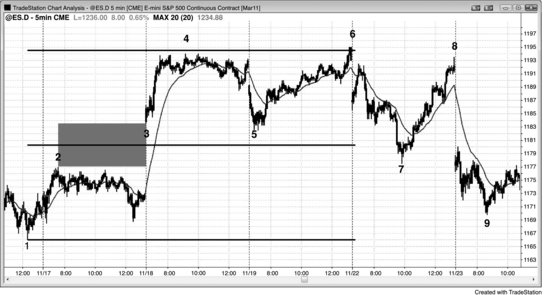
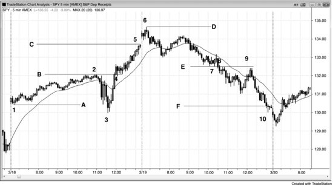
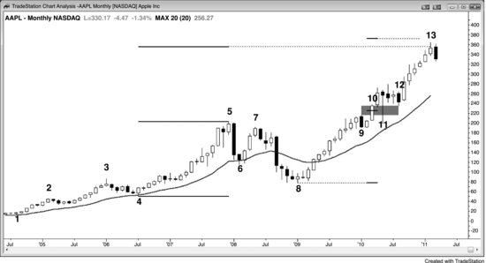
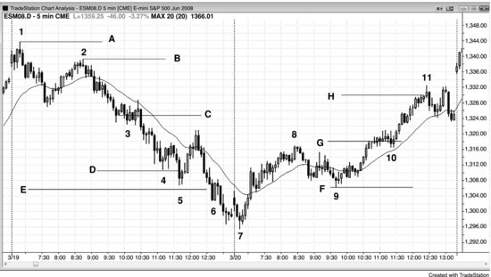
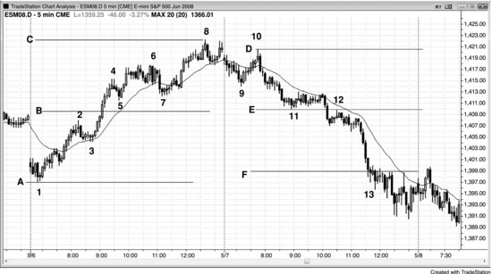

缺口在日线图上很常见——一根K线的最低价高于前一根K线的最高价，或者一根K线的最高价低于前一根K线的最低价。如果市场方向明确，缺口的中点往往就是整段趋势的中点。当价格接近测量移动目标位时，交易员会密切关注精确的目标区域，许多人会在那里部分或全部止盈，也有一些交易员会开始反向建仓。这往往导致市场出现暂停、回调，甚至反转。

日内图表上出现突破时，这种传统意义上的缺口很少见。不过，有一种同样可靠的替代形式：突破点与首次暂停或回调之间的缺口。举个例子，假设市场向上突破一个波段高点，突破K线是一根相对较大的阳线趋势K线，而且下一根K线的最低价高于突破点，那么这个最低价与突破点之间就形成了一个缺口，它往往会成为测量型缺口。如果突破后的那根K线同样是一根大阳线趋势K线，那就继续观察，等到出现第一根小阳线趋势K线、阴线趋势K线或十字星，它的最低价就是缺口的上沿。如果突破点或突破回调的位置不太明确，市场通常会直接将突破K线的中点作为缺口的中点。在这种情况下，测量移动的计算基准是：从上涨起点到突破K线中点的距离，预期市场还会在这个中点之上再走出大致相同的幅度。

如果市场在突破后几根K线内就出现回调，而且回调的最低价落在缺口范围内，那么缺口虽然缩小了，但其中点仍然可以用来推算测量移动目标。如果回调幅度更深，甚至略微跌破了缺口下沿，那么突破点与回调低点之间的中点仍然可以用于投射。由于突破回调与突破点之间的差值变成了负数，我称之为负缺口。基于负缺口的测量移动投射，可靠性会有所下降。

在市场轮廓图上，这些日内测量型缺口——也就是价格快速移动的区域——是两个分布区之间的薄层，代表市场一边倒的价位。分布区是"厚"的区域，本质上就是多空双方都在交易的交易区间。交易区间是多空双方对价格达成共识的区域，其中点就是双方认可的公允价格。缺口也是一种共识区域，只不过代表的是多空双方都认为不应该在此价位交易，其中点就是这个区域的中间位置。简单来看，这两种情况下，如果这些价位是多空共识的中点，那它们就大致代表了所在那段走势的中点。一旦形成缺口，就把你的顺势仓位部分或全部做成波段持有。当价格接近目标位时，如果出现理想的建仓形态，可以考虑逆势入场。大多数交易员用前一个交易区间的高度来做测量，这也没问题，因为无论怎么计算，精确距离本身就只是一个近似值（除非你是斐波那契或艾略特波浪交易员，拥有一种神奇的能力让自己相信市场几乎总是走出完美的形态——尽管大量证据都指向相反的结论）。关键是只做顺势交易，但一旦市场进入测量移动区域，就可以开始寻找逆势入场的机会。不过，最好的逆势交易往往出现在此前已经有过一次足够强的逆势走势、强到突破了趋势线之后。

如果市场在到达测量移动目标后出现暂停，那么两段强趋势腿可能（概率60%以上）只是更高时间周期回调的尾声。如果看起来确实如此，就把逆势仓位的一部分做成波段持有。两段走势往往完成一轮行情，之后通常（概率60%以上）至少会跟随一轮持续时间较长的逆势行情，这轮逆势行情至少也包含两段，有时甚至会演变成一轮新的反向趋势。逆势行情常常会一路回测到突破点。

有时候测量移动的投射精确到一个tick都不差，但大多数时候市场会略微不及或稍稍超过目标位。这种方法只是一个参考工具，帮助你始终站在市场正确的一边进行交易。

**图 8.1** 测量型缺口

缺口的中间位置往往对应一个测量移动目标。图 8.1 中，Emini 在 K线 3 处跳空高开，开盘价位于前一天 K线 2 高点上方，这个缺口的中点很可能就是整段上涨的中点。交易者从 K线 1（本轮上涨的底部）量到缺口中点，然后将同样的点数向上投射。K线 4 距离投射目标只差几个 Tick，但很多交易者认为，Emini 的目标位必须被市场打到 1 Tick 以内才算真正测试到位。这给了交易者信心，敢于在次日开盘大幅下杀到 K线 5 时大胆买入。当天最高点比测量移动投射目标高出 2 个 Tick。再下一天，市场回落到 K线 7，随后再次反弹，测试到略低于目标位的位置。到了第二天，多头放弃，出现一个大幅跳空低开的缺口，紧接着是一波抛售。电视上的专家肯定会搬出各种新闻来解释这些走势，但实际上，这些波动都是基于数学计算的，新闻只不过是市场做它本来就要做的事情时所找的借口。

**图 8.2** 测量型缺口

图 8.2 展示了两天中基于薄弱区域的测量移动。所谓薄弱区域，是指突破区域内各 K线 之间几乎没有重叠的地方。

太平洋时间上午 11:15 联邦公开市场委员会（FOMC）报告发布后，市场从 K线 3 开始急速上涨，突破了当天 K线 2 的高点。K线 4 处的旗形以两段式横盘回调测试了这次突破，而 K线 2 的顶部与 K线 4 突破回测的底部之间存在一个小的负缺口。用 K线 2 突破点的高点减去 K线 4 回调的低点，得到的缺口高度为负数。虽然负缺口的中点有时能精确对应测量移动目标，但更常见的做法是：用突破点的顶部（这里是 K线 2 的高点）减去初始交易区间的底部（这里是 K线 1 的低点），所得距离即为测量移动的幅度。也可以用 K线 3 的低点来计算测量移动，但最好先关注较近的目标，只有当市场穿过较近的目标后，才去考虑更远的目标。当天最后一根 K线 恰好触及了由线 A（K线 1）到线 B 投射出的线 C 目标，次日开盘又突破了用 K线 3 到线 B 投射出的线 D 目标。虽然 K线 1 的位置比 K线 3 高，但仍然可以把 K线 1 视为测量移动的底部——只需将下跌到 K线 3 的那段视为对 K线 1 这个实际腿部低点的过冲即可。

第二天，K线 7 下方与 K线 8 上方之间形成了一个缺口，线 F 目标在收盘前被突破。

顺便提一下，K线 8 和 K线 9 还构成了一个双顶熊旗。

**图 8.3** 在测量移动目标位止盈

图 8.3 的月线图显示，苹果（AAPL）处于强多头趋势中。只要趋势存在，交易者就会寻找合理的价位来部分或全部止盈，通常会参考测量移动。K线 13 刚好位于基于 K线 4 到 K线 5 那段强劲上涨的测量移动目标上方。

K线 10 是一根多头趋势 K线，突破了 K线 9 的回调——K线 9 是对 K线 5 上方突破尝试的回调。每根趋势 K线 都是一根突破 K线，也是一根缺口 K线；这里 K线 10 同时充当了突破缺口和测量型缺口。虽然 K线 11 一度刺穿了 K线 10 的低点，但由于信号 K线 是连续第三根强多头趋势 K线，这种强劲动能下，作为一根失败的突破 K线，这波下跌不太可能（概率不超过 40%）产生多少跟随卖压，不足以作为可靠的做空依据。市场在 K线 12 再次测试了 K线 9 上方的缺口区域，这次回调为交易者提供了一个潜在的测量型缺口。市场在 K线 13 处转跌，距离基于 K线 8 低点到该缺口中点的测量移动目标大约差 3%。这里可能正在形成一个两 K线 反转形态，有可能引发更深的回调，持续 2 段腿、10 根或更多 K线。由于 K线 13 是连续第六根多头趋势 K线，向上的动能依然很强。在一段持久的多头趋势之后出现如此强劲的冲刺，有时意味着趋势的高潮式衰竭，随后往往伴随大幅回调。这是一个合理的部分或全部了结多头仓位的区域，但仅凭这张月线图，还不足以构成足够强的建仓形态让交易者主动做空。不过，由于目前尚未形成明确的顶部，市场可能还会再推一波，冲向基于 K线 10 缺口的测量移动目标。

虽然现在下结论还太早，但交易员可能正在用K线8低点到K线9高点来计算测量移动目标。图上没有标出这个目标，不过它略低于K线4到K线9多头急速对应的测量移动目标——后者市场已经超过了。交易员还需要再观察几根K线，才能判断高点是否已经确立，还是市场会继续运行到基于K线10缺口的目标位。如果到了那个位置，止盈盘和做空力量可能会也可能不会入场，但那里是一个明确的测量移动磁吸位，在那个位置出现两者都是合理的。

**图 8.4** 测量移动

如图8.4所示，下跌到K线3附近的突破回调熊旗非常陡峭，一个合理的下行测量移动目标可以这样算：从这段腿的顶部（K线2）到旗形的大致中点（线C），再向下投射到线D。市场过冲了线D，随后引发了一次均线测试。也可以用K线1的高点作为测量起点，但一般应该先用当前这段腿的起点来计算第一目标。线D的目标到达之后，基于K线1起点的线E目标也很快被触及。注意，从K线2到K线4的下跌是一段强空头趋势，期间没有出现明显的趋势线突破，所以最好只做顺势建仓形态。

K线4附近的小型楔形熊旗基本是水平的，所以有可能是最终旗形，但之前还没有出现过剧烈反弹（比如一根在EMA上方的缺口K线），因此逆势交易只能当作剥头皮来做（如果你选择做的话）。只有当你有足够的能力在顺势建仓形态一出现就立刻切换回顺势交易时，才应该做逆势单。如果做不到，就不该逆势交易，而是要专注于寻找顺势入场机会。仅仅因为价格在测量移动目标附近，并不构成逆势入场的充分理由——你还需要看到之前有一定的逆势力量。

第二天，K线10附近出现了一个旗形，位于对K线8的突破之后。这次突破向上超越了双底牛旗，投射目标为线H。第一个底是K线7急速上涨过程中出现的一根K线回调。如果改用K线7的当日低点作为测量起点，目标会在次日跳空高开后不久就被到达。

一旦出现突破旗形，明智的做法是让顺势交易的一部分仓位做波段，直到测量移动目标被触及。到达目标时，如果有好的建仓形态，可以考虑做一笔逆势交易。

**图 8.5** 测量型缺口

如图8.5所示，线B是突破位（K线2的高点）与第一次回调低点（K线5的低点）之间薄弱区域的中点。测量移动目标在K线8被精确触及，一个tick都不差。

线E是另一个薄弱区域的中点，市场大幅过冲了其对应的线F投射位。K线12熊旗的突破下方到K线13之间有一段很大的薄弱区域，但当时已经接近尾盘，从其中点计算的测量移动目标不太可能被到达。不过那个时候，当天已经明显是空头趋势日，交易员应该只做空，除非出现明确且强劲的多头剥头皮机会（最后一个小时确实出现了几次）。下跌到K线13的五根K线急速带来了一个向下的测量移动，当天最低点距离该目标仅差一个tick。

顺便提一下，到K线7的那段走势突破了一条趋势线，说明空头正在变强；到K线9的走势突破了一条主要趋势线，为K线10的LH测试趋势极值点（K线8）做好了铺垫，随后便是接下来的空头趋势。
