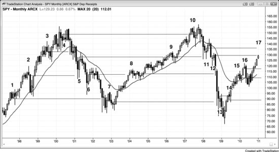

早期反转失败时的入场价，往往会成为后续成功反转的磁吸位。举个例子，假设市场处于空头趋势，在持续下跌过程中出现过好几次做多入场但都失败了，那么这些入场价以及每根信号K线的高点，都会成为市场最终反转向上后的目标位。市场往往一路上涨到最高那根信号K线的高点附近，才出现像样的回调。有些交易员可能（概率60%以上）在那些较高的信号处入场后，随着市场继续走低而一路加仓，然后把最初的入场价当作最终的止盈目标——最差的那笔持仓刚好盈亏平衡出场，其余较低位置的持仓全部获利了结。也可能是聪明的交易者相信这个逻辑，所以到了那些目标位就抛掉多头。又或者，这不过是所有优秀交易员心知肚明的一种"暗号"：他们在那里出场，纯粹因为回调止步于早期入场价附近是一种可靠且反复出现的规律。这个价位对某些交易员来说还有另一层含义——"谢天谢地，我再也不这么干了！"他们当初没有在亏损时离场，眼睁睁看着浮亏越滚越大，一边扛着一边祈祷市场能回到入场价。等市场真的回来了，他们立刻平仓，发誓绝不再犯同样的错。

交易中几乎所有现象背后都有数学基础，尤其是现在大量成交由基于统计分析的算法程序驱动。还是拿上面那个空头趋势反转向上的例子来说：最早出现的买入信号，往往正好处于空头通道的起点。空头通道一旦形成，等距移动的方向性概率至少有60%。也就是说，市场先跌10个tick的概率大约是60%，高于先涨10个tick的概率。具体幅度可以是任何合理范围内的数值（取决于近期波段的大小），关键是市场此时存在向下的偏向。随着市场下跌、动能衰减，当下跌走完大约一半时，方向性概率降至50%左右。但这个中性区域的价格，通常要等交易区间形成后才能确定。当市场继续跌向某个重要的磁吸位时，方向性概率会过冲到中性以下，实际上已经转为有利于多头。在交易区间中部，市场处于不确定状态；但一旦触及底部，市场就达成共识：跌过头了。此时方向性概率有利于多头，市场将反弹并开始构建交易区间。交易区间底部的方向性概率总是偏向多头，而这个底部会落在某个关键的技术价位上。市场下跌过程中有很多技术位可供选择，但大多数并不会形成清晰的买入建仓形态。一些机构会基于一个或多个技术支撑位编写交易程序，另一些机构则使用不同的支撑位。当足够多的关键技术区域在相近的价格汇聚时，押注反转的成交量就足以扭转市场方向。到了这个节点，数学站在你这一边，因为你买在了交易区间的底部。反转点永远无法事先确定，但它一定会以某种反转形态出现。当市场处于关键技术位时——比如测量移动目标位、趋势线，甚至高时间周期的均线和趋势线——务必留意这些反转形态。这部分内容在第3册的反转章节会进一步展开。通常（概率60%以上）不需要翻看大量图表去寻找建仓形态，只要保持耐心、保持警觉、熟悉这些形态，每张图表上都会出现合理的建仓形态。

市场一旦转而上涨，通常（概率60%以上）会尝试构建一个交易区间，而这个初生交易区间顶部的第一批候选位置，就是此前那些做多入场价。市场会尝试反弹到那些多头信号K线的高点。在上涨过程中，方向性概率回落至50%，并随着市场接近区间顶部而继续下降。由于顶部事先无法确定，交易区间中部的方向性概率中性位也无法事先确定，市场会过冲，直到触及某个交易员普遍认为明显过头的技术位。这个位置往往就在此前那些买入信号附近。别忘了，上次价格在这里时方向性概率偏向空头，这次价格再到这里时，通常（概率60%以上）依然偏向空头——所以市场一般会在这里再次掉头向下。这是一个卖方曾经夺取控制权的价位。反弹往往与此前某根入场K线形成双顶，然后至少短暂回落，交易区间就在这种上下震荡中逐步成形。市场反复试探，寻找不确定性，也就是方向性概率为50%的中性区域。到某个时点，市场会判定这个价格区域不再同时对多空双方构成价值，已经变成对其中一方而言很糟糕的价格。市场随后重新进入趋势，直到找到一个多空双方都愿意建仓的价格。

**图 9.1** 此前的入场价是回调的目标位

SPY（一种与Emini走势相当的交易所交易基金）的月线图曾在2000年结束了一轮强劲的多头趋势，但在市场继续上涨的过程中，出现过好几次试图反转为空头趋势的尝试（见图9.1）。每根空头信号K线的低点（K线1、2、3）都是后续下跌中回调的目标位。

同样，2003年结束的空头趋势在下跌过程中也出现过几次失败的多头反转尝试（K线4、5、6），每根多头信号K线的高点都是后续反弹的目标位。

此外，2003年开始的反弹中出现过几次失败的做空尝试（K线7、8、9、10），每一个都成了2009年初结束的那轮空头趋势中的目标位。那轮暴跌中出现过几次探底尝试，每根买入信号K线的高点（K线11、12、13）都是当前反弹的目标位。最后，截至K线17的反弹过程中出现了几次做顶尝试（K线14、15、16），每根卖出信号K线的低点都是后续任何下跌的磁吸位。

这些目标位并非一定会被触及，但每一个都是强大的磁吸点，市场经常被拉回到这些价位附近。
