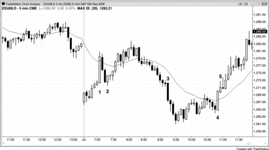

市场中有很多价格磁力位，价格会不断被吸引过去并完成测试。下面列出其中一些，很多在本书其他章节也有讨论。当市场正沿趋势朝某个磁力位推进时，明智的做法是顺势交易，等磁力位被测试——最好被过冲——之后再考虑其他方向。不要在磁力位附近逆势交易，除非之前已经出现逆势力量的迹象（比如趋势线被突破），或者当前这波走势本身就是高时间周期趋势中的一段回调。

- 趋势线。
- 趋势通道线。
- 所有测量移动目标，包括腿1 = 腿2的投射。
- 急速与通道：通道的起点通常很快就会被回测。
- 前一日的最高价、最低价、开盘价和收盘价。
- 过去几根K线甚至几天内的波段高点和波段低点，经常形成双底牛旗和双顶熊旗。
- 突破点。
- 各类缺口，包括均线缺口。
- 每种回调之后的趋势极值点（见第十一章关于首次回调序列的讨论）。
- 当天早些时候或前几天的交易区间，包括窄交易区间和铁丝网形态：区间的极值和中间位置经常被测试。
- 交易区间日中，区间的大致中点位置，尤其当该区域存在一个日内交易区间（即比较"厚"的区域）时。
- 最终旗形：价格从旗形中突破后，市场会回到旗形区域，通常从另一侧突破出去。
- 铁丝网形态。
- 入场K线和信号K线的保护性止损位。
- 入场价格（突破回测）。
- 大趋势K线的反向极值（大阳线的最低点和大阴线的最高点）。
- 剥头皮和波段交易的常见止盈目标：以AAPL为例，50美分和1美元；以5分钟Emini为例，4 tick剥头皮目标是5到6 tick，波段交易目标分别是3点、4点和10点。
- 与所需保护性止损幅度等距的运动：如果一笔Emini交易需要设置12 tick的保护性止损才能避免被止损出场，那么可以预期价格最终会朝有利方向运行12 tick。
- 日线、周线和月线级别的波段高点和波段低点、K线高低点、均线、缺口、斐波那契回撤与延展，以及趋势线。
- 整数关口，比如股票价格中的整百（如AAPL的300美元）、道琼斯工业平均指数中的整千（如道指12,000点）。如果一只股票快速从50美元涨到88美元，它可能会去测试100美元，而且通常会冲到105美元或110美元之后才开始回调。

**图 10.1** 大趋势K线的极值是磁力位

出现一根影线很短的大趋势K线时，在该K线上或之后不久入场的交易员，通常会把保护性止损设在这根K线的另一端之外。市场经常会逐步运行到那些止损位，触发止损后再沿趋势K线的方向反转回去。

图10.1中，K线1是一根底部光头的大阳线。市场紧接着在其后的空头内包K线处向下反转，形成了一个HL——但在形成HL之前，先扫掉了这根趋势K线低点下方的保护性止损。聪明的交易者会在那根内包K线做空，同时也做好准备：一旦K线2这根多头反转K线出现，就在其高点上方做多。K线2恰好触发了那些止损，随后把市场重新推回上行。

K线3和K线4同样是影线很短的大趋势K线，但它们之后都没有紧接着出现扫止损的回调。
