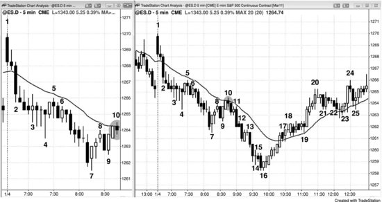
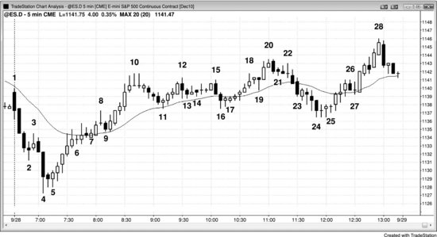
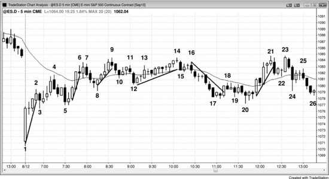

即使图表处于强趋势中，也会出现双边交易的阶段。只要交易员认为趋势还会延续，这些阶段就只是回调。这类交易区间足够小，交易员会把它们当作趋势中的短暂停顿，而不是图表的主导特征。所有回调在当前图表上都是小型交易区间，所有交易区间在高时间周期图表上都是回调。不过，在你眼前的图表上，大多数突破交易区间的尝试会失败，大多数突破回调的尝试会成功。交易区间放到高时间周期图表上就是一次简单的回调——如果你在那个周期上交易，可以像处理其他回调一样去交易。由于高时间周期图表的K线更大，风险也更大，必须缩小仓位。大多数交易员倾向于只在一个时间周期上操作，而不是在不同周期之间来回切换，不断调整仓位大小、止损幅度和止盈目标。

市场处于强趋势中，所有人都预期趋势会延续，为什么还会出现回调？拿多头趋势来说：回调之所以形成下跌，是因为多头在止盈，同时空头也在小幅剥头皮。多头会在某个位置止盈，因为他们知道这在数学上是最优的做法。如果一直持仓不动，价格几乎总会回到入场价，最终跌到远低于入场价的位置，造成大幅亏损。最佳止盈位置在哪里，他们永远不确定，只能用阻力位来做最佳估算。这些阻力位你不一定能看出来，但正因为它们给交易员提供了机会，时刻留意就非常重要。顺势剥头皮者、波段交易者和逆势剥头皮者都会预期回调的出现，并据此操作。当价格到达某个位置，足够多的多头认为该止盈了，他们就不再新增买入，开始平掉多头仓位，市场随之停顿。这个目标可以是任何阻力位（参见本书第二部分关于支撑和阻力的章节），也可以是某根重要信号K线上方一定数量的 Tick（比如 Emini 中的 6、10 或 18 个 Tick）。当前K线的多头实体可能比前一根小，顶部可能出现影线，或者下一根K线可能是一根带空头实体的小K线。这些迹象都说明多头在波段顶部不太愿意继续买入，部分多头正在止盈，空头开始进场剥头皮做空。如果足够多的多头和空头都在卖出，回调就会加深，当前K线可能跌破前一根K线的低点。在强劲的多头急速走势中，交易员预期多头趋势会立刻恢复，多头和空头都会在前一根K线低点附近买入，形成一个高 1 买入信号，通常随后会出现新高。随着多头趋势逐渐成熟、力度减弱，双边交易增多，多头和空头都会预期回调幅度更大、持续更多根K线。市场可能形成高 2 买入信号、三角形或楔形牛旗。这就构成了一段小型下跌趋势，当它到达某个数学目标时，多头会重新买入，空头也会止盈平掉空仓。双方都不会再次卖出，直到市场反弹到足够远，整个过程重新循环。

随着多头不再愿意只在 1 到 3 个 Tick 的回调位置继续买入，买盘开始减少。他们变得谨慎，怀疑更大幅度的回调即将到来。既然他们相信自己能在高点下方 6 到 10 个 Tick 甚至更低的位置买到，就没有动力在更高价位买入。同时，他们也有动力部分或全部止盈——因为他们相信市场很快会走低，届时可以重新买入，在价格反弹测试最近高点的过程中再赚一笔。动量程序也会感知到动量减弱，跟着止盈离场，等到任一方向的动量恢复后才重新入场。空头也看到了趋势的减弱，开始在K线高点上方和波段高点上方做空剥头皮，逐步加仓。一旦看到更多抛压，他们也会在K线低点下方做空，期待更深的回调。

大多数多头会在卖出信号还比较弱的时候就平掉多单，而不会等到信号强到可以反手做空。他们最初会在强势位置止盈，比如波段高点上方、前一根K线高点上方，或者一根大阳线的收盘价附近。在强势位置止盈之后，他们会转而在弱势位置了结剩余仓位，开始在空头反转K线下方卖出平仓——因为他们怀疑回调幅度会越来越大。大多数人不会跟空头一起做空，因为大部分交易员无法持续做好反手操作。他们之前一直预期市场上涨，通常需要先平掉多单，过几分钟才能说服自己去做反方向的交易。如果他们认为市场只是在回调而非反转，就会等回调结束后重新买回多单。正因为大多数人做不了或不愿意反手操作，他们不想在准备买入的时候手上还拿着空单。如果做了空头剥头皮交易，他们多半没法再反手回做多，结果就是为了赚一点空单小利润，反而错过了一笔多头波段——被套在场外。从数学上看，冒着低概率做空赚 1 个点的风险，却错失高概率做多赚 2 到 4 个点的机会，完全不划算。

在多头趋势中，市场会形成一系列 HH 和 HL。趋势很强时，多头会找各种理由买入，很多人会使用跟踪止损。市场每创一个新高，他们就会把止损上移到最近一个 HL 下方。如果有足够多的空头入场做空、足够多的多头止盈，反转的力度可能超出交易员最初的预期。这种情况往往出现在趋势后期——之前已经有好几次回调后又创新高。不过多空双方都相信市场会在最近的波段低点上方重新涨起来，所以双方通常都会在那个低点附近或上方买入，由此形成双底牛旗或又一个 HL。下跌可能很猛烈，但只要有足够多的交易员相信多头趋势还在，他们就会买入，市场就会重新回来测试之前的高点——多头在那里部分或全部止盈，空头则再次做空。

随着多头趋势走向成熟，交易员会等到更深的回调才买入，而且他们预期市场会走出两段式回调——第二段跌破第一段的低点。价格行为会告诉交易员什么时候可能（概率 60% 以上）出现这种更深的回调。一旦判断回调会加深，他们就不会再把保护性止损设在最近波段低点下方，而是在更高位止盈——比如最近波段高点上方，然后等价格跌到那个低点附近时再买回来，重新建立多头仓位。既然他们相信市场有 60% 以上的概率走出两段式回调，从而跌破那个低点，那就没有理由还依赖设在最近 HL 下方的止损。他们会在跌破之前就平掉大部分或全部仓位，但仍然看多。此时多头趋势不再形成 HH 和 HL。不过这个 LL 通常仍然高于更高时间周期图上最近的 HL，所以更大级别的多头趋势依然完好。这种两段式回调是一个大的高 2 买入建仓形态，而且随着趋势成熟，回调幅度会越来越大，内部结构也更加复杂。如果趋势真的反转了，会出现一系列 LH 和 LL，但通常会有一个清晰的反转信号（反转在第三本书中讨论）。在没有明确反转的情况下，两段式下跌只是牛旗的一种形式，之后通常还会创出新的多头高点。比如，第一段下跌可能是一个小的空头急速段，第二段下跌是一个小的空头通道。如果下跌走势很强——哪怕是一个紧密复杂的通道而非空头急速段——交易员也会预期这至少是两段下跌中的第一段。在回调中买入的多头会在趋势高点下方止盈，空头则开始在前高下方积极做空，预期会形成一个 LH 和第二段下跌。

即使图表处于强趋势中，也会出现双向交易的阶段。但只要交易员相信趋势会延续，这些阶段就只是回调。这些交易区间很小，交易员只会把它们视为趋势中的短暂停顿，而不是图表上的主导特征。所有回调在当前时间周期的图上都是小的交易区间，所有交易区间在更高时间周期图上都是回调。然而在你面前这张图上，大多数突破交易区间的尝试都会失败，而大多数突破回调的尝试都会成功。在更高时间周期图上，交易区间就是一个简单的回调——如果你在那个周期上交易，可以像处理其他回调一样操作。由于更高时间周期图上K线更大、风险也更大，你需要缩小仓位。大多数交易员更喜欢只看一个时间周期，而不是来回切换，用不同的仓位大小和不同的止盈止损标准做交易。

市场处于强趋势中，所有人都预期趋势会延续，那回调是怎么出现的呢？拿多头趋势来举例。回调中的下跌主要来自多头止盈，其次才是空头的剥头皮。多头在某个时点一定会止盈，因为他们知道这在数学上是最优策略。如果永远不平仓，市场几乎肯定会跌回入场价，而且最终会跌得更深，造成大额亏损。他们永远无法确切知道最佳止盈位在哪里，只能用阻力位来做最佳估计。这些位置对你来说不一定明显，但它们确实给交易员提供了机会，因此时刻留意很重要。顺势剥头皮者、波段交易者和逆势剥头皮者都预期回调会出现，并据此交易。当市场到达一个足够多多头认为该止盈的目标位时，他们不再建新仓，加上卖出平仓的压力，市场就会暂停。这个目标位可以是任何阻力位（本书第二部分关于支撑和阻力的章节中有讨论），也可以是重要信号K线上方一定数量的 tick（比如 Emini 中的 6、10 或 18 个 tick）。当前K线的阳线实体可能比前一根小，可能顶部带影线，或者下一根是一根实体较小的阴线。这些都说明多头在波段顶部买入的意愿减弱了，部分多头在止盈，空头开始做剥头皮。如果多空双方的卖压够大，回调就会加深，当前K线可能跌破前一根K线的低点。在强劲的多头急速段中，交易员会预期趋势马上恢复，因此多空双方都会在前一根K线低点附近买入，由此产生一个高 1 买入信号，通常之后会创出新高。随着多头趋势走向成熟和减弱，双向交易会增多，多空双方都预期回调会跌更多 tick、持续更多K线。市场可能形成高 2 买入信号、三角形或者楔形牛旗，从而构成一个小的下跌趋势。当下跌到达某个数学目标位时，多头重新开始买入，空头止盈回补，双方都不会再卖，直到市场涨够了、整个过程再次重复。

多头的买盘也开始萎缩，因为他们不愿意继续只在 1 到 3 个 tick 的浅回调中买入。他们变得谨慎，怀疑更大的回调即将出现。既然他们相信自己能在高点下方 6 到 10 个 tick 甚至更低的位置买到，就没有理由在更高的价格买入。而且，因为他们相信市场很快会跌得更低——到时候可以重新买入，等市场反弹回测最近高点时再赚一笔——所以部分或全部止盈反而更划算。动量交易程序也感知到动量衰减，同样会止盈退出，等到任一方向的动量重新出现才再次入场。空头也看到了趋势的弱化，开始在K线高点上方和波段高点上方做剥头皮卖出，并在更高位加仓。一旦看到更多抛压出现，他们也会在K线低点下方做空，预期出现更深的回调。

一旦市场开始形成 LH，多头通常只愿等到更深的回调才买入，而他们不买这件事本身就把回调推得更深。空头看到同样的走势，会选择继续持有空单、争取更大的利润，因为他们预期跌幅会越来越大。价格在前高附近反复受阻——略高于前高、恰好在前高、或略低于前高——但每次跌到前低附近又能获得支撑反弹。向上突破和向下突破的尝试都失败了，市场失去方向，短期内充满不确定性，这就是交易区间的典型特征。多头会反复试图恢复趋势，空头会反复试图反转趋势，双方大约 80% 的尝试都以失败告终。由于多头趋势中的交易区间在高时间周期图表上只是一个牛旗，概率上更倾向于向上突破。交易区间里总会出现某种形态，让多空双方都意识到多头趋势即将恢复。当一个可信的形态出现时，更少的空头愿意在反弹中做空剥头皮，多头则开始在区间顶部附近继续买入。空头不愿做空、多头不愿卖出手中的多单，反弹就会突破交易区间的上沿。如果突破力度强，那些一直在建波段空头仓位、期待更大回调或反转的空头就会回补空单，并且至少在接下来几根K线内不再考虑做空。做剥头皮的空头和做波段的空头都不再做空，多头也不急着止盈，市场通常会走出大约一个测量移动的涨幅，幅度大致等于交易区间的高度。之后多头开始止盈，空头重新做空。如果抛压够强，就会出现一次回调、一段交易区间，甚至向下反转。

空头趋势中情况正好相反。回调最初是因为空头在新低处止盈，同时总有一些激进的多头在买入，他们觉得市场会反弹到足以赚一笔剥头皮利润的幅度。一旦市场反弹到某个阻力位——通常是低 2 或低 3 的形态——多头就会平仓止盈，空头则重新做空。空头希望市场继续形成 LH 和 LL。每当他们看到一波急涨，就会在价格接近最近一个 LH 时积极做空。有时他们要等到市场涨到最近的波段高点才大量做空，这就是双顶熊旗如此常见的原因。只要市场持续形成 LH，他们就知道大多数交易员会认为空头趋势完好，因此可能 (60%+) 还会走出新的 LL，届时他们可以部分或全部止盈。最终，某次回调会演变成交易区间，并出现一些突破最近 LH 的反弹。在高时间周期图表上仍然是 LH 和 LL，但在你正在交易的图表上，这个 HH 说明空头趋势已经有所减弱。空头趋势走到成熟、走弱的阶段时，往往会形成两段式反弹——既有 HL 又有 HH，但空头趋势本身仍然完好。这就是低 2 做空建仓形态的基础，它本质上就是一个两段式反弹。交易区间内总会出现某种形态，告诉多空双方空头趋势可能 (60%+) 恢复，而且它总是出现在阻力位，比如测量移动目标位或趋势线附近。这会让多头不太愿意在区间底部买入，空头则更愿意一路卖到底部。市场随后向下突破，做多剥头皮的人停止买入，做波段的多头也平仓卖出。市场大约下跌一个测量移动的幅度后，空头开始止盈，激进的多头再次买入。如果多头和空头双方的买盘足够强，就会出现回调、交易区间，或向上的趋势反转。

回调的最后一段通常是一个逆势微型通道（牛旗末端出现空头微型通道，熊旗末端出现多头微型通道）。微型通道被突破后，通常只走一两根K线就会回调，包含4根或更多K线的微型通道尤其如此。如果趋势强劲，往往不会回调，因此在微型通道突破处入场是一笔合理的交易。当趋势不够强时，微型通道的突破通常在一两根K线内就会遭遇失败的反转尝试。跟所有突破一样，交易员需要对比突破本身的力度和失败突破信号K线的力度。如果突破明显更强，特别是基础趋势本身就强，那么反转尝试大概率会失败，最终形成一个突破回调建仓形态，给交易员一个顺着突破方向入场的二次机会。如果突破较弱——比如只是一根带长影线的小趋势K线——而反转K线很强，尤其是背景本身就倾向于反转时（比如牛旗刚好处于交易区间上沿下方），那么这次反转尝试就有较大概率（60%以上）成功，交易员应该做反转方向的交易。如果突破和反转力度相当，又没有明确的基础趋势，那就要看下一根K线来判断。举个例子：交易区间中部出现牛旗，一根多头趋势K线向上突破了这面旗形，紧接着出现一根同样强的空头反转K线，价格跌破该K线低点——这时候交易员就要观察那根空头入场K线的形态。如果它变成一根多头反转K线，就说明市场只是在做牛旗突破后的回调，可以在该K线高点上方做多。反过来，如果它是一根强空头趋势K线，尤其收在最低点并且收盘低于多头突破K线的低点，交易员就会把这个形态视为一次空头突破，考虑做空——前提是之前没有在空头反转K线下方做空。

严格来讲，回调是指价格逆势运动到足以突破前一根K线极值的程度。在多头趋势中，回调就是某根K线至少跌破前一根K线低点1个tick。不过更宽泛的定义更实用：趋势运动中的任何暂停——包括内包K线、反向趋势K线或十字星——都应视为回调，哪怕价格只是横盘而没有真正反向运动。即便是最强的趋势，在发展过程中也会逐渐暴露出回调深度的线索。最常见的表现是出现一片双向交易区域。比如，急速与通道多头趋势中，急速阶段结束后市场暂停或回调，形成通道的起点。一旦趋势通道结束、价格开始下跌（回调），通常会测试通道底部。通道底部正是空头最初开始卖出的位置。随着多头通道不断上涨、越过他们的做空入场价，这些空头开始感到担忧。随着多头趋势持续推进，这些空头以及其他空头继续加仓卖出，但一旦趋势转为向下回调，他们会非常乐意在最早、也是最低的做空入场价——即通道起点——了结全部空单。平仓之后，他们不会在那个区域继续卖出，因为上次做空后市场涨了多远他们已经见识过了。不过如果仍然看空，他们会在市场反弹时重新做空。如果反弹在前高下方结束，就形成一个更低高点（LH），通常会引发第二段下跌。如果空头特别强势，那个LH可能就是新的空头趋势的起点，而不仅仅是早期交易区间内的第二次回调。

趋势末端的楔形也是同样的道理。如果空头趋势形成一个向下倾斜的楔形，市场会试图修正到楔形顶部——那里是最早一批多头开始买入的位置。如果价格能回到他们最初的入场价，他们就可以在那笔交易上盈亏平衡出场，同时在所有更低价位的入场上获利了结。之后他们大概率不会再买，直到市场再次下跌。上一次交易让他们认识到，当初的买入价位太高了；眼看着持仓浮亏随市场继续下跌而不断扩大，那种感受他们不想再经历一次。这回他们会等回调，希望市场走出一个更高低点（HL）甚至更低低点（LL）。他们预期楔形的原始低点会在后续回调中构成支撑，在那个价位附近买入、止损设在稍下方，就能获得一个风险有限且可量化的入场机会，这正是他们想要的。

回调的最后一段经常是逆势的微型通道（牛旗末端出现空头微型通道，熊旗末端出现多头微型通道）。微型通道被突破后，通常只走一两根K线就会出现回调，当微型通道包含四根或更多K线时尤其如此。如果趋势很强，回调往往不会出现，因此在微型通道突破时入场是合理的交易。当趋势不是很强时，微型通道突破后通常一两根K线内就会出现失败的突破尝试。跟所有突破一样，交易员需要对比突破的力度与失败突破信号K线的力度。如果突破明显更强，尤其底层趋势也很强，那么反转尝试大概率会失败，形成突破回调做多/做空形态，给交易员第二次顺突破方向入场的机会。如果突破相对较弱——比如一根带长影线的小趋势K线——而反转K线很强，特别是背景本身就有利于反转（比如牛旗出现在交易区间顶部附近），那么反转尝试就可能（60%以上的概率）成功，交易员应该做反转入场。如果突破和反转的力度差不多，而且没有明显的底层趋势，交易员就要看下一根K线的表现来决定。举个例子：在交易区间中部出现一个牛旗，突破牛旗的多头趋势K线后面紧跟一根同样强的空头反转K线，市场跌破了那根K线的低点，这时交易员就要判断这根空头入场K线的形态。如果它变成一根多头反转K线，交易员会认为市场只是在形成牛旗突破后的回调，从而在该K线高点上方做多。反之，如果它是一根强空头趋势K线，尤其收在低点且低于多头突破K线的低点，交易员就会把这个形态视为空头突破，准备做空——前提是之前没有在空头反转K线下方已经做空。

严格来说，回调是指一根K线逆趋势运动的幅度足以超过前一根K线的极端价位。在多头趋势中，回调是指某根K线的低点至少比前一根K线的低点低1个tick。不过更宽泛的定义更加实用：趋势动能中出现的任何暂停都应该被视为回调，包括内包K线、反向趋势K线或十字星，即使只是横盘而并没有真正的回撤。即便是最强的趋势，在向前推进的过程中也会在某个时候开始暴露出回调可能到达的深度。最常见的信号是出现双向交易的区域。比如，在急速与通道多头趋势中，急速阶段结束后市场出现暂停或回调，这就形成了通道的起点。一旦趋势通道结束、下跌（回调）开始，通常会回测到通道底部。那里正是空头最初开始卖出的位置。随着多头通道不断上涨、超过他们做空的入场价，这些空头开始焦虑。他们和其他空头在多头趋势推进的过程中持续加仓做空，但一旦趋势转为回调下跌，这些空头就会非常乐意在他们最早、最低的做空入场价——也就是通道起点——全部平仓。平仓之后，他们不会在那个区域继续卖出，因为他们见识过上次做空之后市场涨了多远。但如果他们仍然看空，就会在反弹时重新做空。如果反弹在前高下方结束，就形成了LH，通常会引发第二段下跌。如果空头力量特别强，那个LH可能就是新的空头趋势的起点，而不仅仅是刚形成的交易区间中的第二次回调。

楔形出现在趋势末端时也是同样的道理。如果空头趋势形成了一个向下倾斜的楔形，市场会尝试回调到楔形顶部——那里是最早的多头开始买入的地方。如果市场能回到他们最早的入场价，他们就可以在那笔交易上以盈亏平衡点出场，同时在更低位置的所有入场都是盈利的。这时候他们大概率不会再买入，而是等待市场再次下跌。他们从第一次交易中学到了教训：当初买在了太高的价位，不想再承受持有多头仓位时市场继续下跌带来的浮亏。这一次，他们会等回调再入场，期待市场形成HL甚至LL。他们预期楔形的原始低点会成为后续回调的支撑，打算在那个价位附近买入、止损设在略低的位置。这样入场的风险可控且有限，他们喜欢这种交易。

市场在趋势中倾向于回测最早出现双向交易的区域，敏锐的交易员可以利用这一点预判回调何时形成、可能走多远。他们不会在双向交易刚出现时就急着逆势入场，但双向交易告诉他们逆势交易者已经开始建仓，市场很可能（60%以上的概率）在不久后回调到那个价位。等到趋势通道、楔形或阶梯形态开始出现反转迹象时（参见第三册的趋势反转章节），他们会做逆势交易，目标是在双向交易最初出现的区域（通道起点）止盈。

回调本身也是一段趋势，虽然相对于它所回调的更大趋势通常很小。跟所有趋势一样，回调通常至少有两段。一段和三段的回调也很常见，小型通道和三角形也是如此，但所有回调持续的时间都相对短暂，交易员会预期趋势很快恢复。有时候这些分段只在更低时间周期的图表上才能看到，有时候又很大，每一段还可以继续细分成更小的分段，每个小段也有两段。因为交易员预期主趋势很快恢复，他们会在回调中押注突破失败。举个例子：一段强空头趋势终于出现了两段式的上涨回调，当市场突破第一段上涨的高点时，做空的人通常远多于做多的人。虽然市场正在突破一个多头波段的高点，但买入突破的多头通常会被做空的空头压制，因为空头预期这个突破会失败、空头趋势会很快恢复。空头会在波段高点处及其上方用限价单和市价单做空，他们把这次突破看作在高位重新建立空头仓位的短暂机会。既然80%的趋势反转尝试都会失败，概率明显站在空头一边。这一点在强趋势中的第一次两段式回调中尤为明显。

任何包含两段的运动都应该按照回调来对待，即使它是顺势的。有时候趋势的最后一段就是一个两段式的顺势运动——在多头趋势中走向更高的高点或更低的高点，在空头趋势中走向更低的低点或更高的低点。比如，一段多头趋势出现抛售，跌穿了多头趋势线，趋势线突破之后跟了一个两段式回调，而那个回调只是在回测前高，甚至可能超过前高。也就是说，趋势线突破后的回调既可以形成LH，也可以形成HH，同时仍然是向新的空头趋势过渡的一部分。严格来说，空头趋势要等到最终高点之后才算开始，但那个最终高点往往只是跌破多头趋势线后的一个HH回调。

什么算"两段"？你可以用收盘价画一条折线图，往往能清楚看到两段式运动。如果用K线图，最容易辨认的两段式运动是这样的：先有一段逆势运动，再有一段较小的顺势运动，然后是第二段逆势运动（教科书式的ABC回调）。那为什么两段之后往往就反转了？拿多头趋势中的两段式回调来举例：多头会在新低（C段）买入，认为第二段下跌就是回调的终点。同时，原本看空做剥头皮的人在等到两段式回调完成后会买回空头仓位平仓。此外，之前在第一段下跌（A段）低点就已经做多的激进多头，现在会在更低的低点加仓。如果这些买盘合力压过了在第一段下跌低点下方做空的新空头，市场就会反弹，而且至少会回测前高。

不过，很多时候两段只有在更低时间周期的图表上才能清楚看到，在当前图表上只能靠推断。既然交易时用一张图表比整天切换多张图表方便得多，如果交易员能在眼前的图表上——哪怕是通过推断——看出两段结构，就占了优势。

在多头市场中，如果出现一连串多头趋势K线，一根空头趋势K线就可以被视为回调的第一段（A段），即使它的低点高于前一根K线的低点。如果去看更低时间周期的图表，很可能会看到一段逆势运动。如果下一根K线收盘是顺势的，但高点低于结束多头波段的那根K线的高点，这就是B段。之后如果出现一根空头K线，或者低点低于前一根K线低点的K线，就形成了第二段下跌（C段）。

需要推断的部分越多，形态的可靠性就越低，因为能看到它、对它有信心的交易员就越少。交易员大概率会投入更少的资金，也会更快地出场。

这里有一个很关键的要点：如果正在回调的趋势，在结束之前形成了高潮或任何明显的趋势反转形态，那说明趋势已经改变了，不应该再沿旧趋势方向寻找回调入场机会。趋势结束了——至少要等大约 10 根K线，甚至可能一整天都不会恢复。所以，一轮强劲上涨之后，如果出现了楔形顶部，或者跌破多头趋势线后形成了 LL，这时应该找做空的建仓形态，而不是继续在旧的多头趋势里找回调买入。当趋势反转是否成立还不太确定时，两个方向的建仓形态都可能 (60%+) 有效，至少够做一笔剥头皮。反转越确定，越要避免在旧方向上交易，因为新方向至少可能 (60%+) 走出两段式回调。而且这波走势的持续时间和幅度，通常 (60%+) 跟反转形态的清晰程度成正比。遇到一个很好的反转建仓形态时，应该拿一部分仓位——极少数情况下甚至全部仓位——去做波段交易。

所有回调都是从某种反转形态开始的。这个反转形态通常 (60%+) 强到足以引诱逆势交易者进场做反向单，但又不够强到构成一个可靠的逆势建仓形态。既然建仓形态和回调都不足以改变 Always-in 的方向，交易员就不该找逆势交易的机会，而是等一个信号——表明回调可能 (60%+) 结束了——然后顺势入场。问题在于，回调本身就是从反转开始的，很多交易员因此变得过度谨慎，说服自己放弃一笔好交易。没有人能对任何一笔交易有 100% 的把握，但当你合理地确信这笔交易不错时，就要相信概率，执行交易，坦然接受有时候会亏。这就是这行的本质，不愿承受亏损的人没法靠交易谋生。想想看，大联盟棒球打者失败率高达 70%，照样被视为超级明星，光靠那 30% 的成功率就能赚几百万。

当市场处于弱趋势中，或者正从交易区间向趋势转变的早期阶段，有时会出现一个旗形，旗形突破后回调，而这个回调又变成了另一个旗形。市场有时会反复这样好几次，直到最终出现一次强势突破。

一两根K线的暂停比持续多根K线、确实从极端位回撤的回调更难交易。举个例子，假设有一轮强多头走势，最后一根是小K线，高点比前一根K线的高点低一两个 tick，而前一根是大阳线，前面还跟着一两根大阳线。如果在这根小K线高点上方一个 tick 买入，就等于在当日最高价附近买入。由于大量机构会在每一个新高处做反向交易，市场很可能反转并打掉你的止损，而你的目标价还没到，风险相当大。但如果趋势非常强，这笔交易很重要，必须执行。这笔交易之所以特别难，部分原因是你几乎没时间评估趋势的强度，也没时间去看有没有趋势通道线过冲或其他可能导致交易失败的因素。

还有一种更难的暂停形态：一根小十字星，高点比前一根强多头趋势K线的高点高一个 tick。在十字星上方买入有时是笔好交易，但对大多数交易员来说，他们很难在短时间内把风险评估清楚，不如等一个更清晰的建仓形态。不买暂停K线突破的一个理由是：如果最近一两根趋势K线带有比较长的影线，说明逆势交易者已经施加了一定影响。另外，如果之前的顺势入场跟的是一个较大的回调（比如高 2），也应该犹豫，因为后续每次回调通常 (60%+) 会更深而不是更浅。但如果市场刚刚突破，连续出现三根收盘价接近高点的多头趋势K线，那么在紧跟这些K线后面的暂停K线上方买入，成功做一笔剥头皮的概率是不错的。总的来说，强多头趋势早期阶段的高 1 做多（或强空头趋势中的低 1 做空），是大多数交易员唯一应该考虑的暂停K线入场。还要记住，一根K线突破之后的暂停K线，同样可能 (60%+) 是反方向的入场信号，因为一根K线的突破经常失败，尤其是在逆势方向上。

如果回调相对于趋势来说很小，通常 (60%+) 可以在回调一结束就安全入场。如果回调足够大，构成一段可交易的强势逆势走势，那最好等出现第二次信号再入场。比如在一个强多头趋势中出现了一段较长的空头通道，与其在第一次反转回升时就买入，不如等那次突破之后的回调，买在突破回调的位置，更稳妥。

所有多头回调最终都会在某种支撑位结束。有的回调结束得很平静，有的则伴随着强烈的逆势趋势K线，看起来几乎要反转整个趋势。无论是大级别的回调，还是旗形突破后仅一两根K线的小幅回调，都是如此。就连1987年和2009年的股市崩盘，最终也止步于月线级别的多头趋势线，本质上不过是多头趋势中的一次回调而已。大多数回调都在一组支撑位密集区结束，尽管其中部分甚至全部支撑，很多交易员可能看不出来。有些交易员在多头趋势中做多回调，是因为他们盯住了某一个支撑位——可能是多头趋势线、牛旗底部的通道线、前高或前低、某条均线，或者其他类型的支撑；另一些交易员则是看到了同一区域的另一个支撑位。一旦买盘强到足以压倒空头，趋势就会恢复。空头回调也是同样的道理——它们总是在一组阻力位密集区结束，只不过市场所依据的那些阻力位，交易员往往不容易辨别。当价格接近关键位置时，真空效应经常主导行情。比如，如果多头认为市场正在接近一个重要的支撑位，他们往往会退到一旁，等着价格触及那个位置。这可能导致一轮非常猛烈的空头急速下跌，但一旦支撑被触及，多头就会强势而持续地大举买入。制造这段回调的空头也一样——他们同样看到了那个支撑位，市场越接近支撑位，他们就越确信价格一定会到达那里，于是拼命卖出、毫不犹豫，直到触及支撑位后突然停手，迅速回补空头仓位。回调可能以一根大阴线结束，看上去似乎要把 Always-in 的方向翻转为做空，但接下来几根K线并没有出现跟随性卖出，趋势反而恢复了上涨，有时起初比较缓慢。由于多头和空头都在买入，反转可以非常剧烈，幅度也可以很大。真空效应始终存在，即使在1987年和2009年那样最剧烈的反转中也不例外。两次崩盘中，市场都处于自由落体状态，但当价格跌破月线趋势线一小段后，就出现了强力反弹。尽管两次崩盘都极为惨烈，但它们不过是真空效应发挥作用的典型例子。

同样的行为也发生在旗形突破后仅一两根K线的回调中。比如，在一段强空头趋势中，均线附近出现了一个低 2 熊旗并触发了做空入场，入场K线之后可能跟了一根多头趋势K线。这代表一次失败的突破，可能是多头趋势的开端，也可能只是一波更大的空头反弹。但通常这根多头趋势K线最终会失败，而失败的失败就会变成大趋势方向上的回调——在这个例子里，就变成了一个突破回调做空建仓形态。交易员预期这根多头趋势K线会失败，激进的空头会在它的收盘价、略低于它的高点以及略高于它的高点附近做空。更稳健的交易员则会等待确认——确认这根多头趋势K线只是熊旗突破后的一次回调，然后在确认的那根空头K线低点下方以突破单做空；如果回调再延续一两根K线，就在后续K线的低点下方入场。

回调只是趋势中的一次暂停，而不是反转。因此，一旦你判断当前走势是回调，就该预期趋势会恢复并测试趋势的极端价位。比如，多头趋势中市场连续下跌了几根K线，如果你认为这是一个买入机会，说明你把它当作多头趋势中的回调，预期价格会回升并测试多头趋势的高点。需要注意的是，这个测试不一定要创新高。虽然经常形成 HH，但也可能是双顶或 LH。测试之后，你再判断多头趋势是否仍然完好，还是已经转变为交易区间甚至空头趋势。

回调经常表现为猛烈的急速下跌或上涨，让交易员怀疑趋势是不是已经反转了。比如在多头趋势中，可能出现一两根大阴线跌破均线，甚至跌穿某个交易区间好几个 Tick。交易员就会想，Always-in 的方向是不是正在翻转为向下。他们需要看到跟随性的卖出——哪怕只是再来一根空头趋势K线就够了。所有人都会紧盯下一根K线。如果它又是一根大阴线，大多数交易员会认为反转已经确认，开始市价做空并在反弹时继续加空。但如果这根K线收阳，他们就会怀疑反转尝试已经失败，那波抛售只不过是一次短暂但剧烈的降价促销，因而是一个买入机会。新手只看到了猛烈的空头急速下跌，却忽视了它发生在一段强劲的多头趋势之中。他们在空头趋势K线收盘价卖出、在其低点下方卖出、在接下来几根K线的小幅反弹中卖出、在任何低 1 或低 2 做空建仓形态下方卖出。聪明的多头则在这些交易的对手方买入，因为他们看懂了整体局面。

市场时刻都在尝试反转，但其中 80% 的反转尝试最终会失败，演变成牛旗。反转尝试发生时，那两三根空头趋势K线看起来可能很有说服力，但如果后续没有跟随卖盘，多头就会把这波下杀视为一次绝佳的低位做多机会——在短暂的抛售高潮低点附近重新买入。有经验的多头和空头会专门等待这种强趋势K线出现，有时甚至先退出观望，等到这种K线形成后再进场买入，因为他们把它视为抛售的高潮尾声。空头在这里回补平仓，多头则重新建立多头仓位。这跟趋势末端发生的情况正好相反——那时候聪明的交易者等的是一根大趋势K线。比如，在一段靠近支撑区域的强空头趋势中，经常会出现一根异常大的空头趋势K线充当迟到的突破。多头和空头都停止买入，直到看见这根K线形成。这时候双方都会买入这个抛售高潮——空头觉得这是一个很好的止盈价位，多头则觉得这是一个短暂的低价买入机会。

如果交易员判断当前只是回调，就说明他们认为趋势仍然完好。评估交易者方程时，概率永远无法被精确知道，但既然是在趋势方向上交易，就可以假设等距移动的方向概率为 60%。实际可能更高，但不太可能低很多，否则他们就会得出这样的结论：这次回调持续太久，已经失去了预测价值，变成了普通的交易区间——向上或向下突破的概率大致相等。确定了风险之后，就可以设定一个至少等于风险大小的利润目标，并合理地假设成功概率大约在 60% 或更高。比如，在高盛（GS）的牛旗突破处买入，保护性止损设在牛旗下方、入场价下方约 50 美分处，就可以假设自己至少有 60% 的概率赚到 50 美分以上的利润。利润目标可能是回测多头高点。如果多头高点在入场价上方 2.00 美元，那成功概率可能仍然在 60% 左右，但潜在回报已经是风险的 4 倍，交易者方程的结果就变得非常有利。

一旦你判断市场已经反转，价格通常会先回调测试前一个趋势的极端位置，然后新趋势才会展开。比如，假设当前是一段空头趋势，之前的回调足够强、已经突破了空头趋势线，现在市场从一个更低的低点（对空头趋势底部的测试）开始向上反转。这就是一个可能的趋势反转，方向转为多头趋势。如果第一段上涨以强急速形态出现，你就会认为反转的胜算更大。第一段强势上涨之后的回调通常会形成一个更高低点，但也可能跟空头低点形成双底，甚至创出更低的低点。你可能会问：既然你判断趋势已经反转成多头趋势了，市场怎么还能跌出更低的低点？更低的低点是空头趋势的标志，绝不可能出现在多头趋势中。没错，传统看法是这样的，但如果你用更宽泛的定义，反而能赚到更多钱。如果市场跌破了旧的空头低点，你可能会止损出场，但你可能仍然相信多头真正控制着市场。之前的急速上涨是对旧空头趋势的突破，已经将市场转变为多头趋势。突破后的回调是否跌破了空头低点并不重要。假设市场刚好停在旧低点，而不是比旧低点再低一个 Tick，你真的认为这有本质区别吗？有时确实有区别，但通常差不多就是差不多。如果两种情况相似，它们的表现也会相似。同样，你把多头急速的底部还是回调到更低低点的位置当作多头趋势的起点，这也不重要。严格来说，急速上涨是第一次反转尝试，而一旦市场跌破急速的底部，这次尝试就失败了。但它仍然是那个表明多头已经控制市场的突破，回调跌到更低低点、空头短暂夺回控制权，这些都无关紧要。真正重要的是多头正在控制市场，而且很可能会持续控制很多根K线，所以你应该寻找回调做多的机会，包括在第一次回调到更低低点的那个位置做多。

旗形突破后的一到两根K线回调中，同样的行为也会出现。比如，在一段强空头趋势中，均线附近出现了一个低 2 熊旗，触发了做空入场，入场K线之后可能跟着一根多头趋势K线。这代表一次失败的突破，可能是多头趋势或更大规模空头反弹的起点。但这种情况通常会失败，而一次失败的失败就会变成大趋势中的回调。在这里，它变成了一个突破回调做空建仓形态。交易员预期这根多头趋势K线会失败，激进的空头会在它的收盘价做空，也会在它的高点上方和下方做空。更保守的交易员会等待确认——确认这根多头趋势K线只是熊旗突破后的一个回调。他们会在这根多头K线的低点下方挂卖出突破单做空，如果回调再持续一两根K线，就在后续K线的低点下方做空。

回调只是趋势中的暂停，不是反转。所以一旦你判断当前是回调，就应该预期趋势会恢复、价格会测试趋势的极端位置。比如，如果当前是多头趋势，然后市场连续下跌了好几根K线，而你把这波下跌看作买入机会，那就说明你认为它只是多头趋势中的回调。你预期价格会回测多头趋势的高点。需要注意的是，这个测试不一定要创新高。没错，它经常是一个更高高点，但也可以是双顶或更低高点。测试完成后，你再判断多头趋势是否仍然完好，还是已经过渡到了交易区间甚至空头趋势。

回调经常以强烈的急速形态出现，让交易员怀疑趋势是否已经反转。比如，在多头趋势中，可能出现一两根大空头趋势K线，跌破均线，甚至跌破某个交易区间好几个 Tick。交易员就会怀疑 Always-in 的方向是否正在翻转为向下。他们需要看到后续的跟随卖盘，哪怕只是再来一根空头趋势K线。所有人都会紧盯下一根K线。如果它是一根大空头趋势K线，大多数交易员就会认为反转已经确认，开始在市价做空并在反弹中做空。如果这根K线收了一个多头收盘，他们就会怀疑反转尝试已经失败，之前的那波下杀只是一个短暂但剧烈的价格下调，因而是一个买入机会。新手交易员只看到了强烈的空头急速，却忽视了它所处的强多头趋势背景。他们在空头趋势K线的收盘价卖出，在它的低点下方卖出，在接下来几根K线的每次小反弹中卖出，在每个低 1 或低 2 做空建仓形态下方卖出。聪明的多头正在这些交易中做对手方，因为他们清楚正在发生什么。

在多头趋势中回调至更低低点，或在空头趋势中回调至更高高点，这种现象在每张图表的小幅波动中都很常见。举个例子，假设当前处于空头趋势，随后出现了一段持续约8根K线的窄通道式反弹，涨到了均线附近。通道很窄，说明反弹力度较强，因此第一次向下突破大概率（60%以上）会失败，即便突破方向与趋势一致。交易员通常（60%以上）会等价格再拉回来之后才考虑做空。而这次回调往往以更高高点的形式出现，在空头趋势中形成一个ABC结构。他们会在前一根K线低点下方做空，因为在强空头趋势中，均线附近的低2做空是一笔很好的交易。很多交易员不会把这个ABC看成一次空头突破（B段是对构成A段的通道的向下突破）加上一个突破回调至更高高点（C段），但仔细想想，本质就是如此。

有一种特殊的更高高点或更低低点回调形态，常见于主要趋势反转（MTR）中，相关内容会在第三本书里讨论。比如，多头趋势中出现了一波强劲下跌，跌破了多头趋势线，之后一个弱反弹（比如楔形）创出新高——这个更高高点有时就是新空头趋势的起点。如果趋势随后向下反转进入空头趋势，那么这段通往更高高点的弱反弹，不过是突破多头趋势线那波空头急速走势的一个回调而已。那波空头急速走势才是空头趋势真正的起点，尽管回调时价格超过了急速走势的顶部，甚至在多头趋势中创了新高。空头趋势持续20根K线以上之后，大多数交易员回头再看那个更高高点，会把它视为空头趋势的起点，这种理解也合理。然而在趋势形成的过程中，敏锐的交易员就已经在思考市场是否已经反转进入空头趋势了。他们不在乎从空头急速走势回调上去时，测试多头高点的方式是较低高点、双顶还是更高高点。从严格的技术角度看，趋势始于空头急速走势中空头夺取市场控制权的那一刻，而非测试多头高点的那一刻。趋势反转的确认，则来自市场从更高高点大幅下跌之后。虽然更高高点本质上只是空头急速走势的一个回调，但你把哪个高点当作空头趋势的起点并不重要，因为交易方式是一样的——都是在更高高点下方做空。空头趋势反转为多头趋势的道理完全相同：在一波强劲反弹突破空头趋势线之后，市场从更低低点向上反转。多头在突破空头趋势线的那波急速走势中夺取了市场控制权，但大多数交易员会说新的多头趋势始于那个更低低点。实际上，那个更低低点不过是强多头急速走势的一个回调罢了。

任何在很少的K线内覆盖大量点数的趋势——也就是大K线与K线之间重叠很小的某种组合——最终都会出现回调。这类趋势动能非常强，回调之后趋势恢复并测试极值点的概率很高。通常（60%以上），只要回调没有演变成反方向的新趋势、没有延伸到超过原趋势起点，极值点就会被突破。一般来说，回调幅度一旦超过75%，价格回到前一趋势极值点的概率就会大幅下降。对于空头趋势中的回调而言，走到这一步，与其把它当作旧空头趋势中的回调，不如把它看成一段新的多头趋势。

等待回调最让人抓狂的地方在于，有时候回调似乎永远不来。比如，当你看到一波上涨，确信"买回调"是明智之举时，市场一根K线接一根K线地往上走，根本不给回调的机会，直到涨了很远之后，你反而开始担心它会反转而非回调。为什么会这样？每一段多头趋势都是由各种算法驱动的买入程序所创造的，而强趋势的出现意味着很多机构同时在同一方向运行程序。当你确信多头趋势很强的时候，所有人也都这么想。经验丰富的交易员明白正在发生什么——任何回调几乎肯定会被买入，随后还会创新高。正因如此，他们不等回调，而是跟机构做一样的事：直接市价买入，或者在图表上看不出来的微小回调处买入，也许只是1到2个tick的回调。这些程序会持续买入，因为从概率上看，趋势会一直延续到某个技术位。到了那个位置，数学上的优势就开始转向反转方向了。换句话说，数学上的偏移已经越过了中性位置，转而支持反转，于是机构就会积极地朝反方向交易。新趋势会一直延续到再次越过中性位置、概率重新有利于反方向运动为止。

市场始终在尝试反转，但80%的反转尝试会失败，最终演变为牛旗。反转尝试发生时，那两三根空头趋势K线可能看起来很有说服力，但如果没有后续卖出跟进，多头就会把这次下跌视为绝佳的做多机会——在一个短暂抛售高潮的低点附近重新做多。经验丰富的多头和空头会等这些强趋势K线出现，有时甚至先退场观望。等到这种K线形成后，他们才入场买入，因为他们把它视为卖压衰竭的终点。空头回补自己的空仓，多头重新建立多头仓位。这跟趋势末端发生的情况正好相反——在趋势末端，聪明的交易者在等一根大趋势K线出现。比如，一段强空头趋势靠近支撑区域时，往往会出现一次迟到的突破，表现为一根异常大的空头趋势K线。多头和空头之前都停止了买入，直到看见这根K线形成。这时候双方都买入这个抛售高潮：空头认为这是止盈的好价位，多头则认为这是在非常低的价格买入的短暂机会。

如果交易员认为当前只是一个回调，那他们就相信趋势仍然完好。在评估交易者方程时，概率永远无法完全确定，但既然是顺势交易，可以假设价格向目标方向等距运动的概率为60%。实际概率可能更高，但不太可能（40%以下）低很多。否则，他们早就会判定回调持续太久、已经失去了预测价值，变成了普通的交易区间——而交易区间的最终突破方向，向上和向下的概率大致相等。确定了风险之后，就可以设一个至少与风险等大的利润目标，合理假设成功概率在60%左右甚至更高。比如，你在高盛（GS）的一个牛旗突破处买入，保护性止损设在牛旗下方、入场价下方约50美分的位置，那就可以假设至少有60%的概率赚到50美分以上的利润。利润目标可能是测试多头高点。如果多头高点在入场价上方2美元处，成功概率大概率（60%以上）仍在60%左右，但潜在回报是风险的4倍，这样交易者方程的结果就非常有利了。

一旦你判断市场已经反转，通常（60%以上）价格会先回调测试前一趋势的极值点，然后新趋势才会展开。比如，假设处于空头趋势，之前的回调力度够强、突破了空头趋势线，现在市场正从空头趋势底部的更低低点处向上反转。这是一个可能的趋势反转（概率60%以上），可能转入多头趋势。如果第一腿上涨呈现强急速走势，你就会觉得反转的概率更大了。这第一段强劲上涨腿的回调通常（60%以上）会形成较高低点，但也可能在空头低点处形成双底，甚至形成更低低点。你可能会问：怎么可能认为趋势已经向上反转为多头趋势，市场却跌出了更低低点？更低低点是空头趋势的标志，它不应该出现在多头趋势中。没错，传统观点是这样说的，但如果你用更宽泛的定义来思考，做交易能赚更多钱。如果市场跌破了旧的空头低点，你可能会止损出场，但你可能仍然相信多头真正控制着市场。那波急速上涨是对旧空头趋势的突破，把市场转变为了多头趋势。突破的回调是否跌破了空头低点并不重要。假设市场恰好停在旧低点处，而不是再多跌1个tick——你真的觉得这有本质区别吗？有时候确实有区别，但通常（60%以上）差不多就够了。如果两个东西相似，它们的表现就会相同。至于把多头急速走势的底部还是把回调至更低低点的位置看作多头趋势的起点，同样不重要。严格来说，急速走势是第一次反转尝试，一旦市场跌破急速走势的底部，这次尝试就失败了。但那波急速走势仍然是表明多头夺取市场控制权的突破，回调跌至更低低点、空头短暂夺回控制权，这真的无关紧要。唯一重要的是多头正在掌控市场，而且这种局面可能（60%以上）会持续很多根K线，所以你应该寻找买入回调的机会，包括第一次回调至更低低点的那次。

举个例子，假设 AAPL 在 5 分钟图上已经连涨 7 根K线，上涨了 4 美元至 280 美元，那么第 8 根甚至更多K线继续上涨的概率很大。交易员愿意在 280 美元买入，因为他们理解等距移动方向概率的逻辑。他们确信市场很快会高于当前价格，同时并不认为市场会很快走低，所以选择市价买入或在小幅回调时买入。虽然他们未必会用"方向概率"这个概念来思考，但所有顺势交易本质上都建立在这个基础之上。当 AAPL 强势上涨时，他们宁愿在 280 美元买入，因为他们相信市场会先涨到 281 美元，然后才会跌回 279 美元。他们还很可能认为市场能涨到 282 美元甚至 283 美元之后才会回调 1 美元，这个概率在 60% 以上。他们未必会用数学来思考这件事，确切的概率也永远无法确定，但在这种情况下，AAPL 在回调 1 美元之前先涨 2 到 3 美元的概率大约有 70%。也就是说，如果做 10 次这样的交易，其中 7 次各赚 2 美元，合计赚 14 美元，另外 3 次各亏 1 美元。净利润是 11 美元，平均每笔交易赚 1 美元多。

如果他们非要等 1 美元的回调，这个回调可能要等到 AAPL 涨至 283 美元才会出现。届时他们在 282 美元买入，比之前直接市价买入的成本高了 2 美元。

如果在 280 美元买入后 AAPL 跌到了 279 美元，很多交易员会加仓买入，因为他们认为市场反弹到新高的概率很可能超过 70%，届时第一笔多单可以在盈亏平衡点出场，第二笔低价入场的单子还能赚 1 美元。

对于那些等回调再入场的交易员来说，有一点很重要：当趋势很强时，直接市价入场往往比等回调更好。

**图 PIII.1** 回调始于反转

所有回调都始于反转，而这个反转往往强到让交易员不敢在随后出现的顺势信号上入场。图 PIII.1 中，左图显示的是 5 分钟图上K线 10 低点 2 做空建仓形态在均线附近出现时的样子，右图显示的是当天的完整走势。K线 7 是一根强多头反转K线，随后出现了强势的两K线反转，并在K线 9 处形成了更高低点。但市场已经超过 20 根K线没有触及均线，说明空头趋势很强，空头很可能会在两段式回调至均线附近时寻找做空机会，尤其是出现空头信号K线的时候。当完美的建仓形态终于形成时，很多新手过于关注K线 7 和K线 9，忽略了之前的空头趋势，也忽略了一个事实：在空头趋势中，均线附近出现空头信号K线的低点 2 做空是一个可靠的卖出建仓形态。这段反弹由获利了结的空头和做剥头皮的多头共同推动，双方都计划在两段式回调至均线附近时逢高卖出。多头止盈离场，空头则重新建立空头仓位。没有什么是百分之百确定的，但在空头趋势中，均线附近出现空头信号K线的低点 2 做空，对于在K线 10 下方一个 tick 处挂卖出突破单的空头来说，通常至少有 60% 的成功概率。在这个案例中，信号K线只有 3 个 tick 高，因此空头的风险是 5 个 tick，目标是测试空头低点，大约低 2 个点。很多空头在第一次回调到均线时就用限价单做空，挂单位置在均线下方一个 tick。还有一些空头把这次反弹视为第一段两段式空头反弹，因此预期它会失败。当他们看到K线 9 的多头反转时，便在K线 8 高点或上方挂了限价单做空，并在反弹至K线 10 时成交。他们预期任何反转都只是空头旗形的开始，认为任何向上的突破不过是短暂的重新建仓机会，可以在更高的价格做空；他们积极把握了这个机会，压倒了在K线 8 上方突破买入的多头。

K线10的低点2熊旗以一根强空头趋势K线向下突破，但紧接着出现了一根带多头实体的K线，这是一次试图让突破失败的尝试。多头希望市场形成失败的低点2，然后反弹拉升，将Always-in方向翻转为多头。但交易员都知道，大多数反转尝试最终会失败，很多人在这根多头收盘K线上卖出做空，同时在其高点上方挂了限价空单。空头并不确定市场会不会交易到这根多头K线高点之上，如果他们想在该K线高点附近或更高位置做空，但又希望在限价单没成交的情况下也能保证入场，很多人还会在该K线低点下方一个tick处挂卖出突破单。如果高点处的限价单成交了，很多人就会取消突破单入场；如果限价单没成交，低点下方的突破单就能确保他们入场做空。大多数人在低点2突破时就已经做空了，还有些人会在市场继续下跌时加仓。这在程序化交易中尤其常见——很多程序会在市场持续下跌的过程中不断加空。

顺便提一下，交易反转有一条核心原则：当市场第二次尝试恢复趋势时，要果断出场。就这个例子来说，指望K线7成为持续的底部还为时过早。一旦市场在均线附近形成了低点2，尤其是K线10这根信号K线带着空头实体，所有多头都必须退出。只有极少数人有能力反手做空，而那些不具备这种能力的人，只好在小幅多头剥头皮上止盈离场，错失了一笔大空单。在空头趋势中，耐心等市场反弹到均线附近再做空，远比去抢一笔多头剥头皮划算得多。

一旦多头趋势确立，交易员就会预期第一个两段式回调会失败。当他们看到K线21之后出现一根多头趋势K线时，便在K线21低点处挂了买入限价单，因为他们预期K线21下方的突破会失败。这将是强多头趋势中首次出现的两段式下跌，而强趋势中的第一次逆势运动大多会失败。他们还相信均线会提供支撑，那里会有激进的买盘。市场回落到均线时，他们的买入限价单就成交了。另一些多头则在K线23高点上方用买入突破单入场，因为这是多头趋势中一个在均线附近出现的高点2买入建仓形态，信号K线是多头K线——这是一个非常强的买入建仓形态。

K线24是一根空头反转K线，底部带有影线，力度略弱于从K线20到K线23前一根K线所形成的空头微型通道的多头突破。那根突破K线是一根大阳线，前面还跟着两根多头K线。有些交易员在K线24下方做空，押注多头突破会失败；还有人想先观察接下来几根K线的表现再做决定。做空入场K线是一根强空头K线，但守住了多头突破K线的低点，所以市场还没有翻转为Always-in做空。下一根K线带有多头实体，并未确认卖盘。多头在其高点上方买入，认为这是多头趋势中在均线附近的一个合理的突破回调买入建仓形态，或者是正在发展的交易区间中多头腿内的买入机会。

**图 PIII.2** 每一次回调都始于一次反转

每一次回调都始于某种反转建仓形态。这种反转会让很多顺势交易员开始止盈，也让逆势交易员找到入场机会。没错，反转形态是由机构制造的——顺势机构止盈，逆势机构开始分批建反转仓位。但还有大量其他机构和交易员会等到反转的早期信号出现后才开始交易，所有交易员的合力最终形成了回调。如果趋势很强而反转建仓形态很弱，回调有时只持续一两根K线，比如图PIII.2中的K线3、9和19；有时回调只是一个暂停，形成横盘回调，比如K线7。

市场以四根K线的空头急速下跌到K线2，但第三和第四根K线的空头实体在缩小，说明下跌动能在减弱。K线2上的影线表明出现了双向交易。有些交易员认为这可能预示着开盘反转和当日低点，于是在K线2上方买入。

从K线5开始的五根K线多头急速上涨，足以让大多数交易员确信Always-in方向已经翻转为多头。他们预期价格还会走高，也相信任何回落都会被积极买入，形成更高低点。不过到K线8已经出现了三次上推，这个楔形顶部有可能（概率60%以上）引发两段式下跌。结果只出现了一根K线的回调，随后又是一轮强劲上涨。由于K线5以来的上涨势头如此强劲，很多交易员相信任何回调都会被人接住。

一旦所有人都确信下方有强劲买盘，他们就直接用市价单买入。他们不知道市场是否很快会回调，但他们相信无论回不回调，价格很快都会更高。与其冒着踏空的风险，他们开始市价买入，并且持续买入，直到他们认为市场可能终于要开始回调了。

K线10出现在一段抛物线式上涨之后，随后跟了几根十字星。这属于急速与高潮式的多头趋势，从K线5开始的五根K线构成了多头急速阶段，同时创出了当天新高。一些交易员在此处做空，认为这里可能就是当天的高点，但结果只是形成了又一次回调。

有些交易员把K线18视为与K线10构成的双顶，在内包K线信号K线下方做空。然而，由于之前已经出现了连续七根多头实体K线，大多数交易员预期趋势还会继续上涨，因此选择在信号K线低点下方买入，而不是做空。

K线26是一根空头反转K线，市场向下跌破K线16（交易区间底部）之后，这里可能形成一个LH。但更多交易员认为当天是一个强多头趋势日，于是在K线26的低点及下方买入。

**图 PIII.3** 突破回调

当通道很陡时，不要在价格第一次突破趋势线时就进场做反转交易，应该等一等，看是否会出现突破回调，形成第二次信号。在图 PIII.3 中，上涨到K线2的急速阶段太陡，不适合在价格第一次跌破趋势线时就做空。交易员应该考虑等突破回调出现、价格回测急速阶段高点之后再做空。回测可以是LH、双顶或HH。这里出现的是一个HH，位置刚好在均线下方，K线4是一根空头反转K线。

上涨到K线6的急速阶段同样太强，不适合在跌破K线6时就做空。空头期待价格成功跌破多头趋势线，并出现良好的向下跟随。但交易员应该等突破回调出现后再考虑做空。这里，K线6之后那根K线变成了一根外包阳线，对K线5到K线6窄通道高点形成了HH回测。随后出现了一根空头内包K线，构成了一个ioi HH做空建仓形态。

K线8到K线9的通道包含四根连续的多头趋势K线，力度太强，不适合在第一次跌破通道时就做空。交易员应该等一等，看突破回调是什么样的。结果在K线11形成了一个LH，可以在K线11低点下方一个Tick处做空。

K线12到K线14的多头通道非常紧凑，因此不应在跌破趋势线时就做空，而应等待出现好的突破回调做空建仓形态。K线16对通道高点形成了LH回测，当K线16跌破前一根K线的低点、变成一根外包阴线时，交易员就可以做空。另一种做法是等K线收盘：一旦确认K线16是空头实体，且收盘低于前一根K线的低点，就可以在K线16这根外包阴线的低点下方做空——这是概率更高的做空入场，因为空头收盘提供了额外确认，说明空方力量很强。

下跌到K线17的走势是一个窄通道，连续七根K线没有出现多头收盘。这种力度太强，不适合在第一次向上突破时就买入。突破回调在K线20形成了一个LL，买入建仓形态是一个ii形态。

上涨到K线21的走势是一个陡峭的多头通道，连续七根K线的高点和低点都在抬升。这种力度太强，不适合在第一次跌破多头通道时就做空。突破回调到K线23，与K线21的通道高点形成了双顶。随后出现了一根强空头内包K线，作为突破回调做空的良好信号K线。

下跌到K线5的走势是一个牛旗，之后出现了突破，然后回调到K线8——K线8位于另一个牛旗的底部。接着又突破到K线9，再次回调到K线12，形成了又一个牛旗买入建仓形态。市场经常出现这种情况：突破之后回调，回调又演变成旗形。这在较弱的趋势和交易区间中尤其常见，这里就是如此。

虽然K线5和K线12都是强空头趋势K线，试图将Always-in方向翻转为做空，但它们和大多数这类尝试一样，最终以失败告终。空头还需要再来一根强空头趋势K线，才能让交易员们相信短期趋势已经转为向下、接下来几根K线有60%以上的概率会走低。当市场逐渐明朗——多头在不断买入，空头无力压低价格——空头便开始回补空单。他们的买入，加上多头持续在强空头趋势K线处低价买入，共同推动了多头趋势的恢复。多头喜欢看到强空头趋势K线跌向支撑位。他们知道这代表空头在试图反转趋势，而大多数这种尝试都会很快失败。他们往往会先退到一边，等着这样的K线出现，将其视为回调可能（60%以上概率）结束的信号——这给了他们一个短暂的低价买入机会。有经验的交易员可以在空头趋势K线收盘时买入、在其低点及下方买入，或者在随后几根K线收盘时买入。大多数交易员应该等出现多头反转K线后在其高点上方买入，或者等反转向上走出来后，在牛旗突破的回调上方买入（比如K线13突破K线12的高2牛旗之后，出现了一个两根K线的横盘回调，可以在其上方买入）。
