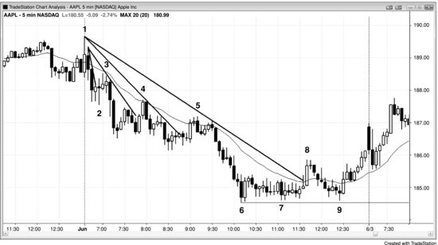
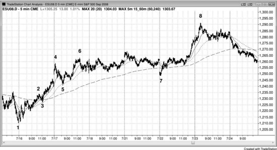

趋势中会出现多种回调，深浅不一，可以按幅度加以分类和排序。某种类型的回调第一次出现时，就是该类型的首次回调。此后每一次回调都属于更大级别类型的首次回调，而且每一次通常都伴随着对趋势极值的回测，因为强劲走势一般至少包含两段（腿）。因此，每种类型的首次逆势运动之后，大概率还会再走出一段顺势的腿。这些回调并不一定严格按照固定顺序出现。比如，有时趋势在高2之后加速，高1反而出现在高2之后。

随着多头趋势推进，动能逐渐减弱，走势变得更加双向拉锯，回调开始出现。回调幅度越来越大，逐步演变为交易区间，最终某个交易区间会反转为空头趋势。在最终反转之前，每一次逆势运动之后通常还会再创趋势新高。因此，每一个走弱迹象理论上都是一个做多建仓形态，而且下面列表中的每一种迹象都可能反复出现多次，之后才会发展出更深一级的回调。同一种迹象也可能在其他类型出现之后再次出现。

以下是多头趋势走弱迹象的大致出现顺序：

- 多头K线的实体变小。
- K线顶部开始出现影线，后续K线的影线越来越长。
- K线之间的重叠程度比之前更大。
- 出现实体非常小的K线或十字星。
- 出现空头实体的K线。
- 当前K线的高点等于或低于前一根K线的高点。
- 当前K线的低点等于或略高于前一根K线的低点。
- 当前K线的低点跌破前一根K线的低点。
- 出现一段式回调（高1做多建仓形态），即当前K线的高点低于前一根K线的高点。
- 出现两段式回调（高2做多建仓形态），持续大约5到10根K线。
- 出现三段式回调（楔形牛旗或三角形），持续大约5到15根K线。
- 突破次要多头趋势线。
- 某根K线触及均线（EMA 20 缺口K线做多建仓形态）。
- 下一轮创新高的反弹中出现一根或多根空头趋势K线，以及一两次小幅回调。
- 某根K线的收盘价跌破均线。
- 某根K线的高点低于均线（均线缺口K线）。
- 突破主要多头趋势线。
- 一旦出现高点低于均线的K线，市场会先走出第二段下跌，然后才回到均线上方。
- 下一轮创新高的反弹中出现两次或更多回调，每次持续两到三根K线，空头实体更加明显。
- 出现更大级别的两段式回调，持续超过10根K线，第二段下跌跌破某个显著的更高低点，形成更低低点。
- 市场进入交易区间，多头K线与空头K线的力度大致相当。
- 市场向上突破交易区间后又回落到区间内，形成更大的交易区间。

以下是空头趋势走弱迹象的大致出现顺序：

- 空头K线的实体变小。
- K线底部开始出现影线，后续K线的影线越来越长。
- K线之间的重叠程度比之前更大。
- 出现实体非常小的K线或十字星。
- 出现多头实体的K线。
- 当前K线的低点等于或高于前一根K线的低点。
- 当前K线的高点等于或略低于前一根K线的高点。
- 当前K线的高点突破前一根K线的高点。
- 出现一段式回调（低1做空建仓形态），即当前K线的低点高于前一根K线的低点。
- 出现两段式回调（低2做空建仓形态），持续大约5到10根K线。
- 出现三段式回调（楔形熊旗或三角形），持续大约5到15根K线。
- 突破次要空头趋势线。
- 某根K线触及均线（EMA 20 缺口K线做空建仓形态）。
- 下一轮创新低的下跌中出现一根或多根多头趋势K线，以及一两次小幅回调。
- 某根K线的收盘价升破均线。
- 某根K线的低点高于均线（均线缺口K线）。
- 突破主要空头趋势线。
- 一旦出现低点高于均线的K线，市场会先走出第二段上涨，然后才回到均线下方。
- 下一轮创新低的下跌中出现两次或更多回调，每次持续两到三根K线，多头实体更加明显。
- 出现更大级别的两段式回调，持续超过10根K线，第二段上涨突破某个显著的更低高点，形成更高高点。
- 市场进入交易区间，多头K线与空头K线的力度大致相当。
- 市场向下突破交易区间后又回升到区间内，形成更大的交易区间。

大多数首次回调幅度不大，仍属于更大趋势第一腿的一部分。但随着趋势推进，回调幅度会逐步增大，因为逆势交易者越来越愿意入场，顺势交易者也越来越急于止盈。逆势交易者开始在新的极端价位夺取主导权。比如在多头趋势中，交易者在新高处做空反转逐渐能够获利，而顺势做多、在突破新高时买入的交易者则开始亏钱。到了某个节点，逆势交易者压倒顺势交易者，趋势就此反转。

强趋势中的首次小幅回调通常只持续一两根K线，之后几乎总会再创新的极端价位。比如，一轮多头急速走势连续走了四根K线，K线之间几乎没有重叠、影线也很小，说明趋势非常强。如果下一根K线的低点跌破了前一根K线的低点，这就是该轮多头趋势的首次回调。交易者会在该K线高点上方挂买入突破单，因为他们预期至少还会再推一波。突破单一旦成交，就构成一个高1做多入场，第17章会详细讨论。激进的交易者会在前一根K线低点下方挂限价买单，预期回调很快结束，想以更低的价格入场——比等突破单成交的交易者抢先一步。下一次回调可能（60%+）持续三到五根K线，可能（60%+）突破一条次要趋势线，然后再创新的极端价位。如果这次回调包含两个小腿，那么买入入场就是高2做多（两段式回调，通常也叫ABC回调）。虽然第二次回调可以是高2建仓形态，但如果趋势非常强，它也可以只是又一个高1（单腿回调）。如果市场先走出了一两个高1入场，接着一个高2入场，看起来又要形成一个高1，那最好先等一等。连续几笔盈利之后，如果没有先出现一次更大幅度的回调，市场就再度走强，你应该保持警惕——这种强势可能（60%+）是一个陷阱（比如最终旗形，在第三册中讨论）。宁可多等等、错过一个可能（60%+）的陷阱，也不要因为连续赢钱就觉得自己无敌，骗自己说"反正是用别人的钱在玩"。真要这么交易的话，这些钱很可能（60%+）就真变成别人的了。

强空头趋势中情况正好相反：首次回调通常是短暂的一到两根K线，形成低1做空入场，之后的回调K线数量更多、腿数也更多。比如ABC回调有两条腿，形成低2做空入场。

如果趋势很强，价格可能（60%+）会远离均线两个小时甚至更久。但价格一旦触及均线，通常（60%+）会形成又一个顺势建仓形态，推动价格再创新的极端价位，或者至少回测前高或前低。多头趋势回调到均线的过程中，很多交易者认为价格已经跌到了足够便宜的折扣位，可以买入了。之前在上方做空的空头会买回平仓、兑现利润；之前在高位止盈的多头会重新买入；一直在场外观望、等更低价格的交易者也会把均线视为支撑，认为折扣到位了，开始建立新的多头仓位。如果市场在大约10到20根K线内都无法站回均线上方，原因可能（60%+）是交易者还想要更大的折扣才愿意积极买入——当前价格还不够低，不足以吸引足够的买盘来推动市场上涨。结果就是市场还得继续下跌，跌到足够多的买家回来，才能把价格重新推回去回测前高。同样的过程在所有支撑位都会发生。

如果回调穿越了均线，就会出现第一次均线缺口K线建仓形态（比如在强多头趋势中，终于出现一次回调，某根K线的高点低于指数移动均线）。之后通常（60%+）会回测极端价位，而且可能（60%+）会创出新的极端价位。最终，会出现一波逆势运动突破一条主要趋势线，而这波运动往往就是回调到第一根均线缺口K线的那一段。之后市场会回测极端价位，这次回测可能不及旧的极端价位（空头趋势中的更高低点或多头趋势中的更低高点），也可能过冲旧的极端价位（空头趋势中的更低低点或多头趋势中的更高高点）。此后通常（60%+）至少会出现一波两段式的逆势运动，即便不是直接的趋势反转。在反转之前的每一次回调都是顺势入场机会，因为每一次都是某种类型的首次回调（K线回调、次要趋势线回调、均线回调、均线缺口回调、或主要趋势线回调），而任何类型的首次回调之后，通常（60%+）至少会回测一次极端价位，通常（60%+）还会创出新的极端价位——直到主要趋势线被突破。

用5分钟图做交易时，刻意关注高时间周期图表并不划算，但5分钟图上那些较大级别的回调，往往会在15分钟、30分钟、60分钟甚至日线、周线、月线图的关键位置附近结束——比如均线、突破位和趋势线。此外，价格第一次回调到15分钟均线后，通常会再去测试一下趋势极值(60%+)，接着回调到30分钟或60分钟均线，再测试一次极值。问题在于，高时间周期的关键位置出现频率很低，如果花时间盯着这些位置等待测试，反而会分散注意力，导致错过太多5分钟图上的信号。

如果趋势很强，你已经连续赚了好几笔，但现在出现了好几根横盘K线，那么后续入场就要谨慎了，因为市场实际上已经进入了交易区间。在多头趋势里，如果区间低点附近出现建仓形态，可以买入；但要小心在区间高点突破时追多，因为空头很可能愿意在新高处做空(60%+)，多头也很可能开始在高位止盈(60%+)。

空头趋势中，经过很长一段下跌之后出现熊旗，道理一样。横盘K线说明买卖双方都很活跃，所以不要在旗形低点突破时做空。不过，如果旗形顶部附近出现做空的建仓形态，风险很小，值得一做。

**图 11.1** 后续回调倾向于越来越大

趋势中总会有回调，而且趋势持续得越久，回调幅度往往越大。不过，只要还没有反转，每次回调至少应该去测试前一个极值（图11.1中是空头趋势，即当日前低），而且测试通常会创出新的极值(60%+)。

K线1是突破多头趋势线后的两段式更高高点，随后以两K线反转向下。到这里，聪明的交易者已经开始关注新空头趋势的做空机会，而不再继续在之前的多头趋势中寻找做多机会。

K线3是回调两根K线到均线后的一笔做空，这是从昨日高点上方反转下跌形成的两K线空头急速之后的第一次回调，也是跌破昨日波段低点之后的突破回调。

K线4是第一次突破空头趋势线并穿过均线（尽管只超出了大约1个tick），之后又跌出新低。它向上突破了一个小波段高点，形成了一个小的更高高点，但未能涨过均线、K线3之后那段空头急速的顶部、或K线3之前的波段高点。大多数交易员把这看作一个简单的两K线反转加均线处低2做空建仓形态。这轮ABC的每一段只有两三根K线，反弹如此短暂，很少有交易员会把它当成趋势反转。

K线5又一次测试均线，这次有两根K线收在均线上方，但只是勉强超出，随后又跌出新低。价格没有超过K线4之后的小波段高点，差了1个tick，形成了双顶。交易员把K线4视为一个重要的更低高点，因为之后出现了新的空头低点。市场在K线5之后跌出新低，K线5便成了最新的重要更低高点。空头把保护性止损从K线4上方移到了K线5上方。

K线8突破了一条主要趋势线，并形成了第一根均线缺口K线（即一根低点在EMA上方的K线）。第一根缺口K线之后通常会测试低点(60%+)，但有时会出现二次入场点。主要趋势线的突破可能是新趋势的第一段(60%+)，但通常会先测试前低(60%+)——可能过冲也可能不及(60%+)——然后才展开至少两段的逆势运动（这里是空头趋势中的反弹）。到这里，交易员应该开始寻找做多机会，而不是继续做旧的空头趋势。K线8之后的暂停K线提供了一个做空建仓形态，因为它导致了一次空头趋势线上方的失败突破。

K线8这轮反弹还突破了K线6和K线7之间的小高点，在K线8处形成了一个小的更高高点。不过在更大级别的空头趋势里，K线8仍然是更低高点。市场随后连跌了很多根K线到K线9，测试了K线6的空头低点，但这次没有创出新的空头低点，K线9形成了更高低点。大多数空头会把保护性止损移到K线8高点上方。不过他们很可能更早就已出场(60%+)——要么是判断市场在K线9的更高低点处以两K线多头急速反转为始终持仓做多，要么是在随后形成的两K线多头旗形被突破时出场。一旦市场涨过K线8形成更高高点，他们就预期价格会继续走高。

市场在K线7和K线9处形成了双底牛旗。K线9比K线7低了1个tick，扫掉了止损单，但未能创出新低。多头在保护他们的多头仓位，并积极逢低买入（吸筹）。第二段上涨在次日完成。

把K线4、K线5和K线8对均线的测试做个对比：K线5比K线4穿越均线更深，K线8又比K线5更深。这是预期中的现象。出现这种情况时，做空要小心，因为很多聪明的空头只愿意在更高的价格做空，同时很多多头有足够的信心逢低买入。这就削弱了抛压，使做空入场变得高风险。

**图 11.2** 均线回调

图11.2中，市场在K线1的更低低点处反转。在上涨到K线4的过程中，有好几次回调到20根K线EMA后又创出新高。

K线4是趋势通道线的过冲，随后引发了一波急剧回调到K线5。K线5测试了15分钟20根K线EMA（虚线），之后市场再次测试趋势高点（K线6创出更高高点）。

市场跳空下跌到K线7，虽然一开始看起来偏空，但这次下跌其实是第一次回调到60分钟20根K线EMA（长虚线），之后K线8创出了新高。
