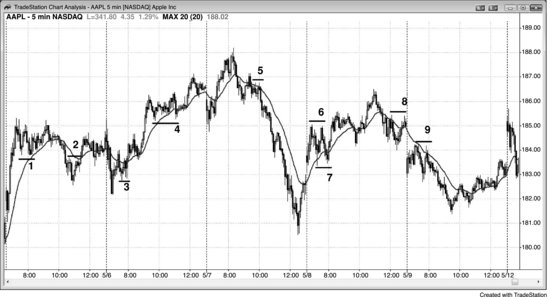
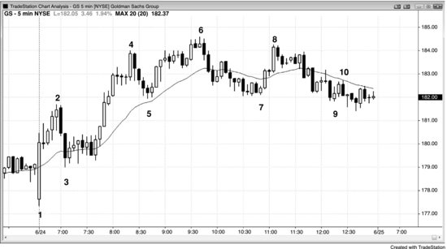
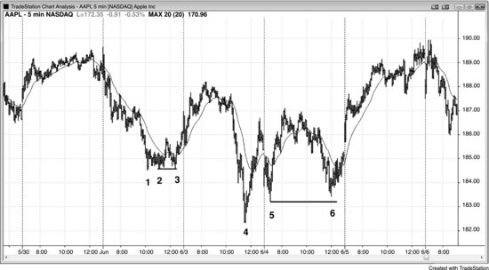
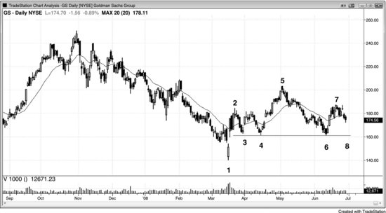
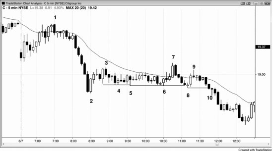
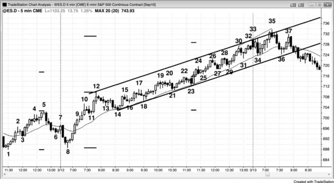
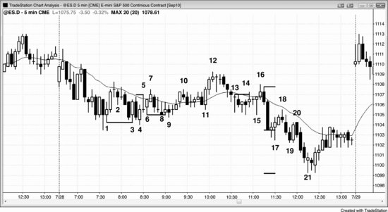

多头趋势经常以双顶结束，空头趋势经常以双底结束。多头趋势中的回调本质上是一段小型空头趋势，而这段小型空头趋势可以以双底结束。因为它是多头趋势中的回调，所以它本身就是一个牛旗，可以称为**双底牛旗**。它是多头趋势中的两段式回调，也就是高 2 建仓形态。这类高 2 建仓形态尤其可靠，所以我一般直接叫它双底，以区别于其他高 2 形态。同理，空头趋势中的回调本身就是一个熊旗，本质上是一段小型多头趋势，而这段小型多头趋势可以以双顶结束。如果确实出现了双顶，那就是**双顶熊旗**。

在多头趋势中，多头通常把保护性止损挂在最近那个 HL 下方，因为他们预期趋势会继续走出 HL 和 HH。双底牛旗之所以形成，部分原因就是多头在最近的波段低点附近积极防守自己的跟踪止损。一旦市场跌破最近的波段低点，交易者就会认为多头趋势变弱了，甚至可能已经结束——因为出现了一个 LL。接下来他们会担心市场走出 LH 而不是新高。如果真是这样，市场可能正在形成两段式回调（一个大型高 2 建仓形态），甚至可能是趋势反转。正因如此，对趋势有很强信心的多头会在最近的波段低点及其略上方大量买入，从而形成双底牛旗。空头趋势中情况正好相反：空头预期市场持续走出 LH 和 LL，很多空头会把保护性止损挂在最近那个 LH 略上方，而强势空头往往在市场反弹到最近 LH 附近时就开始积极做空，这就可能形成双顶熊旗。

多头趋势或空头趋势中的任何回调，都有可能演变成双底牛旗或双顶熊旗。有时候同一段回调中两者同时出现，这时就形成了一个小型交易区间，市场进入突破模式。如果市场向上突破，交易者会把这个形态看作双底牛旗；如果向下突破，就会被看作双顶熊旗。如果在该形态出现之前市场有明显的向上或向下的动能，这种动能会增加交易区间只是顺势延续形态的概率。比如，交易区间之前刚刚经历了一波强劲的上涨，那么向上突破的可能性更大，交易者应该在区间底部的双底反转处寻找买入机会。随后如果确实向上突破了，交易者就会把这个形态视为双底牛旗。反过来，如果交易区间之前市场处于空头急速下跌阶段，交易者就应该在形态内部的双顶反转处寻找做空机会，并预期向下突破。真的向下突破之后，交易者就会把这个交易区间视为双顶熊旗。

当多头趋势出现两段式回调，其中任何一段下跌腿是空头急速走势（哪怕看起来并不起眼）时，空头会希望市场停留在第一段下跌腿之后形成的那个 LH 下方。他们会做空，试图把趋势反转为空头趋势。多头始终期望相反的结果，因为交易是零和博弈——对空头有利的事情对多头就不利，反之亦然。第二段下跌腿之后的反弹，往往会在那个 LH 处或略低于该处停滞。多头希望反弹突破这个 LH，触发空头的保护性止损，然后创出新高。空头则会积极做空来阻止这种情况，往往愿意在 LH 下方一两个 Tick 的位置以及 LH 处大量做空。这就是反弹经常一路涨到 LH 附近才掉头向下的原因——这是空头最后的防线，他们在 LH 处的做空力度最强。如果空头赢了、市场掉头向下，就形成了双顶熊旗，随后往往会发展出空头通道。在 LH 以及对 LH 的双顶测试之后，空头接下来期望出现一个 LL，然后是一系列 LH 和 LL。

不管第二段下跌之后的反弹是在 LH 处受阻、突破了 LH、还是没有到达 LH，只要市场随后再次下跌，就可能在回调底部形成双底。如果出现了合理的做多建仓形态，交易员会买入，期望这个双底成为牛旗，之后在多头趋势中创出新高。很多在两段式回调底部做多的多头，保护性止损都放在回调低点下方。如果市场向上走了一段又回落，多头会在第一段下跌底部上方一两个 Tick 的位置积极买入，试图把市场拉起来。他们不希望市场在 LH 之后再创出 LL，因为那意味着空头力量很强，市场进一步下跌或横盘的概率会增大。如果多头成功了，趋势就可能恢复。如果市场跌穿第一段下跌的底部一两个 Tick，就可能触发多头的保护性止损，随后形成一段测量移动的下跌。

两段式回调在任何趋势中都很常见，而且两段的终点往往处在差不多的价位，使回调呈现横盘走势。有时候回调会持续几十根K线，之后趋势才恢复。这段横盘走势的起点和终点常常都是幅度较小的推动，其极值价位非常接近（第二次推动可能略微过冲或不及第一次）。每一段推动之后的趋势恢复，都是市场试图延续原有趋势的尝试。举个例子，如果市场处于空头趋势中，出现一段回调后再次下跌，空头就是在推动市场创出 LL、延续空头趋势。但如果市场在空头低点上方找到了更多买方，形成了 HL，说明空头未能把市场推到新低。如果这第二段上涨也没有形成新的多头趋势，空头重新掌控局面，形成了低 2 做空入场点，市场就会再次下跌，试图突破到新低。如果多头再一次在跟之前差不多的价位上压倒了空头，空头就在同一个价位上连续失败了两次。市场连续两次尝试做某件事都失败了，通常就会转而尝试反方向。这两次在空头低点上方差不多同一位置结束的下跌推动，构成了双底牛旗。它是一个有两个底部的 HL，本质上是低 2 的失败，这种情况下是一个可靠的买入信号。

类似地，如果多头趋势中出现了一段下跌，多头重新掌控市场并试图把价格推过前高，结果失败了，说明空头成功地再次打压了市场，形成了 LH。如果多头再次接管，又一次向上推动试图创出新高，空头再次在跟之前差不多的价位上将其压制，就形成了双顶。既然市场两次尝试突破到新高都失败了，就可能（60%+）转而向反方向运行。前高附近已经没有足够的多头来创出新高，市场只能向下去寻找更多买方。这个回调并没有成为多头趋势中成功的 ABC 回调（高 2 做多建仓形态），而是因为找不到足够的多头来创出新高，最终形成了一个由双顶构成的 LH。

这种形态有一种常见的变体出现在急速与通道趋势中。比如，市场急速上涨后出现回调，随后形成一段多头通道，最终通常（60%+）会回落测试通道底部，并在那里试图重新转升。这次对通道底部的测试与通道底部形成了双底——尽管通道底部可能是几十根K线之前的事——而且由于它处于多头趋势（急速与通道多头趋势）中，因此属于双底牛旗。

头肩持续形态是另一种变体，右肩两侧的急速推动构成了双顶或双底。

双顶熊旗和出现在多头行情顶部作为反转形态的双顶不同——双顶熊旗是已经展开的空头趋势中的持续形态。两种双顶都会引发下跌。由于双顶熊旗的功能和其他双顶一样，很多交易员直接把它叫作双顶，把它理解为市场已经转跌之后一段修正上涨的顶部。同样，双底牛旗是上涨途中的持续形态，不是空头趋势底部的反转形态。双底牛旗就是一个双底，和所有双底一样，它是一个做多的建仓形态。

新多头趋势中的第一个 HL 常常以双底牛旗的形式出现，新空头趋势中的第一个 LH 也常常是双顶熊旗。

当双顶熊旗或双底牛旗失败、市场向相反方向突破时，要关注这次突破能否成功。如果突破在一两根K线内即告失败，市场通常（60%+）会演变为某种楔形旗形变体。举个例子：假设双底牛旗已经成形，但市场随即反转、跌破了双底，那么以这个失败双底的高度为基础，有可能（60%+）出现一段向下的测量移动。这往往是一个做空建仓形态，交易员会在双底下方一个 Tick 处挂卖出突破单入场。然而，如果这次向下突破在一两根K线内就失败了，市场重新涨过前一根K线的高点，那就构成了一个三推底部入场（功能上等同于楔形）。组成双底的那两根K线是前两次向下推动，失败的突破则是最后一次向下推动。楔形的核心特征在于三次推动，而非完美的楔形形状。

**图 12.1** 牛旗

顺势牛旗的做多入场方式，是在前一根K线高点上方一个 Tick 处挂买入突破单，初始保护性止损设在信号K线最低点下方一个 Tick 处。入场K线收盘后，如果它是一根趋势K线，就把止损移到入场K线最低点下方一个 Tick 处；如果入场K线是一根小K线，则先不收紧止损，等出现一根顺你方向的趋势K线再做调整。

双底作为反转形态在空头趋势底部广为人知，但这里所说的旗形属于多头趋势中的顺势建仓形态。它们终结了回调（即一小段空头趋势），从这个角度看确实是在反转，但更恰当的理解方式是将其视为顺势形态。

如图 12.1 所示，K线 2 处的双顶熊旗失败，带来了一笔可交易的做多机会（同时形成了一个小的头肩底形态）。

K线 7 是一个双底牛旗建仓形态，位于一个刚刚形成双顶熊旗的小交易区间内。由于进入该交易区间之前的上涨动能强劲，形态向上突破、演变为双底牛旗的概率更大，而非向下突破成为双顶熊旗。无论最终向上还是向下突破，最小目标都是以该小交易区间高度为基础的测量移动。

**图 12.2** 双底牛旗

如图 12.2 所示，高盛（GS）从K线 3 到K线 4 出现了一波多头急速上涨，随后回调至K线 5，接着又沿通道上涨到K线 6，然后回调至接近通道底部的位置。K线 5 和K线 7 构成了一个双底牛旗，尽管两者之间还有K线 6 这个更高的高点。K线 5 是多头趋势中最后一个更高低点，K线 7 则可能（60%+）是空头趋势或交易区间的第一个波段低点。在这种情况下，如果K线 7 反弹后未能超过K线 6 的高点，市场有可能（60%+）形成头肩顶。尽管如此，双底牛旗作为建仓形态，至少足以支撑一笔剥头皮交易，可靠性较高。而且，大多数头肩顶——跟所有顶部形态一样——最终都会失败，转变为延续形态。因此，在多头趋势的交易区间底部附近持续买入，始终是明智之举。趋势中，大多数反转形态会失败，大多数延续形态会成功。

K线 3 之后还有一个小的双底牛旗，由K线 3 之后的第三根和第七根K线构成。这实际上是一个失败的低 2 做空建仓形态——失败的低 2 做空经常演变为双底牛旗。

对本图的深入讨论

图 12.2 中的K线 1 是一根强多头反转K线，扭转了此前跌破均线及昨日收盘附近小交易区间的突破。市场从K线 1 到K线 3 出现了一波两根K线的空头急速下跌，之后进入横盘整理，多空双方争夺通道方向。由于多头急速的力度更强（有些交易员认为急速在K线 1 的高点结束，有些认为在K线 2 结束），概率偏向多头一方——多头更有可能（60%+）推动形成多头通道，而空头在急速下跌后试图获得跟随的努力更有可能（60%+）落空。K线 3 之后的双底牛旗是一个更高低点买入建仓形态，由此展开了一段以K线 6 为终点的楔形通道。既然是楔形，两段式回调下跌便是大概率事件；既然属于多头急速与通道走势，回测K线 3 附近（即通道起点）也是常见现象。有时这个回测需要超过一天时间，但一旦形成，市场通常（60%+）会尝试与通道低点构成双底。由于K线 2 和K线 6 处的急速上涨都很强劲，市场也许不会跌到K线 3 附近，而是以K线 5 和K线 7 作为前两次下推，形成一个楔形牛旗。事实正是如此——GS 在第二天跳空高开了。

**图 12.3** 双底牛旗

图 12.3 中，K线 2 和K线 3、K线 5 和K线 6 分别构成了双底牛旗。K线 3 和K线 6 都略低于各自第一腿的低点，但形态很少是完美的。

双底出现在趋势低点附近时——比如K线 2 和K线 3——通常是一小段上涨加上一个交易区间的组合，在高时间周期图表上往往呈现为 ii 形态。

从K线 4 开始的上涨几乎是垂直的，属于急速走势。从K线 5 开始的上涨则是通道部分，尽管同样接近垂直。这是一段急速加高潮型的急速与通道多头趋势。多头急速与通道的通道阶段结束后，市场通常（60%+）会回测到通道底部，形成双底牛旗——K线 6 正是如此。之后市场通常（60%+）至少反弹到交易区间高度的四分之一左右。反弹完成后，这个形态就走完了，交易员应该开始寻找下一个形态。

从K线 5 开始的上涨在K线 4 上涨的顶部附近停滞。一些交易员把这看作双顶熊旗，做了空。之后市场下跌，在K线 6 处——也就是K线 5 回调的位置附近——找到支撑。很多做了双顶空单的交易员在测试K线 5 低点时止盈了，强势多头则在那个低点积极买入防守。这就构成了一个双底牛旗信号。向上突破后，市场走出了大致等于测量移动幅度的上涨。

**图 12.4** 头肩顶还是双底

如图 12.4 所示，GS 的日线图上正在形成一个头肩熊旗，或者说一个潜在的双底回调形态。市场先是急速上涨到K线 2，然后回调到K线 3 的更高低点，几周后在K线 4 处回测了这个低点。接着市场以多头通道上行至K线 5，再从通道底部回落到K线 6，与K线 4 的低点形成双底牛旗。最小目标是K线 5 到K线 6 下跌幅度约 25% 的反弹。

对空头来说，K线 2 是左肩，K线 7 是右肩。空头希望市场跌破连接K线 3、K线 4 和K线 6 低点的颈线。但多头看到的是K线 4 和K线 6 构成的双底，期待一波上涨。他们会在回调到K线 8 时买入，如果成功推动市场上行，就构成一笔双底回调做多交易。

提前入场的空头在K线 7 右肩下方做了空，没有等颈线突破。如果市场涨过K线 7 右肩高点，他们就会回补空仓。那样头肩顶就会失败，向上的最小目标是从K线 6 低点到K线 7 高点的测量移动距离。

K线 2 的上涨足够强劲，大多数交易员相信市场很快会更高（他们认为市场已经翻转为 Always-in 做多）。这让交易员不太愿意在几周后形成的双顶熊旗处做空。因为从K线 1 可能的底部和K线 2 的强劲上涨之后就一直看多，所以他们选择在K线 4 的双底牛旗处买入。

**图 12.5** 失败的双底

如图 12.5 所示，市场走出了一段五根K线的空头急速走势，随后在K线 2 处出现了两根K线的多头急速反弹。

K线 4 试图与K线 3 前面那根K线以及K线 2 之后的多头入场K线构成双底牛旗。K线 5 和K线 6 也在尝试完成这个底部结构。市场经常会跌破第一个底部一个 Tick 左右，把多头套在场外、把空头套在里面——K线 5 就是这种情况。K线 6 精确回测了K线 5 对K线 4 低点的假突破，是一根外包阳线，也是双底牛旗的入场K线或信号K线。它引发了K线 7 对区间顶部的突破，但很快以两K线反转的方式失败了。

市场在K线 8 处再次以一个 Tick 的幅度跌破交易区间。要认识到一个关键点：只要市场哪怕多跌一个 Tick 破了那个低点，交易员就会开始认为空头正在掌控局面。他们会把这看作一个楔形底的失败尝试——K线 4 是第一次下推，K线 5 的一个 Tick 突破是第二次，K线 8 的一个 Tick 突破是第三次。一旦市场跌破K线 8，目标就是用楔形高度（K线 6 低点到K线 3 高点）或交易区间高度（K线 8 低点到K线 7 高点）计算的大致测量移动距离。这种三连推形态可以出现在任何市场中，向下突破不一定刚好是一个 Tick。比如一只价格在 200 美元附近的股票，对应K线 5 和K线 8 这种突破的幅度可能是 20 美分甚至更多。

有些交易员会把K线 6 以来的向上反转看作交易区间底部的突破失败，再把K线 7 看作交易区间顶部的突破失败。K线 7 是两K线反转的第一根K线，很多人会在这个两K线反转的下方做空，因为他们清楚交易区间经常出现看似强劲的突破，但很快就失败。部分人在市场反弹到K线 9 时可能在盈亏平衡点出场，但随后会在K线 9 这个 LH 的下方做空，作为二次入场点。

还有一些交易员会用突破模式来操作：在K线 6 下方挂卖出突破单，在K线 7 上方挂买入突破单。向下突破失败后套住了空头，随后向上突破失败又套住了多头。一旦多空双方都被套住，下一次突破通常（60%+）能带来一波像样的波段。虽然到K线 9 的反弹很强，空头还是会在K线 9 下方做空，因为他们把这段反弹看成K线 8 突破后的回调。

可以拿这张图跟第 11 章的图 11.1 做对比。那张图在早期一段强劲的空头急速之后也出现了类似的交易区间，但后来那个潜在的趋势恢复空头日失败了，市场转而向上反转。

**图 12.6** 双底牛旗与测量移动上涨

双底形成后，如果市场从第二个低点快速拉升，接着在突破后出现一段停顿，往往会引发一轮非常强劲的趋势。图 12.6 的图表虽然没有显示出来，但前一天是一个多头趋势日。不管双底是反转形态还是这里的延续形态，预期行为都一样——K线 1 和K线 8 构成了一个双底牛旗。上涨到K线 10 的走势远强于下跌到K线 8 的走势：每一根K线的开盘价、收盘价、最高价和最低价都高于前一根K线。这种强度提醒交易员，这个双底牛旗可能（60%+）引发一波强劲的上涨。市场突破K线 5 上方后没有回调，而是横盘整理，这种建仓形态非常强，也相当常见。急速上涨到K线 12 之后，市场回调到K线 14，与K线 11 形成了一个双底牛旗，随后出现了一个多头通道，一直持续到当天收盘。

K线 18 与K线 16 形成了双底牛旗。记住，两个低点不需要完全一样。只要形态看起来跟教科书里的建仓形态类似，走势就可能（60%+）表现出类似的行为。K线 29 又跟K线 27 形成了一个双底牛旗，在强多头通道中再次构建出一个高 2 买入建仓形态。高 2 就是一个两段式回调，而所有双底本质上都是两段式回调。

深入分析这张图

如图 12.6 所示，前一天收盘时出现了一波强劲的多头行情，随后回调到均线下方附近。多头会在这里寻找一个 HL，然后期待第二腿上涨。下跌到K线 6 的通道足够陡，所以交易员不应该在开盘时K线 7 的外包阳线突破处买入。K线 8 是一根强多头反转K线，同时也是大交易区间中的 HL 和高 2。它还是连续卖出高潮后的向上反转。第一个卖出高潮是K线 5 多头通道之后的三根空头急速K线，第二个卖出高潮是K线 7 向上反转尝试失败后出现的两根强空头趋势K线。连续高潮之后，通常（60%+）至少会出现一波两段式逆势反弹，甚至经常演变为反转。由于这发生在开盘第一个小时内，有可能正在构筑当天的低点，多头应该把大部分多头仓位做成波段交易。

急速上涨到K线 10 之后，紧跟着出现了一根大阳线，形成了急速加高潮类型的急速与通道多头趋势。市场回调到K线 14——也就是那段短暂通道的起点位置——在那里如期形成了双底牛旗。

K线 14 之后那段持续的多头通道跟在一段多头急速之后。有些交易员把K线 8 到K线 10 的走势视为急速，把K线 10 到K线 11 的回落视为回调，在那里出现了一个微型趋势线高 1 做多建仓形态。下跌到K线 11 的窄通道出现了一个小幅向下突破，之后回升到K线 12 形成了一个 HH 回调，接着第二腿下跌到K线 14。

另一些交易员——尤其是看高时间周期图表的——把K线 8 到K线 12 整段视为急速，而K线 14 的两段式均线测试则是回调，由此引发了后面的大多头通道。

K线 12 下方的做空同时也是K线 11 最终旗形的反转，以及对前一天高点的二次反转。

K线14前面两根K线是一根大空头趋势K线，构成了一个向下的急速走势。这个急速走势紧跟在不久前（九根K线之前）的一个向上急速走势之后，两者合在一起就形成了一个买入高潮（一根多头趋势K线后面紧接一根空头趋势K线）。这一点从图上不太容易直接看出来，但你可以切换到不同的时间周期，找到一个把整个形态显示为两K线反转的图（事实上，在30分钟图上它就是一个两K线反转）。不过这样做并不必要，从5分钟图上就能推断出来。任何高潮出现之后，市场很快就会变得方向不确定，因为多头和空头都会加仓，试图朝各自方向推出一个通道。不确定就意味着市场处于交易区间。有些交易员把从K线14到K线17略高的高点之间的两段式上涨，仅仅看成是K线14空头急速走势之后的一个HH回调，考虑到这段走势中出现了很多十字星，这种解读说得通。不过多头从K线14起推出了一个两K线的多头急速走势，它与K线14前两根K线形成的那根空头趋势K线一起，构成了一个卖出高潮。道理一样——一根空头趋势K线后面不久跟着一根多头趋势K线就是卖出高潮，你可以在某个时间周期上找到对应的两K线向上反转。

K线18形成了一个失败的低点2做多建仓形态，之后交易员需要评估向上突破的动能，判断市场是更可能 (60%+)至少再走两段上涨腿，还是只再推一波就形成楔形顶部（低点3）。K线10以来的价格行为一直是双向的，属于交易区间行为，因此寻找低点2做空建仓形态是合理的（在强多头趋势中则不应该这么做）。

市场以一根大多头趋势K线突破上涨到K线19，这提高了从K线18失败的低点2起至少走两段上涨腿的概率。K线18到K线19之间的多头通道很紧凑，连续六根K线都收阳。通道走势强劲时，最好不要在通道下沿的突破处做空，也就是说最好不要去做低点3（楔形顶部）的空单，而应该观察是否出现适合做空的突破回调建仓形态。突破回调就是一个二次入场的做空信号。上涨到K线20的走势本来可能就是那个建仓形态，但它本身也太强了，连续五根多头趋势K线。到这个时候，大多数交易员会把从K线14开始的上涨视为强多头趋势（尽管仍处于通道中），并按照任何强多头通道的方式去交易——逢机会就做多，不被回调套在场外。

只要出现强急速走势，就应该预期会有跟随，可以用测量移动来找合理的止盈位置。这些投影非常可靠，机构肯定也在使用它们。第一组测量应该基于双底。把K线1到K线5的高度，或者K线5到K线8的高度，加到K线5的高点上，就能找到可能的止盈区域。这两个投影在K线24处都被超越了。当时通道依然陡峭，后续可能 (60%+)还有更多上涨空间，所以多头应该继续持有部分多单，并寻找机会加仓。加仓方法可以参考第一本书中关于通道的章节。

下一个更高的目标来自将急速走势的高度翻倍，以K线10或K线12作为急速走势的顶部。把K线8到K线12的点数加到K线12的顶部，这个投影在第二天第一个小时被微幅超越，随后几个小时里出现了16点的回调。

K线24是通道中的第四波推升。市场在K线24之后的低点4处未能反转，随后向上突破。一般来说，交易员在这里不应该使用低点4的说法，因为这是多头市场，不是交易区间或空头趋势，但K线23之后的突破说明确实有很多交易员把失败的低点4当作了平掉多单的理由。这次突破在K线22高点的突破位和K线25低点的突破回调之间制造了一个缺口。强势走势之后出现的缺口往往会变成测量型缺口，这里正是如此。当前这段腿从K线24的通道低点开始，把该低点到缺口中点的点数加到缺口中点上，就能算出多头可能止盈的测量移动投影位。市场在收盘前的上涨中距离这个目标只差两个tick，但在第二天开盘时短暂地从该位置回落了。

交易员应该持续关注趋势线和趋势通道线，随着通道的发展不断重新绘制。通道顶部出现一次失败突破，就可能 (60%+)引发反转；第二次失败突破则是更可靠的做空建仓形态。从K线14到K线23的低点画一条多头趋势线，再做一条平行线锚定到K线12急速阶段的顶部，就能得到一个包含价格行为的通道。K线35是区间顶部的第二次失败突破，是一个合理的做空建仓形态。最低目标是向下戳穿通道底部，然后用通道高度做测量移动——从突破点向下减去通道高度。

通道往往在第三次推动之后进入回调。K线15、17、19构成了三连推，但通道太陡，除非先出现一个强势的向下突破再回调，否则不值得做空。K线24、26、28的三次上推也是一样。反转没能成功，反而形成了K线29上方的高2做多建仓形态，随后连续出现5根多头趋势K线，构成一段急速上涨。

K线30、33、35又形成了一个三连推顶部形态，这次值得入场，因为这里有可能 (60%+)成为当天的最高点。开盘第一个小时出现的反转有可能 (60%+)成为全天高点，所以应该更积极一些。下跌到K线34的过程中出现了两根强空头趋势K线，说明空头力量在增强。K线35是一根强空头反转K线，也是多头通道顶部突破后的第二次向下反转，位置略高于用K线8到K线12急速阶段高度算出的测量移动目标。

今天是一个很好的例子，说明强趋势通道中可以存在大量双向交易，回调看起来总是不够强、不值得买入。期间出现了很多空头趋势K线，把空头诱入做空，让他们以为还会有第二段下跌。但每次测试均线时买方都会回来，始终没有出现好的突破回调做空机会。这就告诉经验丰富的交易员：只找做多机会。虽然有几次逆势刮头皮的机会，但只有在刮完头皮后能马上在下一个做多建仓形态重新做多的前提下，才值得考虑。如果连下一个做多机会都抓不住，就说明他们还不具备在这种行情里做空的能力——因为在等待那些罕见的盈利空头刮头皮机会时，很可能 (60%+)已经错过了太多做多的盈利交易。这样的交易员站在了数学的错误一边，缺乏纪律，没有把盈利潜力最大化。

整个通道非常陡，可以假设这段急速上涨在高时间周期图表上同样形成了一段大幅急速上涨（事实上，在60分钟图上形成了一段强劲的8根K线多头急速走势），之后应该跟随一段高时间周期的多头通道。也就是说，5分钟图上接下来两到三天内很可能 (60%+)会有跟随性买入，事实也确实如此。当5分钟通道是高时间周期急速走势的一部分时，随后的回调通常 (60%+)只会测试高时间周期图表上的通道低点，而不会测试5分钟图表上的通道低点。

期间出现了很多突破回测，精确到tick地测试了之前的突破点，把那些在波段持仓部分使用盈亏平衡点止损的做多交易员扫了出去。比如，如果交易员在K线11的高2买入，并一直持多穿过K线12的失败旗形（不建议这样做，因为当时那个阶段这是一个不错的做空建仓形态），用盈亏平衡点止损的话就会被精确止损出场。但如果交易员认出了这个强双底形态，就会在K线14的两段式均线回测上方做多，对波段持仓部分使用更宽的止损，预期当天是强多头趋势日。看一下均线——K线10之前的初始多头急速上涨之后，没有任何一根K线收盘价跌破均线，所以不要因为怕多亏一两个tick就用紧止损。交易员应该准备好明天在第一根收盘价跌破均线的K线买入，然后在均线下方第一根均线缺口K线上方再次买入。

**图 12.7** 失败的双底突破是楔形的变体

双底牛旗向下突破后如果立刻反转回升，就变成了楔形牛旗的一种变体。图 12.7 中，K线 3 与K线 1 的信号K线形成了双底，但市场随即反转下跌。不过，跌破双底底部的突破失败了，市场在K线 4 处再次反转上涨，构成了一个楔形牛旗（也可以叫三角形态）。三次下推分别是K线 1、K线 3 和K线 4 底部的影线。在这个特定情况下，K线 2 也可以作为第一次下推。由于K线 1 到K线 3 之间市场处于交易区间，在K线 1 顶部买入风险很大，因为那根K线太长，等于在交易区间顶部附近做多。当市场处于交易区间、没有什么可供反转的东西时，大的多头反转K线并不能起到反转K线的作用。遇到这种情况，最好等待突破回调出现，再寻找二次入场点的机会。K线 4 是一个回调到更低低点的信号K线，用来做多更安全。

K线 6 和K线 8 试图构成双底牛旗，但始终没有触发。相反，市场在K线 9 处向下突破，几根K线之后又反转上涨。这又是一个楔形牛旗，三次下推分别是K线 6、K线 8 和K线 9。不过，K线 7 之后的那根空头趋势K线也可以作为第一次下推。对于任何楔形来说，只要至少有三次下推就行，有多个候选并不影响。

K线 13 和K线 14 形成了双顶，尽管K线 14 高了 1 个 tick。市场在K线 15 处反转上涨，但向上突破失败，K线 13、14 和 16 最终构成了一个楔形熊旗做空建仓形态。

深入讨论该图表

图 12.7 中K线 13 和K线 14 的双顶出现在均线下方的铁丝网形态中。空头铁丝网形态经常出现失败的低 2，交易员可以在低 2 信号K线下方买入，押注向下突破失败。这是一个剥头皮交易。由于铁丝网形态中第一根突破的趋势K线通常 (60%+) 会失败，交易员可以在K线 16 下方寻找做空机会。

K线 19 勉强算是一个高 2 做多建仓形态（它是一个两K线多头反转，但市场从未交易到那根多头K线上方），但此时市场在强力跌破交易区间之后可能 (60%+) 已经进入了空头趋势，就不应该再去找高 2 做多建仓形态了——那种形态只在多头趋势和交易区间里才有效。这个交易区间大部分在均线下方，而且市场在进入交易区间之前就已经在下跌，所以向下突破的概率更大（趋势恢复）。交易员会预期高 2 做多失败并套住多头，然后在K线 20 的低 2 建仓形态下方寻找做空机会——被套的多头会在那里平掉自己的多头仓位。

空头通道在第三次下推到K线 21 后结束，第二天市场跳空高开，远高于K线 18 这个空头通道的起点。通道前面有K线 16 之后一段强劲的两K线空头急速走势。用急速走势的高度从急速走势底部向下投射，得到了一个完美的测量移动。

K线 19 也是一段两K线的急速下跌，随后形成了从K线 20 到K线 21 的空头通道。这个通道是抛物线形的：先有一根大的空头趋势K线作为加速阶段，然后实体逐渐缩小进入减速阶段，最后一根甚至收阳。从K线 20 开始的三根空头趋势K线构成了一段空头急速走势，也就是一个抛压高潮。这是连续第三个抛压高潮，之后通常 (60%+) 会出现至少持续 10 根K线的两段式回调。K线 16 之后的两K线空头急速走势是第一个抛压高潮，以K线 19 结束的三K线空头急速走势是第二个抛压高潮。
