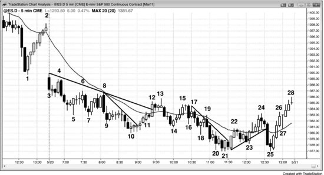
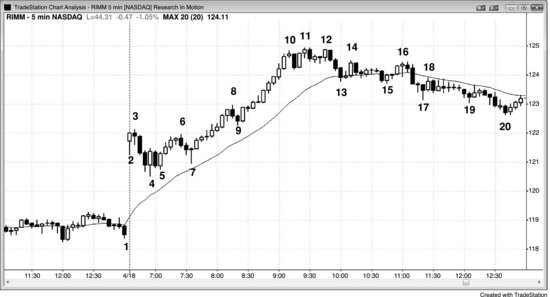

市场连续 20 根或更多K线始终处于均线一侧、从未触及均线，说明趋势很强——但也意味着走势过度延伸，可能（60%+）很快回调到均线附近，形成一个 EMA 20 缺口K线建仓形态。如果回调之前没有出现明确的趋势反转，价格第一次触及均线时做一笔剥头皮交易、押注价格重新测试趋势极值，胜率很高。有些交易员会在均线附近用限价单或市价单入场——在均线上方一点或下方一点挂单——但更好的做法是等价格行为给出入场信号（也就是价格朝趋势方向反转后用突破单入场），因为回调有可能远远穿过均线。20 根K线这个数字没什么神奇的，它只是一个参考标准，提醒你当前趋势很强。你可以随便选一个比较大的K线数量作为标准，得到的建仓形态通常（60%+）是一样的，而且在其他时间周期上同样适用。一个极强的趋势可以每 30 分钟都触及一次均线；一个趋势也可以远离均线 4 个小时，然后突然反转成相反方向的趋势。这种形态出现在 5 分钟图上、且市场至少 2 小时未触及均线时，我以前叫它"距离均线两小时建仓形态"，简称 2HM。同样的概念适用于所有时间周期，所以用K线数量来描述比用小时数更实用。这 20 根K线可以出现在一天中的任何时段，不一定局限于开盘后的头两个小时。

一旦你发现已经出现了连续 20 根缺口K线，就要留意在每次价格触及均线时押注失败。经过一次或多次均线测试之后，可能（60%+）会出现一次穿过均线的测试，形成一根均线缺口K线——这根K线完全处于均线的另一侧，K线和均线之间存在缺口。你要做的是在第一根缺口K线出现时押注失败（以多头趋势为例：如果前一根K线的高点低于 EMA，就在前一根K线高点上方 1 tick 处挂买入突破单）。如果第一次入场失败了，就在二次入场点再买一次（如果有的话）。跟所有建仓形态一样，前两次建仓形态都失败了，第三次就不值得再买了，因为这时市场可能（60%+）已经进入通道，而不是在形成反转。既然是顺势交易，就应该把一部分仓位做波段，因为市场可能（60%+）走出远超你预期的幅度。均线测试在股票上尤其可靠，经常能提供全天的好入场点。不过，如果第一根均线缺口K线出现在一次强势趋势反转之后，它就可能（60%+）会失败，因为趋势已经反转了，这根缺口K线对应的是之前那段已经结束的趋势。

**图 13.1** EMA 20 缺口K线

趋势强到连续 20 根或更多K线都没有触及均线时，很多交易员会在价格第一次回调到均线附近入场，然后持仓等待价格测试趋势极值。在图 13.1 中，K线 11 是超过 20 根K线以来第一根触及均线的K线。空头趋势没有出现明确的底部，所以交易员在均线下方一点、均线处以及均线上方一点都挂了限价单来建立空头仓位。从K线 10 到K线 11 的上涨虽然由 6 根连续的多头趋势K线组成，但K线 10 处并没有形成明确的底部，所以交易员仍然在均线附近寻找做空机会。做空的结果是K线 11 之后出现了一根小型空头内包K线，而不是一根强空头趋势K线——这说明大多数交易员认为当时的反弹力度太强，不适合做空。但空头在K线 13 下方的二次入场点变得激进起来（第一次入场机会在前一根K线）。因为上涨到K线 13 的力度很强，交易员预期会出现一个 HL，然后再次上测，所以大部分空头在K线 14 处——也就是对K线 10 空头趋势低点的 HL 测试附近——平仓离场了。

K线 8 虽然没有触及均线，但仍然构成了一次对均线的两段式测试。空头急切地想做空，把限价单挂在均线下方 2 到 3 个 tick 的位置，因为他们没把握反弹能真的触及均线。如果有把握，就可以把做空的限价单挂在均线下方 1 tick 的位置，价格触及均线时就能成交做空。市场刚到均线下方就掉头向下，说明空头非常激进。测试演变成一根大型空头趋势K线时，这一点表现得尤为明显，这里正是这种情况。

K线 7、9 和 10 形成了一个空头楔形，这是一种反转形态。K线 10 这根信号K线不够强，不足以让交易员相信市场正在反转向上，所以他们仍然在均线附近寻找做空的建仓形态。不过底部的力量足以推动价格形成第二段上涨到K线 15，在那里与K线 13 构成了一个双顶熊旗。

本图深入讨论

如图 13.1 所示，市场以一根空头趋势K线跳空低开，这个突破有可能演变为始于开盘的空头趋势。两根K线之后突破失败，但这个建仓形态不够强，不足以做多。空头应该先平仓观望。K线 4 与K线 3 构成了双顶熊旗，并与紧随其后的那根K线形成了两K线反转。交易员可以在K线 4 下方挂卖出突破单做空这个双顶，也可以继续等待。下一根是空头趋势K线，跌破了K线 4 的低点，使K线 4 成为一个波段高点。至此，市场既有了波段低点，也有了波段高点，而且开盘区间不到近期日均波幅的三分之一，因此市场处于突破模式。多头会在交易区间上方挂买入突破单做多，空头会在交易区间下方一个 tick 处挂卖出突破单做空。突破之后应该出现跟随，当天往往会变成趋势日——这里正是如此。

尽管上半场空头力量很强，多头还是突破了好几条空头趋势线。价格以止损猎杀的方式急跌到K线 25 之后，多头把市场拉了上来。K线 25 与K线 21 形成了双底，此前市场已经反弹至K线 13 并突破了空头趋势线。同时，这也是K线 21 到K线 24 熊旗的最终旗形做多建仓形态。K线 13 还是空头趋势中第一根出现在均线上方的缺口K线，因此也是一个做空建仓形态（见下一章）。

**图 13.2** EMA 20 缺口K线并不总是做多建仓形态

如果市场已经有 20 根或更多K线没有触及均线，但之前出现过高潮，那么 EMA 20 缺口K线建仓形态可能不会带来反弹以及对极值的回测。如图 13.2 所示，Research in Motion（RIMM）在K线 10 之前走出了一段抛物线式的多头趋势。抛物线式上涨不可持续，属于一种高潮，而高潮之后通常至少会出现持续 10 根K线以上的两段式回调，甚至可能引发趋势反转。因此，仅回调一段就在均线处做多属于高风险操作。

本图深入讨论

虽然在图 13.2 中，多头可以在K线 13 处用均线限价单做多并剥到一小段利润，但在高潮之后买入空头急速段是有风险的，因为至少应该预期出现两段下跌。K线 15 是一个更好的建仓形态，因为它是第二段下跌，而且出现了一根不错的多头反转K线，但该形态在K线 16 的低 2 处失败了。K线 16 还与K线 14 构成了双顶熊旗。不过，由于市场处于窄幅交易区间中，这并不是一个强的做空建仓形态。

K线 10 上涨过程中各K线之间重叠很少，收盘价都接近高点。从K线 7 到K线 10 的整段反弹非常陡峭，构成了一个多头急速段。急速段之后通常会出现暂停或回调。这里的回调以三根空头趋势K线急跌到K线 13 开始，形成了一个空头急速段。当多头急速段之后紧接着出现空头急速段，就构成了高潮反转——这是两K线反转的一种，但可能只在更高时间周期图表上才能看清楚。之后市场通常会横盘整理一段时间：多头不断买入，试图推动形成多头通道；空头不断卖出，试图把市场压入空头通道。这里空头赢了，市场跌破了K线 13 和K线 15 的双底，走出了一段测量移动下跌。当市场两次尝试做同一件事都失败时，通常就会走向相反的方向。

虽然图上没有显示，但多头从K线 20 的低点开始走出了一段强多头通道。从K线 20 起来的这一腿与从K线 4 到K线 10 的第一腿等高，形成了第一腿等于第二腿的测量移动。到K线 10 的多头急速段远大于到K线 13 的空头急速段，而且在更高时间周期上也构成了一个多头急速段。空头急速段在这张 5 分钟图上得到了属于它的通道，随后多头急速段在第二天的更高时间周期图表上也得到了属于它的通道（未显示）。

这个高潮中还包含一个小的楔形顶。虽然K线 12 低于K线 11，但它仍然像楔形那样运作——可以认为空头非常激进，以至于第三推未能超越第二推。有些交易员会把K线 10 之后的那根空头K线视为第一次跌破多头通道下沿，然后把K线 11 视为突破回调至更高高点。这个信号不足以做空，但足以让多头减仓或离场。K线 12 是两K线反转的第一根K线，与K线 11 形成了更低高点或双顶。交易员可以在第二根K线（一根强空头趋势K线）下方做空，最小目标是回测均线。K线 17 是第一根出现在均线下方的缺口K线，但此时多头趋势已经演变为交易区间（市场已经横盘了 20 到 30 根K线），这里已经不再是一个可靠的做多建仓形态。
