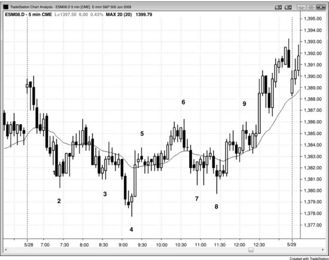
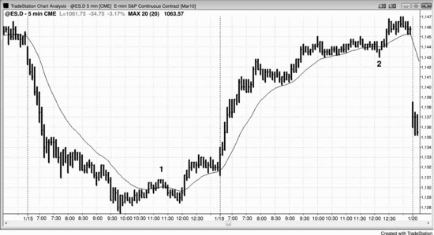

通常，EMA 20 缺口K线建仓形态出现后，市场会回测极值，而下一次测试均线时回撤往往更深。有时会出现一根完全位于均线另一侧的K线，这就是**均线缺口K线**，它有时也可以同时作为 EMA 20 缺口K线回调建仓形态。**缺口**是个泛称，意思就是图表上两个点之间存在一段空间。比如，今天的开盘价高于昨天的收盘价，就是一个向上跳空缺口；如果开盘价高于昨天的最高价，日线图上就会出现一个缺口。把这个概念拓展开来，可以发现更多交易机会。比如，如果某根K线的最高价低于均线，那么这根K线和均线之间就存在缺口。在多头趋势或横盘市场中，市场很可能会回补这个缺口。有时某根K线会突破前一根K线的高点，但一两根K线之内，回调又继续向下。如果市场再次突破之前某根K线的高点，这就是**第二次均线缺口K线建仓形态**，也就是多头趋势中第二次尝试回补均线缺口，这种情况下出现一波可交易反弹的概率非常高。同样，在空头趋势或横盘市场中，均线上方的缺口也倾向于被回补。

如果趋势很强，而这是趋势中的首次均线缺口K线，那么之后通常会回测趋势极值。回调到缺口K线的这段走势一般强到足以突破趋势线，而回测趋势极值之后，市场通常会形成两段式回调，甚至出现主要趋势反转（MTR）（在第3本书中讨论）。举个例子，如果多头趋势很强，终于出现了一根最高价低于均线的K线，下一根K线又突破了那根K线的高点，市场就会尝试形成一个 HH 或 LH 来测试多头趋势的极值。交易员会买入做波段交易，预期市场会接近或超过前高。一些交易员会在均线下方的回调继续下跌时加仓做多（这在第31章关于分批入场和出场中讨论）。如果市场反弹测试了前高但随后向下反转，通常会出现一波更持久的回调，至少有两段，并且经常导致趋势反转。

大多数图表上的大多数K线其实都是均线缺口K线，因为大多数K线并不触及均线。不过，如果趋势不强，交易员做逆势交易（比如在均线上方某根K线低点下方一个 Tick 处卖出），通常只是想剥一笔到均线的头皮，在均线处止盈。只有到均线的空间足以产生可接受的利润、并且这笔交易在当前价格行为背景下说得通时，交易员才会做这笔交易。所以，如果趋势很强，首次均线缺口倾向于产生波段交易机会；如果趋势不强，交易员做均线缺口K线交易更可能只是在剥头皮。

**图 14.1** 均线缺口与第二次信号

图 14.1 中，K线 2 是横盘市场中第二次尝试回补均线下方缺口。向下的动能比较强，严格来说当天市场可能不算横盘，但由于前一天收盘很强，均线基本走平。另外，有好几根K线与前面一两根K线存在重叠，K线 2 也是当天第三和第四根K线形成的两K线空头急速之后的第三次下推。多头在K线 2 高点上方一个 Tick 处挂买入突破单做多，目标是在测试均线时拿到剥头皮者的利润。

K线 3、4 和 8 也是第二次尝试（第一次尝试可以只是一根多头趋势K线），即第二次均线缺口K线建仓形态入场。

K线 5 是一根均线缺口K线，但交易员不会在此处做空去剥到均线的头皮，原因有两个：一是到均线的空间不够做一笔剥头皮交易，二是它出现在一波强反转上涨之后，形成了 HL，而且K线 4 的 LL 反转上涨之后，很可能还会有第二段上涨。

K线 6 和 9 是第二次均线缺口K线做空建仓形态。市场突破K线 9 高点之后，多头趋势就确立了，因为两次向下的尝试都失败了（K线 9 是第二次均线缺口K线建仓形态，也就是第二次尝试回补到均线的缺口）。

K线 7 是均线缺口K线建仓形态，但由于到均线的空间非常小，交易员不太可能仅仅因为它是均线缺口K线就买入做剥头皮。

本图的深入讨论

图 14.1 中，市场向上突破，但当天第一根K线很小，不是一根可靠的突破失败做空信号K线。第三根K线是强K线，作为可能的始于开盘的空头趋势建仓形态更合适。

K线 6 是K线 4 之后急速与通道多头趋势的外包阴线反转。

K线 8 是从K线 7 低点开始的小型扩展三角形的信号K线。也可以把它看作楔形，因为它是一个小型双底的向下突破，而且该突破失败了。K线 8 同时也是K线 4 底部之后的楔形牛旗：三次下推分别是K线 5 后面那根K线、K线 7 和K线 8。最后，K线 8 还是K线 4 的 LL 之后急速上涨到K线 5 后形成的 HL。

K线 9 上方的突破是一个失败的楔形熊旗，因此很可能出现测量移动式上涨。三次上推分别是K线 8 前面两根K线处、K线 9 之前的波段高点和K线 9。

**图 14.2** 均线缺口与极值测试

首次均线缺口K线可以引发对趋势极值的测试。图 14.2 中，K线 1 和K线 2 都是强趋势中的首次均线缺口K线，之后都跟随了对趋势极值的测试。K线 1 是空头趋势中第一根低点高于均线的K线（K线与均线之间存在缺口），之后出现了对空头低点的 HL 测试。K线 2 之后则出现了新的趋势极值。
