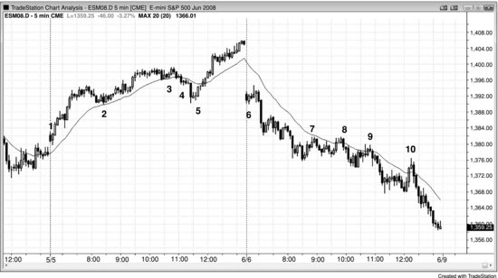
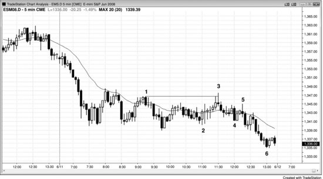
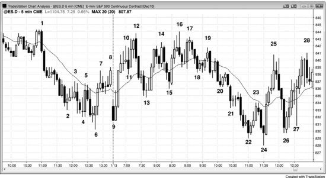

市场经常在太平洋时间上午7:00和7:30前后一根K线内出现突破或反转，通常由经济数据报告引发；太平洋时间上午11:30也是一个高频拐点；上午11:00和中午12:00附近偶尔也会出现。强趋势日中有一个非常典型的现象：在上午11:00到11:30之间（当然也可能更早或更晚），往往会出现一波凶猛的逆势恐慌走势，把交易员吓出场外。等你意识到自己被这波强逆势走势骗了，趋势往往已经大幅回到之前的极端价位附近。这时你和其他贪心的交易员一样，被套在场外后只能去追，进一步推动趋势延伸。这波走势是怎么来的？机构从剧烈的逆势急速中获利，因为这让他们能以好得多的价格加仓，预期趋势会在尾盘恢复。假设你是一个机构交易员，想在尾盘前大举建仓，又想拿到好得多的入场价，你就会想办法制造或参与散布某个谣言，引发一波短暂的恐慌，触发止损单，把价格短暂推过某个关键水平。至于谣言或新闻的内容是什么、是不是某家机构为了赚钱故意散布的，这些都不重要。重要的是，这波扫止损的走势给了那些看懂局势的交易员一个机会——跟着机构搭顺风车，从这次失败的趋势反转中获利。

这种扫止损的回调通常会突破一条重要的趋势线，因此随后奔向新极端价位的走势（趋势线突破之后的更高高点或更低低点测试）会促使聪明的交易者在第二天开盘第一个小时寻找反向交易的机会。

这类陷阱在交易区间日也很常见：市场在某一极端附近盘整了好几个小时，看起来像是要突破，结果突然一波急速反向走势打穿了另一端的极端价位，而这个反向突破往往在太平洋时间上午11:30左右失败。这波走势同时套住了两拨人——先前为一个方向突破而布局的交易员被套在场外，而在反向突破中入场的交易员则被套在了亏损仓位里。大多数交易区间日的收盘价最终落在区间中部附近。

**图 15.1** 尾盘扫止损

图15.1中，尾盘扫止损走势里出现了两个均线缺口K线建仓形态。K线5是太平洋时间上午11:25那波扫止损之后的入场K线，同时也是均线缺口建仓形态的二次入场点（第二次均线缺口K线做多建仓形态，第一次入场点在K线4空头急速之后那根K线的上方）。注意那根空头趋势K线有多强——实体很大，收盘接近最低点。这根突破K线让缺乏经验的交易员以为市场已经转为空头趋势，而聪明的交易者把它视为一个绝佳的做多机会，预期这是一波衰竭型卖出高潮和一次失败的突破。这类扫止损走势通常会突破主要趋势线，而由于之后通常会出现趋势方向的新极端价位，往往为第二天开盘第一个小时的反向交易创造条件（这里是多头趋势线被突破后出现了更高高点）。它与K线2——也就是多头通道的起点——共同形成了一个双底牛旗。

这两天里，均线缺口押注失败建仓形态都是在均线被测试两次或更多次之后才出现的。逆势交易员多次把价格推回到均线附近后信心增强，开始加码押注，结果推出了一根越过均线的缺口K线。但这种首次越过均线的突破通常会失败，反而为预期中的趋势恢复提供了一个很好的押注失败入场机会。

第一天，市场在上午7:00试图向下反转，大概是受报告影响。由于当时日内走势属于始于开盘的多头趋势，这根单K线下跌只是始于开盘趋势日中的第一次回调，因此构成了一个做多建仓形态。反转失败后，市场走出了一个三K线多头急速，随后进入通道。

第二天，上午7:00的反转成功了，演变为三K线空头急速，随后跟了一段空头通道。

第二天，市场在中午12:00试图从一个最终旗形向上反转，但反转在K线10的均线缺口做空建仓形态处失败了。

**图 15.2** 尾盘多头陷阱

图 15.2 中，开盘后形成了始于开盘的空头趋势，随后价格始终无法站上均线。交易员预期太平洋时间上午 11:30 会出现一个多头陷阱，当天市场恰好准时兑现。K线 3 同时也是空头趋势中的第一根均线缺口K线。这类陷阱通常（60%+）表现为一段强劲的逆势腿，诱使满怀希望的多头激进买入，结果市场迅速反转下跌，迫使他们清仓离场。然而当天，从K线 2 开始的反弹由多根大幅重叠的十字星组成，说明交易员在两个方向上都很紧张。既然双方都没有信心，又怎么会有人被套住呢？实际情况是这样的：K线 3 前面那根K线试图与K线 1 形成双顶熊旗，但K线 3 突破了K线 1 的高点，破坏了这一形态。这让很多交易员放弃了看空观点，空头被迫平仓，同时一些多头在突破时追进做多而被套。由于突破前的上涨动力很弱，被套的多头可能（60%+）不多。不过，正因为未能与K线 1 形成完美双顶，空头反而被套在了场外。既然这是一个陷阱，空方就有了充足的燃料：被套在场外的空头不得不在更低的位置追空，被套的多头则不得不砍掉多单。从K线 3 开始的下跌腿走势偏弱，跟从K线 2 开始的上涨腿一样无力，但最终结果符合预期——当天以最低价收盘。这是一个空头趋势恢复日，但由于恢复启动较晚，且之前是一段伴随强烈双向交易（大幅重叠、带长影线的K线）的窄幅交易区间，因此这一段下跌腿的幅度比开盘时的抛售要小。

**图 15.3** 交易区间日的晚间陷阱

交易区间日同样经常在太平洋时间上午 11:30 出现陷阱（见图 15.3）。当天价格在日内区间上半部分运行了几个小时之后，跌破了当日最低点，把多头套在了场外，同时把新进的空头套了进去。市场在 11:35 的K线给出了一个在K线 24 上方的高点 2 二次入场做多机会。价格两次尝试跌破K线 9 形成的日内低点均告失败，因此可能（60%+）会尝试向相反方向突破。大多数交易区间日都收在区间中间位置附近。

开盘后市场形成了始于第一根K线的多头趋势，随后回调跌破了早上 7:00 的信号K线——K线 10 的下方，可能（60%+）是受到某种报告发布的影响。由于出现了三根带明显影线的大幅横盘K线，构成了一个小交易区间，在其上方买入风险较高。于是市场在报告发布时短暂向下突破，把空头套了进去；接着又向上突破K线 11 上方，把多头套进去、空头套在场外；然后在K线 12 处再次掉头向下。当多头和空头都有人被套——无论是套在里面还是套在外面——下一个信号通常（60%+）至少够做一笔剥头皮交易。

对本图的深入讨论

图 15.3 中，昨日收盘前的反弹源自一个楔形底反转，可能（60%+）至少会走出两段腿。K线 9 处的更高低点反转距离双底足够近，太平洋时间早上 7:40 K线 13 处的更高低点则构成了双底回调。由于开盘后的反弹是一段强劲的急速上涨，市场可能（60%+）在回调后尝试形成通道，但K线 12 与K线 1 形成双顶后未能成功。之后一个小时内出现了几段空头急速下跌，最终形成了一段空头通道，在太平洋时间上午 11:30 的K线 24 处反转上涨。上午 11:00 K线 22 处的反转尝试失败了。当时市场处于一段过陡的空头通道中，因此通道的第一次突破可能（60%+）会演变为突破回调，之后再给出一个更高概率的做多机会，K线 24 就是那根信号K线。它同时也是在日内新低位置的第二次反转向上尝试。

K线 12 处的推高构成了一个楔形熊旗，K线 5 和K线 8 是前两次推高。市场上涨太陡，不适合在K线 11 突破从K线 9 开始的窄幅多头通道时做空，但在K线 12 这个更高高点的突破回调处做空是合理的。更稳妥的做法是等K线 12 这根外包阴线收盘，看空方能否控住这根K线。收盘位置靠近最低点，确认了空方的强势，因此在它下方、在跟随开始时做空是一个不错的入场点。
