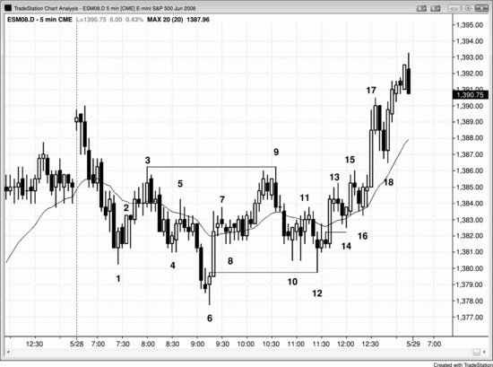
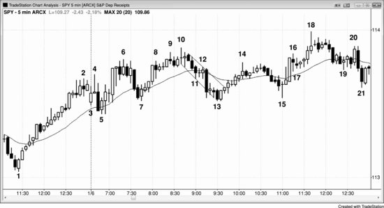

趋势往往有两条腿。如果反转后第一条腿动量很强，多空双方都会想：这会不会是多条腿中的第一条？会不会是新趋势的起点？正因如此，双方都会预期市场回测旧趋势极端位时会失败，而顺势交易者也会很快了结仓位。举个例子：假设一段持续的空头趋势之后，出现一波强劲的上涨，价格突破了均线，也突破了空头趋势中最后一个LH，而且包含很多多头趋势K线——这时多空双方都会预期接下来出现一次低点测试，但这次测试会守住空头趋势的低点。当第一条上涨腿动量开始减弱，多头会部分止盈或全部止盈，空头则会尝试做空——以防市场依然被空头控制。空头不确定自己的趋势是否已经结束，所以愿意建立新的空头仓位。市场随之向下运行，因为买方不愿意在出现更多看涨的价格行为之前入场。当多头在这波回调（也就是对低点的测试）中重新进场后，新做空的空头会迅速平仓离场，因为他们不想在这笔交易上亏钱。空头回补带来的买盘增加了上行压力，市场随后形成一个HL。这时空头不会再考虑做空，除非第二条上涨腿在第一条上涨腿顶部附近出现乏力迹象（可能形成双顶熊旗）。如果真的出现乏力，新多头会迅速离场以避免亏损，空头也会变得更加积极，因为他们意识到第二条上涨腿已经失败。最终一方会胜出。这种博弈整天都在所有市场中上演，由此产生了大量的两段式走势。

事实上，只要市场朝一个方向走出一定幅度，最终都会试图反转这段走势，而且通常会尝试两次。也就是说，每一段趋势和每一波逆势运动都很可能拆解为两条腿，而每条腿本身也会试图再细分成两条更小的腿。

当你在寻找一个两段式走势时，确实看到了两条腿，但如果这两条腿走在一个相对窄的通道里（不管是哪种通道，比如楔形），那它们实际上可能只是第一条腿内部的细分，整个通道可能只是两条腿中的第一条。尤其是当这两条腿各自包含的K线数量相对于它们所修正的形态来说明显偏少时，更要警惕这种情况。比如，一个持续了两小时的楔形顶部之后，出现了一个三根K线的空头急速下跌，接着是一个三根K线的通道——那么这个急速加通道合在一起很可能只是下跌的第一条腿，交易者在至少再看到一条下跌腿之前，不会大举买入。

**图 16.1** 两段式走势

图 16.1 中，空头趋势下跌到K线 6 走了两条腿，第二条腿又细分为两条更小的腿。上涨到K线 9 的走势同样是两条腿，下跌到K线 12 也是两条腿。所有急速与通道形态从定义上讲都是两段式走势，因为先有一个高动量的急速阶段，再跟着一个低动量的通道阶段。

K线 12 是对多头走势起点的一次完美突破回测。它的低点恰好等于K线 6 信号K线的高点，正好以一个 tick 的差距打掉了K线 6 多头的盈亏平衡点止损。每当出现完美或近乎完美的突破回测，市场完成一个大致的测量移动的概率就很高（预期从K线 12 低点开始的上涨幅度等于K线 6 到K线 9 的点数幅度）。

市场两段式上涨到K线 15，但当K线 15 的高点被突破后，市场迅速拉出一波多头急速上涨——因为在K线 15 做空建仓形态上形成的低 2 失败了，新空头不得不回补仓位。K线 9 和K线 3 构成了一个双顶熊旗，从K线 16 开始的反弹令这个双顶熊旗失败，也进一步助推了这波多头突破。

**图 16.2** 双顶熊旗

图 16.2 的 5 分钟图上，苹果（AAPL）走势非常规整。K线 2 在K线 1 高点下方 1 美分处形成了一个双顶熊旗，随后下跌的幅度大约超过了目标位——交易区间高度的两倍。K线 2 同时也是空头趋势中两段式上涨至均线的顶点，在均线处形成了一个空头低 2 做空入场点，这在趋势中是一种可靠的入场方式。很多股票的趋势对均线非常敏感，也就是说均线全天都能提供顺势、风险有限的入场机会。K线 2 之后的第四根K线又构成了一个双顶回调做空入场。

**图 16.3** 楔形顶

图 16.3 中，SPY 由K线 4、K线 6 和K线 10 构成了一个楔形顶，之后通常会跟一波两段式的横盘到下跌的修正。第一段空头腿以三根K线结束于K线 11，第二段下跌腿结束于K线 13。这波走势处于一个通道中，在高时间周期图表上只算一条腿。它的幅度跟K线 7 到K线 10 那条上涨腿差不多，所以多数交易者不会认为它包含了足够多的K线来充分修正那个大楔形。随后市场又走了第二段横盘修正到K线 15，略高于K线 13 的低点，形成了一个双底，接着出现了一波多头急速与通道上涨，创出新的趋势高点。
