所有市场都是分形的。这是一个数学概念，指的是市场中的每一段走势，在更低和更高时间周期的图表上都呈现出相同的一般性形态。把图表上的时间和价格标签去掉，你通常分不清这是 3 分钟、5 分钟、60 分钟还是月线图。唯一能大致判断时间周期的情况是：K线的平均高度只有 1 到 3 个 tick，因为那样图表上几乎全是十字星——这只在小时间周期或成交量极低的市场中才会出现，而这类市场你不应该去交易。

市场中每一段走势都倾向于两段式结构，每一次回调也倾向于两段式，回调中的回调同样如此。理解了这一点，交易员就能找到大量的交易机会。

在多头趋势或交易区间中，回调是否结束有一个可靠的信号：当前K线的高点比前一根K线的高点至少高出 1 个 tick。由此产生了一个实用概念——计算这种情况出现的次数，也就是"K线计数"。在多头趋势或交易区间中的横盘或下行走势里，第一根高点高于前一根K线高点的K线就是高 1，它标志着横盘或下行走势第一段的结束，不过这一段有可能只是更大回调中的一小段。如果市场没有转为多头波段，而是继续横盘或下行，那么下一次出现高点高于前一根K线高点的K线就是高 2，标志着第二段的结束。高 1 和高 2 之间至少要有一个微小的趋势线突破，说明趋势交易者仍然活跃。没有这个突破的话，先不要考虑做多，因为高 1 和高 2 更可能 (60%+) 只是向下通道的一部分，整体构成一个复杂的第一段下行。

在强劲的上涨波段中，高 2 的入场点可以高于高 1 的入场点；在强劲的下跌波段中，低 2 的入场点可以低于低 1 的入场点。顺便说一下，多头趋势中的高 2 和空头趋势中的低 2 通常被称为 ABC 回调：第一段是 A，方向转变后形成高 1 或低 1 入场点的那一段是 B，回调的最后一段是 C。从 C 突破出去，在多头 ABC 回调中就是高 2 的入场K线，在空头 ABC 回调中就是低 2 的入场K线。

多头趋势中的高 2 与交易区间中的高 2 之间有一个重要区别，空头趋势中的低 2 与交易区间中的低 2 之间同样如此。举例来说，多头趋势中出现高 2 建仓形态时，价格通常位于均线附近或上方，趋势足够强劲，允许在当日高点附近买入。你买入的是趋势中的延续形态，因此可以在趋势高位附近入场。但在交易区间中买入高 2 时，你通常是在做反转交易——建仓形态出现在均线下方、靠近区间底部的位置。如果你判断市场处于交易区间，那么在均线上方、交易区间高位附近买入高 2 就是高风险操作。事实上，这笔交易很可能失败，你反而应该考虑在高 2 信号K线的高点处或上方挂限价单做空。既然高 2 很可能失败，为什么它还会被触发？因为空头想在K线上方做空，不太愿意在K线高点下方就出手。他们会在前一根K线高点处及上方挂限价单做空。由于K线高点下方缺少空头卖压，多头就能顺利将价格推到前一根K线高点之上，期望大量多头通过买入突破单入场。K线高点起到了磁吸作用，价格推过K线高点的过程形成一次小型买入真空效应。然而多头发现，在那个位置等待做空的空头数量具有压倒性优势。结果就是高 2 虽然触发了，但市场随即掉头向下。那些在最近几个 tick 买入的多头很快发现，价格并没有继续突破前一根K线高点上方，走势与预期不符，于是他们出场，并且至少会等几根K线才会再考虑买入。他们平掉多头仓位产生的卖单进一步加速了下跌。交易区间中低 2 的情况正好相反。你应该只在均线上方、交易区间顶部附近做空低 2，因为你做的是反转交易而非延续形态。你试图在一段上涨腿的末端做空，也就是在一个小趋势的顶部反向操作。如果低 2 形成在交易区间底部附近，而且你判断市场已经进入交易区间而非处于空头趋势，那么更好的做法是在低 2 信号K线的低点处或下方买入，预期低 2 失败并形成某种双底。这类预期中的失败通常出现在以下情形：市场看起来像在走趋势，但你认为它实际上已经进入了交易区间。

多头趋势中的高 1 和空头趋势中的低 1，在趋势的不同位置盈亏比各不相同。比如，市场正在筑底时形成了一个失败的低 1，在该K线上方买入就等于做了新多头趋势的第一个高 1 入场。成功概率可能只有五五开，但风险小、潜在回报大，你有机会用很小的风险博取一笔可观的利润。新多头趋势初始急速上涨之后的高 1 做多交易，成为一笔成功波段交易的概率很高，风险小，潜在回报和成功概率都很高。但如果市场已经形成了第三个连续的高 1 建仓形态，做出波段的概率就会下降，交易员应该改为剥头皮。这意味着风险和潜在回报都较小，概率也不如第一个高 1 那么高。

有些多头回调会进一步发展，形成高 3 甚至高 4。高 4 形成时，有时以一个高 2 开始，但这个高 2 没走多远就失败了，接着出现空头突破并再往下走两段，形成第二个高 2，整个走势不过是一个更高时间周期的高 2。还有些时候，高 4 是一个小型的急速与通道空头趋势：前一两推向下是空头急速段，后面几推则在空头通道中运行。如果高 4 未能恢复原来的趋势、价格跌破了它的低点，那么市场很可能已经不再处于多头趋势的回调中，而是进入了空头波段。这时应该等待更多价格行为展开，再决定如何交易。

当空头趋势或横盘市场出现横向或向上的修正走势时，第一根低点跌破前一根K线低点的K线就是低 1，标志着修正走势第一段的结束——这一段可以短到仅有那一根K线。后续出现的分别叫做低 2、低 3 和低 4 入场点。如果低 4 失败了——即低 4 做空被触发后，有一根K线的高点突破了低 4 信号K线的高点——价格行为表明空头已经失去了控制，市场要么进入双方博弈状态，多头和空头交替掌控，要么多头将取得主导。无论哪种情况，空头要想证明自己重新夺回了控制权，最好的方式就是以强劲的动能突破多头趋势线。

市场处于明确的多头趋势时，不要去找低 1 或低 2 的做空机会，因为那只是空头趋势和交易区间中的建仓形态。市场处于明确的空头趋势时，不要去找高 1 或高 2 的买入机会，因为那只是多头趋势和交易区间中的建仓形态。实际上，在空头趋势中，经常可以在前一根K线高点上方做空，因为空头趋势中买高 1 本身就是低概率交易。这意味着做多只有大约 40% 的成功率，也就是说市场有大约 60% 的概率先触及保护性止损，而不是止盈限价单。如果你在 5 分钟 Emini 图表上做剥头皮交易，那么市场有 60% 的概率先下跌 2 个点触及止损，而不是上涨 5 个 tick 触及信号K线上方的限价单。既然市场有 60% 的概率先跌 2 个点再涨 5 个 tick，这就是一个很好的做空建仓形态。同理，在强空头趋势或空头通道中，可以在任意K线的高点上方做空；在多头趋势中可以买低 1，也可以在多头趋势或多头通道中在任意K线的低点下方买入。

当你进行这些回调计数时，市场往往会继续修正而不是反转，这时你就需要调整思路。比如你原本认为市场只是在交易区间里创了一个较强的新高，随后看到旧高点上方出现了低 2（一个做空建仓形态），但市场并没有下跌，反而继续上涨——这时你就应该转而寻找高 1 和高 2 的买入机会。多头力量很可能（概率 60% 以上）已经强到只适合做多。在空头展现出足够的力量、使一波可交易的下跌成为可能（概率 60% 以上）之前——比如跌破多头趋势线后未能成功回测波段高点——不要急着找低 1 和低 2 的做空机会。

注意，在交易区间中，大约 10 根K线内同时出现高 1、高 2、低 1、低 2 是很常见的，尽管高 2 是偏多头的形态，低 2 是偏空头的形态。由于市场在横盘整理，多空双方都无法长时间控制价格走势，因此双方轮流争夺控制权、各自形成多头或空头形态是很自然的。交易区间里很容易看到大量高/低 1 和高/低 2 形态，千万不要过度交易。当市场基本上横盘运行，K线之间有大量重叠，而且这个区间并不是强趋势中的小旗形时，大多数交易员应该离场观望，什么都不做。为什么？因为如果你在找高 2 或低 2，你其实是在窄交易区间的顶部或底部用突破单入场，所做的事恰好与机构相反。当市场在窄交易区间中上破前一根K线的高点时，机构要么在多头头寸上止盈，要么在做空，所以你不应该买入。你的任务是跟随机构的行为，而不是无视它们、自欺欺人地以为自己有什么神奇的建仓形态，只要一直交易就能赚大钱。窄交易区间有时会以强趋势中的小旗形出现，这时用突破单在区间突破处入场是合理的。比如，出现了一个强势的四K线空头急速走势，市场横盘了 10 根K线后既没有出现高潮也没有强反转，那么在一根空头趋势K线下方用突破单做空是有道理的。但如果当天本身就是交易区间日，窄交易区间位于全天中间三分之一的位置，大多数交易员绝不应该基于K线计数来下单。

市场处于窄交易区间时，往往反复来回变向。如果你每个高 1、2、3、4 都买，每个低 1、2、3、4 都卖，一个小时下来你就会把过去一周赚的钱全部亏光。在第 22 章关于窄交易区间的讨论中，我会更详细地展开。没有什么神奇的建仓形态，每种形态都有让它具备优势的环境，也都有让它亏钱的环境。基于K线计数的交易需要市场有波段可做。如果市场处于窄交易区间，除非你是非常有经验的交易员，能够做到在前一根K线高点上方做空而不是用突破单买入、在前一根K线低点下方买入而不是用突破单做空，否则不要交易。

这种编号有一些变体，但目的都是帮助识别两段式回调。比如在一个强多头趋势中，两段式回调可能只出现一个高 1，但本质上仍然是两段式回调。你可以从 5 分钟图的形态上推断出来，也可以切到更低时间级别去确认，但这不是必须的。你叫它高 1 也好，高 2 的变体也好，还是低时间级别的高 2 也好，名称不重要，关键是理解市场在做什么。如果出现了一根（或两根）收阴的K线，即使下一根K线没有超过这根空头趋势K线的高点，这也可以算作第一段下跌。如果那根K线收阳但高点仍低于趋势高点，而接下来又出现空头趋势K线，那这根收阳K线就成了第一段下跌的终点。如果下一根K线跌破了它的低点，就留意后面几根K线里有没有一根突破前一根K线的高点，从而结束两段下跌。把每一根K线都当成潜在的信号K线，在它高点上方一个 tick 处挂买入突破单。一旦成交，你就拿到了一个高 2 的变体。严格来说，这根入场K线只是一个高 1，但应该把它当高 2 来对待。回调开始时那根空头趋势K线之后跟了一根收阳K线，在低时间级别上几乎可以肯定这是一小段下跌之后接一小段上涨形成 LH，然后再推一段下跌，最终高 2 结束了第二段。

回调经常不断扩展，演变成更大的回调。比如在多头趋势中，高 1 做多入场后没能创新高，反而出现 LH 又下跌一段，交易员就会寻找高 2 建仓形态来做多。如果高 2 触发了但反弹走不远，市场又跌破高 2 信号K线的低点，交易员就会转而寻找高 3（楔形或三角形）或高 4 回调来做多。只要市场强势跌破高 2 或楔形（高 3）的买入信号K线，通常 (60%+) 还会有至少两段下跌。如果跌破高 2 信号K线的力度不强，整段下跌呈楔形，并且从趋势通道线处反转上涨，那这个高 3 就构成了一个楔形牛旗，通常 (60%+) 是可靠的做多建仓形态。要记住，这是多头趋势中的回调，不是空头趋势中的反转尝试——在空头趋势中做多，交易员需要看到明确的多头力量展示才行，这在第三册关于反转的章节中会讨论。如果跌破高 2 买入信号K线后经过第二段下跌就反转上涨，四段下跌大致呈通道形态且看起来力度不强，那就是高 4 做多建仓形态。有些高 4 做多建仓形态其实就是高时间周期上的高 2 做多建仓形态，只不过那两段回调各自又细分成了两小段。如果跌破失败的高 2 后动能很强，从顶部到当前的整个回调呈相对窄的通道形态，那在高 3 信号K线上方做多就是高风险的。这时应该等市场突破空头通道，然后在突破回调时再入场。每当交易员拿不准通道下跌的力度是不是太强、不适合在高 3 或高 4 信号K线上方做多时，都应该把它当成普通的通道突破来处理，这在第一册中讨论过。先观察多头突破的力度再考虑做多。如果突破力度强，就可以在回调时做多。如果突破强到连续出现多根多头趋势K线而没有回调——这种情况可能出现但不常见——市场就变成了 Always-in 做多状态，交易员可以用任何理由做多，包括在任何一根强多头趋势K线的收盘价做多。由于止损设在急速阶段底部下方，距离可能很远，仓位应该小一些。反过来，如果市场跌破高 4 信号K线的低点，市场可能 (60%+) 已经转为空头趋势，交易员应该开始找做空反弹的机会，而不是继续找做多机会。

空头反弹中情况相反。如果低 2 做空失败，市场继续上涨，要观察从失败的低 2 上涨的动能。如果动能不太强且市场在通道中运行，特别是呈楔形，就在低 3 处做空——这就是楔形熊旗。如果上涨动能非常强，比如从失败的低 2 处出现两三根强多头趋势K线急速上涨，就预期至少还有两段上涨，不要在低 3 做空。只有整体格局支持做空时才在低 4 做空；如果你判断市场已经转为多头趋势，就不要做空。

第三本书的反转章节会详细讨论这个问题。交易员在寻找向下反转时，通常关注高 1、高 2 或三角形（即高 3）形态，预期这些形态会失败，成为多头腿的最终旗形，然后在买入信号K线上方做空。由于突破是对高点的测试，这就形成了双顶（突破可能形成 LH 或 HH，但因为这是第二次上推且正在掉头向下，所以属于双顶的一种，第三本书有详细讨论）。当交易员在高 2 买入信号K线上方做空时，他预期市场会跌入交易区间或新的空头趋势。双顶是两次上推，交易员预期它处于交易区间或新的空头波段的顶部，所以它同时也是一个低 2 做空建仓形态（在形成双顶的那根K线低点下方卖出）。几乎所有向下反转都来自某种形式的双顶。如果顶部只是交易区间中一小段上涨腿之后形成的，双顶往往只涉及几根K线，属于微型双顶。底部也是同样的道理——由失败的低 1 或低 2 或三角形突破形成，产生双底和最终旗形向上反转。交易员预期市场会上涨进入交易区间或新的多头趋势，所以双底同时也是一个高 2 买入建仓形态，入场点位于最后一次下推到双底的那根K线高点上方一个 tick。

高 3 和低 3 形态应该像楔形（如果形态基本水平，就像传统的三角形）那样交易，因为功能上它们是一样的。不过为了术语一致，当它们充当反转形态时最好称为楔形，因为按定义，高 3 是多头趋势或交易区间中的回调（楔形牛旗），低 3 是空头趋势或交易区间中的楔形熊旗。举个例子，如果处于多头趋势或交易区间中，高 3 意味着出现了三段下跌腿，在信号K线高点上方触发买入信号。如果处于空头趋势，你应该关注低 1、2、3、4 建仓形态，而不是高 1、2、3、4 形态。如果空头趋势中出现了明确的楔形底部，你应该寻找买入反转的机会；但因为是在空头趋势中，应该称它为楔形底部而不是高 3。同理，如果处于空头趋势或交易区间中，低 3 意味着出现了三次上推，应该像楔形顶部那样交易。如果处于多头趋势，你不应该寻找低 3 来做空，但在楔形顶部下方做空是可以接受的。

还有一种变体是失败的高/低 4。如果高 4 或低 4 的信号K线特别小，尤其是十字星，入场K线有时会迅速反转成外包K线，扫掉刚入场交易员的保护性止损。信号K线很小时，为了避免来回被扫，通常最好把保护性止损设在信号K线外侧超过一个 tick 的位置（大约 3 个 tick，但在 Emini 平均波幅约 10 个点时，距入场价不超过 8 个 tick），仍然把这个形态当作有效形态来对待，尽管严格来说它已经失败了——只不过只差了一个 tick 左右。记住，所有判断都是主观的，交易员总是在寻找接近完美的东西，但绝不要期望完美，因为完美很少出现。

要注意，5 分钟图上的复杂回调在高时间周期图上往往呈现为简单的高/低 1 或 2 回调。没必要去看高时间周期图，因为交易机会在 5 分钟图上就很明显，而且你可能会因为盯着那些罕见的信号分心，反而错过太多 5 分钟级别的信号。

高 1 买入建仓形态是市场尝试向下反转失败的结果，低 1 做空建仓形态是空头趋势中反弹尝试失败的结果。强趋势通常会延续，反转尝试几乎总是会失败，你可以押注这种失败来获利。你的入场点恰好就在那些被套的逆势交易者认赔出场的位置——他们的止损出场单就是你的入场突破单。

最可靠的高 1 和低 1 入场出现在趋势急速阶段中微型趋势线被假突破的时候，因为急速阶段是整段趋势中力度最强的部分。交易员看到一波急速拉升，就开始寻找高 1 做多机会，但他们忽略了高 1 做多建仓形态的第二个关键要素。最后一个要素是过滤条件——不要在一波明显的买入高潮之后做高 1 的多，也不要在一波明显的卖出高潮之后做低 1 的空。没错，你需要一波多头急速拉升；但你同样需要一个强多头趋势作为前提。交易员最常犯的错误之一，就是凭期望做交易——逢高 1 就买，指望趋势会跟上来。正确的做法是强迫自己等多头趋势确立之后，再去寻找高 1 的机会。如果多头急速拉升的力度不错，但价格仍然低于图表上之前的高点，那么市场可能还处在交易区间内，此时在高 1 上方买入的风险更大。这个高 1 做多建仓形态很容易变成本轮上涨的最终旗形，随后迎来大幅回调甚至反转。那波急速上涨可能只是真空效应推动价格去测试交易区间顶部，而并非一段新多头趋势的开端。如果多头和空头都预期价格会测试交易区间顶部，那么一旦价格接近顶部，多头就会积极、持续地买入，因为他们确信价格一定能涨到近在咫尺的那个磁力位。与此同时，强势空头也看到了同样的情况，于是暂停做空——既然几分钟后就能在更高的价位卖出，何必现在就动手？结果就是一波非常强劲的多头急速上涨，在到达交易区间顶部附近后发生反转。到了这个位置，聪明的交易者既不会在强多头趋势K线的收盘价买入，也不会去做高 1 的多。事实上，很多人会用限价单做空，因为他们预期这次突破尝试和大多数强突破尝试一样，最终会失败。要做高 1 的多，需要的是一波强多头急速拉升*加上*一个多头趋势，而不仅仅是交易区间内的一波上涨。此外，如果多头急速拉升以一波过于强烈的买入高潮收尾，同样不应该买入高 1。

低 1 做空的逻辑与此相同。要先等空头趋势出现，而不是只看到交易区间里的一波空头急速下跌就急于动手；然后再在急速阶段中寻找低 1 做空建仓形态。不要看到每一次急速下跌后的低 1 就做空，因为大多数急速下跌都发生在交易区间内，在交易区间底部做空低 1 是一种亏钱策略——这个低 1 建仓形态很可能是本段下跌的最终旗形，之后市场可能大幅回调上行甚至出现多头反转。如果交易员想做高 1 的多或低 1 的空，应该只在趋势的急速阶段进行，并且一旦出现高潮迹象就放弃交易。举个例子，如果你准备做高 1 的多，你赌的是回调幅度很小、只有一段。很多高 1 建仓形态只是三到五根K线急速拉升之后出现的一到两根K线回调；还有一些则是在极强趋势中运行了五到十根K线之后、回调四到五根K线至均线附近——这种走势可能有些涨得太快太远了。如果你在这么短暂的回调中买入，说明你认为市场有极强的紧迫感，而这次短暂回调可能是你在一段你判断为非常强的多头趋势中唯一的低位买入机会。如果市场横盘了五根K线并且出现了好几根小十字星，说明紧迫感已经消退，这时候最好先观望再考虑买入。如果随后形成了高 2，那就是一个更安全的做多建仓形态。

交易员没能在高 1 回调时买入，最常见的原因是一直盼着更大幅度的回调出现。但在强多头趋势中，及时做多非常重要。交易员应该在前一个波段高点上方挂一张买入突破单，以防回调很短暂、多头趋势迅速恢复。强空头趋势中的做法也是一样。如果做空低 1 的三个条件都满足——强空头趋势、强空头急速下跌、没有强烈的卖出高潮——交易员就必须果断做空。如果他们还在犹豫要不要在低 1 信号K线下方挂单做空，那就应该在波段低点下方一个 tick 的位置挂一张做空突破单。这样，即使最终没有做空低 1，当市场急速下跌时，他们也能被带入这波强空头趋势。这比站在场外干等下一次回调要好得多。如果他们已经做空了低 1，就可以撤掉那张挂在波段低点下方的做空单。

如果高 1 在强多头趋势的急速阶段是如此可靠的做多入场形态，那它怎么可能出现？机构明知趋势恢复并创新高的概率高达 80%，为什么还会允许回调？原因在于：回调本身就是机构制造的。急速阶段的上涨源于多家机构同时大举买入——它们在执行买入程序的过程中不断加仓。到了某个节点，每家机构都会开始分批平仓；一旦足够多的机构停止买入并转而卖出，就会出现一根K线的低点低于前一根K线低点的情况。当市场跌破前一根K线低点时，许多其他机构会趁机买入，但如果趋势不是特别强，它们只做剥头皮。从这时起，各机构都在分批出货，因此突破高 1 入场形态之后的走势往往只够剥头皮获利。在最强劲的趋势中，这会是一笔波段交易，之后可能还有一两个更高位置的高 1 入场形态，再接几个高 2 做多入场形态；但无论哪种情况，回调都是机构在低位建立的仓位上获利了结所致。机构做的就是赚钱的生意，到了一定时候就必须止盈；当足够多的机构同时开始部分获利了结时，就形成了牛旗——比如高 1、高 2，或者更大幅度的回调。空头趋势中的情况正好相反。

这一点非常重要，因为由此你可以看出：只有当趋势非常强、通常处于急速阶段、而且市场明确运行在趋势之中时，才应该买入高 1 做多入场形态。最后要注意，不要在高潮之后或反转之后买高 1，也不要在交易区间顶部买高 1 的回调，因为多头趋势尚未突破出去。在强劲多头急速顶部出现的高 1 做多入场形态，以及在强劲空头急速底部出现的低 1 做空入场形态，在交易区间中很常见，通常都是陷阱。事实上，它们往往是很好的反向入场形态（押注原方向失败）。比如，如果交易区间顶部正在形成一个高 1，尤其当信号K线是十字星时，用限价单在高 1 做多信号K线的高点或上方做空，往往是合理的。既然你预期高 1 做多会失败，你就认为价格会先反转、触发两个点的止损，然后才会上涨 6 tick 触及你的剥头皮止盈限价单。当你预期高 1 做多会失败时，你相信保护性止损至少有 60% 的概率先被触发，而止盈限价单后被触及。如果你用限价单在信号K线高点做空来押注高 1 失败，你预期价格不会再涨 6 tick，因此可以设 6 tick 的保护性止损。既然你认为这是一个糟糕的做多入场形态，你相信价格会跌到你入场价下方 7 tick——也就是那些在信号K线上方 1 tick 用突破单买入的多头入场价下方 8 tick。这意味着你用 6 tick 的限价单做空剥头皮，至少有 60% 的概率赚 6 tick、同时承担 6 tick 的风险，这是一笔不错的交易。同理，如果交易区间底部形成了一个低 1 做空信号K线，而你认为低 1 做空会失败，也可以用限价单在低 1 做空信号K线的低点或下方做多。

如果交易区间顶部的那个高 1 真那么强，为什么急速上涨没能远远突破交易区间并带出好几根跟随K线？市场在告诉你这波急速并不强，你应该倾听市场的声音。仅仅因为急速阶段有 4 根多头趋势K线，并不意味着这就是强多头趋势的急速阶段。要看整张图表，确认这波急速是强趋势的一部分，而不仅仅是交易区间顶部的一个陷阱。记住，市场经常在交易区间顶部出现强劲的多头急速，因为强势交易者会暂时退到一边，不卖出，等价格到达区间顶部甚至突破一两根K线。多头在那里止盈平仓，空头在那里开始建立新空仓。这种真空效应把价格迅速吸上去，但这与趋势毫无关系。交易者其实非常想卖，但如果他们觉得价格还会再涨几个 tick 去测试区间顶部，在那之前卖出就不划算。于是他们暂停卖出，等价格到达那里；随后突然间大量卖盘涌出，强劲的上涨发生反转，把在当天高点附近买入的新手套住。高 1 只有在明确的多头趋势中才是做多入场形态，交易区间顶部附近的急速阶段里的高 1 不算。低 1 只有在明确的强空头趋势中才是做空入场形态。

高1和低1属于顺势建仓形态。如果它出现在趋势回调中，且方向与回调一致而非与趋势一致，就不要去做。应该等它失败，然后在突破回调时顺势入场。举个例子，假设市场处于多头趋势中，在均线附近或上方形成了一条持续4根K线的空头微型趋势线，这时不要做空这条趋势线上方的失败突破。你不应该在回调底部、均线附近去做空多头趋势——因为这里通常（60%以上的概率）已经接近回调尾声。相反，要等这次失败本身再次失败，演变成一个方向与趋势一致（向上）的突破回调。微型趋势线上方的突破失败后，价格短暂下跌，但跌不远就反转向上。一旦反转向上，这个向上的反转就构成了一个突破回调入场机会，起点从最初突破微型趋势线时算起。不过，如果空头腿包含4根或更多连续的空头趋势K线，而且失败的微型趋势线建仓形态位于均线下方，那么即使当天可能（60%以上的概率）是多头趋势日，做空剥头皮仍然可能（60%以上的概率）是盈利的。

趋势具有趋势性高点和低点。在多头趋势中，每个低点通常（60%以上的概率）高于前一个低点（HL），每个高点也越来越高（HH）；空头趋势中则是LH和LL。一般来说，**HH**和**HL**这两个术语只在多头趋势已经成立或正在形成时使用，而**LL**和**LH**则意味着可能（60%以上的概率）处于空头趋势中。这些术语暗示至少已经发生过一次小级别趋势线突破，因此你考虑的是：在多头趋势中买入HL（回调），或者在空头趋势中买入HL（逆势操作，但可能（60%以上的概率）是反转）；在多头趋势或空头趋势中卖出LH。逆势交易时，大部分或全部仓位都应该以剥头皮方式出场，除非反转信号非常强。

在多头趋势或交易区间中，一旦高2做多被触发，如果市场随后反转，并在达到剥头皮者的利润目标之前跌破该形态的低点，那么这个高2做多就失败了。同样，在空头趋势或交易区间中，如果低2做空入场后市场未能达到剥头皮者的利润目标、反而向上突破了形态顶部，那么低2做空也失败了。高2或低2失败最常见的原因是：交易员对趋势反转视而不见，仍然按照旧趋势方向寻找入场机会。

高2或低2是最可靠的顺势建仓形态之一。如果交易失败了，形态通常（60%以上的概率）会继续演变，再出现一两段修正腿。比如，市场在多头趋势或交易区间的回调中下跌，形成了高2，但一两根K线之内就有K线跌破了信号K线的低点——高2未能推动市场走出牛旗，反转失败了。这种情况下，下跌通常（60%以上的概率）会再次尝试向上反转，形成高3或高4。高3代表三次下推，因此是楔形的一种变体。如果市场更可能（60%以上的概率）继续下跌，你买入高3就会被止损出场。但如果你总是等到高4才入场，又会错过很多好的高3做多机会。市场往往会给出线索，暗示哪种情形更可能（60%以上的概率）出现。这个线索就是高2失败之后下跌的动能。如果相比之前的下跌，动能没有明显增强，那么市场更可能（60%以上的概率）在高3处向上反转，形成楔形牛旗的买入信号（此时跌破高2的那段突破变成了衰竭缺口，而非测量缺口）。反过来，如果出现一两根大的空头突破K线，那就增加了至少还有两段下跌腿的概率，交易员应该等到高4再考虑做多。这种情况下，突破K线很可能（60%以上的概率）成为测量缺口，并带来一个测量移动幅度的下跌。每当出现强劲的急速运动，很多交易员就会重新开始计数，在愿意再次做多之前，至少要等两段下跌腿走完。第一段下跌腿之后的向上反转，是第一次试图突破陡峭空头趋势线的尝试，因此很可能（60%以上的概率）会失败。第二次上推则是那次突破的突破回调，而作为突破回调（不管它是LL还是HL），成功的概率更高。如果市场在高2失败之后从高4处反转向上，通常（60%以上的概率）这个形态不过是一个复杂的高2——两段腿各自再细分成了两小段。在高时间周期图表上通常（60%以上的概率）能清楚看到一个简单的高2。如果高4也失败了，市场更可能（60%以上的概率）已经进入了空头趋势，而不只是多头趋势中的回调。这时交易员应该重新评估市场的强度和方向，然后再决定下一步操作。

在空头趋势或交易区间的上涨腿中，情况正好相反。如果低 2 触发了做空入场，但一两根K线之内就有一根K线交易到信号K线高点之上，而且上行动能平平，那么出现盈利的低 3 建仓形态（楔形熊旗）的可能性更大。但如果出现了两三根大的多头趋势K线，说明突破力度很强，市场可能至少还有两段上涨腿（概率 60% 以上），这时不应该在低 3 做空，而应该等一等看低 4 是否形成。如果低 3 之后的上涨动能非常强，市场可能正处于陡峭的多头通道中（概率 60% 以上），最好也不要在低 4 做空——低 4 实际上是强多头通道底部的第一次突破。这时应该等待观察是否出现更高高点或更低高点的突破回调建仓形态。一旦出现，就是一个二次入场做空点，风险更低。不过，如果多头通道不是特别紧凑，而且有理由看顶——比如低 3 形成了一个小型最终旗形，或者价格突破波段高点后第二次尝试向下反转，又或者是从高时间周期空头趋势线处反转——那么可以在低 4 做空。低 4 的信号K线往往比较小，这种时候市场经常会先快速反转向上，扫掉低 4 信号K线上方的保护性止损，然后再次反转向下，走出一段不错的空头波段。正因为如此，当低 4 或高 4 的信号K线比较小时，应该使用资金管理止损——在 Emini 中大约 2 个点，而不是把价格行为止损设在信号K线之外。

理解高/低 2 建仓形态的核心在于记住它的本质意图。市场倾向于对任何事情做两次尝试，在回调过程中，它经常会两次尝试反转趋势。在多头趋势中买入高 2 回调的好处在于不需要太多思考，操作简单。难点在于，有些回调虽然做了两次尝试，却没有形成清晰的高 2 或低 2。因此有必要关注各种变体——即使不是完美的高 2 或低 2 建仓形态，交易两段式回调同样能赚到钱。

最典型的两段式走势有两个清晰的波段，中间夹着一个反向波段，这个反向波段会突破一条次要趋势线，通常在多头趋势中形成高 2 回调，或在空头趋势中形成低 2（即 ABC 回调），概率在 60% 以上。不过也有一些不太清晰的变体，交易可靠性同样高，因此识别这些变体也很重要。只要你在一段回调中能辨认出两段腿，就是一个可接受的形态。但离理想形态越远，其表现符合预期的可能性就越低。

多头趋势中的高 2 比交易区间中的高 2 更可靠。多头趋势运行过程中，沿途会出现回调，这些回调既来自多头的止盈，也来自激进空头的入场。大多数时候，顶部看起来似乎还不错，至少够做一笔剥头皮，这就吸引了新的空头进场，期待反转的发生。可能出现了一根不错的空头反转K线、一个楔形、一个买入高潮，或者其他某种形态，让他们相信市场有合理的反转可能，于是做空。如果市场回落，他们开始感到有信心。如果市场形成一个高 1 做多信号，很多空头会继续持仓，因为他们指望出现空头趋势，或者至少是多头趋势中一次较大的回调，把高 1 当作一个可能的更低高点，预期后面会出现更低的价格。当市场从那个更低高点向下运行时，他们更加有信心。但如果市场第二次转头向上，他们就不会继续持有空单了。这第二次向上就是高 2 做多入场点。多头会把这个形态理解为两次尝试将市场推低都失败了，于是买入高 2 做多。空头的判断也一样——两次尝试都失败了，他们就会放弃，回补空单，等下一个信号再做空。接下来一两根K线内空头相对缺席、多头重新积极入场，这就是高 2 在多头趋势中可靠的原因。大部分时候，高 2 形成在均线附近。

空头趋势中的低 2 正好相反，它比交易区间中的低 2 更可靠。空头趋势中会出现回调，回调初期的走势往往刚好足够模糊，让多头开始怀疑这是否是趋势反转，于是他们开始买入；空头也在想回调会不会演变成更大级别的向上修正，于是他们止盈，买回一部分空单。多头和空头同时买入，结果推动出一段反弹，但此时双方都不知道这究竟会变成反转还是仅仅是一个熊旗。早期入场的多头可能会容忍一次低 1 形式的反向运动，因为那有可能形成更高低点，但如果市场两次朝不利方向运动，他们就不会继续持仓了。低 2 触发时他们会平掉多单，并且至少等几根K线才考虑再次买入。与此同时，空头会在低 2 处做空——他们的卖出，加上多头的平仓卖出，再加上没有新多头入场，共同造成了有利于空头的失衡。跟多头趋势中的高 2 一样，空头趋势中的低 2 通常出现在回调至均线附近时。

三推顶部通常是低 2 的一种变体，尽管技术上其实是低 3。只要第一腿很强，幅度或力度远大于后面两腿，整体形态就足够像楔形，也会表现得像楔形。那根强劲的第一腿之后出现低 1，后面跟着两腿较弱的走势，这两腿往往可以看作一腿拆成了两小段。入场点在低 3，也就是楔形完成的位置，但也可以理解为低 2。不过编号本身并不重要，因为你面对的是一个三推形态，不管你把入场叫做低 3 还是低 2，它都会按照楔形反转的方式运行。不要在理论分析上花太多时间。记住，大多数真正聪明的学者并不做交易——理智和完美固然好，但如果你非要市场严格按照教科书描述的那样走，最终只会亏钱。

三推底部的情况正好相反：两腿中的第二腿往往可以拆成两小段，形成看起来像高 3、实际上像楔形和高 2 的形态。换句话说，不管你怎么编号这些腿，市场至少应该向上走出一段足够剥头皮的空间。

有些交易者喜欢在强趋势中做逆势剥头皮。比如，强空头趋势中出现了一根多头反转K线，过于急切的多头可能会在这根K线上方买入。因为是逆势交易，他们通常能容忍一次回调，比如一个低 1 做空信号。他们预期低 1 做空会失败、形成更高低点，所以可能会继续持有多单观察。但如果市场没有达到他们的利润目标，反而形成了低 2 做空形态，大多数交易者不会再容忍趋势第二次恢复——低 2 触发时他们就会平掉多单。如果低 2 没有触发、市场又往上推了一小段形成低 3，这就是一个楔形熊旗，触发后多头也会出场。他们知道，只要市场不跌破那个小的更高低点，交易或许还有机会，但他们清楚胜算太低了。更有经验的交易者根本不会买那个反转，而是会等着在低 2 或低 3 信号K线下方做空——这在空头趋势中是非常可靠的做空形态。当市场跌破更高低点时，空头趋势往往会加速，因为最后一批多头放弃了，卖出了亏损的多单。总的来说，如果你提前买入了，一旦低 2 或低 3 做空触发就一定要出场，甚至反手做空，尤其是在出现强空头信号K线的时候，因为这是最可靠的做空形态之一。同理，如果你在强多头趋势中做空，一旦高 2 或高 3 触发就一定要出场，尤其是出现强多头信号K线的时候——这是最强的做多形态之一。如果你情绪上能够接受反手，通常就应该反手。

**图 17.1** K线计数

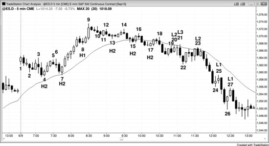

不要在K线计数时忘了核心目标。重点是关注回调本身，而不是盯着高 1、高 2、低 1、低 2 的编号。大多数时候，当市场处于多头趋势或交易区间中时，你要找的是两段式回调后的买入机会，比如图 17.1 中K线 4、7、13 或 17 上方的高 2，但即便如此也不要机械地每个都买。举个例子，到K线 15 有两腿下跌，第一腿是到K线 13 的通道下跌。但K线 15 是连续第四根空头K线，而且两根K线前刚出现过一根强空头趋势K线。另外，第二腿比第一腿小很多，说明下跌可能还没有结束。当一个做多形态存在这些问题时，最好继续等待。

为什么K线 10 不是一个好的高 1 做多建仓形态？因为它出现在一段多头腿末端的买入高潮和最终旗形（K线 8）之后，市场很可能（60%+）会以横盘到下跌的方式回调大约 10 根K线甚至更多，而且会分成两段或更多段。只要市场已经上涨了一段时间，随后出现一根相对较大的多头趋势K线，这根K线就可能代表趋势的暂时衰竭。趋势一旦可能已经衰竭，就不再是强多头趋势，高 1 也就不是一个好的买入建仓形态。同样的道理也适用于K线 11——它同样不是一个好的买入建仓形态。买入高潮之后市场仍处于回调阶段，属于交易区间，在交易区间中于均线上方买入高 2 是高风险的。

K线 17 是一个更好的高 2 做多建仓形态。它处于一段复杂的两段式回调的末端，每一大段又各自细分为两小段；大段之间幅度相近，小段之间幅度也相近，形态很好。另外，虽然事后来看市场已经转为空头趋势，但当时双向交易仍然活跃，仍可视为交易区间，所以买入高 2 是合理的。较大的第二段下跌始于K线 14、终于K线 17，这个高 2 可以从三个角度理解：

- 可以看作高 4；
- 可以看作两段较大下跌腿的高 2，其中K线 13 是第一段结束时的高 1；
- 可以看作两段较小下跌腿的高 2，其中K线 15 是第一段的结束点。

高 1 和低 1 虽然常见，但除非处于最强的趋势中，否则很少构成好的建仓形态。高 1 通常出现在一段腿的顶部附近，只有当这段腿处于多头腿的急速阶段时才值得买入。K线 8 就是一个好的高 1 例子，因为它出现在一段强多头趋势中，连续 6 根多头趋势K线，而且每根K线的实体跟前一根K线的实体几乎没有重叠。几乎所有多头急速阶段的高 1 回调和空头急速阶段的低 1 回调，都属于微型趋势线突破。

类似地，K线 25 和 27 是空头急速阶段中好的低 1 做空建仓形态。当时是强空头趋势、强空头急速阶段，至少到K线 24 为止还没有出现强卖出高潮。有时候，比起用K线计数来命名，用其他方式描述建仓形态更贴切，K线 27 就是一个好例子。没错，它是强空头趋势中的低 1，但有些交易员会担心K线 26 那根强烈的多头反转K线，觉得空头趋势已经不够强、不足以在低 1 做空。他们接下来可能会想，市场是不是开始进入交易区间了——毕竟这是第二次尝试向上反转——于是他们会考虑K线 26 是否其实是一个初始交易区间底部的高 2，而K线 24 构成了高 1。他们仍然会在K线 27 低 1 下方做空，但理由不是因为它是低 1，而是因为他们把它看作空头趋势中一个失败的高 2：K线 26 那根强反转K线之后，高 2 会套住做多的交易员。

由于K线 25 时市场处于强空头趋势，你无法在前一根K线高点上方做多，但你可以在前一根K线（K线 24）高点上方做空，也可以在K线 25 下方加空。

### 对该图表的深入讨论

图 17.1 中的K线 1 试图在大幅高开的日子里形成一个始于开盘的多头趋势，但紧接着下一根K线就告失败，变成了一个多头陷阱（把多头套进了一笔亏损交易）。由于那根空头反转K线曾突破K线 1 的高点后又回落，可以将其视为一个失败的高 1。这样一来，K线 2 就成了一个高 2 做多建仓形态，但经历了那个多头陷阱之后，更稳妥的做法是等两段式回调完成、至少出现一根不错的阳线实体后再考虑买入。而且，下跌到K线 2 的走势形成了一个微型通道，向上突破该通道后大概率（60%+）会出现回调，所以最好等回调出现后再寻找买入机会。不必纠结这种模糊不清的K线计数，而应把注意力放在目标上——找到一个两段式回调来做多。这里有一点值得留意：在很多交易日中，如果当天第二根K线突破了第一根K线的高点后市场又回落，那么第二根K线往往会成为高 2 买入建仓形态中的高 1，你应该准备好在高 2 出现时买入——前提是建仓形态看起来不错。虽然K线 2 的高 2 带来了一笔能盈利的剥头皮交易，但如果K线 2 本身是一根多头反转K线，这个买入建仓形态会更强，尤其是在它的最低价跌破均线的情况下。

K线 20 是一个回调到均线的两段式回调（前面两根K线中的那根多头趋势K线是第一推），因此算是一个合理的做空建仓形态。但两根K线之后，市场在K线 21 处突破了入场K线和信号K线的高点。这形成了一个小的第三推向上，既套住了买入失败的低 2 的多头，也套住了那些因保护性止损被触发、在K线 20 空头信号K线高点上方止损出场的空头。这就是楔形熊旗的一个例子。每当市场位于均线下方，交易员都在寻找做空机会；当多头和空头同时被套时，空头信号成功的概率就会上升。多头会止损出场，他们平掉多头仓位时产生的卖出会进一步推动市场下跌。刚被止损出场的空头这时会恐慌性地追着市场向下做空，进一步加大了抛压。

**图 17.2** 交易区间中的高 1 和低 1 建仓形态

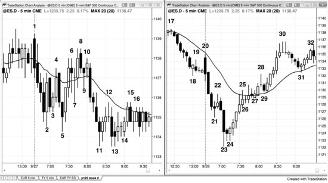

图 17.2 左图中的高 1 和低 1 建仓形态出现在交易区间内，不是好的交易机会。右图中的建仓形态则处于明确的空头趋势和多头趋势之中，属于非常好的建仓形态。不能仅仅因为市场出现了一根强劲的多头急速K线和一个高 1 买入建仓形态就买入；同样，除非存在强空头趋势，否则绝不应该用低 1 做空。

到K线 7 时，市场已经出现了 5 次反转，波动幅度很小，大多数K线与前面的K线重叠。当天处于交易区间，明显不是强多头趋势。从K线 5 的 LL 处开始，两根多头趋势K线形成了一波强劲的急速上涨，突破了K线 4 的 LH。多头希望市场能向上突破、形成多头趋势，这种可能性确实存在，但市场惯性在起作用。趋势倾向于延续，反转通常（60%+）会失败；交易区间倾向于继续横盘，突破尝试通常（60%+）会失败。K线 7 是强多头急速之后的一个高 1 买入建仓形态，但当天是交易区间日，而且它的信号K线是一根十字星，代表双向交易。这是一个糟糕的买入建仓形态，事实上，激进的交易员预期它会失败，用限价单在K线 7 高点及其上方做空。

K线 9 是一个位于均线上方、处于交易区间内的高 2 建仓形态，因此大概率（60%+）会失败。

K线 11 是空头急速中的第四根空头趋势K线，突破了当日新低。但当天是交易区间日。虽然它有可能演变成趋势日，但目前还不是，因此在当日最低点出现的低 1 大概率（60%+）会失败，尤其是信号K线还是一根十字星。激进的多头在K线 11 的低点及其下方买入，预期空头会被套住。

把这些建仓形态跟右图中的做个对比。右图中市场处于始于开盘的趋势，由三根大的空头趋势K线组成，影线很短、K线之间几乎没有重叠，而且远远跌破了前一日的低点。这是一个清晰、强劲、充满紧迫感的空头趋势。K线 22 是一根单K线回调，交易员积极地在这个低 1 做空建仓形态下方做空。事实上，交易员对市场会跌破急速阶段低点的信心非常强，很多人用限价单在K线 21 高点及其上方做空。

之后又出现了一波卖出高潮，打到了当日最低点。卖出高潮之后往往跟着一个两段式回调，有时甚至是趋势反转。六根多头趋势K线拉出了一波涨到均线的反弹，这些K线之间几乎没有重叠，实体大、影线短。买盘的紧迫感很强，所有人都在等这波可能的新多头趋势中强多头急速的回调。K线 26 处出现了一根暂停K线，形成了一个不错的高 1 做多建仓形态。

到K线30，又出现了一段6根K线的急速上涨，随后到K线31形成了一段6根K线的回调，回落至均线附近。这里出现了一根多头信号K线，再次构成一个有效的高1做多建仓形态。

**图 17.3** K线计数有时很难

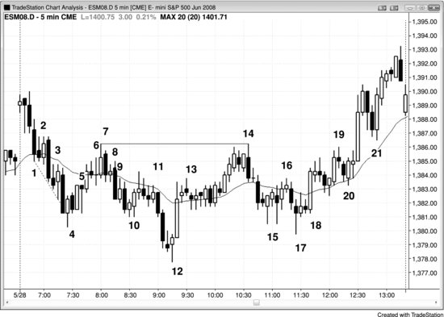

图17.3展示的这一天虽然计数困难，但交易起来其实相对容易，图中体现了回调腿计数的许多细微之处。当第一腿下跌非常陡峭，修正只持续两三根K线（比如到K线2的暂停），接着又只用了一两根K线就形成了高2建仓形态（比如K线3），此时不会有任何有意义的趋势线被突破，所以不应该去买高2。风险太大——市场很可能（60%以上的概率）正处于一段空头趋势之中，而非交易区间或多头趋势中的回调，因此不应该寻找高1和高2的做多机会。

尽管市场已经做了两次向上的尝试，但第一次力度太弱。在做多之前，你始终需要看到市场展现出一定的力量，否则就应该假设市场仍处于第一腿下跌之中。如果K线3之后的那根K线突破了K线3的高点，算是一个激进的做多入场点，但如果第一腿下跌之后的反弹（即高1）力度更强，做多效果总会更好。

市场有时会再次下跌，在穿越趋势通道线后向上反转，形成一个高3。这就构成了一个楔形反转（三推加上趋势通道线的失败突破），K线4正是这样的建仓形态。注意，K线2和K线3都没有突破各自前一根K线的高点，但它们各自实际上都结束了一小段下跌腿。在1分钟图上，几乎可以肯定能看到清晰的下跌腿和小幅修正反弹，对应着这些5分钟多头趋势K线。

K线4是高3的做多入场K线，但同时也是一根空头趋势K线。由于它只是上涨腿的第二根K线，而楔形底部之后的反弹通常（60%以上的概率）至少会有两腿上涨，所以它并不是一个好的低1做空建仓形态。记住，所有这些反转尝试，只有在之前突破了一条更长更强的趋势线之后才更可靠。如果前一腿没有突破任何有意义的趋势线（比如K线2的反转尝试），那么下一腿的反转尝试就缺乏说服力（比如K线3），你应该等待更多价格行为的确认——比如K线4的楔形底部——再考虑做多。

K线5既可以看作低1，也可以看作低2，但当市场正从一个高潮底部向上修正时（楔形属于高潮的一种），应该给市场留出横盘或向上修正的空间，然后再考虑做空。对于怎样的修正才算充分，没有严格的规则，但一般来说修正应该有两条清晰的腿，K线数量至少达到楔形的一半左右。这段下跌同时也是一个急速与通道的空头趋势，所以上涨腿应该测试到接近通道起点K线2附近的位置。

严格来说K线6是一个低2，但由于在低1处没有突破任何有意义的多头趋势线，不应该在这里做空。市场仍处于窄通道之中，所以不应该寻找低1或低2的做空机会。通道在延伸过程中可以有很多次回调，但通常（60%以上的概率）至少要经历三腿之后才会出现突破和反转。K线7是第三次上推，它是均线测试处的二次入场做空机会，与K线2（通道顶部）形成了双顶，同时也是一个两K线反转形态的第一根K线。在随后那根空头K线下方做空是一笔合理的交易。不过，从K线6开始市场一直处于窄幅交易区间，所以大多数交易员不应该在这里交易，应该等待突破之后再寻找交易机会。

K线8是一个高1，但它出现在弱反弹顶部连续6根横盘K线之后，而不是出现在一段强劲的多头急速上涨之中。

K线10也是交易区间底部一根多头K线上方的高2入场点，是一个可以接受的做多入场。

虽然K线11是一个高1的变体（因为它没有突破前一根K线的高点），但同时也是均线下方的低2做空建仓形态。低1建仓形态出现在两根K线之前的两K线反转处，那个形态同时也构成了一个失败的高2（K线10是高2的入场K线）。这是第二次试图让K线10的高2做多失败，大多数在K线10上方买入的交易员会在这第二次失败时选择出场。这就是均线下方的低2做空之所以有效的原因之一：这恰好是那些过早做多的人会出场的位置。他们卖出平仓时会增加抛压，而且至少在接下来一两根K线内不会再买入。

K线12是一根多头反转K线，也是一个高2（K线11是高1）。当天走势偏安静，K线12又是日内新低，这种条件下至少做一笔剥头皮的概率很高。如果之前没有高1出现，下跌过程中会有大约6根趋势性空头K线，交易员就得等到突破回调（也就是二次入场点）才能考虑做多。K线12大致处于一个较大的两段式回调的测量移动终点，第一段在K线10结束；同时也处于一个更大的测量移动终点，这个测量移动从日内高点开始，第一段在K线4结束。最后，K线12还是空头趋势通道线过冲后的向上反转。图上没有画出这条线，但它锚定在K线10前一根K线的低点，是从K线7引出的空头趋势线的平行线。

K线13可能是窄交易区间的起点，因为它已经是连续第三根小十字星了。再过两根K线，窄交易区间就很明显了，所以大多数交易员不应该再用K线计数来寻找建仓形态。不过，有经验的交易员可以把K线13看作一个向下的推动，之后四根K线中的两根空头K线分别是第二和第三个推动；这样一来，这个窄交易区间就可以视为楔形牛旗（第18章会讨论），然后寻找突破后的做多机会，预期K线12的强多头急速之后会出现多头通道。由于这一天基本处于交易区间内，而这个窄交易区间又位于日内区间的中部，K线计数并不可靠。但既然刚刚出现过一波强急速上涨，在多头趋势K线上方做多仍然是合理的，不管K线计数是多少。

K线14是一个低2，结束了第二段上涨，K线12的急速上涨是第一段。它同时与K线7构成双顶熊旗，是第二次冲击日内高点的失败尝试。在无趋势日中，双顶熊旗出现后，应该预期两段下跌。第一段在K线15的高1处结束，之后又有两小段上涨，在K线16的低2处终结，正好在均线附近。

第二段下跌在K线17的高2处结束，但K线17是一根空头趋势K线，前面也是一根空头趋势K线，而且到K线15的第一段下跌非常强劲。做多仍然有效，但这种不确定性让交易员选择等到K线18的高2才获得二次入场机会。之所以出现这个二次入场点，是因为有足够多的交易员对第一次入场不放心，选择等待第二个建仓形态。这也是一个基于实体的ii形态变体。后面的章节会讲到，这还是一个双底回调做多建仓形态。K线17与K线15前一根或后一根K线形成双底，K线18前面的横盘K线就是回调。

K线19处的低2出现在强劲的上涨动能之后，做空仍然有效。但它在K线20处产生了一个5 tick的失败（后面会详细说明：意思是从K线19开始的下跌只走了5个tick，很多空头还没拿到剥头皮者的利润就被套住了）。

K线20形成了一个失败的低2，套住了空头，因此是一个好的做多入场点，尤其是之前上涨动能强劲。失败的低2出现后，通常 (60%+)后面会跟一个低3楔形或低4。它同时也是均线上方、交易区间内的一个高2，但市场正处于多头急速与通道趋势的通道阶段，所以这是一个顺势做多建仓形态，尽管价格仍在交易区间顶部下方。急速与通道趋势在第一册趋势部分的第21章讨论。

K线20的多头急速上涨非常强劲，可能 (60%+)至少还有两段上涨，所以在K线21的高1处买入是一笔可靠的交易。这一段下跌有可能演变成两段式回调，出现一根低点低于K线21低点的K线（形成高2做多建仓形态），但概率不大——上涨力度实在太强了。

**图17.4** SDS有助于分析SPY

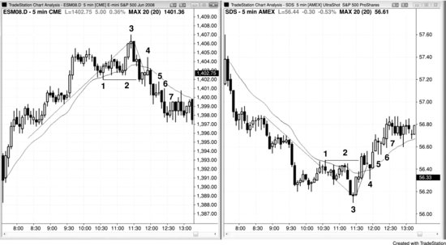

图 17.4 左侧是 5 分钟 Emini 图表，右侧是 5 分钟 SDS 图表。SDS 是一只与 SPY（可视为 Emini 对应的 ETF）方向相反、杠杆为 2 倍的交易所交易基金（ETF）。在 Emini 图表上，K线 1 处多头趋势线被跌破，随后K线 3 创出更高高点并测试了前期趋势高点，K线 5 处形成了一个高 2 买入信号。这是一个概率较高（60%+）的趋势反转。向下的动能很强，K线 4 处的高 1 信号很弱——价格短暂刺穿了从K线 3 高点画出的微型多头趋势线，随即反转下跌，说明多头很弱而非很强。除非K线 5 的高 2 展现出极强的力度，比如出现一根强多头反转信号K线、且前面没有连续两根空头急速K线，否则在这里买入并不明智。而且信号K线太大，迫使交易员在弱势市场中高位买入；信号K线还是一根十字星，几乎完全被前面两根K线（都是空头趋势K线）包裹在内。

当 3 根或更多K线大量重叠，且其中至少一根是十字星时，最好等待更多价格行为再决定是否入场。多空双方处于均势，任何突破都可能（60%+）失败（就像K线 5 处的高 2 买入信号那样），你绝对不应该在其高点上方买入突破——尤其是在一段空头腿中，更何况大多数交易区间是顺势的，而前一段腿是向下的。

当你拿不准一个信号是否足够强时，换个角度看图表会有帮助，比如切换到柱状图或反转图表。一般来说，只要你觉得还需要进一步研究，这本身就说明信号不够清晰、不够强，因此不该入场。

即便你在 Emini 图表上想买那个高 2，看看右边的 SDS 图表就知道，几乎没人会在K线 5 的低 2 处做空，因为向上的动能太强了。这两张图本质上互为镜像——如果你不会在 SDS 上做空，那你也不该在 Emini 上买入。

注意 Emini 上K线 7 是一个高 4，通常这是一个可靠的买入信号。但在高 1、高 2、高 3 都没有展现出任何多头力量的情况下，不应该入场。单靠K线计数是不够的，你还需要之前有相对强劲的上涨走势，至少突破一条次要趋势线，才能作为多头力量的依据。这里的高 4 实际上由一段向下的急速加上一个楔形通道构成（K线 4、5 和 7 构成了三推下跌的终点）。

注意更早之前存在一段强多头趋势，在那段趋势中，低 2 做空都是糟糕的交易，直到市场跌破多头趋势线之后才适合做空。虽然没有出现猛烈的下跌急速，但市场横盘了大约 10 根K线，说明空头有足够的力量在较长时间内压制多头。空头展现出的这种力量，是交易员敢于在K线 3（当日新高）处做空最终旗形突破的必要前提。

K线 4 在 Emini 图表上是一个可以接受的微型趋势线做空入场，尽管当天一直是多头趋势日。K线 3 创出更高高点、形成最终旗形之后，你需要考虑趋势可能（60%+）已经转空。这种反转之后至少应该出现两段空头腿——多空双方都会预期如此。而且入场点在均线上方，这正是你在低 1 信号K线下方做空时希望看到的条件。

一旦市场看起来进入了空头趋势且向下动能良好，你可以在高 1、高 2、高 3、高 4 处用限价单在前一根K线高点或高出几个 tick 的位置做空。K线 4、5 和 6 就是这类做空的入场K线示例，同时它们也是信号K线——可以在它们低点下方 1 个 tick 处加仓做空。

**图 17.5** 失败的低 2 往往演变为低 4 做空

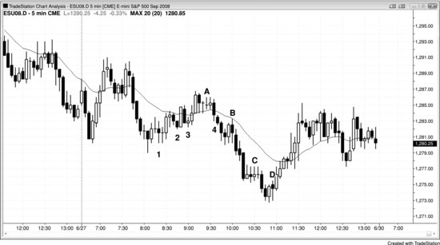

图 17.5 中，K线 2 是一个失败的低 2，因此可以预期还会有一到两段上涨腿。虽然K线 2 上方的突破不算强，但向上的通道太窄，不适合在低 3 处做空。最终一个低 4 结束了这段空头反弹，另一个低 4 结束了跌向当日低点的下跌。K线 A 处的高 1 出现在前一段腿的低 4 之前，这不影响判断。

K线 1 是一个微型趋势线低 1 做空信号，足够做一笔剥头皮交易。但太平洋时间上午 8:00 出现的那根小十字星，以及低 1 做空的十字星信号K线，意味着市场可能（60%+）正在形成窄幅交易区间。这使得该交易风险较高，可能（60%+）不入场更为稳妥。

K线 B 是低 1 做空的好例子：价格在一波强力跌穿均线之后回调至均线附近。同时它也是一个微型趋势线突破失败做空。

**图 17.6** 失败的低 4

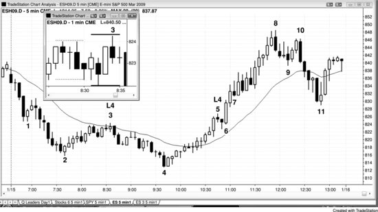

图17.6展示了两个失败的低点4做空案例，其中有几点重要的观察值得留意。K线3触发了低点4的做空入场，其建仓K线是一根小十字星。遇到这种情况，止损一定要放在信号K线高点上方2到3个tick的位置，因为市场经常会在你做空入场后迅速冲到信号K线高点上方1个tick处来扫止损——这里就是如此。看1分钟图的嵌入图：5分钟信号K线由虚线之间的五根1分钟K线组成，入场K线由实线之间的五根1分钟K线组成。可以看到，市场在入场K线的第二分钟触发了做空，但在第四分钟冲过了信号K线高点1个tick，然后才下跌到K线4。

第二个低点4由K线5的建仓形态触发。上涨到K线4的这波走势几乎全是多头趋势K线，而且此时K线4已经形成了一个更高的低点，并且价格已经突破了一条主要空头趋势线。趋势已经转为多头，你不应该再寻找空头回撤建仓形态，也不应该再做空低点1、2、3或4——这些都是交易区间和空头趋势中的建仓形态。尤其是从K线4开始的上涨过程中没有任何空头力量的迹象（比如突破多头趋势线），就更不应该做空。实际上，你不该找反转做空，而应该等回调做多，甚至可以在K线5低点处或更低位置挂限价单买入。看看低点4在入场后第一根K线就失败时发生了什么：正如预期，所有人终于接受了这是多头市场的现实，市场一口气飙升到K线8，涨幅大约等于K线4到K线5的高度（也就是整个低点4形态的测量移动目标）。这次突破在突破点高点（K线5的高点）和突破回调（K线7）之间形成了一个测量型缺口。这类测量型缺口在第6章关于缺口的部分有详细讨论。

注意K线7是三推下跌反转的第一推，因此对于后续任何上涨之后的回调来说，它都是一个磁力位。K线7也是失败的低点4上方两根K线突破急速走势之后多头通道的起点。从K线7到K线11的两段式下跌（伴随着多头趋势线的突破以及K线10的更低高点）跌破了前面三根空头反转K线的低点——这种情况很常见。面对如此强劲的上涨，很难相信市场会跌回那些位置，但如果你懂得解读价格行为，市场不跌回去反而更让你意外，尤其是在那样一波高潮式的拉升之后。K线7之后形成了一段窄幅交易区间，但大背景仍是强多头市场。虽然窄幅交易区间让数K线变得不太可靠，但因为多头趋势很强，交易员应该在多头K线上方寻找买入机会，保护性止损放在信号K线低点下方。

顺便说一下，K线7和紧随其后四根K线中的两根空头反转K线构成了三推下跌。当这个三推形态被两根多头趋势K线向上突破击败后，楔形上方又出现了一个测量型缺口，并形成了向上的测量移动，当天的高点超过了测量目标几个tick（失败的楔形经常会产生测量移动）。

K线8之后两根K线处有一个高点1买入建仓形态，虽然它处于一波强多头急速走势和多头趋势之中，但出现在一波买入高潮之后，所以不是一个好的买入建仓形态。当时市场正处于K线6两根K线多头急速走势之后的抛物线式多头通道中。

**图17.7** 多头趋势中的低点2不能做空

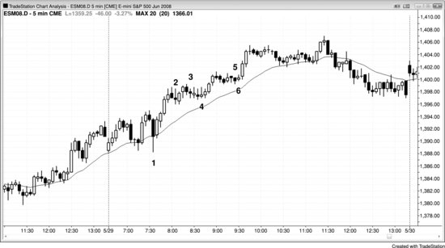

在没有先突破一条强趋势线的情况下，仅凭低点2建仓形态不足以做逆势交易。事实上，这种交易几乎总会失败，然后反而变成一个很好的顺势入场机会，比如高点2买入——图17.7中K线4和K线6的走势就是这样。低点2是交易区间或空头市场中的建仓形态，在多头趋势中绝不适用。这里是多头趋势，交易员不应该去找低点2建仓形态。要做空一个强多头趋势，首先需要看到空头已经表现出积极进攻的意愿。你应该等他们第二次尝试打压市场时再考虑做空，而不是第一次，因为第一次尝试通常会失败。当多头趋势非常强的时候，你甚至可以考虑在前一根K线低点下方挂限价单买入，预期任何低点1或低点2都会失败。比如，你可以在K线2前面那根反转K线的低点下方挂限价单买入，或者在K线5跌破前一根K线低点时买入，预期低点2会失败。一般来说，在前一根K线高点上方用止损单买入更安全；但当多头趋势很强时，几乎在任何时候、以任何理由买入都是合理的。在前一根K线低点下方买入也说得通，因为你必须预期大多数反转尝试都会失败。

到K线4时，市场已进入窄交易区间，K线计数变得混乱。这时候应该放弃计数，既然多头趋势这么强，只需要在任何一根多头趋势K线上方用突破单做多就行，比如K线4之后那根K线。

**图 17.8** 失败的低2

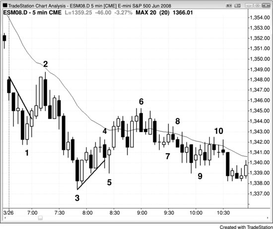

如图17.8所示，当天以缺口下跌突破开盘，随后出现突破回调，在K线2处均线下方形成了双顶，接着又创新低。到这个时候，交易员还无法确定向下的两段走势是在K线3就结束了，还是后面还会有更多下跌腿（第一段是从前一天收盘跌到K线1）。虽然K线4的低2做空达到了剥头皮者的利润目标，严格来说不算失败，但趋势线被跌破后又反转向上，说明市场可能（60%+）会表现得像一个失败的低2——至少还会再上涨两段，然后尝试形成一个低4做空建仓形态。

K线4的低2做空存在几个问题。第一，它出现在趋势线突破（上涨到K线2的那段反弹）之后，意味着K线3可能（60%+）就是当天的低点——在这种位置做空很不利，因为日内高低点通常（60%+）在开盘后一小时左右就形成了。第二，这个低2离均线太远，不算一个好的均线测试。正常来说，第二次测试均线应该比第一次更接近均线或者穿透得更深，而K线2的第一次测试明显更接近均线。很多交易员不愿意顺势入场，除非回调触及均线或者距离均线只差一个 Tick 左右。如果反转在触及均线之前就开始了，那些本来可能做空的交易员就不会入场，市场也就缺少了他们卖出时本可以提供的下跌燃料。

K线6形成了低4建仓形态，也是第二次推到均线上方。不过这段反弹有很多重叠的K线和好几根十字星，说明多空双方力量比较均衡，大幅快速下跌不太可能（≤40%）出现。所以对于偏好高概率、大盈利空间的交易员来说，这里可能不值得交易。怎么办？要么耐心等待更多价格行为，好的建仓形态总会出现；要么做空，但要做好准备应对回调，比如入场后下一根K线就出现反弹的情况。

K线9是连续第五根重叠的K线，市场已经进入窄交易区间。在窄交易区间里做K线计数太不确定了，大多数交易员不应该基于计数来交易，要等突破之后再说。

**图 17.9** 失败的低2可以演变成低3或低4

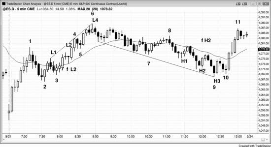

失败的低2可以演变成楔形顶部（低3）或低4顶部，取决于低2失败后向上的动能强度。有时候它甚至可以直接演变成多头趋势。图17.9中，低2失败后的突破由两根实体大、影线短的多头趋势K线完成，从K线3开始的上涨走的是窄通道。这个通道跟在开盘到K线1那段非常强的急速上涨之后。而且低2只走了一根K线就反转向上。多头动能这么强，在K线5的 ii 形态下方做空风险太大。预期这个低2会失败是合理的，因为它处于多头通道的早期阶段，而通道经常出现回调把交易员套在错误方向上。从通道的紧密程度、多头趋势K线的数量、以及相邻K线之间缺少大幅重叠来看，到目前为止多头的力量很强。这些都是稳固多头通道的特征，所以低2应该预期会失败。

虽然市场没有跌破K线5去触发低3，但这里仍然是从K线2算起的第三次上推，所以起到了和低3同样的作用。既然突破的动能很强，应该预期还有两段上涨。K线6前面那根K线略微刺穿了趋势通道线并且收阴，K线6再次测试了这条线。这是一个合理的低4做空建仓形态，至少可以预期向下走两段。

当天稍晚，一个高 2 做多建仓形态失败了，但市场并没有继续下跌到高 4，而是在高 3（一种楔形）之后就转头向上。从高 1 和高 2 起步的上涨各持续了好几根K线，说明多头具备一定力量。虽然高 2 失败后的向下突破力度很强，但那实际上是一个衰竭性的空头高潮。空头急速下跌中K线实体逐根放大，这本身就是衰竭的迹象，而且下跌恰好发生在趋势通道线附近、K线 2 低点的区域。K线 2 是多头通道的起点，天然就是一个磁力位，市场预期会回来测试这个位置——这里正是如此。测试完成后，市场通常至少会反弹到正在形成的交易区间高度的 25% 左右。由于截至K线 9 的三根空头急速K线代表着强劲的空头动能，市场仍有可能再走出至少一段下跌腿。但因为出现了空头高潮，概率更倾向于至少出现两段横盘到上涨的走势。因此在K线 10 的 HL 位置买入是一笔胜率不错的交易，尤其是在测试了K线 2 多头通道底部之后，市场大概率会尝试构建一个交易区间。

### 本图深入讨论
如图 17.9 所示，当天开盘后出现了一个失败的突破——向下跳空突破后随即反转上涨。先是一根强多头趋势K线构成急速阶段，然后沿着窄通道上行至K线 1；这整段走势在更高时间周期图上很可能就是一个多头急速阶段。动能这么强的时候，概率上倾向于回调之后至少还有第二段上涨腿，所以等市场回落到K线 2——即多头通道起点附近时，寻找做多建仓形态是合理的。

这一天同时也是始于开盘的多头趋势日，K线 2 是第一次回调的做多建仓形态。K线 3 则是K线 1 到K线 2 牛旗突破后的突破回调做多建仓形态。

交易者把从K线 6 开始的整段下跌视为多头趋势中的一次回调。高 2 有可能就是底部，但还不太确定。不管怎样，交易者都在寻找买入机会。还要注意，从K线 6 高点往下的每一个新低都很快被反转了——买方一路逢低买入，因此整个下跌过程中买压始终存在。虽然高 2 失败后的下跌很猛，但那是三根实体递增的空头K线，构成了一个小型空头高潮。交易者可以在K线 9 上方买入，假设K线 9 的低点能守住（楔形低点），但更稳妥的做法是等回调出现，也就是在K线 10 的 HL 位置买入。这笔交易带来了一波持续到收盘的强势反弹，开盘以来的多头重新开始买入。

**图 17.10** 高 2 变体

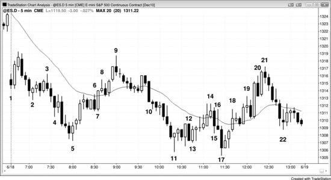

在图 17.10 中，K线 16 是一根十字星，上影线很长，说明市场在这根K线内经历了先涨后跌的过程。那段上涨就是第一段下跌腿的结束，因此K线 17 应该发挥类似高 2 的作用——实际走势也确实如此。

K线 12 是均线下方的一个低 2 做空建仓形态，但市场已经开始形成交易区间，所以这个做空信号并不可靠。实际上在K线 12 的低点买入反而更合理，不过这种操作只适合经验丰富的交易者。每当均线下方出现卖出信号，而信号K线又很大、与前面两根或更多K线大幅重叠时，说明市场正处于一个小型交易区间中，在区间底部做空通常是亏钱的策略。

### 本图深入讨论
图 17.10 中，当天以大幅向下跳空开盘，本身就构成了一个空头突破。虽然K线 1 是一根空头趋势K线，但它仍然有可能是始于开盘的多头趋势日的第一根K线，只不过相比以多头趋势K线开场，这种可能性要低一些。交易者在K线 1 高点上方买入，押注失败突破后的反弹。反弹只走了两根K线就结束了，空头随后在第二根阳线下方做空——也就是在两K线反转的低点（那根空头入场K线的低点）做空，交易突破回调做空，同时押注可能出现始于开盘的空头趋势日。大幅向下跳空更容易演变为空头趋势日，交易者应该尽量抓住所有合理的做空建仓形态去做波段下跌。

K线 4 是当天的第三推下跌，但它是空头急速阶段的第三根K线，因此作为做多的信号K线并不可靠。交易者应该等突破发生后再等回调，然后再做多。下一根K线是一根多头趋势K线，与K线 4 一起构成了两K线反转，但市场并没有向上突破这两根K线的顶部，反而向下突破了。K线 2 之前的三根空头K线有足够的动能，许多交易者会重新开始计数，把K线 2 当作第一推下跌。

K线 4 形成时，一部分交易者认为它是第三推下跌，另一部分认为只是第二推，谁也不知道哪边的判断正确。拿不准的时候，别急着入场，等第二次信号出现再说。

K线5是一根多头反转K线，也是两K线反转的第二根K线；同时它是从K线2空头急速开始的通道中的第三次下推。急速阶段往往构成第一次下推，这里就是如此。到这个位置，做急速与通道多头买入的交易者预期市场会有两段式上涨；而从K线2急速重新计数楔形的交易者，也在这第三次下推处买入。那些在考虑K线4是否为第三次下推的交易者，则把K线5看作一个更低低点突破回调。所有交易者此时都认为这些因素叠加在一起，出现两段式上涨的概率不错。

K线5之后出现了一波四根K线的多头急速，上涨到均线附近，这可能就是第一段上涨的终点。

K线6是一个低2做空建仓形态，但既然第二段上涨有较大概率（60%以上）会出现，不如放弃做空剥头皮，转而寻找更低高点做多建仓形态或这个牛旗的突破。K线6及其前面两根K线都是空头趋势K线，形成了两小段下跌，因此K线6高点上方构成了一个高2买入建仓形态。

K线8是一根小十字星，但它可能是一个最终旗形做空建仓形态——对应K线6结束的那个四根K线牛旗的失败突破。不过，从K线5到K线8的上涨走势处于一个相当窄的多头通道中，所以K线8是否是第二段上涨的终点并不确定。拿不准的时候，等第二次信号。K线8之后那根K线是空头趋势K线，对于做空的人来说是一根不错的入场K线，但他们会在这根空头趋势K线高点上方买回空单。很多交易者在K线6上方做多，因为空头被套，而且这也是一个失败的低2——K线6是第一次下推。

K线9是一根空头反转K线，是第二次信号的均线缺口K线（K线8是第一个建仓形态），也是一个空头楔形的顶部。从K线5开始的急速上涨是第一次上推，K线8是第二次上推。楔形反转通常至少有两段下跌，这里也不例外：第一段到K线11结束，第二段到K线17结束。从K线5楔形底部寻找两段上涨的多头，看到从K线5的急速上涨是第一段、从K线6底部开始的通道上涨是第二段，预期已经满足。

K线10之后的三根K线试图与K线7（多头通道底部）形成双底，但失败了。

K线10是一波空头急速，随后市场以高潮通道的方式下跌到K线11。

K线11是一根十字星，但它跟在K线9之后的急跌后面，由于空头动能较强，市场有较大概率（60%以上）先横盘整理一段，然后才会反转上涨。

K线12是一个低2做空建仓形态，但信号K线太大，而且与前面三根K线高度重叠，所以这很可能（60%以上）是个空头陷阱，不是一个好的做空建仓形态。低2失败后引发了一波六根K线的多头急速，上涨到K线14，但相邻K线之间重叠很多，上涨走势处于一个非常窄的通道中。虽然通道斜率向上，但通道越窄，向下突破后走不远的概率就越大，市场会被拉回到通道区域内。所以这可能是一个最终旗形，而那可能带来一次多头反转。

市场急速下跌到K线17，K线17是一根大的空头趋势K线，构成一个卖出高潮。

紧随其后的多头内包K线是一个不错的建仓形态，至少预期两段式上涨，依据包括：最终旗形反转、当日第三次下推（与K线5和K线11一起构成了一个大楔形牛旗），以及第二次尝试从跌破K线5开盘低点处反转上涨。

K线17也是一个缩梯形态——它跌破K线11仅2个tick，而K线11跌破K线5有6个tick。这说明空头趋势正在失去动能。

K线19是一个低2建仓形态，但向上的动能太强，信号K线也太弱，不适合做空。入场K线是一根强空头趋势K线，但市场随即反转上涨。敏锐的交易者会预期低2失败，他们在这根空头入场K线上方做多。

K线20是从K线17低点开始的第三次上推，虽然是一根强空头趋势K线，但做空并未触发。市场又推了一波到K线21，随后的下跌反转被一些交易者看作低4，另一些交易者看作楔形顶（K线18是第一次上推，K线19是第二次上推），还有一些交易者把它看作一个大的低2——K线14是第一次上推。

**图 17.11** 高2变体

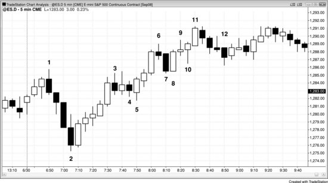

在图 17.11 中，K线3和K线4在一波多头波段中形成了两段式回调，尽管K线3之后那根K线才是上涨段的终点。因为这是一个两段式回调，所以K线4就是一根高2做多信号K线。

K线7是空头趋势K线，作为高1信号K线并不可靠。但K线8与K线7构成了两K线反转，在K线8这根多头趋势K线上方买入，成功率远高于在K线7上方买入。虽然有些交易员把K线7视为K线3第一腿上涨之后的低2入场，但前面这波上涨非常强劲，很可能已经进入多头趋势，因此在此做空低2是一笔低概率交易。

K线8既是一个失败的低2做空建仓形态，也是高1做多入场。

有些交易员会在K线9下方做空，但多头通道太陡，信号K线又太弱，不适合在这个位置做空。

K线10是高2做多（K线8是高1），因为当天高点处出现了两次下压尝试（K线7和K线10）。连续两次向下尝试等同于两段式回调，因此构成了高2做多建仓形态。它同时也是一个失败的低2做空建仓形态，被套空头可能会在K线10上方回补空单。此外，从K线8信号入场的空头，有些或许能容忍一次上推，但几乎所有人都会在出现第二次上推时选择平仓。这正是高2做多建仓形态在多头趋势中如此可靠的原因之一。

有些交易员把K线12看作高1做多建仓形态，也有人看作高2做多建仓形态——前面那根十字星代表第一小段下推的结束。但截至K线11的上涨是一个楔形通道，可能会出现两段式横盘或向下的回调，因此在这里买入并非高概率交易。K线12突破了多头趋势线，后续可能出现更低高点或更高高点；无论哪种情况，空头都可能寻找机会在反弹中做空，至少做一笔剥头皮交易。

以上分析都比较粗略，但目的很重要。交易员需要寻找两段式回调，因为它们能提供优质的顺势入场机会。同样重要的是，不要在多头趋势中寻找低2做空建仓形态。

**图 17.12** 低2变体

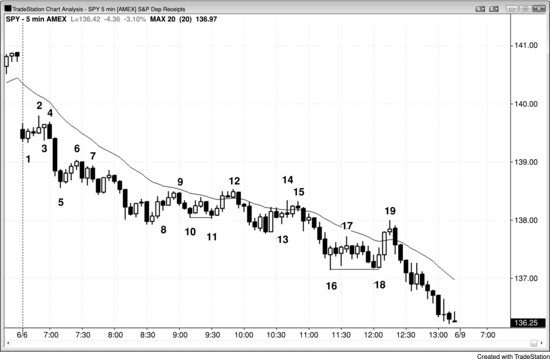

图17.12所示的SPY图表展示了低2建仓形态的多种变体。仔细思考每一个变体，都是两段式空头回调的合理终结点。这张图表明显偏空（价格位于下降的均线下方），交易员一直在寻找做空机会，因此任何看起来像低2的形态都足以作为入场依据。

K线3是低1，K线4突破了K线3的高点，构成第二次上推尝试，形成低2做空建仓形态，在下一根K线触发入场。

K线6是低1建仓形态，两根K线之后出现了一根多头趋势K线，标志着一段上涨腿的开始。K线7是做空的信号K线，在下一根K线入场。尽管入场价低于低1的入场价，但这仍然是一个两段式回调。

K线8是上涨回调中的一根小型空头内包K线，构成了一个微小的回调，结束了第一腿上涨。K线9出现在又一根（实际上是两根）多头趋势K线之后，是第二次向下的尝试，实际上构成了均线附近的低2做空。

K线11低于K线10，因此它是截至K线12这段上涨的起点。为什么K线12之后那根K线是低2？K线12这根多头外包K线的低点在开盘后不久曾跌破前一根K线的低点，虽然从这张图上看不出来，但在1分钟图（未展示）上可以确认。这使得K线12本身就是低1。外包K线会同时突破前一根K线的上下两侧，你无法确定它先突破了哪一侧，不过实体方向通常是可靠的参考（比如多头实体通常意味着向上突破发生在后面，因为收盘方向朝上）。K线12之后那根K线跌破了K线12的低点，这是从K线11开始的这段上涨中，第二次出现K线跌破前一根K线低点的情况，因此构成了均线附近的低2做空。K线12也可以从另一个角度理解为低2做空建仓形态：K线9是第一次上推，K线12是第二次上推。

K线13是低1做空入场K线（也可看作低2，其中三根K线之前的那根空头K线是低1），但在两根强多头趋势K线之后，这笔交易风险太大，因为可能还会有更多的上涨回调。

一旦第二腿上涨出现（K线14创出更高的高点，明显是一个小型第二腿），任何低点跌破前一根K线低点的K线都构成低2做空。K线15成为低2做空信号K线，尽管它是低于两腿上涨高点的一个小型波段高点（在预期至少会有两腿下跌的结构中，它是一个更低高点）。此外，正如下一章所讨论的，K线15也可以看作基于三次上推的楔形熊旗入场：K线14是第三次上推，K线13之前的两根多头趋势K线是前两次上推。

K线 17 是一个低点 2 做空建仓形态，但它前面出现了两根带长影线的多头反转K线，说明多方已经开始在这个区域买入。这使得在此处做空风险很高——K线下方的买盘大概率强于卖盘。你越确定市场处于窄幅交易区间，K线计数的可靠性就越低。一般来说，在窄幅交易区间里最好不要依据K线计数来交易，除非你对自己的计数非常有信心——也就是说，计数足够清晰，值得据此下单。

K线 18 与K线 16 构成双底，同时也是一个高点 2，依据是从K线 17 开始的两次小幅下推。

### 对这张图表的深入讨论
如图 17.12 所示，当天大幅跳空低开，因此构成一个空头突破。第一根K线是空头趋势K线，有可能成为当天的最高点，所以是一个可以接受的做空建仓形态。不过市场随即在下一根K线反转上行，形成一个失败突破做多建仓形态，当天本来有可能发展为始于开盘的多头趋势日。但大幅跳空低开仍然对空方有利，除非多方以一根强势多头急速K线加跟随明确夺回市场控制权。

一旦市场跌破K线 2，当天就同时出现了一次向下的急速和开盘第一根K线之后的一次向上的急速，而此时日内波幅还不到近期平均日波幅的三分之一。这使得开盘区间进入突破模式，有可能发展为趋势日。交易员在当日高点上方挂买入突破单做多，同时在K线 1 低点急速下方挂卖出突破单做空。跌破K线 1 的那根大阴趋势K线体现出交易员做空的力度之大。这波抛售可能（60%+）与太平洋时间上午 7:00 的一份报告有关。不过更大的可能（60%+）是机构早就计划好今天要做空，不太可能（40% 以下）是它们的大客户听到利空报告后突然打电话要求卖出。机构本来就想做空，只不过寄望于报告发布时市场能拉一波，好让它们在更高的价位空进去。报告出来后它们意识到拉升不会出现，于是在报告发布后立刻开始做空，并且一路空到收盘。

K线 18 是窄幅交易区间之后空头趋势K线突破的末端，由于窄幅交易区间的磁力效应，市场大概率会反转上行——窄幅交易区间经常演变为最终旗形。

K线 19 是空头趋势中第一根均线缺口K线，因此是一个好的做空机会。它也是空头趋势日最后一两个小时经常出现的空头陷阱的典型例子。它出现在一根强势多头急速K线的顶部，这根K线突破了K线 17 的波段高点，把多方套进去、把空方套在场外。所有多头急速都是高潮也是突破，有时它们会失败，导致向下反转而非向上持续。当这根急速K线形成时，那些害怕错过一次大反转的情绪化交易员会在第二根多头趋势K线形成时买入，在它突破K线 17 的更低高点时买入，在它以最高价收盘时买入。强势空方只是暂时退到一边，任由多方去冲。这些空方知道，收盘前出现一次多头反转尝试的概率很高，他们就等着一根强势多头趋势K线出现。一旦看到了，他们判断市场不会在那个位置撑多久，于是果断做空。因为空方和多方都清楚今天是空方主导的一天，空方有信心能够再次把市场推向新低。多方则从做多仓位中剥头皮出场，因为他们认为这次向上反转不具备强势多头反转的充分条件。之前没有出现过对空头趋势线的强力突破，而且全天任何时刻市场都未能站稳在均线上方。

**图 17.13** 急速与通道是两段式运动

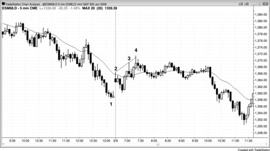

如果回调以急速与通道的形式展开，急速可以视为第一段上涨，通道则是第二段。在图 17.13 中，跳空高开到K线 2 的那段是急速，也是三次上推中的第一次。多头通道在回调前通常还会再推两次，整个形态在这张图上构成了一个楔形顶。大多数形态都可以有多种解读方式，有些交易员依据其中一种来交易，另一些交易员则更倚重另一种。上涨到K线 4 的这段走势，一些交易员将其视为楔形顶，另一些交易员则将其看作两段式回调——跳空急速到K线 2 是第一段，两段式通道到K线 4 是第二段。
