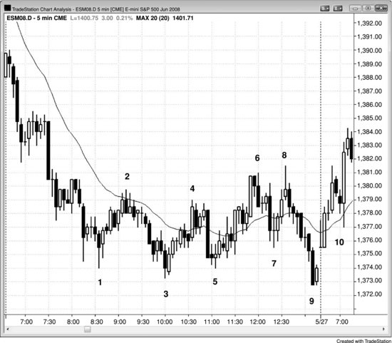
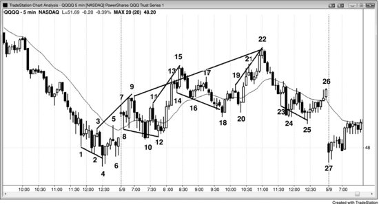
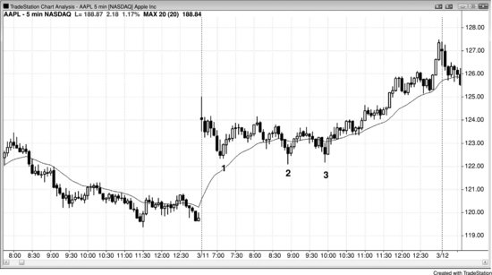
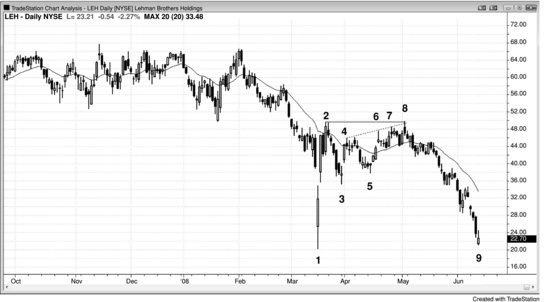
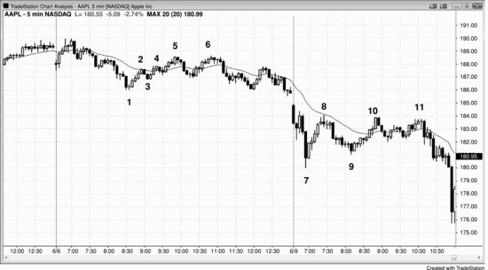
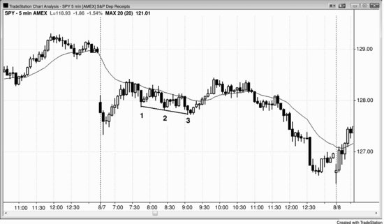
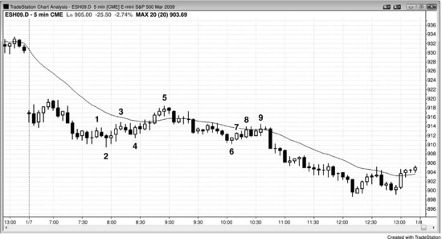
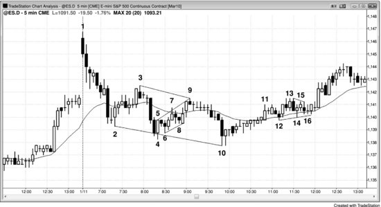
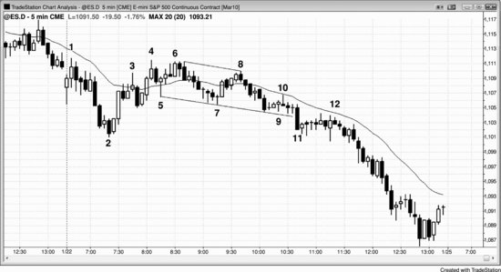

多头趋势中的回调就是牛旗，空头趋势中的回调就是熊旗。回调往往被一条收敛的趋势线和趋势通道线所夹。如果结构是水平的，就是三角形，可以向任一方向突破。但如果在多头趋势中向下倾斜，或在空头趋势中向上倾斜，就叫楔形——跟所有回调一样，通常 (60%+) 会沿趋势方向突破。楔形跟其他三角形一样至少有五段腿，不同之处在于第二段腿经常超过前一个波段点。它可以是简单的三连推楔形形态，也可以是急速之后的通道。它还可能呈现不规则的外观，看起来完全不像楔形，但只要有三次逆势推动，就足以归类为三角形——如果是倾斜的，就是楔形类三角形，或者直接叫楔形。

楔形**回调**是顺势建仓形态，交易员可以在第一个信号出现时就入场，也就是市场刚开始反转回到趋势方向的时候。楔形也可以是可靠的**反转**形态，但跟楔形回调不同，楔形反转是逆势建仓形态，所以通常 (60%+) 最好等二次入场点。比如，除非楔形顶非常强，否则交易员应该等空头突破出现，然后评估突破力度。如果突破强劲，再看是否形成了突破回调做空的建仓形态，有的话就可以做空。这个回调可以是更高的高点，也可以是更低的高点。如果突破很弱，交易员应该预期它会失败，然后找做多的建仓形态，在空头突破失败后入场做多，顺着多头趋势恢复的方向交易。

多头趋势中的楔形反转尖端朝上，这跟多头趋势中的楔形回调相反——楔形回调尖端朝下。空头趋势中的楔形底部尖端朝下，这跟楔形熊旗相反——楔形熊旗尖端朝上。楔形旗形通常 (60%+) 是较小的形态，大多持续大约 10 到 20 根K线。因为是顺势建仓形态，不需要形态完美，很多楔形旗形形态微妙，看起来完全不像楔形或任何三角形，但确实有三次回调。反转形态通常 (60%+) 需要至少 20 根K线，并且有清晰的趋势通道线，才有足够的力量反转趋势。

楔形也可以出现在交易区间中，这时通常 (60%+) 同时具备楔形旗形和楔形反转的特征。如果楔形本身够强、存在明确的双向交易，在第一个信号出现时入场通常 (60%+) 就能盈利。不过，只要有任何合理的疑虑，就等第二个信号再动手。楔形反转在第 3 册的趋势反转章节中有详细讨论。

楔形出现在趋势中的回调位置、随后趋势恢复时，它的突破就把逆势运动反转回了趋势方向。记住，楔形通常 (60%+) 标志着一段趋势的终结，而回调本身就是一段小趋势（只是方向跟大趋势相反），所以把楔形回调看作类似于楔形反转是合理的。一般来说，向右上方倾斜的楔形——不管是空头趋势中的回调还是多头趋势的顶部——都可以当作熊旗来看，哪怕之前没有空头趋势，因为它通常 (60%+) 会向下突破。原因在于，它的突破方式和突破后的跟随走势跟强空头趋势中的熊旗没有区别。向右下方倾斜的楔形，不管是真正的牛旗还是出现在空头趋势底部，都可以当作牛旗来看，通常 (60%+) 会向上突破。后面会讨论到，低 3 在功能上等同于楔形顶，实际上往往就是一个楔形；而高 3 应该按楔形底来交易。

强趋势有时会在盘中出现一个持续几个小时的三段式回调，动能不大。有时它表现为急速与通道形态，这是楔形回调的一种常见类型。通道的两条线经常是平行的，而不是楔形那种收敛形状，但仍然是可靠的顺势建仓形态。叫它回调、交易区间、三角形、旗形、三角旗、楔形还是别的什么都无所谓——具体形状不重要，所有这些回调变体的意义都一样。关键在于第三次摆动把逆势交易员套进了一笔糟糕的交易，因为他们误以为第三段腿是新趋势的开始。之所以会这样，是因为大多数回调以两段腿结束，每当出现第三段腿时，交易员就会怀疑趋势是不是已经反转了。

**图 18.1** 楔形熊旗与扩张三角形

强趋势之后往往跟着一个三段式摆动的回调，动能通常 (60%+) 较弱。在图 18.1 中，K线 4、6、8 是K线 3 创出新低之后三次回调的顶部，每一次都是多头趋势性波段（更高的低点和更高的高点）。由于大量K线与前一根K线重叠，很多K线带有影线，还有不少空头趋势K线，向上的动能很弱。这会促使交易员在每个新高处做空。

那里还形成了一个扩张三角形（K线 1、2、3、8 和 9）。做多的建仓形态是K线 9 之后的内包K线，但那已经是当天最后一根K线了。第二天开盘跳空高开，越过了信号K线的高点（遇到跳空高开不要买；只有当入场K线的开盘价低于信号K线高点，随后价格触及你的买入突破单时才应入场），因此直到第二天K线 10 的突破回调才出现入场机会。

**图 18.2** 楔形熊旗

如图 18.2 所示，K线 9、15 和 22 构成了一面大型熊旗，同时也是 5 分钟 QQQQ 图表上三段式波段序列的中间腿，整个过程跨越三天——先是一段空头趋势，接着三连推反弹，最后回测空头趋势的低点。虽然向上的动能看起来不错，但与之前那段空头趋势的幅度相比其实很弱，那个低点几乎一定会被回测。回测发生在第三天的开盘。上涨到K线 22 的楔形不过是一个大型熊旗，在 15 分钟或 60 分钟图表上很容易看出来。

K线 4 处的楔形反转尝试规模太小，无法引发主要趋势反转，交易员只能做剥头皮交易，而且要等到出现更高低点之后再入场。但K线 6 的更高低点出现得太晚，当天已经来不及交易了。

市场进入大型交易区间后，出现了很多楔形回调，带来了不少可以做剥头皮的机会。由于市场处于交易区间内，交易员可以在反转时直接入场，不必等第二次信号。但如果楔形比较陡峭，通常最好还是等一等。比如，K线 11、13 和 15 构成的楔形处于一条相当紧凑的多头通道中，有些交易员可能会选择在K线 17 高点下方做空，等待预期中的第二段下跌。

K线 14、16 和 18 在K线 15 强劲上涨之后形成了一个楔形牛旗，交易员可以在K线 18 上方买入。但因为它已经是连续第七根阴线，有些交易员更愿意等到K线 20 的更高低点上方再买入。

**图 18.3** 跳空高开与楔形牛旗

如图 18.3 所示，苹果（AAPL）的大幅跳空高开实际上相当于一段陡峭的多头腿（一个多头急速上涨）。之后出现了三次回调，第三次是一个失败的波段低点（未能跌破前一个低点）。为了简便，可以把它叫作楔形，尽管形态上并不典型。跳空高开是急速阶段，到K线 3 的横盘走势是回调，随后引出了多头通道。这是趋势恢复日的一种变体，只不过这里的第一段多头腿是开盘跳空。

### 对本图的深入讨论
如图 18.3 所示，交易员应该把从K线 3 入场的多头仓位的一部分或全部做成波段交易，预期大约会出现一个测量移动，幅度大致等于跳空急速段的高度（即前一天最后一根K线的低点到今天第一根K线的高点）。这个测量移动也可以是第一腿等于第二腿的类型，K线 3 就是第二段上涨的底部。

**图 18.4** 楔形熊旗

在图 18.4 中，雷曼兄弟控股（LEH）在K线 1 处出现了一个大型反转日，伴随巨大的成交量，被媒体广泛报道为强支撑和长期底部。

K线 8 是楔形回调（K线 4、6 或 7、8）的终点，也是一个小型三连推形态（K线 6、7、8）的终点。同时它还和K线 2 构成了双顶熊旗（K线 8 比K线 2 高出 24 美分，但在日线图上已经足够接近）。

K线 1 是一个卖出高潮——先急速下跌再急速上涨。之后市场通常会横盘整理，多头继续买入试图推动形成多头通道，空头继续卖出试图制造空头通道。这里空头赢了，多头不得不平掉多头仓位，进一步加大了抛压。股价很快跌破了巨大的K线 1 反转K线的低点，而 LEH 这家全美第三大投行在几个月内便倒闭了。

K线 1 是单K线岛形底的一个例子——前面有一个衰竭型缺口，后面有一个突破缺口。

**图 18.5** 楔形熊旗的更高高点突破回调

如图 18.5 所示，市场向上形成了到K线 6 的两段式回调，第一腿在K线 5 处结束。K线 5 是一个楔形，但跟常见的情况一样，实际上是两段走势，其中第二段又由两个更小的腿组成（K线 4 和 5）。到K线 1 的运动是一个小型急速上涨，然后K线 2、4 和 5 是通道中的三连推。从K线 5 开始的下跌是对多头通道的向下突破，而该突破之后的回调就是K线 6 处的更高高点。

从K线7开始，市场又出现了一个三推回调上涨。无论你把它看作一个三角形，还是两段式回调——第一段从K线7到K线8，第二段从K线9到K线11（其中第二段又包含两个更小的腿），都不影响操作。三推回调在趋势中很常见，有时本质上就是两段回调，只是第二段分成了两个更小的腿。想到头疼的时候，别再琢磨腿数了，只关注趋势本身以及市场始终无法明显站上均线这一事实。寻找做空入场机会，不要因为数腿数得犹犹豫豫，反而给自己找借口不下单。

**图 18.6** 急速与通道构成楔形牛旗

有时候，回调本身可以是一个小型急速与通道形态，从而形成楔形牛旗（见图 18.6）。这里，市场先出现了一波多头上涨，随后急速下跌到K线1，这是向下急速的第一推，之后又出现了两推下跌。急速之后的通道常以三推结束，这一次也不例外——最终形成了楔形牛旗，同时也是当天的一个更高低点。从K线3开始的第二段上涨，幅度大致等于从开盘低点起涨的那一段，构成一个第一段等于第二段的测量移动。

当第一推和第二推下跌都带有强劲动能时，不要急着在第二段下跌后的高2处买入。第一推下跌动能很强，往往意味着市场还会走出楔形回调。应该等高2信号K线（这里是K线2处的两K线反转）被突破后出现回调再入场。这个二次入场建仓形态可以是更高低点，也可以像这里一样是更低低点，形成楔形牛旗。

跟所有急速与通道形态一样，最小目标是通道的起点——也就是K线1之后的那个高点，而且空间足以做至少一笔多头剥头皮交易。市场超越了这个最小目标，测试了开盘那波上涨的高点，并在那里形成了一个大型双顶熊旗，引发了一波延续到收盘的空头趋势。

**图 18.7** 楔形旗形

三推回调经常能提供可靠的顺势入场机会（见图 18.7）。

K线1是一个低2，也是空头反弹中三推上涨的第一推。K线2的低点跌破了推动K线1上涨的那根K线的低点，这不影响判断。事实上，当最终旗形演变成更大形态时，这种情况很常见。这里，更大的形态就是一个三推上涨的空头反弹，在K线5处结束——K线5同时也是第一根均线缺口K线。它也可以看作一个小型急速与通道的多头趋势：到K线3的那段是急速，K线4到K线5是通道。小型急速与通道往往是两段式上涨，加上之前K线1那一推，这两段就构成了楔形熊旗的第二推和第三推。

开盘的向下跳空是一个空头急速，随后到K线2的下跌是通道。K线5测试了通道顶部，与之形成双顶。

K线7到K线9形成了一个三推回调，表现为一个略微上倾的窄通道，在均线处受阻。一般来说，只有经验非常丰富的交易者才应该考虑在窄交易区间中交易，因为窄交易区间很难判读，会降低任何一笔交易的成功概率。

K线9与K线6之前第四根K线形成了双顶熊旗，而那根K线正是空头急速之后空头通道的起点。

**图 18.8** 三推形态

图 18.8 是 5 分钟 Emini 图表，其中包含多个楔形回调。K线2、4、10的三推下跌构成了一个典型的楔形反转形态，但由于它出现在一个于K线1处见顶的多头趋势中，属于大幅回调，所以本质上是楔形回调。这段回调持续时间够长，足以构成一段小型空头趋势，但这段空头趋势不过是更大多头趋势中的回调而已。

K线5、7、9是通道内的三推上涨，是对K线3到K线4那段短暂而强劲的下跌的回调。画线时既可以用K线的极值点，也可以用实体的顶部或底部。楔形回调的形状经常不规则，趋势线和趋势通道线画得不那么精确才是常态。

K线12、14、16构成了三推下跌，形成了从K线10开始的上涨过程中的一段横盘回调。三角形也是三推形态的一种。注意K线13的高点超越了K线11的高点。第一推下跌之后的反弹经常会超过之前的波段高点。

一旦K线9变成空头反转K线，就可以用K线5的高点画一条最佳拟合趋势通道线，K线7的高点在线的上方也没关系。同样，当市场在K线10之后形成多头内包K线、确立了楔形底部的买入建仓形态时，可以连接K线2和K线10的低点来标示楔形，K线4第二推下跌跌破这条线也无所谓。

**图 18.9** 失败的楔形牛旗

图 18.9 中，5 分钟 Emini 试图形成楔形牛旗但失败了。K线5、7、9三推下跌，构成了楔形牛旗的做多建仓形态，但在K线9附近找不到可靠的信号K线来做多。如果成功，这里本应与K线3之后的回调构成双底。但市场没有形成强势多头反转建仓形态，反而进入了一个小型窄交易区间。K线11的向下突破标志着楔形底部的失败，同时带来了大约一个测量移动幅度的下跌预期。K线11成为了一波延续到收盘的空头通道的急速段。
