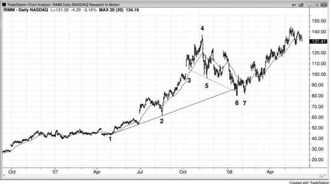
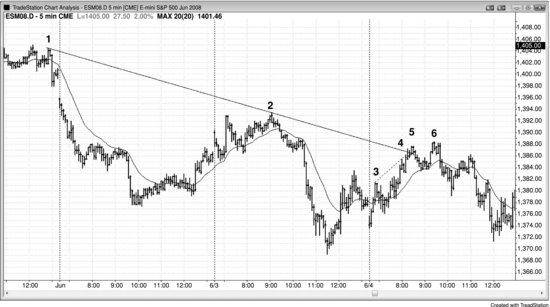
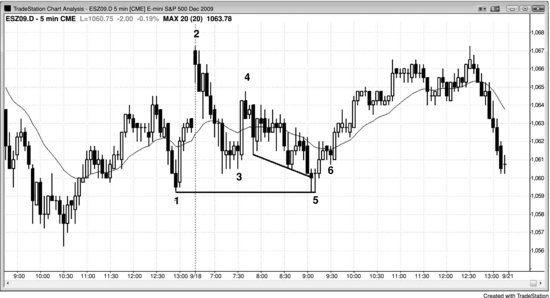

当回调被趋势通道线所包含，并在某条高时间周期的支撑或阻力线处终结时，就形成了对线形态。这种形态往往能带来一笔可靠的顺势交易。其本质是一段短期趋势（回调）在长期趋势的支撑（多头趋势中）或阻力（空头趋势中）处终结。所有回调最终都以对线形态收场，只是支撑或阻力线有时不那么容易辨认。任何类型的支撑或阻力都可能成为强势资金介入并终结回调的区域。每当交易员看到回调正在接近趋势线、趋势通道线、均线、前一个波段低点或高点，或其他关键价位时，都应保持警觉，留意可能终结回调、恢复趋势的入场形态。一旦出现这种入场形态，就有机会做一笔优质交易。要记住，交易越来越受数学驱动，回调的终结都是有原因的。多头趋势中的回调必然在某个支撑位终结，空头趋势中的回调必然在某个阻力位终结，因此所有回调本质上都是对线形态。不过，只有在交易员能识别出支撑或阻力的情况下，我才使用"对线"这个说法，这样他才能提前预判趋势恢复的可能，并据此下单交易。最可靠的形式是：回调走出通道形态且呈楔形或三连推结构，而信号K线是刺穿趋势线后反转的那根K线。举个例子，假设当前处于多头趋势，正在走一段楔形牛旗回调，即将在多头趋势线处终结——楔形牛旗下方的趋势通道线向下倾斜，与向上倾斜的多头趋势线恰好在回调形成买入信号时交汇。支撑线也可以是一条水平线，比如横穿前一个波段低点的水平线，这样在楔形结束时就可能形成双底买入信号。支撑也可以来自均线。出现这种情况时，只要有合适的入场形态，就应顺势入场。

再举一个例子：观察一段空头通道，看其中是否有一段向上的腿。如果有，再看这段腿是否具备三连推结构。如果这段小幅空头反弹正在测试空头趋势线，同时也在测试沿其高点画出的趋势通道线，那么这段向上的腿很可能（60%以上的概率）会终结，市场将反转向下测试通道下沿。如果市场确实在此处掉头向下，原因就在于两条阻力线同时受到测试——尽管一条上升、一条下降——两种阻力共同作用于市场，提高了盈利交易的概率。

**图 19.1** 对线回调

所有回调都以对线形态收场，即使长期支撑不那么容易看出来。回调是一段与大趋势方向相反的小趋势。所有回调的终结都有其原因，多头回调必然在某个长期支撑处终结，比如趋势线、测量移动目标位或前一个波段高点/低点。在图 19.1 中，通过K线 3 和K线 5 画出的空头趋势通道线为K线 6 提供了支撑。画趋势线和趋势通道线时，应该考虑所有波段点，包括来自之前趋势的波段点。K线 3 是多头趋势中的一个波段低点，K线 5 是可能正在形成的新空头趋势回调中的一个波段低点。下跌至K线 6 的走势最终只是多头市场中一段较大的两段式回调。K线 6 处出现了对线形态（一条多头趋势线和一条斜率相反的空头趋势通道线），市场在交叉点反转上涨，这是常见的情况。由于下跌至K线 6 的走势非常陡峭，等到K线 7 这个 HL 处的二次入场点再买入是合理的，用突破单挂在K线 7 高点上方一个 Tick。

空头趋势通道线也可以基于K线 4 高点之后的两个波段高点画出的趋势线，然后将其锚定在K线 5。关键是观察整体形状，选择任何能包住价格行为的趋势通道线，然后观察市场刺穿该线之后的反应。

### 本图深入讨论
K线 6 是图 19.1 中的楔形牛旗。在下跌至K线 6 之前还有一个双顶熊旗，而多头顶部之后的双顶熊旗可以视为一个有两个峰的 LH。

**图 19.2** 对线形态

如图 19.2 所示，K线 5 测试了空头趋势线，同时出现了一条较小的多头趋势通道线（从K线 3 到K线 4）的过冲，形成了一笔基于对线形态的做空剥头皮机会。K线 6 的名义 HH 处有一个二次入场点。由于上涨至K线 5 的走势很强，市场在跌破陡峭的多头通道并测试均线之后，在K线 6 的 HH 处出现突破回调，这并不意外。图中没有画出那条通道，但它就是K线 3 处多头急速之后紧跟的那段通道。

**图 19.3** 对线形态变体

图 19.3 是对线形态的一种变体：长期支撑以水平线形式出现在前一个波段低点处，形成了双底。这带来了一笔在当天新低处的反转做多机会，当天属于交易区间日。开盘后的抛售是一段空头急速，K线 4 到K线 6 的走势是一段通道。

### 本图深入讨论
在图 19.3 中，市场突破了一个波段高点，但今天的第一根K线是空头趋势K线，形成了一个失败突破做空的入场形态。这也是一个扩张三角形顶部，第一次向上推动可以取昨天太平洋时间上午 11:05 或 11:55 的K线。上涨至K线 4 是一段急速，随后出现了一个 LL 回调至K线 5，与K线 1 形成了双底牛旗。这带来了三个小时的上涨（K线 4 多头急速之后、从K线 5 开始的向上通道），随后在收盘前出现抛售。虽然这是交易区间日，但在日线图上看起来像空头趋势日，因为它在高点附近开盘、在低点附近收盘。
